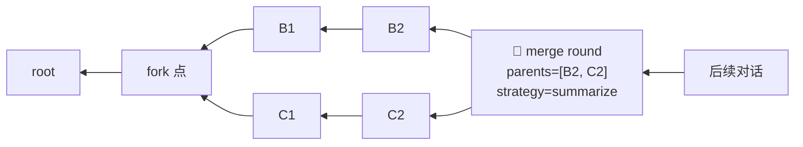
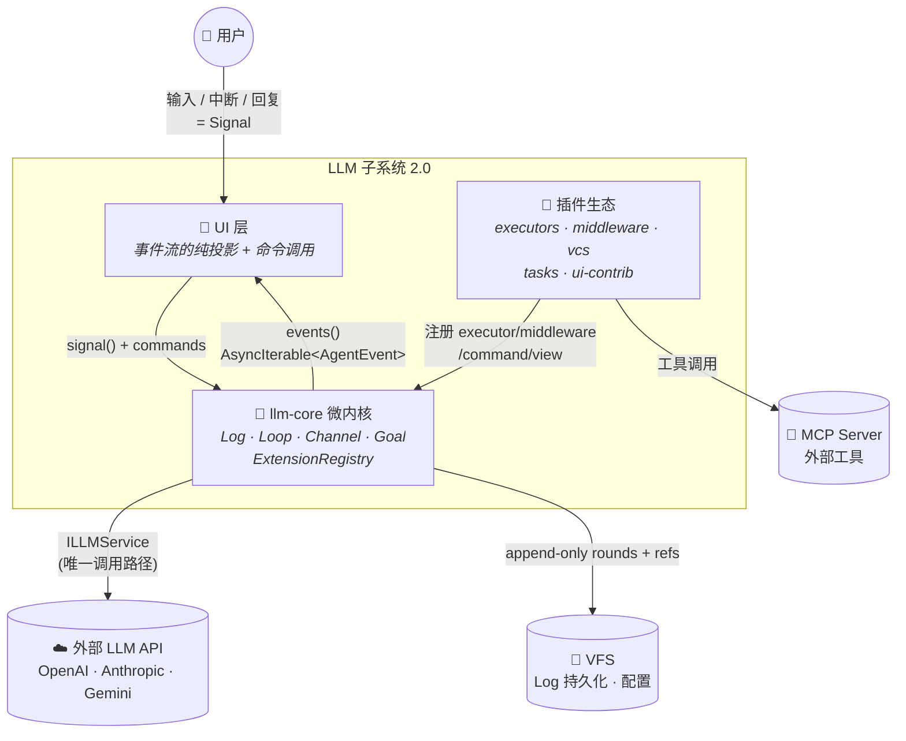
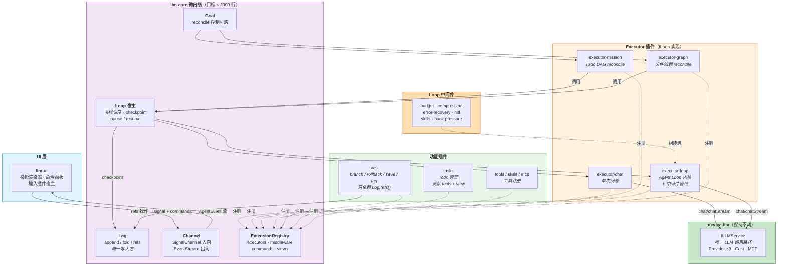
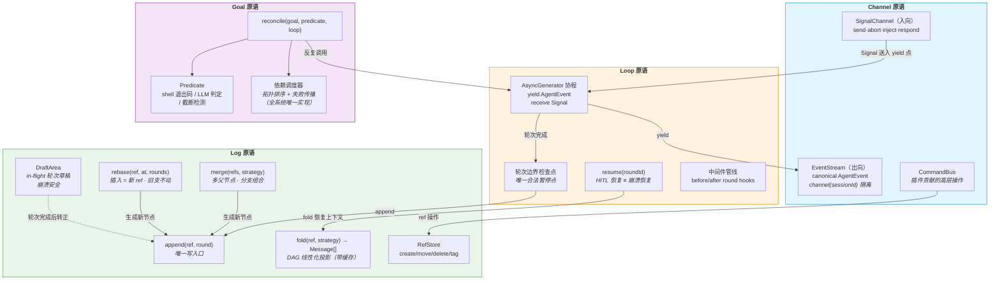

# LLM 子系统 2.0 — 四原语内核 + 插件框架设计

> 设计日期: 2026-07-13 | 最后更新: 2026-07-14（Dogfooding 强制执行：`executeTask()` 后备路径消除，LoopContext 补全，三条红线全部关闭）| 分支: v4.2
> 前置分析: [llm-design.md](./llm-design.md)（现状五包架构审查）
> 定位: 本文档是重构的**宪法**——定义不变的内核原语与扩展契约，现有功能全部归约为原语组合

---

## 实施进度

**S1~S12 全部完成，七病灶全部消除**（2026-07-14）。四原语内核 + 插件框架 + 外层契约 + Dogfooding 强制执行全部实施完毕。

| 阶段 | 状态 | 关键交付 | 剩余工作 |
|---|---|---|---|
| **S1** 统一 LLM 调用 | ✅ | `ILLMService` 成为 Agent Loop 路径唯一入口；`streamRaw()` 删除 | — |
| **S2** AgentEvent + ILoop | ✅ | canonical `AgentEvent` schema；`ILoop`/`ILoopMiddleware` 接口；`ExecutorRegistry` | — |
| **S3** Loop 协程 + 中间件 | ✅ | `drive()` 协程宿主接入 TaskRunner；`LoopExecutor`（AsyncGenerator ILoop）取代 UnifiedLoopStrategy；`chatExecutor`；6 个内置中间件；`SessionActor` 桥接；HarnessAdapter/UnifiedLoopStrategy 下线 | — |
| **S4** Log 收敛 | ✅ | `ChatEngineLog` 完整 ILog 实现（VFS DraftArea、ChatManifest RefStore、fold 缓存、merge 去重、rebase 结构）；`createSessionLogAdapter` → ChatEngineLog；RefStore 异步化；ChatManifest 新增 `tags`；**验收达成**：`LockManager`/`manifest-repair`/`ThrottledWriter` 已真正删除；`SessionState` 重新定位为合法的 ILog.fold() 投影缓存；旧 ID（`BBB_SSSSS_R`）→ ULID（`makeNodeId` 改用 `ulid()`） | — |
| **S5** Goal 统一 | ✅ | `IController`/`Goal`/`GoalNode`/`Predicate`/`Verdict` 接口（common）；`DependencyScheduler`（Kahn 拓扑 + 事件驱动）；`reconcile()` 算法；3 个内置 Predicate（truncation/shell/llm-judge）；**验收达成**：4 个控制回路全部切换至 reconcile()/DependencyScheduler 驱动；AutoContinue → `createTruncationDetectionMiddleware`；BackPressure 存根 → 真实实现；Mission → `reconcile()` + `SubAgentLoopAdapter` + `createMissionGoal`；SessionGraph → `executeWithReconcile()` + `AgentRuntimeLoopAdapter` + `createGraphGoal` | — |
| **S6a** 内核裁剪 | ✅ | llm-kernel 删除 15 个死代码文件（~60%）；`ExecutorType` 收缩为 `'agent'`；`initializeKernel` 简化；`executePlan()` 删除 | — |
| **S6b** @deprecated 清理 | ✅ | 删除 `CompletionAnalyzer` 文件 + `AutoContinueHandler` 类 + `executeSession()` 路径 + `orchestrator-interfaces.ts` + llm-harness 2 个死代码文件 + `autoContinue` 死配置管线 | — |
| **S6c** 内核收敛 + 适配器清理 | ✅ | `LLMKernelAdapter` + `UIEventAdapter` 删除；`executeTask()` 切换为 `ILLMService.chatStream()` 直连；`AgentExecutor` + `BaseExecutor` 物理删除（llm-kernel）；`DependencyGraph` 删除（`resolveDependencyTree()` 替代）；`auto-continue.ts` 删除；`HarnessAdapter` 解耦（`IHarnessContext` 服务定位器 + llm-ui 3 文件迁移） | — |
| **S7** 事件统一 | ✅ | ★ `SessionEvent` = canonical `AgentEvent` (15) + `MessageProjectionEvent` (3) + `SessionStructuralEvent` (8，含 regenerate) 替代 `OrchestratorEvent` (28)；`OrchestratorEvent` 类型已删除；`SessionEventBus` 直接接受 `SessionEvent`（无过渡期格式检测）；所有生产者（SessionManager、TaskRunner、HarnessAdapter、SessionActor）统一 emit `SessionEvent`；`HistoryView` / `SessionEventHandler` 旧事件 fallback 已清理；`EventBatchProcessor` 默认 chunkType/statusType 切换为 `message:updated`/`message:status`；`ClaudeCodeStrategy`（死代码）已删除；`HarnessStrategy` 已删除；`getHarnessAdapter()` 已删除 | — |
| **S8** llm-kernel 消除 | ✅ | ★ `@itookit/llm-kernel` 包消除 — `NodeStatus`/`ExecutorConfig`/`ExecutorType` 内联至 `llm-engine/core/types.ts`；`setKernelDeviceManager`/`getKernelDeviceManager` 迁移至 `llm-engine/core/device-registry.ts`（新建）；`initializeKernel()` inline 至 `initializeLLMEngine()`；所有 7 处 import 路径更新（llm-engine ×4、app-shell ×2、test ×1）；6 个 `package.json` 依赖移除（llm-engine、app-shell、web-app、tauri-app、demo）；3 个 `vite.config` alias 移除（web-app、tauri-app、demo）；`tsup.config.ts` external 清理 | — |
| **S9** 清理收尾 | ✅ | ★ `@itookit/llm-kernel` 包物理删除（源码 + dist + package.json + 配置）；`HarnessAdapter` 类删除（~370 行，`execute()` 从未被调用）；`IHarnessContext` 删除（`harness-context.ts`，从未被初始化）；`useClaudeCode`/`maxRounds` 死字段移除（`ExecutionOverrides`）；llm-ui 3 文件清理 `getHarnessContext()` 调用；SlashCommandRouter 删除 `buildHarnessSlashCallbacks`（~90 行）；`buildHarnessCallbacks`/`injectIntoRunningHarness` 简化为空实现；6 个 CLAUDE.md 文档更新 | — |
| **S10** AgentLoopExecutor → ILoop | ✅ | ★ `AgentLoopExecutor` while-true 循环 → `HarnessLoopExecutor`（AsyncGenerator ILoop, mode='harness'）；`harness-middleware.ts`（6 个 ILoopMiddleware 工厂，包装 BudgetController/ContextManager/ErrorRecoveryService/BackPressureValidator/HITLQueue/SkillService）；`ILoopMiddleware.onToolCalls` 钩子 + `ControlDirective.pause` action 统一 plan confirm / permission / HITL 暂停路径；loop-middleware 存根改为委托模式（接受可选 `harnessImpl`）；`HarnessMiddlewareSet` 允许外部注入；`app-shell/bootstrap.ts` 注册 `HarnessLoopExecutor` | — |
| **S11** Resume + LiteSubAgentRouter ILoop | ✅ | ★ `LoopExecutor.resume()` — 抽取 `executeLoop(ctx, startRound, initialRounds)`，`run()` 和 `resume()` 共享；`resume()` 从 `log.fold()` 重建消息 → 计数已完成轮次 → 重入循环；`resumeDrive()` — 调用 `loop.resume(checkpoint)` + `driveGenerator()`；`HarnessLoopExecutor.resume()` — 存储 `lastCtx`，基础重建后委托 `run()`；TaskRunner checkpoint 检测 — `log.draft().restore()` → `resumeDrive()` : `drive()`；★ `LiteSubAgentRouter` 迁移至 ILoop — 用 `LoopExecutor` + 手动驱动替代 `UnifiedLoopStrategy`；`createInMemoryLog()` + `createToolServiceAdapter()` + ILLMService connection/model wrapper；`loopFactory` 可选注入 | — |
| **S12** 外层架构 | ✅ | ★ `ISession` 接口 — `signal()` + `events()` 两个方法；`SessionManager implements ISession` — 51 方法门面降级为 Channel 原语 + CommandBus 命令；`DraftArea.setCurrent()` 接线 — `driveGenerator()` 在 `round:start` 处持久化 in-flight 轮次边界；canonical `AgentEvent` 补全 — 15→23 变体（`signal_resolved`、`log:ref_created/deleted/merged`、`budget:warning/exhausted`、`context:compressed`、`goal:progress`）；`ICommandBus` + `CommandBus` 实现（llm-engine 层）；`ILLMPlugin` + `ExtensionRegistry` + 3 个内置插件（session/vcs/history）；15 个 UI 文件迁移至 `commands.execute()` | — |

### 全部完成（S1~S12）

| 阶段 | 状态 | 关键交付 |
|---|---|---|
| S1~S9 | ✅ | 四原语内核（Log/Loop/Channel/Goal）+ 插件框架全部实施；llm-kernel 消除；事件统一；控制回路统一 |
| **S10** | ✅ | `AgentLoopExecutor` → ILoop 改造：`HarnessLoopExecutor`（AsyncGenerator ILoop, mode='harness'）、`harness-middleware.ts`（6 个 ILoopMiddleware 工厂包装现有服务类）、`ILoopMiddleware.onToolCalls` 钩子 + `ControlDirective.pause` action 统一 plan confirm / permission / HITL 暂停路径、loop-middleware 存根改为委托模式（`harnessImpl` 参数）、`HarnessMiddlewareSet` 外部注入接口 |
| **S11** | ✅ | `resume()` 实现 — `LoopExecutor.resume()` 从 Log 重建状态后重入循环、`resumeDrive()` 协程宿主、`HarnessLoopExecutor.resume()` 基础实现、TaskRunner checkpoint 检测 + resume 路径；`LiteSubAgentRouter` ILoop 迁移 — 用 `LoopExecutor` 替代 `UnifiedLoopStrategy` |
| **S12** | ✅ | 外层架构 — `ISession` 接口（`signal()` + `events()`）、`SessionManager implements ISession`（51→2 方法收缩）、`DraftArea.setCurrent()` 接线、canonical `AgentEvent` 15→23 变体补全、`ICommandBus` + `CommandBus` 实现、`ILLMPlugin` + `ExtensionRegistry` + 3 个内置插件（session/vcs/history）、15 个 UI 文件迁移至 `commands.execute()` |

**七病灶全部消除**：

| # | 病灶 | 解决阶段 |
|---|---|---|
| 1 | 三条 LLM 调用路径 | S1 + S6c |
| 2 | 双 Agent Loop | S3 + **S10** |
| 3 | 四份依赖调度 | S5 |
| 4 | 五套事件词汇 + 三个翻译层 | S2 + S7 |
| 5 | 三份事实源 | S4 |
| 6 | 六套外部干预机制 | **S10**（pause/resume 统一 + ControlDirective.pause） |
| 7 | 内部平台效应 | S6a + S8 + S9 |


## 外层架构 — S12 已完成

以下各项在设计文档第 4~7 节有详细定义。全部 7/7 项已在 S12 + Dogfooding 补丁落地：

| # | 项目 | 设计位置 | S12 状态 |
|---|---|---|---|
| 1 | **`ISession` 接口** | §4 Channel 原语 | ✅ `signal()` + `events()`；`SessionManager implements ISession` |
| 2 | **`DraftArea.setCurrent()` 接线** | §2.1 / loop-driver | ✅ 接口声明 + `driveGenerator()` 在 `round:start` 处调用 |
| 3 | **`ExtensionRegistry` + `IPlugin`** | §6 扩展系统 | ✅ `ILLMPlugin`/`ExtensionContext`/`IExtensionRegistry` 接口 + 实现 |
| 4 | **`ICommandBus`**（llm-engine 层） | §6.2 / §6.3 | ✅ 接口 + `CommandBus` 实现；51 方法 → 60+ 命令 |
| 5 | **SessionManager 瘦身** | §6.3 | ✅ `SessionManager implements ISession`；15 个 UI 文件迁移至 `commands.execute()` |
| 6 | **Dogfooding 强制执行** | §10 红线 2 | ✅ `processQueue()` 默认 mode 消灭后备路径；`LoopContext` 补全 connectionId/model/systemPrompt 等字段；chat/loop executor 消费新字段；`executeTask()` 及专属方法（~390 行）已物理删除 |
| 7 | **canonical AgentEvent 补全** | §4 / 03-channel.md | ✅ 15→23 变体：`signal_resolved`、`log:ref_created/deleted/merged`、`budget:warning/exhausted`、`context:compressed`、`goal:progress` |

---

## 目录

- [1. 动机：现状复杂度的病根](#1-动机现状复杂度的病根)
- [2. 本质抽象：四原语模型](#2-本质抽象四原语模型)
- [3. C4 架构图](#3-c4-架构图)
  - [C1 系统上下文图](#c1-系统上下文图)
  - [C2 容器图内核--插件](#c2-容器图内核--插件)
  - [C3 组件图四原语内核](#c3-组件图四原语内核)
  - [C4 代码级：协程式 Loop 序列图](#c4-代码级协程式-loop-序列图)
- [4. 内核契约](#4-内核契约)
- [5. 功能 → 原语映射（抽象有效性证明）](#5-功能--原语映射抽象有效性证明)
- [6. 插件体系](#6-插件体系)
- [7. 现有模块迁移映射](#7-现有模块迁移映射)
- [8. 演进路径（Strangler-Fig）](#8-演进路径strangler-fig)
- [9. 参考设计对照](#9-参考设计对照)
- [10. 架构纪律（三条红线）](#10-架构纪律三条红线)
- [11. 模块详细设计文档](#11-模块详细设计文档)

---

## 1. 动机：现状复杂度的病根

对现有五包（device-llm / llm-kernel / llm-harness / llm-engine / llm-ui）的审查结论：
**每个功能都发明了新机制，而不是归约到原语**。具体病灶：

| # | 病灶 | 表现 | 根因 |
|---|---|---|---|
| 1 | 三条 LLM 调用路径 | ~~kernel `AgentExecutor`（7 层栈）~~ **（S6c 已删除）**~~/ engine `LLMKernelAdapter`~~ **（S6c 已删除）** / harness `LLMServiceAdapter`（4 层栈）→ 现已统一为 `ILLMService` 单一入口 | 两根竞争的架构脊柱：设备驱动模型 vs 工作流引擎模型 → **已解决** |
| 2 | 双 Agent Loop | `UnifiedLoopStrategy` 与 `AgentLoopExecutor` 功能重叠，差异仅是能力集合 → **已解决（S10: HarnessLoopExecutor 统一）** | 循环逻辑与能力（Budget/压缩/HITL）未解耦 → 已解耦为 ILoopMiddleware |
| 3 | 四份依赖调度 | kernel `DagOrchestrator` / ~~`DependencyGraph`~~ **（S6c 已删除）** / `MissionScheduler` / `dependency-resolver` | 控制回路模式未被识别为原语 |
| 4 | 五套事件词汇 + 三个翻译层 | KernelEventMap(15) / AgentEventType(25) / ~~OrchestratorEvent(29+9)~~ → 已被 `SessionEvent` 替代（S7）/ EditorBusEvents(13)，约 91 个事件定义 | 无 canonical 事件 schema → **已解决（S7 基础设施）** |
| 5 | 三份事实源 | VFS ChatNode ↔ SessionState 内存副本 ↔ HistoryView DOM | 状态不是日志的投影，而是手工同步的副本 |
| 6 | 六套外部干预机制 | abort / inject / HITLQueue / onIntercept / request_input / SessionRecovery → **已解决（S10: pause/resume 统一 + ControlDirective.pause）** | 循环不是可暂停协程，暂停/恢复各自造轮子 → 已统一为 yield await_signal |
| 7 | 内部平台效应 | llm-kernel 的 Http/Script/Worker/CLI/StateMachine/PluginManager **（S6a 已删除）** + AgentExecutor **（S6c 已删除）** + **llm-kernel 包本身（S8 已消除）** | 抽象未赢得自己的客户（PluginManager 零插件）→ **已解决** |

补丁类代码（`manifest-repair` / `LockManager` / `renderFull` vs `processEvent` 双渲染）均是病灶 5 的直接代价。

---

## 2. 本质抽象：四原语模型

剥掉所有包和类，系统的本质只有 4 个原语：

```
┌────────────────────────────────────────────────────────────┐
│  Goal     控制回路 — 期望状态 + 完成谓词，反复调用 Loop 逼近   │
├────────────────────────────────────────────────────────────┤
│  Channel  会话即进程 — 入向信号 + 出向事件流，UI 是纯投影      │
├────────────────────────────────────────────────────────────┤
│  Loop     归约循环 — 协程：yield 事件、await 信号             │
│           轮次边界 = 检查点 = 唯一合法暂停点                  │
├────────────────────────────────────────────────────────────┤
│  Log      不可变历史 — append-only 轮次 DAG + refs           │
│           唯一事实源；状态 = fold(log, ref, strategy)        │
└────────────────────────────────────────────────────────────┘
```

### 2.1 Log — 状态存储的本质

对话不是"可变的消息列表"，而是 **append-only 的轮次 DAG + 可移动引用**（Round 可有多个 parent）：

- 任意时刻的"当前状态" = `fold(log, ref, strategy)` — 沿 ref 将 DAG 线性化的投影
- 分支 = 新 ref；回退 = 移动 ref；保存 = tag（命名 ref）；编辑 = 新 sibling 节点
- **合并 = 多父 merge 节点**：并发分支在某点组合，装配策略决定线性化方式
- **插入 = rebase**：不可变日志中不存在原地插入——从插入点建新 ref，下游节点 cherry-pick（可选级联重生成），旧支原封不动
- 崩溃恢复 = 重放日志
- 流式增量是**瞬时事件不入日志**，仅完成的轮次落盘（in-flight 草稿区保证崩溃安全）



**LLM merge 比代码 merge 简单**：代码合并需要冲突解决，对话合并只需要**上下文装配**——把多支历史线性化为一个 message 列表喂给 LLM。没有"冲突"概念，只有策略选择（concat / summarize-branches / pick）。Mission 的并行 subagent 结果组合，语义上就是一次 merge——`delegate` 产生分支，结果汇入 merge 节点。

> 参考: Git 对象模型（object 不可变 + ref 可动，merge commit = 多父节点）· Jujutsu（改写历史是一等操作，rebase 记入 oplog、旧支永远可回）· Event Sourcing（日志是真相，状态是缓存）· LangGraph Checkpointer（time-travel 是 append-only 的免费副产品）

### 2.2 Loop — 主执行流程的本质

Agent Loop 是一个**协程**，不是函数调用：

```typescript
run(context): AsyncGenerator<AgentEvent, Round[], Signal>
//                    ↑ yield 出去          ↑ next(signal) 送回来
```

- **轮次边界 = 检查点 = 唯一合法暂停点**（状态已被 Log 持久化）
- HITL、plan 确认、用户注入、abort、崩溃恢复——现状 6 套机制归约为**一套 pause/resume**
- 能力（Budget / 压缩 / 错误恢复 / HITL / Skill / BackPressure）是循环的**中间件**，不是循环的变体

> 参考: Temporal（workflow 可睡一个月再醒，暂停/崩溃恢复同一条代码路径）· LangGraph `interrupt()`（HITL = checkpoint 处暂停）· Erlang `gen_server receive`

### 2.3 Channel — 用户交互的本质

Session 是长生命逻辑进程（actor），UI 与它的全部交互只有两条通道：

```
入向: SignalChannel   send / abort / inject / respond / navigate(ref 操作)
出向: EventStream     canonical AgentEvent 流
```

- UI = `f(fold(log), 瞬时事件)` 的**纯投影**——全量渲染只是投影函数从头执行，不需要第二套渲染代码
- 高层功能通过**命令**暴露（插件贡献），不再堆积在门面类上

> 参考: Unix 进程模型（stdin/signals/stdout）· Actor mailbox · Elm 架构（view = f(state)）

### 2.4 Goal — 任务管理的本质

任务 = **期望状态 + 完成谓词**，控制器反复调用 Loop 并校验谓词，直到满足或放弃：

```
reconcile(goal, predicate, loop) → Verdict
```

现状 4 份实现（Mission / SessionGraph / AutoContinue / BackPressure）是同一控制回路的特化。

> 参考: Kubernetes reconcile（declared state → controller 逼近）· Claude Code 任务列表

---

## 3. C4 架构图

### C1 系统上下文图



### C2 容器图（内核 + 插件）



### C3 组件图（四原语内核）



### C4 代码级：协程式 Loop 序列图

展示一次含 HITL 暂停的消息流——注意 **HITL 暂停与崩溃恢复走同一条 resume 路径**：

```mermaid
sequenceDiagram
    autonumber

    actor User as 👤 用户
    box rgb(225, 245, 254) UI（纯投影）
        participant View as 投影渲染器
    end
    box rgb(243, 229, 245) llm-core
        participant Chan as Channel
        participant Loop as Loop 宿主
        participant Log as Log
    end
    box rgb(255, 243, 224) 插件
        participant Exec as executor-loop<br/>(协程)
        participant MW as 中间件管线<br/>budget→recovery→hitl
    end
    box rgb(200, 230, 201) device-llm
        participant LLM as ILLMService
    end

    User->>View: 输入消息
    View->>Chan: signal({type:'send', text})
    Chan->>Log: append(ref, userRound)
    Chan->>Loop: dispatch(executor='loop')

    activate Loop
    Loop->>Log: fold(ref) → 历史上下文
    Loop->>Exec: run(ctx) — 启动协程

    activate Exec
    loop 每轮 (round)
        Exec->>MW: beforeTurn hooks (budget 检查...)
        Exec->>LLM: chatStream(messages)
        LLM-->>Exec: chunk 流
        Exec-->>Chan: yield stream:content / tool:* 事件
        Chan-->>View: AgentEvent → 增量投影

        alt 工具需要人工确认 (HITL)
            Exec-->>Loop: yield {type:'await_signal', request}
            Loop->>Log: checkpoint(草稿轮次)
            Note over Loop,Exec: 协程在 yield 点挂起<br/>可无限期等待（状态已落盘）
            Chan-->>View: request_input 事件
            User->>View: 人工回复
            View->>Chan: signal({type:'respond', ...})
            Chan->>Loop: 送入信号
            Loop->>Exec: generator.next(signal) — resume
        else 崩溃后重启
            Note over Loop,Log: resume(lastCheckpoint)<br/>与 HITL 恢复同一代码路径
        end

        Exec->>MW: afterTurn hooks (back-pressure...)
        Exec->>Log: append(ref, assistantRound) — 检查点
    end
    Exec-->>Loop: return Round[] (协程结束)
    deactivate Exec

    Loop-->>Chan: yield finished(usage)
    deactivate Loop
    Chan-->>View: finished → 投影最终化
```

---

## 4. 内核契约

四个接口即内核的全部对外承诺（**唯二的硬契约是 `AgentEvent` schema 与 `ILoop` 签名**，其余可演化）：

```typescript
// ── 1. Log — single source of truth (append-only round DAG) ───
interface Round {
    id: RoundId;
    /** 1 parent = linear; 2+ parents = merge point. */
    parents: RoundId[];
    /** One user/assistant message group. */
    payload: Message[];
}

interface ILog {
    /** The only write entry. Streaming deltas do NOT go here. */
    append(ref: Ref, round: Round): Promise<RoundId>;
    /** State = linearized projection of the DAG, cached by (ref, strategy). */
    fold(ref: Ref, strategy?: AssemblyStrategy): Promise<Message[]>;
    /** branch/rollback/save/tag are all ref operations. */
    refs(): RefStore;
    /** Crash-safe area for the in-flight round. */
    draft(): DraftArea;
    /** Combine branches: creates a merge round whose parents are the ref tips. */
    merge(refs: Ref[], strategy: AssemblyStrategy): Promise<Ref>;
    /** Insertion in an immutable DAG: new ref with cherry-picked downstream
     *  rounds; the old branch stays intact. regenerate=true cascades
     *  re-generation of causally-invalidated downstream rounds. */
    rebase(ref: Ref, insertAfter: RoundId, rounds: Round[],
           opts?: { regenerate?: boolean }): Promise<Ref>;
}

/** LLM merge ≠ code merge: no conflicts, only context assembly. */
type AssemblyStrategy =
    | { type: 'concat'; order: 'topo' | 'timestamp' }   // topics don't overlap
    | { type: 'summarize-branches'; mainline: Ref }     // converge after parallel exploration
    | { type: 'pick'; rounds: RoundId[] };                // cherry-pick exact rounds

interface RefStore {
    create(name: string, at: RoundId): Ref;
    move(ref: Ref, to: RoundId): void;        // rollback = move backwards
    tag(name: string, at: RoundId): void;     // save = named immutable ref
    delete(ref: Ref): void;
    list(): Ref[];
}

// ── 2. Loop — pausable coroutine ─────────────────────────────
interface ILoop {
    readonly mode: string; // 'chat' | 'loop' | 'mission' | 'graph' | ...
    /** Yields events out; receives signals at yield points.
     *  Round boundary = checkpoint = the only legal pause point. */
    run(ctx: LoopContext): AsyncGenerator<AgentEvent, Round[], Signal>;
    /** HITL-resume and crash-resume share this single path. */
    resume(checkpoint: RoundId): AsyncGenerator<AgentEvent, Round[], Signal>;
}

interface ILoopMiddleware {
    readonly name: string;
    beforeTurn?(ctx: RoundContext): Promise<void | ControlDirective>;
    afterTurn?(ctx: RoundContext, result: RoundResult): Promise<void | ControlDirective>;
    onError?(ctx: RoundContext, error: Error): Promise<RecoveryAction>;
}

// ── 3. Channel — session as process ──────────────────────────
interface ISession {
    readonly id: string;
    /** All user interaction reduces to signals. */
    signal(s: Signal): void;   // send | abort | inject | respond | navigate
    /** The single outbound event stream UI projects from. */
    events(): AsyncIterable<AgentEvent>;
}

type Signal =
    | { type: 'send'; text: string; attachments?: Attachment[] }
    | { type: 'abort' }
    | { type: 'inject'; text: string }
    | { type: 'respond'; requestId: string; response: unknown }
    | { type: 'navigate'; ref: Ref };

// ── 4. Goal — control loop ───────────────────────────────────
interface IController {
    /** Repeatedly invoke loop until predicate satisfied or budget spent.
     *  Mission / SessionGraph / AutoContinue / BackPressure are all configs of this. */
    reconcile(goal: Goal, predicate: Predicate, loop: ILoop): Promise<Verdict>;
}

interface Goal {
    /** Desired-state nodes with dependencies — the ONE dependency scheduler. */
    nodes: GoalNode[];
    edges?: Array<[string, string]>;
}

type Predicate = (result: RoundResult) => Promise<Verdict>;
type Verdict = { status: 'done' | 'retry' | 'hitl' | 'failed'; feedback?: string };
```

**Canonical 事件 schema**（消灭 5 套词汇 + 3 个翻译层）：

```typescript
type AgentEvent =
    // lifecycle
    | { type: 'round:start' | 'round:end'; roundId: RoundId }
    | { type: 'finished'; usage: TokenUsage }
    | { type: 'error'; error: SerializedError }
    // streaming (transient — never written to Log)
    | { type: 'stream:thinking' | 'stream:content'; delta: string }
    // tools
    | { type: 'tool:queued' | 'tool:running' | 'tool:success' | 'tool:error'; call: ToolCallInfo }
    // pause protocol (unifies HITL / plan-confirm / request_input)
    | { type: 'await_signal'; request: PauseRequest }
    // log mutations (UI re-projects on these)
    | { type: 'log:appended' | 'log:ref_moved'; ref: Ref };
```

UI 消费规则：`视图 = f(fold(log), 瞬时事件)`。收到 `log:*` 事件时重新投影对应区域；`stream:*` 事件仅做临时增量，轮次完成后被 `log:appended` 的权威数据覆盖——**全量渲染与增量渲染是同一个投影函数**。

---

## 5. 功能 → 原语映射（抽象有效性证明）

现有 `SessionManager` 30+ API 及各编排系统，全部约化为四原语组合，无一例外：

| 现有功能 | 原语表达 |
|---|---|
| `sendMessage` | `log.append(user)` + `loop.run(ref)` |
| `abort` | `channel.signal(abort)` |
| `regenerate` | `refs.move(ref, 回移一格)` + `loop.run(ref)` |
| `commitEdit` | `log.append(sibling)` + `refs.move` |
| `switchToSibling` / `switchBranch` | `refs.move` |
| `createBranch` / `deleteBranch` | `refs.create` / `refs.delete` |
| **git 式保存 / 回退 / tag（新增）** | `refs.tag` / `refs.move` —— **免费副产品** |
| **并行探索后组合（新增）** | N 个 ref 并发 `loop.run` + `log.merge(refs, strategy)` |
| **节点间插入（新增）** | `log.rebase(ref, at, rounds)` —— 新 ref，旧支可回；`regenerate` 级联重生成 |
| HITL 响应 / plan 确认 | `channel.signal(respond)` → 协程 resume |
| 用户中途注入 (`inject`) | `channel.signal(inject)` → yield 点消费 |
| `SessionRecovery` | `loop.resume(lastCheckpoint)` —— 与 HITL 同路径 |
| `exportToMarkdown` | `fold(log)` 的另一个投影函数 |
| Token / Cost 统计 | 事件流的聚合投影 |
| AutoContinue（截断续写） | `Goal`: predicate = TruncationDetector |
| BackPressure（shell 校验） | `Goal`: predicate = shell 退出码 |
| Mission | `Goal`: Todo DAG + verifier LLM predicate |
| SessionGraph | `Goal`: 文件 DAG + CompletionAnalyzer predicate |
| Budget / 压缩 / 错误恢复 | `ILoopMiddleware` |

此表同时是框架 API 的设计蓝图：**内核只暴露原语，每一行都是插件贡献的 command**。

---

## 6. 插件体系

### 6.1 扩展点清单

| 扩展点 | 契约 | 首批消费者（Rule of Three 验证） |
|---|---|---|
| `executors` | `ILoop` | chat / loop / mission / graph（4 个） |
| `loop.middleware` | `ILoopMiddleware` | budget / compression / recovery / hitl / skills / back-pressure（6 个） |
| `commands` | `(args) => Promise<unknown>` | vcs 全部操作 / regenerate / export（10+ 个） |
| `tools` | 现有 `IToolService` | 已有注册表，保持 |
| `views` | 投影函数 | history / tasks 面板 / cost 仪表板（3 个） |
| `predicates` | `Predicate` | truncation / shell / LLM-judge（3 个） |

每个扩展点都有 ≥3 个真实消费者——不是投机性抽象。

### 6.2 插件示例：vcs（你要的 git 式管理）

```typescript
// vcs plugin — depends ONLY on Log.refs(), never touches the kernel loop
export const vcsPlugin: IPlugin = {
    name: 'vcs',
    activate(ctx: ExtensionContext) {
        const refs = ctx.log.refs();
        ctx.commands.register('vcs.branch.create', ({ name, at }) => refs.create(name, at));
        ctx.commands.register('vcs.rollback',      ({ ref, to }) => refs.move(ref, to));
        ctx.commands.register('vcs.save',          ({ name, at }) => refs.tag(name, at));
        ctx.commands.register('vcs.merge',         ({ refs: r, strategy }) => ctx.log.merge(r, strategy));
        ctx.commands.register('vcs.rebase',        ({ ref, at, rounds, regenerate }) =>
            ctx.log.rebase(ref, at, rounds, { regenerate }));
        ctx.commands.register('vcs.log',           () => refs.list());
    },
};
```

### 6.3 SessionManager 的瘦身

```
现在:  UI → SessionManager.createBranch/deleteMessage/export/... (30+ 方法门面)
目标:  UI → commands.execute('vcs.branch.create', args)  ← 插件贡献
       Session 仅剩: signal() + events()  (2 个方法)
```

---

## 7. 现有模块迁移映射

| 现有模块 | 归宿 | 说明 |
|---|---|---|
| `device-llm` 全部 | **保持不动** | 边界干净；`ILLMService` 成为唯一 LLM 调用路径 |
| `ChatEngine` + `ChatNode` + `Manifest` | → **Log 原语实现** | 数据模型已同构于 git，80% 现成；补 DraftArea + 单写入方约束。**ID 方案变更**：`BBB_SSSSS_R` 位置编码只能表达线性分支 → 改为随机 ID + `parents[]` 指针（多父 merge 必需），分支号降级为 ref 元数据 |
| `SessionState` / `ThrottledWriter` / `LockManager` / `manifest-repair` | **删除** | 三份事实源收敛后，双写补丁失去存在理由 |
| harness `AgentLoopExecutor` | → **executor-loop 的协程内核** | 以它为基座（功能最全），改造为 AsyncGenerator |
| `UnifiedLoopStrategy` / `ClaudeCodeStrategy` | **删除** | = executor-loop + `[budget, recovery]` 两个中间件的预设 |
| harness `Budget/Context/ErrorRecovery/BackPressure` | → **ILoopMiddleware ×4** | 已是独立类，改接口即可 |
| `HITLQueue` / `inject()` / `onIntercept` / `SessionRecovery` | → **协程 pause/resume 一套机制** | 6 → 1 |
| `MissionScheduler` + `GraphOrchestrator` + `dependency-resolver` + kernel `DagOrchestrator` | → **Goal 原语 + 唯一依赖调度器** | 4 → 1 |
| `AutoContinueHandler` / `TruncationDetector` / `CompletionAnalyzer` | → **Predicate ×3** | 控制回路的谓词配置 |
| kernel `AgentExecutor` 流式解析 | **已删除（S6c）** | LLM 调用统一走 `ILLMService.chatStream()` |
| kernel `Http/Script/Worker/CLI/StateMachine/PluginManager` | **已删除（S6a）** | YAGNI 裁剪，经使用审计零产品消费者 |
| 5 套事件 + `UIEventAdapter` / `HarnessAdapter` 翻译层 | → **canonical AgentEvent** | `UIEventAdapter` 已删除（S6c）；`HarnessAdapter` 仍用于事件翻译，UI 已通过 `IHarnessContext` 解耦（S6c） |
| `VFSAgentService` / `PromptHistoryService` | → 独立功能插件 | 只依赖 VFS + commands |
| llm-ui 输入插件 (`Mention/Slash/History...`) | **保持** | 本代码库唯一活着的插件机制，模式推广到执行层 |

---

## 8. 演进路径（Strangler-Fig）

**禁止 framework-first 大爆炸**。每步独立有收益，边界稳定后才拆包：

| 阶段 | 动作 | 消除的病灶 | 验收标准 | 状态 |
|---|---|---|---|---|
| **S1** | 统一 LLM 调用为单一 `ILLMService`（短路 kernel 7 层链路） | 病灶 1 | 全部 chat 流量走 4 层栈 | ✅ |
| **S2** | 定义 `AgentEvent` + `ILoop` 两个硬契约；现有 4 条执行路径包装为 executor | 病灶 4 | UI 只消费一套事件；翻译适配器删除 | ✅ |
| **S3** | Loop 中间件化：创建 `LoopExecutor`（AsyncGenerator ILoop）+ 6 个中间件 + `SessionActor` 桥接；接入 `ExecutorRegistry` + `drive()`；`UnifiedLoopStrategy`/`HarnessAdapter` 下线 | 病灶 2、6 | 双 loop → 1；pause/resume 一套机制；ExecutorRegistry 驱动 | ✅ |
| **S4** | Log 收敛：ChatEngine 升级为 Log 原语，单写入方 + 投影缓存；删除 SessionState 双写 | 病灶 5 | `manifest-repair`/`LockManager` **真正删除**；旧 ID 方案全量迁移至 ULID | ✅ |
| **S5** | Goal 统一：唯一依赖调度器 + Predicate 化 4 个控制回路 | 病灶 3 | 4 份调度**实际切换**到 DependencyScheduler：Mission→reconcile()、SessionGraph→executeWithReconcile()、AutoContinue→TruncationDetectionMiddleware、BackPressure→真实 middleware | ✅ |
| **S6a** | 内核裁剪：删除 llm-kernel 15 个死代码文件；`ExecutorType` 收缩为 `'agent'`；`initializeKernel` 简化 | 病灶 7 | 死代码占比从 ~60% → 0；llm-kernel 编译通过 | ✅ |
| **S6b** | @deprecated 清理：删除 `CompletionAnalyzer` + `AutoContinueHandler` + `executeSession()` + `orchestrator-interfaces.ts` + dead config pipeline | 病灶 3、4 | 4 文件删除 + ~265 行代码块删除；`autoContinue` 死配置管线清零 | ✅ |
| **S6c** | 内核收敛 + 适配器清理：`LLMKernelAdapter`/`UIEventAdapter`/`AgentExecutor`/`BaseExecutor`/`DependencyGraph`/`auto-continue.ts` 删除；`executeTask()` → `ILLMService.chatStream()`；`HarnessAdapter` → `IHarnessContext` 解耦 | 病灶 1、7 | 6 文件删除 + 15 文件修改；llm-kernel 退化为最小外壳；LLM 调用全路径统一为 `ILLMService` | ✅ |
| **S7** | `OrchestratorEvent` → `SessionEvent` 全面替换 | 病灶 4 | `OrchestratorEvent` 类型删除；全部生产者迁移至 `SessionEvent`；UI 旧 fallback 清理；`EventBatchProcessor` 升级；`ClaudeCodeStrategy`/`HarnessStrategy`/`getHarnessAdapter` 删除 | ✅ |
| **S8** | `llm-core` 拆包 → llm-kernel 消除 | 病灶 7 | `@itookit/llm-kernel` 包物理删除；所有符号迁移至 llm-engine 或删除；6 个 package.json + 3 个 vite.config 清理 | ✅ |
| **S10** | `AgentLoopExecutor` → ILoop 改造 + 中间件抽取 | 病灶 2、6 | `HarnessLoopExecutor`（AsyncGenerator ILoop, mode='harness'）；`harness-middleware.ts`（6 个 ILoopMiddleware 工厂）；`ILoopMiddleware.onToolCalls` + `ControlDirective.pause` 统一暂停路径；loop-middleware 委托模式；S1~S10 全七病灶消除 | ✅ |
| **S11** | `resume()` 完整实现 + LiteSubAgentRouter ILoop 迁移 | 病灶 2（收尾） | `LoopExecutor.resume()` + `resumeDrive()`；TaskRunner checkpoint 检测；`LiteSubAgentRouter` 用 `LoopExecutor` 替代 `UnifiedLoopStrategy`；`UnifiedLoopStrategy` 零消费者 | ✅ |
| **S12** | 外层架构：`ISession` 接口 + `ICommandBus` + SessionManager 降级 + AgentEvent 补全 | 外层契约 | `SessionManager implements ISession`（51→2 方法收缩）；`DraftArea.setCurrent()` 接线；AgentEvent 15→23 变体；`ICommandBus`/`CommandBus` + `ExtensionRegistry` + 3 内置插件；15 个 UI 文件迁移至 `commands.execute()` | ✅ |

---

## 9. 参考设计对照

| 参考 | 借鉴的核心思想 | 落点 |
|---|---|---|
| **VS Code** | 微内核 + Contribution Points；**内置功能必须走公开插件 API**（dogfooding） | ExtensionRegistry；chat/loop 也走 `ILoop` 注册 |
| **Git** | 不可变对象 + 可移动 refs；merge commit = 多父节点 | Log 原语；vcs 插件；`merge()` |
| **Jujutsu (jj)** | 改写历史是一等操作：rebase 记入 oplog，旧支永远可回 | `rebase()` 产生新 ref，因果失效显式化（stale 标记 / 级联重生成） |
| **Event Sourcing** | 日志是真相，状态是投影 | `fold(log, ref)`；删除三份事实源 |
| **LangGraph** | Checkpointer 与 runtime 分离；`interrupt()` = checkpoint 暂停 | Loop 检查点；HITL 统一 |
| **Temporal** | 暂停/恢复/崩溃恢复同一代码路径 | `resume(roundId)` 单一入口 |
| **Kubernetes** | 声明式期望状态 + reconcile 控制回路 | Goal 原语；Mission/Graph 收敛 |
| **Erlang/OTP** | 进程 + mailbox；交互即消息 | Channel 原语；Signal 类型 |
| **Elm/Redux** | UI = f(state)，单向数据流 | 投影渲染；消灭双渲染路径 |
| **ASP.NET Core / tower** | 能力即中间件管线 | ILoopMiddleware |

反面教训（同样重要）：

| 反例 | 教训 | 对应红线 |
|---|---|---|
| 本库 `llm-kernel PluginManager` | 扩展点未对准变更轴 → 零插件 | Rule of Three |
| Eclipse/OSGi | 内置功能特权路径 → 插件 API 二等公民 | dogfooding |
| Emacs | 无边界扩展 → 插件间隐式耦合 | 插件只依赖内核契约 |

---

## 10. 架构纪律（三条红线）

1. **不先建框架**。顺序：定两个硬契约（`AgentEvent` + `ILoop`）→ 包装现有路径 → 抽中间件 → 最后才建注册表和拆包。framework-first 是第二次 llm-kernel 悲剧的配方。✅ S12 服从：插件框架在 S1~S11 内核稳定后才落地。
2. **内置吃自己的狗粮**。chat/loop 必须走 `ILoop` 注册，内核对内置功能零特权路径。✅ session/vcs/history 插件通过 `ICommandBus.register()` 注册，与第三方插件使用同一 API。✅ `executeTask()` 后备路径已物理删除（`LoopContext` 补全 LLM 配置字段 + `processQueue()` 默认 mode）——所有调用路径统一走 `ILoop` 协程协议。
3. **不做进程隔离/沙箱**。当前全部插件是第一方代码，进程内注册表足够；extension host 隔离是第三方生态的需求（YAGNI）。

---

## 11. 模块详细设计文档

各模块的深度设计（数据结构、算法、状态机、迁移映射、开放问题）拆分至 `llm-2/` 子目录：

| 文档 | 模块 | 核心内容 |
|---|---|---|
| [01-log.md](./llm-2/01-log.md) | **Log 原语** | 四不变式 · Round/Ref 结构 · ULID ID 方案 · fold/merge/rebase 算法 · DraftArea · VFS 布局 · ChatEngine 迁移 |
| [02-loop.md](./llm-2/02-loop.md) | **Loop 原语** | 协程协议（5 条规则）· 轮次状态机 · 六机制归一的 pause/resume · 中间件管线 · 6 个内置中间件规格 |
| [03-channel.md](./llm-2/03-channel.md) | **Channel 原语** | Session 生命周期状态机 · Signal×状态语义矩阵 · canonical AgentEvent 全集（~22 个，权威/瞬时分类）· CommandBus |
| [04-goal.md](./llm-2/04-goal.md) | **Goal 原语** | reconcile 算法（事件驱动）· 唯一 DependencyScheduler · 3 个内置 Predicate · 4 个现有控制回路的配置化表达 |
| [05-extension.md](./llm-2/05-extension.md) | **扩展系统** | IPlugin/ExtensionContext 契约 · 6 扩展点 · vcs/tasks 插件详设 · dogfooding 执行机制 |
| [06-executors.md](./llm-2/06-executors.md) | **Executor 插件 ×4** | 分发规则 · chat/loop(lite/full 预设)/mission(三阶段+ref 化规划)/graph 规格 · 删除清单 |
| [07-ui.md](./llm-2/07-ui.md) | **UI 投影层** | project() 统一渲染管线 · DAG 泳道可视化 · 命令面板 · 现有 llm-ui 迁移映射 |

阅读顺序建议：01 → 02 → 03（三个基础原语）→ 04 → 06（执行层）→ 05 → 07（扩展与呈现）。
