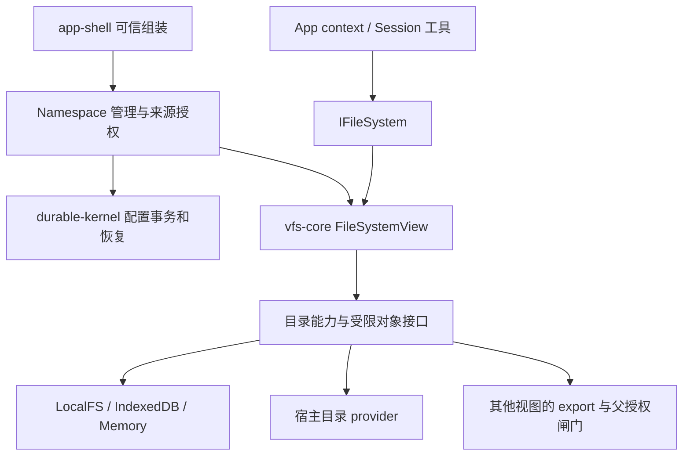

# VFS 重构：系统存储、用户数据与可组合文件视图

> ⚠️ 已归档：本迁移提案已作废（以 `IModuleFS`/`moduleId` 为核心，相关接口已删除）。当前规范见 `../design/VFS-design.md`、`../design/vfs-c4-review.md`。

> 2026-09-07 最终决策：旧数据和旧表结构直接作废，无迁移/兼容入口；Session 数据是 session.seq、history.seq、attachments、kernel，运行时投影 /history 和 /attachments。下文历史迁移提案不再执行。
> 历史方案：本文保留演进依据，不再作为当前接口规范。最新目标、旧入口删除范围与验收以 [C4 设计审查](vfs-c4-review.md) 为准；其中单用户每 Session 一条挂载配置取代独立 namespace/binding/grant/export 四套主记录，不再保留 moduleFS/customEngine 源码兼容入口。实际实现状态见 [实现进度](vfs-implementation-status.md)。

状态：历史方案，已由上述最终决策取代；下文的旧迁移步骤和接口草案不作为当前待办。2026-09-08 核对：当前实现及未完成验收见 [实现进度](vfs-implementation-status.md)，当前接口见 [C4 设计审查](vfs-c4-review.md)。

实际接口、验证结果与剩余差异见 [实现进度与接口](vfs-implementation-status.md)。下文第 11 节仍是目标契约，不能将其中全部声明视为当前可调用 API。

消费端实现兼容、app-shell/llm-ui 修改清单及其他依赖方迁移见 [VFS 消费端迁移与兼容方案](vfs-consumer-migration.md)。

基于 [原 Session FS 设计](vfs-session-fs.md) 和当前工作区代码审查；工作区已有未提交实现变更，本文描述读取时的状态，不代表某个已发布版本。后续实现以进度文档记录为准。

本文建议替换旧设计中的模块中心抽象、chat 私有存储布局及第 23 节接口；保留其宿主授权、受限 IO、复合文件、配置 CAS、撤权 draining 与恢复要求。跨 Session IPC 是独立协议，本次不借文件系统重构重新实现它。涉及下面标记的产品选择，采用暂定默认值，尚未视作用户确认。

## 1. 核心结论

1. 将系统配置、持久运行状态、临时状态、用户文件分开。chat 是应用，不应继续同时充当用户文件目录和 kernel 存储所有者。
2. 应用面向通用 `IFileSystem`，通过 `context.fs` 获取当前视图。SessionFS 是绑定 Session 的这种视图，不再让应用围绕 `getEngine(moduleId)` 找文件。
3. 挂载来源统一为已授权的目录能力。存储目录、宿主目录、另一个视图导出的目录都可挂载，目标始终是当前视图的路径。
4. 应用可以直接使用 SessionFS，也可以创建自己的组合视图，以 SessionFS 导出作为根，再挂其他 Session 导出或宿主目录。它不修改被挂载 Session 的配置。
5. 通用 `FileSystemView`、目录能力、挂载解析属于 `vfs-core`；Session 身份、持久绑定、授权变更与恢复属于 kernel 和集成层。不新增另一套 Session 文件系统引擎。

“更直接”来自统一消费者接口和挂载来源，不是把所有持久状态开放成普通可写文件，也不是让每个应用必须先创建一个 durable Session 才能访问文件。

## 2. 当前实现审查

| 当前代码 | 已有机制 | 重构含义 |
| --- | --- | --- |
| `ScopedView.ts` | `/` 映射 `/module/<id>`，硬编码透出 `/etc`、`/dev` | 已有粗粒度系统目录区分，但没有独立可配置命名空间；挂载策略不应由 module 名称决定 |
| `access-controller.ts` | caller 是 moduleId/isSystem；隐藏路径、跨模块权限按目录和模块注册表判断 | 不是 Session/App 权限；`isSystem` 提前返回也跳过扩展 policy，不能复用为普通视图授权 |
| `ModuleContext.ts` | 默认以模块根选择 backend/records；支持少量 root override | CRUD 可按路径进入其他 backend，records 却绑定模块 backend；异构挂载必须按 owner 路由 metadata |
| `ModuleContext.toRealPath` | 兼容接受 `/module/<自身 id>/...` | 新视图不能继承这种内部路径入口；路径只在接收视图内解释 |
| `ModuleDriver.ts` | read/list/write 部分操作显式检查 access；stat/exists/walk 等路径不统一进入同一检查 | 不能将现有 ModuleFS 直接包装成可靠权限边界，必须审查全部操作入口 |
| `MountService.ts` | 全局 backend 挂载、最长前缀路由；unmount 直接 close backend | 可参考解析算法，但生命周期不适合多视图共享来源；需要引用计数与来源所有权 |
| `VFSEngine.listChildren` | 枚举选中 backend 的目录 | 不合成挂载父目录，不形成完整 namespace 遍历语义 |
| `ModuleDriver.on/onAny` | 按事件 moduleId 过滤 | 两个视图共享同一文件时不能按调用模块隔离事件，应按来源对象投影 |
| `ModuleDriver._readCache` | 按真实路径缓存，部分写入本实例失效 | 多视图和外部编辑需要版本或源事件失效；不能假设本实例是唯一写者 |
| `File.ts`、`EnginePort.ts` | FileHandle 依赖 IModuleFS；能力类端口仍含 moduleId、VFSEngine、单 backend | 可复用对象行为，但需要解除模块及全局 engine 耦合 |
| `core/types.ts` | FSNode 有 path/version，没有通用 id；ModuleContext 明确拒绝非路径输入 | 旧设计 `openFile(node.id)` 与实现不符；不要以改名方式假装已有稳定对象 ID |
| `app-shell/bootstrap.ts` | 工具以 basename 全局搜索，读写可能选首项，list 用 includes | 必须改成注入视图后的精确路径访问，这是实际消费端迁移，不只是新增 core 类 |
| `durable-kernel/domain/types.ts` | ResolvedStorageBinding 使用 IModuleFS + rootPath | kernel 存储也被模块类型耦合；应依赖所需的文件/事务记录能力 |

上述是静态审查发现，不是已运行攻击测试的漏洞结论。尤其 metadata、asset、refs、seq、插件、设备、事务及异常吞掉的行为，需要完整接口验收；只给 CRUD 加一个 path mapper 不够。

## 3. 数据分类与推荐布局

不能把整个 chat 等同于 `/var/run`。持久恢复状态应跨进程重启保留，对应 `/var/lib` 的职责；`/var/run` 对应 `/run` 的临时运行数据。这里借用生命周期分类，不要求实现完整 Linux FHS。[FHS 持久状态说明](https://refspecs.linuxfoundation.org/FHS_3.0/fhs/ch05s08.html)、[FHS /var/run 说明](https://refspecs.linuxfoundation.org/FHS_3.0/fhs/ch05s13.html)。

采用单用户模型，默认用户固定为 `admin`，用户主目录为 `/home/admin`。本方案不引入多用户账号管理；`admin` 是应用内默认用户身份，不表示宿主 OS 用户或所有 Session 都拥有系统存储访问权。Session/App 的目录授权与隔离仍独立生效。

### 3.1 MindOS 根与持久目录

App 启动先打开 `mindos/` 文件系统，记为 `[mindos]`。本文 `/etc` 表示 `[mindos]/etc`，不是宿主 `/etc`；不再重复增加 `/etc/mindos` 等前缀。宿主 backing root 由启动配置选择，浏览器则绑定相应存储实例。

建议系统根布局为：

```text
/etc/                             系统配置；凭据通过专用服务访问
/var/lib/sessions/<sessionId>/     单个 Session 的完整持久状态
  kernel/                         session/task、journal、shared、mailbox、资源账本
  conversation/                   chat manifest、Round DAG、设置、上下文配置
  attachments/                    Session 持有的上传/粘贴附件（按实际需要创建）
/var/lib/kernel/                  跨 Session 与系统级持久状态
  catalog.seq                     Session 注册索引及注册/迁移意图
  ipc/                            命名端点、持久队列及绑定世代（功能实现时创建）
  namespaces/                     持久挂载表
  grants/                         来源授权、身份与撤权记录
  exports/                        跨视图导出及父授权依赖
/run/sessions/<sessionId>/        当前执行的可重建状态、临时端点
/run/kernel/                      当前 kernel 实例的临时状态
/dev/                             协议设备及受控服务入口
/home/admin/notes/                 笔记
/home/admin/projects/              项目
/home/admin/.config/<app>/         用户级应用配置（需要时）
```

这是系统管理视图的逻辑地址，未必是宿主磁盘路径。浏览器可以由多个 IndexedDB store 承载；LocalFS 可映射为 app data 内多个目录/数据库。应用、module 名称不再决定物理存储分区。

系统原始账本与普通工作文件必须有独立来源根和授权能力。Session 原始 kernel store 不作为普通 rw directory source 开放；系统目录通过第 3.2 节的投影 provider 映射。逻辑目录分开不强迫分成多个数据库；需要原子提交的 Session binding 与 namespace 记录优先放在同一物理事务域。若使用多个 backend，必须另行实现持久意图协议，不能依赖目录同属 `/var/lib` 推断原子性。

不再设独立 `/var/lib/files`。原意是存本次真实需要的 namespace/grant/export 管理记录，并非保留未来使用，但单独顶层分区没有必要；统一归 `/var/lib/kernel/{namespaces,grants,exports}`。尚未实现的命名 IPC 不预建空目录。目录名可对应同一数据库中的逻辑前缀，不要求每类一份数据库。

`/var/lib/kernel` 不只保存 IPC，还管理 catalog、全局挂载授权及恢复协调。单 Session 的 inbox/outbox/shared/task 放在自己的 kernel 子树；跨 Session 的命名 endpoint/queue 放在全局 ipc 下，避免同一消息出现两个独立权威队列。当前直达 Session 消息实现与未来命名 IPC 要分开迁移。

`/run` 不能取代 `/var/lib`：Session 暂停、进程退出后仍需要的历史、Task、队列、资源清理义务、fencing 世代、授权和恢复意图都是持久状态。PID/当前连接/临时 socket 等可以在 `/run` 重建，但 `/run` 文件存在不证明执行仍存活，文件消失也不证明旧进程已停止。启动时验证旧实例再清理，不能先清目录再假定完成 fencing。

### 3.2 所有 Session 的系统目录映射

按用户要求，`/etc`、`/var`、`/dev`、`/run` 都是每个 Session 的标准系统挂载。由 app-shell 的 Session 组装策略提供，通用 vfs-core 工厂不硬编码这些名称。系统根与 Session 内使用相同路径，实际可见条目和操作权限按 Session/provider 约束。

暂按受控系统视图设计（完整系统目录是否允许直接读写仍待确认）：

| Session 路径 | 来源及默认语义 |
| --- | --- |
| `/etc` | MindOS 配置的可读投影；凭据不作为普通文件返回，配置写入通过管理服务 |
| `/var` | 持久状态的受控投影；当前 Session 的对话/状态可按授权读取，其他 Session 通过明确授权开放；原始事务账本不允许普通写入 |
| `/dev` | 同一设备注册体系的 Session 绑定视图；设备操作按能力授权，不因节点存在就允许调用 |
| `/run` | 当前 kernel 与当前 Session 的运行态投影；其他 Session 信息按授权显示，内部锁/连接由 runtime 管理 |

映射路径存在不等于原始存储完全公开。UI 管理应用可以持有更广的系统视图；Task 使用绑定自己的系统视图。用户数据依然属于 admin，系统托管的 conversation 也属于用户数据，只是通过业务协议修改，不能把“用户数据”误等同于“任意文件工具可写”。

推荐 Session 使用合成根，工作目录挂到 `/workspace`，默认 cwd 为 `/workspace`。这样项目自己的 `etc/var/dev/run` 对应 `/workspace/etc` 等，不与系统挂载冲突。若明确选择项目作为 `/`，四个系统前缀会遮蔽项目同名目录，配置界面必须明确展示；不得通过另一条内部路径绕回被遮蔽内容。

四个标准挂载不接受普通 namespace configure 删除/替换，也不随跨 Session 文件 export 转授权。导出 Session 的工作区时默认 path 为 `/workspace`；导出整根必须明确排除系统 mount，排除处保持不可访问，不能重新显露底层 root 内容。挂接另一 Session 时使用消费方自己的系统视图，不继承对方 `/dev` 的执行身份。

### 3.3 chat 用户数据与当前源码的对应关系

当前 chat 主要就是 Session 的对话应用，而不是另一套独立文档所有者。源码证据：

| 当前实现 | 当前数据 | 新归属 |
| --- | --- | --- |
| `llm-session/persistence/chat-engine.ts` | `.chat` 的 ConversationManifest、sessionId/title、UIState；`settings.yaml` | `/var/lib/sessions/<id>/conversation`；UI 状态可按是否可丢弃独立管理 |
| `round-log.ts`、`round-types.ts` | `round-<id>.json`、manifest.json 的 Round DAG、分支/head | 同一 Session 的 conversation；保留已有 Round 协议，不复制新聊天历史 |
| `context-profile-store.ts` | 版本化 context profile | 同一 Session 的 conversation |
| `readSessionAsset` 等 | Session 资产访问；上传/粘贴和用户附件需迁移盘点 | Session 附件或明确引用的工作文件；资产 API 本身不证明每个现存 asset 都是用户附件 |
| `chat-kernel-storage.ts` | 通过 Session 找 `.chat` 的 assetdir，再选 `.kernel` | 直接按 sessionId 解析 `/var/lib/sessions/<id>/kernel` |
| `durable-conversation-projection.ts` | manifest/runtime 复制到 shared 的投影 | 标记可重建投影，不能与 conversation 原始数据竞争权威 |

不默认创建 `/home/admin/chats`。Session 目录统一拥有生命周期，内部 conversation 与 kernel 有不同写入协议，并非同一种记录。通用 Session 不一定有聊天历史，所以 conversation 子目录按需创建；chat 与 durable Session 沿用现有稳定 Session ID，不无故再增加 chatId。

原 `.chat` 文件若产品需要文件树入口，可迁移成 Session 引用或只读投影，不携带另一份权威历史；导出 Markdown/JSON 是显式用户工作文件，可保存到任意 `/home/admin` 目录。笔记、项目以及用户明确保存的报告仍是普通文件。

删除引用/导出文件不删除 Session；“删除聊天”若指删除会话本体，应调用 Session 服务执行关闭、停止执行、处理跨 Session 引用、保留策略和 GC，覆盖 conversation、附件与 kernel 状态。不能使用普通递归删除绕过生命周期。应用卸载不删除这些数据。

### 3.4 其他实现的参考与遗漏检查

截至本次查阅，Claude Code 将完整消息、工具调用/结果放在 `~/.claude/projects/<project>/<session>.jsonl`，另有附件、文件快照等；其 `~/.claude/sessions/` 保存的是检测并发运行和崩溃的小型运行记录，退出后清理。它明确区分对话持久数据和运行记录，不能只根据目录名 sessions 推断生命周期。[Claude Code 官方目录说明](https://code.claude.com/docs/en/claude-directory#application-data)

OpenCode 官方文档将 Session 与消息等应用数据放在 `~/.local/share/opencode/`，配置则使用 `~/.config/opencode/opencode.json[c]`。这是应用管理的会话存储，不要求用户在项目中维护一份 chat 文档。[OpenCode 官方存储说明](https://opencode.ai/docs/troubleshooting/#storage)

据此采用“Session 持久数据统一管理、工作区文件独立、运行态单独可重建”的方向；这只是架构取舍的参考，不表示对手具有 MindOS 的 durable IPC 或挂载权限语义。

还需覆盖以下边界，不为其预建空目录：

- `/tmp` 用于 Session 临时工作文件、`/var/cache` 用于确实可重新生成的缓存、`/var/log` 用于诊断日志，按功能需要挂载；恢复 journal 不属于可删日志或缓存。
- 附件可能被多个 Session/分支/导出引用，删除需引用关系或保留策略；外部文件引用不等于已保存附件，要求历史可恢复时需明确是否复制内容。
- 全局搜索索引、UI 最近会话、manifest 投影须标记可重建；唯一的 Round/Task/消息记录不可按缓存清理。
- 系统挂载和宿主工作区在 native sandbox 中也必须遵循同样的路径与能力规则；挂入普通 `/var` 目录不能模拟协议设备和受控投影。
- conversation 写入与 kernel effect 回执若跨事务域，迁移后仍需幂等/恢复协调；同一 Session 目录不自动赋予事务原子性。

## 4. 四个概念及应用入口

| 概念 | 所有权与生命周期 |
| --- | --- |
| Source / Volume | 文件内容与 metadata 的存储来源，可被多个视图共享；不属于某次 UI 打开 |
| FileSystemView / Namespace | 独立挂载表和访问能力，不拥有被挂载的数据；可临时，也可由上层持久化配置 |
| Session binding | durable Session 关联 namespaceId；持久授权变更与恢复由集成层协调 |
| App context | 单个应用实例选择的 fs、cwd、可选 session；可与其他应用共享 SessionFS，也可使用独立组合视图 |

默认每个 Session 一个独立 namespace，多个 Session 可以挂同一数据源，但不默认共享可变挂载表。多个应用实例可使用同一个 Session 绑定。文件浏览器等无需 Session 的应用可以直接使用 host 授予的独立视图。

```ts
// 消费端摘要；完整类型及兼容规则见第 11 节，均为拟新增 API。
interface IFileSystem extends FSEventEmitter {
  readonly viewId: string;
  readonly revision: number;
  readonly driver: IFileSystemDriver; // 从 IFSDriver 抽离 moduleId
  readonly meta: IFileSystemMeta;     // 保留能力分组，所有入口受限
  openFile(path: string): IFile;
  capabilitiesAt(path: string): Promise<FSCapabilities>;
}

interface AppFileContext {
  readonly fs: IFileSystem;
  readonly cwd: string;
  readonly sessionId?: string;
}

interface SessionFileContext extends AppFileContext {
  readonly sessionId: string;
  readonly namespaceId: string;
}
```

应用读写 `context.fs`；文件工具的 bytes/text API 从同一 fs 适配。`IFile` 改依赖最小文件系统接口，不能通过全局 manager 重新打开源模块。SessionHandle 可由集成 facade 提供 `files`，不需要将应用 registry import 到 durable-kernel。

切换 Session 时创建/替换整个 App context，旧句柄仍绑定原视图或被明确关闭；不能把旧 `/report.md` 句柄悄悄指向新 Session 的同名文件。一个 Session 内配置更新则由稳定 facade 切换 revision，旧操作按撤权协议退出。

可信 host 持有 `NamespaceAdmin`；普通应用/工具仅持有 fs。具备管理授权的应用可以请求挂载操作，传递的是已有授权能力或授权引用，不能靠输入 sessionId、moduleId、host path 获得权限。

## 5. 统一挂载模型

```ts
// DirectoryCapability、ViewAccessGate 与工厂完整声明见第 11 节。
interface MountSpec {
  readonly mountId: string;
  readonly at: string;
  readonly source: DirectoryCapability;
  readonly access: 'ro' | 'rw';
}

// root 与附加挂载统一建模；允许只读合成根。
declare function createFileSystemView(options: {
  viewId: string;
  revision: number;
  mounts: readonly MountSpec[];
  gate: ViewAccessGate;
}): Promise<FileSystemViewOwner>;
```

来源从 storage root、受限 host provider 或授权 view export 取得。底层 `IStorageBackend` 表示存储实现，不直接当作任意可共享授权能力。管理 API 与 data API 分离，dispose/reconfigure 归 owner controller 管理。

三种组装方式使用同一机制：

```text
应用直接使用 Session A：
  context.fs = sessionA.files

应用在当前 Session 之外添加文件：AppView
  /                 -> Session A 已授权导出的根
  /imports/b        -> Session B 导出的 /results，ro
  /reference        -> host 授权目录，ro

应用并列查看多个 Session：AppView（合成根）
  /sessions/a       -> Session A 导出
  /sessions/b       -> Session B 导出
  /local            -> host 授权目录，rw
```

AppView 的额外挂载只对该应用上下文可见。若希望 Session Task 也访问 `/reference`，必须配置该 Session 的 namespace，不能因为 UI 能看到就自动授予 Task。

“挂到进程内”在这里是进程内 VFS API 路由。它不改变 `node:fs`、Rust syscall 或 Bash 看见的 OS 文件树。原生执行需要独立 sandbox adapter 实现同等挂载/权限；IndexedDB 来源不能直接当 OS bind mount。沿用旧设计的执行隔离验收要求。

## 6. 跨视图导出与嵌套语义

暂定默认：导出显式目录集合，实时共享内容，固定导出时的来源拓扑；不自动继承源 Session 后续新增挂载。不做文件内容快照，也不复制文件。

导出时将可见子树解析为受限来源集合，保留原遮蔽边界，并记录父能力依赖。导出跨越已有挂载时只包含明确批准的部分；从未导出的底层目录不能因展平而重新出现。导出整根是显式选择，不是拥有 sessionId 的默认权利。

- 新增文件：在已授权来源目录内可见。
- 新增挂载或替换 mount 来源：不自动扩展既有 export；受影响旧 export 失效，重新导出。
- 源撤权、源禁用、导出撤销：下游能力链同步拒绝新操作，并纳入 draining；不能只靠异步事件通知撤权。
- 用户关闭 UI 不撤销 Session 导出；暂定 Session durable close 撤销以该 Session 为授权父级的 export。需要独立长期共享时，改用独立授权的 source export。
- 恢复：持久记录 exportId/generation、来源身份和父依赖，重新验证；失败为 unavailable，不能凭原路径静默重绑。
- 每次操作有效权限是底层来源授权、父导出权限、当前挂载权限与当前主体权限的交集。

组合依赖必须无环，并限制深度、挂载数和展平规模。配置更新也检查环；不能只在初次 mount 检查 A → B → A。展平是解析优化，不能丢失父授权闸门或让序列化凭据成为 bearer token。

第一版支持合成根及根上的多个非嵌套附加挂载，这已经覆盖上述应用组合。视图引用的嵌套与同一挂载表的路径嵌套是两个概念。一般的 `/a` 与 `/a/b` 同表嵌套延后；若导出已有子挂载，导出器必须保留其完整边界，不能用此限制偷偷丢失它们。

如果选择“持续跟随整个 SessionFS”，需要 live export 协议：源每次 topology 变化都要对下游重验证、关闸、发布依赖版本，新增授权需消费方确认或预先授予明确动态范围。它增加分布式配置复杂度，不建议作为默认。

## 7. 路径、对象与 metadata 统一

保留当前 path-based 操作，不在本次引入全局 inode 数据库。将 `openFile(nodeId)` 更名为 `openFile(path)`，旧签名作为兼容入口。路径表示当前地址；稳定身份由 provider 按能力提供，不用路径、moduleId 或 mtime 假装稳定 UUID。

每次操作统一执行：取得视图及父授权许可 → 规范化路径 → 最具体挂载解析 → 验证来源和权限 → 在受限来源执行 → 转换结果/事件。来源返回的 path、parentPath、assetDirPath、refs、搜索结果和错误也要转换；不返回带原始 source moduleId 的裸节点。

路径句柄不能保证外部 rename 后继续指向原对象。需要这种能力时显式返回 provider 支持的 identity handle；它必须绑定 view、mount 和 generation，每次使用重新验证授权。缓存命中也不能跳过权限校验。

沿用旧设计的路径段规则、遮蔽、ro、跨挂载 rename 拒绝、挂载点及其祖先结构操作保护、受限宿主相对 IO、链接策略与来源别名检测。合成目录参与 stat/list/walk/search，隐藏内容不能被全局搜索找回。

`driver`、`meta.assets/tags/seq/refs` 与 `IFile.asset` 共用 owner 路由。普通工作文件资产是 owner 的复合对象附属信息；Session 数据迁移后，对话内容与 kernel 账本分别由专用能力管理，不再依赖 `.chat` 资产目录的整体 rw 授权。迁移期间旧位置仍受保护。

ro 同时禁止 metadata/asset/seq 写入；宿主 sidecar 是否启用由 host 配置。不同视图共享同一来源的 metadata，不能按 Session 复制一份。关系写入需验证可见性及所需权限，不能泄漏未授权 refs 目标。

事务按实际事务域声明：文件内容事务、SeqFile 记录事务分别检测；跨 mount 操作默认拒绝原子事务，即使 backend 实例相同。复合对象 rename/delete 的恢复能力由 backend 提供，不以事件缓存充当数据回滚。

事件以来源位置/身份为基础投影到各视图；跨可见边界的 rename 降为 create/delete。watch overflow 发 invalidated；内容缓存按版本/来源事件失效，不可靠时关闭缓存。卸载只释放该视图引用，不关闭其他视图仍在使用的 backend。

## 8. 包边界与持久管理



| 包 | 职责 |
| --- | --- |
| vfs-core | IFileSystem、通用 view/resolver、受限目录能力、对象/metadata 路由、事件、能力生命周期接口；不含 sessionId 策略和 Linux 目录布局 |
| vfsdriver-* / platform | 来源存储、身份、sidecar、真实事务及受限宿主 IO；不会自行解释 Task 状态 |
| durable-kernel | Session 到 namespace 的绑定，持久配置变更意图/事务/审计，调度恢复；其存储依赖最小能力 port |
| kernel-adapters | SessionFileContext facade、授权依赖图、活动操作登记、关闸和 native execution cleanup 协调 |
| app-shell | 系统目录组装、来源注册、用户授权、应用 context、配置与诊断界面 |

应用私有临时视图只在内存中保存；需恢复的视图配置由上层持久管理。SessionRecord 存 namespaceId 和绑定版本，NamespaceRecord 存 schemaVersion/revision/mounts；写入同一事务域，避免 Session 内再复制一份 root/maps。持久 mounts 引用来源或 export 的授权记录，不存 fd、JS 对象或裸授权 token。

namespaceId、sessionId、mountId、source identity、文件版本分别建模。默认一对一 Session 绑定是产品策略，不是 core 类型限制。业务 IPC 不随 namespace 切换，导出文件也不授予另一 Session 的 shared/mailbox/task 权限。

配置变更继续采用 prepare → drain → commit，旧版停止接单、排空操作/执行并关闭订阅后发布。父 export 的撤权协调所有派生使用者；等待锁按稳定顺序获取，不在数据库事务中等待 IO，watch 不永久占据普通操作计数。

系统数据恢复先于用户来源绑定；用户宿主目录断开不能使 kernel catalog 本身不可读。先恢复未完成关闸，再绑定授权能力，再允许依赖文件的 Task 运行；保留 paused/terminal。迁移不改变文件 effect 的 unknown/reconciliation 语义。

## 9. 实施顺序与迁移

1. **抽离接口与建立行为基线。** 引入 IFileSystem/IFileSystemDriver；FileHandle 和 kernel storage port 去除不必要的 module 依赖。保留 ModuleFS compatibility adapter，记录现有 CRUD、assets、seq、refs、事务和事件行为。通用 core 不硬编码系统挂载，Session 组装层统一安装 `/etc`、`/var`、`/dev`、`/run`。
2. **实现通用视图。** 交付 root/synthetic root、独立挂载表、完整对象代理、按 owner metadata 路由、能力报告与共享来源生命周期。先用现有 backend 的受限目录来源验证，不直接将旧 ModuleFS 当授权证明。
3. **迁移 Session 数据和全局账本。** 按第 3 节迁移 conversation、附件、Session kernel 与全局 catalog，替换 ChatKernelStorageResolver 对 `.chat` assetdir 的依赖；原 `.chat` 可保留为引用入口。先校验并切换权威绑定，再开放系统投影及 Session 导出。其他旧 `/module/<id>` 可以暂作物理布局，由兼容映射连接新逻辑目录。
4. **Session 和应用接入。** 持久 namespace binding、context 注入、工具精确路径访问、应用切换和额外挂载。删除 Session 路径上的全局搜索回退，完成管理 UI/诊断闭环。
5. **跨视图导出与 host provider。** 导出权限链、恢复、共享 metadata 与撤权；宿主平台通过受限 IO 测试后开放。原生 shell 作为单独执行 adapter 验收，不冒充进程内挂载的附带能力。

账本迁移采用停写窗口和可恢复 manifest：记录旧/新绑定与版本 → 停止相关执行并排空 → 复制和校验记录/索引/引用 → 在权威 catalog 原子切换 locator → 从新位置恢复。跨 backend 复制不是事务；切换前旧存储仍是权威，切换后只写新存储，不双写。catalog 本身迁移时由可信启动配置持有版本化位置指针，不能要求先读取尚未定位的 catalog。

旧账本保留只读备份至验收和保留期满足，随后显式 GC；旧 `.kernel` 的保护持续到清理完成。切换后新数据已产生时不能直接退回旧备份。业务 chat/session ID 不变；文档移动更新文档定位，不更改 kernel root。

## 10. 验收与待澄清选择

验收应覆盖：

- 两个 Session 同名路径不串读；同来源内容可共享、挂载配置独立。
- 同一个 AppView 并列多个 Session 导出及 host 目录；App 额外挂载不自动赋权给 Task。
- 全部 driver/meta/IFile 操作执行同一授权；隐藏项、refs、资产和错误不泄漏内部路径。
- CRUD 与 records 按同一 owner 进入正确 backend，异构 capability 和事务拒绝真实有效。
- 来源新增挂载不自动扩大 export；父撤权使派生旧句柄、缓存、watch 和新操作失效；无环与限额检查。
- dispose/unmount 一个视图不关闭共享 backend；外部编辑不会永久读取旧缓存。
- Session 引用文件 rename/delete 不损坏 kernel 恢复；原始系统账本无法经用户附件/祖先挂载触达，系统投影按协议开放。
- 每个 Session 存在四个标准系统挂载；普通 configure 不可覆盖，跨 Session export 不转授对方系统身份，`/workspace/etc` 不与系统 `/etc` 冲突。
- 迁移复制、catalog 切换、恢复各崩溃点可恢复且单一写入权威；宿主来源缺失时系统仍可启动。
- 旧设计中的路径攻击、宿主目录置换竞态、CAS、draining、工具旁路及原生执行隔离测试继续适用。

待讨论的产品选择及本方案默认值：

| 问题 | 暂定默认 | 若选择另一方向 |
| --- | --- | --- |
| 跨 Session 挂载跟随整棵树还是明确导出？ | 明确导出，内容实时，拓扑不自动扩权 | live export 需要额外版本依赖与下游配置协调 |
| App 是否必须绑定 durable Session？ | 不必；有 Session 时使用 SessionFileContext | 强制绑定会使普通文件浏览也承担 Session 生命周期 |
| 标准系统挂载是否直接开放原始存储？ | 路径统一存在，按 Session 提供受控投影 | 若全量直接读写，需要明确放弃哪些账本写入协议约束；此项仍待确认 |

建议先确定以上产品语义，再按阶段实现；它们不妨碍先认可“通用视图属于 vfs-core，Session 只是绑定，系统账本移出用户资产”的架构方向。

## 11. 接口声明与接口改动

本节是拟实施的接口契约，第 4、5 节只提供摘要，以本节为准。类型名沿用仓库已有定义的地方不重复抄写全部成员；`Omit/Pick` 明确规定继承范围，新增签名单独声明。落地时新接口应成为独立定义，旧接口作为兼容层，不能长期让新 core 反向依赖 legacy 类型。以下代码是设计声明，不表示已经加入源码或通过类型检查。

### 11.1 新旧接口变更清单

| 现有接口/成员 | 目标接口/成员 | 变更与兼容 |
| --- | --- | --- |
| `IModuleFS` | `IFileSystem` | 应用入口替换；移除 moduleId、init/dispose 和默认设备入口；旧接口暂留给 module adapter |
| `IFSDriver.moduleId` | `IFileSystemDriver.viewId/revision` | 不再用假 moduleId 表示 Session；实例身份与配置版本分开 |
| `IFSDriver.capabilities` | `IFileSystem.capabilitiesAt(path)` | 新 driver 移除全局能力标志，按路径查询；兼容层仅返回保守交集 |
| `IFSDriver.transaction(fn)` | `driver.transaction(scopePath, fn)` | 必须预先绑定一个挂载及事务域；不支持时执行回调前拒绝 |
| `IFSMetaDriver` | `IFileSystemMeta` | 新 view 始终提供各代理入口，具体操作按目标 capability 成功或抛错，避免异构来源的可选属性歧义 |
| `ISeqFileOperations.transaction?(fn)` | `meta.seq.transaction(scopePath, fn)` | 显式选中记录事务域；其余 SeqFile 方法保留，参数统一解释为虚拟路径 |
| `IFile.nodeId` | `IFile.path` | 增加 path；nodeId 暂保留为 deprecated 路径别名，不新增通用 UUID |
| `openFile(nodeId)`、`copy/move(destDirNodeId)` | `openFile(path)`、`copy/move(destDirPath)` | 参数名更正，string 类型兼容；限定接收视图内路径 |
| `FSNode.moduleId?` | 通用节点不携带来源 moduleId | 旧 manager 结果可保留；新视图投影删除该字段，不作为路由依据 |
| `FSEvent.moduleId?` | 增加 `viewId/revision` | 沿用 node/seq 事件 payload 并转换全部路径，新增 invalidated/closed 事件 |
| `IMountService.mountBackend()` | `NamespaceAdmin.configure()` 或临时 view 工厂 | Session/App 不修改全局挂载；backend 注册由可信来源服务管理 |
| `IMountRouter.resolve()` / `MountPoint.backend` | 内部 `ResolvedViewMount` | 原始来源对象不出现在应用 inspect 结果中 |
| `IVFSManager.getEngine/read/write/search/getNodeById` | `context.fs.driver` / `context.fs.openFile` | 新应用不使用跨模块查找；legacy manager 暂留可信旧调用路径 |
| `createVFS(VFSFactoryOptions)` | `createFileSystemView(CreateFileSystemViewOptions)` | 新工厂不创建 `/etc/dev/module`，不接收 modules/initialConfigs；旧工厂保持兼容 |
| `ResolvedStorageBinding.fs: IModuleFS` | `ResolvedStorageBinding.fs: IKernelStorageFS` | kernel 存储依赖所需文件方法与必选事务 SeqFile；不依赖 module 设备与管理能力 |
| `SessionRecord` 无文件绑定 | 增加 `fileNamespace?: SessionNamespaceBinding` | 缺失表示未授予文件能力，不表示 admin 全盘可见 |
| app-shell `ModuleContext.engine` 等应用注入 | `AppFileContext.fs` | 应用注册与 storage 分区解耦；迁移时由 wrapper 保留旧 engine 字段 |
| `createVFSToolContext(vfsManager)` | `createVFSToolContext(context)` | ToolVFSContext 返回签名保留，内部仅精确访问该视图 |

### 11.2 应用文件接口、metadata 与事务

```ts
type VirtualPath = string; // 运行时验证，接受视图内绝对路径
type FileAccess = 'ro' | 'rw';
type ViewId = string;
type NamespaceId = string;
type MountId = string;

interface IFileSystem extends FSEventEmitter {
  readonly viewId: ViewId;
  readonly revision: number;
  readonly driver: IFileSystemDriver;
  readonly meta: IFileSystemMeta;
  openFile(path: VirtualPath): IFile;
  capabilitiesAt(path: VirtualPath): Promise<FSCapabilities>;
}

// CRUD、getChildren/readContent 重载、search、walkTree、links、copy、stats
// 沿用当前 IFSDriver 的签名及可选性，仅替换以下成员。
interface IFileSystemDriver extends Omit<IFSDriver,
  'moduleId' | 'capabilities' | 'transaction'> {
  readonly viewId: ViewId;
  readonly revision: number;
  transaction<T>(scopePath: VirtualPath,
    fn: (tx: IFSDriverTransaction) => Promise<T>): Promise<T>;
}

interface IViewSeqFileOperations extends Omit<ISeqFileOperations, 'transaction'> {
  transaction<T>(scopePath: VirtualPath,
    fn: (tx: ISeqFileTransaction) => Promise<T>): Promise<T>;
}

interface IFileSystemMeta {
  readonly assets: IAssetOperations;
  readonly tags: ITagOperations;
  readonly seq: IViewSeqFileOperations;
  readonly refs: IRefOperations;
  readonly watcher: IViewWatchOperations;
}

// IFile 其余 IIOStream/content/metadata/asset/events 方法保持原签名。
// 下列为对现有 IFile 的增补/替换片段，并非第二个独立 IFile 类型。
interface IFileIdentityAndLifecycle {
  readonly path: VirtualPath;
  /** @deprecated 路径别名，禁止当成全局稳定 ID。 */
  readonly nodeId: VirtualPath;
  getPath(): Promise<VirtualPath>;
  rename(newName: string): Promise<void>;
  copy(destDirPath: VirtualPath, newName?: string): Promise<IFile>;
  move(destDirPath: VirtualPath): Promise<void>;
  delete(): Promise<void>;
}
```

低层 API 统一接收虚拟绝对路径；工具适配器将相对路径按 AppFileContext.cwd 转为绝对路径。`null parentPath` 仍表示视图根。不存在返回 null/false 只用于真正不存在；EACCES、来源不可用、撤权、能力不支持不得被吞成不存在。

`scopePath` 选择挂载和事务域，不把路径字符串当作新增授权。事务回调内操作仍使用完整虚拟路径，访问另一 mount 时拒绝；同 mount 内还需验证实际事务域一致。普通 driver 事务与 seq 事务互不包含。旧 `transaction(fn)` wrapper 仅能绑定已经确定的单来源根；多来源视图不猜测第一个操作的目标。

IFile 自己执行 rename/move 成功后更新 path/nodeId，资产缓存随之失效；其他旧路径句柄不自动跟踪外部移动。metadata 入口存在不表示目标支持该操作；`capabilitiesAt` 用于发现能力，实际调用仍检查。资产为空与资产能力不支持必须区分。

`tags.getAllTags()` 等无路径参数操作聚合当前视图可见范围，按来源对象去重；需访问的来源不支持该能力时返回 CAPABILITY_UNSUPPORTED，不静默漏项。定义级标签写入由 host 配置服务管理，不能借聚合 tags 写系统 `/etc`。refs 的无作用域写入也不得选择任意 backend，必须由 source/target owner 决定事务域，首版跨域关系修改拒绝。

### 11.3 事件和 watcher 改动

保留 `FSEvent`/`FSEventEmitter` 名称及既有泛型订阅签名，向原定义追加以下字段和 payload；不复制第二套 node 事件。旧 module 调用方可忽略新增字段，新 view 保证每个事件携带 viewId/revision。

```ts
interface ViewEventFields {
  readonly viewId: ViewId;
  readonly revision: number;
  readonly mountId?: MountId; // 合成根失效可无单一 mount
}
interface ViewEventPayloads {
  'view:invalidated': {
    path: VirtualPath;
    reason: 'overflow' | 'source-changed' | 'reconfigured' | 'unknown';
  };
  'view:closed': {
    reason: 'disposed' | 'revoked' | 'session-closed';
  };
}

type ViewFileChangeEvent = FileChangeEvent | {
  type: 'invalidated'; path: VirtualPath; timestamp: number;
  reason: 'overflow' | 'source-changed' | 'reconfigured' | 'unknown';
} | {
  type: 'closed'; path: VirtualPath; timestamp: number;
  reason: 'disposed' | 'revoked' | 'session-closed';
};
interface IViewWatchOperations {
  watch(path: VirtualPath,
    callback: (event: ViewFileChangeEvent & ViewEventFields) => void,
    options?: WatchOptions & { signal?: AbortSignal }): Promise<Watcher>;
}
```

watch 改成异步建立，允许 host provider 授权、连接和订阅失败在返回前暴露；返回后视为订阅已建立，不保证目录快照。调用方由 `watch(...)` 改为 `await watch(...)`，关闭仍为幂等 `Watcher.close()`。应用生命周期释放由 owner 统一等待实际清理完成，close 的同步返回不表示 OS 执行已停止。

### 11.4 来源能力、解析和视图所有权

```ts
interface SourceIdentity {
  providerId: string;
  objectId: string;
  generation: string;
}

// opaqueCapability 品牌仅防误用；真实授权仍由 registry/服务端验证。
declare const opaqueCapability: unique symbol;
interface DirectoryCapability {
  readonly [opaqueCapability]: true;
  readonly capabilityId: string;
  readonly access: FileAccess;
}

interface ViewOperation {
  viewId: ViewId;
  revision: number;
  mountIds: readonly MountId[];
  kind: 'read' | 'write' | 'watch' | 'transaction';
  paths: readonly VirtualPath[];
  signal?: AbortSignal;
}
interface ViewAccessGate {
  enter(operation: ViewOperation): Promise<{ release(): void }>;
}

interface MountSpec {
  readonly mountId: MountId;
  readonly at: VirtualPath;
  readonly source: DirectoryCapability;
  readonly access: FileAccess;
}
interface CreateFileSystemViewOptions {
  viewId: ViewId;
  revision: number;
  mounts: readonly MountSpec[];
  gate: ViewAccessGate;
}
interface FileSystemViewOwner {
  readonly fs: IFileSystem;
  // 关闸、排空、关闭订阅、释放所持来源引用；不删除数据。
  dispose(): Promise<void>;
}
declare function createFileSystemView(
  options: CreateFileSystemViewOptions,
): Promise<FileSystemViewOwner>;

// 仅 core/provider 内部使用，不能注入 App/tool。
interface ResolvedViewMount {
  mountId: MountId;
  at: VirtualPath;
  relativePath: string;
  access: FileAccess;
  source: BoundDirectorySource;
}
interface BoundDirectorySource {
  readonly identity: SourceIdentity;
  // 根为已授权目录的 /；封装 backend，不允许访问树外或原始 backend。
  readonly fs: IFileSystem;
  retain(): Promise<DirectorySourceLease>;
}
interface DirectorySourceLease {
  readonly source: BoundDirectorySource;
  release(): Promise<void>;
}
```

公开 DirectoryCapability 不能直接读写、close 或拿到 BoundDirectorySource。工厂经可信注册表解析 capability 并 retain；构造失败回收已取得引用。view gate 与每个来源/父导出的 gate 都必须通过；自造一个允许全部操作的 gate 不能扩大 capability 上限。

BoundDirectorySource.fs 是复用完整文件能力的内部来源接口，由 backend adapter 或 export adapter 实现，不要求底层本身再创建一个相同 FileSystemView。保护区验证在来源能力签发及执行层实施；普通 user source 永远不含 kernel 私有数据，不能通过普通 JSON policy 移除保护。

### 11.5 可信来源授权和跨 Session 导出

```ts
type DirectorySourceSpec =
  | { kind: 'volume'; volumeId: string; path: VirtualPath }
  | { kind: 'host'; providerId: string; path: string }
  | { kind: 'export'; exportId: string; generation: number };

interface TrustedFileAuthority {
  readonly userId: 'admin';
  readonly authorizationRef: string;
}
interface SourceGrantRef {
  readonly grantId: string;
  readonly generation: number;
}
interface GrantedDirectory {
  readonly ref: SourceGrantRef;          // 可持久化的引用，不是凭据
  readonly capability: DirectoryCapability; // 仅进程内
}
interface SourceAuthorityService {
  grant(spec: DirectorySourceSpec, access: FileAccess,
    authority: TrustedFileAuthority): Promise<GrantedDirectory>;
  restore(ref: SourceGrantRef,
    authority: TrustedFileAuthority): Promise<DirectoryCapability>;
  revoke(ref: SourceGrantRef, options: ChangeOptions): Promise<FileConfigurationChange>;
  release(capability: DirectoryCapability): Promise<void>;
}

interface ExportRequest {
  namespaceId: NamespaceId;
  expectedRevision: number;
  path: VirtualPath;
  access: FileAccess;
  // 显式列出允许包含的已有子挂载；未列出的保持遮蔽且不可访问。
  includeMountIds: MountId[];
  topology: 'fixed';
}
interface DirectoryExportRecord {
  exportId: string;
  generation: number;
  state: 'active' | 'revoking' | 'revoked';
  namespaceId: NamespaceId;
  sourceRevision: number;
  path: VirtualPath;
  access: FileAccess;
  includeMountIds: MountId[];
  topology: 'fixed';
}
interface DirectoryExportAdmin {
  create(request: ExportRequest,
    options: { requestId: string }): Promise<DirectoryExportRecord>;
  inspect(exportId: string): Promise<DirectoryExportRecord>;
  revoke(exportId: string,
    options: ChangeOptions): Promise<FileConfigurationChange>;
}
```

管理实例由可信 host 绑定调用权限；`userId: 'admin'`、authorizationRef、grantId 都不单独构成授权。SourceGrant 私有记录保存 source spec、身份、权限和父 export 依赖。restore 返回新运行时能力并重新核验，不能因为存在一条记录就信任同名目录。release 释放一个运行时引用；revoke 撤销持久授权并排空所有派生访问，二者不能混用。

host path 按宿主平台解析，volume/export path 按 VFS 解析。跨 Session 导出调用方先经 Namespace 管理面获得授权的 namespaceId，再创建 export；不存在 `mount(sessionId)` 自动取整根的接口。需要持久应用视图时使用同一 namespace 管理服务，临时组合用工厂。

### 11.6 持久 Namespace 管理接口

```ts
interface NamespaceMountRecord {
  mountId: MountId;
  at: VirtualPath;
  grant: SourceGrantRef;
  access: FileAccess;
}
interface NamespaceRecord {
  schemaVersion: 1;
  namespaceId: NamespaceId;
  revision: number;
  ownerUserId: 'admin';
  state: 'active' | 'disabled';
  mounts: NamespaceMountRecord[];
}
interface ChangeOptions {
  expectedRevision: number;
  requestId: string;
}
interface FileConfigurationChange {
  changeId: string;
  requestId: string;
  target: { kind: 'namespace' | 'grant' | 'export'; id: string };
  fromRevision: number;
  toRevision: number;
  phase: 'prepared' | 'draining' | 'committed' | 'rejected';
  blockedReason?: string;
}
interface NamespaceInspection {
  record: NamespaceRecord;
  pending?: FileConfigurationChange;
  sources: Array<{
    mountId: MountId;
    status: 'ready' | 'unavailable' | 'needs-authorization';
    code?: string;
  }>;
}
interface NamespaceAdmin {
  create(spec: { mounts: NamespaceMountRecord[] },
    options: { requestId: string }): Promise<NamespaceRecord>;
  inspect(id: NamespaceId): Promise<NamespaceInspection>;
  configure(id: NamespaceId, mounts: NamespaceMountRecord[],
    options: ChangeOptions): Promise<FileConfigurationChange>;
  disable(id: NamespaceId,
    options: ChangeOptions): Promise<FileConfigurationChange>;
  change(changeId: string): Promise<FileConfigurationChange>;
}
```

统一用完整 mounts 配置提交，避免逐条 mount/unmount 形成半套配置。root 是 `at: '/'` 的普通记录；缺少 root 时生成只读合成根，不能 fallback 到系统根。新增 mountId 由可信管理面分配，替换来源必须使用新 mountId，不能复用旧句柄身份。

namespace 使用 revision CAS；grant/export 的 ChangeOptions.expectedRevision 对应其 generation，返回 change 的版本字段也表示该 generation。相同 requestId/参数幂等，同 ID 异参数冲突。返回 prepared/draining 只是受理，只有 committed 表示变更完成；超时通过 change 查询，不能推断成功。暂不提供普通 destroy，防止与 disable、用户数据删除和保留期 GC 混淆。

### 11.7 Session、App、工具和 kernel 存储接口

```ts
// durable-kernel/domain：新增字段，SessionRecord 其他字段保持。
interface SessionNamespaceBinding {
  namespaceId: NamespaceId;
  bindingVersion: number; // 更换绑定时递增，不复制 namespace revision
  systemProfileVersion: number; // 四个标准系统挂载策略的持久版本
}
interface SessionRecordFilesExtension {
  fileNamespace?: SessionNamespaceBinding;
}

interface AppFileContext {
  readonly fs: IFileSystem;
  readonly cwd: VirtualPath;
  readonly sessionId?: string;
}
interface SessionFileContext extends AppFileContext {
  readonly sessionId: string;
  readonly namespaceId: NamespaceId;
}
interface AppFileContextOwner {
  readonly context: AppFileContext;
  dispose(): Promise<void>;
}

// kernel-adapters 的可信集成入口；会话创建先由 kernel 完成。
interface SessionFilesService {
  bind(sessionId: string, namespaceId: NamespaceId,
    options: { expectedBindingVersion: number; requestId: string }
  ): Promise<SessionFileBindingChange>;
  bindingChange(changeId: string): Promise<SessionFileBindingChange>;
  acquire(sessionId: string): Promise<{
    context: SessionFileContext;
    release(): Promise<void>;
  }>;
}
interface SessionFileBindingChange {
  changeId: string;
  requestId: string;
  sessionId: string;
  fromBindingVersion: number;
  toBinding: SessionNamespaceBinding;
  phase: 'prepared' | 'draining' | 'committed' | 'rejected';
  blockedReason?: string;
}

// app-shell：保留 ToolVFSContext 的现有输出签名。
declare function createVFSToolContext(context: AppFileContext): ToolVFSContext;

// durable-kernel/ports：过渡期所需能力，先去掉模块耦合。
interface IKernelStorageFS {
  readonly driver: Pick<IFileSystemDriver,
    'getNode' | 'exists' | 'createDirectory' | 'createFile'
    | 'readContent' | 'writeContent' | 'delete' | 'getChildren' | 'updateMetadata'>;
  readonly meta: {
    readonly seq: ISeqFileOperations & {
      transaction<T>(fn: (tx: ISeqFileTransaction) => Promise<T>): Promise<T>;
    };
  };
}
interface ResolvedStorageBinding {
  fs: IKernelStorageFS;
  rootPath: VirtualPath;
}
// StorageBindingRef 与 SessionStorageResolver.resolve(reference) 保持原签名。
```

kernel storage adapter 在构造时验证单一私有记录事务域，所以保留无 scope 的 seq.transaction(fn)；通用多挂载视图必须使用显式 scope。kernel 其他真实调用若超出上述 Pick，迁移时按用途补 port，不恢复 IModuleFS 或注入用户 SessionFS。存储诊断不再引用 fs.moduleId，使用 storage binding 标识。

SessionFilesService.bind 的未绑定版本为 0；绑定变更同样先排空旧授权，提交 SessionRecord 与绑定意图后生效。首次绑定与 Session 注册的崩溃恢复须保留待绑定状态，不能让文件 Task 在中途获得默认能力。默认拒绝将一个 Session 的 namespace 直接绑定给另一个 Session；共享应使用 export 创建独立 namespace。Session acquire 无配置或 disabled 时明确失败，不能返回全局 fs。

Session acquire/release 管理应用引用，release 不关闭 durable Session、不撤销持久 grant。同 Session 内 revision 切换由 facade 处理；App 切换 Session 应获取新 context 并释放旧引用。跨 Session 的绑定切换不复用旧路径句柄。

### 11.8 调用示例与代码落点

```ts
// 可信 app-shell：来源授权；admin 不等于任意目录自动授权。
const project = await sourceAuthority.grant({
  kind: 'volume', volumeId: 'admin-home', path: '/projects/project-a',
}, 'rw', authority);
const ns = await namespaceAdmin.create({ mounts: [{
  mountId: newMountId(), at: '/workspace', grant: project.ref, access: 'rw',
}] }, { requestId: 'create-project-a' });
const change = await sessionFiles.bind(sessionId, ns.namespaceId, {
  expectedBindingVersion: 0, requestId: 'bind-project-a',
});
// 若非 committed，管理面展示 pending，后续由绑定变更完成事件继续。
if (change.phase !== 'committed') return;
const lease = await sessionFiles.acquire(sessionId);
const tools = createVFSToolContext(lease.context);

// 应用代码：不接触 manager、moduleId、host path。
const fs = lease.context.fs;
const file = fs.openFile('/workspace/report.md');
await file.asset('summary.json').write('{}');
await fs.meta.seq.transaction('/workspace/records', async tx => {
  await tx.setEntry('/workspace/records/progress.seq', 'status', 'done');
});
// 应用关闭时由 context owner 调用 await lease.release()。
```

示例省略 report/records 的创建与错误展示，交易能力仍以来源实际支持为前提。宿主挂载把 grant source 改为 host；挂另一 Session 则先 DirectoryExportAdmin.create，再以 export source grant，并配置到 AppView 或目标 Session namespace。没有基于 basename 的隐式源解析。

| 文件落点（拟新增/修改） | 接口或实现变更 |
| --- | --- |
| `vfs-core/src/interfaces/services/file-system.ts` | IFileSystem、IFileSystemDriver、IFileSystemMeta |
| `vfs-core/src/interfaces/mount/file-system-view.ts` | MountSpec、CreateFileSystemViewOptions、owner、gate、内部 resolver 类型 |
| `vfs-core/src/interfaces/storage/directory-source.ts` | capability、SourceIdentity、BoundDirectorySource、lease |
| `vfs-core/src/interfaces/IFile.ts` | path 与 deprecated nodeId、路径参数及句柄语义 |
| `vfs-core/src/interfaces/core/events.ts`、`capabilities/watch.ts` | view 字段、失效/关闭事件、异步 view watcher |
| `vfs-core/src/impl/file-io/File.ts` | 构造依赖最小 IFileSystem、移除模块寻址、缓存及句柄失效 |
| `vfs-core/src/impl/services/ModuleFS.ts`、`ModuleDriver.ts` | 过渡兼容 wrapper；不得向新 Session 暴露 legacy 管理能力 |
| `vfs-core/src/impl/capabilities/EnginePort.ts` 及能力类 | 单 backend/module 路由改为 owner-bound source 路由 |
| `durable-kernel/src/domain/`、`ports/` | SessionNamespaceBinding、配置/变更记录、IKernelStorageFS 与生命周期 port |
| `kernel-adapters/src/runtime/` | NamespaceAdmin、SourceAuthorityService、DirectoryExportAdmin、SessionFilesService 的集成实现 |
| `app-shell/src/types.ts`、`bootstrap.ts`、`strategies/` | AppFileContext、owner 注入、精确路径工具适配、移除 getEngine 的应用主路径 |

协议从 `vfs-core/src/protocol.ts` / `index.ts` 分别导出 public 与明确标注的 host/internal 面；应用依赖中不注入 admin/provider 实例。迁移期旧类型可标 deprecated，但只有旧调用方迁完、类型检查及行为验收完成后才删除。以上接口声明是本次文档交付，尚未修改源码导出。

### 11.9 系统根与标准 Session 挂载的接口补充

第 3 节更新后，持久 NamespaceRecord.mounts 表示用户/应用配置的挂载；四个系统挂载由版本化 Session 策略补入，不把它们伪装成用户可自由修改的 grant。临时、非 Session 的通用 view 仍可没有系统挂载。

```ts
// app-shell/kernel-adapters；不导出到 vfs-core 的通用 domain。
type SystemMountPath = '/etc' | '/var' | '/dev' | '/run';
interface SessionSystemMount {
  readonly mountId: MountId;
  readonly at: SystemMountPath;
  readonly source: DirectoryCapability; // Session 绑定的受控 provider
  readonly access: FileAccess;
}
interface SessionSystemMountLease {
  readonly profileVersion: number;
  readonly mounts: readonly SessionSystemMount[];
  release(): Promise<void>;
}
interface SessionSystemMountProvider {
  acquire(options: {
    sessionId: string;
    userId: 'admin';
    profileVersion: number;
  }): Promise<SessionSystemMountLease>;
}

interface SessionStorageLayout {
  sessionRoot(sessionId: string): VirtualPath;      // /var/lib/sessions/<id>
  executionRoot(sessionId: string): VirtualPath;    // .../<id>/kernel
  conversationRoot(sessionId: string): VirtualPath; // .../<id>/conversation
  attachmentsRoot(sessionId: string): VirtualPath;  // .../<id>/attachments
  readonly kernelRoot: '/var/lib/kernel';
}
```

SessionFilesService.acquire 读取 binding/profile → 取得标准系统挂载 lease → 恢复用户 mounts → 验证冲突 → 创建 view → 返回 context，默认 cwd `/workspace`。profile 不存在或标准 provider 不可恢复时明确报错，不悄悄创建少一半系统挂载的 Session。Session 本身仍可由 kernel 管理并保持待恢复状态。

provider 必须返回四个不同 at，mountId 在同一 Session/profile 内稳定；权限不能仅由 `access: 'rw'` 表达，尤其 `/dev` 的可调用操作由设备能力校验。profile 版本改变影响授权时沿用 Session 配置变更的 CAS/draining，并使旧 view 失效。持久引用只存 profile 版本，不存运行时系统能力。

`NamespaceAdmin.configure` 针对 Session 绑定的 namespace 禁止用户挂载覆盖四个系统路径及其子树，允许 `/workspace` 等工作挂载；若用户选择 `/` 作为根，系统前缀按第 3.2 节遮蔽。事务、list/search/watch 必须看到合成后完整视图，不能只查询用户 mounts。第 11.8 节调用示例通过 bind 安装当前批准的 profile，无需调用方传入系统路径。

`SessionStorageLayout` 只负责定位，不授予访问权限。替换 ChatKernelStorageResolver 时由可信 kernel 存储 adapter 持有原始系统能力，以 sessionId 直接定位 executionRoot；不能通过 Session 可见的 `/var` 投影反过来写原始账本。sessionId 必须校验/编码为单一路径段。聊天 persistence 同样改为会话目录 resolver，普通 `.chat` 文件不再是启动恢复的前置条件。
