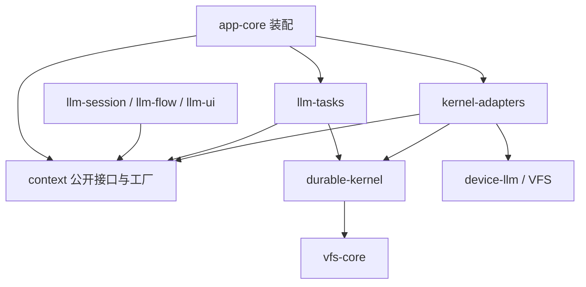
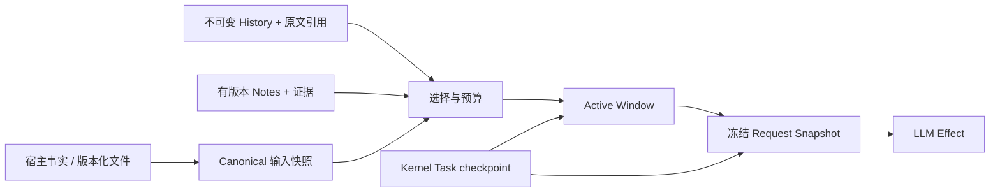

# Context 独立模块设计

日期：2026-09-21。状态：独立模块及首版持久窗口已实现；实际 API、接入与限制见 [Context API](../context-api.md)。下文保留目标设计，尚未落地的扩展不能当作当前保证。

本地审查基线：`f68379c821723b32b49ba18901e3d5d5482ea3ef`。Codex 源码基线：OpenAI 公开仓库 `57567b8d9e5a158ddce2a8bb5f75ac455b1e9b83`，提交时间 2026-09-21。下文区分源码事实、产品文档和本项目设计，不能把主分支实验代码当作所有发行版均可用的能力。

## 1. 结论与比较修正

采用“权威输入 + 可替换工作窗口 + 有版本笔记 + 可检索历史”的分层。**Context 管理模型能看到什么；durable-kernel 管理程序从哪里继续执行。** 两者通过接口和原子提交协议协作。

原比较抓住了各家的侧重点，但它们不是互斥流派，也不能据此得出稳定性排名：

| 对象 | 核查结论 | 本项目采用的部分 |
|---|---|---|
| Codex 常规路径 | 类型化 history、输出预算、协议归一化、压缩后的上下文重建都有源码依据；“很稳”需要故障与任务成功率证据 | 类型化记录、权威状态独立、可恢复的窗口替换 |
| Codex 实验路径 | 已有跳过摘要的新窗口路径、history/notes 扩展；仍受实验配置、模型与后端条件约束 | 窗口身份、显式交接、历史按需读取；本地实现自己的持久契约 |
| Claude Code | 宿主自动清理旧工具输出并按需摘要，模型也参与管理；不能概括成完全由模型负责；CLAUDE.md 不代表全部持久状态 | 固定规则重注入、按需加载材料。[官方说明](https://code.claude.com/docs/en/how-claude-code-works) |
| Gemini CLI | 可配置历史预算、单消息截断、工具摘要和输出 masking；GEMINI.md 也只是规则入口 | 统一且可解释的预算策略。[配置参考](https://geminicli.com/docs/reference/configuration/) |
| OpenCode | 文档明确区分保留的 session 消息和替换后的 active context，并支持 summary + recent tail | 清晰的窗口投影和可观察压缩。“最容易实现”不作事实结论。[Compaction](https://opencode.ai/v2/docs/compaction) |
| Copilot CLI | 大工具输出外置有依据，且同时有摘要 checkpoint，不能只归为临时文件方案 | 原文外置 + 有界预览，但本项目使用持久 artifact。[Context management](https://docs.github.com/en/copilot/concepts/agents/copilot-cli/context-management) |

内存层次类比可帮助理解，但有三个边界：

1. 摘要是有损变换，不能等同于操作系统无损换页；只有保留原始证据并可寻址，才具备“换入”的条件。
2. Notes 是模型生成的工作假设与交接材料，不是 Kernel checkpoint，也不是工具执行成功或用户授权的事实。
3. Repo/files 是代码与文档当前内容的权威来源；执行事实来自 Kernel，用户输入来自接受记录，历史文件内容必须带版本或 hash，不能读取当前文件就声称恢复了过去输入。

## 2. Codex 实现基准

以下链接固定到本次审查的 commit。

| 源码 | 已确认行为 | 设计含义 |
|---|---|---|
| [context_manager/history.rs](https://github.com/openai/codex/blob/57567b8d9e5a158ddce2a8bb5f75ac455b1e9b83/codex-rs/core/src/context_manager/history.rs) | `ContextManager` 保存 `ResponseItemEnvelope`，有独立 retained context、history/user-input revision、reference context 和 world-state baseline；工具结果入窗口时受预算约束 | 消息文本、来源、输入版本和权威事实分离 |
| [context_manager/normalize.rs](https://github.com/openai/codex/blob/57567b8d9e5a158ddce2a8bb5f75ac455b1e9b83/codex-rs/core/src/context_manager/normalize.rs) | 处理缺失输出、孤立输出和不支持的模态；部分缺失输出生成 prompt-only aborted 记录 | 窗口变换必须保持协议完整；本项目不据此伪造执行结果 |
| [context/world_state/mod.rs](https://github.com/openai/codex/blob/57567b8d9e5a158ddce2a8bb5f75ac455b1e9b83/codex-rs/core/src/context/world_state/mod.rs) | 结构化 section snapshot 与差量渲染，涉及环境、权限、工具、项目规则等 | canonical state 应由宿主数据重建，普通请求可按版本复用，不必每轮重复读取所有文件 |
| [compact.rs](https://github.com/openai/codex/blob/57567b8d9e5a158ddce2a8bb5f75ac455b1e9b83/codex-rs/core/src/compact.rs) | 本地摘要路径；手动/轮前与轮中压缩的 initial-context 重注入位置不同 | 重建顺序属于协议，不只是字符串拼接 |
| [compact_token_budget.rs](https://github.com/openai/codex/blob/57567b8d9e5a158ddce2a8bb5f75ac455b1e9b83/codex-rs/core/src/compact_token_budget.rs) | token-budget 路径可不调用模型摘要，直接调用 `start_new_context_window`，复用 compaction 生命周期 | fresh window 是独立策略，不强制以 summary 为前提 |
| [session/mod.rs](https://github.com/openai/codex/blob/57567b8d9e5a158ddce2a8bb5f75ac455b1e9b83/codex-rs/core/src/session/mod.rs) | `start_new_context_window` 重建初始上下文；`replace_compacted_history` 保存 replacement history、窗口 ID、retained context 等 | 窗口切换应保存完整恢复描述，而非仅保存一句摘要 |
| [history-notes/extension.rs](https://github.com/openai/codex/blob/57567b8d9e5a158ddce2a8bb5f75ac455b1e9b83/codex-rs/ext/history-notes/src/extension.rs)、[tools.rs](https://github.com/openai/codex/blob/57567b8d9e5a158ddce2a8bb5f75ac455b1e9b83/codex-rs/ext/history-notes/src/tools.rs) | 独立扩展提供历史窗口列表、条目读取/搜索、笔记读写；历史查询最终一致，notes 单项读取反映成功写入，列表/搜索可延迟 | 检索索引不能成为恢复权威；读取已提交 ref 必须有更强保证 |
| [session/token_budget.rs](https://github.com/openai/codex/blob/57567b8d9e5a158ddce2a8bb5f75ac455b1e9b83/codex-rs/core/src/session/token_budget.rs)、[features](https://github.com/openai/codex/blob/57567b8d9e5a158ddce2a8bb5f75ac455b1e9b83/codex-rs/features/src/lib.rs) | context management/token budget 标为开发中，默认关闭；启用还有模型、认证与后端条件 | 不将实验能力写成通用产品承诺 |
| [history/lib.rs](https://github.com/openai/codex/blob/57567b8d9e5a158ddce2a8bb5f75ac455b1e9b83/codex-rs/history/src/lib.rs)、[thread-store/store.rs](https://github.com/openai/codex/blob/57567b8d9e5a158ddce2a8bb5f75ac455b1e9b83/codex-rs/thread-store/src/store.rs) | 持久 history/checkpoint 类型与存储中立接口分离 | 独立 context 包、依赖接口，存储通过 adapter 接入 |

因此，用户提出的方向有真实源码依据；但“notes 与 checkpoint 同一事务”“所有原始工具字节永不丢失”“任意账户均支持”不能由这些客户端代码推出，服务端 alpha 路由的存储实现也未公开验证。

另需区分 **history 分页存储、模型可调用的 history 检索、fresh-window 策略**。它们是三个维度。核查时 [App Server 文档](https://developers.openai.com/codex/app-server)仍描述 paginated 创建/恢复的限制，而此 commit 已有内部 paginated resume 测试；这是文档、入口和版本边界，不能据一个入口外推所有路径。

## 3. 实现前基线与缺口

| 当前位置 | 已有能力 | 应迁移/补齐的内容 |
|---|---|---|
| [context-types.ts](../../packages/llm-common/src/agent/context-types.ts) | Profile、Plan、Block、Snapshot、Explanation | Context 类型所有权迁入新包；兼容期旧入口只 re-export |
| [context-assembler.ts](../../packages/llm-tasks/src/core/context-assembler.ts) | 分支主线遍历、profile 规则、材料/记忆装配、pending user 保留 | 装配迁入 context；当前全文装配且使用字符/4 估算，没有完整计入工具 schema/多模态；缺乏严格超限失败结果 |
| [provider-message-adapter.ts](../../packages/llm-tasks/src/core/provider-message-adapter.ts) | 工具配对检查、部分 provider 清洗 | 协议组校验迁入 context；provider wire 编码经 codec 接口注入，避免继续积累厂商分支 |
| [context-compaction.ts](../../packages/llm-tasks/src/durable/context-compaction.ts) | 保留 system、最后 user、最近消息与完整工具组 | 本质为按消息数裁剪，不是语义压缩；不存在摘要、原文读取或窗口世代 |
| [agent-program.ts](../../packages/llm-tasks/src/durable/agent-program.ts) | 持久 messages、pending calls、审批键、独立 Skill 快照 | 循环仅消费 context 接口；去除长 messages 副本；保留 Kernel 执行控制与审批事实 |
| [context-profile-store.ts](../../packages/llm-session/src/persistence/context-profile-store.ts) | Profile 不可变版本与进程内写序列 | Profile 规则/版本语义迁入 context；持久化端口实现留 adapter，进程内 Promise 链不能充当跨进程 CAS |
| [Kernel domain](../../packages/durable-kernel/src/domain/types.ts)、[SeqFile store](../../packages/durable-kernel/src/infrastructure/seqfile/store.ts) | `context.seq` commit/branch/head CAS；Task state、effects、shared mutations 可同事务提交 | 既有 `commitContext()` 是单独事务，不能当成与 Task checkpoint 联合原子提交；Context 语义 API 最终迁出 Kernel |
| [tool-call-effect.ts](../../packages/kernel-adapters/src/effects/tool-call-effect.ts)、[llm-chat-effect.ts](../../packages/kernel-adapters/src/effects/llm-chat-effect.ts) | 工具/LLM 的 grant、取消、reconcile 和用量结算 | 大 payload 在进入持久 Effect 结果之前外置；不要只截断模型侧 messages |

特别注意：裁掉 `state.messages` 不会自动消除 `input.messages`、`effects[*].request/result` 和历史 Task snapshot 中的重复内容。新设计要同时缩小模型输入和恢复记录，否则只是降低 token，无法改善长任务的状态写放大。

## 4. 独立包与依赖边界

整个 context 领域归属一个独立包。包内可以分目录，其他包不得深引用这些目录，也不得复制裁剪、摘要或笔记规则。

```text
packages/context/                  # Target logical layout; current files are listed in context-api.md
  src/index.ts                     # Interfaces, DTOs, composition factory
  src/domain/                      # Items, profiles, notes, windows, checkpoints
  src/history/                     # Protocol groups, lineage, bounded queries
  src/canonical/                   # Versioned host contributions
  src/window/                      # Admission, selection, budget, rotation
  src/notes/                       # Revisions, evidence, checkpoint validation
  src/compaction/                  # Strategy selection and result validation
  src/application/                 # Pure transitions and query service
  src/ports/                       # Storage, content, sources, codecs, token meter
```

包本身不依赖 durable-kernel、llm-tasks、llm-session、common、VFS、具体设备或 UI。使用自身的 JSON DTO 与中立消息项；ID 为字符串值，宿主负责把 Round/Task/Effect ID 映射到来源字段。这样移动旧 Context 类型后不会形成 `llm-common ↔ context` 循环。



| 模块 | 保留职责 | 与 Context 的接口 |
|---|---|---|
| context | 全部 context 类型、历史选择、Profile、Notes、窗口、预算、压缩策略、快照解释 | 只从根入口导出窄接口与 DTO；工厂仅供组合根使用 |
| llm-tasks | Agent/Chat 状态机、工具 dispatch、等待、审批 | 注入 `IContextEngine`；消费纯 transition 返回的计划，再声明 Kernel actions |
| llm-session | 对话 Round、分支拓扑、用户输入接受、会话生命周期、长期 memory 服务 | 提供 `IContextSource`；通过 `IContextReader` 查询、通过命令请求变更 |
| llm-flow | DAG、依赖、分支运行、输出绑定 | 传 ContextRef 和有来源的输入绑定，不拼 prompt |
| kernel-adapters | Context 与 Kernel 的事务桥、内容存储、压缩/检索 Effect 适配 | 实现 Context 定义的 ports；不定义压缩优先级或 Notes 合并规则 |
| device-llm | 厂商协议、网络请求、模型能力 | 实现 `IContextCodec` / token meter；不得自行静默删改已冻结窗口 |
| durable-kernel | Task/Effect/lease/交互/事务/资源保留 | 接收可序列化状态、通用 actions 和 refs；不导入 Context 或 LLM 类型 |
| llm-ui / app-shell | 状态和上下文解释展示 | 消费只读 DTO，不直接访问 store 或修改 head |
| app-core | 唯一装配位置 | 创建 context 实例、注入所有 ports，再交给各接口消费者 |

长期用户 Memory 仍是独立业务。Context 只负责检索选择、来源与预算；短期 Notes 不自动晋升为跨会话 Memory。

## 5. 五类数据与权威性



| 对象 | 内容 | 权威/恢复规则 |
|---|---|---|
| CanonicalContext | 有版本的宿主规则、项目规则、当前用户目标/约束、技能关键规则、工具 schema、环境与能力描述 | 由真实来源投影；模型不可修改授权/任务终态；新窗口重新装配，已提交请求重试使用旧快照 |
| HistoryItem | 被接受的用户输入、assistant 输出、工具调用/结果、交互结果、来源和原文 ref | 追加不可变；UI transcript 与模型窗口是两个投影；事件通知不是唯一原文 |
| WorkingNotes | 当前进展、待办、已尝试方案、决策解释、未知项、证据和文件版本 | 模型写入的派生材料，需 revision/CAS，不能宣称是执行事实 |
| ActiveWindow | 本窗口选择的条目/组、canonical/notes revision、检索材料、预算统计 | 可替换的物化视图；切换只改变可见集合，不删除 history |
| ContextCheckpoint | window ID/generation、history 截止点、canonical/notes refs、tail、strategy/version、snapshot digest | 描述如何重建模型输入；被 Kernel Task state 引用，不替代执行 checkpoint |

统一身份为 `(sessionId, contextId)`；默认一个运行分支有自己的 context，一个 Task 是其活动 writer。兄弟分支共享不可变历史 prefix，独立 head、notes revision 和窗口。恢复同一 Task 保持身份；业务 retry/new run 创建新上下文分支并显式指定继承边界。

历史顺序使用持久 ordinal 与 lineage，不使用时间戳排序保证。检索引用使用 item ID + content hash + range，不能只用文件路径或数组下标。

## 6. 公开接口草案

以下是设计接口，不是当前可调用 API。省略部分 DTO 字段；所有持久 DTO 都必须 JSON 可序列化。接口按角色拆开，避免万能 `ContextManager`。

```ts
export interface ContextRef {
  sessionId: string;
  contextId: string;
}

export interface ContentRef {
  id: string;
  sha256: string;
  bytes: number;
  mediaType: string;
}

export interface ContextCursor {
  ref: ContextRef;
  revision: number;
  generation: number;
  historyHead: string | null;
  checkpoint: ContentRef | null;
}

export interface ItemOrigin {
  producer: 'user' | 'assistant' | 'tool' | 'host';
  sourceId: string;
  taskId?: string;
  effectId?: string;
}

export interface ContextItem {
  id: string;
  ordinal: number;
  groupId: string;
  kind: 'message' | 'tool-call' | 'tool-result' | 'observation';
  origin: ItemOrigin;
  authority: 'host-policy' | 'user-input' | 'derived' | 'external';
  body: ContentRef;
  preview: string;
}

export interface IContextEngine {
  initialize(input: ContextInit): ContextTransition;
  advance(state: ContextState, input: ContextInput): ContextTransition;
}

export interface ContextTransition {
  state: ContextState;
  writes: ContextWritePlan;
  work: ContextWork[];
}

export interface IContextCompiler {
  compile(input: FrozenContextInput): CompileResult;
}

export interface IContextReader {
  inspect(ref: ContextRef): Promise<ContextInspection>;
  listHistory(query: HistoryQuery): Promise<HistoryPage>;
  readItem(query: ItemRangeQuery): Promise<ItemSlice>;
  searchHistory(query: HistorySearch): Promise<HistorySearchPage>;
  readNotes(query: NotesQuery): Promise<NotesRevision>;
}

export interface IContextStore {
  load(ref: ContextRef, revision: number): Promise<ContextView>;
  readSnapshot(ref: ContentRef): Promise<ContextSnapshot>;
  readReceipt(operationId: string): Promise<ContextReceipt | null>;
}

export interface IContextContentStore {
  publish(input: ContentPublication): Promise<ContentRef>;
  read(ref: ContentRef, range: ByteRange): Promise<ContentSlice>;
}

export interface IContextCommitBridge<TAction> {
  encode(plan: ContextWritePlan): readonly TAction[];
}
```

`ContextWork` 为类型化 union：`load`、`publish-content`、`retrieve`、`summarize`、`native-compact`、`capture-canonical`，均带稳定 operationId、固定输入 refs 和输出上限。它不包含 Promise、回调或 Kernel 类型。`ContextInput` 是这些工作完成/失败以及宿主输入接受事件；`ContextState` 仅包含游标、阶段和有界待处理数据。

`CompileResult` 是 `ready(snapshot)` / `needs-work(work)` / `blocked(reason)`，明确表达超限、缺失证据、不兼容 native capsule。`IContextCompiler` 不做 I/O：输入包含已加载且固定版本的有限材料；异步读/计数由 work 完成后再调用它。

`ContextWritePlan` 包含 immutable records、head CAS、operation receipt 和 retention roots，均为小型记录/ref。仅 Context 与 commit bridge 理解其编码。业务模块不得自行拼存储键。

`IContextCodec` 负责把中立窗口编码为具体 provider envelope，并报告 capabilities、codecVersion、序列化费用与 opaque capsule 兼容性。最终 `requestDigest` 覆盖实际模型/参数/tools/schema/消息及附件内容 refs，区别于仅覆盖语义选择的 `contextDigest`。

宿主异步命令入口（如更新 Profile、写 Notes、请求 reset）提交带 requestId 的命令，获得 receipt；不得绕过活动 writer 直接修改 context head。UI 不获取 commit bridge。

## 7. 有界窗口与原文外置

工具结果进入 reducer/持久 Effect result 前，由 adapter 使用 Context 的 admission 策略处理：

1. 将完整输出写入不可变 content store，取得 hash/长度/持久发布回执。
2. 返回有界预览、原文 ref、成功/失败状态、退出码、截断标记、读取提示。
3. Kernel 持久 Effect result 只保留该 envelope；工具执行账本与幂等身份不因输出外置而删除。
4. Context 追加 HistoryItem；模型窗口引用预览，按需读取原文指定范围。

优先支持流式外置；首版若工具仍一次返回字符串，应标明内存峰值仍受工具接口限制。设置单项和 session 存储配额；若原文因 producer 限制已截断，保存 `sourceTruncated=true` 及已保存范围，不能宣称拥有完整输出。

超过预览上限时先做确定性的 head/tail/错误片段选择；需要语义摘要时另走可恢复 Effect。不得把截断 JSON 当有效结构化结果；结构化输出保留完整 blob，业务字段通过独立已验证的小型 envelope 传递。

预算规则：

```text
inputBudget = modelWindow - outputReserve - safetyMargin

cost(encodedRequest) <= inputBudget
cost = policy + toolSchemas + notes + selectedHistory + retrievedData
       + multimodalInput + protocolOverhead
```

精确 tokenizer 可用时使用对应模型版本；否则使用保守估算并标记 `estimated`，结合真实 usage 校准。字符/4 不能作为硬安全保证。输入 token 预算、累计计费用量、磁盘配额分别核算，cache discount 不增加上下文容量。

选取顺序：固定 canonical 与当前用户请求 → 保留最近完整交互组 → 有界 Notes → 按需证据。工具目录可延迟加载；它与已获准能力集合分开管理。超限时依次去除重复/过期检索材料、mask 旧工具正文、移出旧完整交互组、摘要或 reset。固定必需项仍超限则返回 `CONTEXT_REQUIRED_INPUT_TOO_LARGE`，不能继续静默裁掉规则或用户请求。

按协议 group 裁剪：同一 assistant batch 的所有 tool calls/results 是一个组；记录实际 call ID，不仅凭相邻 role 猜测。等待审批/工具/人工输入期间组未闭合，默认禁止窗口切换。只在 Kernel 明确提供 aborted/cancelled 事实时生成对应模型观察，不把缺失结果写成成功。

## 8. 三种窗口切换策略

| 策略 | 适用条件 | 新窗口 |
|---|---|---|
| `summary-tail` | 通用默认；需压缩且 provider 无 native 能力 | canonical + 有证据摘要/notes + recent complete groups + 当前请求 |
| `native` | codec/provider 显式支持 opaque compaction | provider 返回的完整 compacted envelope，按该协议处理后续输入 |
| `checkpoint-reset` | 已有合格 Notes，必需目标/约束可重建，历史与 artifact 可按 ref 读取 | canonical + notes + 最小连续性 tail + 当前请求 + 历史读取入口 |

fresh window 不是用户新建 Session，不清空未完成工作、预算、授权记录和待交付输入；MVP 不支持模型无约束地自清空窗口。模型可请求 reset，宿主在安全边界验证后执行。

reset 前校验 Notes 的 `basedOnHistoryHead`、用户约束 revision、证据可达性、未解决问题与后续动作；语义准确性无法由 schema 保证，因此始终保留用户原文与可检索证据。缺合格 Notes 时采用 summary-tail，摘要失败则保持旧窗口或明确阻塞，不执行盲目 reset。

压缩自身也受输入/输出预算、超时和累计成本约束；在主请求硬上限之前触发，必要时按完整历史组分段摘要，并保留到原文的覆盖映射。同一 history head 记录压缩次数与实际释放量，设置有限重试及最小收益门槛；无收益时返回 `CONTEXT_COMPACTION_NO_PROGRESS`，避免“压缩后立即再次压缩”的循环。阈值属于版本化策略，不照搬某个产品的固定 token 数。

native capsule 与文本 Notes 分开存储，记录 provider/protocol/producer/model compatibility。换 provider 时必须检查兼容声明，不把 opaque 内容伪装成普通文本；不兼容则从原历史构建通用窗口，无法构建时报告错误。

OpenAI standalone `/responses/compact` 返回的是完整下一窗口，应整体保存并原样用于下一请求；不能只拿 encrypted item 再任意裁剪其返回内容。canonical 更新与新增输入按 codec 的明确协议添加，避免重复旧政策。[官方 Compaction 文档](https://developers.openai.com/api/docs/guides/compaction)

Notes 建议固定为 `objectiveRefs / progress / decisions / openQuestions / nextActions / evidenceRefs / fileVersions`。允许补充自由文本，但均作为 derived data 渲染；笔记中的“已授权”“已完成”不能改变 Kernel 状态。初版逐 revision 整体替换，append 也带 operationId 以避免重放重复追加。

## 9. 与 durable-kernel 的提交协议

### 9.1 核心不变量

1. **单次请求固定输入**：相同逻辑 LLM Effect 重试使用同一个 request snapshot，不能重新读当前文件重新拼 prompt。
2. **窗口提交与执行状态同生共死**：head/notes revision/checkpoint、Task state、下一 Effect 登记及相关保留根在同一次权威事务中提交。
3. **原文先于引用**：blob 完整发布并验证后才能提交 ref；失败只允许留下不可达 blob，不能留下悬空有效引用。
4. **单 writer + CAS + lease fence**：初版一个 context 只有一个活动 Task writer；它的 lease 约束提交，head revision 拒绝陈旧候选；其他写请求作为持久输入排队。
5. **模型不创造执行事实**：summary、Notes、history 检索都不能完成 Effect、结算预算或回答审批。
6. **检索索引可重建**：恢复读取 checkpoint/ref 的权威记录，不依赖最终一致的搜索索引。

### 9.2 状态机接入

```text
Agent tools/approval/human
        ↓ complete protocol group
context-loading → context-planning
        ├─ fits → publish request snapshot
        ├─ summary → compacting Effect → validate result → publish snapshot
        └─ reset → validate notes/history → publish snapshot
        ↓
Decision {
  state: { contextCursor: next, phase: 'llm', pendingCalls: ... },
  actions: [context commit writes, register llm Effect(snapshotRef), emit],
  next: wait(llmEffectId)
}
```

`IContextEngine` 只计算下一状态与 work；llm-tasks 将 work 映射为 Effect/WaitSpec。所有内容读取、摘要调用和 artifact 写入在 Effect adapter 执行。reducer 不直接调用 store、LLM 或文件系统。

LLM effect v2 从 snapshotRef 读取固定请求，验证 digest、codecVersion、资源 grant 后执行；结果也可外置。认证 token/网络连接仍运行时注入，不写入快照。权限已撤销时拒绝执行，不能因旧快照含有授权描述就恢复旧权限。

operationId 使用 `(taskId, contextId, generation, logicalStep, operationKind)`；同 ID 同 fingerprint 重放返回原 receipt，不同 fingerprint 报冲突。LLM 外部调用的未知结果继续使用既有 reconcile/indeterminate 规则，不能宣称网络调用 exactly-once；本协议保证已接受结果和上下文提交不会重复应用。

摘要运行期间新的用户输入继续进入 Kernel 的持久 pending tail；摘要固定 `throughHistoryHead`，不覆盖 tail。准备新请求前按持久事件顺序消费已经到达规划边界的输入，并把 `acceptedInputThrough` 写入快照；在这一边界之后接受的消息进入下一请求，或由既有 steering/cancel 语义处理。不能声称一条晚到消息必然进入已经冻结的请求，也不得通过覆盖整个 Task 记录丢失并发到达事件。

### 9.3 首版事务实现：复用现有 shared actions

现有 `commitTask()` 已把 state/effects/shared mutations 放在同一个 SeqFile transaction；首版 commit bridge 将 ContextWritePlan 编译为 `set-shared`/`delete-shared` actions，保留其 `expectedVersion` 检查。**不在 reducer 中另调 `session.commitContext()` 或独立 `store.commit()`。**

候选逻辑布局如下；这是 Context adapter 的私有协议，不暴露给业务调用方：

```text
shared.seq
  context/<contextId>/head                       # Small CAS pointer
  context/<contextId>/item/<itemId>               # Immutable metadata + body ref
  context/<contextId>/window/<generation>         # Checkpoint ref
  context/<contextId>/notes/<revision>            # Immutable notes ref
  context/<contextId>/profile/<revision>          # Immutable profile ref
  context/<contextId>/receipt/<operationId>       # Fingerprint + result ref
  context/<contextId>/root/<rootId>               # Retention root metadata

content store
  immutable bodies / note snapshots / request snapshots / history segments
```

不存在“Context 数据只能放 context.seq”这一要求。选择 shared.seq 是为了利用已有联合提交能力；大内容不进入 shared 值。将来需要专用 metadata 文件时在 adapter 内迁移，并增加通用事务参与能力；不能为单独文件牺牲原子性，也不向 Kernel 加 LLM 专用 action。

多个写入者不是 MVP 功能。CAS 冲突候选不得原样无限 retry：放弃候选、读取新的权威 revision、通过持久工作结果重新计划。实现时若现有 Kernel 错误通道不能表达重新计划，需要在 bridge 的宿主命令路径补齐该通道；不得把任意异常当成可重试。活动 Task 的单 writer 模式先规避共享 head 多写争抢。

### 9.4 崩溃恢复表

| 故障点 | 恢复行为 |
|---|---|
| blob 写一半，未发布 | 没有有效 ref；清理 staging，不推进 head |
| blob 已发布，Task commit 未完成 | 旧 head 有效；重用相同内容或回收不可达候选 |
| 摘要 Effect 结果已保存，reducer 未提交 | 从保存的结果继续，不必再次摘要 |
| 窗口与下一 LLM Effect 已提交，网络未发出 | 读取同一 snapshotRef 执行 |
| 网络可能完成，Effect 结果未确认 | 走 reconcile/indeterminate；不凭 Notes 猜测成功 |
| 新 worker 接管，旧 worker 返回 | Kernel fence 拒绝旧提交；候选 artifact 不改变 head |
| 搜索索引延迟/丢失 | 按 ref 恢复；搜索返回 indexedThrough，必要时有界扫描 |
| 必需 blob 缺失/hash 不符/codec 不兼容 | `CONTEXT_CONTENT_UNAVAILABLE` 或兼容错误；不静默少发材料 |

## 10. 检索、分支与保留

最小模型工具面：`history.list`、`history.read`、`history.search`、`notes.read`、`notes.write`、`context.checkpoint`。工具是接口 adapter，不另建第二套 context 逻辑；模型不得传入可提升权限的 owner/session 身份。真实作用域来自 Effect 的 host binding。

list/search/read 均限制条数、bytes 和总 token；返回稳定 cursor、source refs、截断标记和索引水位。首版支持按 ordinal/type/tool/source 过滤与文本检索，不要求向量库。搜索只供选择，读取原文再据证据作结论；大结果仍走同一 admission 策略，避免检索再次塞满窗口。

输入或工具文本保留 provenance，不因被摘要/检索而变成 system policy。原 ContextAssembler 将部分 memory/artifact 包成 system message 的路径需要替换为明确的引用材料；codec 按 provider 协议渲染，不能由消息 role 反推来源权威。

retention roots 包括活动 Task checkpoint、待执行 Effect snapshot、可恢复/保留的历史 snapshot、branch head、notes evidence、显式用户 pin。只要旧 Task snapshot 仍可被恢复/审计，其引用就不能丢；删除 snapshot 与释放 roots 必须遵循 Kernel 的保留语义。

GC 与发布需要共同的 fence。活跃 Task 在线回收需要 stage 发布租约、commit 原子增加 root，并在删除前复核；只“等一段时间再删孤儿”无法消除慢提交竞争。当前实现采用更窄的终态回收边界：活跃 Task 隐式 pin 全部内容，终态且 Effect 清理确认后，在与发布/根提交相同的 SeqFile 事务中标记并回收孤儿；终态发布被事务拒绝。详见 [自动 GC 设计](context-gc.md)。

跨 Session 共用 artifact 要有显式 grant/owner；不可因 hash 相同绕过权限。fork 保留不可变父 prefix 的明确边界，Notes 采用 copy-on-write；不隐式合并兄弟分支 Notes。文件已变化时历史观察标记 stale，新请求需要重新读取；旧请求重试仍使用已固定的历史版本。

## 11. 迁移顺序与验收

所有阶段最终形态都保持独立包和接口消费，不把 context 长期留在 llm-tasks 内部。

| 阶段 | 交付范围 | 完成条件 |
|---|---|---|
| A：领域独立 | 创建 context 包；迁移 Context 类型、Profile 规则、装配/裁剪/协议组校验；建立 source/codec/store ports；app-core 注入接口 | 业务包不 new 具体实现、不深引用；旧行为通过既有回归；依赖无环 |
| B：有界持久输入 | admission、content store、request snapshot、LLM/tool Effect v2；旧输入桥接 | 10 MB 工具输出只存一份主体，Task/Effect 持有有界 envelope；同一请求恢复 digest 一致 |
| C：窗口与 Notes | context history、Notes revisions、summary-tail、checkpoint-reset、原子 commit bridge、检索工具 | kill-point 矩阵、用户 tail/审批/工具组不丢；跨多窗口继续原任务 |
| D：扩展策略 | provider native compaction、索引优化、严格 pin/GC、更多后端验收 | capsule 兼容性、删除竞争、真实后端恢复证据 |

旧 API 迁移规则：

- `llm-common` / `common` 的 Context 类型（包括 [node-config.ts](../../packages/llm-common/src/llm/node-config.ts) 中的 ContextCompactionPolicy）、llm-tasks 的 ContextAssembler 导出在兼容期只转发或提供显式旧 DTO 转换；实现和新类型唯一来源是 context。最终消费者直接 `import type` 公开接口。
- 旧 ChatMessage、Round/Artifact DTO 由边界 mapper 转换，context 不反向导入 llm-common。Provider wire 编码由 codec 适配，不把现有临时清洗规则当永久 API。
- llm-session 仍拥有 Round/branch 的业务身份，Context Profile 的版本和选择规则迁出；旧 profile 文件只作为迁移输入。
- Kernel `SessionContextApi` / ContextCommit / ContextBranch 属于历史通用提交 API；经 adapter 读取旧 context.seq，建立稳定 legacy ID 映射。新 Context 不双写两个权威 head；待消费者全部迁移后移除 Kernel 的 Context 命名 API，旧磁盘数据保留只读迁移支持。
- Agent Program v1 保留恢复能力，v2 使用 context refs；挂起在工具/审批阶段的旧 Task 先按旧协议继续到安全边界。不得直接把所有持久 state 改形状却保持相同 program version。
- 历史因旧裁剪/retention 已不存在时标记 incomplete；不能从当前短 messages 冒充完整 History。迁移版本不支持时 fail closed。

必须验证的行为：

| 类别 | 验收条件 |
|---|---|
| 工具协议 | 多 call batch、部分完成、拒绝审批、取消、缺失结果；预算裁剪不产生孤立调用/结果 |
| 预算 | 中文、tool schemas、多模态、超大用户请求、必需输入超限、tokenizer 不可用；结果明确且成本可解释 |
| 窗口切换 | 连续至少三次切换保留最新用户修正、项目/Skill 规则、未完成目标；窗口切换不是 Task 完成 |
| 持久恢复 | 逐个注入第 9.4 节故障点；重放不重复 note append、不重复 history item、不改 request digest |
| 外部效果 | 未知工具结果保持 indeterminate；切换窗口后不能重跑已经完成的工具或沿用失效审批 |
| 并发输入 | 摘要期间新消息/取消/权限变更不丢失；旧候选不能覆盖新 revision |
| 原文与检索 | 截断预览可定位完整原文；索引重建不影响恢复；越界/越权/corrupt ref 明确失败 |
| 分支 | fork 的 prefix 可达、Notes 隔离，修改 Profile 不改变旧 request snapshot |
| 写放大 | 固定窗口预算下，大输出字节不随 reducer 次数复制；分别统计 Task 元数据增长和 blob 增长 |
| 兼容 | v1 Task 可恢复；v2 未支持的 layout/codec 明确拒绝；浏览器/桌面/CLI 经同一接口 |

MVP 仍允许 Task.effects 的小型元数据随 Effect 数量线性增长；若要让完整 TaskRecord 体积与任务长度无关，还需 Kernel 单独拆分 effects ledger。Context 外置解决 payload 复制，不能把它宣传成对整个 Kernel 的常量空间保证。

可观察性至少包含：context/window revision、策略与原因、token estimate/actual、included/excluded refs、summary 来源范围、原文 bytes/预览 bytes、request digest、索引水位、恢复/冲突次数。观察事件可裁剪，恢复依赖的 record/ref 不随之删除。

## 12. 本轮交付边界

已创建零运行时依赖的 `packages/context`，迁入消息/Context 类型、Profile、历史选择、装配、裁剪、协议校验和 hash 实现。旧入口保留兼容转发，Session 保留 Round 拓扑与持久 adapter。新 `IContextService`/`IContextEngine`/`IContextContentStore` 管理不可变请求、原始历史、笔记和窗口；kernel-adapters 与 app-core 通过端口接入，durable-kernel 源码与依赖不变。

Agent/Chat v2 使用 `context.prepare@1` 与 `llm.chat@2`，head/receipt 写集和下一 Effect 在同一 Decision 提交。`tool.call@2` 在旧截断前保存完整可读输出，提供 `context_history`、`context_read`、`context_checkpoint`；末次助手答案也归档。v1 Task 保持原版本恢复。

实际实现作了以下收敛：

- 使用既有 ChatMessage 作为中立 DTO，没有引入第 5 节完整 ContextItem/provenance 或 provider codec 层。初始规则/目标固定，Skill 规则每轮重建；memory/artifact/notes 使用引用材料身份。
- 使用完整请求 JSON 的 UTF-8 字节估算预算，可替换 engine；未实现 provider tokenizer、多模态准确计量及自动模型窗口推导。
- 历史为不可变 linked segments，Notes 保存在请求快照中；没有独立 notes 编辑/搜索索引服务。检索为有界文本扫描，工具面合并为三个工具。
- 默认 prune；显式 summary-tail/checkpoint-reset 已接入。摘要在可取消的 prepare Effect 内完成，不单独设摘要 Effect；prepare 结果落盘后恢复不重复摘要，结果落盘前中断可能重新摘要并产生额外费用。
- 默认自动回收终态且 Effect 清理确认 Task 中超过保留期的不可达新内容；已引用历史与旧文件继续保留。没有活跃 Task 发布租约 GC、native compaction、跨 Task/Session fork 或旧 context.seq 数据迁移。旧 Kernel 通用 Context API 继续兼容，新 Context 不使用该 head。
- 只移出不断累积的工作 messages 与大工具正文；最初 Task input、当前批次、Effect 小元数据和已保存历史仍占空间，不能声称消除了全部写放大。

单元与真实 Kernel 重开测试已覆盖多次窗口切换、CAS/回执、内容校验、取消等待、审批恢复、不重跑已完成工具与完整输出读取；尚未宣称第 9.4 节所有进程 kill-point、真实桌面/浏览器及各后端断电测试完成。
