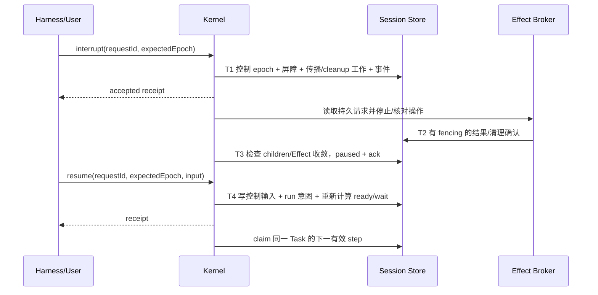
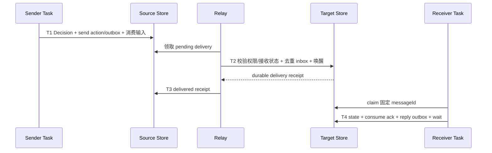
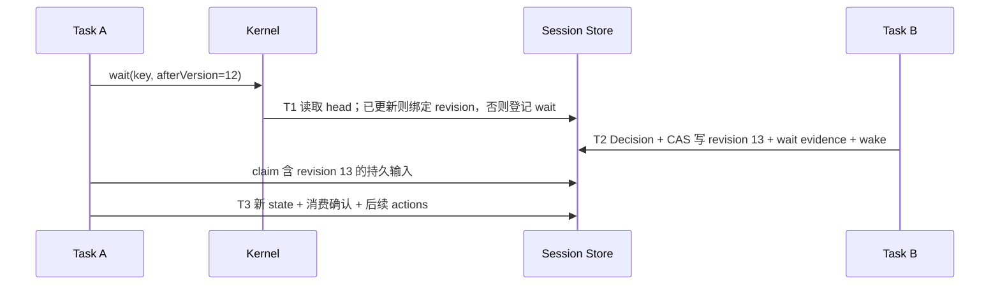

# Durable Harness Session / Task 协议

版本：1.1 · 日期：2026-09-05 · 状态：设计基线；资源分配、endpoint 与存储契约已修订，新增目标尚未实施验收。

实施进度：部分核心协议已落地，准确 API、验证及剩余扩展见 [实施记录](../feat/durable-harness-implementation.md)。本文仍是完整目标规范，不能整体标记为已实现。

简化审查：面向日常使用的三对象模型、精简 API、状态/统计和 SeqFile/普通文件边界见 [简化核心提案](durable-harness-core.md)。该提案收敛公共概念和首版范围；本文保留恢复正确性的详细约束，不要求调用方手工管理所有内部记录。

本文定义支持长时间、可交互、可跨进程恢复 harness 的目标协议。它补充并修订 [原 Session/Task 设计](../feat/harness-session-task-final-design.md)，不代表当前 `packages/durable-kernel` 已具备这些行为。生命周期、重试、mailbox、共享等待和跨 Session 协作发生冲突时，以本文为目标设计；源码是当前已实现 API 的依据。

## 当前控制与恢复基线（2026-09-08）

接口以 [domain/types.ts](../../packages/durable-kernel/src/domain/types.ts)、[Kernel](../../packages/durable-kernel/src/application/kernel.ts) 和 [SeqFile store](../../packages/durable-kernel/src/infrastructure/seqfile/store.ts) 为准。后续编号章节仍是完整目标约束，不是当前字段列表。

- TaskStatus 当前没有 `paused/finalizing`，暂停由 `control.mode=run/pause/interrupt`、epoch 和 acknowledged 独立表达；取消走单独的终态操作。TaskControlOptions 有 requestId、可选 expectedEpoch/reason，不能把目标表中的 actorRef、propagation cursor 等字段当作已实现接口。
- Kernel 默认 `pollMs=0`，由提交唤醒和截止期定时器驱动；正 pollMs 是可选周期检查。nextWakeDelay 检查持久 timer、readyAt、Task/Effect lease、outbox 重试和资源期限。当前每次仍枚举 Task 来求期限，并非所有调度扫描都已有游标分页。
- reducer 与 Effect 并发槽分开，默认各 4，可设 0 暂停对应派发。并发数、pollMs 为非负安全整数；leaseMs 为可表示绝对期限的正安全整数。长期限定时器受平台上限约束，续租间隔也不超过 2147483647 ms，避免溢出为高频循环。
- recover/recoverSession 默认保留有效租约并安排到期检查；显式 `{ takeover: true }` 会更换旧 lease token 并令其过期，仅允许空闲 Kernel 发起。该选项是宿主接管决策，不代表 Kernel 已证明其他进程死亡。用户 pause/interrupt 和 Session suspend 意图不因恢复清除。自然到期的 lost Attempt 计入该 step 的重试预算，默认 maxAttempts=1 不会自动再执行；需要自动重试时显式配置预算。takeover 路径允许接管重启，不等同于自然到期策略。
- WaitSpec 当前支持 signal/effect/task/child/interaction/shared-version/timer/message/cache/resource 及 any/all/quorum；完整 Endpoint、业务 stream、通用 deadline WaitSet、跨 authority transport 和迁移器仍不是这些类型的现成功能。Shared revision 和选定输入已有持久恢复路径。
- 观察查询现在包含 listSessionTaskPage、taskHistoryPage、taskEventPage，浏览主视图已经接入；分页上界、Task 当前状态与不可变版本的差别、旧派生索引补建成本见 [浏览设计](vfs-session-browser.md)。eventList、部分 mailbox/恢复扫描仍全量，不能据此宣称 §13 的所有分页已完成。

自动故障场景见 [protocol.test.ts](../../packages/durable-kernel/src/protocol.test.ts)。独立 OS 进程/LocalFS SQLite 验证见 [20-kernel-ipc.test.ts](../../packages/vfsdriver-localfs/tests/20-kernel-ipc.test.ts)：两种挂载模式下覆盖 SIGKILL 后显式接管、带重试预算的自然到期恢复、多文件事务回滚、等待唤醒竞争、资源清理、single-use Cache 回执及父取消落盘后后代清理前的崩溃恢复。当前该文件共 28 项通过。无周期轮询的到期恢复依赖已登记的期限；这不证明完全空闲 worker 能收到另一个进程任意时刻的新提交，跨进程 notifier/主动唤醒或可选 pollMs 仍属宿主部署条件。现有场景不等于全部 §15 kill 矩阵、跨主机时钟或 GUI 人工验收。

### 初始信号与启动

`TaskHandle.start({ signal? })` / `Kernel.startTask(..., { signal? })` 将初始信号、Task 从 created 转为 ready/blocked、相应事件及 start-signal 指纹放在同一事务。相同信号重放不重复追加；不同信号冲突，已无信号启动的 Task 不允许借 start 补投初始信号。普通 signal 接口仍供后续业务信号使用。该原子性不包括此前资源创建或宿主准备回调。

bindCapabilities 已使用按 signalKey 稳定命名的资源创建回执，并通过原子 start 交付能力信号；准备回调失败时任务仍未启动，重试复用资源。回调本身须可重试，仍可能重复执行；不把任意宿主副作用包装成事务保证。

### 人工重试当前接口

`TaskHandle.retry({ requestId })` / `Kernel.retryTask(sessionId, taskId, { requestId })` 创建新的 root Task，并保存 retryOfTaskId。普通提交和结构化 spawn 均在创建事务中校验来源已终态，失败不发布新任务；重复 requestId 对同一来源幂等返回已创建的重试任务，Kernel 重建后仍读取原提交映射。复制 program/input/dependencies/retry/priority/labels，使用 deferStart=true；旧任务状态、checkpoint、Effect、interaction 和资源授权不复制也不修改。新任务需宿主重新授予资源后 start；失败依赖仍按普通提交策略传播，deferStart 不屏蔽依赖终结规则。自动 Attempt 重试维持原 Task ID 的语义不变。

当前尚未把该入口装配为 Flow Run 单节点重试：重试任务的授权、依赖重绑定、Run 成员清单与后续结果收敛必须单独完成，不能把底层新 Task 创建等同于整张图恢复执行。

## 1. 范围与架构裁决

保留 Session、Task、Attempt、Effect、Resource、EventJournal。Kernel 是声明驱动的持久状态机：Program 根据持久 input/state 和已选择的输入返回 Decision，内核负责校验及原子提交。TypeScript reducer 可以表达业务计算，但外部 I/O 必须通过持久 action/Effect；不恢复 Promise、闭包、generator 或任意机器指令位置。

本文的“随时中断”指请求随时可持久接受；实际停止发生在协议定义的安全点。能恢复的是已提交的业务状态和外部操作事实，不是提交前的任意内存进度。

| 对象 | 权威事实与职责 |
|---|---|
| Session | 命名空间、Task 集合、生命周期和资源归属；不作为一次模型调用身份 |
| Task | 稳定逻辑工作身份、私有数据、业务状态机、控制请求、等待与终态 |
| Attempt | worker 尝试推进 Task 一个业务步骤的执行记录；保存执行权限、租约及成功、失败或丢失结果 |
| Effect | Task 声明的一次逻辑外部操作，如调用模型或运行命令；保存请求、实际执行尝试、结果与恢复策略 |
| Mailbox | 持久输入与消费确认；通知丢失不能导致消息丢失 |
| SharedState / SharedResource | 有所有者和版本的共享数据；等待基于持久版本而非内存订阅 |
| EventJournal | 原子提交事实的观察接口；不替代 Task/Effect/mailbox 权威记录 |
| Cache | 可淘汰的派生数据资源；scope/retention/usage 独立，命中参与决策前固定为持久输入 |

### 1.1 先理解 Attempt、Effect 与 EventJournal

**Attempt 回答“这一步由谁计算，有没有成功提交？”** Program 的 reducer 是根据 Task 当前状态和输入计算下一份 Decision 的函数。worker 领取 Task 后产生一个 Attempt，运行 reducer，再提交 state、actions 和 wait。正常推进下一步也会产生新 Attempt，因此 Attempt 不专指失败重试。计算失败或 worker 在提交前消失时，同一步可以由另一个 Attempt 重做；旧 Attempt 失去租约后不能覆盖新提交。

**Effect 回答“要求外部世界做什么，现在能确认什么结果？”** 例如调用模型生成修改方案、运行测试命令或发送外部请求。reducer 只声明操作，Kernel 先持久登记，再交给 adapter 执行。外部操作可能耗时很长，Task 可以在等待期间不占用 reducer 执行槽；结果落盘后，再用新的 Task Attempt 处理结果。

Effect 有自己的 EffectAttempt，表示实际调用外部系统的一次尝试，与推进业务状态的 Task Attempt 分开。一次 Task Attempt 可声明零个或多个 Effect；同一个逻辑 Effect 在允许安全重试时可以有多个 EffectAttempt，但逻辑 EffectId 不变。模型再次生成另一版方案是新 Effect；网络故障后重试同一操作，只有恢复策略允许时才沿用原 Effect。平台不支持幂等或查询时，结果未知必须保留为 indeterminate。

**EventJournal 回答“Session 中已经提交了哪些变化，观察者读到哪里了？”** 它是有序的持久事件记录，供 UI 展示进度、断线续读和诊断。比如 Task 创建、Effect 登记、结果保存、暂停确认和 Task 完成都可追加事件。相应状态更新与事件追加在同一存储事务提交；浏览器没有收到实时通知，也能从上次 sequence 继续读取。它不是 reducer 输入队列，也不是恢复全部业务状态的唯一来源；是否消费消息看 mailbox/Task 记录，是否允许重试外部操作看 Effect 记录。

### 1.2 示例：一个“修复仓库测试”的 Session

用户要求“分析失败测试、修改代码并验证”。创建 Session `S1`，包含负责协调的 Task `T-main` 和负责测试的 Task `T-test`；共享 workspace、测试配置和预算属于该 Session。下面使用便于阅读的示意 ID，描述目标协议，不表示全部细节已在当前代码实现。

| 阶段 | 具体发生什么 | 对象的用途 |
|---|---|---|
| 1. 创建工作 | 建立 S1、T-main，固定任务输入和程序版本，授予 workspace/model 等权限 | Session 管理工作集合与资源；Task 保存用户目标及私有进度 |
| 2. 决定调用模型 | worker W1 领取 T-main，产生 Task Attempt A1；reducer 提交 `phase=waiting-plan`、模型 Effect E1 及等待条件 | A1 只负责计算并提交这一步；提交成功后 A1 已结束，模型请求尚可未开始 |
| 3. 执行模型调用 | adapter 领取 E1，产生 EffectAttempt EA1，实际请求模型；结果持久保存 | E1 保存固定请求及方案结果；T-main 等待 E1，不需要一个 reducer 一直阻塞在网络调用上 |
| 4. 应用方案 | 新 Task Attempt A2 消费 E1 结果，登记修改 workspace 的 Effect E2；E2 完成后 A3 固定 workspace revision R7，并创建 T-test | T-main 的 TaskId 不变；修改代码属于外部操作，不能在 reducer 中偷偷写文件 |
| 5. 子任务测试 | T-test 的 Attempt B1 登记测试 Effect E3；adapter 在固定 R7 的快照或受控 workspace 上执行测试 | Task 表达“完成测试并报告”的工作；E3 表达“执行这次具体测试命令” |
| 6. 共享与通知 | T-test 的下一 Attempt 消费 E3 结果，提交测试报告的共享 revision V1，向 T-main 发送消息 M1，并完成自身 | SharedState 保存版本化报告；Mailbox 保存 M1 的到达与消费；T-main 可等待消息或 Task exit，二者含义明确区分 |
| 7. 收敛工作 | T-main 在新的 Attempt 中消费选定证据，保存最终输出并完成；Session 按关闭策略处理剩余资源 | 业务状态与终态由 Task 保存；TaskGroup/Session 管理子工作和清理责任 |

这个过程中，测试解析结果可以发布到带 workspace revision、测试配置和解析器版本 fingerprint 的 cache。Task 显式选择 cache；命中值先保存为持久 receipt，再参与 Decision。重启后 cache 被淘汰不会改变已选输入。需要审计或必须保留的原始测试报告应保存为持久 state/artifact，而不是只放 cache。

如果另一个 Session `S2` 要使用报告，可以通过消息获得副本或通过授权引用读取不可变报告；共同使用可变资源则请求同一 resource authority。S2 不直接读取 T-main 私有 state，也不能因为知道 cacheId 就获得 S1 的缓存权限。

### 1.3 在不同位置中断，会恢复什么

| 中断位置 | 恢复行为 |
|---|---|
| A1 计算中、Decision 尚未提交 | 已提交 Task state 不变；旧 lease 失效后，新 Attempt 重做同一步。E1 尚未登记，不能凭未提交的内存结果调用模型 |
| A1 已提交、E1 尚未执行 | 从持久 pending Effect 继续派发 E1，不重新创建另一个逻辑模型操作 |
| E1 已在外部完成、结果尚未落盘 | Task checkpoint 不能证明外部是否完成。按 E1 的策略查询结果、幂等重试，或进入 indeterminate 等待裁决；不能直接认定失败并再调用一次 |
| E1 结果已落盘、A2 尚未运行 | 新 Attempt 消费同一持久结果，继续规划后续操作，无需重新调用模型 |
| T-main 暂停期间收到 M1 | mailbox 和匹配证据继续保存，恢复后消费；暂停不会丢弃消息，也不意味着在途 E3 已停止 |
| UI 断线，但 worker 继续工作 | UI 从 EventJournal 游标补读。UI 的连接寿命不决定 Session、Task 或 Effect 的寿命 |

例如 UI 可能依次看到“Task 已创建→E1 已登记→E1 结果已保存→测试报告已提交→Task 已完成”。这些是 journal 对提交事实的观察；恢复器仍读取 Task、Effect、mailbox、资源和等待记录来确定下一步工作。诊断时，Task state 说明当前业务阶段，Attempt 说明执行权与失败位置，Effect 说明外部操作事实，EventJournal 帮助关联它们发生的顺序。

业务 goal、模型、prompt、toolset、memory、compaction 和 transcript 由 harness 定义有版本的 descriptor/state。Kernel 不理解这些业务内容，但提供 schema 标识、不可变引用、控制和等待协议。Flow 编译到这些原语，不能拥有另一套 Task 的运行事实源。

Linux 对齐以 [资源与执行域协议](durable-harness-resources.md#1-正确对齐-linux保留-harness-的语义) 为准：Task 保持独立的业务状态和 binding 表，Session 提供显式共享与资源治理；二者不等同于 POSIX process/thread 或 job-control session。worker/Attempt 与逻辑身份分离；Resource、Grant、Binding/Use、Allocation、Usage 分别表示本体、授权、引用/使用实例、容量分配和消费。

## 2. 必须成立的不变量

1. 一个 Task 最多一个有权提交的 reducer Attempt；租约失效后的执行者不能提交 Decision、放弃新 claim 或写受保护的增量状态。
2. 普通消息到达、Effect 完成不使当前合法 reducer claim 失效；并发输入不能被其旧快照覆盖。
3. state 更新、所消费输入的确认、action 登记、wait 注册、逻辑转移和 journal 事件在同一个 Session 事务提交。
4. 取消等终态不可恢复成非终态；人工重做创建带 `retryOfTaskId` 的新 Task。自动恢复和预算内重试保持原 TaskId。
5. 同一逻辑 Effect/action/message 幂等键不能覆盖已提交结果；同键不同内容是冲突。
6. 检查等待条件、登记 wait 与本地目标更新不能丢唤醒；唤醒事实与 ready 投影原子提交。
7. 控制意图与传播工作持久保存；崩溃不能遗忘暂停、取消、关闭或消息投递责任。
8. Session 内共享操作可以事务原子；跨 Session 不承诺原子提交或全局顺序。
9. 无 notifier、worker 换进程、首次恢复发生在旧租约过期之前，仍应在依赖可用且策略允许时最终推进。
10. 观察者可以区分“请求已接受”“逻辑状态已变化”“外部执行是否停止”，不能用一个 cancelled/paused 字段掩盖三者差异。

## 3. 持久记录与版本

当前 Session/Task 逻辑目录、记录键、权威事实与索引的区别及跨文件事务边界见 [持久存储与文件组织](durable-harness-storage.md)。逻辑布局与下述完整目标字段分别说明，不代表目标字段已经全部落地。

按 Linux IPC 能力对照得出的缺口见 [完备性审查](../feat/durable-harness-ipc-completeness-review.md)；后续修订的目标记录归属固定在存储设计第 5 节，Session 内/跨 Session 分配表由 [资源协议](durable-harness-resources.md) 定义。业务 stream 与资源 permit 的能力开关必须在 manifest 声明，不能假定当前已有实现。

以下为目标协议字段，非当前 TypeScript 公共 API 的逐字定义。ID 为不透明稳定字符串；时间使用 UTC epoch milliseconds；记录及事件均有 `schemaVersion`。

| 记录 | 必要字段 |
|---|---|
| Task | id/sessionId、parent/root/group、programRef、descriptorRef、inputRef、state/stateRef、stateRevision、stepId、status、waitSetId、control、exit、terminalSequence |
| Attempt | id/taskId/stepId、workerId、leaseEpoch/token/until、claimedStateRevision、claimedControlEpoch、selectedInputIds、outcome |
| Control | epoch、latestRequestId、mode、reason、requestedAt、acknowledgedAt、interruptId、resumeInputId |
| ControlRequest | requestId、task/session target、operation、expectedEpoch、actorRef、payloadHash、acceptedEpoch、结果；重复请求复用原结果 |
| Effect | id/taskId/actionKey、requestHash、adapterRef、recoveryPolicy、status、result/error、deadlineAt、attempts、cleanupStatus |
| MailboxEntry | messageId、target、deliverySequence、channel、sender、senderSequence、correlationId/replyTo、payload/ref、receivedAt、consumption |
| WaitSet | id/taskId/stepId、组合条件、deadlineAt、status、matchedEvidence、resolvedAt |
| SharedHead/Revision | scope/key、version、value/ref 或 tombstone、writer、commitSequence；revision 不可变 |
| Outbox | messageId、source/target、payload/ref/hash、senderSequence、deliveryStatus、nextAttemptAt、attemptCount、receipt |
| PropagationWork | operationId、scope、目标游标、pending/acknowledged/blocked、重试时间与最后错误 |
| Endpoint | endpointId/sessionId、ownerRef、generation、consumerBinding、channelPolicy、capacity、state、closePolicy |
| Resource / Allocation | authority/resource identity、owner/grantee、account/quantity、状态、lease/fence、幂等请求和结算引用；完整表见资源协议 |

存储 manifest 保存 layoutVersion、recordSchemas、requiredCapabilities 与 migration 状态。未知必要能力/版本进入 migration-required，不尝试按缺省值解释权威记录；manifest 的目标定义不表示当前已实现完整迁移器。

Task 的 stateRevision 只由成功的业务 Decision 推进。mailbox 的 deliverySequence、Effect revision、控制 epoch 与其独立；可以另有全记录 revision 用于存储 CAS，但不能用它误判 reducer 的业务所有权。

stepId 标识一个逻辑执行步。该步重试沿用 stepId、已选择输入和 actionKey；成功推进后产生新 stepId。leaseEpoch 在每次 claim 增加，与失败预算独立。

输入、状态和输出必须是验证后的 durable JSON 或带 schema/hash 的不可变 ArtifactRef。大内容写入 artifact 后再由事务引用；提交失败留下的未引用 artifact 可以 GC。完整 Task snapshot 不重复内嵌无限增长的消息、chunks 和 attempts。

程序版本被精确固定。旧程序/schema 不可用时进入 `waiting`，阻塞原因 `program-unavailable`/`migration-required`，不能把环境缺失直接变成业务失败。迁移在无有效 Attempt 的控制屏障下，校验来源 revision，记录 migrationId/from/to 并原子提交；必须保留迁移前快照。

## 4. Task 执行与控制面

### 4.1 执行状态和控制请求分开

执行状态：`created / blocked / ready / running / waiting / paused / finalizing / succeeded / failed / cancelled`。

- created：尚未 start，允许先分配资源和输入。
- blocked：创建依赖未满足。
- ready：存在内部 step 或待消费输入且允许 claim。
- running：一个有效 reducer Attempt。
- waiting：存在未满足的持久条件或显式恢复阻塞原因，无 reducer 占用。
- paused：逻辑暂停屏障已确认；原有 wait/输入/checkpoint 保留。
- finalizing：Program 已提出结束或取消已接受，等待 structured children 与要求的清理收敛；不再运行普通业务 reducer。
- 三个终态：ExitRecord 已持久提交，不能 resume。

控制 mode：`run / pause / interrupt / cancel`。同一 Task 的控制请求在 Session 事务内串行化；非重复请求须匹配 expectedEpoch，否则返回冲突；重复 requestId 返回原 receipt。cancel 一经接受不可撤回。Session 控制额外形成调度屏障，不被 Task resume 越过。

### 4.2 四种操作

| 操作 | 请求接受后的行为 | 确认及继续 |
|---|---|---|
| pause | 关闭新的 reducer/Effect 派发；使未提交的旧 reducer Decision 失效；按 Effect 策略静止 | 状态提交为 paused，保存原等待；resume 后重新计算调度资格 |
| interrupt | pause 的停止机制，同时持久记录一次 interruptId 和中断原因 | 默认等待显式 resume；resume 可以原子附带新输入，恢复后的第一步消费对应控制输入 |
| cancel | 关闭派发、持久传播取消意图、登记 cleanup，不接受新的业务 Decision | 收敛后 cancelled；不可 resume |
| recover | 不改变用户控制意图；接管过期 lease，核对外部效果 | 从已提交 state/同一 step 恢复；paused 不自动运行 |

原始 signal 的业务名称不能隐式调用 pause/cancel 等控制操作。Task.signal 是通信；Task.pause/interrupt/resume/cancel 是受权限控制的内核操作。

### 4.3 安全点与不可中断操作

控制事务递增 control epoch，并关闭新 claim/dispatch。当前 reducer 若尚未提交，它的 Decision 被 fencing 拒绝且所选输入仍未消费；重放仅执行无外部副作用的计算。CPU 阻塞的 reducer 需要宿主 worker 隔离/强制停止能力；同一 JS 事件循环无法提供硬实时中断保证，部署能力必须暴露这一限制。

每类 Effect 必须声明控制策略：`cancel-and-reconcile`、`checkpoint-and-detach` 或 `drain`。停止发出请求不等于外部已停止：

- cancel-and-reconcile：发取消请求并确认结果，不能仅依据 AbortSignal 推断成功。
- checkpoint-and-detach：只适用于 adapter 明确支持持久操作句柄及重连；逻辑暂停可确认，但 `externalActivity=detached` 必须对外可见。
- drain：不再发新操作，等待当前操作完成。此时保持 pause pending，超时后变为 blocked，不能伪报 paused。

控制 epoch 使 reducer 和新派发失效，但不丢弃已经派发 Effect 的真实结果。当前有效 Effect lease 仍可向 broker 提交最终事实，broker 将其纳入暂停/取消收敛；它不能直接推进业务 reducer。旧 Effect lease 的写入一律拒绝，迟到的外部结果只能由新 owner reconcile 后录入。

增量 emit、共享写、预算结算必须经过 broker 检查 lease、逻辑操作键和控制策略；不能把裸存储写接口留给失联 adapter。

## 5. 链路一：中断、确认与继续



- T1 之后立即崩溃：恢复器从持久控制与传播记录继续，不依赖请求进程存活。
- T2 后、T3 前崩溃：重新检查已提交事实，不能重复已确认的清理。
- resume 在 interrupt 未确认前请求：返回 `control-not-settled`，不撤销未完成中断；调用者可持续观察 receipt。
- resume + 新输入一个事务提交；重复请求不重复入队。该输入具有独立控制通道，消费时先于普通业务 mailbox；已完成 Effect 的事实仍保留，不能因新指令丢弃账目或外部结果。
- 被暂停的 wait 若已满足，持久保存证据，但只有解除 Task 与 Session 的全部屏障后才进入 ready。
- session suspended 时可接受 Task resume 意图，但有效执行仍被 Session 屏障拦住；返回值须明确 `blockedBySession`。
- 不确定的 Effect、无法停止的外部进程均显示明确的阻塞原因和可执行操作；不能静默无限重试。

## 6. Reducer 提交、内部推进与重试

claim 在一个事务中检查 Session/Task 控制、调度资格和 lease，固定 stepId、stateRevision、controlEpoch 与本次 selectedInputIds。初始步骤输入为 start，纯计算 continue 产生一个持久内部 step 事件；不存在“无事件不断重新 claim 却不调用 reducer”的语义。

提交事务必须：

1. 核验 owner token/epoch、租约有效期、业务 revision 和控制 epoch。
2. 从当前权威记录读取 mailbox/Effect 等并发变化，不用 claim 时整个 Task 快照覆盖它们。
3. 更新业务 state，确认本次 selectedInputIds；尚未消费输入保持不变。
4. 按 `(taskId, stepId, actionKey)` 幂等登记 actions；重复键相同内容复用，不同内容拒绝。
5. 注册 wait 或内部 step，计算实际状态，写 journal、snapshot ref 和调度投影。

外部慢操作不属于 reducer，必须 Effect 化。失败 Decision 的 state/actions 不提交，仅提交该 Attempt 的失败事实和下一次重试时间；业务若需要“记录错误并做补偿”，应提交一个正常的下一状态和显式补偿 action。

重试策略目标为 `maxStepAttempts`（含首次尝试），并可配置 Task 累计失败上限。成功步骤不消耗下一步额度；lost 执行消耗该步额度；固定 backoff 用持久 readyAt 表达。旧 `maxAttempts` 不再解释为 Task 一生所有正常执行量子的上限，迁移必须显式转换而非静默改变旧记录。

## 7. Effect 身份、恢复与预算

Effect 由稳定 actionKey 生成逻辑 ID；请求 hash、adapter 版本、idempotencyKey、deadlineAt 和恢复策略在首次提交后不可变。所有物理 attempts 追加保存。

| recoveryPolicy | lost 后行为 |
|---|---|
| idempotent-retry | 用相同逻辑键调用已声明幂等的 adapter，遵守 Effect 重试预算 |
| reconcile | 查询持久外部操作身份；已完成则录入，确认未执行才允许重试 |
| manual | 无法证明可安全重放则 indeterminate |

没有声明恢复能力时默认 manual。reconcile 返回未知时保持 indeterminate；不能把“查询失败”解释为“没有执行”。外部 deadlineAt 跨重启保持，不为每次重试重新计时。超时但外部结果未知仍为 indeterminate，不能假装无副作用失败。

人工裁决使用带权限、幂等 requestId 和证据的 `resolveEffect`：确认已完成、确认未执行并允许重试，或放弃该操作。保留原未知历史；Task 根据裁决事件恢复。重试成功结果不可被后来同 ID 的请求覆盖。

预算采用 reserve→settle/release。reservation 与 Effect 登记同事务，按逻辑操作键去重；实际成本未知时保留预留或显式 unsettled 记录。预算账本不能因同一个执行结果的恢复提交重复扣费。对无法预估上限的外部消费只能声明软限制，不能承诺执行后扣费等价于硬限额。

## 8. 链路二：持久通信与消费

### 8.1 Message 与 endpoint

endpoint 为 `{ sessionId, mailboxId }`，Task 默认有自己的 mailbox；Session service mailbox 必须绑定显式消费者。不存在“所有 Task 自动收到”的隐式广播。fan-out 为每个目标生成独立 delivery identity。

引用还必须携带 endpoint generation，防止同名 endpoint 重建后接收旧命令。EndpointRecord 存在 `messages.seq.endpoint/<id>`，owner 可为 Task、Session 或 service；Task 终态不隐式删除仍负有回执/清理责任的 service endpoint。普通 channel 默认单消费者，重新绑定须 fencing 旧消费者；竞争队列须单独声明 claim/ack 能力。广播使用独立 delivery 或持久 subscriber cursor，不能共享一个 consumedAt。

Message 至少包括：messageId、source/target、channel、senderSequence、correlationId、replyTo、payload/ref、schemaRef。信封由内核基于认证来源形成，调用方不能伪造 sender。内容在登记后不可变；幂等键作用域是 source endpoint，重复键不同目标/内容报冲突。

### 8.2 投递和消费不是同一个确认

消息生命周期分为两层：

- delivery：pending→delivered 或 rejected；临时错误持久退避重试。
- consumption：unconsumed→consumed 或 rejected；delivered 仅表示目标 inbox 已持久保存。

每个 mailbox/channel 单消费者按 deliverySequence FIFO。不同 channel 可以独立消费；记录已选 messageId 和各 channel 的连续消费水位，不能用一个全局 cursor 跳过未消费消息。请求回复通过 correlationId 关联；reply 是新的持久消息。

同一 source→target→channel 保持 senderSequence 顺序，relay 不越过未确认的前序消息。跨来源不承诺业务先后；目标 deliverySequence 定义到达顺序。前序永久拒绝也需持久推进发送流，避免无解释的顺序空洞。

### 8.3 事务链路



同 Session 的 send action 可以将发方 Decision、收方 inbox 和本地唤醒放在同一事务；跨 Session 必须经过 outbox，不持有跨存储长事务。内存 notifier 不参与正确性判断。

- T2 成功、T3 前崩溃：重复投递命中 inbox messageId，返回相同 receipt。
- 收方 reducer 提交前崩溃：消息仍 unconsumed，同一步重放；提交后崩溃则不再次消费。
- T4 的回复和业务提交原子，不能出现“已消费请求但忘记回复”的崩溃窗口。
- 接收方 paused/suspended：允许入 inbox，保存唤醒证据，但禁止业务 claim。
- 接收方 terminal/closed：拒绝新业务消息并返回持久 rejected receipt；控制、cleanup 和已登记操作的完成回执走专用系统通道。
- 请求方等待超时不撤销已经投递的请求；撤销需要关联原请求的显式控制消息。迟到回复保留为可观察的 orphan/late reply。

每个 mailbox 设置容量与 payload 上限。满时返回可重试背压，不能 ack 后丢弃。dead-letter/永久拒绝必须可查询；delivery 去重记录保留到发送方不可能合法重放为止，不能独立按短 TTL 清理。

### 8.4 Endpoint 关闭、重试和业务流

Endpoint 状态为 `open → draining → closed → tombstoned`。draining 拒绝新业务发送，处理已接受输入及已登记系统回执；closed 保留去重/拒绝结果。close 与 send 竞争同一接收事务，先被接受的消息按声明策略消费或持久拒绝，不能在 close 时静默清空。暂停只禁止业务执行，不关闭 endpoint。系统通道采用受限命令类型、认证来源和独立容量，不能作为绕过普通关闭规则的任意业务入口。

Outbox 保存 pending/delivered/rejected、attemptCount、nextAttemptAt、lastError 和 durable receipt。临时 unavailable/full 持久退避；terminal/closed、无效目标或权限永久拒绝形成 rejected 结果并按主协议输入约定唤醒发送方。永久不存在需由寻址 authority 确认并持久记录，单次网络失败不构成证明。消费者消费水位与乱序已消费集合分开，禁止跨过尚未消费的洞。

业务 stream 为显式能力，记录 streamId、producer Effect/attempt、generation、open/closing/closed/failed、finalSequence/error；chunk 按 stream/sequence 不可变写入，消费者各有提交游标与保留 pin。写 chunk、推进 head 与登记唤醒同事务；消费者 state 与 cursor/ack 同事务。容量不足先持久等待，不允许 ack 后丢 chunk。生产者崩溃不自动 EOF，恢复器 reconcile 后继续同一实例或持久 fail；重试新实例不能混入旧流。只用于 UI 的 partial events 可按观察保留策略截断，游标过期返回 resync-required。

## 9. WaitSet：统一持久等待

目标叶子：Task exit、Effect result、mailbox message、Interaction response、shared-version、resource-version、timer。支持 any/all/quorum；另定义 first-success 用于 Task/Effect 结果组，不能把 any-terminal 误称 first-success。

每个 wait 有稳定 waitSetId 和可选绝对 deadlineAt。只允许结构化条件（channel/correlationId、版本阈值等），不保存 JS predicate。task 依赖与等待必须拒绝自引用、悬空目标、重复叶子；动态阻塞关系需检测闭环。quorum 为正整数且不超过去重后叶子数。

wait 注册时在同事务检查当前事实，已满足则直接持久 resolved；否则保存等待和反向索引。目标变化与 matchedEvidence/wake input 写入同事务。结果提交与 deadline sweeper 竞争同一个 wait 状态：先提交的合法解析获胜；到达 deadlineAt 后不再接受普通成功解析，由超时路径收敛。需要多 store 查询的条件必须先转换为本地消息或资源版本事件。

any/first-success 选中后只解除剩余等待，不自动取消其他工作；是否取消 losers 由 TaskGroup 策略显式声明。all/quorum 记录各叶子的匹配证据；满足本身不等于消费所有 mailbox 消息，实际消费仍由 Decision 确认。

WaitSet 状态及证据是事实源，反向索引可以重建。已解析 waiter 每次只生成一个唤醒输入。Task paused 时，resolved 事实仍持久保存，resume 后读取同一结果。

具体记录存 `task.seq.wait/<waitSetId>`：taskId/stepId、规范化条件、deadlineAt、pending/resolved/timed-out/cancelled、matchedEvidence、resolvedAt、wakeInputId 与 consumedByStep。Task 当前记录引用 activeWaitSetId；匹配证据包含叶子身份、源记录版本及必要值/ref，禁止只保存 ready=true。解析与 `input/<wakeInputId>`、ready 投影原子提交；Decision 消费与 wait 回执同事务。一次条件组合不能未经声明用同一条可消费消息满足多个不同消费叶子。

资源容量等待通过稳定 resource requestId 的分配结果进入本地输入；观察到 resource-version 更新不等于获得使用许可。取消 wait 只解除等待，取消远端申请/释放已分配容量必须显式发送命令，详见资源协议。

## 10. 链路三：Session 共享状态与等待

### 10.1 数据契约

SharedState 为 Session 所有的 key→versioned value。每次写入、删除产生单调递增 revision；删除写 tombstone，重新创建不重置版本。不存在和已删除必须可区分。

Program 只能使用本次输入/已固定 revision 的共享快照，不能通过闭包直接读取实时共享存储。Decision 可声明 shared read/wait；内核将观测版本及值/ref 写入下一步输入。多 key 读取支持同一 Session 事务内的一致性 snapshotSequence。

写入分为 `set/delete`（要求 expectedVersion）和明确命名的管理者无条件写；多 key mutations 必须共同校验并原子提交。CAS 冲突是可观察的协调结果：保留业务输入，返回冲突观测以便 Program 重新计算，不自动覆盖别人写入。冲突步骤不能部分产生 Effect 或发送消息。

### 10.2 版本等待

```ts
type SharedVersionWait = {
  type: 'shared-version';
  key: string;
  afterVersion: number; // 首次 version > 此值即匹配；删除也算变化
};
```



T1 时已有版本大于 12，选择注册事务观测到的当前 revision；注册后首次更新触发则绑定该次 revision。随后即使 head 变成 14，A 仍消费 evidence 中的 13，不在重放时重新读“最新值”。若业务需要最新值，可以再次声明读取。

跨 key 的 all wait 表示每个条件分别满足，可能来自不同提交，不等同于同一时刻的一致性快照；需要一致性时声明一个多 key snapshot read。

wait evidence、未消费输入、checkpoint 引用的 revision 必须被 retention pin 保留。只需“有变化”而无需中间值的观察订阅可以显式合并通知，但不能改变上述持久等待语义。

## 11. Session 间共享数据

明确提供三种模式，不提供跨 Session 隐式全局 KV：

| 模式 | 适用场景 | 一致性 |
|---|---|---|
| Message copy | 委派输入、状态通知、请求回复 | 持久至少一次投递 + 幂等消费提交 |
| Immutable reference | ContextCommit、artifact、workspace snapshot | 稳定 hash/version；显式 grant；引用期间内容可访问 |
| Owner-managed SharedResource | 多 Session 读写同一份可变数据 | 所有者串行处理命令，CAS 更新；其他 Session 通过消息等待回复/版本事件 |

SharedResource 有稳定 ResourceRef、owner endpoint、incarnation、schema、dataVersion、授权和保留策略，具体字段以资源协议为准。所有者可以是长期 service Session，不能默认为创建它的短暂对话永远存活。服务所有者切换须在同一 authority store 中递增 ownerEpoch 并 fence 旧执行；资源 incarnation 与 cache generation 不随普通 leader 切换混用。跨物理 store 迁移需独立切换协议。

跨 Session 写入链路：请求方 Decision 写 outbox；owner 消费命令，在自己事务内校验 grant/generation/expectedVersion、更新 revision、确认输入、登记回复与订阅事件 outbox。请求方以 correlationId 等待本地 inbox 回复。这里没有跨 Session rollback；多个 owner 的业务事务使用显式补偿/Saga。

跨 Session 的 version subscription 本身是持久命令：owner 在事务内检查当前版本并登记 subscriber/outbox；更新时同时写事件 outbox。subscriber 把收到的 revision 通知变成本地 wait evidence。重启、丢 notifier、重复通知均不丢最终更新。

关闭 owner 前必须迁移所有权、显式冻结只读，或持久拒绝后续请求。不可变数据的引用寿命不等于源 Session 活跃寿命：需要保留租约/引用计数，撤权和删除对等待者产生明确错误。跨进程、跨主机都需要真实可访问的内容存储和认证 transport；本地 SeqFile 路径不自动构成跨主机能力。

## 12. 监管、Session 与 TaskGroup

### 12.1 Structured 与 detached

默认 structured：子任务属于父监管域；父 complete 进入 finalizing，等待 children 终结及必需清理；child 失败按声明的 collect/fail-parent/cancel-siblings 策略处理。wait policy 与 result collect/discard 独立。

detached 必须显式声明 Session owner、预算、结果和失败可见位置。它不随原 parent 的 pause/cancel 传播，但仍受 owner Session 管理。默认 join=any 不产生 detached。

父 pause/interrupt/cancel 在同一事务登记监管域控制 epoch 与 propagation work；children claim 检查祖先屏障，不能等待后台枚举到自己才停止新执行。暂停确认要求 structured children 也已确认；控制请求后禁止在该域新 spawn。

因业务失败、依赖失败、取消、恢复耗尽而终结的 Task 使用统一终结过程：ExitRecord、journal、waiter 唤醒和 DAG 后继推进同事务完成。大图可使用持久传播队列，但后继 claim 必须核验权威依赖，不能因投影滞后错误运行；尚未传播的失败最终由队列收敛。

TaskBoard 若作为协调资源，claim 返回 token/epoch；renew/complete 必须核验 claimant、未过期 lease 和 token。管理员强制完成单独授权。CAS 最新版本不能替代旧领取者 fencing。

### 12.2 Session 状态

`open → suspending → suspended → open`，`open/suspended → closing → closed → archived`。关闭及归档不可 resume；重新工作创建新 Session，或采用单独的显式导入协议。

- suspend 默认为监管范围内请求逻辑暂停，达到屏障才 suspended。仅停止新 claim 的管理动作命名为 quiesce-dispatch，不能伪装成已暂停所有外部操作。
- suspended 允许消息、共享状态受权更新、timer 和 Effect 事实落盘，但不运行普通业务 Task。
- close 必须明确 `{ mode: 'drain' | 'cancel', deadlineAt, onDeadline: 'cancel' | 'block' }`；不能默默关闭有活跃工作的 Session。
- drain 拒绝新 root Task，允许关闭前已登记 root 的正常步骤和受配额约束的 structured spawn，以完成既有工作；不会自动解除单独的 Task pause，无法排空时显示 blocker。
- cancel 登记全部 owned tasks 的持久取消与 cleanup。清理未知或失败时 closing/blocked，用户可显式 acknowledge-and-detach 未解决的外部风险，记录残留操作后才能 closed。
- closed 拒绝业务创建和写入；保留查询及专用系统 cleanup/回执通道。Session 与 catalog 不同存储时，catalog 只是可修复投影，调度以 Session 本地权威状态为准。

## 13. 恢复与部署契约

Kernel runtime 必须提供持续运行的、有配额的 lease sweeper、timer service、outbox relay、control/cleanup reconciler 和 projection repair；或通过明确宿主接口强制装配这些服务。一次启动 recover 不满足最终推进要求。

恢复流程：发现 Session→读取权威状态→恢复传播及 timer→检查过期 Task/Effect leases→重建索引→调度允许执行的工作。尚未过期的 lease 登记下一次检查时间；paused/suspended 不因恢复而自动运行。

当前 SeqFileKernelStore 的 sweep 与 recover 均在逐任务 lease 恢复前检查完整祖先链，并在同一事务内检查取消事实及提交后代取消、交互取消与 Effect cleanupPending。不依赖直接父任务先被扫描；重复恢复不重复提交取消事件。protocol.test 覆盖三层任务和过期 Effect：sweep 强制按后代优先顺序扫描，recover 验证显式恢复也传播取消，两者均验证单次取消收敛和重复执行的记录/事件不变。这里验证持久存储入口，不代表已经执行物理清理或完成全部 OS kill 场景。

Kernel 恢复轮询继续处理取消 Effect 的 cleanupPending。已派发 Effect 的适配器缺失、不提供 cancel 或 cancel 抛错时，清理标记保留；只有 cancel 成功返回才调用 confirmEffectCleanup 清除标记。20-kernel-ipc 的 root/module 两种挂载测试在 SIGKILL 后依次覆盖这三种失败、再次进程重启后成功清理、再次重启后不重复调用，且 Task 始终 cancelled。适配器使用测试实现，证据限于调用与持久确认链，不代表实际设备停止；cancel 永久挂起时的等待上限见下文，真实进程/设备隔离仍需验收。

Session 创建采用持久 registration intent：catalog 先以唯一 sessionId/storage binding 登记 creating；再幂等创建 Session record；最后标记 active。恢复器重试 creating。Task submit 使用 scope 内 clientRequestId 幂等创建；提交后返回丢失可查询原身份。相同 ID 不同 storage/spec 必须报冲突，不能覆盖已有数据。

共享同一事务型存储的多 worker 使用一致的 lease 时间来源。跨主机部署需要 authority store 时间或明确的时钟误差约束；不能直接把任意客户端时钟当全局租约事实。长轮询/notifier 用于延迟优化，最终推进由持久队列保证。

Effect 有独立 concurrency/pool/rate 配额，不只限制 reducer 数量。Session 之间有公平性预算；journal、mailbox、Task 列表和恢复扫描支持游标分页。retention/compaction 不删除活跃引用、未确认消息、未结算 Effect 和 wait evidence。

## 14. Harness 观察与控制接口

提供一致性 `snapshot + cursor`，投影至少包括：executionStatus、requestedControl、controlAcknowledged、businessPhase、blockedReasons、activeEffects、externalActivity、childrenSummary、allowedOperations、checkpointRevision。

blockedReasons 为结构化联合：dependency、message、interaction、timer、shared-version、program-unavailable、effect-indeterminate、cleanup、budget、session-control。业务 phase 由 harness schema 定义，不伪装成 Kernel 调度状态。

事件带 schemaVersion、task/state revision、controlEpoch，以及适用的 effectId/attemptId/causationId/correlationId。stream chunks 有逻辑操作及 attempt 来源；重试开始/废弃的流可辨识。终态记录 terminalSequence，订阅读取至该序号才能结束。游标超出保留区间返回明确 resync-required 并提供快照，不能静默跳过。

Interaction 请求绑定 schema、权限、deadline 和可选输入版本；response 具备 requestId/actor。相同请求重复返回原结果，不同内容冲突；Task cancel 将 pending Interaction 取消。终态响应返回 task-terminal。所有响应、结果与唤醒原子提交。

目标 action 面：effect、spawn、send-message、request-interaction、read-shared、set/delete-shared、commit-context、emit。资源创建/授权、跨 owner 写入和 workspace 操作走幂等 broker 协议；不要求把任意平台副作用塞入 Session 数据库事务。control API 属于内核控制面，不依赖 reducer 消费普通消息才能生效。

## 15. 实施边界与验收矩阵

本文不修改当前 API，不宣称已有记录可直接按新 schema 解释。实现顺序：A 版本/step/mailbox/claim 不变量；B 控制、Effect 和统一终结；C wait/shared/跨 Session 协作；D 生命周期、容量和平台故障验收。每阶段需迁移契约、行为测试与文档状态同步。

| 用例/故障点 | 必须观察到的结果 |
|---|---|
| reducer 运行中收 signal/Effect completion | 当前合法提交成功，新增输入及 Effect 事实不被覆盖 |
| init→continue→多步纯计算 | 有限内部 step 正常推进，无空转 |
| 成功执行 100 步后首次瞬态失败 | 使用本步重试预算，同一 Task 从已提交点继续 |
| interrupt 请求提交后立即 kill | 恢复器继续停止/核对，receipt 最终 ack 或明确 blocked |
| paused 时消息/共享更新到达，再 resume | 输入和匹配版本保留，屏障解除后消费一次 |
| resume + 输入提交后响应丢失，重试请求 | 不重复输入，不重复恢复动作 |
| 外部 Effect 成功、结果提交前 kill | reconcile 或幂等重放；不支持时 indeterminate |
| 旧 worker 在新 claim 后返回/abandon/emit | 旧 token 写入全部拒绝 |
| A→B→C 多级依赖失败及旁路 waiter | 全部按策略收敛，不永久 blocked，不漏终态事件 |
| 父取消后、child cleanup 前 kill | 持久屏障阻止新工作，传播恢复并可查询残留；20-kernel-ipc 在两种挂载模式下已验证父取消提交后 SIGKILL、有效旧 Effect lease 拒绝、后代取消与 cleanupPending 恢复及再次重启幂等；不代表真实外部设备已停止 |
| inbox 提交后、outbox ack 前 kill | 重投返回同 receipt，收方消费提交只一次 |
| 请求消费与回复登记之间 kill | 事务全成或全不成，不丢回复责任 |
| shared 更新与 wait 注册交错 | 已满足立即绑定证据，否则后续更新原子唤醒 |
| shared 13 唤醒后更新为 14、删除、重启 | waiter 仍消费被绑定的 revision，不漂移 |
| 跨 Session owner 更新、通知前 kill | outbox 重投版本事件，请求方本地 wait 最终满足 |
| 前 worker lease 未过期时新 worker 启动 | 到期后 sweeper 接管，无需第二次人工 recover |
| Session close drain/cancel 中重启 | closing 继续收敛；closed 无普通业务派发 |
| TaskBoard A 过期被 B 领取后 A complete | 拒绝旧 token，不覆盖 B 的结果 |
| terminal 在事件读取与状态读取间提交 | 订阅读到 terminalSequence 再结束 |
| notifier 全丢、消费者慢、短暂存储/网络故障 | 在容量/权限/策略允许时最终推进；背压及阻塞可查询 |

Memory 事务单测通过后，还需真实 SQLite/IndexedDB 并发与 kill/restart，以及部署 transport 的认证、顺序和重投测试。以这些可观测结果验收，不以字段存在或接口数量判断“完备”。

## 16. Cache 控制

完整契约见 [Durable Harness Cache 控制协议](durable-harness-cache.md)。Cache 不统一规定为一次性：Task 默认管理 task scope、保留至终态、可重复读取的 namespace；step/Session/跨 Session scope、TTL 和 single-use 按独立维度配置。

Task 通过授权 handle 和显式 sources/writeTarget 选择、创建、读取、发布、失效、续期或 promote cache。reducer 不直接访问易变 cache；读取结果成为恢复输入前必须固定到 durable receipt/artifact。共享 cache 不承担消息投递、共享版本等待或 Effect 幂等事实的职责。provider cache 由 adapter 声明控制能力，不假定与 Kernel cache 具有同样的生命周期。

## 17. Session 内与跨 Session 资源分配

完整表、Linux 对齐、预算守恒和生命周期见 [资源表与分配协议](durable-harness-resources.md)。Session 内以 resource/handle/binding/account/allocation/usage 分别保存资源、授权、Task 引用、额度、预留/占用和消费；跨 Session 由唯一 authority 保存 export 及实际分配，消费 Session 保存 import、请求和回执。

grant 不等于 allocation，Task lease 不等于资源占用 lease；pause/interrupt 不自动释放资源，取消不退款未知外部成本。容量变化与申请解析在 authority 事务内提交；跨 authority 只承诺幂等消息与补偿，不承诺分布式原子提交。任何尚未具备上述能力的实现必须在 manifest/API 中明确拒绝，而不能将本地 grant 冒充跨 Session 分配成功。

## 祖先取消与迟到 Effect 完成

取消清理等待由 KernelOptions.effectCleanupTimeoutMs 限定，默认 30000ms，必须为 1–2147483647 的整数。超时作为清理失败返回，不清除 cleanupPending，恢复轮询可继续处理后续工作。同一 Kernel 的任务清理路径按 Session/Task/Effect 合并尚未结束的 cancel 调用，避免每次超时再启动一个重叠调用；原调用结束后可按持久标记重试。等待超时不会强制终止适配器的外部操作，也不构成跨进程清理锁；适配器仍须幂等。运行时测试覆盖超时合并、其他 Effect 完成、失败后重试及非法配置；LocalFS IPC 两种挂载模式增加挂起 cancel 的恢复返回/保留标记验证。

Task 消息在收发事务中检查祖先取消：发送方祖先已取消时拒绝入队新消息；接收方祖先已取消时保存 `target-ancestor-cancelled` 拒绝回执，不向目标 pendingEvents 添加业务消息。同 Session 直接投递与跨 Session relay 共用此检查。已有发送回执、已投递或已拒绝的接收回执优先按消息身份重放，不重复写入事件；取消不会追溯撤回此前成功投递。六项 protocol 测试覆盖两种投递路径的新消息/原回执，以及发送方取消后新发送/原入队回执，验证目标记录与重复操作后的事件、inbox/outbox 保持不变。

后代的外部任务入口也读取事务中的祖先取消屏障：createTask 拒绝在取消祖先下创建新后代，created Task 的 start、signal、新 pause/run/interrupt 控制以及 pending interaction 的回应均拒绝推进。已有任务提交、启动信号、控制和已 resolved 交互回执保持原有幂等重放；目标自身终态的行为仍按终态控制矩阵处理。九项 protocol 参数化测试覆盖七种新操作的拒绝，以及交互首次回应/已保存回应重放，比较目标记录与事件不变。此处不声称所有消息接收、恢复扫描和外部清理入口已完成全量审计。

SeqFileKernelStore.completeEffect 在同一事务内校验 lease 身份、有效期及全部祖先的持久取消状态。祖先已取消而后代清理尚未传播时，仍持有旧 lease 的 Effect 不能提交成功、失败、不确定结果或安排自动重试；拒绝时不改变后代 TaskRecord、pendingEvents 或事件记录。已经 settled 的 Effect 保持原有幂等返回，不覆盖已保存结果。

当前证据：protocol.test 的四种结果参数化测试构造三层任务，只取消祖先，保留后代 leased Effect，验证完成提交被拒绝且记录与事件逐值不变。这是事务边界测试，不代替 OS 进程 kill、外部副作用撤销或完整取消传播验收。

人工 resolveEffect 也在同一事务中拒绝祖先已取消时的新裁决，覆盖确认成功、确认失败和授权重试。已保存的相同 requestId/内容先重放原回执，不受后来取消影响；同 requestId 不同内容仍冲突。另六项参数化测试分别覆盖三种裁决的取消后新请求和取消前已保存请求，比较操作前后的 TaskRecord 与事件，验证拒绝及重放均无额外写入。

## 已保存交互回应的终态重放

TaskHandle.respond 对已 resolved 的 interaction 先比较持久回应：同 interactionId、相同编码值直接返回原 Task，不追加事件或增加 version，即使 Task 已 succeeded/failed/cancelled；不同值报冲突。终态上尚未 resolved 的交互仍不能被新回应推进。Kernel 重建后同样读取持久回应，无需原进程的请求缓存。此行为满足终态不恢复为非终态，并允许回应成功但调用方未收到结果时重试。

当前证据：protocol.test 的三种终态参数化测试在 Kernel 重建后重放同值、拒绝异值，并逐值比较 TaskRecord 与 Task event page。这里验证交互入口，不以此代替全部终态控制入口和外部 Effect 生命周期的核验。

## 终态 Task 控制入口核验矩阵

以下为当前实现已验证的目标 Task 行为，均覆盖 succeeded/failed/cancelled；实现位于 SeqFileKernelStore，公开入口由 TaskHandle/Kernel 转发。

| 入口 | 终态行为 | 验证证据 |
| --- | --- | --- |
| start() | 不改变 Task | protocol.test 终态生命周期参数化测试 |
| start({signal}) | 已有相同启动信号回执时重放；未以该信号启动则拒绝 | 同上（取消的 deferred Task 覆盖无回执分支） |
| signal | 忽略新的任务输入，不追加 task.signal | 同上，完整 TaskRecord 和事件页比较 |
| cancel | 目标 Task 已终态则不改写目标记录 | 同上；子任务传播/外部清理需另行核验 |
| pause/resume/interrupt 新 requestId | 拒绝终态控制请求 | 同上 |
| pause/resume 已有 requestId | 相同内容返回原控制回执，不改变目标；同键异内容冲突 | 同上 |
| respond 已 resolved | 同值重放、异值冲突，终态不变 | 已保存交互回应的三种终态/Kernel 重建测试 |

本矩阵证明所列控制操作对目标 Task 的状态、version、记录和事件不产生新写入，不将其扩大为对子任务、后台 worker 通知、资源或外部进程停止的完整保证。Effect 终结、旧 claim 提交、恢复扫描等入口仍需按各自协议证据核验。
