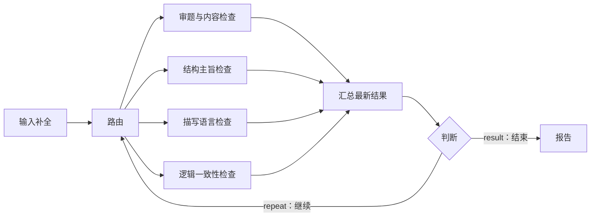

# 作文四维评审 Flow：结构化派发实现

> 状态：已实现，2026-09-15。取代此前待实施方案。基线见 [Harness Flow 分析](harness-flow.md)。

## 1. 结论

原来的 route@1 只选择边，回边按节点迭代，不能可靠表达跨轮选择不同类型、独立上下文和按类型保留结果。现新增可作为普通 DAG 节点使用的结构化派发控制器，复用 Kernel Task、spawn、interaction、持久状态与权限机制。保留旧插件版本和旧检查点行为。

完整可运行定义见 [essay-review-isolated.flow](../../packages/llm-ui/src/flows/library/essay-review-isolated.flow)。编辑图包含九个节点：输入补全、路由、四个独立检查、汇总、判断、报告。



| 图节点 | 可编辑职责 |
|---|---|
| route@3 | 单选/多选、并发数、候选顺序、history 隔离策略 |
| check@1 | 稳定结果 key、Agent/模型、提示词、显式输入 bindings、选择条件、输出校验；每次选中创建独立 Task |
| aggregate@2 | 按 key 保留各类型最新返回，可设置 initialResults |
| judge@1 | maxRounds（默认 10）、threshold（默认 9）、metric（默认 score）；高级 until 和人工 revision |

检查类型由实际连线决定，可以增删检查节点，无需同步修改路由中的内嵌 branches。默认判断要求所有已连接类型的当前版本结果达标；达标项不再被选中。高级 until 自定义终止表达式时，应同时配置检查节点的 when 选择条件。

图在校验和执行入口编译为一个持久化派发作用域，外部执行依赖仍为 DAG。route、aggregate、judge 是可独立编辑的控制算子，共用控制器的持久状态；check 才会派生独立 Kernel Task。纯汇总/判断算子不支持独立重试、预算、能力或补偿；这些设置放在路由或检查节点，错误配置会在编译时拒绝。内部连线固定为 result → input，判断回边是 repeat 控制边；不能绕过汇总或从外部直接接入检查节点。

旧 route@2 文件在编辑器打开时自动展开，保存后才写回文件，不覆盖已有用户修改。无需删除模板或执行系统恢复。判断连回 route@3 时编辑器自动创建 repeat 控制边。数字字段支持 `${params.maxRounds}` 等运行参数绑定。

一次路由、该批子任务执行与汇合算一轮；人工等待和同一子 Task 的重试不增加轮数。

## 2. 输入和停止契约

- `builtin.input@1.0.0` 声明 fields：type、label、required、nonBlank、default；prompt/initial 可定制。两项都缺就提示两项，只缺一项只要求该项；合法已填值不会被补缺回复覆盖。
- 必填 FlowParameter 使用 `onMissing: interact` 时允许进入运行，且定义校验要求有对应 input collector。空白字符串视配置为无效。等待可持久恢复，不会提前调用评分模型。
- 示例四项检查：审题与内容、结构主旨、描写语言、逻辑一致性。分数范围 0–10，输出含 score/issues/suggestions。
- 示例 `maxRounds: 10`、输入 `passScore: 9`；二者都可以改。四项必须存在、属于当前输入版本且达到阈值。每次新分数替换旧分数，不能取历史最高分。
- 第 10 轮先判断达标，再判断上限；停止原因为 `condition_met` 或 `max_rounds`，不会派发第 11 轮。
- 用户尚未指定谁改稿，因此默认检查后再次路由。可配置 `revision.fields/prompt` 在批次间等待人工修订；修改输入生成新版本，旧返回仍保留但 `current=false`，不能参与新版本达标判断。反复检查本身不保证分数提高。

## 3. 可复用配置

公共类型见 [dispatch.ts](../../packages/llm-common/src/agent/dispatch.ts)。route@2 配置如下：

| 参数 | 语义 |
|---|---|
| branches | 带稳定 key 的目标节点模板；数量、插件、能力、模型和重试可配置 |
| mode | exclusive 单选；multicast 多选 |
| selectionOrder | 默认 missing-first 优先缺失/过时类型；declared 按声明顺序 |
| maxRounds | 必填，1–1000，业务轮数上限 |
| maxConcurrency | 当前路由子任务并发上限，同时受 Run 并发限制 |
| until | 在 inputs/results/round/inputRevision 上计算的可序列化停止表达式 |
| context | history 为 none 或 explicit，后者仅使用显式 messages |
| requireNoHistory | 为 true 时禁止分支放宽 history 隔离 |
| publishToHistory | 默认 false；与持久结果存储独立 |
| initialResults/inputRevision | 调用方显式提供初始结果和输入版本 |
| revision | 可选批次间人工修改字段及提示 |

每个 branch 可配置 `when`、`input` 表达式映射、`instruction`、`context`、`publishToHistory`、`output` 选择表达式、`outputFormat`（value/json）、`outputSchema` 和语义 `validate`。表达式使用 literal/path/布尔/比较运算；动态参数通过 inputs 读取，不能执行任意代码。

`when` 负责选择候选，missing-first 仅调整候选顺序。如果未满足 until 却没有可选分支，运行明确失败，避免静默成功或无进展死循环。

## 4. prompt 与 history

每次调用创建新的 TaskSpec，其模型 messages 依次来自：

1. 目标 Agent 自身 system 指令或显式绑定的 Agent/SystemPrompt。
2. 当前 branch.instruction。
3. 仅在 history=explicit 时加入配置的 user/assistant messages。
4. 当前 branch.input 显式映射结果编码为 JSON user 消息。

不导入父 Task/Session 的 history、memory 或隐式依赖输出。引用 Agent/SystemPrompt 必须由宿主提供身份 binder，不能静默退化为无指令调用。目标工具和能力仍经原有宿主装配；子任务 deferred start，授权完成才开始。工作区目录沿用所属 Run 的默认目录，也允许目标显式配置。

目标可为普通插件节点；flow.value 输入映射到 inputs，flow.input 映射到 values，自定义 Program 则把映射字段合入其 input 根对象。目标自己的静态 inputs 作为默认值，显式 branch.input 优先。

持久 Task output 始终可读取。`publishToHistory` 控制子 Task 事件是否进入主会话，默认关闭；节点 `outputPolicy.includeInRunOutput` 控制是否出现在最终 Run 汇总，`outputPolicy.publishToHistory` 控制图节点的会话事件发布。示例只发布最终报告。

## 5. 汇总与恢复

控制器等待当前选中 Task 的真实 Kernel 返回，使用持久 parent/spawnKey 关联，而不是相信模型自报的维度。结果按 key 保存 `{value,inputRevision,round,taskId}`；对外增加 `current` 标记。

一批结果全部成功且通过校验后才合并；失败会保留旧已提交状态并使控制器失败，不把部分新结果误当完整批次。未选择的类型保持原值。本轮选中集、已 spawn 集、已收到结果均在 durable state 中，恢复继续等待同一 Task，不重复调用。

`builtin.aggregate@1.0.0` 是可独立连接的通用节点：固定输入 `previous`、`updates`，输出 `result`，按键覆盖合并。route 控制器内部复用同一合并函数，同时管理轮次和输入版本。它与 Run 根 `flow.aggregate@1` 不同。

子 Task 可通过 Run 成员查询，并参与暂停、恢复、取消和全局并发限制。直接对内部子 Task 发起图重试会被拒绝，应重试其所属 route 作用域。

## 6. 接入 DAG / CLI

- FlowDraft/FlowRevision 使用 plugin=`builtin.input`、`builtin.route`（必须指定 pluginVersion=`2.0.0`）、`builtin.aggregate`，用 result 数据端口连接下游。
- 可直接加载示例 .flow 为草稿，发布后走既有 flowToDag → DurableFlowExecutor；测试也覆盖实际示例的校验、编译与运行。
- CLI Workflow DSL 新增通用 `kind: node`，通过 node.plugin/pluginVersion/config 配置这些节点，不需要新增每种业务的 DSL 分支。外部 Agent 工厂只负责传统 agent 类型。
- 示例声明 maxRounds/maxConcurrency/passScore 运行参数，默认 10/4/9；每次运行可在参数表单覆盖。review.config 使用完整参数模板绑定轮数和并发；修改 branches 调检查类型、规则和 prompt。实际模型连接由宿主连接槽绑定。

## 7. 源码与验收

| 范围 | 实现 |
|---|---|
| 输入补齐 | [input.ts](../../packages/llm-flow/src/flow/structured/input.ts) |
| 配置校验/模板准备 | [validation.ts](../../packages/llm-flow/src/flow/structured/validation.ts)、[prepare.ts](../../packages/llm-flow/src/flow/structured/prepare.ts) |
| 派发/汇合/循环 | [dispatch.ts](../../packages/llm-flow/src/flow/structured/dispatch.ts) |
| prompt/调用实例 | [invocation.ts](../../packages/llm-flow/src/flow/structured/invocation.ts) |
| 权限、并发与恢复装配 | [reconcile.ts](../../packages/llm-flow/src/flow/structured/reconcile.ts) |
| 集成验收 | [structured-flow.test.ts](../../packages/llm-flow/__tests__/structured-flow.test.ts) |

自动验收覆盖缺一项/两项、部分回复、history 污染隔离、四类累积、降分替换、输出校验失败无部分提交、1/10 轮限制、人工等待后重启不重复 spawn、修订旧分失效、全局并发和取消。LLM Effect 使用测试替身；真实 Provider 和桌面交互尚未做端到端验收。

## 8. 明确边界

首版不支持 route@2 的目标再嵌套 route@2 或 builtin.flow；也不允许 route@2 参与旧回边循环。它是可接入 DAG 的结构化派发作用域，并非任意递归图解释器。传统 delegation 继续使用现有机制。

maxNodes 对静态图及扩图保守预留最大子任务数量；token 统计在返回时汇入父控制器，并非跨全部任务的硬额度账本。任意宿主身份变更、跨主机故障和外部设备未知结果保证仍以 Harness/Kernel 契约为准。

## 9. 统一节点契约：已实现

### 9.1 公共调用配置与结果

route 的 `invocationDefaults` 提供公共 prompt、context、connectionId/model 和 outputContract。检查节点设置自己的 systemPrompt，可追加局部 prompt、覆盖 context；省略时继承公共配置。`requireNoHistory` 是外层约束，开启后禁止任何配置引入 history。

实际消息顺序为目标 Agent/节点的 system 指令、可选 explicit 消息快照、公共任务 prompt 加节点局部 prompt。旧 branch.instruction 保持原 system 指令语义。默认不读取 Session/父任务 history；explicit 是配置中固定的 user/assistant 消息，不会在恢复时读取最新聊天记录。“继承配置”与“读取父会话历史”是两种行为，当前不提供后者的隐式模式。

作文模板已集中输出 schema 和修复策略，检查节点不再重复 bindings、返回选择表达式和输出 schema。下面配置可以由图编辑器设置：

```yaml
invocationDefaults:
  connectionId: default
  context: { history: none }
  prompt: |
    作文要求：${param.requirements}
    作文内容：${param.essay}
    根据你的检查职责评审。
  outputContract:
    format: json
    onInvalid: repair
    retries: 1
    schema:
      type: object
      required: [score, issues, suggestions]
      properties:
        score: { type: number, minimum: 0, maximum: 10 }
        issues: { type: array, items: { type: string } }
        suggestions: { type: array, items: { type: string } }
      additionalProperties: false
```

运行时把共享 schema 接入已有结构化输出请求，解析命名 `result` 输出（兼容 Agent message.content），再执行本地 schema 和语义校验。局部输出契约不能绕过公共校验；非法结果不会进入成功结果集。格式修复次数限定 0–3，repair 默认 1；发生在同一 Task 内，不增加业务轮次。复杂场景仍可使用旧 output/select 和 bindings。

### 9.2 输入节点与运行变量

`builtin.input` 支持 `param` 字段声明，兼容旧 fields；两者不能同时声明。字段定义包含 type、label、required、nonBlank、default、minimum/maximum、options 及 widget。widget 支持 text、textarea、number、select、checkbox。输入字段可在编辑器中增删、改名、选择类型和控件；默认值与选项通过 JSON 输入。运行时缺项表单经任务控制面提交，切换任务会关闭旧表单，旧 attachment 不能提交到新任务。

```yaml
param:
  requirements: { type: string, widget: textarea, required: true, nonBlank: true }
  essay: { type: string, widget: textarea, required: true, nonBlank: true }
```

| 引用 | 语义 |
|---|---|
| `${param.essay}` | 当前作用域已完成输入节点的值，优先于启动预填值 |
| `${params.essay}` | 兼容写法，与 param 访问同一值空间 |
| `${nodes.collect.outputs.result.essay}` | 已声明上游节点的命名输出字段 |
| `${state.results.content.value.score}` | 派发作用域中已通过校验的结果 |
| `${state.results.content.current}` | 结果是否适用于当前输入版本 |
| `${iteration.round}` | 当前派发轮次；普通 DAG 节点为当前节点执行迭代 |

引用编译器生成显式控制依赖，无需手写 bindings 或额外注入模型 history。启动值、交互后输入、上游输出在节点真正提交前形成调用快照；派发 prompt 在每次 spawn 前按当前输入版本渲染。作文修订会更新输入版本，旧结果保留但不能参与新版本达标判断。

整值引用保留原始类型；prompt 使用文本/JSON 序列化。替换仅执行一次，作文中自带的 `${...}` 文本不会再次解释。未知字段报错，重复输入生产者和引用引入的依赖环在编译时拒绝。同一作用域的每个输入字段只有一个生产者；复合 Flow 的字段按编译作用域隔离，跨作用域必须通过端口显式传值。

变量选择器提供参数、命名输出和公共 schema 中的检查字段；提示词预览无需模型调用。预览展示内联系统指令、公共/局部任务模板与可用默认参数；Agent 实体绑定和缺失运行值仍在实际运行前解析。

### 9.3 判断节点：引用输出，无需脚本

常用模式仍只设置 metric、threshold、maxRounds，自动检查所有已连接检查类型的当前结果。高级 `condition` 支持单比较和 all/any 组合，编译为原有 SerializableExpression：

```yaml
condition:
  all:
    - value: ${state.results.content.current}
      operator: eq
      expected: true
    - value: ${state.results.content.value.score}
      operator: gte
      expected: ${param.passScore}
maxRounds: 10
```

operator 支持 eq/neq/gt/gte/lt/lte。引用缺失时该比较不成立，不会因两个缺失值相等而误判成功。外部命名输出也可作为比较值；编译器生成对应依赖。循环中应使用 state 中已汇总的版本化结果，不能引用尚未结束的本作用域最终输出。条件满足或轮数耗尽都会停止，停止原因保留区分。

自定义 condition/until 时，检查节点的 when 控制选择；默认不自动推导任意自定义条件的反向选择逻辑。使用默认 threshold/metric 模式时会自动跳过已达标项。

### 9.4 汇总：持久 join 与可定制 reducer

aggregate 的配置包括 strategy（latest/append）、failure（fail/partial）、可选 reducer 标识、projection 和 initialResults。内部等待集合是本轮实际选中的 spawn Task，未选中的图节点不参加本轮等待。

Kernel 负责 Task 生命周期、父子身份和持久事件；Flow 按 `task-exited.spawnKey` 关联当前轮次，校验退出状态与返回值。重复事件不重复计入，旧轮次的迟到事件不覆盖当前结果。合并按选中顺序执行，与任务完成顺序无关。

`results` 始终按 key 保留最新有效结果，供下一轮路由和默认判断使用；`summary` 是可定制 reducer 的输出。latest 汇总槽位，append 追加成功槽位。未选中类型不丢失。默认一项失败即本批失败；partial 允许提交成功项，但失败类型的旧分数会失效，并在 failures 中返回原因。projection 在最终输出时对 `{summary}` 求值。

复杂规则无需写读取 Kernel 数据库的代码。宿主可以注册版本化纯 reducer，并在注册 Program 时传入同一个 registry：

```ts
const reducers = new FlowReducerRegistry();
reducers.register('count@1', (_previous, updates) => Object.keys(updates).length);
registerDurablePrograms(kernel, reducers);
```

图中 aggregate 设置 `reducer: count@1` 即可引用。reducer 输入为持久槽位，必须纯且确定；版本注册不可重复，恢复时宿主需提供同版本实现。网络/文件等副作用仍由 Task/Effect 执行；模型撰写总结使用下游 LLM 节点。

### 9.5 兼容与执行边界

- 旧 fields、bindings、branch.instruction、route@2 配置仍兼容；展开旧紧凑草稿时保留公共配置和汇总规则，不覆盖已安装文件。
- 新调度快照带 `templateVersion: 1`；恢复不带该标记的旧快照时保留其已有节点配置，不重新套用新引用解析。
- 路由/检查/汇总/判断仍编译为一个持久派发作用域，检查是独立 Task。控制图目前仍要求此作用域结构，不能把任意回边解释成任意有状态程序。
- 插件 manifest 的 authoring 能力驱动调用实体选项与输入字段编辑器。普通 DAG 节点复用统一引用编译和调用前解析；不强迫纯计算节点配置 prompt。
- 数字 JSON schema 增加 minimum/maximum，运行校验和端口 schema 兼容性检查均遵守边界。

核心代码：`llm-common/src/agent/flow-templates.ts`、`llm-flow/src/flow/structured/{references,condition,join,invocation,prepare}.ts`。回归覆盖无连线参数引用、类型保持、模板不二次解释、输入修订、共享输出修复、部分失败、reducer 顺序与扩展、UI 字段和命名输出选择；既有恢复/隔离/轮数测试继续执行。
