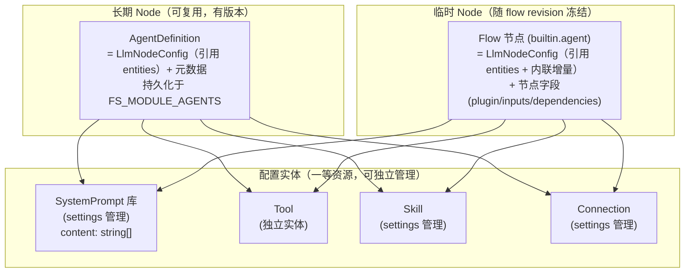
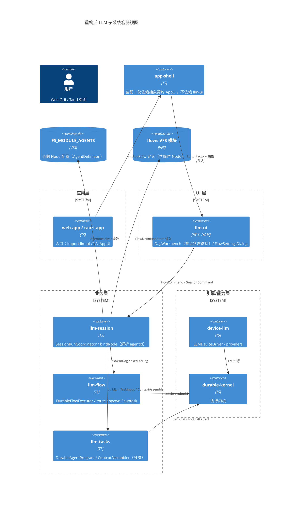
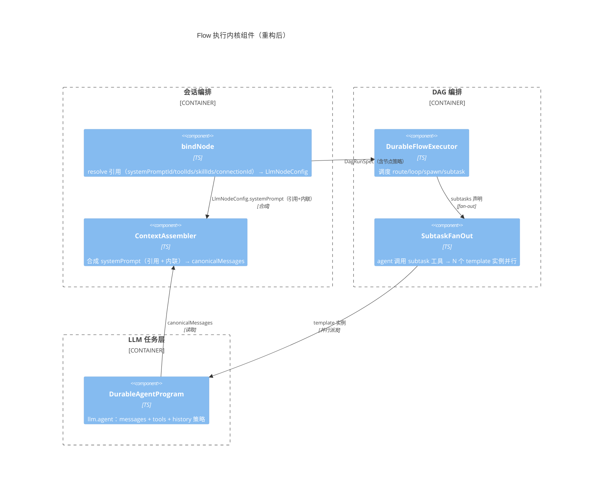
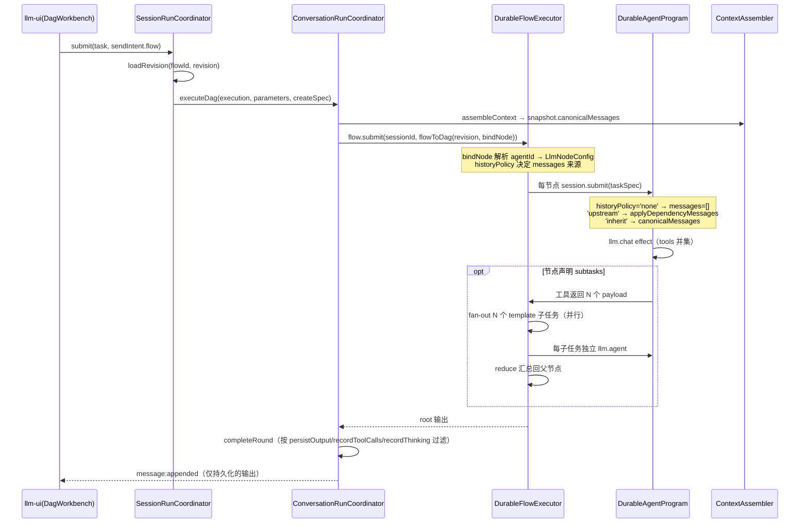

# Flow 执行模型重构设计（审查稿）

> 状态：设计草案，待评审
> 关联：`doc/architecture.md`、`doc/interface-contracts.md`、`doc/event-flows.md`
> 动机：Flow 节点与独立 Agent 配置割裂；systemPrompt 未分块；缺 subtask / history 控制 / 输出过滤

## 1. 目标与原则

1. **Agent = 长期 Node，Flow 节点 = 临时 Node，共享同一份配置结构**（`LlmNodeConfig`），消除两套并行定义。
2. systemPrompt / tools / skills 全部**数组化 + source 分块**，可独立 append / 覆盖 / 审计 / 裁剪。
3. Flow 补齐三项执行能力：**subtask 委派**、**节点级 history 控制**、**输出过滤**。
4. 保持分层铁律：llm-flow 不依赖 llm-session；app-shell 不依赖 llm-ui（已达成）。

---

## 2. 现状问题（重构动机）

| # | 问题 | 证据 |
|---|------|------|
| P1 | Agent 与 Flow 节点配置**不同构** | Agent 是结构化字段（`AgentDefinition.config.systemPrompt` + `capabilityPolicy.toolIds`）；Flow 节点是扁平 `JsonValue`（`config.prompt` + `config.toolIds` + `capabilities[]` 混在一起） |
| P2 | systemPrompt 单字符串 | `AgentDefinition.systemPrompt: string`（`llm-common/src/llm/agent.ts:24`）；`ContextAssembler.assemble(systemPrompt: string, skillsPrompt: string)`（`llm-tasks/src/core/context-assembler.ts:60-61`） |
| P3 | 节点 prompt / capabilities 被覆盖成死代码 | `bindNode` 里 `prompt: task.input.text` + `capabilities: setup.config.capabilityPolicy?.toolIds`（`llm-session/src/session/session-run-coordinator.ts:304`） |
| P4 | 无 subtask 委派 | `spawn` 仅静态 patch-graph（`llm-flow/src/flow/operations.ts:13`） |
| P5 | 无节点级 history 控制 | 所有 agent 节点 `messages: snapshot.canonicalMessages`（`session-run-coordinator.ts:305`） |
| P6 | 无显式输出过滤 | 仅「root 进 history、中间节点不进」的隐式行为（`conversation-run-coordinator.ts:82-95`） |
| P7 | Agent 未静态引用 skill | `capabilityPolicy = { toolIds, mcpProfileIds }`，缺 `skillIds`（`agent.ts:77`） |

---

## 3. 核心设计：统一节点配置 `LlmNodeConfig`

**回答「Agent 是否该与 Flow 节点同配置」：现在不是，重构后统一。**



**核心：Agent 与 Flow 节点共享同一 `LlmNodeConfig`，且 systemPrompt / tools / skill / connection 都是「配置实体 + id 引用」，改实体处处生效。**

### 3.1 `LlmNodeConfig`（llm-common 定义，两侧共用）

```ts
export type HistoryPolicy = 'inherit' | 'none' | 'upstream';

/** System Prompt 库中的可复用指令片段（settings 中管理）。 */
export interface SystemPromptDefinition {
    id: string;
    name: string;
    description?: string;
    content: string[];          // 多段 system 消息（底层多个 role:'system'）
}

/** 统一节点配置：Agent（长期）与 Flow 节点（临时）共用。 */
export interface LlmNodeConfig {
    // ── 引用配置实体（改一处，处处生效）──
    systemPromptId?: string;     // 引用 SystemPrompt 库实体
    toolIds?: string[];          // 直接引用 tool（tool 是独立实体）
    skillIds?: string[];         // 引用 skill
    mcpProfileIds?: string[];    // 引用 MCP profile
    connectionId?: string;       // 引用 connection

    // ── 内联增量（追加到引用之后）──
    systemPrompt?: string[];     // 节点任务指令（追加 system 段）

    // ── 模型 ──
    modelTier?: ModelTier;
    modelName?: string;
    temperature?: number;
    thinking?: boolean;
    reasoningEffort?: 'low' | 'medium' | 'high' | 'xhigh';
    maxTokens?: number;

    // ── 执行策略 ──
    maxExchanges?: number;
    approval?: 'none' | 'external' | 'all';
    historyPolicy?: HistoryPolicy;        // 默认 'inherit'
    persistOutput?: boolean;              // 默认 false
    recordToolCalls?: boolean;            // 默认 true
    recordThinking?: boolean;             // 默认 false

    // ── 记忆（仅长期 Node/Agent 持有；flow 节点不继承）──
    memoryPolicy?: {
        namespaceId: string;
        readScopes: string[];
        writeScopes: string[];
        retrievalLimit?: number;
    };
}
```

### 3.2 两侧形态

```ts
// 长期 Node（Agent）—— 命名组合：引用一套配置实体 + 元数据 + 版本
export interface AgentDefinition {
    id: string;
    version?: string;
    name: string;
    type: AgentType;                       // 'agent' | 'composite' | 'tool' | 'workflow'
    icon?: string;
    description?: string;
    tags?: string[];
    config: LlmNodeConfig;                 // ← 引用 systemPromptId/toolIds/skillIds/connectionId
    interface?: AgentInterfaceDef;
    defaultPrompts?: PromptPreset[];
    createdAt?: number;
    modifiedAt?: number;
}

// 临时 Node（Flow）—— builtin.agent 节点的 config
export interface FlowAgentNodeConfig extends Partial<LlmNodeConfig> {
    agentId?: string;                      // 快捷方式：一次性继承该 Agent 的整套引用
    subtasks?: SubtaskDecl;                // 子任务委派声明
}
```

**关键语义：引用 + 内联增量（resolve 时合成）**

```
节点有效配置 = resolve(引用) ⊕ 内联增量
  systemPrompt = resolve(systemPromptId).content  ⊕  内联 systemPrompt[]   （数组 concat）
  tools        = resolve(toolIds)                 （纯引用，tool 是独立实体）
  skills       = resolve(skillIds)                （纯引用）
  connection   = resolve(connectionId)            （纯引用）
  策略(historyPolicy/persistOutput 等) = 节点显式值 ?? agentId 继承值 ?? 默认
```

- 节点可直接 `systemPromptId + toolIds + skillIds + connectionId` 精确组合，也可 `agentId` 一次性继承某个 Agent 的整套引用（`agentId` 是「命名的配置快照」快捷方式）。
- `agentId` 缺失 → 回退 session 当前 Agent（兼容现状）。
- 不引入 ToolSet 实体：节点直接 `toolIds` 引用 tool；SystemPrompt 作为 settings 里的「库」管理，不进 nav 顶层。
- `systemPrompt` 保持数组，底层为多个 `role:'system'` 消息；provider 适配：Chat/Responses/Anthropic 原样多 system，Gemini 合并。

---

## 4. C4 架构（重构后）

### 4.1 Container 视图



### 4.2 Component 视图（Flow 执行内核 + 统一配置）



---

## 5. 接口契约

| 接口 | 位置 | 说明 |
|------|------|------|
| `LlmNodeConfig` | `llm-common` | 统一节点配置（引用 + 内联增量；Agent 与 Flow 节点共享） |
| `SystemPromptDefinition` | `llm-common` | SystemPrompt 库实体（`id/name/content: string[]`，settings 管理） |
| `HistoryPolicy` | `llm-common` | `'inherit' \| 'none' \| 'upstream'` |
| `FlowAgentNodeConfig` | `llm-common/flow-definition` | Flow 节点 config（extends Partial<LlmNodeConfig> + agentId/subtasks） |
| `FlowDraft.systemPrompt?/toolIds?` | `llm-common/flow-definition` | flow 级公共引用（作为未指定 agentId 时的默认基座） |

**systemPrompt 合成（引用 + 内联增量，数组 concat）**：

```
节点 systemPrompt[] = resolve(systemPromptId).content  ⊕  内联 systemPrompt[]
底层消息 = 每个元素一个 { role: 'system', content }
```

**tools 合成（纯引用，无 ToolSet 层）**：

```
节点 tools = resolve(toolIds)（tool 是独立实体，直接引用）
```

provider 适配：OpenAI Chat / Responses / Anthropic 保留多 system；Gemini 合并为单个 systemInstruction。

**tools/skills 合并（数组 union 去重）**：

```
最终 tools = 基座.toolIds ∪ 节点.toolIds ∪ loadedSkill.tools
```

---

## 6. 事件流

### 6.1 Flow 执行（含 subtask / history / 输出过滤）



### 6.2 history 控制语义

| `historyPolicy` | messages 来源 | 适用场景 |
|---|---|---|
| `inherit`（默认） | `snapshot.canonicalMessages` | 普通对话节点 |
| `none` | `[]`（仅继承的 systemPrompt + 显式输入） | 隔离的子任务、独立评估 |
| `upstream` | `applyDependencyMessages`（上游节点输出） | 多 Agent 流水线，只传上下文不传会话历史 |

### 6.3 输出过滤语义

| 开关 | false 时行为 |
|---|---|
| `persistOutput` | 节点输出不进会话 history（仅走 DAG 数据流） |
| `recordToolCalls` | `assistantMessage.tool_calls` 剥离后进 history |
| `recordThinking` | thinking 字段剥离后进 history |

---

## 7. UI 可视化（nav / 节点状态）

### 7.1 节点卡片徽标（DagCanvas.renderNode）

在现有节点卡片（`name` + `kind` + `In/Out ports`）基础上，增加一行**策略徽标**（用 `ENTITY_ICONS`/`ACTION_ICONS`，禁止 emoji）：

```html
<article class="dag-node">
  <strong>name</strong>
  <small class="dag-node__kind">Agent</small>
  <!-- 新增策略徽标行 -->
  <div class="dag-node__badges">
    <span class="dag-badge dag-badge--subtask" title="Subtask">↳ 子任务</span>   <!-- subtasks 存在时 -->
    <span class="dag-badge dag-badge--history-inherit" title="继承历史">H:inherit</span>
    <span class="dag-badge dag-badge--persist" title="输出入历史">P</span>       <!-- persistOutput=true -->
  </div>
  <small class="dag-node__ports">In … · Out …</small>
</article>
```

徽标规则：
- **subtask**：节点 `subtasks` 声明存在时显示「子任务」徽标（区分于普通节点）；被 fan-out 出来的临时子任务节点用同色边框高亮。
- **history 继承状态**：`H:inherit` / `H:none` / `H:upstream` 三态徽标，颜色区分（inherit 灰 / none 橙 / upstream 蓝）。
- **persistOutput**：`P` 徽标，标识该节点输出会进入会话历史。

### 7.2 Inspector 编辑（SchemaForm）

`builtin.agent` 节点的 config schema 增补字段：
- `systemPromptId`（下拉：SystemPrompt 库）
- `toolIds`（多选：tool 列表）
- `skillIds`（多选：skill 列表）
- `connectionId`（下拉：connection）
- `agentId`（可选快捷方式：一次性继承整套 Agent 引用）
- `historyPolicy`（enum：inherit / none / upstream）
- `persistOutput`（boolean）
- `subtasks`（工具名 + 子任务模板）

选择 `agentId` 后，inspector 展示该 Agent 的整套引用（只读）；也可直接逐项指定 `systemPromptId/toolIds/skillIds/connectionId` 精确组合。

### 7.3 侧边栏 / 导航（vfs-ui 层面）

Flow 运行产生的临时子任务，若 `persistOutput=true`，在会话文件树中以子节点/徽标显示；否则不进入导航树（仅运行时执行树中可见）。

---

## 8. 数据迁移与兼容

1. **AgentDefinition.config.systemPrompt: string → LlmNodeConfig.systemPromptId 引用 SystemPrompt 库**：旧内联 string 迁移为「SystemPrompt 库实体 + `systemPromptId` 引用」，或暂作内联 `systemPrompt: [string]`（向后兼容）。
2. **旧 Flow 节点扁平 config（prompt/connectionId/toolIds）→ FlowAgentNodeConfig**：`flowToDag`/`bindNode` 读取时容错，缺 `agentId`/`systemPromptId` 回退 session Agent（不破坏现有 flow 文件）。
3. **`capabilityPolicy` 增 `skillIds`**：可选，旧数据 `undefined` 视为空数组。
4. **`ContextBlock` 不变**：不扩展 source（systemPrompt 合成走「引用 + 内联」，不进 ContextBlock 分块）。

---

## 9. 分阶段落地

| 阶段 | 内容 | 包 | 验证 |
|---|---|---|---|
| **P1 数据模型** | `LlmNodeConfig`（引用 + 内联）+ `SystemPromptDefinition` + `HistoryPolicy`；`capabilityPolicy.skillIds`；`FlowDraft/Revision.systemPrompt/toolIds`；`FlowAgentNodeConfig` | llm-common | typecheck |
| **P2 运行时（配置统一）** | `bindNode` resolve 引用（systemPromptId/toolIds/skillIds/connectionId）→ 合并 `LlmNodeConfig`；`agentId` 快捷方式 | llm-session / llm-tasks | typecheck + test |
| **P3 三能力** | 节点级 `historyPolicy` / `persistOutput` / `subtasks`（文本文件通讯 + history 隔离） | llm-flow / llm-tasks | test |
| **P4 UI/seed** | SystemPrompt 库（settings）+ 节点卡片徽标 + inspector 引用字段；`default-flows` 改「引用 + 节点增量」 | llm-ui / llm-session | typecheck |

---

## 10. 已决策 / 待确认

**已决策**（本轮评审确定）：

1. **memoryPolicy**：仅 Agent 长期形态持有，flow 临时节点不继承（靠显式文本传参，不靠隐式记忆）。
2. **subtask 通讯模型**：子任务有自己的 `historyPolicy`（可继承父 history）；子任务 history 永进父 history；返回最后一个任务结果写入 task 输出文件，父任务随时读；**所有任务文本通讯**。
3. **systemPrompt / tools 引用模型**：systemPrompt、tool、skill、connection 均为「配置实体 + id 引用」，Agent 与 Flow 节点用 `LlmNodeConfig` 引用；`systemPromptId` 引用 SystemPrompt 库（settings 管理），`toolIds` 直接引用 tool（不引入 ToolSet 层）。
4. **systemPrompt 数组化**：`systemPrompt: string[]`（引用 resolve 结果 ⊕ 内联增量），底层多 system 消息，不拼字符串。

**待确认**：

5. **统一大 Node（Composite）**：本次只做「数据模型统一（LlmNodeConfig）」，**不合并 Agent/Flow 执行路径**（不引入嵌套 flow）。若后续确需「flow 作为节点复用/嵌套」，再评估 Composite 执行统一（叶子→单次 LLM，复合→递归 DAG）。
