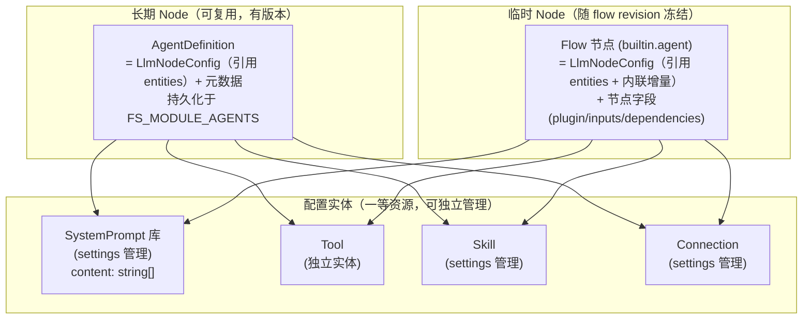
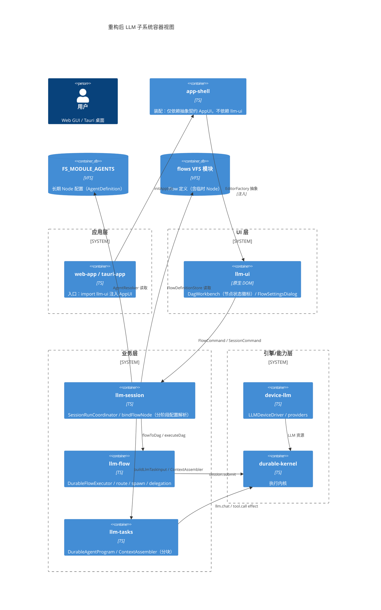
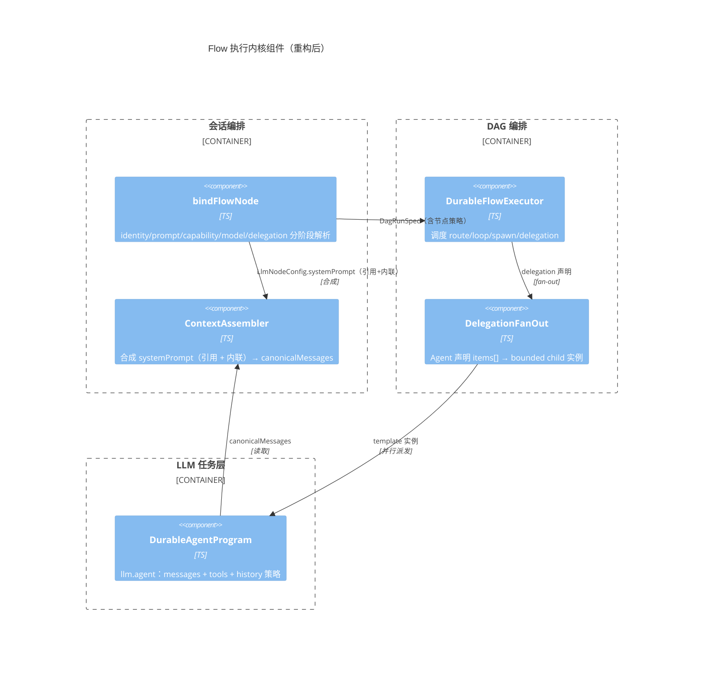
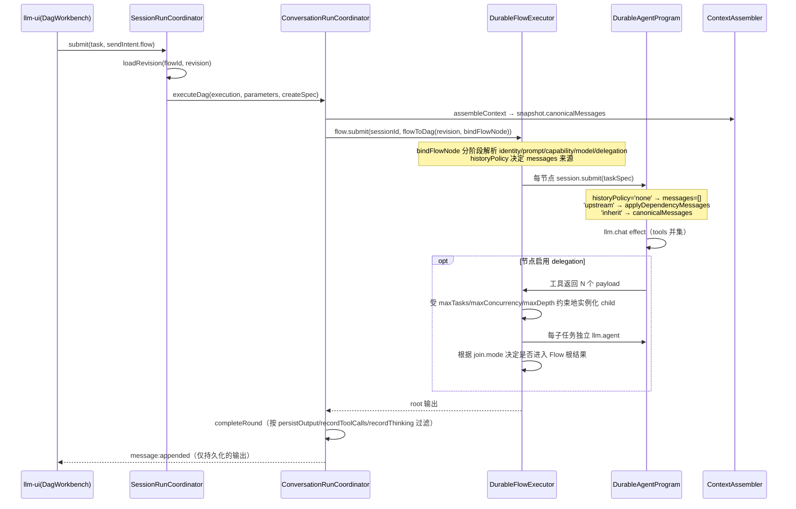

# Flow 执行模型与配置工作台设计

> 状态：已实施（2026-08-25 更新配置继承、动态委派与工作台交互）
> 关联：`doc/architecture.md`、`doc/interface-contracts.md`、`doc/event-flows.md`
> 动机：Flow 节点与独立 Agent 配置割裂；systemPrompt 未分块；缺 delegation / history 控制 / 输出过滤

## 1. 目标与原则

1. **Agent = 长期 Node，Flow 节点 = 临时 Node，共享同一份配置结构**（`LlmNodeConfig`），消除两套并行定义。
2. systemPrompt / tools / skills 全部**数组化 + source 分块**，可独立 append / 覆盖 / 审计 / 裁剪。
3. Flow 补齐三项执行能力：**结构化动态委派**、**节点级 history 控制**、**输出过滤**。
4. 保持分层铁律：llm-flow 不依赖 llm-session；app-shell 不依赖 llm-ui（已达成）。
5. 配置行为必须**显式、局部可解释**：不得根据“第一个节点”等易随拓扑变化的条件隐式改变身份或权限。
6. 编辑器必须同时显示“本层设置、继承来源、最终生效值”，避免可填写但运行时不生效的伪配置。

### 1.1 配置层级与覆盖规则

`builtin.agent` 的有效配置按以下固定顺序解析，越靠右优先级越高：

```text
系统默认 → Session Agent → Flow defaults → agentId 引用 → Node 显式设置
```

- 标量字段采用 `node ?? agent ?? flow ?? session ?? system`，包括 connection/model/temperature/maxTokens/thinking/reasoningEffort/approval/maxExchanges。
- 集合字段采用稳定顺序的 union 去重：`Flow ∪ Agent ∪ Node config ∪ Node capabilities`。
- System Prompt 采用有序合成：`Flow → Agent → Node systemPromptId → Node inline prompt`。
- `undefined` 表示继承；`false`、`0` 和空数组是显式值，不得被 truthy/falsy 判断吞掉。
- `agentId` 是一组默认值的快捷引用，不得覆盖 Node 已显式填写的值。

### 1.2 History 与 System Prompt 解耦

`historyPolicy` 只决定对话上下文来源，不再隐式决定是否获得默认 System Prompt：

| historyPolicy | 对话上下文 |
|---|---|
| `inherit` | Session canonical history |
| `upstream` | Task 输入 + 上游节点输出 |
| `none` | 仅 Task 输入，不继承 Session/上游对话 |

System Prompt 由独立的 `systemPromptPolicy` 控制：

| systemPromptPolicy | 行为 |
|---|---|
| `inherit` | 使用 Flow/Agent 默认提示词，并追加节点引用和内联指令（默认） |
| `replace` | 忽略 Flow/Agent 提示词，仅使用节点引用和内联指令 |
| `none` | 不注入任何 System Prompt |

不采用“DAG 第一个节点继承 Session System Prompt”的规则。DAG 可以有多个根、路由和循环；配置语义不得因增加一条边而悄然变化。

---

## 2. 重构前问题（历史动机）

| # | 问题 | 证据 |
|---|------|------|
| P1 | Agent 与 Flow 节点配置**不同构** | Agent 是结构化字段（`AgentDefinition.config.systemPrompt` + `capabilityPolicy.toolIds`）；Flow 节点是扁平 `JsonValue`（`config.prompt` + `config.toolIds` + `capabilities[]` 混在一起） |
| P2 | systemPrompt 单字符串 | `AgentDefinition.systemPrompt: string`（`llm-common/src/llm/agent.ts:24`）；`ContextAssembler.assemble(systemPrompt: string, skillsPrompt: string)`（`llm-tasks/src/core/context-assembler.ts:60-61`） |
| P3 | 节点 prompt / capabilities 被覆盖成死代码 | `bindNode` 里 `prompt: task.input.text` + `capabilities: setup.config.capabilityPolicy?.toolIds`（`llm-session/src/session/session-run-coordinator.ts:304`） |
| P4 | 无动态委派 | `spawn` 仅静态 patch-graph，无法由 Agent 产生 bounded child tasks |
| P5 | 无节点级 history 控制 | 所有 agent 节点 `messages: snapshot.canonicalMessages`（`session-run-coordinator.ts:305`） |
| P6 | 无显式输出过滤 | 仅「root 进 history、中间节点不进」的隐式行为（`conversation-run-coordinator.ts:82-95`） |
| P7 | Agent 未静态引用 skill | `capabilityPolicy = { toolIds, mcpProfileIds }`，缺 `skillIds`（`agent.ts:77`） |

---

## 3. 核心设计：统一节点配置 `LlmNodeConfig`

**回答「Agent 是否该与 Flow 节点同配置」：现在不是，重构后统一。**



**核心：Agent 与 Flow 节点共享同一 `LlmNodeConfig`，且 systemPrompt / tools / skill / connection 都是「配置实体 + id 引用」，改实体处处生效。**

### 3.1 `LlmNodeConfig`（llm-common 定义，两侧共用）

```ts
export type HistoryPolicy = 'inherit' | 'none' | 'upstream';
export type SystemPromptPolicy = 'inherit' | 'replace' | 'none';

/** System Prompt 库中的可复用指令片段（settings 中管理）。 */
export interface SystemPromptDefinition {
    id: string;
    name: string;
    description?: string;
    content: string[];          // 多段 system 消息（底层多个 role:'system'）
}

/** 统一节点配置：Agent（长期）与 Flow 节点（临时）共用。 */
export interface LlmNodeConfig {
    // ── 引用配置实体（改一处，处处生效）──
    systemPromptId?: string;     // 引用 SystemPrompt 库实体
    toolIds?: string[];          // 直接引用 tool（tool 是独立实体）
    skillIds?: string[];         // 引用 skill
    mcpProfileIds?: string[];    // 引用 MCP profile
    connectionId?: string;       // 引用 connection

    // ── 内联增量（追加到引用之后）──
    systemPrompt?: string[];     // 节点任务指令（追加 system 段）

    // ── 模型 ──
    modelTier?: ModelTier;
    modelName?: string;
    temperature?: number;
    thinking?: boolean;
    reasoningEffort?: 'low' | 'medium' | 'high' | 'xhigh';
    maxTokens?: number;

    // ── 执行策略 ──
    maxExchanges?: number;
    approval?: 'none' | 'external' | 'all';
    historyPolicy?: HistoryPolicy;        // 默认 'inherit'
    systemPromptPolicy?: SystemPromptPolicy; // 默认 'inherit'，与 history 解耦
    persistOutput?: boolean;              // 默认 false
    recordToolCalls?: boolean;            // 默认 true
    recordThinking?: boolean;             // 默认 false

    // ── 记忆（仅长期 Node/Agent 持有；flow 节点不继承）──
    memoryPolicy?: {
        namespaceId: string;
        readScopes: string[];
        writeScopes: string[];
        retrievalLimit?: number;
    };
}
```

### 3.2 两侧形态

```ts
// 长期 Node（Agent）—— 命名组合：引用一套配置实体 + 元数据 + 版本
export interface AgentDefinition {
    id: string;
    version?: string;
    name: string;
    type: AgentType;                       // 'agent' | 'composite' | 'tool' | 'workflow'
    icon?: string;
    description?: string;
    tags?: string[];
    config: LlmNodeConfig;                 // ← 引用 systemPromptId/toolIds/skillIds/connectionId
    interface?: AgentInterfaceDef;
    defaultPrompts?: PromptPreset[];
    createdAt?: number;
    modifiedAt?: number;
}

// 临时 Node（Flow）—— builtin.agent 节点的 config
export interface FlowAgentNodeConfig extends Partial<LlmNodeConfig> {
    agentId?: string;                      // 快捷方式：一次性继承该 Agent 的整套引用
    instruction?: string;                  // 节点任务指令（规范字段）
    delegation?: DelegationConfig;         // 结构化动态委派
    subtasks?: SubtaskDecl;                // deprecated，仅兼容旧数据
}
```

**关键语义：引用 + 内联增量（resolve 时合成）**

```
节点有效配置 = resolve(引用) ⊕ 内联增量
  systemPrompt = resolve(systemPromptId).content  ⊕  内联 systemPrompt[]   （数组 concat）
  tools        = resolve(toolIds)                 （纯引用，tool 是独立实体）
  skills       = resolve(skillIds)                （纯引用）
  connection   = resolve(connectionId)            （纯引用）
  策略(historyPolicy/persistOutput 等) = 节点显式值 ?? agentId 继承值 ?? 默认
```

- 节点可直接 `systemPromptId + toolIds + skillIds + connectionId` 精确组合，也可 `agentId` 一次性继承某个 Agent 的整套引用（`agentId` 是「命名的配置快照」快捷方式）。
- `agentId` 缺失 → 回退 session 当前 Agent（兼容现状）。
- 不引入 ToolSet 实体：节点直接 `toolIds` 引用 tool；SystemPrompt 作为 settings 里的「库」管理，不进 nav 顶层。
- `systemPrompt` 保持数组，底层为多个 `role:'system'` 消息；provider 适配：Chat/Responses/Anthropic 原样多 system，Gemini 合并。
- `instruction` 是 Flow 节点的一条任务指令；`systemPrompt[]` 是可复用身份/约束片段。二者虽然最终都形成 system 消息，但用途不同。旧 `prompt` 仅作为读取兼容字段，节点下次编辑时迁移为 `instruction`。
- 配置层统一使用 `modelName` 表示精确模型 id；`model` 仅保留在 provider/task request 内部以及旧 Flow 的兼容读取路径。

---

## 4. C4 架构（重构后）

### 4.1 Container 视图



### 4.2 Component 视图（Flow 执行内核 + 统一配置）



---

## 5. 接口契约

| 接口 | 位置 | 说明 |
|------|------|------|
| `LlmNodeConfig` | `llm-common` | 统一节点配置（引用 + 内联增量；Agent 与 Flow 节点共享） |
| `SystemPromptDefinition` | `llm-common` | SystemPrompt 库实体（`id/name/content: string[]`，settings 管理） |
| `HistoryPolicy` | `llm-common` | `'inherit' \| 'none' \| 'upstream'` |
| `FlowAgentNodeConfig` | `llm-common/flow-definition` | Flow 节点 config（extends Partial<LlmNodeConfig> + agentId/instruction/delegation） |
| `FlowDraft.systemPrompt?/toolIds?` | `llm-common/flow-definition` | flow 级公共引用（作为未指定 agentId 时的默认基座） |

**systemPrompt 合成（引用 + 内联增量，数组 concat）**：

```
节点 systemPrompt[] = resolve(systemPromptId).content  ⊕  内联 systemPrompt[]
底层消息 = 每个元素一个 { role: 'system', content }
```

**tools 合成（纯引用，无 ToolSet 层）**：

```
节点 tools = resolve(toolIds)（tool 是独立实体，直接引用）
```

provider 适配：OpenAI Chat / Responses / Anthropic 保留多 system；Gemini 合并为单个 systemInstruction。

**tools/skills 合并（数组 union 去重）**：

```
最终 tools = 基座.toolIds ∪ 节点.toolIds ∪ loadedSkill.tools
```

---

## 6. 事件流

### 6.1 Flow 执行（含 delegation / history / 输出过滤）



### 6.2 history 控制语义

| `historyPolicy` | messages 来源 | 适用场景 |
|---|---|---|
| `inherit`（默认） | `snapshot.canonicalMessages` | 普通对话节点 |
| `none` | Task 显式输入（不含 Session history / 上游输出） | 隔离的子任务、独立评估 |
| `upstream` | `applyDependencyMessages`（上游节点输出） | 多 Agent 流水线，只传上下文不传会话历史 |

### 6.3 输出过滤语义

| 开关 | false 时行为 |
|---|---|
| `persistOutput` | 节点输出不进会话 history（仅走 DAG 数据流） |
| `recordToolCalls` | `assistantMessage.tool_calls` 剥离后进 history |
| `recordThinking` | thinking 字段剥离后进 history |

---

## 7. UI 可视化（nav / 节点状态）

### 7.1 节点卡片徽标（DagCanvas.renderNode）

在现有节点卡片（`name` + `kind` + `In/Out ports`）基础上，增加一行**策略徽标**（用 `ENTITY_ICONS`/`ACTION_ICONS`，禁止 emoji）：

```html
<article class="dag-node">
  <strong>name</strong>
  <small class="dag-node__kind">Agent</small>
  <!-- builtin.agent 节点的策略徽标行 -->
  <div class="dag-node__badges">
    <span class="dag-badge dag-badge--agent" title="引用 Agent">research-agent</span>   <!-- config.agentId 非空时 -->
    <span class="dag-badge dag-badge--history dag-badge--history-inherit" title="History policy">H:inherit</span>
    <span class="dag-badge" title="System Prompt policy">SP:replace</span>           <!-- systemPromptPolicy 为 replace/none 时 -->
    <span class="dag-badge dag-badge--persist" title="Persist output">P</span>       <!-- persistOutput=true -->
    <span class="dag-badge dag-badge--subtask" title="Subtask fan-out">子任务</span>   <!-- delegation.enabled 或旧 subtasks 时 -->
  </div>
  <small class="dag-node__ports">In … · Out …</small>
</article>
```

徽标规则（仅 `builtin.agent` 节点渲染，实现见 `llm-ui/src/components/dag/DagCanvas.ts` 的 `nodeBadges`）：
- **agent 引用**：`config.agentId` 非空时显示该 id（title="引用 Agent"）。
- **history 继承状态**：`H:inherit` / `H:none` / `H:upstream` 三态徽标，颜色区分（inherit 灰 / none 橙 / upstream 蓝）；未配置或非法值按 inherit 显示。
- **System Prompt 策略**：`SP:replace` / `SP:none` 徽标，仅在非 inherit 时出现。
- **persistOutput**：`P` 徽标（title="Persist output"），标识该节点输出会进入会话历史。
- **delegation**：节点 `delegation.enabled=true`（或旧 `subtasks`）时显示「子任务」徽标（title="Subtask fan-out"）；运行时实例在执行树中显示父实例与序号，不以节点 id 字符串推断层级。

### 7.2 Flow 默认设置

Flow 必须提供一组可选默认值，供未显式配置的 Agent 节点继承：

```ts
export interface FlowDefaults {
    agentId?: string;
    connectionId?: string;              // Flow connection slot name
    systemPromptId?: string;
    systemPrompt?: string[];
    toolIds?: string[];
    skillIds?: string[];
    modelName?: string;
    temperature?: number;
    maxTokens?: number;
    thinking?: boolean;
    reasoningEffort?: 'low' | 'medium' | 'high' | 'xhigh';
    approval?: 'none' | 'external' | 'all';
    maxExchanges?: number;
}
```

Connection 仍使用 Flow slot：slot 绑定全局 Connection，节点和 defaults 只引用 slot 名。重命名或删除 slot 时必须检查引用。

### 7.3 Inspector 编辑（专用 Agent 表单）

通用 `SchemaForm` 仅作为未知插件的回退。`builtin.agent` 使用专用 Inspector，按以下区域组织：

1. **身份与任务**：Agent、System Prompt、节点指令、Prompt 合并策略；
2. **模型**：Connection slot、模型与推理参数；
3. **能力**：Tools、Skills，多选并展示继承来源；
4. **上下文与输出**：historyPolicy、persistOutput；
5. **执行策略**：approval、maxExchanges、timeoutMs、maxIterations、workingDirectory、delegation。

实体引用必须使用可搜索选择器，不允许要求用户手写 id 或 JSON 数组。每个可继承字段提供“继承”状态，并展示解析后的来源与生效值。

对应配置字段：
- `systemPromptId`（下拉：SystemPrompt 库）
- `toolIds`（多选：tool 列表）
- `skillIds`（多选：skill 列表）
- `connectionId`（下拉：connection）
- `agentId`（可选快捷方式：一次性继承整套 Agent 引用）
- `historyPolicy`（enum：inherit / none / upstream）
- `persistOutput`（boolean）
- `delegation`（基础区：启用、工具名、Child Agent/指令；高级区：上下文、fan-out、结果、失败与请求限制）

选择 `agentId` 后，inspector 展示该 Agent 的整套引用（只读）；也可直接逐项指定 `systemPromptId/toolIds/skillIds/connectionId` 精确组合。

### 7.4 Flow 输入参数与运行表单

`FlowParameter` 是 Flow 的公开签名。运行前 UI 根据声明生成表单并完成 required/type/default 校验；节点编辑器通过变量选择器插入 `${params.<name>}`，用户无需记忆模板语法。

基础类型为 `string/number/boolean/json`；后续 UI schema 可扩展 `text/select/file/files/secret`，secret 不得进入 revision、日志或普通参数默认值。

### 7.5 工作台交互

- 单击选择，双击编辑；右侧 Inspector 直接编辑常用字段，复杂配置进入完整 Dialog。
- 未选节点时展示 Flow 概览、defaults、参数、connections 和校验问题，而非只有 edge 列表。
- Node 卡片展示继承状态、Agent/模型、history、persistOutput 和错误徽标，不显示原始 JSON。
- Edge 使用端口下拉和类型检查，不要求手填 output/input。
- 支持未保存提示、离开保护、撤销/重做状态、快捷键、多选与批量操作。

### 7.6 侧边栏 / 导航（vfs-ui 层面）

Flow 运行产生的临时子任务，若 `persistOutput=true`，在会话文件树中以子节点/徽标显示；否则不进入导航树（仅运行时执行树中可见）。

### 7.7 Spawn 与动态委派

两种机制共享节点模板编辑器，但语义严格分离：

- `builtin.spawn`：确定性的静态 patch-graph，配置预定义 nodes/edges，本身不是 LLM Harness。
- `builtin.agent.delegation`：LLM 调用声明工具产生 `items[]`，每项实例化一个 Agent 模板。

```ts
type DelegationContextSource = 'session' | 'parent' | 'upstream' | 'isolated';

interface DelegationConfig {
    enabled: boolean;
    toolName?: string;                     // default: delegate_tasks
    toolDescription?: string;
    template?: Partial<LlmNodeConfig> & {
        agentId?: string;
        systemPromptId?: string;
        instruction?: string;              // prompt? 为 deprecated 兼容字段
        contextSource?: DelegationContextSource;
        includeParentSystemPrompt?: boolean;
        includeToolResults?: boolean;
        connectionId?: string;
        modelName?: string;
        toolIds?: string[];
        skillIds?: string[];
        approval?: 'none' | 'external' | 'all';
        workingDirectory?: string;
    };
    fanout?: { maxTasks?: number; maxConcurrency?: number; maxDepth?: number; order?: 'parallel' | 'sequential' };
    join?: { mode?: 'all' | 'none' };
    execution?: { mode?: 'structured' | 'detached' };
    wait?: { mode?: 'all' | 'any' | 'first-success' | 'quorum'; quorum?: number; timeoutMs?: number };
    result?: { mode?: 'collect' | 'discard'; order?: 'declared' | 'completion' };
    failure?: { policy?: 'fail-fast' | 'continue' | 'retry'; maxAttempts?: number; backoffMs?: number };
    budget?: { maxTokens?: number; timeoutMs?: number }; // 每次 LLM request 的限制
}
```

动态实例必须在创建前完成与普通节点相同的 Flow/Agent/SystemPrompt/Tool/Skill 解析。`parent` 继承父 Harness 消息；`session` 继承会话；`upstream` 只接收数据依赖输出；`isolated` 不接收会话或上游正文，仅保留解析后的 child system instructions 和 payload。默认限制集中在 `DELEGATION_DEFAULTS`：8 个任务、4 并发、1 层深度。

委派深度由执行器内显式 runtime map 维护；动态节点 id 包含父执行迭代，不能用于推断深度。并发 lane 使用 `kind='control'` 的 DAG 边，仅参与调度；只有 `kind='data'` 的边会把输出注入模型上下文。

`join.mode='all'` 表示子节点输出进入 Flow 根结果，`none` 表示排除输出；两者都会等待已经启动的子任务完成。`failure.policy='fail-fast'` 在首个最终失败后取消同组兄弟并使 Flow 失败，`continue` 保留其他任务，`retry` 先按 retry policy 重试，耗尽后按 fail-fast 处理。

当前没有运行时 USD 扣费器，因此不暴露 `maxCostUsd`。接入定价快照与 `chargeBudget(..., 'usd', amount)` 后才能重新提供费用上限。

### 7.8 外部 Harness 对照与后续编排设计

#### 7.8.1 结论：保留 DAG，补齐 TaskGroup 控制面

Codex 与 Claude Code 的共同模式不是为每种并行行为增加一种新节点，而是把能力分层：

1. `spawn` 创建有稳定身份的子任务；
2. dependency / DAG 决定任务何时可运行；
3. `await` / join 决定调用方何时继续；
4. task handle 提供 status、follow-up、cancel、retry 和 transcript；
5. team/task board 仅用于需要多个自治 Agent 协作的高阶场景。

Codex 支持并行 subagent、等待汇总、检查子线程、向运行中子任务追加指令及停止任务，并允许为自定义子 Agent 设置独立模型、指令和权限。Claude Code 将普通 subagent、后台任务、Agent Teams 和 Dynamic Workflows 分开：独立任务并行，团队任务通过共享任务列表和依赖协调，大规模任务由可恢复脚本编排。

参考：

- [OpenAI Codex Subagents](https://learn.chatgpt.com/docs/agent-configuration/subagents)
- [OpenAI Codex Long-running work](https://learn.chatgpt.com/docs/long-running-work)
- [OpenAI Codex Hooks](https://learn.chatgpt.com/docs/hooks)
- [OpenAI Codex Worktrees](https://learn.chatgpt.com/docs/environments/git-worktrees)
- [Claude Code parallel agents](https://code.claude.com/docs/en/agents)
- [Claude Code Agent Teams](https://code.claude.com/docs/en/agent-teams)
- [Claude Code Dynamic Workflows](https://code.claude.com/docs/en/workflows)
- [Claude Code Worktrees](https://code.claude.com/docs/en/worktrees)

因此，**DAG 继续作为唯一的执行 IR**。固定依赖、fan-out、fan-in、路由和循环仍用 nodes/edges 表达；不再创建第二套 JavaScript workflow runtime。动态 Agent 委派在 DAG 之上增加 TaskGroup/handle 控制面，必要时把高级编排编译为 DAG/Kernel wait，而不是绕过 DAG 调度。

#### 7.8.2 当前能力基线与实际缺口

2026-09-08 按当前源码核对。设计目标与现有实现分开记录，不能把旧缺口清单当成当前状态：

| 能力 | 当前实现 | 仍需补齐或验收 |
|---|---|---|
| 持久子任务 | Kernel 幂等 child spawn；Flow delegation 暴露 group 与 task IDs | builtin.spawn 的统一 Agent task handle 工具面仍需核验 |
| 动态等待 | Kernel task/child/any/all/quorum；Flow delegation all/any/first-success/quorum | 通用 `await_tasks` Agent 工具仍需补齐 |
| 任务控制 | Task pause/interrupt/resume/cancel；DagWorkbench task tree、signal/cancel | 单任务 retry 与独立持久 transcript 查询/交换分页/面板展示/JSON 和纯文本导出已接入；pending interaction 后同进程调度延续已修复，并以单次/连续人工回应后的下游输出验证；重试下游重算、transcript 底层存储分页和完整阻塞诊断仍需补齐 |
| 持久通讯 | Kernel cross-session outbox/inbox 与带 token 的 TaskBoard claim/renew/complete | 受限 Agent mailbox/task board 产品接线仍需核验 |
| 并发 | Flow maxNodes/maxConcurrency/timeoutMs/maxTokens 已接入 executor；节点上限覆盖初始图、patch 和 delegation | 恢复后的 Flow 调度状态及预算连续性仍需验收 |
| 生命周期 | Kernel Session suspend/resume；Flow Goal 与运行 UI | Goal 完成条件验证、后台通知与恢复仍需验收 |
| 工作区 | Git worktree manager；未配置 manager 时非 shared 模式拒绝执行 | 三端装配、自动合并与冲突处理 UI 仍需核验 |
| 结构化输出 | Agent responseFormat/outputValidation、Inspector；data edge 端口 schema 引用在发布/直接执行/动态 patch 校验 | 已提供受限 schema 注册表、data edge 内容校验与同 id 跨版本的子类型推导；responseFormat 到端口契约的自动绑定仍待补齐 |
| Memory/Context | ConversationSystemOptions → createSessionManager → SessionManager 已传递 retrieveMemory 注入点，检索接收当前 Session 与复制的 memoryPolicy；Agent 每次模型请求前按配置裁剪历史并保护系统指令、当前用户请求和完整工具组 | 已装配 Session 内持久 memory provider；跨 Session 共享、模型记忆工具、语义摘要及长期运行恢复仍待完成 |
| 扩展点 | Harness hooks 已有 host trust/hash/timeout/output boundary，Flow 发出生命周期事件 | 完整事件接线与信任管理 UI 仍需核验 |

源码依据：`llm-flow/src/flow/executor.ts`、`delegation-runtime.ts`、`builtin-plugins.ts`，`llm-ui/src/components/DagWorkbench.ts`，`llm-session/src/session/session-manager.ts`，`llm-tasks/src/durable/agent-program.ts`。`cd packages/llm-flow && npx vitest run` 实测全套 132 项通过（计数随代码演进，以实际测试输出为准）；这些测试不替代上述尚待验收的 UI、恢复与平台能力。

#### 7.8.3 Spawn 依赖边界

`builtin.spawn` 可以定义同一 graph patch 内 spawned nodes 的依赖边；固定已知依赖继续直接画在主 DAG 中。动态 patch 只允许以下依赖目标：

```ts
type SpawnDependencyTarget =
    | { type: 'spawned'; node: string }      // 同批动态节点
    | { type: 'parent' }                     // 发起 spawn 的节点
    | { type: 'upstream'; port: string };    // 预声明的上游输入
```

禁止动态任务随意引用任意全局节点或尚未创建的未来节点。Graph patch 在应用前校验（`llm-flow/src/flow/graph-patch.ts`）：

- node/edge id 唯一且 idempotency key 生效；
- edge 完整保留 `kind` 与 `onFailure`；
- 不存在悬空引用、非法端口和动态新增环；
- patch 后总节点数不超过 Flow 限制。

边的目标必须是本批新节点，来源可以是本批节点、parent 或 parent 的直接入边节点；不允许 patch 修改既有节点的依赖。未指定端口时使用 result/input，control edge 不检查数据端口。校验完成后才发布节点和边，失败时不创建 patch 子任务，并取消本次运行剩余任务、释放已准备的 workspace。相同 idempotency key 和内容在当前 executor 内跳过，同键不同内容拒绝；跨进程恢复仍待补齐。

运行失败清理（2026-09-08）：初始节点超限在打开 Session、触发 hook 和准备工作目录前拒绝；取得 workspace 后的编译、调度、hook、委派、超时及 graph effect 异常均进入统一失败路径，尝试取消尚未完成的已提交实例，并调用 workspace.finish(failed)。清理也失败时抛 AggregateError 保留两项原因。正常返回后的 workspace 清理只执行一次，FlowExecutionHandle.workspaceCompletion 提供可等待的结果，清理失败不改写已成功的根 Task；Run 查询和面板已接入 workspaceFinalization（pending/succeeded/failed），错误单独展示，不改写根任务结果。执行器先将 pending 写入 Session shared `flow.run.<rootTaskId>.workspace`，清理结束后保存结果；新命令服务可从记录读取。pending 时根任务已结束也继续刷新。DagCommandServiceOptions 可注入 workspaceManager，实际平台管理器装配仍按宿主能力提供。保存最终状态也失败时 workspaceCompletion 拒绝并保留错误；旧持久记录可能停在 pending，不伪报完成。宿主崩溃后的清理续跑/状态恢复仍待实现。取消使用 Promise.allSettled，不能把单个取消失败当作已确认停止。这些是存活进程的清理保证，尚不是崩溃后的租约回收或 Flow 调度恢复。

无依赖 spawned nodes 可以并发执行；一个节点有多个入边时，DAG fan-in 天然表示静态 `wait all`，不需要额外 Wait 节点。只有运行时 task handle、`any`、`first-success`、`quorum` 或 timeout 等动态等待才进入 TaskGroup/`await_tasks` API。

#### 7.8.4 分离等待、结果与后台生命周期

> 2026-09-05：下列 TaskGroup 策略的内核生命周期、持久传播和暂停确认以 [Durable Harness 协议 §12](durable-harness-protocol.md#12-监管session-与-taskgroup) 为目标规范。该协议仍待实现；Flow 应编译到其 Task/Wait/control 原语，不维护另一套执行事实。

旧 `join.mode` 同时承载“是否收集结果”和“是否等待”，兼容字段的 `all/none` 都等待已启动 child。当前 delegation 已拆分 execution/wait/result；下面展示策略模型，准确字段以 `llm-common` 类型和 `delegation-runtime.ts` 为准：

```ts
interface TaskGroupPolicy {
    execution: {
        mode: 'structured' | 'detached';
    };
    wait: {
        mode: 'all' | 'any' | 'first-success' | 'quorum';
        quorum?: number;
        timeoutMs?: number;
    };
    result: {
        mode: 'collect' | 'discard';
        order?: 'declared' | 'completion';
    };
}
```

默认 `structured + all + collect`：父任务/Flow 结束前等待 children，父级取消向下传播。`detached` 必须显式选择，并同时声明 owner session、失败可见位置、结果持久化位置、预算和取消策略，避免 orphan task 与失控费用。

Agent 侧统一提供受权限和配额约束的工具：

```ts
spawn_tasks(input): Promise<{ groupId: string; taskIds: string[] }>;
list_tasks(input): Promise<TaskSummary[]>;
await_tasks(input: {
    taskIds: string[];
    mode: 'all' | 'any' | 'first-success' | 'quorum';
    quorum?: number;
    timeoutMs?: number;
}): Promise<TaskGroupResult>;
send_task(input: { taskId: string; message: string }): Promise<void>;
cancel_task(input: { taskId: string; reason?: string }): Promise<void>;
```

#### 7.8.5 运行界面与人体工程要求

Design 模式继续显示 node/edge/Flow Inspector；Run 模式增加真正的执行树，而不是只有根任务状态和整体取消：

```text
Supervisor                    running
├─ research-api               completed   42s
├─ inspect-tests              blocked     waits: research-api
├─ implement                  running     2m
└─ verify                     pending
```

每个 task 至少显示：

- resolved Agent/model/system prompt/tools/skills/permissions；
- 输入、输出、依赖、阻塞原因和 retry attempt；
- token、elapsed time、预算和后续 cost meter；
- tool calls、interaction/approval、事件与独立 transcript；
- `Open / Send follow-up / Cancel / Retry` 操作。

Flow 级运行策略补充：

```ts
interface FlowRunPolicy {
    maxNodes?: number;
    maxConcurrency?: number;
    timeoutMs?: number;
    maxTokens?: number;                    // 已完成 LLM 节点的累计 token 上限
    workspace?: {
        mode: 'shared' | 'read-only' | 'worktree';
        base?: 'current' | 'head' | string;
        merge?: 'manual' | 'auto-if-clean' | 'discard';
        cleanup?: 'on-success' | 'always' | 'keep';
    };
}
```

#### 7.8.6 结构化输出、Hooks 与 Goal

多 Agent DAG 不应依赖自然语言猜测上下游格式。`LlmNodeConfig` 已接入结构化输出。下面保留概念模型；当前 responseFormat 的 schema 使用 `json_schema: { name, schema, strict? }`，并非顶层 `schema`：

```ts
interface StructuredOutputPolicy {
    responseFormat?: {
        type: 'text' | 'json_object' | 'json_schema';
        schema?: JsonValue;
    };
    outputValidation?: {
        retries?: number;
        onInvalid?: 'fail' | 'repair' | 'continue';
    };
}
```

data edge 校验 source output schema 与 target input schema；运行时无效输出按策略 fail/repair/continue，并记录原始响应与校验错误。

当前端口契约（2026-09-10）：InputPortSpec/OutputPortSpec.schema 是 `{ id, version? }` 引用，不是内嵌 JSON Schema。目标无 schema 时不施加类型限制；目标有 schema 时，来源与目标 **id 必须相同**，不同 id 一律拒绝（语义不同，不做隐式转换）。同一 id 下 version 相同即精确匹配；version 不同（含一侧未指定版本）要求两侧引用都已注册，并对注册的结构做**子类型推导**：来源输出的每个合法值都必须满足目标输入 schema，推导失败返回 `Schema mismatch …: <原因>`。Flow 发布校验返回 incompatible-port-schema；直接 DurableFlowExecutor.submit 在打开 Session、创建 Task 或准备 worktree 前拒绝；动态 graph patch 在发布任何节点前使用同一规则。control edge 不传数据，因此跳过。实现见 `llm-flow/src/flow/port-contract.ts` 与 `llm-flow/src/flow/schema-compat.ts`。

子类型推导的受支持子集（与注册表一致，超出即拒绝）：boolean schema（`false` 是任何 schema 的子类型，`true` 只对 `true` 成立）、type（`integer ⊆ number`，其余类型必须相同；来源未声明 type 而目标声明了则拒绝）、enum（来源取值必须全部落在目标 enum 内）、object（目标的每个 `required` 键在来源中也必须 required 且有可推导的属性 schema；目标 `additionalProperties: false` 时来源不得再允许额外属性；`additionalProperties` 为 schema 时同样递归推导）、array（目标声明 `items` 时来源也必须声明且递归推导）。`oneOf`/`anyOf`/`$ref`/数值边界等不在子集内，注册阶段即被拒绝。运行时内容校验仍是权威判断，子类型推导只用于在提交前拒绝明显不兼容的图。

当前内容校验：`DagPluginRegistry.registerSchema({ id, version? }, schema)` 注册不可覆盖的结构定义；`getSchema` 返回副本，未指定版本不解析到最新版。目标端口有 schema 的 data edge 在发布、直接执行和动态 patch 时要求 id 相同、引用已注册，跨版本时结构可推导。执行器在下游 Task 创建前，以与依赖消费相同的 `extractNodeOutput` 提取成功上游产物并校验；无效数据使 submit 失败并执行已有失败清理，不会启动下游，也不会改写已成功的上游记录。control edge 不校验；上游失败继续走既有 onFailure 语义。

注册表支持 boolean schema，以及 type（object/array/string/number/integer/boolean/null）、properties、required、items、additionalProperties、enum、title、description。嵌套定义同样验证；未知关键字、无效定义明确拒绝，未声称支持完整 JSON Schema、引用解析或隐式 JSON 文本解析。Agent responseFormat 自动编译成端口引用、无消费边输出的契约验证、运行定义持久冻结以及端口错误的 repair/continue 策略仍待补齐。

Harness hooks 采用小而稳定的事件集合：

```text
run.started / run.completed
task.started / task.completed / task.failed
agent.spawned / agent.stopped
tool.before / tool.after
approval.requested
context.beforeCompact / context.afterCompact
```

Hook 可以注入上下文、审计、验证或阻止危险工具，但必须具备来源展示、内容 hash 信任、最小权限、timeout、输出上限和禁用入口；不能成为绕过 approval/sandbox 的脚本后门。

Goal 属于 Run 控制面，不属于单个 Agent node：

```ts
interface FlowRunGoal {
    objective: string;
    constraints?: string[];
    acceptanceCriteria?: string[];
    status?: 'active' | 'paused' | 'completed' | 'blocked';
}
```

Goal 支持进度摘要、追加约束、pause/resume 和完成标准验证，但不会扩大原 Flow 的工具、文件、网络或审批权限。

#### 7.8.7 同步优先级与明确不做

| 优先级 | 同步内容 | 说明 |
|---|---|---|
| **P0** | task handles/TaskGroup、`await_tasks`、task tree、单任务 steer/cancel/retry、Flow limits、structured output | 多数已有 Kernel/Provider 原语，优先完成协议接线与 UI |
| **P1** | worktree adapter、Goal、Harness hooks、memory retrieval/自动 compaction、预算统计 | 解决长任务可靠性、隔离和可治理性 |
| **P2** | Composite Flow、受限 Agent mailbox、共享 task board、claim/lease、调度/通知 | 仅在明确建设自治 Agent Teams/自动化产品时引入 |

明确不做：

1. 不新增与 DAG 并列的第二套 workflow runtime；脚本或模板只能编译到 DAG/Kernel 原语。
2. 不默认 detached child；不允许无 owner、无预算、无取消传播的后台任务。
3. 不允许跨 session DAG edge；跨 session 只通过 durable message/artifact 交换。
4. 不把共享 task board 作为普通 Flow 的必要组件；固定依赖仍由 DAG 表达。
5. 不把 Goal、worktree、hooks 等 Run/平台策略继续堆进 `builtin.agent` config。

#### 7.8.8 当前实现状态

当前已落地部分均走统一 DAG/Kernel 路径：

- Delegation 已拆分 `execution / wait / result / failure / budget`，支持 `all / any / first-success / quorum`、结构化取消、显式深度、并发和超时边界；detached 必须配置 deadline。
- 动态 spawn edge 支持 `$parent` 与 `$upstream:<nodeId>` 锚点，保留 `kind / onFailure`；无依赖节点由 DAG scheduler 自然并发。
- Flow Run 已实现 `maxNodes / maxConcurrency / timeoutMs / maxTokens`、Goal、task tree、单任务 signal/cancel、时间与 token 统计。
- Agent 已接入 `responseFormat + outputValidation`（fail/repair/continue）、可配置的逐轮历史裁剪；Session ContextAssembler 已开放 memory retrieval 注入点。
- Harness hook 使用可信来源、content hash、timeout 和输出上限的 host boundary；Flow 文档不能自行安装 hook 代码。
- Kernel Session 已支持任务恢复/列举、父子取消传播、跨 Session durable mailbox，以及带 CAS claim/renew/expiry lease 的可选 task board。
- worktree 使用 argv-safe Git manager；没有配置 workspace manager 时非 shared 模式 fail closed。
- `builtin.flow` Composite 在执行前递归展开并 namespace 到同一 DAG，带循环检测、参数绑定和入口/出口边重写，不引入嵌套 runtime。

上下文裁剪的当前语义（2026-09-08）：`maxMessages` 是触发阈值，`keepRecent` 是保留最近消息的数量（不超过阈值）。始终保留全部 system 消息和最后一条 user 消息；若保留窗口落在 tool 结果中，会扩展到对应 assistant 调用及整组结果，按原顺序返回。因此必要消息可能超过阈值，不宣称严格 token 上限。该步骤在每次模型请求前运行，结果进入持久 Task state；它不生成语义摘要，也不删除历史 Effect 记录。Agent 的模型 Effect 使用持久 exchange 序号，而非裁剪后的消息数作为操作身份，防止多轮压缩造成幂等 key 冲突。已覆盖 checkpoint 序列化重放和真实 Kernel 连续五轮工具执行。成功 load_skill 的 adapter 另附关键规则快照，Agent 在持久状态中独立保存并于每轮重注入，不依赖旧 tool 输出留存。Flow 初始化选定 Skill 的正文与关键规则均已作为 system 消息注入；直接聊天初始化及聊天内 Flow 的 AGENT.md 项目块已接入；独立 DAG RunStart 已从宿主 Session context resolver 获取项目/加载技能/索引快照，执行器冻结该快照，在静态、Composite 展开、动态 patch 和委派的每个 Agent 实例创建时写入输入；聊天内 Flow 同样提供项目/Skill 来源，相同既有系统消息去重；无预组装 messages 时也消费合并后的 systemPrompt，并遵守 inherit/replace/none。独立 skill.load、独立 DAG 的静态/Composite 节点与预声明委派模板已通过宿主 bindNode 复用会话身份绑定逻辑；运行中 graph patch 节点已在整批发布前经宿主异步解析身份，绑定失败不提交本批新增节点，原工具能力、预算和委派调度策略保持不变；内部委派模板已保留解析身份并递归限制为原模板能力声明。动态节点通过编译时 nodeDefaults 继承产生节点所属 Flow 的默认身份层，Composite 子 Flow 保留自身作用域；默认配置在提交时冻结，详见 [Skill 设计](skill-design.md#6-压缩保护修正日志与委派)。

---

## 8. 数据迁移与兼容

1. **AgentDefinition.config.systemPrompt: string → LlmNodeConfig.systemPromptId 引用 SystemPrompt 库**：旧内联 string 迁移为「SystemPrompt 库实体 + `systemPromptId` 引用」，或暂作内联 `systemPrompt: [string]`（向后兼容）。
2. **旧 Flow 节点扁平 config（prompt/model）→ FlowAgentNodeConfig（instruction/modelName）**：编辑时规范化，运行时继续兼容读取；缺 `agentId`/`systemPromptId` 回退 session Agent。
3. **`capabilityPolicy` 增 `skillIds`**：可选，旧数据 `undefined` 视为空数组。
4. **`ContextBlock` 不变**：不扩展 source（systemPrompt 合成走「引用 + 内联」，不进 ContextBlock 分块）。

---

## 9. 分阶段落地

| 阶段 | 内容 | 包 | 验证 |
|---|---|---|---|
| **P1 数据模型** | `LlmNodeConfig`（引用 + 内联）+ `SystemPromptDefinition` + `HistoryPolicy`；`capabilityPolicy.skillIds`；`FlowDraft/Revision.systemPrompt/toolIds`；`FlowAgentNodeConfig` | llm-common | typecheck |
| **P2 运行时（配置统一）** | 固定五层继承；`bindFlowNode` 分阶段 resolve 引用；Node 显式值优先；System Prompt 与 History 解耦 | llm-session / llm-tasks | typecheck + test |
| **P3 三能力** | 节点级 `historyPolicy` / `persistOutput` / `delegation`（结构化 payload + history 隔离） | llm-flow / llm-tasks | test |
| **P4 UI/seed** | Flow defaults + 参数运行表单 + builtin.agent 专用 inspector + 实体选择器；default-flows 改「引用 + 节点增量」 | llm-ui / llm-session | typecheck + UI test |
| **P5 TaskGroup 控制面** | task handles；spawn/list/await/send/cancel tools；wait/result/execution 分离；Flow maxNodes/maxConcurrency；动态 patch 校验 | durable-kernel / llm-flow / llm-tasks | 幂等 spawn、any/all/quorum、取消传播、限制测试 |
| **P6 运行可观察性与隔离** | Run task tree；单任务 steer/retry/transcript；structured output；worktree adapter；token/time/cost 统计 | llm-ui / llm-flow / durable-kernel | UI interaction + schema contract + workspace integration |
| **P7 长任务与扩展** | Goal；Harness hooks；memory retrieval/compaction；Composite Flow；按需 Agent task board/mailbox | llm-session / llm-flow / app-shell | 恢复、信任边界、长期运行与组合 Flow 测试 |

---

## 10. 已决策 / 待确认

**已决策**（本轮评审确定）：

1. **memoryPolicy**：仅 Agent 长期形态持有，flow 临时节点不继承（靠显式文本传参，不靠隐式记忆）。ConversationRunCoordinator.executeDag 在上下文组装阶段禁用 retrieveMemory，因此交给 createSpec/动态绑定器的快照不含父 Agent 的检索记忆；直聊路径继续按策略检索。
2. **delegation 通讯模型**：父 Agent 通过声明工具返回结构化 `items[]`；每项成为 child payload。child 上下文由 `contextSource` 明确选择，输出是否进入 Flow 结果由 `join.mode` 决定，不隐式写回已经结束的父 Agent。
3. **systemPrompt / tools 引用模型**：systemPrompt、tool、skill、connection 均为「配置实体 + id 引用」，Agent 与 Flow 节点用 `LlmNodeConfig` 引用；`systemPromptId` 引用 SystemPrompt 库（settings 管理），`toolIds` 直接引用 tool（不引入 ToolSet 层）。
4. **systemPrompt 数组化**：`systemPrompt: string[]`（引用 resolve 结果 ⊕ 内联增量），底层多 system 消息，不拼字符串。
5. **继承顺序**：系统 → Session Agent → Flow defaults → agentId → Node；Node 显式值最高。
6. **System Prompt 与 History 解耦**：不使用“第一个节点”拓扑特判；Prompt 通过 inherit/replace/none 明确控制。
7. **编辑器策略**：`builtin.agent` 使用专用表单；通用 SchemaForm 仅作为插件回退。

**待确认**：

8. **统一大 Node（Composite）**：采用“编译期展开”而不是嵌套 runtime。`builtin.flow` 引用不可变 Flow revision，展开后与父 Flow 共用同一个 DAG scheduler、limits、task tree 与取消域。

### 动态节点连接作用域

编译产物 `DagRunSpec.nodeConnections` 按节点保存所属 Flow 的 connections/defaultConnection 和宿主 fallbackConnectionId。Composite 展开保留子 Flow 的连接表，执行器提交时复制；patch 和委派后代继承产生节点的作用域。动态 patch 在身份绑定后、整批发布前解析连接，委派子节点在生成后、提交 Task 前解析，规则与静态节点一致：别名映射为全局连接 ID，显式全局 ID 透传，缺省取所属 Flow 默认槽位再回退宿主连接。该元数据用于连接解析，不授予工具权限；还不构成完整调度恢复或外部配置版本冻结。

### 独立任务 Transcript

`dag.run.transcript({ sessionId, taskId, targetTaskId })` 从持久 Run 根任务的 runTasks 清单校验目标归属，再返回目标任务的输入、输出、状态/version、Effect 请求/结果/错误和 interaction 记录。清单包含循环全部实例、persistOutput=false 节点和 detached 节点；根任务自身也可查询。LLM/工具交换从持久 Effect 读取，不用已压缩的 Agent 消息窗口替代，因此可查询压缩前的模型响应；Effect 数组顺序不承诺跨事件的全局时间线。重新建立 Kernel/命令服务后无需原执行句柄即可查询已有 Run 根任务。DagWorkbench 每个任务提供独立对话框，按交换分段显示记录并支持 JSON 和纯文本导出；内容写入 textContent，关闭后忽略迟到的异步结果，面板轮询不替换对话框。当前支持按 Effect 分页（默认 100、上限 500），后续页必须带首屏 version 与 nextOffset，使用精确历史快照保证翻页一致性；UI 提供加载更多，读完全部页才启用完整 JSON/纯文本导出。纯文本头包含 Session/Run/Task、节点、状态、version 和交换总数，后续分段保留完整输入、每条 Effect、interaction 和输出。输入/输出/interaction 仍完整返回，单条 Effect 大小没有字节上限，底层仍读取完整任务快照，未实现存储读取与内存按页受限，也不表示运行中调度恢复已实现；根聚合任务仍在调度后段生成，尚未生成根任务的执行不适用此查询。旧根任务没有 runTasks 清单时不猜测子任务归属。Run signal 的显式 targetTaskId 同样限定在当前句柄的 taskIds 内。

### Run 记录重新连接

根聚合任务 input.run 保存 version=1、初始 goal 和调度结束时的 usage 摘要，input.runTasks 保存全部任务实例。`dag.run.get({ taskId, sessionId? })` 在没有内存句柄时要求 sessionId，读取持久根记录并 attach 清单内任务，恢复 latest-node/iterations/taskTree/detachedNodes 与目标/用量视图；返回 attachedFromStorage=true 明确表示只重新连接记录。DagWorkbench.openRun 可传 Session ID，后续刷新沿用该 Session。打开 Run、选择/加载草稿和销毁面板会使旧请求失效；轮询另按请求序号丢弃迟到响应，旧查询失败不能停止新 Run 的刷新。查询只读取所属 Run 的任务，不再扫描整个 Session 任务表。

目标更新通过 Session shared key `flow.run.<rootTaskId>.goal` 做版本条件写入，重新连接和每次 RunGet 均优先读取更新后的目标，已连接服务也能看到其他服务实例的持久更新。目标记录写入与 Session suspend/resume 是分开的操作，后者失败仍需调用方处理；本批未实现跨操作事务。用量保持原调度摘要语义，不宣称包括后续 detached 子任务成本。根任务尚未生成、缺少 v1 根元数据的记录不支持重新连接；route/loop/patch/委派调度状态和工作目录收尾仍未恢复。

### 委派上下文的工具交换

`contextSource=parent` 的子模板仅在 includeToolResults=true 时继承父消息中的工具交换。缺省或 false 时，同时移除 tool 结果与 assistant.tool_calls，保留 assistant 原有非空正文，仅含调用而正文为空的 assistant 消息不传给子节点，避免留下没有对应结果的调用。该处理生成子消息副本，不修改父消息；不是对任意损坏历史的完整协议修复器。

### 手工重试成员准备

`prepareFlowTaskRetry(session, rootTaskId, sourceTaskId, requestId)` 先验证源任务属于 Run，再通过 Kernel 人工重试创建 deferred 新任务，使用 Session shared `flow.run.<rootTaskId>.retries` 条件写入节点、实例序号、retryOfTaskId 和预算。原始 runTasks 现在保存每节点预算；重试成员继承该声明。并发同请求复用任务/成员，不同请求按 CAS 结果分配新序号。成员登记失败不启动任务，再次提交同一请求可恢复登记；Task 创建与成员登记仍不是单事务。

RunGet 每次合并原始清单和重试成员，记录重连与 transcript 使用同一范围。最新节点可指向尚在 created 的重试，根聚合 Task 的既有结果不被改写。`dag.run.task.retry({ sessionId, taskId, targetTaskId, requestId })` 已调用准备 API、恢复节点预算并授权/启动新任务，返回新 targetTaskId。LLM 使用原 input.allowedToolIds 与已保存模型/工具输入，资源创建和原子启动按既有回执重放；非 LLM 任务直接 start。重复请求返回同一任务，旧根输出保持不变，新结果通过成员任务/transcript 查询。DagWorkbench 已为非根终态任务提供重试按钮与来源标记，响应失败时复用原请求 ID，进行中的请求禁用重复点击；根已结束但成员仍运行时继续刷新。RunCancel 重新读取成员并等待全部成员取消尝试，包括同节点的并发重试。当前仍没有下游重算、重试输出触发的新 patch/委派调度、隔离 workspace 重建或新根结果收敛，不能宣称完整图重试恢复。

并发重试的人工交互按具体 Task 匹配：`dag.run.respond` 接受可选 `targetTaskId`，先刷新持久成员清单并校验目标属于当前 Run；省略目标时，仅在所有成员中恰有一个同名 pending 请求时回应，多于一个则报歧义。Run 面板逐 Task 展示等待请求，回应窗口固定打开时的根 Task 与目标 Task，切换 Run 不改变提交目标。指定 targetTaskId 时支持已 resolved 交互同值重放，终态 Task 也可返回已保存结果；不同值拒绝。省略目标仍只搜索 pending 请求，不猜测已完成回应的目标。

Run 控制会在信号注入和单任务取消前刷新持久成员清单，允许控制其他调用方刚登记的重试任务；按 nodeId 注入信号选择当前最大 iteration 对应的任务，按 targetTaskId 则校验 Run 成员身份。Goal 编辑窗口固定打开时的 Run，信号和取消回调也固定发起时的 Run，异步完成不会刷新切换后的其他 Run；失败通过错误提示呈现。Goal 状态对 Session suspend/resume 的影响及其与目标持久化非原子的边界保持不变。

单次运行定义隔离：DurableFlowExecutor.submit 在首次异步操作前复制 DagRunSpec 和 parameters；初始节点的插件清单及其端口 schema 同时缓存，后续动态节点的定义在首次读取时缓存，包含未找到的引用。修改调用方原始对象或宿主之后返回的同名 schema 不影响已缓存定义。DagPluginRegistry 注册时复制清单并保留 runtime/UI 方法的调用接收者。此隔离不等于将定义持久化，也不冻结宿主 runtime 实现代码；跨进程恢复仍需额外持久定义机制。

工作区收尾的 status 表示清理本身的结果，和状态记录保存结果分开。清理成功但最终 shared 写入失败时，活动句柄保留 succeeded 并附加 persistenceError，workspaceCompletion 拒绝；UI 同时显示清理结果和保存错误。清理与保存同时失败以 AggregateError 保留两个原因，不重复调用 workspace.finish。此时重连只能读取最后成功写入的状态（可能仍为 pending），活动句柄的保存错误尚无可靠持久副本。

记忆检索宿主接口：ConversationSystemOptions.retrieveMemory 经会话工厂传递，调用参数为 `(plan, agent, { sessionId, policy })`，policy 来自本次解析的 Agent 配置并复制后提供，避免 provider 修改配置。返回的记忆沿用 ContextAssembler 的预算和持久 Task 输入快照流程。原有只使用前两个参数的回调仍兼容。默认宿主现已装配 SessionMemoryProvider；跨 Session 共享记忆的授权及存储策略仍未实现。

持久记忆当前实现：SessionMemoryProvider 使用 Session shared key `memory.entries.<JSON([namespaceId, scope])>` 存储条目数组。宿主 upsert/remove 按 memoryPolicy.writeScopes 精确授权，检索仅打开 readScopes；namespaceId 不隐含跨 Session 访问。写入使用 expectedVersion CAS 合并（最多 3 次），条目含 entryId/content/SHA-256 contentHash/scope/updatedAt；损坏记录拒绝读写。默认检索限制 10，0 禁用，按查询词项的包含匹配数、更新时间、scope/ID 排序；返回 entryId 编码为 `[scope, entryId]`，避免多个 scope 的同名条目混淆。app-shell 默认注入此检索器，结果进入既有上下文快照与预算流程。查询无匹配时仍可返回最近条目；这不是向量/语义检索，scope 整组读取也不是存储分页。写 API 面向可信宿主策略，不直接暴露给模型；模型写入工具、记忆编辑 UI、跨 Session 共享和长期保留/压缩策略仍待完成。

## 人工交互期间的调度延续

DurableFlowExecutor 遇到 pending interaction 时返回等待中的同一 Run，并保留当前进程的调度循环。根 flow.aggregate 以 awaitingSchedule 等待最终调度信号，不再仅因当时已提交的人工节点结束就提前成功。回应后继续处理依赖、后续交互及动态调度，最终发出 flow.schedule.completed；后台调度异常通过 flow.schedule.failed 使等待根失败。新成员写入 flow.run.<rootId>.members，Run 查询、transcript 与重新连接共用该成员清单。取消 Run 会使调度退出并取消未结束节点。

当前证据为 app-shell minimal-skill-dag 的真实 LocalFS/Run 命令组合测试：单次回应、连续两次回应后下游均执行，根身份不变，重新连接可读取最终成员。调度状态仍在进程内，Kernel 销毁后停止驱动；完整运行中重启恢复保持待办。Skill 成功路径使用固定模型响应，尚非真实模型或完整 GUI 验收。


### 人工交互边界的调度检查点

当前 executor 在发布等待人工回应的 Run 前保存 `flow.run.<rootTaskId>.scheduler`（version 1）。`resume(sessionId, rootTaskId)` 复用已存在的任务实例，恢复节点/边、循环派发、委派组、预算及配置状态，再继续提交下游。CLI resume 已使用此入口；只有结果重连的 `restoreFlowHandle` 仍不启动调度。

CLI 回归验证正常暂停→关闭存储→respond→resume，覆盖有/无下游节点与根任务 ID 不变；另有各命令独立进程的单次和连续两次暂停恢复测试，验证磁盘状态能跨进程继续执行。检查点不是每次 Task 提交的原子日志，不能保证任意 crash 点无重复提交；多个恢复者排他、隔离工作区租约及后台委派定时器恢复仍未完成。隔离工作区恢复当前明确拒绝。


恢复入口在状态装配完成后立即返回活动句柄，后台调度继续运行，调用方可开始监视与取消。若根任务尚未初始化，恢复判断使用其 input 中的 awaitingSchedule。等待模型响应时返回句柄、取消根任务后取消下游均有回归测试；测试接管已停止 Kernel 的租约，不代表生产环境应强制夺取有效租约。


CLI 的 run/resume 入口通过每个 Run 的独立 SQLite 写锁互斥，锁从创建运行时之前持有到运行时清理完成；争用立即报错，进程终止由 SQLite/操作系统释放。已验证正常退出和 SIGKILL 后重新获取。该机制限定本机 CLI 入口，不是通用 executor 的多机 fencing；不改变检查点与任务提交尚非原子的限制。


宿主关闭运行时应先停止 Kernel，再等待 `DurableFlowExecutor.waitIdle()` 与 Kernel 活动工作结束，最后关闭工具和存储。CLI 已按此顺序装配，调度进程锁在存储关闭之后释放。waitIdle 跟踪后台调度协程，不负责强制终止任意宿主回调。


CLI delete 同样先获取 Run 调度锁，再检查终态和删除目录。即使 cancel 已写入 cancelled，只要旧调度器还持锁清理，delete 就拒绝执行；锁释放后才能删除。这防止 CLI 删除流程提前移除仍被使用的存储及锁文件。


人工暂停的根任务在最终调度汇总时，另存版本化 `flow.run.<rootTaskId>.metadata`；重连优先使用其最终 token/耗时统计，避免显示首次暂停时的旧 input 数据。旧 Run 没有该记录时仍回退 input，不自动回填历史用量。
