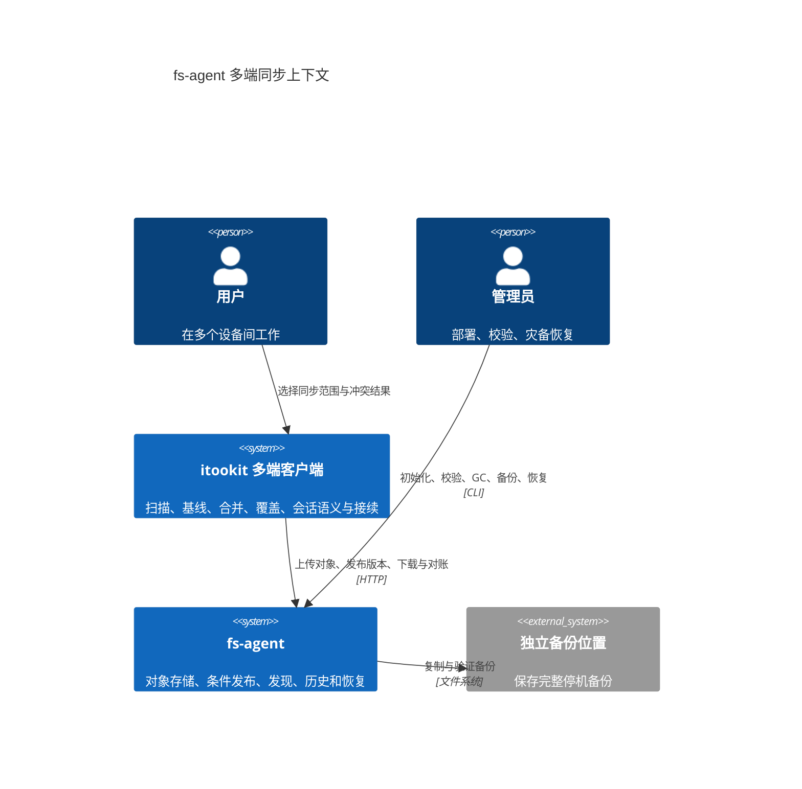
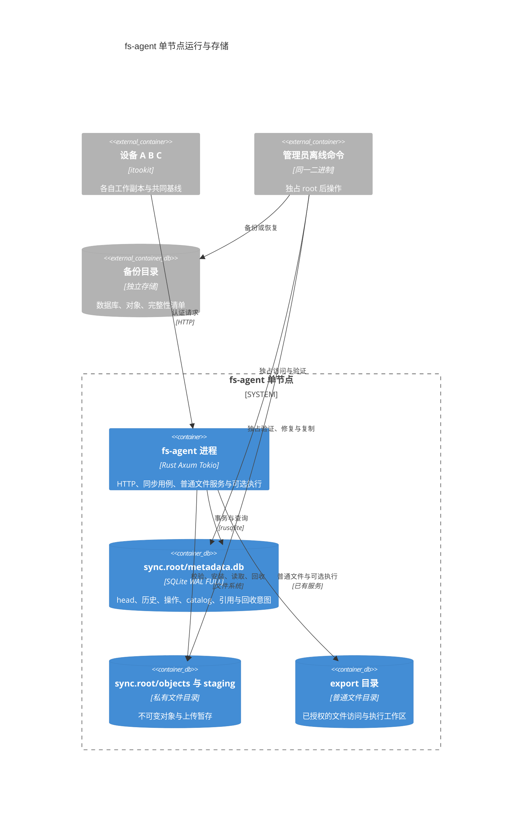
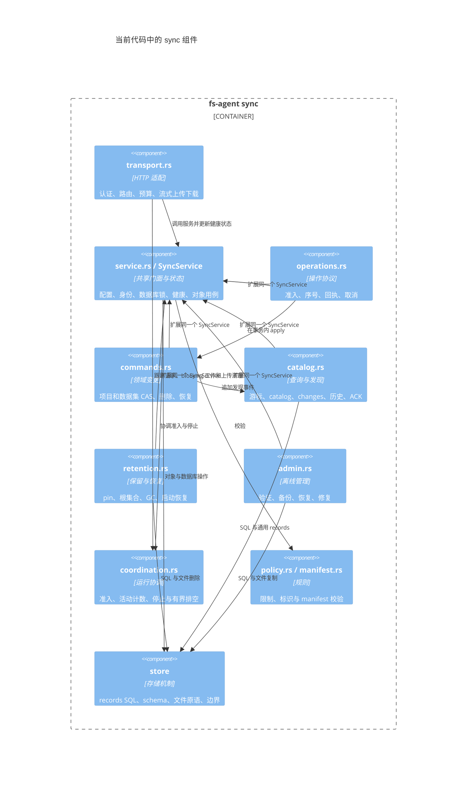
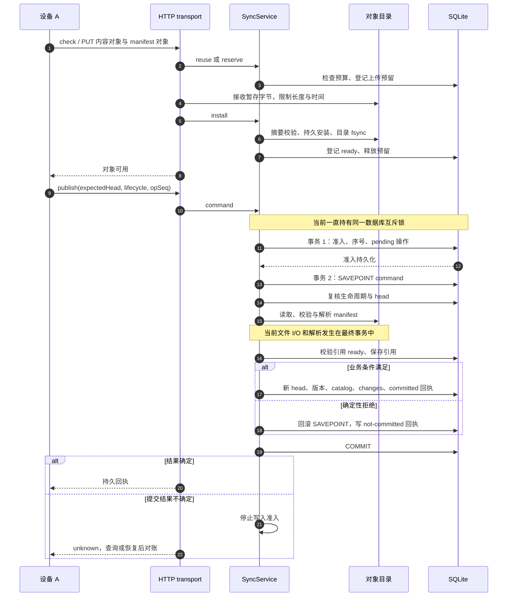
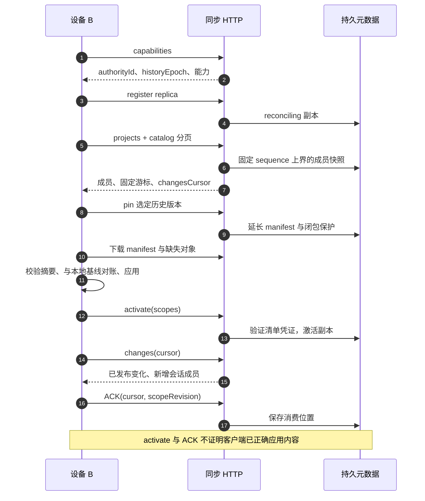
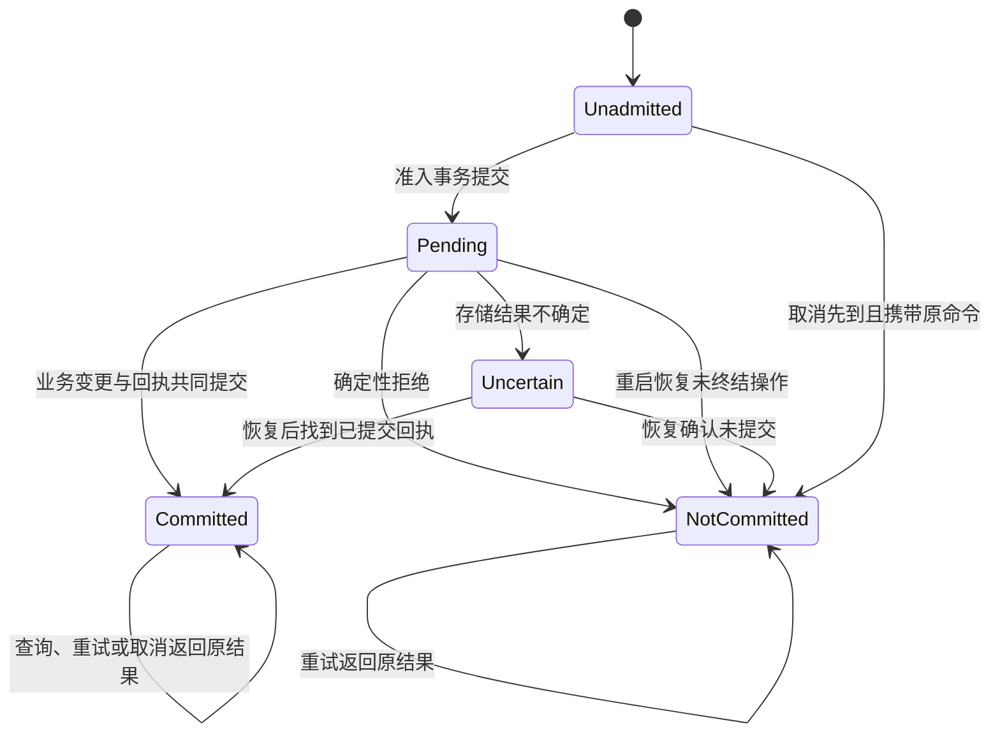
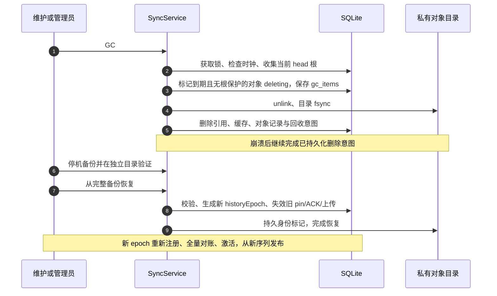
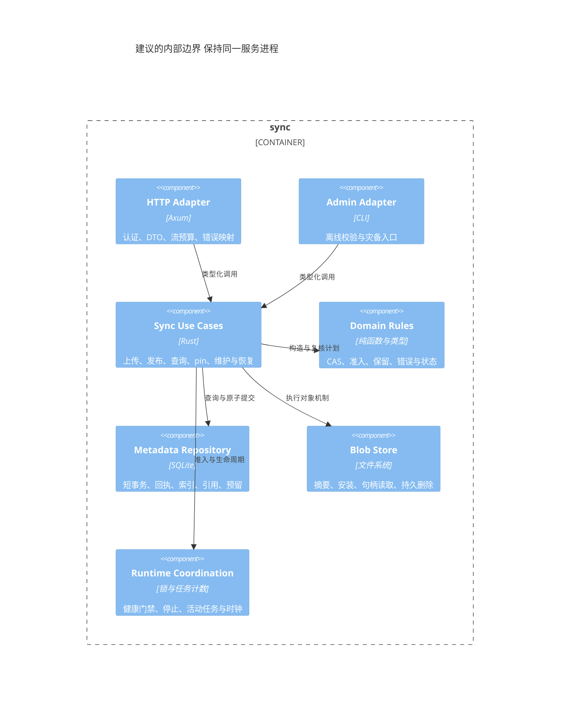

# fs agent 同步架构与代码评审

本评审对照当前工作树中的 fs-agent 源码，聚焦新实现的 sync 子系统及其与认证、export、执行、管理员命令的边界。结论是：存储协议方向正确，客户端与服务端的职责划分合理；当前优先级是错误分类、准入协调、失败结果可信与恢复不丢数据。共享 `SyncService` 和单连接事务协调本身合理，内部边界应依据不变量与重复规则收紧，组件数量不是质量目标。

这是源码评审与修复记录，不替代 [同步设计](fs-agent-sync.md) 或 [部署与协议说明](../../tools/fs-agent/doc/sync.md)。第 6、9、10 节保留修复前的发现和验收缺口；2026-10-03 已实施正确性修复，当前处理结果与证据见第 11 节。全局串行协调与同一发布事务继续保留。

## 1 系统职责与 C4 上下文

fs-agent 保存已发布版本，不读取其他设备未发布的修改。服务端不决定冲突采用哪一侧、不维护设备的共同基线、不拼接会话 Round，也不自动重放旧工具调用。这些客户端策略边界应保留。

同步的基本单位是数据集。files 使用文件 manifest；session 等使用不透明 bundle。一个项目可以有多个独立 head。项目撤销删除已经有入口，任意时间点的项目整体 checkpoint 尚未交付。

## 2 C4 容器与存储边界

以下容器表示运行单元和数据存储，不代表多个服务进程。SQLite 与对象目录都在单节点本地。

**当前 sync 使用独立 `sync.root`，与 export 目录不同。** 对象路径由 namespace、project、hash 派生，不是项目工作目录的直接镜像。数据库和对象库都不应被普通文件 API 或 Bash 当作可编辑目录。路径隔离由 [boundary.rs](../../tools/fs-agent/src/sync/store/boundary.rs) 检查；真实执行隔离还依赖已有 sandbox 的挂载与权限边界，不能只依据“两个目录不同”得出结论。

## 3 C4 组件与实际依赖

图中的多文件是代码职责划分，并非独立封装的领域组件。多个 `impl SyncService` 与共享 `Connection` 不构成独立缺陷。需要检查的是表修改权限、事务边界、规则是否重复、查询是否意外写入，以及 HTTP/CLI 是否使用一致约束。HTTP 通常不写 SQL；目前领域模块仍依赖具体 SQL、字符串 kind 和 JSON 形状，可逐步收拢，但必须保留一次发布的整体事务。

| 模块 | 当前合理之处 | 需要收紧的边界 |
| --- | --- | --- |
| transport | 与普通 export 路由区分，流式传输有预算 | 健康状态应通过服务接口改变；HTTP 错误映射留在适配层 |
| operations | 持久准入与最终提交分开，序号防重放 | 明确取消语义，集中处理未知结果与健康门禁 |
| commands | 生命周期与 head 双重条件，恢复产生新 generation | 输入与结果类型化；领域变更不直接编排文件 I/O |
| catalog | 固定上界分页，新会话可发现 | ACK 写入也走门禁；可用性错误分类；长期索引治理 |
| retention | pin、历史、当前 head 联合保护 | 保留规则与执行删除分开；计数批次不等于扫描成本有界 |
| admin | 与服务共享独占锁及格式 | 区分只读校验与修复；文件摘要原语复用 |
| service | 统一身份与锁，首版容易理解 | 对象、配额、生命周期、维护等职责过多 |
| store | 文件原语、对象引用关系表已独立 | 增加语义仓储方法，收拢跨模块 SQL |

## 4 接口事件流

### 4.1 对象上传与条件发布

对象安装和有效版本发布分开，避免上传一半成为 head。`event()` 在发布事务内写入 catalog 和 changes，没有异步消息总线；因此“事件产生”指持久状态与 head 一起提交。HTTP 响应不是提交事实，客户端 ACK 也不是共同基线证明。

changes 包含 sequence、事件类型、dataset、previousHead 和生命周期 revision；修复后补充 operation 上下文，与回执共享类型化身份，包含 operationId、replicaId、opSeq、historyEpoch。它在同一发布事务中写入。

### 4.2 发现与多端接入

上述下载、应用和激活是建议的客户端工作流；服务端只检查清单凭证，不验证客户端磁盘。日志游标过期则重新枚举，客户端本地修改继续保留。会话发现与历史存储可用，不代表依赖完整或能够安全接续运行。

### 4.3 操作状态与取消

Uncertain 是调用者对结果的认知，不必对应一条已持久化的状态。当前取消先调用 `operation()`；如果已存在回执，包括 pending，直接返回。与此同时 command 在准入与执行之间不释放数据库锁，正常竞争的取消请求只能等到执行结束。因此目前应将取消理解为“未准入的操作抢先取消”，不能承诺“中断已准入正在执行的发布”。若产品需要后者，必须设计可取消边界及对应线性化测试。

### 4.4 GC 与恢复

当前 GC、pin、publish 共享数据库锁，容易保证互斥。优化并发时必须保留“对象不能在验证后、提交前被 GC”的保证。将全部 I/O 简单搬到锁外会引入新竞态。

## 5 策略与机制是否分开

外部职责已经分开，内部只做到部分分离。`policy.rs` 多为 ID、数字和配置校验；真正的保留策略、配额策略、可恢复性判断与副本生命周期分散在 service、commands、catalog、retention 中。规则与 SQL、文件操作组合在同一方法内。

| 决策或规则 | 应负责的层 | 机制应负责的内容 |
| --- | --- | --- |
| 哪些目录同步、采用本地还是云端 | itookit | fs-agent 原子保存指定结果 |
| 会话分叉、字段冲突、依赖闭包 | itookit 会话领域 | fs-agent 保存并校验通用 bundle 引用 |
| 被替代和删除后保护多久 | 服务端 RetentionPolicy | 仓储更新期限、GC 根据计划执行 |
| 对象与元数据是否允许增长 | 服务端 AdmissionPolicy | 事务内计量、预留、磁盘空间检查 |
| 命令是否满足 head 与生命周期 | 同步领域用例 | 仓储条件提交及持久回执 |
| 何种错误使存储进入不健康状态 | 服务端健康规则 | 一个统一门禁及诊断记录 |
| HTTP 状态码、响应 JSON、超时 | transport | 映射领域结果并实施传输预算 |

建议用小型具体类型表达规则，例如 `RetentionPolicy`、`AdmissionPolicy`、`VersionAvailability`；先抽出确定性的判断函数，不需要立刻建立插件系统或给每个类增加 trait。

## 6 代码质量与风险排序

P1 表示应在进一步依赖该协议前修正；P2 表示应纳入近期维护。初始化风险已在临时目录复现，其余“后果”主要由源码推导，标记为待验证的项目仍缺专项故障证据。

| 优先级 | 源码证据与问题 | 后果与建议 |
| --- | --- | --- |
| P1 | [catalog.rs](../../tools/fs-agent/src/sync/catalog.rs) `ack()` 没有 write_allowed、capacity 或 quota | 不健康/停止准入后仍可能写 ACK；新增 ACK 行绕过增长门禁。所有写入口统一准入，区分新增与更新，验证副本状态及消费位置 |
| P1 | catalog `version_available()` 对 closure_ready 使用 is_ok；version_value 再查一次并将多数错误显示为 expired | SQL/存储故障可能伪装成普通版本过期。返回类型化 available/expired/corrupt，基础设施错误向上传播，避免重复查询 |
| P1 | [service.rs](../../tools/fs-agent/src/sync/service.rs) verify_existing、对象读取；[admin.rs](../../tools/fs-agent/src/sync/admin.rs) verify_objects 对验证错误进行折叠 | 暂时 I/O 失败可能被持久标记为 corrupt。摘要或长度不符、对象缺失、读失败应分别处理；健康故障不伪装成内容损坏 |
| 契约修正 | [operations.rs](../../tools/fs-agent/src/sync/operations.rs) command_inner 全程持锁，cancel_operation 返回已有 pending 回执 | 当前可接受先到取消，公开协议说明也描述了未准入取消；应收窄设计验收中的竞争承诺。运行中取消属于后续能力，COMMIT 后不能回滚 |
| P1 | command、activate、pin、reserve 等先检查 write_allowed，随后等待数据库锁，没有锁内准入复核 | 等待期间关闭或存储不确定后，尚未准入的请求仍可能继续写。门禁、准入登记与不确定状态更新需要同一协调边界；已接受操作收尾另行授权 |
| P2 | execute_command 的事务内调用 apply，再调用 manifest 进行文件读取、摘要、解析和逐引用 SQL | 大 manifest 阻塞所有元数据工作，增加事务时长。准备阶段使用受保护对象生成验证结果，提交阶段复核 CAS、对象状态和配额 |
| P2 | service 的对象读取和安装、retention GC 在全局锁内做摘要或文件 I/O | 一个大对象读取可能拖慢无关项目。先测锁等待与持锁时间，分离元数据短临界区和文件 I/O，保留 GC 保护 |
| P2 | [model.rs](../../tools/fs-agent/src/sync/model.rs) 导入 Axum 并实现 IntoResponse，Error 携带 HTTP status | 领域和离线命令依赖 HTTP。使用领域错误分类，在 transport 中映射状态和响应 |
| P2 | commands 以字符串 target 分发，Value 输入/输出与字符串 state/kind 广泛使用 | 改字段容易在运行时出错。优先类型化 Command、Receipt、DatasetKind、State，保留线协议兼容 |
| P2 | retention prune 仅清理到期 pin 与终态回执，catalog/change/version/op-id 索引保守留存 | 长期运行会达到元数据上限；分页 LIMIT 不保证窗口查询只扫描一页。设计索引压缩、删除身份保留与防重放记录的独立生命周期 |
| P1 待验证 | capacity 在操作入口计数；一次操作可能新增多个 records/refs，拒绝回执仍需持久化 | 当前上限不是严格的逐新增行预算。但正常逻辑拒绝不等于回执必然无法保存：回执更新并未再次检查 capacity。物理空间不足时的终态写入与恢复能力需故障注入，预留预算应覆盖这两者 |
| P2 | admin verify 调用 manifest，写缓存/引用；发现损坏时也更新状态 | “校验”同时修改数据，应明确 validate 与 reconcile/repair 的契约，避免运维误解 |
| P1 关闭契约 | service drain 仅获得并释放数据库锁，main 忽略结果且对 sync drain 没有专属超时 | 不能证明上传接收、异步清理与排队任务完成，锁等待还可能拖延关闭。管理员 CLI 备份另取独占 root 锁，所以当前不能据此断言备份已不完整；关闭完成条件仍需修正 |
| P1 已复现 | service init 在 init.pending 存在时允许恢复初始化，初始化数据库可创建新文件 | 临时目录保留已有 marker 与 pending、移走数据库后，重复 init 返回成功并改变 authorityId/historyEpoch。应根据初始化阶段和存储证据判断能否续作，禁止重建已建立的身份 |
| P1 待验证 | execute_command/finalize_result 未显式检查存储错误后的事务状态，事务 Drop 清理结果未显式处理 | 当前 SQL 错误走 unknown，回滚/回执失败也不会返回成功终态；不能指控为“所有错误都生成 not-committed”。仍需验证自动回滚、回滚失败、回执写失败及连接能否安全复用 |

函数拆分已经较细，但只缩短函数并不能减少耦合。应同时检查“一次操作需要了解多少字段、跨多少模块 SQL、改变一条规则要改几个地方”。新增代码约 3280 行，集中在 17 个 sync 源文件；这些规模信息用于定位，不作为通过或不通过的指标。

## 7 冗余与可清理内容

| 内容 | 判断 | 清理方式 |
| --- | --- | --- |
| admin file_hash 与 store/blobs verify 的 SHA-256 流式循环 | 明确重复 | 提供统一 hash_reader/hash_file 返回 hash 与 size；验证器比较预期值 |
| version_available 与 version_value 重复检查闭包 | 明确重复且错误语义不一致 | 一次返回 VersionAvailability，并保留错误 |
| command、finalize_result、commit、transport 多处将 healthy 置 false | 规则分散 | 单一 mark_storage_uncertain 方法，记录原因；由统一用例边界调用 |
| commands 与 catalog 通过原始 Value 构造 head、版本、事件、回执 | 类型和字段知识重复 | 类型化结果与事件上下文，统一序列化出口 |
| policy overlap 与 boundary overlap | 有意分层 | 前者是纯路径判断，后者增加 inode/宿主别名判断；保留并改善命名 |
| 普通 export 操作与 sync durable operations | 职责不同 | 前者管理普通服务请求，后者需要持久序号与回执；不能仅因同名合并 |
| HTTP 元数据路由与对象流路由 | 预算不同 | 保留分别限流与长度限制，共享认证、错误映射即可 |
| 历史恢复、灾备恢复、损坏修复 | 语义不同 | 历史恢复产生新版本；灾备恢复改变 epoch；对象修复保持 generation。不要合并成含糊的 force 操作 |

不要为了 DRY 删除必要的事务内复核、摘要校验或恢复记录。传输校验和读取校验处于不同信任边界；前期对象验证和提交时引用状态检查也承担不同职责。

## 8 建议的内部组件演进

此图是职责示意，尚未实现，不要求每个方框成为独立 trait、组件或新包。保留公开 `SyncService` 门面，先收紧元数据存储、对象存储、运行协调三个边界。保留与准入判断先使用普通类型和纯函数。仓储必须封装一次发布的 head、版本、事件和回执原子更新，不能拆成分别提交的 CRUD。SQLite 事务只覆盖元数据；文件机制通过对象状态、保护期限和持久意图与事务连接。

建议分三批完成：

1. 先修错误分类、准入竞态和事务失败处理，覆盖初始化、终态空间与 drain 的危险边界；明确取消与 verify 的准确契约，配套故障测试。
2. 复用摘要和健康原语，类型化命令/状态/回执，收拢仓储 SQL，并将保留与准入判断抽成纯规则。
3. 在锁等待指标和代表性大项目测试基础上，缩短发布事务，改善查询索引与长期压缩，再优化并发。每一步都保持 CAS、GC 保护与持久回执不变量。

## 9 验证与验收边界

此前实现验收记录包含 85 项 Rust 测试、真实 HTTP 三端上传/下载/备份恢复、真实 Bash 隔离与共享 manifest fixture。这不是本轮验证结果。后续复核运行了默认 feature 的 sync 集成测试，结果另记于第 10 节；默认运行不能证明原生 Bash 隔离或故障 feature 的用例执行，也不证明下列边界已修复。

后续专项验收应包含：

| 场景 | 应验证的结果 |
| --- | --- |
| 健康状态被关闭后 ACK、新 pin、上传、发布、activate | 所有写入遵守统一门禁，只读查询有明确可用语义 |
| 同一版本的闭包查询产生 SQL 错误或暂时 I/O 错误 | 返回基础设施故障，不显示 expired、不永久标记 corrupt |
| 大对象下载与另一项目 head 查询并发 | 记录锁等待、响应延迟和内存；优化前后数据完整性一致 |
| manifest 准备后 GC、项目删除或另一个发布先发生 | 提交复核拒绝过期结果，没有悬空 head |
| 准入前/准入后/COMMIT 后取消 | 唯一终态与文档契约一致 |
| 单次 manifest 引用新增量接近元数据上限 | 增长受控，拒绝与回执仍能持久化，恢复空间未耗尽 |
| 长期大量 publish 后 catalog 分页与压缩 | 固定快照无遗漏，旧游标明确过期，旧设备不复活删除项 |
| verify 前后数据库对比 | 校验与修复的修改范围符合公开契约 |
| 慢上传时停机、Drop 清理或后台 GC 仍在运行 | drain 完成或明确超时；重启能恢复且无有效版本损坏 |
| init.pending 与已存在 marker/object，但 metadata.db 丢失 | 拒绝重新初始化身份，提供明确管理员恢复入口 |

Mermaid 图采用官方支持的 C4Context、C4Container、C4Component，以及 sequenceDiagram/stateDiagramV2。C4 语法依据 [Mermaid 官方说明](https://mermaid.js.org/syntax/c4.html)；文档检查不等于渲染检查，最终展示取决于阅读器的 C4 支持。

## 10 后续评审核查与正确性补充

后续评审的修复顺序予以采纳，但以下事实需要保留限定：共享连接不是缺陷；已准入取消不必成为首版功能；drain 不完整不等于当前管理员备份一定不完整；现有代码已经将 SQL 错误与确定性业务拒绝分支区分，只是分类和恢复证据仍不足。

### 10.1 事务失败后的实际路径

`From<rusqlite::Error>` 一律转为 unknown。`finalize_result()` 仅对 `unknown=false` 的错误执行 ROLLBACK TO，再构造拒绝回执。ROLLBACK TO、RELEASE、回执写入均使用 `?`；任一步 SQL 失败都会退出，不会继续返回“已可靠保存终态”。最终 COMMIT 失败也返回 unknown 并关闭健康门禁。因而没有证据支持“任何 apply 错误都转换为持久 not-committed”。

但 SQL 分类过度保守、事务状态未显式核对、事务析构时清理失败缺少显式诊断，仍需改进。文件 ENOSPC 目前通过通用 IO 映射成为确定性错误，也应按发生阶段判断，不能用 errno 单独证明整个操作结果。

SQLite 的 FULL、IOERR、INTERRUPT、NOMEM 可能自动回滚整个事务。应核对 autocommit/事务状态，必要时显式清理或隔离连接；不能假定 SAVEPOINT 总是存在。内层 RELEASE 不产生最终持久事实，必须以外层提交成功为准。依据：[事务错误处理](https://www.sqlite.org/lang_transaction.html)、[SAVEPOINT 语义](https://www.sqlite.org/lang_savepoint.html)。

| 失败阶段 | 可承诺的结果 | 必要处理 |
| --- | --- | --- |
| CAS 或正常预算拒绝 | 业务未提交；外层 COMMIT 成功后才有持久拒绝回执 | 回滚业务 SAVEPOINT、写回执、提交 |
| SQL/磁盘故障 | 本次流程无法继续；操作最终结果需核对 | 保存错误类型与阶段，检查实际事务状态 |
| ROLLBACK TO 或拒绝回执写入失败 | 不承诺持久终态 | 更高层清理、隔离写入、通过持久准入记录恢复 |
| COMMIT 结果不确定 | unknown | 禁止新准入，核对回执与数据再恢复服务 |
| 内层 RELEASE 成功但外层未提交 | 仍不是发布成功 | 禁止提前发送 committed 响应 |

### 10.2 门禁必须区分准入与收尾

| 服务状态 | 新外部写请求 | 已接受操作收尾 | 恢复和修复 |
| --- | --- | --- | --- |
| 正常 | 按权限和预算允许 | 允许 | 按既定机制 |
| 正常关闭中 | 拒绝 | 受控完成 | 必要清理允许 |
| 提交结果不确定 | 拒绝 | 停止相关提交并先核对 | 受控恢复 |
| 已确认对象损坏 | 涉及坏对象的操作拒绝；其他范围策略待明确 | 判断受影响范围 | 验证来源后修复 |

源码已经有 accepting 与 healthy 两个标记，不是只有 healthy；问题是写入口和状态更新未统一协调。command、register、activate、pin、reserve 等在获取锁前检查门禁，等待期间状态可能变化。锁内复核或统一准入令牌需要与状态转换协调。正常关闭的已接受命令可以完成回执；已接受上传当前 install 再检查 accepting，会在关闭中被拒绝，需明确是收尾完成还是中止后恢复。

ACK 是外部写入，不应绕过准入。终态记录和 recover/repair 则需要专门的受控路径，不能机械复用“禁止所有写入”的规则。SQL 错误、读取错误与提交不确定也应分别分类，不能都用 unknown 触发全局停写。

### 10.3 对版本状态需要的证据

建议 `Result<VersionAvailability, StorageError>`：过期由保留记录及回收依据确认；受保护对象缺失属于引用完整性故障；成功读取后的摘要/长度不符支持 corrupt；读取 I/O 或 SQL 失败仅说明本次无法判断。新上传摘要错误属于输入无效，现有 install_file 已映射为 OBJECT_HASH_MISMATCH，不能据此标记既有库损坏。

这也要求减少错误的全局转换。一次网络断开、用户输入错误或正常 CAS 竞争均不应使整个存储不健康。

### 10.4 关闭与初始化的核查结果

初始化复现使用现有 debug 二进制与自动清理的临时目录：首次 init；保存 marker；创建 init.pending；将 metadata.db 移至临时目录中的另一路径；再次 init。结果 exitCode=0、initialized=true，authorityId 和 historyEpoch 均改变。测试未设置 expected_authority_id，符合当前支持的配置。遗留 pending 来自故障或其他因素的概率未测量，但只要该证据组合出现，就不能安全重建。修复需保护已有 marker/对象/数据库证据，并验证真正首次初始化中断仍可续作。

关闭源码等待 sync drain 时忽略 Join/Result，也没有专属超时；drain 只等待数据库锁。上传接收、等待 worker 的任务、后台维护和 UploadGuard 的异步清理没有统一活动登记。管理员 CLI backup 则通过新的 SyncService::open 取得独占 root 锁，服务仍持锁时不能开始，当前备份并不以 drain 返回为唯一依据。公开 backup 方法若允许运行中直接调用，还应明确其离线前提并加以约束。

### 10.5 性能证据与准备阶段保护

HTTP 同步调用经 `transport::work` 获取已有 Workers 预算后进入 spawn_blocking；网络接收用 Tokio 文件适配，安装及摘要在 blocking 调用内。后台 GC 也使用 spawn_blocking，但未复用同一个 Workers 预算；Drop 清理直接 spawn_blocking。不能声称所有路径都共享同一有界 worker，也不能声称同步摘要直接运行在网络执行线程。

优化前分别记录应用锁等待、持锁时间、SQLite 写事务时间。准备阶段先取得对象闭包保护，再在事务外验证；验证结果绑定 manifestHash；提交阶段复核 head、生命周期、对象状态与配额；提交完成后释放保护。ready 查询或只保护 manifest 本体不足以阻止闭包对象被 GC。

### 10.6 云备份闭环证据

| 关注项 | 已核对证据 | 仍缺的专项证据 |
| --- | --- | --- |
| 旧版本从被替代起保留 | commands supersede 使用当前时间加 TTL；测试将 committedAt 调整到 90 天前再覆盖 | 长期未修改项目/数据集删除的完整内容场景 |
| 历史独立发现与恢复 | versions 独立于 changes；测试恢复旧 manifest 为新 generation | changes 游标过期后完整发现、选择和恢复流程 |
| 删除恢复使旧计划失效 | delete_restore_history_and_lifecycle_fence 测试旧请求被拒绝 | 更多并发故障点 |
| 灾备后重新接入 | backup_empty_restore_epoch_rejoin_and_damage_repair 验证新 epoch、旧发布拒绝、新副本 seq=1 | 旧 epoch 查询/取消/重试与新操作同序号的组合矩阵 |
| 配额与保留承诺 | old_current_versions_get_a_new_retention_window_and_quota_protects_them 验证满额拒绝上传且旧内容保留 | 真实 SQLITE_FULL、回执持久化失败与恢复空间 |
| 项目时间点备份 | capability 明确 projectCheckpoint=false | 仍未交付，不宣称已完成 |
| Bash 隔离 | 有需要环境变量启用的实际进程测试 | 本轮默认 feature 运行未开启该条件，不作为原生隔离证明 |

本轮运行 `cargo test --test sync --offline`，14 项通过，不启用故障 feature。此前 85 项结果仍属于先前验收；本轮默认测试与初始化复现不能代替真实磁盘故障、断电或原生执行隔离验收。

完成标准是：协议承诺有明确执行路径与故障结果，备份边界有对应测试证据。组件数量、函数数量与代码行数都不能作为通过标准。

## 11 正确性修复实施结果

保留 `SyncService`、一个 SQLite 连接及一次发布的原子事务。新增 [运行协调](../../tools/fs-agent/src/sync/coordination.rs) 和 [正确性测试](../../tools/fs-agent/src/sync/tests.rs)，没有增加新包、连接池或服务端合并器。

| 修复项 | 实际行为与证据 |
| --- | --- |
| 初始化身份保护 | pending 不能授权重建已有 marker/对象/WAL 所证明的存储；缺失数据库拒绝且 marker 不变；首次初始化的数据库身份已落盘时可完成 marker；原时钟水位不因续作重置 |
| 准入竞态与 ACK | 新写入在数据库锁内检查门禁，unknown 在释放锁前关闭准入；测试用持锁与活动通知固定等待顺序；ACK 检查活跃副本、新增行预算与单调消费位置 |
| 读取与版本错误 | 版本状态类型化，一次检查闭包；SQL/I/O 错误向上传播；只根据摘要、长度或缺失证据登记损坏；错误上传摘要不污染已有对象 |
| 事务与失败回执 | 检查 autocommit，存储错误显式清理外层事务；清理失败不继续提供正常读取；回滚或回执失败返回 unknown，持久 pending 留待恢复；实际 SQLITE_FULL 与 SQL trigger 回执失败均验证 |
| 终态行预算 | 准入先保证两个操作记录的增长空间；业务新增行在最终事务复核，超限回滚后更新既有拒绝回执；上传安装按替换预留的净增长计量 |
| 关闭收尾 | 关闭拒绝新请求，已接受命令/上传可完成；HTTP、blocking 工作、上传 guard 与清理的活动计数连续交接；只有停止准入后才能 drain，超时明确失败；真实 HTTP 流测试覆盖完成与取消 |
| verify 与 backup | verify 使用只读连接且不运行启动恢复，不登记损坏或重建 refs；验证 cached refs 与正文一致并检查有效 pin；backup 停止准入并排空，在数据库锁内复制，CLI 仍需 root 独占锁 |
| 重复实现 | 摘要复用 hash_file，健康状态通过统一方法改变；副本活跃规则统一；Axum 响应映射移到 transport；事件和回执共享 OperationIdentity |
| 备份验收补充 | 90 天未修改项目/数据集删除后内容仍保留并可恢复；changes 过期不妨碍历史恢复；真实 HTTP 灾备后旧 epoch 查询/取消/重试不能命中新 epoch 同副本同序号操作 |

测试范围包括全 features、故障子进程、原生 Bash 隔离和真实 HTTP 三端验收。故障矩阵串行运行；CAS 用例仍显式创建并发线程。一次默认并行故障矩阵出现了 init/open 间的瞬时 SYNC_LOCKED，串行运行通过；没有放宽生产独占锁或增加掩盖争用的自动重试。

最终验证：`FS_AGENT_PROCESS_TEST=1 cargo test --all-features --offline -- --test-threads=1` 共 106 项通过；默认构建的真实 HTTP 脚本验证 3 个设备、3 个历史版本、完整摘要、epoch 更换及旧 epoch 隔离。2 个共享 fixture、cargo fmt、Clippy（沿用非同步模块 manual_inspect 豁免）和 pnpm docs:check 通过；文档检查仍有 5 条既有历史表述告警。90 天删除场景的加强用例另行通过，包含 manifest 与实际文件内容。

性能工作继续以指标为前提：发布校验仍在全局锁/事务内，catalog/version/身份索引仍保守保留。当前没有宣称完成锁优化或长期索引压缩。项目 checkpoint 与 itookit 会话安全接续仍是单独能力。
