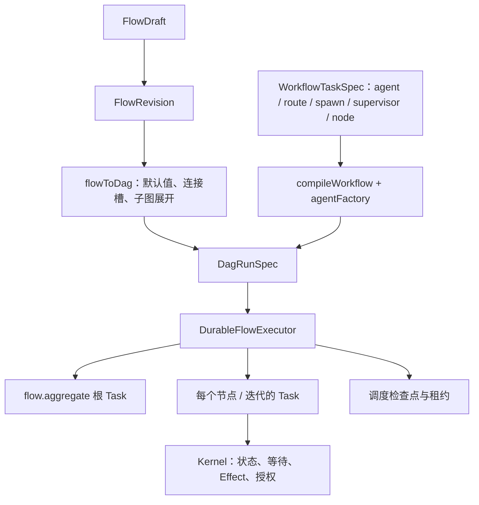

# llm-flow 的 Flow / Node 定义与 Harness 覆盖分析

2026-09-16 补充：已接通 CLI/UI 的 MCP/tools/Skill 装配、隔离任务 Skill 上下文与批准恢复，并新增会话「流程输出」入口。当前能力、边界及验证见 [Flow 能力与输出](flow-capabilities-and-output.md)。下文核查记录保留当时的测试范围。

构建产物及真实模型的复验见 [CLI 能力与持久化实测](flow-cli-capabilities-verification.md)：修复 MCP stdio 的 ESM require 问题；CLI 已保存 Kernel 交互和结果，并通过幂等投影生成聊天 History Round，包含节点、工具、Skill 来源及用户交互身份。

> 核查日期：2026-09-15。依据当前工作树源码与包内测试；这是现状分析，不是新增功能承诺。
> 范围：`packages/llm-flow`，以及它使用的 `llm-common` 类型。规范依据为 [Harness Core](durable-harness-core.md)、[Protocol](durable-harness-protocol.md)、[Storage](durable-harness-storage.md)、[Resources](durable-harness-resources.md)、[Cache](durable-harness-cache.md)；跨包验收边界见 [Durable 证据映射](durable-harness-evidence.md)。

## 1. 结论

具体需求推演与已实现的结构化派发方案见 [作文四维评审 Flow](essay-review-flow.md)：输入补全、显式轮次、分支汇合及同版本评分。

**当前 llm-flow 已具备本地 durable harness 所需的主要图编排能力，但不能判定完整满足所有 Harness 目标。**

- 已实现：静态依赖、条件路由、有界循环、动态扩图、结构化委派、人工等待、失败策略、重试、调度恢复、Run 所有权隔离和工作区收尾。
- 分层满足：Task 状态事务、Effect 回执与未知结果处理、资源授权、共享数据和 Session 生命周期由 `durable-kernel` 提供；LLM/tool 循环由 `llm-tasks` 提供；会话上下文与设备装配由上层负责。缺少独立 cache/resource 节点不等于缺少这些内核能力。
- 尚有边界：子 Flow 只是图展开；预算不是运行前预留的全局硬额度；补偿提交不等于严格串行回滚；声明端口与实际输出有差异；定义存储接口不提供原子 CAS；真实跨主机与设备故障不能由本包测试证明。

若要求是“在已装配 Kernel、存储和设备的本地宿主中，执行并恢复多 Agent 工作流”，当前实现有较充分证据。若要求是“任意 Flow 均具备独立资源域、严格预算与完整故障保证”，目前仍不满足。

## 2. 当前定义哪些 Flow

本包提供通用定义、编译和执行设施，并提供可配置的 [作文评审示例](../../packages/llm-ui/src/flows/library/essay-review-isolated.flow)。示例使用通用节点配置，不在运行器中硬编码作文业务。

### 2.1 三种表示与运行身份

| 表示 | 内容与用途 | 源码 |
|---|---|---|
| `FlowDraft` | 可编辑定义：nodes/edges/layout、参数、连接槽、Agent 默认值、runPolicy、draftVersion | [flow-definition.ts](../../packages/llm-common/src/agent/flow-definition.ts) |
| `FlowRevision` | 发布版本：revision/digest，冻结节点、边及默认配置；不含编辑布局 | 同上；[flow-definition-store.ts](../../packages/llm-flow/src/flow-definition-store.ts) |
| `WorkflowTaskSpec[]` | 声明式工作流 DSL，字段兼容 CLI 的 snake_case；编译出 nodes/edges | [types.ts](../../packages/llm-flow/src/flow/workflow/types.ts)、[compile.ts](../../packages/llm-flow/src/flow/workflow/compile.ts) |
| `DagRunSpec` | 执行输入，包含展开后的图及运行策略；不是新增业务 Flow 类型 | [to-dag.ts](../../packages/llm-flow/src/flow/to-dag.ts)、[executor.ts](../../packages/llm-flow/src/flow/executor.ts) |
| Run / 根 Task | 每次执行以 `flow.aggregate` 根 Task 为持久锚点；节点每次迭代有独立 Task 身份 | [programs.ts](../../packages/llm-flow/src/flow/programs.ts)、[scheduler-checkpoint.ts](../../packages/llm-flow/src/flow/scheduler-checkpoint.ts) |

`.flow` 保存草稿，revision 保存为该文件的 assets。`saveRevision` 校验图和 digest，拒绝覆盖同版本的不同内容。恢复使用已保存的执行图和检查点，不重新读取最新草稿。

### 2.2 能表达的编排模式

| 模式 | 当前表达方式 | 语义边界 |
|---|---|---|
| 顺序、并行、fan-in | nodes/edges；DSL `depends_on` 与输出引用 | 静态依赖主要为 all-of；控制边不注入上游数据 |
| 条件分支 | `builtin.route` | exclusive / multicast / fallback；产生边激活、禁用指令 |
| 有界循环 | 回边 + `config.maxIterations`；DSL `max_iterations` | 图不再是数学意义上的纯 DAG；执行器识别回边并创建迭代实例 |
| Supervisor / worker | DSL `supervisor.workers/max_rounds` | 展开为主管 Agent、route、worker 回边；不是独立插件 |
| 静态模板的动态扩图 | `builtin.spawn` | 运行时应用事先声明的 nodes/edges，不等于 LLM 自行生成任意代码 |
| LLM 动态委派 | Agent `delegation`；兼容旧 `subtasks` | LLM 声明 payload，执行器按模板创建有界子任务 |
| 组合 Flow | `builtin.flow` 引用 flowId/revision/parameters | 编译时加 id 前缀并接入子图入口/出口；不创建子 Run |
| 人工参与 | `builtin.human` | 持久 interaction，响应后继续 |
| 失败与补偿 | 边 `onFailure`、节点 `retry/compensate` | fail/skip/continue；补偿不是数据库事务回滚 |

DSL 定义 `agent | route | spawn | supervisor | node` 五类任务。`node` 直接携带版本化 plugin/config，可接入 input、route@2、aggregate 等通用节点；旧 spawn 内的子任务仍交给 `agentFactory`，不递归编译所有控制结构。

## 3. 当前定义哪些 Node

### 3.1 十一个内置插件 ID、十四个版本化定义

注册入口：[builtin-plugins.ts](../../packages/llm-flow/src/flow/builtin-plugins.ts)。route 提供 `1.0.0`、`2.0.0`、`3.0.0`，aggregate 提供 `1.0.0`、`2.0.0`，其余版本为 `1.0.0`；插件 id 是可扩展字符串，不是封闭枚举。

| 插件 | 底层 Program | 当前行为 | 主要配置 |
|---|---|---|---|
| `builtin.agent` | `llm.agent@1` | LLM/tool 执行、结构化输出、上下文压缩、委派声明 | agentId、instruction、模型/连接、tools/skills、上下文策略、delegation |
| `builtin.human` | `flow.human@1` | 等待依赖后发起人工输入 interaction | requestId、prompt、schema |
| `builtin.transform` | `flow.value@1` | identity 或按 path 提取字段；不是任意脚本变换 | operation、value、path、outputName、type |
| `builtin.reduce` | `flow.value@1` | 收集输入并展平一层，返回数组或用 separator 拼接文本 | outputName、type、separator |
| `builtin.route@1.0.0` | `flow.value@1` | 解释可序列化条件，激活/禁用分支；实际 `outputs` 为空 | mode、rules、defaultEdgeId |
| `builtin.spawn` | `flow.value@1` | 产出值，并附带 `patch-graph` 图修改指令 | spawn.nodes/edges/idempotencyKey；支持 `$parent`、`$upstream:<id>` |
| `builtin.flow` | 无独立 Program | 必须先经 `flowToDag` 展开；直接创建运行任务会抛错 | flowId、revision、parameters |

新增插件如下：

| 插件 | 底层 Program | 行为及配置 |
|---|---|---|
| `builtin.input@1.0.0` | `flow.input@1` | fields/prompt/initial；校验命名输入，持久等待缺项，合并多次回复 |
| `builtin.route@2.0.0` | `flow.dispatch@1` | branches/mode/maxRounds/maxConcurrency/context/until；独立 Task、隔离 history、本批汇合、按类型跨轮保留结果 |
| `builtin.aggregate@1.0.0` | `flow.value@1` | previous + updates 按键合并，输出 result；与派发控制器共用合并逻辑 |

`flow.aggregate@1` 仍是运行器内部根 Program，与公开 `builtin.aggregate` 节点不同。它等待调度结束和成员任务结果，形成 `{ nodes, failures? }`。`registerDurablePrograms` 还注册 llm-tasks 的 Chat/Agent/Plan Program；注册了 Program 不代表存在同名 Flow 节点插件。

### 3.2 公共字段与配置边界

- 节点定义具有 id/name、plugin/pluginVersion、config/inputs、portSchemas、priority、capabilities、budget、retry、compensate。传统内置 manifest 声明可选的 `maxIterations`；route@2 使用独立 `maxRounds`，拒绝进入旧回边循环。节点还可用 `outputPolicy` 分别控制 Run 输出和会话发布。
- `FlowAgentNodeConfig` 复用 `LlmNodeConfig`，增加 agentId、instruction、delegation；`prompt/model/subtasks` 为兼容字段。Agent 引用、Session history 等完整解析依赖宿主 binder，不能仅凭插件的配置 schema 就断言生效。
- `flowToDag` 应用 Flow 默认值、连接槽和 binder；执行器注入工具、skill 上下文并绑定 Kernel capabilities。配置中的工具名称与已授权的运行能力应分别检查。
- 端口 schema 可按节点声明并随 Run 固定；恢复拒绝宿主 manifest/schema 漂移，但插件可执行代码仍由宿主加载。相同版本与相同 manifest 不能证明代码字节一致。

相关实现：[task-capabilities.ts](../../packages/llm-flow/src/flow/task-capabilities.ts)、[run-catalog.ts](../../packages/llm-flow/src/flow/run-catalog.ts)、[port-contract.ts](../../packages/llm-flow/src/flow/port-contract.ts)。配置继承的跨包契约见 [Flow 执行模型](flow-execution-model.md)。

## 4. 对照 Harness 要求

下表的“已覆盖”只表示存在对应实现与测试，不扩展为任意后端、设备均已验收。

| 要求 | 判断 | 当前证据与边界 |
|---|---|---|
| 可序列化任务状态、声明式等待和外部操作 | 分层覆盖 | FlowValue/Human/Aggregate 使用 Durable Program；Agent 交给 llm-tasks；事务和 Effect 由 Kernel 保证 |
| Run 从节点派发前具备持久身份 | 已覆盖 | 先创建 aggregate root 并保存 initialScheduler，再提交节点；检查点保存图、实例、边状态、委派组、预算统计等 |
| 提交成功但检查点未写时恢复不重复节点 | 已覆盖 | 提交 requestId 包含 root/node/iteration/generation；恢复同代复用 Task；executor 测试覆盖提交与检查点间隙 |
| 多恢复者不能同时写同一 Run | 已覆盖，本地证据 | scheduler lease + fenced Session 写入；测试覆盖活拥有者拒绝、接管和旧拥有者失效。不能代替跨主机时钟/后端验收 |
| 动态扩图可恢复、同键冲突拒绝 | 已覆盖 | patch 指纹、appliedPatches、动态身份绑定、节点数限制；委派检查点恢复不重复子任务 |
| 有界 structured / detached 子任务 | 已覆盖，但非通用 TaskGroup API | fanout 限制数量/并发/深度；wait 支持 all/any/first-success/quorum；detached 强制 timeout，隔离工作区要求 cleanup=keep |
| 等待、结果收集与生命周期独立 | 已覆盖 | `join.mode=none` 控制结果收集，不自动 detached；提前满足等待条件时取消未完成兄弟；detached 由 execution.mode 显式声明 |
| 人工暂停后可恢复 | 已覆盖 | flow.human 持久 interaction；命令服务按 Run 成员选择响应对象，拒绝歧义；停止外部操作的确认由 Kernel 管理 |
| 失败传播、自动重试、人工重做 | 分层覆盖 | onFailure/retry；人工 retry 创建新 Task，图级 retry 使下游重算；不得把终态 Task 原地改为未完成 |
| 补偿 | 部分覆盖 | 可提交失败节点及上游的补偿任务；严格完成顺序与外部撤销保证见下一节 |
| 预算和并发限制 | 部分覆盖 | Run maxNodes/maxConcurrency/timeout/maxTokens；节点 budget 绑定 LLM handle。单请求限制、累计统计、资源消费账本是不同语义 |
| 资源、cache、跨 Session 协作 | Kernel/宿主职责 | 本包未提供通用 acquire/release/cache/message/shared-wait 节点；可通过自定义 Program/plugin 接入，不能把缺插件表述为 Kernel 未实现 |
| 工作区隔离与收尾恢复 | 已覆盖，需宿主装配 | workspace manager、持久 lease/finalization、恢复同一 worktree；根 Task 终态不代表外部工作区清理已完成 |
| 可观察、可控制、可审计 | 已覆盖主要接口 | commands、restore-handle、run-members、transcript；保留 Run 成员、迭代、goal、usage。goal/acceptanceCriteria 是描述字段，不是自动验收引擎 |
| 外部结果未知、真实 SIGKILL、持续恢复 | 需跨包证据 | 本包依赖 Kernel/adapter 与宿主恢复循环；真实 CLI/LocalFS 证据及剩余缺口见 Durable 证据映射 |

## 5. 已确认的限制与后续建议

### 5.1 组合 Flow 缺少独立运行策略边界

`expandCompositeNodes` 搬入子图 nodes/edges、默认值及连接信息，返回外层 spec；没有把 child.runPolicy 合成为独立预算、并发、超时或工作区域，也没有子 Flow 输入/输出签名映射。外层边接到所有子图入口/出口。

因此 `builtin.flow` 适合图复用，不能作为独立 harness 子运行容器。建议明确 UI/API 语义；如果要求独立生命周期，再设计子 Run 调用协议。子策略不能静默给用户造成已受约束的印象。

### 5.2 端口声明与实际产出不完全一致

传统通用 manifest 声明 `input → result`，但 `FlowHumanProgram` 实际产出 `response`，route@1 的 `outputs` 为空；transform/reduce/spawn 允许自定义 outputName，却不随之更新 manifest。静态 data edge 校验会按 manifest 检查端口名。

建议统一 human 的输出名称，明确 route 为控制节点，并让可配置 outputName 与端口契约同步。此处是源码层面的契约差异；本轮未新增连接这些端口的端到端回归，不能断言所有现有接线都会失败。

### 5.3 预算不能解释为全局硬消费额度

执行器在节点终结后累计 `outputTokens`，当 `consumedTokens > maxTokens` 时取消剩余任务；并行请求已经发生的消耗可能越过上限。图级 retry 还会移除被废弃下游结果的 token 统计，所以这是当前计算图的用量统计，不能当作供应商实际总账。

delegation.budget.maxTokens/timeoutMs 只是子任务单次请求默认限制；`maxCostUsd` 已明确不支持。detached 实例不计入主循环的 activeCount，不能把 Run maxConcurrency 理解为包括所有后台工作的总并发额度。

若要求强消费边界，需要在 Kernel 资源账户/adapter 消费结算层实施预留与计量，并明确 detached 和 retry 的计费口径；不能只增加一个 Flow 配置字段。

### 5.4 补偿并不保证严格串行回滚

`compensateChain` 按失败节点、上游遍历顺序调用 `submitNode`，没有在提交下一补偿前等待前一个补偿成功；同一补偿节点已有实例时会跳过。它还没有在此处过滤“上游必须成功”的条件。

因此不能从“逆序提交”推导“逆序完成”，更不能推导循环每轮都有一次完整撤销。若业务要求严格 Saga，应补上明确补偿依赖、实例级记录、失败后恢复与外部幂等协议，并增加故障回归。

### 5.5 定义版本检查不是存储原子 CAS

`saveDraft` 先读取并比较 draftVersion，再调用 writeFile；`saveRevision` 也是先查旧版本再创建 asset。最小 FlowStore 接口没有 CAS/事务入口，因此包本身不保证并发作者之间的原子版本竞争与 revision/latest 一起提交。

这与执行器的 Run fencing 是不同层面的保证。需要多写者编辑/发布时，应在存储适配或接口层补原子条件写，并验证并发发布和发布中断恢复。

### 5.6 扩展能力与验收范围

本包没有通用资源分配、共享状态等待、跨 Session 消息、cache 控制及自动 acceptance 检查节点。现有核心能力足以组合很多 Agent 工作流；只有出现明确业务场景时再增加插件，不必为每个 Kernel API 都增加节点。

现有包内测试不能证明真实设备结果未知时的核对、任意跨主机存储一致性或桌面重启体验。相关验收继续沿用 [Durable 证据映射](durable-harness-evidence.md)，不重复把这些项目当成本包代码缺失。

## 6. 核验记录

本轮执行 `pnpm --filter @itookit/llm-flow test`：**18 个测试文件、240 个用例通过**。包括 executor 的 116 个用例，以及 scheduler lease、图重试、端口契约、运行目录、工作区收尾和定义存储测试。

主要定位入口：

- [durable-flow-executor.test.ts](../../packages/llm-flow/__tests__/durable-flow-executor.test.ts)：静态图、路由、循环、委派、恢复、授权与图重试。
- [scheduler-lease.test.ts](../../packages/llm-flow/__tests__/scheduler-lease.test.ts)：租约、并发拥有者与 fencing。
- [port-contract.test.ts](../../packages/llm-flow/__tests__/port-contract.test.ts)、[run-catalog.test.ts](../../packages/llm-flow/__tests__/run-catalog.test.ts)：schema 与恢复契约。
- [workspace-finalization.test.ts](../../packages/llm-flow/__tests__/workspace-finalization.test.ts)、[run-workspace-drain.test.ts](../../packages/llm-flow/__tests__/run-workspace-drain.test.ts)：任务停止与工作区收尾。

本轮只修改分析文档与包说明，未修改运行时代码；未重跑全仓、CLI SIGKILL 或真实设备验收。测试通过不消除第 5 节的契约限制。

## 7. 结构化派发的实现与证据

新 `input → route@2 → report` 是普通 DAG；route 内部以 durable controller 保存轮次、选中集、子 Task 身份和按 key 的结果。路由后通过 Kernel spawn 创建新 Task，默认不继承 Session/父 Task history；prompt 只由目标自己的指令、分支 instruction 与显式 input 绑定构造。结果持久化与写入主会话 history 是两个独立开关。

- `maxRounds`（1–1000）、并发、exclusive/multicast、选择顺序、停止表达式、输入 schema、目标插件、prompt、输出解析/校验均可配置。
- 每批全部成功并校验后提交 keyed results；未选择类型保持原值，新返回即使降分也覆盖旧值。修改输入后旧结果保留，但 `current=false`。
- 子任务加入 Run 查询、取消/暂停/恢复和权限装配；全局并发对活动执行任务生效。静态及动态扩图校验保守预留最大子 Task 数；这不是 token 硬额度预留。
- 当前不支持 route@2 目标再嵌套 route@2 或 builtin.flow；需要单独图作用域。旧 delegation 没有被改写为新协议。
- 自动测试覆盖输入补齐、实际模型请求的 history 隔离、跨轮合并、降分、1/10 轮边界、恢复不重复 spawn、修订失效、并发、取消及真实 .flow 配置编译运行。模型 Effect 使用测试替身；不声称完成真实 Provider/桌面验收。

详细契约和源码索引见 [作文四维评审实现](essay-review-flow.md)。

## 分节点编辑图

`builtin.route@3`、`builtin.check@1`、`builtin.aggregate@2`、`builtin.judge@1` 将派发作用域拆成独立可配置的可视节点。编译器从连线生成 route@2 的 branches、结果累积和停止条件，保留既有持久执行语义。检查节点数量由图决定；非法内部连线、孤立算子、重复结果 key 会阻止执行。旧紧凑草稿在编辑时自动展开，保存前不改变原文件。详见 [作文评审设计](essay-review-flow.md)。

统一节点契约已接入：公共 invocationDefaults、运行前 param/命名输出解析、条件配置、版本化 reducer 与输入字段表单。执行及兼容边界见 [作文评审设计第 9 节](essay-review-flow.md)。

## 自动修改与运行版本

`builtin.revise@1.0.0` 将判断节点的 repeat 分支接回 route；它通过独立 Task 返回 fields 指定的输入更新，支持 prompt、systemPrompt、context.history、outputContract、工具与模型配置。详见 [版本与自动修改闭环](./flow-capabilities-and-output.md#版本与自动修改闭环)。Session 重新运行使用最新保存定义，新 Round 固定 flowId/revision/parameters；恢复执行使用原快照。

## Flow 内部变量

通用 variables/assign、运行隔离、依赖排序、原子写回、检查点及 UI 行为见 [Flow 内部变量设计](./flow-variables.md)。新作文模板用 `${param.essay}` 保存输入，用 `${vars.essay}` 读取当前稿件。
