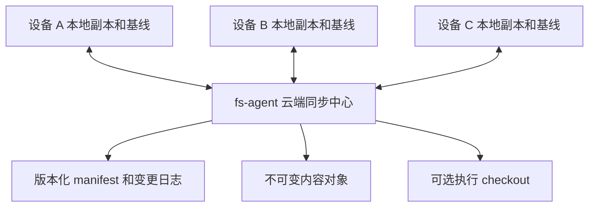
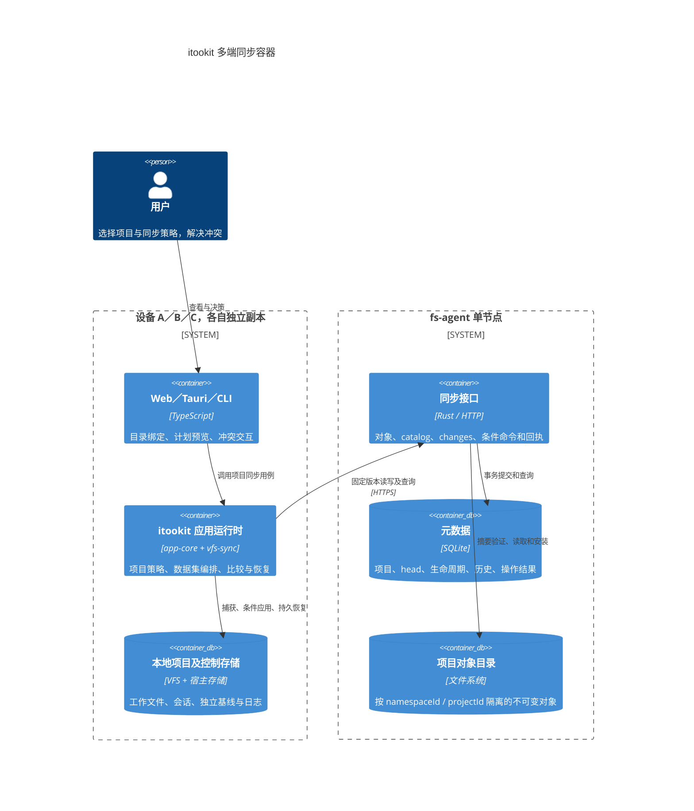
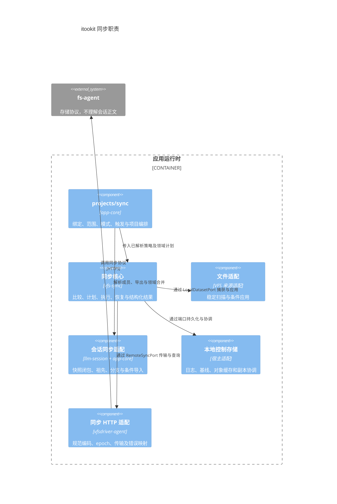
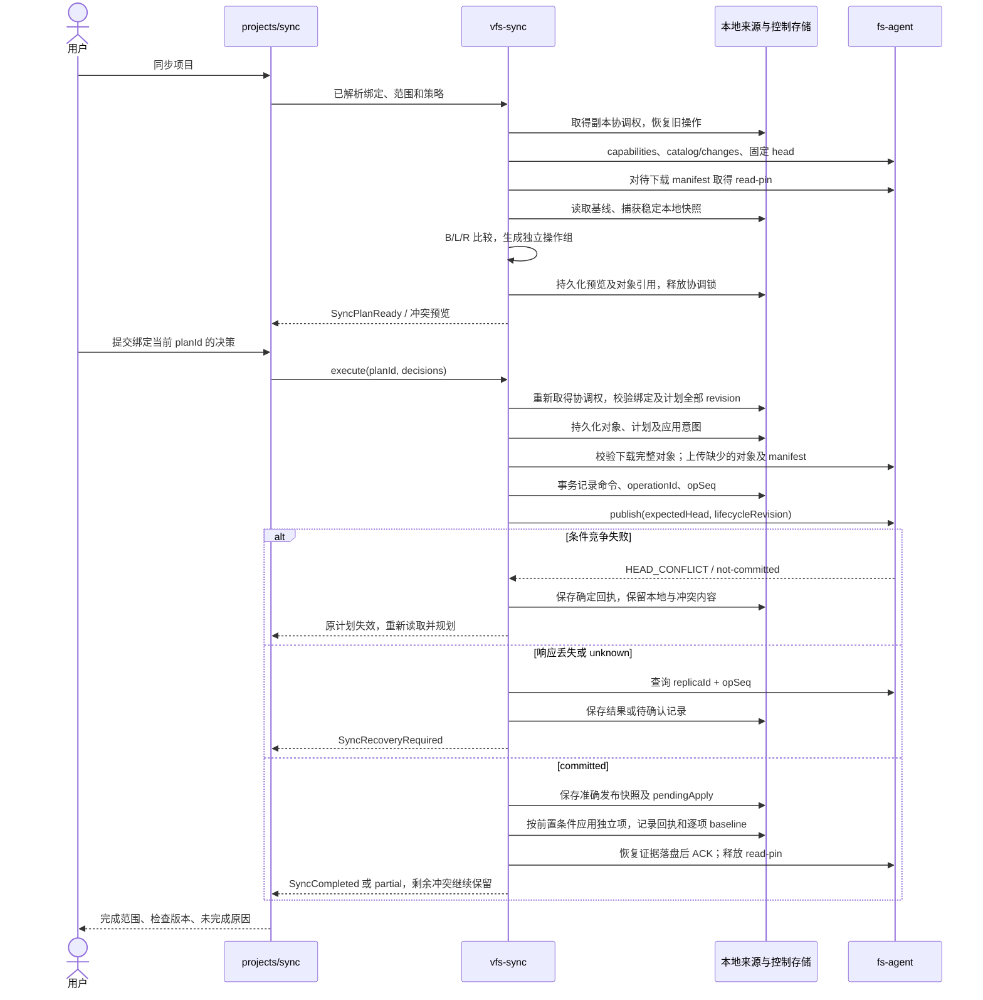
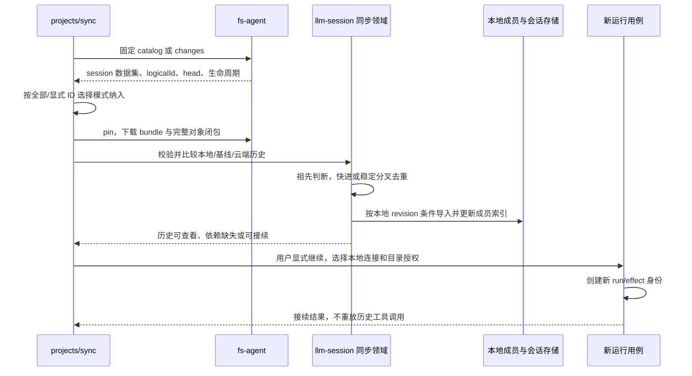
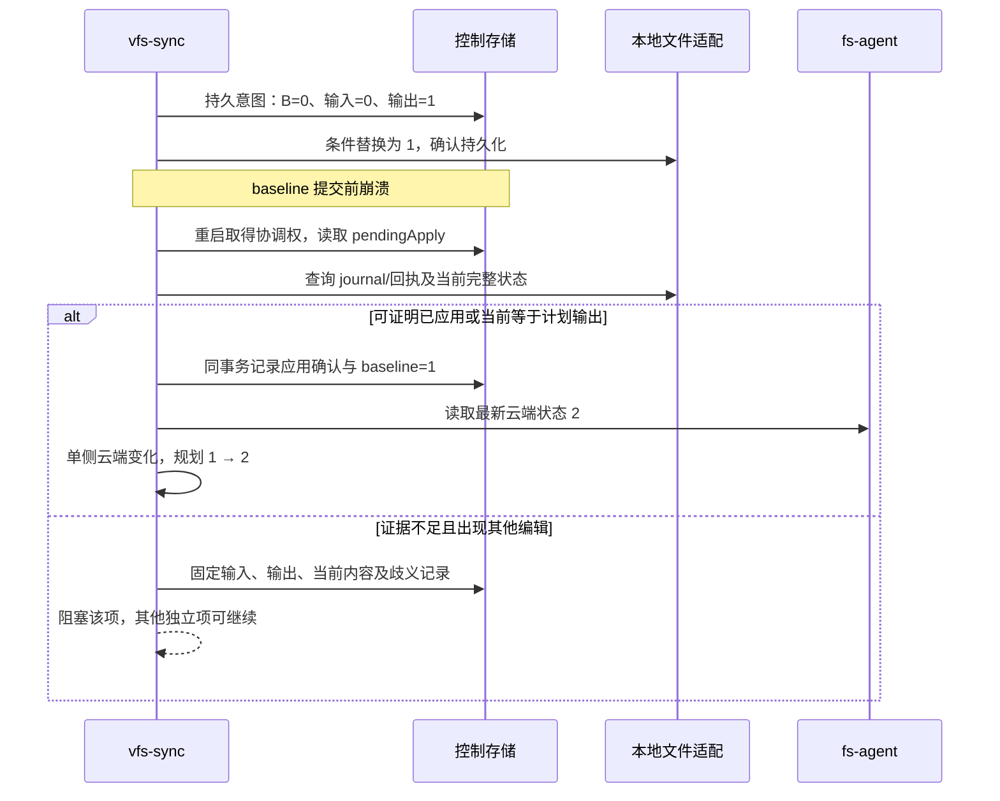

# itookit 项目多端同步设计方案

状态：客户端实施设计及首批交付记录，2026-10-03。fs-agent 存储协议已实现；itookit 已实现文件同步核心、HTTP 适配、IndexedDB 条件应用及可选项目用例。宿主交互与会话同步尚未交付，准确边界见第 22 节。未标为实施记录的契约仍是设计要求。

本文面向 itookit 的 Web、Tauri、CLI 和 fs-agent 维护者。目标是让 fs-agent 提供类似云存储的作用：同一项目可以关联多个设备副本，设备离线修改后通过云端交换变化，同时保留冲突、删除和操作结果的明确语义。

核心决策是采用云端中心模型。fs-agent 持有经过条件发布的项目数据版本、不可变内容对象和变更日志；每台设备独立保存自己的同步基线。项目同步策略归 app-core，目录同步机制归独立同步核心，会话语义归 llm-session。远程挂载、目录同步、会话同步和执行权转移分别建模。

服务端优先实施，具体存储、事务、路由、恢复和测试计划见 [fs-agent 多端同步服务实施方案](fs-agent-sync.md)。其中的副本操作序号和通用对象包进一步细化本文协议草图；客户端按该明确契约接入。

服务端首版备份边界为数据集级历史及回收站恢复，并提供管理员停机灾备。历史窗口从旧版本被替代时起算；项目删除恢复与任意时间点项目 checkpoint 分别建模。发布同时检查项目生命周期 revision；云端灾备恢复后，客户端按新 historyEpoch 注册新副本并全量对账，不沿用旧操作序列。具体字段、接口和验收以服务端方案为准。

## 1 目标与范围

### 1.1 必须支持的场景

1. 设备 A 发布项目，设备 B 和 C 关联同一云端项目，在不同宿主目录或浏览器 VFS 中建立副本。
2. 任意设备上传或下载变化，其他设备通过增量拉取或全量对账发现这些变化。
3. 多台设备离线编辑后重新连接；非冲突变化可收敛，冲突不静默丢失。
4. 删除传播到其他设备；长期离线设备不能无提示地复活已经删除的资源。
5. 用户可以只同步目录，也可以增加会话历史、附件和项目组织信息。
6. 支持上传、下载、双向同步、镜像，以及明确选择来源的强制覆盖。
7. 同步过程中发生取消、断线或重启，可以确认提交结果并安全恢复。

### 1.2 首期边界

首期不实现设备间 P2P、多个云端之间的复制、实时协同编辑、跨设备运行中任务迁移或跨目录与会话的分布式事务。自动同步属于触发策略，必须建立在手动同步已经可靠的机制上。

普通远程挂载继续直接访问授权 export。未关联云端同步项目时，文件访问和远程执行不增加同步前置条件。同步中心可关闭执行能力，单独作为云存储运行。

## 2 当前代码基础

以下为当前工作树中的实现事实，后续章节均为设计要求。

| 当前代码 | 可复用基础及限制 |
| --- | --- |
| [vfs-sync](https://github.com/mushuanli/vfs-sync/blob/main/src/index.ts) | 已有文件比较／计划、冲突选择、命令序列、FileSync 及端口；包含有界文本三方合并；不含会话合并 |
| [ProjectSyncService](../../packages/app-core/src/projects/sync/service.ts) | 可注入项目用例、策略 revision、解绑收尾及运行时关闭；宿主需提供持久项目到 session 映射 |
| [ProjectService](../../packages/app-core/src/projects/project-service.ts) | 稳定项目 ID、目录绑定和项目视图；openFiles 会组合挂载，不能直接把该视图全部递归复制 |
| [ProjectRemoteMountService](../../packages/app-core/src/projects/remote-mounts.ts) | 连接、凭据引用、项目授权和可用状态；同步关系需要独立记录 |
| [SessionFilesService](../../packages/app-core/src/vfs/session-files.ts) | 授权 revision、cwd、派生视图撤销和挂载守卫；该 revision 不代表目录内容版本 |
| [HTTP capabilities](https://github.com/mushuanli/vfsdriver-agent/blob/main/src/capabilities.ts) | 客户端目前只解析 sync.push；需要独立读取 /v1/sync/capabilities，不能由一个布尔值推导同步保证 |
| [HttpFSBackend](https://github.com/mushuanli/vfsdriver-agent/blob/main/src/backend.ts) | 条件替换、Range 读取、操作结果查询；删除和重命名目前没有相同的版本条件 |
| [fs-agent revision](../../tools/fs-agent/src/fs/revision.rs) | 服务生命周期内的文件身份凭证，不能作为内容摘要；命令后会使凭证失效 |
| [fs-agent router](../../tools/fs-agent/src/http/mod.rs) 与 [同步传输](../../tools/fs-agent/src/sync/transport.rs) | 已有 /v1/sync 的项目、数据集、对象、发布、catalog、changes、回执、历史及恢复接口；同一实例可同时提供普通 export 与同步存储 |
| [SessionBundle](../../packages/app-core/src/session/session-bundle.ts) | 格式版本、历史和附件交换；导入创建新身份，导出没有跨多个读取的快照边界 |
| [RoundGraphService](../../packages/llm-session/src/persistence/round-graph-service.ts) | 已有历史父引用和分支 head；输出、状态、执行引用及删除标记仍可原地更新，Round ID 不是不可变内容身份 |
| [SessionLeaseStore](../../packages/app-core/src/kernel/session-lease.ts) | 基于共享 SeqFile 事务的单写者租约；复制租约记录不能实现跨副本互斥 |
| [sync-server](../../apps/sync-server/src/routes/sync.ts) | 哈希及 mtime 比较、上传下载；缺少共同基线、项目分区和条件发布，不能直接充当多端一致性协议 |

现有执行边界见 [fs-agent 与 Harness](agent-server.md)，文件协议见 [HTTP 外挂文件系统](vfs-http-driver.md)，会话持久化见 [llm-session API](../llm-session-api.md)。本文新增独立同步协议，不改变已有文件接口的语义。

## 3 多端拓扑与身份



云端是已发布状态的权威来源，设备是可独立修改的副本。云端权威不意味着冲突时自动选择云端内容；本地未发布内容必须保留，冲突由策略处理。

### 3.1 身份模型

| 身份 | 含义 |
| --- | --- |
| authorityId | 云端同步存储的持久身份，独立于 endpoint 和进程启动 epoch |
| namespaceId | 账号或租户的数据与授权分区 |
| cloudProjectId | 云端项目的稳定身份 |
| localProjectId | 当前 MindOS 实例中的项目身份，通过绑定关联云端项目 |
| replicaId | 某个安装实例中某个项目副本的持久身份 |
| datasetId | 项目内的文件目录、某个会话或组织信息的数据集身份 |
| operationId | 一次发布操作的身份，绑定主体、请求内容和结果 |

多个设备可以有不同的 localProjectId，不能把本地 ID 相等作为项目合并依据。目录路径、项目名、会话标题和 endpoint 都不作为同步身份。

浏览器存储清空或克隆设备后必须创建新的 replicaId；不能复用旧副本身份和写入租约。凭据轮换不改变副本身份。云端存储恢复后若回退了版本历史，必须更换存储历史代次，拒绝旧 cursor 和旧发布条件；不得在同一历史身份下复用已签发版本。

### 3.2 副本绑定

绑定保存 authorityId、namespaceId、cloudProjectId、replicaId、当前设备的目录来源引用、所选数据集及同步策略。宿主绝对路径、credentialRef 和挂载授权是设备本地配置，不上传为可在其他设备执行的授权。

每个副本维护独立基线。设备 A 的成功同步不能更新设备 B 的基线，也不能表示设备 B 已经下载了数据。

设备 B 随时与云端已发布 head 对账，无需等待 A 的全部本地修改发布。A 尚未发布的修改只有 A 可见；A 随后连接时仍使用自己的基线。服务端执行 checkout 同样是一个工作副本，其变化发布后才对其他设备可见。

## 4 数据范围与一致性边界

### 4.1 数据集划分

| 数据集 | 内容 | 默认策略 |
| --- | --- | --- |
| files | 主项目目录的文件、空目录和受支持的文件元数据 | 首期支持，显式开启 |
| session | 单个会话的历史、分支、设置和附件 | 独立开启，不包含运行所有权 |
| organization | 项目名称、分组和已定义的导航引用 | 完整导航后续支持；最小会话成员目录与 session 同期交付 |
| definitions | 用户选择的 Flow、Agent、Skill 等定义 | 按依赖显式选择，凭据除外 |

额外挂载默认排除。用户选择额外挂载时，为其建立独立数据集和授权绑定，不从组合视图推断其属于主目录。只读参考目录不能因同步选择被提升权限。

会话分组目录是工作台组织关系，与主项目文件目录分别处理。不得通过扫描主项目目录猜测会话成员，也不得直接复制完整 MindOS profile。

不复制租约、凭据、进程句柄、临时运行目录和运行中 Kernel 状态。设备 UI 展开状态可以保留为本地状态；未来需要跨端共享时，采用独立且明确的覆盖规则。

### 4.2 原子性

云端必须支持单个数据集 manifest 的原子条件发布。不同数据集拥有独立 head，避免上传一个目录文件就使另一个会话的发布条件失效。

项目同步是多个数据集同步的编排，首期允许 files 成功而 session 冲突。UI 按数据集显示结果，不宣称整个项目具备事务原子性。

一个数据集内也可只发布独立且已解决的操作。云端该次 manifest 提交仍然原子，但未解决项保留云端原状及本地冲突记录；这不表示所有资源都已同步完成。

未来如需要“此会话引用这一版目录”，可新增不可变项目 checkpoint，引用各数据集的已发布 head。checkpoint 表示资源版本组合，不自动恢复运行环境，也不构成跨数据集写入事务。

## 5 模块划分与策略机制分离

| 模块 | 拟承担职责 | 禁止承担 |
| --- | --- | --- |
| app-core 的 projects/sync | 范围及覆盖语义、新会话纳入策略、同步关系、触发、守卫和数据集编排 | HTTP 实现、DOM 交互、直接递归复制所有挂载 |
| 新增 vfs-sync | 三方比较、局部计划、基线推进、传输、部分成功和恢复 | 项目导航、Session 业务、宿主路径、具体服务商 |
| 本地同步 store 及宿主适配 | 操作日志、基线对象、冲突、待应用结果、同副本串行协调 | 自行选择冲突赢家、隐式覆盖应用结果 |
| vfsdriver-agent 的 sync 适配 | 云端协议、能力发现、对象传输和结果查询 | 决定冲突赢家、持有项目业务状态 |
| vfs-core | 文件访问、通用条件 IO 和必要的可选能力 | 项目同步调度、会话合并、云端账号模型 |
| llm-session | 快照闭包、历史对象版本、祖先判断、稳定分支去重和条件应用 | 云端 HTTP、项目同步触发和凭据管理 |
| app-core 的 session 用例 | 会话同步和目标端依赖绑定 | 直接覆盖原始存储文件来合并会话 |
| app-shell 和 CLI | 计划预览、用户决策、进度和本地化 | 无条件覆盖、绕过提交前校验 |
| fs-agent | 同步存储、授权、对象校验、条件发布、日志和操作恢复 | Agent 推理、项目冲突选择、Session 调度 |

vfs-sync 通过注入端口工作，可以依赖 vfs-core 的通用契约，不依赖 app-core、llm-session、UI 或具体 HTTP 驱动。HTTP 适配可以依赖 vfs-sync 的端点契约。app-core 负责装配，宿主差异通过端口注入。

项目策略采用 contracts、policy、service、store、adapters 分层。policy 无 I/O；service 只编排；store 管持久记录；runtime 只接线和管理生命周期。第一阶段可先实现为内部目录，但迁移成独立包时不能改变上述依赖方向。

目录端点与会话端点复用对象传输、发布结果及取消语义，不共享任意业务数据的通用合并器。会话历史必须交给会话协议验证，不能套用普通 JSON 文件覆盖。

长任务可以按实际需要接入 durable-kernel 的 effect 与 reconcile；同步核心本身不要求启动 LLM 或 Session，不另造一套应用任务调度器。

## 6 云端存储模型

### 6.1 内容对象与 manifest

内容对象以摘要标识，上传后不可修改。云端验证摘要、长度和授权范围；不能信任客户端声称的摘要。首期以整文件对象为单位，大文件分块作为后续扩展。

manifest 是某个数据集的完整逻辑状态。目录项包含规范相对路径、类型、对象摘要、大小及协议定义的元数据。目录项不包含宿主绝对路径。会话 manifest 引用会话协议对象，服务端可将其视为经过格式约束的存储对象，不理解 LLM 调度。

manifest 本身也作为对象上传，摘要基于协议规定的规范编码字节。publish 识别对象类型及格式版本，验证路径结构、引用闭包和预算后才更新 head；任意 blob 不能作为有效 manifest 发布。读取 manifest 的路由是同一不可变对象的受控读取入口，不另建一份可变内容。

首期直接采用服务端现有 fs-agent.files v1 与 fs-agent.bundle v1，不另造不兼容格式。文件项仅有 kind、path、hash、size 及可选 executable，目录项仅有 kind、path；size 是规范十进制字符串，父目录显式存在，根目录隐含。mtime 仅保存在本地扫描缓存，不加入当前 manifest。entries 按路径 UTF-8 字节序排列；固定 ASCII 字段按规范排序，编码与服务端 fixture 一致。bundle 的 root 引用领域索引对象，objects 枚举完整引用闭包；会话业务版本放在其领域对象中，不给服务端 manifest 增加任意字段。

每个数据集有持久 head 和递增 generation。generation 用不透明字符串传输，客户端不能依赖 JavaScript Number 自行加一；文件 HTTP revision、进程 epoch 和授权 revision 均不能替代它。

与服务端字段对应的客户端类型示意如下；项目与数据集身份还由请求路径确定：

```ts
interface DatasetHead {
    generation: string;
    manifestHash: string;
}

interface PublishRequest {
    operationId: string;
    replicaId: string;
    opSeq: string;
    authorityId: string;
    historyEpoch: string;
    expectedProjectLifecycleRevision: string;
    expectedHead: DatasetHead;
    nextManifestHash: string;
}

interface PublishReceipt {
    operation: {
        operationId: string;
        replicaId: string;
        opSeq: string;
        historyEpoch: string;
    };
    outcome: 'committed' | 'not-committed' | 'unknown';
    result?: { head: DatasetHead; noChange?: boolean };
    state?: 'pending';
    code?: string;
}
```

首个 head 通过独立的条件创建操作建立。发布新 manifest 前，引用的对象必须完整可读且归当前授权范围。head、变更日志和发布回执必须在同一持久提交边界内落地，或通过 journal 恢复出等价结果。

客户端不依赖具体数据库。当前 fs-agent 使用 SQLite 元数据与独立对象目录；正常重启不改变持久 authorityId、generation 或发布结果。

### 6.2 变更日志与 cursor

日志记录数据集版本提交、资源删除和必要的成员变化。通知只用于提示“有新版本”，客户端必须通过日志或 head 对账确认内容；丢失通知不影响正确性。

首版 changes 的粒度为数据集提交和成员生命周期事件：包含 sequence、datasetId、kind、previousHead、head，以及发生创建或删除时的成员信息。它不逐项携带文件变化；客户端读取固定 manifest 后比较资源，资源删除由前后 manifest 差异及保留的删除记录确认。

分页日志必须有固定上界或连续性保证。cursor 绑定 namespace、项目、历史代次与查询范围；过期返回明确的需要全量对账状态，不能悄悄从当前时刻开始。

需要分别保存三类进度：已发现的云端日志位置、已经应用到本地的资源版本、可以用于压缩日志的确认位置。发现某次提交不表示已经应用；尚有冲突或未处理范围时，不能推进统一应用基线。

下载设备确认某个位置时，必须已经保存足够的本地恢复信息。上传成功不代表其他设备已确认。设备长期离线不能永久阻止清理，具体处理见删除与保留策略。

首期承诺文件级增量对象传输：相同摘要的文件不重复上传，但单个文件修改后仍可能上传完整新文件。日志增量发现不等于 manifest 元数据细粒度增量，后者首期仍可能全量读取。文件内部块级增量另行扩展，会话对象粒度见第 11 节。

### 6.3 管理存储与执行目录

同步权威存储采用受管对象与 manifest，不能把任意可被外部进程修改的 export 目录直接声明为可靠云端版本库。

已有普通 export 可作为导入来源，或作为受管同步版本的 checkout。checkout 必须记录来源 head、目录身份和脏状态；外部修改使其成为待发布变化，不能偷偷改动已发布 manifest。

远端执行使用指定版本的 checkout。任务完成后，可以通过显式发布用例把结果提交回云端；期间其他设备发布了变化，结果回传仍需三方比较。执行失败、取消和网络断开均不等于 checkout 没有变化。

文件工具与 Bash 继续读取同一 checkout 和授权挂载。同步中心的不可变对象不直接当作进程工作目录。

## 7 客户端基线与三方比较

### 7.1 基线内容

每个副本按数据集和资源保存：上次确认的内容身份、删除状态、来源 head、过滤配置 revision，以及本地成功应用记录。基线只记录该副本实际确认的状态。

设 B 为该资源的共同基线，L 为当前本地，R 为最新云端状态。hash 判断内容相同，类型和受支持元数据也参与比较。mtime 和文件大小只能优化扫描，不能决定冲突胜负。

| L 和 R 相对 B 的变化 | 双向同步的处理 |
| --- | --- |
| 双方均未变化 | 无操作 |
| 仅 L 变化 | 生成待发布变化 |
| 仅 R 变化 | 生成待下载变化 |
| 双方变化但最终状态相同 | 更新确认基线，无需传输 |
| 双方变化且最终状态不同 | 冲突，保留两端内容 |
| 一端删除，另一端修改 | 删除与修改冲突 |
| 双方删除 | 确认删除，推进该资源基线 |

首次关联没有 B。双方不同必须选择初始化方式：从云端建立新副本、把本地发布为新云端项目，或对已有两端执行保守合并。没有基线的缺失不能被当成删除。

这里的冲突是差异分类，不意味着必须立即人工处理。文件集合中互不依赖的变化可以自动合并；同一文本满足大小、编码与基线可读条件时可尝试三方合并；会话使用领域历史合并，不能复用文本算法。文本自动合并成功只证明算法未检测到文本冲突，不证明代码或业务逻辑正确。

承诺三方文本合并的资源必须保留 B 的正文，不能只有摘要。默认由本地对象缓存固定当前基线正文；基线变化或取消此项能力后才解除保护。若基线正文确实不可获取，则显示该限制并提供两侧比较、采用一侧或保留两份，禁止冒充三方合并。

### 7.2 多端并发发布

设备 A 和 B 都以云端 head H0 规划，A 首先发布得到 H1。B 发布时 expectedHead 不匹配，服务端拒绝提交；B 拉取 H1，使用自己原有 B、当前 L 和新 R 重新规划。

如果 A 修改 a 文件、B 修改 b 文件，B 的新 manifest 必须包含 A 的 a 文件和 B 的 b 文件，不能再次提交旧的完整 manifest 覆盖 A。两台设备修改同一文件时进入冲突。

首期采用数据集级 head 条件，接受无冲突发布也可能重规划的开销。后续可增加资源级条件合并，但服务端仍需要验证完整结果，不能用“不同路径”绕过目录与文件类型冲突。

自动重规划限制次数并退避；持续竞争时提示稍后重试。冲突决策绑定预览时的两端版本，任何相关版本变化都使该决策过期。

### 7.3 部分范围和部分冲突

新 manifest 必须由本次固定读取的云端 manifest 加上本次允许提交的修改构建，不能用本地扫描结果替代整份云端 manifest。发布条件绑定这一云端 head；条件失败后重新读取并构建。

只同步 src 时继承云端 docs 的状态；某文件冲突时，在发布结果中继承其云端状态，并保留本地内容、原基线和冲突对象。独立无冲突项可继续上传下载。发布时继承的范围和未处理资源不推进本地基线。

目录删除与子项修改、重命名的来源与目标、文件目录类型转换等作为关联操作组。组内有冲突或能力不足时整个组阻塞，其他独立组可完成。UI 显示部分完成和剩余冲突数。

### 7.4 基线推进规则

本地存储分开记录 observedHead、每资源 baseline、publishedSnapshot 和 pendingApply；不提供用一个 lastSyncedHead 替代这些状态的写入接口。

| 结果 | 基线与后续处理 |
| --- | --- |
| 仅发现 head 或下载对象到暂存区 | 不推进 baseline |
| 上传对象但未发布 | 不推进 baseline |
| 下载目标已经确认应用 | 该资源 baseline 更新到应用的准确状态，来源记录固定 head |
| 从本地快照 P 发布成功 | 确认该资源曾有的 P，不采样当前文件充当 P；当前文件若为新编辑 P2，则 P2 仍是相对 P 的变化 |
| 合并结果 M 已发布但本地尚未应用 | 保存 publishedSnapshot 和 pendingApply；保留旧 baseline，先恢复应用再做该资源的新规划 |
| 云端 manifest 中仅继承的项 | 不因整份 manifest 发布成功而推进该项 baseline |
| 冲突未解决或发布结果 unknown | 保留原 baseline，固定相关对象；先解决冲突或确认结果 |
| 双方相同且读取版本经校验 | 更新该资源 baseline；随后出现的新编辑仍被识别为变化 |

P 表示从该资源本地稳定读取并捕获的状态；客户端计算并发布、尚未应用本地的 M 不能套用 P 的规则。多个资源的 baseline 可以来自不同 head。每次推进同时持久化对应的操作确认，不能先把整个数据集标记为已应用。

## 8 同步流程与恢复

### 8.1 规划

1. 校验云端身份、当前授权、数据集范围和目标绑定。
2. 解析主目录真实来源，检查本地写权限、空间和当前运行状态。
3. 获取云端固定 head 与 manifest，读取本地基线。
4. 建立本地稳定扫描结果；没有快照时使用写入屏障或变化检测与重扫。
5. 进行三方比较，生成包含新增、修改、删除、冲突和预计字节数的计划。
6. 策略自动接受允许的操作，交互端只提交明确的冲突决策。

读取文件时如果变化导致摘要无法与扫描结果一致，标记该项不稳定并重扫。watch 事件只是加速脏状态发现，不能证明没有漏掉外部修改。

### 8.2 发布与下载

上传先传缺少的对象，再条件发布 manifest。对象已上传但 head 尚未提交，不算同步成功；未引用对象由保留与 GC 策略清理。

下载从固定 manifest 取得对象并校验，暂存后按本地目标条件应用。规划后本地又被编辑时拒绝覆盖。宿主不支持跨文件原子替换时，按项记录成功结果，保留部分完成状态；不能宣称整个目录已原子切换。

双向同步可以产生上传和下载两个阶段，必须分别记录提交边界，不能伪装为两端原子事务。任何阶段完成后仍可能出现新变化，状态应绑定最后对账的版本和时间。

### 8.3 幂等与取消

operationId、opSeq、完整命令及规范请求摘要在发送前一起持久化。实际回执查询键为当前 historyEpoch 下的 replicaId + opSeq；operationId 不能替代该查询键。同一身份和请求重试返回原结果，序号相同而内容不同必须拒绝。响应丢失时先查询结果，不能创建新 ID 或递增序号盲目发布。详见第 19.3 节。

回执保留时间与客户端恢复窗口必须通过能力或协议约定。原提交结果是否已知与旧命令是否仍可能执行分别记录。pending 或准入未知时不能绕过；已终结且永不重执行的过期命令可以在内容对账后继续后续序号，但历史结果仍为 unknown。摘要相等只能证明内容收敛，不能证明原请求曾经提交。判断与取消序号规则统一见第 19.3 节。

取消可停止扫描或对象传输。发布跨越提交边界后，取消不能撤销已经提交的 head。UI 分别显示“停止等待”“服务端取消已确认”“已提交”。

本地崩溃恢复读取操作记录，先核对云端回执和本地应用结果，再更新基线。部分成功不回滚其他设备的提交；恢复只处理本次未确认项。

### 8.4 本地应用日志与崩溃窗口

操作日志至少包含固定云端 head、范围 revision、逐项原基线和本地输入状态、计划目标对象、操作组、operationId、发布请求摘要与回执、逐项应用状态和冲突决策。日志引用的对象必须持久可读，不能只保留临时内存路径。

同一副本的恢复和同步写入串行协调，覆盖多个窗口及进程；仅有进程内 Promise 队列不够。重叠目录即使注册为不同副本，也需要共享应用守卫或拒绝这种绑定。同步锁不替代对编辑器、Agent 和外部文件写入的检测。

单项下载遵循：持久化应用意图和目标对象 → 校验本地前置状态 → 条件替换 → 确认替换持久化 → 在本地控制存储事务中同时记录应用回执及新 baseline。文件替换与控制存储不是同一事务时，宿主适配必须提供可恢复的 journal 或结果核对机制。

恢复按以下顺序执行：先确认已发送的发布结果，再核对待应用项，最后推进已确认项的 baseline 并开始普通对账。对待应用项：

- 当前完整状态等于计划输出，可确认收敛到该输出并推进 baseline；此后再与最新云端版本比较。
- 当前仍等于输入且可靠记录证明未开始替换或替换未提交，可按条件重试；若回执证明已经应用后又被用户改回，则保留这次编辑。已经开始替换但结果未知时，输入相等也不能排除“应用后改回”，应保留歧义。
- 当前与输入及输出均不同，有可靠应用回执时，以已应用输出作为 baseline 保留后续编辑；没有足够证据时保留全部内容并报告应用结果待确认。

仅提前写一条意图日志，不能证明文件已经替换。若替换后又发生外部写入且回执未落盘，不能推断该变化的先后关系。无法提供可靠 journal 的后端应声明这一恢复限制，保守处理歧义，不承诺任何情况下都无假冲突。

例如 baseline 中 b=0，下载 b=1 后、确认事务前崩溃，恢复看到 b=1 且计划目标也是 1，应先确认该次应用并把 b 的 baseline 推进到 1，再与云端 b=2 对账，从而按单侧云端变化下载 2。不能直接用旧 baseline=0 开始规划。

已发布的合并结果尚未应用而本地又有新编辑时，保留原本地输入、已发布结果与当前内容，先产生恢复决策；不能覆盖当前内容，也不能重复创建同一次合并提交。

## 9 同步模式与强制覆盖

同步配置分别保存 direction、deletionPolicy、conflictPolicy、scope 和 overwriteScope。overwriteScope 明确为仅选中冲突项或所选全部范围。触发方式单独保存为手动、定时、变更后或执行前准备。

| 模式 | 语义 |
| --- | --- |
| 上传 | 本地到云端；云端独有内容默认保留，云端变化仍可形成冲突 |
| 下载 | 云端到本地；本地独有内容默认保留，本地变化仍可形成冲突 |
| 双向 | 基于各副本的基线传播双方变化 |
| 本地镜像到云端 | 所选范围内以本地为来源，删除云端多余项 |
| 云端镜像到本地 | 所选范围内以云端为来源，删除本地多余项 |
| 冲突采用指定侧 | 仅对选中冲突项选本地或云端，其他项继续正常比较 |
| 用本地覆盖云端选中范围 | 所选范围内以本地存在项覆盖云端同名项，即使只有云端变化；目标独有项保留 |
| 用云端覆盖本地选中范围 | 对称覆盖当前副本，目标独有项保留 |

单向同步不等于无条件覆盖，强制覆盖不等于取消条件提交。冲突选择只改变选中项的赢家，范围覆盖还会替换目标单侧变化，镜像进一步删除目标独有项。三者都不绕过授权、身份、目标版本、忙时守卫、空间或完整性校验。冲突项本身是删除状态时，采用该状态也属于删除，必须出现在删除预览中。

本地覆盖或镜像到云端会改变云端已发布状态，其他设备后续可以拉取；预览必须明确项目、范围及删除数量。云端覆盖或镜像到本地只修改当前副本，不发布云端变化。采用一侧解决冲突的实际写入端由 direction 和计划决定；与方向不符时应显示该项跳过或要求显式改变方向，不能偷偷反向写入。其他设备的未发布修改仍由其各自基线保护。

首期默认保留目标独有项，删除需要明确策略。覆盖前保留可恢复版本；恢复旧版本通过新的条件发布完成，不回退历史 generation。

## 10 删除过滤与跨平台目录

### 10.1 删除传播和保留

日志记录删除 tombstone 及对应版本。历史清理仍受最低历史／回收保留窗口、读取 pin 和其他保护根约束，ACK 不能缩短备份承诺。changes/cursor、历史正文和副本活跃性采用独立期限：cursor 过期要求重新枚举，历史正文过期限制合并／恢复，replica 过期要求新副本接入；不能由其中一种推断另两种。接入规则见第 19.3 节。

过期副本不能把所有本地存在项当成新建直接上传。对于缺少历史、无法判断是否曾被删除的项，保留本地内容并要求选择恢复、另存或放弃。首次初始化和基线丢失遵循同样规则。

删除文件夹需要比较整个受影响子树；删除与子项修改、文件与目录转换均属于冲突。重命名首期可以按删除加新增处理；推测重命名只能优化传输，不能减少冲突保护。

删除本地项目、副本解绑、删除云端项目是不同命令。解绑不删除云端数据。云端项目删除要求独立权限，进入可恢复状态，并让其他设备停止发布，而不是由普通目录清空推断。

### 10.2 范围过滤

同步规则独立于文件树展示过滤和工具发现规则。可以提供基于 gitignore 的同步预设，但必须明确规则来源和实际排除项。默认排除凭据及约定临时产物，用户可以检查规则。

排除项不参与镜像删除，也不能通过删除父目录、重命名覆盖或目录转文件间接删除。父操作必须展开其影响闭包，遇到排除项、未知项或未选范围就保留必要父目录并阻塞该关联组；可独立删除的已选叶项仍可执行。过滤配置改变时建立新的范围 revision：新增纳入项需要初始化比较，移出范围的项保留双方内容和必要历史，不推断删除。每个副本可有不同范围，未选择的数据集或路径不能被其发布操作擦除。

### 10.3 文件系统差异

云端采用规范相对路径并声明命名语义；不通过统一转小写或静默 Unicode 归一化合并文件。目标端提前检查大小写、Unicode、保留名、路径长度和文件目录碰撞，无法表示则报告不可同步项。

首期只支持普通文件和目录，拒绝符号链接及特殊文件，不自动跟随链接。可执行位等元数据按目标能力声明处理；无法保存时显示降级，不宣称完整还原。ACL、owner、设备节点和宿主 inode 不作为可移植状态。

## 11 会话同步与执行所有权

### 11.1 会话历史协议

会话同步首先支持历史副本和安全接续，不同步运行中任务。会话数据集必须有稳定逻辑身份、格式版本、一致性快照、历史对象和附件引用、分支 head，以及依赖定义引用。

现有 SessionBundle 保持“导入为新会话”的语义。新增同步接口允许识别和条件应用已有副本，不能通过反复导入创建重复会话。

llm-session 定义封存历史对象及校验规则。只有明确不可变的对象才能按摘要去重；运行中的 round 必须等待封存或通过专门快照协议处理。分支 head、设置和组织信息作为可变引用采用条件更新。

首期以单个封存 Round 的可移植版本作为历史对象，附件与大内容使用独立对象引用，并规定每个对象上限；增加一个 Round 不重新上传所有历史正文。manifest 索引仍可能完整传输。超出上限的历史需要已定义的分段格式，否则明确拒绝，不能静默截断。

现有 RoundGraphService 允许输出、status、executions、删除和 stale 标记原地变化，因此封存必须是显式导出语义。同步对象使用 logicalRoundId、内容摘要和版本关系共同标识；同一 ID 不同内容不得简单去重。已封存内容再次被编辑时生成新对象版本，原对象保留；执行期字段与可移植正文的取舍由会话格式规定。

两个设备从同一历史继续对话时，保存为独立分支或设备分叉，再由用户选择当前分支。普通文本三方合并器不能合并会话 Round、工具结果或执行记录。

目标端验证所有引用可达，恢复父子会话和项目成员时使用稳定逻辑 ID。附件先完整上传，manifest 最后发布。缺少 Agent、Connection、Skill、Flow revision 或上下文对象时，可以显示历史并提示依赖缺失，禁止伪造完整可执行状态。

连接 ID 和权限属于本地绑定；目标端继续对话前重新选择连接及工作区授权。会话采用哪个文件 head 可以作为快照引用记录，引用不授予目录访问权。

### 11.2 最小会话成员目录

会话同步必须同时交付可枚举的数据集成员目录。每条包含 datasetId、kind、logicalSessionId、cloudProjectId、head、active/deleted 状态及成员 revision。它负责会话发现，完整分组、排序和导航仍属于 organization 的后续扩展。

首次发布会话时，数据集创建、首个 head、成员可见性、变更事件与回执在同一服务端持久提交边界内完成；只有对象完整的会话才进入可枚举目录。后续发布与成员中的 head 同步更新，删除以带条件的生命周期操作产生 tombstone。该元数据事务不要求同时提交项目文件或其他会话。

绑定保存会话选择模式：同步全部当前及未来会话，或只同步显式选择的稳定 ID。即使只选择部分，仍可以读取授权范围内的成员变化并显示新会话待选择。全量清单按固定 catalog revision 分页，并返回对接 changes 的 cursor；新变化从该位置继续读取，避免枚举与订阅之间漏掉新增。

### 11.3 重复同步与分叉

祖先关系以验证过的历史父引用和对象版本关系判断，不能只比较时间、标题、数组前缀或 logicalRoundId。缺少祖先对象时先补齐；无法补齐则保留双方并报告缺失依赖。同一 Round 的并发编辑属于版本冲突，不能通过合并对象集合自动选定一个版本。

| 历史关系 | 处理 |
| --- | --- |
| 两侧对象和引用相同 | 无操作，不增加会话或分支 |
| 本地引用是云端引用祖先 | 在目标引用版本未改变且方向允许时快进 |
| 云端引用是本地引用祖先 | 在方向允许时发布本地新增对象和引用 |
| 从共同祖先分叉 | 合并可验证对象集合，保留两个分支，不创建自动拼接对话的 merge Round |
| 同一分叉再次出现 | 更新或复用已有稳定分支，不再次创建副本 |
| 删除与追加并发 | 保留新增历史，产生删除与追加冲突 |

同步协议为分支分配稳定 refId，名称只是显示字段。本地开始一段可能独立推进的历史前持久化来源 refId、确定来源 Round 版本、replicaId 和一次 forkId；在线与离线均遵守此规则，该身份随发布保留。只有实际分叉时才需要展示独立分支，重试及恢复不重新生成 forkId。导入端按来源分叉身份映射目标 refId，重复拉取使用同一映射；此分叉的后续追加继续推进该 refId。重复发布还受 operationId 与 expectedHead 保护，不能每次按 branch-N 重新命名并创建。

标题及可移植设置按字段或不可拆分配置组做三方比较，单侧变化可应用、双侧不同进入冲突，禁止按时间最后写入覆盖。分支名与删除引用采用稳定 refId 和条件修改。currentBranch/currentHead 作为当前设备的选择保留本地，不因背景同步切换；显式“采用云端会话”必须指定 refId 和预览时的固定 head，不能提供含糊的“云端当前分支”。

“采用云端会话”默认切换到选定云端分支，保留本地独有历史为可恢复分支。彻底删除分支及其不可达历史属于独立动作，遵守保留和并发条件，不能使用普通目录镜像实现。

### 11.4 接续验收

S4 必须分别证明历史可查看，以及受支持配置下历史、附件、上下文和定义依赖完整后能创建新的运行继续对话。只验证“依赖缺失时报错”不算通过接续验收。

导入的工具结果和执行引用仅作历史证据，不触发旧任务恢复。新设备接续创建新的运行及 effect 身份，不自动重放旧工具调用、未确认外部副作用或 pending execution。存在未完成运行的源会话按下一节处理。

### 11.5 租约边界

跨副本复制 SessionLeaseStore 记录不能保证排他运行。查看历史无需执行租约；离线继续只能产生独立分叉。

如后续提供“同一逻辑会话由单个设备接续”的模式，云端单独提供 owner、到期时间和单调 fencingToken。续租与过期判断使用服务端时间，任何受保护写入都必须验证 token。数据存储同步租约与会话执行所有权租约分别管理。

中心租约只能约束实际验证 token 的服务。若旧设备的本地 Kernel 或外部副作用不能被阻止，不能宣称已经完成执行权转移。首期不支持运行中任务接管；发现未结束任务时要求在原设备确认停止，或在新分叉中继续。

后续运行迁移必须单独设计 Kernel checkpoint、上下文可达闭包、effect reconcile、授权重建和旧执行者回收，不通过文件同步自动触发恢复。

## 12 运行期间同步与自动策略

项目内多个 Session、编辑器和外部进程都可能修改目录，不能只检查当前会话。app-core 注入项目级使用守卫，对下载替换、镜像删除、切换 checkout 和挂载重绑定执行忙时预检。

上传若有真实稳定快照可允许任务并行，否则等待写入屏障或检测变化后重新规划。下载和镜像需要取得与目标写入方协调的保护；无法阻止外部写入的宿主只能提供明确的降级保证，不能使用先 stat 再覆盖冒充强 CAS。

未来对 HTTP export／执行 checkout 应用结果时，可以评估复用 fs-agent 的命令与文件访问互斥；单请求 FileGate 不自动覆盖多请求应用边界。普通同步对象库由同步服务自身的事务、对象保护与运行协调管理，不使用执行 FileGate。

自动同步默认不自动解决冲突、不自动镜像删除、不接管执行所有权。断线重连先恢复未确认操作，再增量对账。执行前准备和结果回传是 app-core 的显式策略，失败时不能把文件工具和 Bash 指向不同版本的目录。

## 13 状态与用户提示

分别维护连接状态、内容状态、操作阶段和目标可写性，不能用单个 synced 布尔值代表所有状态。

| 维度 | 状态示例 |
| --- | --- |
| 连接 | online、offline、identity-changed、unauthorized |
| 内容 | unchecked、equal、local-changed、cloud-changed、both-changed、conflict |
| 操作 | idle、scanning、transferring、publishing、applying、partial、failed、unknown |
| 可写性 | writable、readonly、busy、grant-expired、replica-expired |

“已同步”仅表示所选范围在某次确认版本下相同，同时显示检查时间；新通知或本地变化立即使其过期。连接在线不能推导内容相同。

| 情况 | 提示与动作 |
| --- | --- |
| 双方修改同一文件 | 显示本地、云端和基线差异；选一侧、保留两份或文本三方合并 |
| 删除与修改冲突 | 明确选择删除或保留修改，不自动按时间决定 |
| 预览后版本变化 | 计划过期，重新扫描；强制决策同样过期 |
| 其他设备发布变化 | 提示云端更新，按当前副本基线重新规划 |
| 运行忙或未保存编辑 | 等待、排队、先保存或由用户停止相关任务 |
| 发布响应丢失 | 显示结果待确认，按当前 epoch 下 replicaId + opSeq 查询并校验 operationId |
| 部分下载成功 | 列出完成、冲突及未执行项，保留恢复入口 |
| 副本或 cursor 过期 | 全量对账，并保护可能复活的旧本地内容 |
| 身份改变 | 停止自动同步，重新绑定，保留本地副本 |

冲突以独立记录保存相关基线、两端对象及决策版本，不把文本冲突标记写入二进制文件或会话对象。保留两份需要生成经过命名校验的目标路径或会话分支，并作为新变化发布。

错误从核心返回结构化 code、数据集、相对路径、阶段、可重试性和提交结果。中文及英文文案归 common，UI 不展示凭据或服务端宿主路径。

CLI 非交互模式默认停止需要选择的项，独立项可完成；输出结构化 completed、partial、conflict、unknown 或 failed。只有请求范围全部已确认完成才返回成功，其他结果返回非零并保留恢复记录。显式策略参数的含义与 UI 一致，不能把无交互理解为默认覆盖。

## 14 fs-agent 协议与能力

以下以当前 fs-agent 已实现协议为接入基准，具体请求字段见 [服务端使用说明](../../tools/fs-agent/doc/sync.md) 和 [同步传输实现](../../tools/fs-agent/src/sync/transport.rs)。不能把这些操作隐藏在现有 content 写入中。

| API | 作用 |
| --- | --- |
| GET /v1/sync/capabilities | 协议版本、存储身份、保证、限制与保留窗口 |
| POST /v1/sync/replicas | 注册副本，进入 reconciling |
| GET /v1/sync/replicas/:replica | 查询副本状态和 lastAdmittedSeq |
| POST /v1/sync/replicas/:replica/activate | 服务端校验 catalog 范围凭证后启用发布；本地实际对账由客户端保证 |
| POST /v1/sync/projects | 在当前 namespace 条件创建云端项目 |
| GET /v1/sync/projects | 枚举当前主体可见的云端项目 |
| POST /v1/sync/projects/:id/datasets | 条件创建数据集、首个 head 与成员记录，携带 operationId |
| GET /v1/sync/projects/:id/datasets | 固定 catalog revision 枚举成员，返回与 changes 对接的 cursor |
| GET /v1/sync/projects/:id/datasets/:dataset/head | 查询持久 head |
| GET /v1/sync/projects/:id/manifests/:hash | 读取固定 manifest |
| POST /v1/sync/projects/:id/objects/check | 检查当前授权范围内缺少的对象 |
| PUT /v1/sync/projects/:id/objects/:hash | 上传并验证不可变对象，含按规范编码的 manifest |
| GET /v1/sync/projects/:id/objects/:hash | 下载及有界 Range 读取 |
| POST /v1/sync/projects/:id/datasets/:dataset/publish | 条件发布 manifest |
| GET /v1/sync/projects/:id/changes | 按 cursor 拉取数据集 head 与成员生命周期事件 |
| POST /v1/sync/projects/:id/read-pins | 固定授权 manifest 闭包供下载，返回到期时间及释放续期句柄 |
| POST /v1/sync/projects/:id/replicas/:replica/ack | 确认恢复信息已落盘的进度 |
| GET /v1/sync/replicas/:replica/operations/:seq | 查询当前 epoch 下的持久操作结果 |
| POST /v1/sync/replicas/:replica/operations/:seq/cancel | 未准入命令可登记取消；进入提交阶段后只确认结果 |
| GET /v1/sync/projects/:id/datasets/:dataset/versions | 独立于 changes 枚举历史及可恢复状态 |
| GET /v1/sync/projects/:id/datasets/:dataset/versions/:generation | 查询指定历史版本 |
| POST /v1/sync/projects/:id/datasets/:dataset/delete 或 restore | 条件删除或恢复已删除数据集 |
| POST /v1/sync/projects/:id/delete 或 restore | 条件删除或恢复项目，生命周期 revision 改变 |

所有请求除 capabilities 外携带 X-Sync-History-Epoch。项目及数据集变更携带 authorityId、historyEpoch、replicaId、opSeq、operationId；项目范围变更另校验 expectedProjectLifecycleRevision，publish 还校验 expectedHead。有效数据集恢复旧内容复用 publish，生成新的 generation。当前没有副本注销入口，客户端解绑只清理本地关系，不能虚构服务器注销成功。

客户端读取实际能力字段：protocolVersion、filesManifest、opaqueBundle、atomicPublish、durableOperations、changeFeed、readPins、historyList、datasetVersionRestore、datasetTrashRestore、projectUndelete、projectCheckpoint、offlineStoreBackup、objectUpload 及 limits。可将其映射为内部能力，但不能要求服务端返回旧草案中的 historyRestore 或 operationRecovery 字段。projectCheckpoint 当前为 false。会话能力由存储保证与客户端领域协议共同决定，不能只凭 sync.push=true 自动开放。

read-pins 提供受配额约束的版本读取保留；创建时原子验证 manifest 及其闭包仍存在并登记 GC 根。续期与释放使用独立句柄命令，到期后返回明确的保留失效错误。单次读取已经开始时保持对象可读至该请求结束；跨多次请求不自动延长整个快照的保留期。

同步能力与 process.exec、terminal.pty 独立。具备文件 rw 权限不自动具备云端发布或项目删除权限。

旧服务器没有独立同步路由时保持原有 files-only/exec 行为。扩展 capabilities 的版本及兼容解析规则必须一起设计，旧客户端不能因新增字段而误认为已有同步保证。

## 15 安全配额与保留

所有项目、对象、manifest、日志、operation 和副本接口按认证主体及 namespace 授权。知道对象哈希不授予读取权；对象存在性检查不得泄露其他租户内容。物理去重可独立实施，逻辑授权和引用计费必须隔离。

服务端验证相对路径、规范编码、重复项、父子类型冲突、对象闭包和提交预算。复用现有安全目录解析，但云端存储目录由服务端管理，客户端不能提交任意宿主路径。

传输使用 HTTPS 或受控本地连接，凭据通过宿主 provider 注入。日志只记录主体引用、项目、operation、阶段、错误码和统计量，不记录凭据、正文或秘密路径。

配额覆盖项目数量、总逻辑字节、版本保留、暂存对象、manifest 大小、并发操作和下载预算。配额不足在发布前明确拒绝，不能发布引用缺失对象的 head。

GC 以已发布 manifest、保留历史、暂存上传保护、有效读取 pin 和未确认操作为根。对象上传与 GC 需要同一套保护机制，避免上传到发布之间对象被清理。删除云端项目先进入回收期，过期后才回收不可达内容。

客户端在下载旧 head 的对象前取得读取 pin；pin 生效期间新 head 发布或历史清理不能移除其闭包。pin 失效且旧对象已经清理时，明确提示快照过期，重新规划；不得用新 head 对象混填旧 manifest。保留期限有限，不能保证无限离线后仍可读任意旧版本。

本地 GC 固定三方合并基线正文、未解决冲突的 B/L/R 对象、待应用结果和恢复日志引用。冲突内容在创建冲突记录前持久化到本地，完成后可释放云端读取 pin，避免无限占用云端历史。空间不足时停止需要该保证的操作并明确提示，不能先清理基线再声称支持自动合并。解除冲突或推进基线后通过引用计数或可达性扫描回收旧对象。

同步服务单节点首期只允许一个持久版本权威，防止两个 fs-agent 实例各自签发 generation。多实例高可用需共享事务存储或一致的单写者机制，不能仅复用普通目录的 advisory lock 声称具备分布式一致性。

## 16 实施阶段与验收

| 阶段 | 交付边界 |
| --- | --- |
| S0 | 客户端身份、绑定生命周期及端口；对接已有协议，闭环过期回执、取消序号和重新接入 |
| S1 | 首个 IndexedDB 受管后端手动上传下载；扫描完整性、属性降级、逐资源基线、原生条件应用事务、恢复与对象保留 |
| S2 | 多端双向文件同步、局部计划、删除、增量发现、cursor 过期、基线正文保留和可降级文本三方合并 |
| S3 | 明确范围覆盖、镜像及版本恢复、自动触发和跨平台能力检查 |
| S4 | 先冻结 19.9 的 schema、fixture 和快照／导入契约，再实现会话发现、版本对象、分支去重与完整依赖下的新运行接续 |
| S5 | 按需求增加定义同步、执行 checkout 准备和显式结果回传 |

每阶段按实际能力开放入口，不能以协议草图替代真机验收。关键验收矩阵：

| 场景 | 必须满足的结果 |
| --- | --- |
| A 发布，B 与 C 下载 | 同一云端项目，不同本地绑定；基线分别推进 |
| A 与 B 从同一 head 修改不同文件 | 首次竞争发布被条件拒绝，重规划后同时保留双方修改 |
| A 与 B 修改同一文件，C 拉取 | 双方内容保留；C 只接收已发布版本，不替冲突设备作决定 |
| A 删除，B 离线修改，C 在线下载 | C 应用删除，B 重连进入删除与修改冲突 |
| B 超过保留窗口后重连 | cursor 明确过期，全量对账，不静默复活旧文件 |
| 上传后服务崩溃、发布响应丢失 | 回执和 head 可恢复，不重复发布，不丢日志 |
| 下载期间本地编辑、任务运行 | 条件拒绝或可靠协调，不覆盖新内容 |
| 强制覆盖预览后另一设备发布 | 原计划过期，重新取得用户决策适用的版本 |
| 镜像与过滤规则变化 | 排除范围不删除，新纳入项保守初始化 |
| 大小写碰撞、链接、特殊文件 | 预检拒绝或明确降级，不静默改名或跟随链接 |
| 同步期间取消和本地重启 | 准确区分已提交、未提交、部分完成和 unknown |
| 会话两端离线继续 | 保存独立分支，引用闭包完整，执行所有权不被复制 |
| 租户越权和对象哈希探测 | 不读取、不发布、不泄露其他 namespace 内容 |
| 云端备份恢复导致历史回退 | 历史代次变化，旧条件和 cursor 被拒绝 |
| 下载应用后、基线事务前崩溃，云端再次修改 | 先确认应用到的目标，再对账最新云端，不产生示例中的假冲突 |
| 替换后又发生外部编辑，但无可靠应用回执 | 保留当前文件及计划对象，报告恢复歧义，不猜测应用顺序 |
| 合并发布成功、本地应用前崩溃 | 找回固定发布结果，条件应用；不重复合并或覆盖后续本地编辑 |
| 上传快照期间本地再次编辑 | baseline 确认发布快照，新编辑保留为待同步变化 |
| 旧基线正文缺失 | 明确降级两侧比较或保留两份，不伪造三方合并 |
| 一项冲突，其他项无关 | 独立项完成，冲突项及原基线保留；父子关联组不拆分 |
| B 只选 src，A 更新 docs | B 的发布继承云端 docs，不擦除或回退未选范围 |
| A 新增会话，B 已绑定项目 | B 通过成员目录和事件发现，并按选择模式下载或提示 |
| 同一分叉多次同步及继续追加 | 映射到同一稳定分支，不重复创建会话或分支 |
| 同一 Round ID 被两端改成不同内容 | 检出版本冲突，不按 ID 去重丢弃内容 |
| 一端删除会话，另一端追加 | 保留追加历史并产生删除冲突 |
| 旧 head 下载期间发布新 head 并运行 GC | pin 有效时完成下载；过期后明确重规划 |
| 两个窗口或 CLI 同时同步同一副本 | 恢复与基线写入串行，不把另一操作的结果当作自身确认 |
| B 下载完整受支持会话后继续 | 创建新运行成功，旧工具副作用不被重放 |
| 子目录无权限、读取失败、过大文件或枚举被取消 | 保留 unknown/unsupported；不将扫描遗漏发布为删除，独立完整范围可继续 |
| 删除或类型转换涉及排除子项 | 不通过父操作删除排除内容，关联组阻塞或仅操作已选叶项 |
| 原发布终态回执过期 | 保留历史结果 unknown，确认旧命令已终结并对账后可继续；404 不当作终结 |
| 本地序号分配后取消且未发送 | 先行取消消费该序号并保存回执，后续序号无缺口 |
| 发布过程中解绑并换目录或改策略 | 原云端结果可查，旧应用不能写到新来源，日志及恢复对象保留 |
| 后端无法表示 executable，修改正文后上传 | 继承固定云端属性，不清掉已有可执行位，显示 metadata-degraded |
| A、B 都在线推进同一会话引用 | 稳定 forkId，重复同步不创建重复分支 |
| 编辑父 Round 后同步既有后代 | 后代仍指向原版父对象，修订祖先与对话祖先不混用 |
| Web 控制存储丢失、空间不足或事务 abort | 不执行旧删除计划；新副本保守接入；失败事务不清理现有恢复证据 |
| 用户长时间停留预览，另一个窗口同步 | 预览不持续占协调锁；执行重取锁并检验过期条件 |

测试层次包括纯策略与三方比较、端口契约、fs-agent 存储崩溃恢复、HTTP 客户端到服务端集成，以及 Web/Tauri/CLI 多副本验收。实施时同步更新包依赖守卫与相关活文档。

## 17 实施前需确定的参数

总体拓扑、模块边界、条件发布和副本基线按本文执行。下列参数在对应阶段确定，不阻塞职责拆分：

- Tauri／CLI 与外部来源的条件应用 journal；S1 首个 IndexedDB 后端已在 19.4 固定方案，新增其他后端前必须证明等价恢复边界。
- 读取服务端 limits 和保留窗口，确定客户端缓存预算、日志保留及空间不足提示。
- 文件默认排除预设、可执行位支持和大文件对象预算。
- 会话 payload 与目标端依赖的完整字段映射须按 19.9 在 S4 编码前冻结，不边实现边决定。
- 同步中心提供给普通远程文件浏览的只读版本视图，以及 checkout 的生命周期。

对这些参数的后续选择不能削弱本设计的共同基线、条件发布、结果确认和授权隔离要求。

## 18 项目目录布局与会话归属

### 18.1 项目数据边界

按项目同步需要明确项目拥有的数据，不要求所有数据现在就物理存储在主工作目录。逻辑 ProjectSpace 表达工作目录、项目元数据、会话成员及各自存储来源的集合；优先扩展已有解析端口，同步按这些来源生成数据集。它不是必须新增的另一套持久存储系统。

推荐把“项目数据容器”和“Agent 工作目录”分开。对于由 MindOS 管理的新项目，可以采用以下概念布局，实际路径由存储适配器决定：

```text
<project-space>/
├── workspace/                  用户项目文件，映射到 /workspace
└── .mindos/                    可移植项目数据
    ├── project.json            格式版本及稳定项目身份
    ├── organization.json       项目内成员与组织关系
    └── sessions/
        └── <logical-session-id>/
            ├── manifest.json   会话快照索引与分支引用
            ├── history/        已封存且通过验证的历史对象
            ├── attachments/    附件或对象引用
            └── dependencies.json
```

该布局为拟议的可移植格式，不是把现有 session.seq 原样移动后的结果。项目容器拥有会话数据，但默认进程挂载仅覆盖 workspace，因此会话历史不自动进入 Agent 可写范围。

对已有宿主目录项目，继续使用原授权目录作为 workspace。ProjectSpace 的控制数据可以存储在 MindOS 数据根，不能要求给只读目录或第三方仓库写入 .mindos 后才能关联和同步。

### 18.2 工作目录内的 mindos 目录

`<workspace>/.mindos/sessions/` 适用于“复制一个目录就能携带项目历史”的便携需求。使用复数 sessions，与当前多个会话模型一致。可提供显式的项目内便携快照模式，但默认不把它当成正在运行的唯一会话数据库。

| 方案 | 优点 | 约束及定位 |
| --- | --- | --- |
| 当前集中存储加逻辑项目映射 | 兼容现有数据根、只读项目和浏览器 | 通过领域导出收集项目内容，适合作为第一阶段 |
| ProjectSpace 中工作目录与控制数据分开 | 项目拥有完整数据，Agent 默认只访问工作目录 | 推荐的新项目数据模型，存储可逐步迁移 |
| workspace 内 .mindos 便携快照 | 目录复制、外部备份方便 | 显式可选模式，需要去重、保护和导入校验 |
| workspace 内 .mindos 作为直接运行存储 | 表面路径统一 | 首期不采用，需要完整记录后端、隔离与恢复重构 |

隐藏目录和 gitignore 不能阻止 Bash、Agent 或外部程序读取修改 .mindos。需要隔离时，把控制数据放到工作目录之外，或由真实挂载机制屏蔽并验证文件与进程侧权限；不能只让文件树隐藏它。

便携快照包含历史正文及附件，可能与公开代码仓库有不同的隐私范围。创建时应明确其内容和 Git 跟踪策略，默认不自动提交到 Git。只读项目和不支持隔离的宿主使用外部控制数据即可。

files 数据集必须排除受协议管理的 .mindos 子树，sessions 和 organization 由各自适配器处理。用户把它纳入普通文件同步时，应识别格式并转交项目导入流程，避免同一会话被普通目录同步和会话同步各处理一次。

### 18.3 当前存储不能直接靠目录复制迁移

当前 [Session 存储布局](../../packages/llm-session/src/persistence/session-storage-layout.ts) 将会话放在 MindOS 的 /var/lib/sessions 下，Kernel 记录位于该会话的 kernel 子目录。项目草稿和收藏位于 /var/lib/projects 下，成员关系在共享 folders.seq 中，SessionFilesService 还直接引用会话 session.seq 路径。

更关键的是 [LocalFSBackend](https://github.com/mushuanli/vfsdriver-local/blob/main/AGENTS.md) 将 SeqFile 记录和元数据放在 SQLite sidecar 中。目录里有 session.seq 并不代表完整记录就在该文件字节中；复制目录或单独复制某个 SQLite 文件都不是可移植会话协议。浏览器 IndexedDB 同样需要通过逻辑读取导出。

因此迁移必须使用领域级快照，并明确上下文和历史引用闭包。便携目录不能包含依赖宿主 SQLite、IndexedDB 或原 MindOS 数据根才能解释的隐藏引用。现有只读会话投影可复用展示思路，但多个读取仍需快照边界才能用于同步。

### 18.4 存储解析端口

新增项目数据源解析端口，返回 workspace 来源、项目元数据来源和会话数据集清单；新增会话存储定位端口，把稳定逻辑身份映射到本地记录存储、附件存储和执行存储。名称在实施时确定，不能与已有 Kernel storageResolver 职责重复。

调用方不拼接具体目录，llm-session 通过定位端口获取自己的存储，app-core 解析项目归属并装配端口，vfsdriver 只提供记录和文件能力。UI 导航路径变化不迁移数据；真正改变项目归属或存储位置走显式命令。

现有 Kernel SessionDirectoryStorageResolver 可适配新的定位结果，但仅改变 Kernel resolver 不足以迁移会话；repository、成员关系事务、SessionFilesService、附件和恢复扫描必须一起切换。

项目成员以稳定 projectId 与 logicalSessionId 关联，不只凭可重命名的分组路径前缀推断。共享全局索引可用于搜索及发现，逻辑上可从项目 manifest 重建；该索引不应成为复制某个项目时必须带走其他项目数据的原因。

没有项目归属的会话保留独立数据空间。会话跨项目移动需要选择“仅改变分组”还是“转移数据归属”；后者明确改变云端数据集授权与引用，不能当作普通文件夹 rename。

### 18.5 本地状态与可同步状态分开

replicaId、credentialRef、基线、cursor、操作恢复、缓存和运行租约保留在设备本地控制存储，不写入可同步的便携目录。可移植 project.json 只包含项目逻辑身份和格式信息，目标端重新关联本地副本。

便携快照必须记录 snapshotId、来源数据集 head 及格式版本。单向导出到快照目录时采用暂存和完整性标记；完成前不能让其他工具误认为是有效项目。手工修改快照后需要显式验证导入，不能与运行存储建立两个自动互相覆盖的权威。

两个设备复制同一个便携目录时共享逻辑项目身份，但建立不同的 replicaId；复制目录不复制执行所有权，也不共享宿主挂载授权。

### 18.6 迁移顺序

1. 先增加稳定项目归属和存储定位端口，默认仍解析到当前集中存储，不移动现有数据。
2. 同步由领域快照收集项目数据，先支持多端同步，不把目录重构作为前置条件。
3. 增加完整可移植格式和可选 .mindos 导入导出，验证 SQLite、IndexedDB 与 HTTP 来源得到等价数据。
4. 如需把新项目运行存储归入 ProjectSpace，先补全目标记录能力及事务边界，再迁移静止项目。
5. 迁移取得相关会话写入权并阻止新任务，写目标、验证引用、持久切换定位映射，重新核对恢复与视图，再回收旧存储。

迁移意图必须可恢复，失败时只能保留一个明确的当前权威，不能双写两个未经协调的根。云端逻辑身份不因设备本地路径迁移而改变。

新增验收包括：只读宿主项目可同步会话、移动或重命名项目不丢历史、普通文件镜像不覆盖会话控制数据、复制 .mindos 不复制副本与租约、sidecar 记录完整导出、迁移过程中重启可恢复，以及 Agent 删除 workspace 不删除会话存储。

## 19 客户端实施契约

### 19.1 项目目录、云端项目与绑定

一个项目绑定一个主工作目录；一个云端 projectId 对应一个独立对象目录。一个同步服务器管理多个项目，只配置一个 sync.root。不同目录默认创建不同云端项目；只有用户明确选择已有项目才共享其云端身份，不能按目录末级名称匹配。

```text
设备 A                                      设备 B
/work/client-app/ ── binding ──┐             /home/user/client/ ── binding ──┐
                              └───────────── 同一个 cloudProjectId ──────┘

fs-agent sync.root/
├── metadata.db
└── objects/<namespaceId>/
    ├── <client-project-id>/<prefix>/<hash>
    └── <other-project-id>/<prefix>/<hash>
```

manifest 保存 src/main.ts 等完整相对路径，不上传工作目录的父路径；本地改名、移动或更换映射不改变云端身份。服务器对象目录不是项目 checkout，不把它作为普通 export 暴露或允许 Bash 编辑。不同项目不共享对象身份作用域，服务端对象去重只在当前项目内发生。

绑定需要保存的最小信息为 endpointRef、credentialRef、authorityId、namespaceId、historyEpoch、cloudProjectId、localProjectId、replicaId、workspaceSourceRef、范围与策略 revision。endpointRef 引用连接配置，credentialRef 引用本地凭据提供者；两者不进入云端 manifest。workspaceSourceRef 定位真实来源，不能只引用可能混合额外挂载的 openFiles 视图。

同一本地项目首期只允许一个活动云端同步绑定。同一来源的重叠目录绑定必须拒绝或共享同一应用守卫；不能让两个项目同步任务分别覆盖同一文件。更换云端项目走解绑与重新初始化，不自动继承旧 baseline。目录定位失效时暂停同步，避免把“目录不存在”当成“项目全部删除”。

最小交互只需选择连接、云端项目或“新建项目”、本地目录，以及是否同步会话。默认手动双向同步、冲突保留、删除显式确认、全部当前及未来会话按选择策略纳入；预算、重试和保留取能力默认值，不暴露几十个首屏参数。用户选择的新建与拉取分别表示初始化来源；绑定两个已有目录时必须先预览，缺失项不解释为删除。

### 19.2 端口与可测试边界

以下为拟新增职责契约，名称可调整。普通类型和函数足够表达的部分不增加 trait 或包；有多种宿主实现或故障边界的部分才定义端口。

| 契约 | 输入／输出与约束 | 归属 |
| --- | --- | --- |
| ProjectSyncService | bind、preview、execute、resolve、recover、status、unbind；执行绑定 planId 和 decisions | app-core/projects/sync |
| resolveProjectSources | 稳定主目录来源、会话成员、可移植元数据；不返回混合挂载树 | app-core 项目适配 |
| planFileSync | B/L/R、扫描完整性、范围和属性能力 → 操作组、冲突、发布补丁；未知不能变删除或属性清除，见 19.6、19.8 | vfs-sync |
| LocalDatasetPort | 捕获带完整性证明的快照，区分存在、已证实缺失、未知及不可同步；读取对象、条件应用及核对回执，见 19.6 | 文件或会话适配 |
| RemoteSyncPort | capabilities、catalog、changes、pin、对象、命令和回执；返回规范结构化错误 | vfs-sync 契约，HTTP 实现 |
| SyncStateStore | 事务记录基线、计划、命令意图、回执、冲突和 pendingApply；引用对象必须已持久化 | 本地宿主适配 |
| ObjectCache | 摘要校验、持久安装、保护与回收；不能决定冲突策略 | 本地宿主适配 |
| ReplicaCoordinator | 跨窗口／进程排他、停止准入、取消信号和恢复；覆盖操作序列与本地应用 | 本地宿主适配 |
| SessionSyncPort | 导出稳定闭包、比较祖先、合并分支、条件导入；不读写 HTTP | llm-session 领域，app-core 装配 |

RemoteSyncPort 暴露存储操作，LocalDatasetPort 暴露领域快照与应用；通用执行器不分析任意 Round JSON。文件计划与会话计划可以有不同类型，统一的是传输和操作生命周期，不是业务合并算法。

planId 和恢复日志固定 bindingId、bindingRevision、authorityId、namespaceId、historyEpoch、cloudProjectId、workspaceSourceId、locatorRevision、scopeRevision、direction、policyRevision，以及固定云端 head、项目 lifecycle revision、本地快照摘要和冲突对象身份。execute 与 recover 核对全部授权和定位条件，不能拿当前绑定替换日志中的原目标。预览展示字节数、删除项、被排除范围和依赖缺失；新计划产生新 planId，旧决策不能自动套用到新增冲突。

预览取得副本协调权、捕获输入并持久化计划与对象保护后释放协调锁；等待用户决策时不持有应用写入守卫。execute 重新取得协调权并校验上述条件。预览过期时释放其引用／pin，已进入恢复的记录仍受独立保护；对象保护不等于锁住工作文件。

### 19.3 持久操作序列与重新接入

客户端默认为每个项目副本生成独立 replicaId。服务端序列作用域实际为 historyEpoch + replicaId，客户端协调器必须按该键串行分配所有项目／数据集命令；若未来复用一个 replicaId 管多个项目，也必须共用序列锁。

1. 注册副本，读取固定 catalog 的全部分页并保存清单、cursor 和对接 changes 的位置；空服务器可用空 scopes 激活。
2. 本地完成保守初始化规划和恢复信息落盘，再提交 activate 的 scopes。服务端检查 catalog cursor，不验证设备磁盘是否真的下载完成；本地完成语义由客户端负责。
3. 发布、创建、删除或恢复前，事务分配下一 opSeq，记录完整 target、command、operationId 与请求摘要；规范十进制用字符串传输，计算用 BigInt 或等价无损工具。
4. 相同命令重试沿用相同序号和字节。已准入的 HEAD_CONFLICT 或其他确定拒绝会消费该序号，重规划使用下一个序号。
5. 超时、连接断开或 unknown，查询 /replicas/R/operations/SEQ。确定未准入才重发原命令；pending 继续查询；terminal 持久化后处理结果。准入未知或旧命令仍可能执行时保留待确认，不发新命令绕过。
6. 本地序号与 lastAdmittedSeq 不一致时先核对本地日志及回执。不能简单取较大数跳过遗失命令，也不能减少序号重用。恢复记录丢失时按新副本接入并保留旧未知操作诊断。

服务端当前只清理 finishedAt 已存在的终态记录，pending 不按终态保留期清理；序号高水位保留。相同 epoch 下 OPERATION_EXPIRED 且 lastAdmittedSeq ≥ 该序号，表示此序号已准入、已终结、不会再次执行，但原结果无法再查询。客户端记录 historicalOutcome=unknown、executionState=terminal-expired，固定已知快照并完成最新内容与本地应用对账后，可分配后续序号；不伪造 not-committed，也不凭内容相等推进尚无应用证据的 baseline。这一保证需在 S0 HTTP 契约测试中固定；普通 404、读取失败或仅高水位领先不能单独证明终结。

已分配序号但尚未发送的取消，仍保存完整原命令，通过 /replicas/R/operations/SEQ/cancel 的先行取消登记消费该序号，再保存 CANCELLED 回执。取消请求结果未知同样先查询；不能删掉本地意图或跳过序号。每个副本最多保留一个未确认的新命令，避免产生多个尚未消费的序号缺口。

authorityId 变化表示另一个存储，停止自动同步并要求重新绑定。historyEpoch 变化表示同一存储进入新的历史代次，保留本地正文、旧 baseline、冲突和日志，冻结旧命令；新 replicaId 注册、完整清单与 head 对账、激活，从 opSeq=1 开始。旧命令不能只换 epoch 后重新发送。

当前服务端 expired 副本不能通过重复 register 自动复活，也不能直接 activate。客户端同样注册新 replicaId，全量对账并迁移本地绑定；原 baseline 可作比较证据，但缺失的删除／祖先信息仍需保守处理。CURSOR_EXPIRED 本身不代表副本 expired：活跃副本可以保留原身份和序列，仅重新枚举清单及对账。三种情况不混用。

ACK 确认的是发现与恢复证据已落盘的 cursor；它不表示每个文件相同，也不代替 baseline。尚有冲突但已持久保存足够对象和恢复证据时可按明确范围确认；未下载且无法保证恢复的内容不能提前确认。scopeRevision 改变后不得复用旧范围的 ACK 决策。

### 19.4 本地存储与宿主能力

控制存储统一位于 MindOS VFS 数据根的 `/var/lib/sync`，按绑定隔离；宿主物理路径由 profile/data root 映射，不表示必须访问操作系统的 `/var/lib`。状态使用既有 SeqFile，不新增同步专用数据库表。它属于本机副本，不在工作目录中，也不参与同步。

项目来源在工作台模型中明确区分 local / remote。本地项目必须具有独立、不与其他项目重叠的文件根；Web 同步适配在每次来源校验时复核此约束。远程项目使用逻辑引用访问服务器正文，不能当作受管 IndexedDB 本地副本扫描；新增远程项目不创建本地正文目录。项目会话与控制记录仍按稳定 projectId 归属，开启同步不会改变本地项目的来源类型。

```text
/var/lib/sync/<binding-id>/
├── state.seq           state 字段：绑定、baseline、序列、回执、发现 cursor
│                       apply:<id> 字段：本地应用证据；planId 字段：固定计划
└── objects/<hash>      固定的基线、冲突及待应用内容
```

各端共享路径与 schemaVersion=1 状态格式，bindingId/replicaId、基线和操作序列各自独立；不能把 A 的 state.seq 同步给 B。计划的二进制快照显式编码为可序列化字段值，不依赖 IndexedDB 专属 structured clone。

同步状态适配归 sync-adapters 的 IndexedDB 独立入口；通用入口只提供存储能力与现有 SeqFile 的 nodes/records，不加载同步适配。local 通过 Node/POSIX 宿主适配复用相同契约，不持有项目同步策略；HTTP 驱动只负责协议通道。文件替换、基线与应用证据必须同事务提交，不能用多次独立 SeqFile 写入替代。对象先持久化，控制事务再引用它。普通目录来源的文件与控制记录无法原子提交时，必须提供 journal 与条件替换恢复，完成验收后才能开放下载覆盖。

| 宿主／来源 | 首期接入与能力边界 |
| --- | --- |
| Web 的受管 VFS | S1 首个目标，新增同一 IndexedDB 数据库的条件应用事务；不依赖当前通用 transaction 回调 |
| Node／CLI 本地来源 | local 适配提供 FULL SeqFile 控制事务、租约 fencing、文件暂存与持久 journal；CLI 产品命令由宿主装配，外部编辑需重新校验 |
| Tauri 本地来源 | IPC 后端需实现相同持久化、条件应用与恢复能力；不加载 Node 原生适配入口 |
| HTTP export 来源 | 当前删除／重命名缺少等价条件且 Bash 可并发写；首期不作为通用下载／镜像目标，捕获不稳定则阻塞上传 |
| 只读目录 | 可显式上传文件及同步外部保存的会话；禁止对目录应用下载结果 |

两端都支持 SeqFile，可以统一控制记录路径、状态格式及同步核心：绑定、baseline、opSeq、pending、计划和应用证据使用相同语义。通用记录事务负责原子读取与更新控制状态；适配必须验证实际具备事务能力，不能把可选 transaction 当成天然保证。各设备仍保存独立记录，不跨端复制控制状态。

| 一致性边界 | IndexedDB 适配 | Node/POSIX local 适配 |
| --- | --- | --- |
| SeqFile 状态与租约 | 原生 records readwrite 事务 | SQLite 记录事务；需保证持久化强度 |
| 文件应用与 baseline | nodes、records、tags 同事务提交 | 文件系统与 SQLite 分开，使用持久 journal 和替换证据恢复 |
| 并发写保护 | 同事务验证 fence、绑定及捕获输入 | 同步进程锁、fence 与文件条件替换；外部编辑需再核对 |
| 云端发布 | 共用 vfs-sync 的 CAS、序列与回执 | 相同核心与协议 |

因此 SeqFile 是统一的控制存储基础，不能单凭它消除本地普通文件与 SQLite 的双写边界。当前 IndexedDB 和 Node/POSIX local 已接入同一个 FileSync。local 入口显式要求 WAL/FULL，普通文件与 SQLite 通过持久 journal 恢复；原有驱动仍默认 NORMAL。SIGKILL 覆盖文件安装后、基线提交前的恢复，不能替代实际断电验证。目录创建归属或外部原子替换无法确认时，保留歧义并停止覆盖；Tauri IPC 后端尚未接入 Node/POSIX 入口。

通用 VFS 的 read/write 不能凭空提供宿主文件 compare-and-swap。没有安全应用能力的来源仅开放能保证的操作，不能以“先 stat 后写入”声称解决竞态。S1 应先选定受管 VFS 的完整链路，其他宿主在具备相同恢复证据后开放。

S1 固定以 IndexedDB 受管 VFS 为首个完整后端。源码 [IndexedDBBackend](https://github.com/mushuanli/vfsdriver-indexeddb/blob/main/src/idb-backend.ts) 的通用 transaction 目前仅执行回调，不是跨操作 ACID；IRecordStore 的事务也只覆盖记录。需在该驱动新增宿主条件应用能力，在同一个原生 readwrite 事务内覆盖 STORE_NODES、STORE_TAGS、STORE_RECORDS，检查原路径／完整输入内容及元数据，写目标文件、应用回执和 baseline；删除关联组还需事务内检查子树及排除保护。任何不符都 abort，等待 transaction complete 后才返回已应用。通用同步核心不直接操作这些 store。

哈希、网络、用户等待及其他非 IDB 异步操作都在事务外完成。事务内读取当前字节，与已捕获输入做完整相等比较，并复核输入属性及绑定 revision，不能只信缓存摘要或先前 stat。对象缓存、操作意图先完成安装与引用事务；应用事务失败保持这些记录可恢复。工作文件与控制记录不在同一数据库的来源不适用该保证，需独立 journal 方案，首期不开放同等级覆盖。

跨标签页默认使用 IndexedDB 持久租约，不要求 Web Locks。租约保存在 `/var/lib/sync/coordination.seq` 的 `lease:<key>` 字段，复用 nodes/records；key 区分项目设置、绑定和副本操作序列。readwrite 事务原子检查租约并分配递增 fence，保存 owner、fence、expiresAt；默认租期 30 秒、每 10 秒续租、竞争重试 100 毫秒、等待上限 60 秒。正常结束释放租约但保留 fence；窗口关闭或挂起后可过期接管，不能用单窗口 Promise 队列代替跨窗口协调。

`Coordinator.exclusive` 可以向回调提供 `CoordinationGuard`；vfs-sync 用 `StateStore.scoped` 和 `FileLocal.scoped` 创建不可变操作上下文，嵌套操作保留全部守卫。实际读取、命令记录、计划保存、缓存安装、文件应用和基线更新，在对应 IndexedDB 事务内核对 owner、fence 和期限，随后再检查绑定 token 及捕获输入。接管后的旧任务不得落盘，报 `SYNC_COORDINATION_LOST`；占用超时报 `SYNC_COORDINATION_BUSY`。不支持事务内 fencing 的适配不得使用租约协调器，报 `COORDINATION_FENCING_UNAVAILABLE`。租期只决定何时可接管，正确性依赖事务内的所有权校验。

预览和 execute 分别取得并释放协调权，等待用户决策不持锁；设置流程同时协调 setup 与 binding，解绑、策略修改使用同样的守卫。旧任务已发送的云端请求仍可能提交，接管者必须先恢复持久 pending 命令，按原 epoch、replicaId、opSeq 查询或重试，不跳过序号、不猜测失败。Web Locks 可作为显式选用的宿主协调实现，但默认网页同步不依赖安全上下文提供它。

两个后端共用 sync-adapters 的 `SeqControl`、状态校验与计划编解码、`LeaseCoordinator`、租约格式及 `CachedFileLocal`。IndexedDB 保留原生应用事务；local 提供 `LocalSyncStore` 和 `createLocalSyncSession`，从独立 `/local` 入口加载 Node 文件能力。vfsdriver-local 只新增通用 `storageAccess()`、可选 FULL 持久性报告与忙锁异步等待，不依赖 vfs-sync 或同步适配。local 的 `applyPending` journal 保存固定绑定 token、目录身份、输入状态、对象引用、备份和安装证据；每项成功后与资源基线共同确认，接管与恢复仍核对全部守卫。详见 [适配使用与能力边界](../../packages/sync-adapters/README.md)。

局域网 HTTP 页面缺少 crypto.subtle/randomUUID 时，vfs-sync 使用相同 SHA-256 算法的可移植实现，并通过 crypto.getRandomValues 生成 UUID v4；Web Crypto 可用时继续使用原生摘要，原生调用失败不隐式降级。缺少安全随机源时拒绝生成身份，不使用 Math.random。此支持不改变 HTTP 传输本身的安全属性。

关键事务请求 strict durability，并检测支持与实际返回的 durability；它是持久化强度提示，不是永久保留或任意硬件故障保证。浏览器通过 navigator.storage.persisted()/persist() 检查及申请持久保留，未获得时明确显示存储保证降级；应用 GC pin 不约束浏览器或用户清理。[IndexedDB 标准](https://www.w3.org/TR/IndexedDB/#transaction-durability) 与 [Storage Standard](https://storage.spec.whatwg.org/#persistence) 分别定义提交持久性与保留模式，二者不能混用。

对象安装或控制事务出现 QuotaExceededError 时停止新计划，事务回滚保留已提交日志；只清理未被基线、冲突及恢复记录引用的缓存，不先删恢复证据为新上传腾空间。启动核对数据库实例身份、控制 schema、绑定及日志引用；任一控制信息缺失时冻结旧删除／镜像计划，保留可读本地数据，按新副本保守接入。strict/persist 均不能防止显式清空数据。

同步前协调未保存编辑缓冲区和活动 Agent；用户保存后的内容才进入文件快照。背景拉取不能覆盖正在编辑的 buffer；成功应用后通过现有文件变更／视图失效机制通知编辑器。对不可控外部进程仍保留条件核对及第 8.4 节的歧义处理。

### 19.5 历史恢复与备份能力

客户端提供数据集历史列表、单文件历史恢复、数据集旧版本恢复和项目／会话回收站发现。changes 过期不隐藏仍可恢复的历史。有效数据集选择旧 manifest 后，以当前 head 为条件发布为新 generation；恢复期间其他设备发布则重新预览，不自动压过新内容。

文件恢复先构造“最新云端 manifest + 选中文件历史补丁”，保护未选择范围。会话恢复选择历史分支并保留本地独有历史，不能当普通目录覆盖。云端恢复不立即重置所有客户端 baseline；各副本后续三方对账，未发布修改仍可能与恢复结果冲突。

项目 undelete 是恢复删除生命周期内仍可用成员，不等于恢复某时刻全项目的版本组合。当前 projectCheckpoint=false，UI 不提供“项目恢复到昨晚”的承诺。项目整体备份点需后续协议能力与引用保留支持；会话引用某文件 head 也不能自动保证该版本永久可读。

### 19.6 扫描完整性与删除证据

扫描结果不能仅包含成功收集的 entries。文件适配至少返回以下内部状态；这些信息保存在本地，不扩展服务端 manifest：

```ts
type ScanObservation<T> =
    | { state: 'present'; value: T }
    | { state: 'absent'; evidenceId: string }
    | { state: 'unknown'; code: string }
    | { state: 'unsupported'; code: string };

interface ScanCoverage {
    path: string;
    enumeration: 'complete' | 'partial' | 'failed';
    evidenceId: string;
    sourceRevision: string;
}
```

evidenceId 绑定快照与扫描来源，不能由适配器随意声称完整。只有可信完整枚举、明确缺失查询或已证实祖先不存在足以证明资源缺失时，才生成 absent。目录已完整枚举也不表示每个已知存在文件都读取成功；读取失败仍为 unknown。权限、I/O、取消、枚举中断或不稳定读取保留原因；超出对象预算、符号链接或特殊文件属于存在但 unsupported，均不能由 entries 缺失推导删除。

同一观察的 absent 只代表快照时刻；执行下载删除仍需目标前置条件。镜像和强制覆盖也不绕过完整性证据。未知范围继承云端状态并保留本地，不推进该范围 baseline；内容不稳定时重新扫描。独立且完整的其他范围可以继续。

父目录删除、覆盖 rename 和类型转换必须检查源端与目标端的完整影响闭包；包含排除子项或未知范围则阻塞该关联组，不能调用 recursive delete 顺便删掉它们。部分镜像仅修改已选叶项并保留必要父目录。

### 19.7 绑定生命周期与在途任务

绑定具有 active、detaching、detached 状态和单调 bindingRevision；来源重定位增加 locatorRevision，方向、过滤、冲突及覆盖策略改变增加各自 revision。旧计划只适用于其捕获的授权与来源，即使新目录字节相同也不能自动应用。

解绑或换目录先在协调入口停止旧绑定准入，再持久化 detaching 并递增 bindingRevision；未发送扫描／传输可取消，已分配命令序号按 19.3 收尾。每个本地应用前复核绑定状态和 revision；已经开始的受控应用先完成其原目标事务，解绑最终状态与其串行。新绑定使用新 bindingId 和独立基线，不接收旧计划的目标重解析。

已发送云端命令可能仍提交。解绑可先从 UI 隐藏，但操作日志转为 detached 的恢复记录，保留原云端身份、命令、对象及原来源引用；后台只能确认云端结果，默认不再自动应用到任何目录。显示“已解绑，云端结果待确认／已提交”。需要继续旧本地应用时须显式重新授权原来源并生成新计划。

修改策略或方向同样使旧计划失效；已提交事实不能因此抹去。持久记录只在命令终结、应用结果已核对或明确放弃自动应用且保留恢复内容后按保留规则回收，不能解绑时一并删除所有日志。

### 19.8 不可表示的文件属性

本地 executable 观察使用 known(true)、known(false)、unavailable(reason)，不能用省略或默认 false 代表不可读取。云端 manifest 中缺省 executable 的语义按 v1 固定为不可执行；与本地 unavailable 是不同概念。baseline 分别保存云端已确认属性与本地是否完成该属性还原。

planFileSync 分别比较正文和属性：本地 unavailable 不生成属性补丁；发布正文变化时继承本次固定云端属性，不从本地省略字段清除它。若已有可靠记录表明本地属性发生了未发布修改，后来后端变成 unavailable，则保留该待处理修改，遇到云端属性变化时阻塞属性或报告冲突，不能用继承规则丢掉它。

下载正文成功但属性无法还原时，可确认正文 baseline，记录 metadata-degraded 和未还原属性；不宣称资源完全还原，也不在下一次扫描产生反向属性修改。只有能力支持且读取明确 true/false，或用户通过显式领域操作选择属性，才生成属性修改。所有属性补丁仍绑定云端 head 和计划条件。

### 19.9 S4 会话版本协议冻结门槛

会话对象 v1 至少采用下列确定版本引用，将对话父关系与同一消息修订关系分开：

```ts
interface RoundVersionRef {
    logicalRoundId: string;
    objectHash: string;
}

interface SealedRoundVersion {
    format: 'itookit.round';
    version: 1;
    logicalRoundId: string;
    historyParents: RoundVersionRef[];
    revisionParents: RoundVersionRef[];
    payloadHash: string;
}
```

historyParents 只用于对话拓扑，revisionParents 用于同一 logicalRoundId 的修订来源，可表达并发修订；验证时要求修订父的逻辑 ID 与当前对象相同。普通追加不因修订关系伪装成对话祖先。r2 产生时固定其父对象引用，r1 后续编辑不改写 r2 的父引用。旧版本必须在闭包内；禁止通过“logicalRoundId 最新版本”恢复历史。对象引用进行哈希、身份、类型及环检查，索引中的 refId 指向 RoundVersionRef 而不是裸 Round ID。

本地导入还需持久映射 RoundVersionRef 到本地历史节点，同一逻辑 Round 的多个正文版本必须能同时存在。当前裸 Round ID 存储不能通过原地覆写实现这一点；S4 要么扩展版本存储，要么给各版本分配独立本地节点并保持版本映射和父指针。只增加云端 objectHash 而仍在本地查最新正文不算满足协议。

S4 编码前必须提交版本化 schema、规范字节 fixture 和适配映射，以下五项是前置交付，不再作为实现接续时临时决定的参数：

| 协议边界 | 首版必须固定 |
| --- | --- |
| 稳定导出 | 会话级写入协调和 snapshotRevision；所有历史、设置、分支与依赖读取同一快照；源后端不能提供快照时，在参与写入方共享守卫下复制不可变内容并复核 revision，仍不稳定则拒绝导出 |
| 可移植 payload | 明确白名单映射用户／助手消息、历史工具调用与结果、附件和上下文对象引用；不序列化原运行调度、lease、credential、pending effect 或可自动恢复执行句柄；未完成 Round 不封存为完整历史 |
| 闭包 | 索引枚举所有 Round 版本、payload、对话父与修订父、附件、上下文、定义对象；全部列入 bundle.objects。外部依赖分别声明逻辑引用、格式和版本摘要及本地绑定要求，不能冒充已包含对象 |
| 条件导入 | 领域校验完成后，在会话 revision 条件下共同提交会话、稳定分支映射及成员关联；跨存储时使用持久 staged-import、提交记录及恢复重建，不在完整提交前对用户开放新会话 |
| 本地身份映射 | 映射键固定 authorityId + namespaceId + cloudProjectId + logicalSessionId；与本地 sessionId 映射共同持久化。另一项目同逻辑 ID 不自动合并，跨 epoch 复用映射要先完成新代次对账 |

现有裸 Round ID 父关系和 SessionBundle 不能自动满足上述协议。S4 门槛还要求选择具体 refId 后成功创建新 run，证明上下文及本地依赖绑定足够；仅能列出历史或报缺失不算完成。若源正文允许任意编辑，就必须同步增加 snapshotRevision／协调参与路径，不能只在同步适配器加一把锁宣称所有写入都被阻止。

## 20 C4 架构与依赖方向

下图中的客户端同步组件为拟新增；现有项目、VFS、会话和 fs-agent 为接入基础。C4 方框表示职责，不要求每个方框独立成包。





图中的端口调用不等同于编译依赖。vfs-sync 只声明端口；HTTP 与宿主适配依赖这些契约，app-core 装配实现。会话领域不反向依赖 vfs-sync 的项目用例或 HTTP。新增包同步更新 workspace、公开入口、包依赖守卫与文档。

## 21 接口事件流

事件用于进度和视图刷新，持久操作记录才是恢复依据。拟新增事件包含 bindingId、planId、datasetId、阶段、进度及结构化结果；不携带凭据或正文。UI 可订阅 SyncPlanReady、SyncProgress、SyncConflictDetected、SyncCompleted、SyncRecoveryRequired，丢失事件后通过 status 重建状态。

### 21.1 多端文件同步及并发发布



上图描述含上传的双向计划；仅下载不分配发布序号，完成条件应用后确认逐项 baseline。未解决冲突项保持云端原值，已应用项可以来自不同 head。发布或应用失败时 pin 到期、对象清理和恢复日志的保留分别处理。

### 21.2 会话发现、分叉及新运行接续



服务端成员实际字段 logicalId 映射到客户端 logicalSessionId，不要求修改协议。首期不依赖额外的 organization 数据集才能发现新会话；项目索引从 catalog 和会话领域对象重建。分支导入需要本地可恢复事务或 journal，不能先修改会话再丢失身份映射。

### 21.3 下载应用后崩溃



## 22 实施工作清单与完成标准

阶段与验收统一由第 16 节定义，本节仅映射代码落点。按 S0—S4 顺序交付纵向链路，不先迁移全部会话目录或为每个职责建立新组件。

| 阶段 | 主要代码落点 |
| --- | --- |
| S0 | vfs-sync 契约、HTTP 适配、projects/sync 绑定与生命周期、运行时装配 |
| S1 | IndexedDB 原生条件应用端口、本地状态与对象缓存、恢复执行器、UI/CLI 最小入口 |
| S2 | 纯比较和局部计划、changes 对账、文本合并、范围过滤 |
| S3 | 镜像预览、历史及回收站、计划失效、自动触发策略 |
| S4 | llm-session 快照及版本协议、SessionSyncPort、成员与稳定分支映射 |

代码质量验收关注依赖和失败边界：策略纯函数可独立验证；发布与基线更新不存在多份实现；HTTP 不决定冲突赢家；UI/CLI 不绕过统一用例；错误保留阶段与提交结果；重试、取消及 GC 共享持久记录。函数拆分服务于这些边界，组件数量与行数不作为通过标准。

保留现有 SessionBundle 的离线交换语义、远程挂载与普通文件接口。同步 HTTP 客户端复用认证、传输和 Range 基础，但不复用缺少多端基线的 apps/sync-server 算法。新同步入口稳定后，另行核对旧 sync-server 的部署及调用方，再决定迁移或清理；本次设计不直接删除它。

首个可交付版本为 S2：受支持宿主上的多端文件同步。S3 交付明确覆盖与数据集恢复；S4 才可宣称“文件与会话多端接续”。项目整体时间点备份、运行中任务迁移和远程 checkout 自动回传仍属于后续独立能力。

### 22.1 首批实施记录

本次交付可编程的文件同步链路，不表示 S0—S4 全部完成：

| 代码 | 已实现 | 尚未交付 |
| --- | --- | --- |
| vfs-sync | 规范 manifest／服务端 fixture、完整性观察、逐项 B/L/R 比较、双向与单向计划、保留未选范围、父子删除保护、文件冲突选侧、有界文本三方合并、catalog/changes 发现与 ACK 恢复、持久序列和 FileSync 恢复 | 完整目录类型转换决策、保留两份及资源级应用拆分 |
| vfsdriver-agent/sync | 独立能力发现、epoch 头、注册激活、对象检查与摘要验证、CAS 发布、回执查询／取消、读取 pin | 灾备／过期副本的自动绑定迁移、历史恢复用例 |
| sync-adapters 的 IndexedDB 适配 | 既有 state.seq 控制 schema、源目录重叠检查、稳定快照、持久对象及计划、原生条件应用与幂等回执；确认发布 P 并保留 P2 | 自动缓存 GC、原生目录来源、真实浏览器持久保留和多标签页验收 |
| app-core/projects/sync | prepareProjectSync 接入准备、注入式 preview/execute/resolve/mergeText/recover、过期回执对账入口、方向策略变更与解绑；runtime.projectSync 可选装配 | Tauri／CLI 同步装配、项目范围配置和自动触发 |
| app-shell/projects/sync | 项目右键与标题操作入口、状态、方向设置、预览、文件冲突选侧／文本合并、执行、恢复／过期回执对账与解绑确认；共享服务器／同步目录选择与创建面板、zh/en 文案 | 执行中断、覆盖／镜像及历史恢复 |
| Web 宿主 | WebProjectSync 复用远程服务器配置、HttpSourceProvider.transport 复用凭据；持久绑定、首次准备和未完成准备重试；IndexedDB 受管项目文件接入 | 原生目录、export checkout 同步、浏览器实际多窗口验收 |
| llm-session | 保持现有领域与交换语义 | S4 全部同步格式、身份／版本映射、快照导入与安全接续 |

首次接入由宿主显式创建新 bindingId/replicaId，使用 new IndexedDBSyncStore(backend.storageAccess(), bindingId).initialize 保存 schemaVersion=1 的初始状态，再调用 prepareProjectSync 注册、激活并按用户选择准备云端项目。从 @itookit/sync-adapters 导入 createIndexedDBSyncSession，返回可直接注入 ProjectSyncProvider 的 session。现有数据根或控制记录缺失时读取失败，不自动初始化空基线。authority/epoch 不符、过期副本与序列不匹配明确拒绝，宿主须按 19.3 重新接入；尚未实现自动迁移。

FileSync 先缓存选中云端对象和稳定本地快照，再保存预览并释放锁。execute 复核绑定、范围与云端条件；上传仅发送 check 未命中的文件对象。发布与本地应用分开持久化，旧计划竞争失败可重规划；同文件冲突可以保留或显式选择 local/remote。目录类型冲突及扫描未知项不接受普通选侧覆盖。

已发送命令的结果未知时保留 pending；终态回执过期通过 reconcileExpired 完成固定版本对账，原结果继续未知。取消或解绑保留原计划、快照及在途记录，不改写新绑定的来源。当前没有 GC，所以这些证据不会被应用主动回收；不承诺无限增长，空间不足应停止写入。

当前 IndexedDB 捕获上限为 10000 个节点、单文件 32 MiB；HTTP 默认接收预算也是 32 MiB，宿主可显式配置传输预算。超限或记录型文件不被当作删除。下载应用目前将无冲突下载项作为一个本地事务，事务内任何新编辑会使这一批应用拒绝；已发布的上传基线仍独立确认。取消可放弃该计划的后续自动应用并保留其内容，然后重新预览；更细的关联组拆分另行实现。

验证包括：核心策略与持久序列测试、共享服务端 manifest fixture、fake-indexeddb 原子应用／输入竞争／绑定变化／父删除保护／记录文件和 Unicode 路径测试、app-core 生命周期回归，以及真实 fs-agent HTTP 的 A/B/C 接入、离线不同文件收敛、同文件冲突选侧、旧预览失效、发布响应丢失后数据库重开、P1 发布与 P2 保留。真实服务器测试使用临时独立 root，IndexedDB 使用测试实现；不能据此声称已完成真实浏览器跨标签页或掉电验收。

### 22.2 项目侧栏同步交互

项目行复用 vfs-ui 的 contextMenu 注入；标题更多按钮与项目选择器右键打开同一项目菜单。侧栏标题不显示同步状态按钮或“未绑定”等文字，状态只从菜单打开面板。通用 vfs-ui 不引入同步业务。状态不会凭无在途操作宣称“已同步”，必须预览才能判断文件变化。

已绑定项目显示立即同步、状态、方向设置与解绑；发现冲突后增加处理冲突入口。有待确认操作／待应用结果时，禁用新同步及方向变更，提供恢复；已证明终态回执过期时，单独确认内容对账。冲突选择只作用于所选项，生成新预览后再次确认。未解决项可保留并完成独立变化，结果显示部分完成。普通目录覆盖、镜像、会话和历史恢复未验收前不开放菜单。

AppOptions.sync 注入已有运行时同步端口；使用外部 runtime 时由 runtime.projectSync 提供服务。首次绑定通过 AppOptions.projectSyncSetup(projectId, signal) 交由宿主选择服务器与云端项目，并持久化新 bindingId/replicaId。Web 启动入口已装配 WebProjectSync，复用远程服务器列表、地址和凭据，查询同步能力后列出 active 同步项目目录；用户可以绑定已有目录或输入新目录名创建。目录名对应云端 projectId，不是宿主绝对路径，也不是 export alias；同名本地项目不会自动绑定。读取目录列表不创建项目，绑定不发布本地文件，之后仍需预览／执行。Tauri 仍需宿主接入；未提供端口时，设置同步与同步状态仍可点击，面板明确说明功能未接入。状态面板先打开再查询，读取失败在面板内显示错误。

Web 绑定在同一 state.seq 保存 connectionId、独立 replicaId、固定来源根与 sourceId。首次网络操作前保存 setupPending，准备失败保留原绑定与待确认命令，重试只能使用原服务器和目录，先确认已有操作再继续创建数据集；完成后清除 setupPending。未完成准备不可执行普通同步，可显式解绑并保留恢复记录。刷新后从控制记录发现绑定，不生成空基线。已有项目多个 active files 数据集时明确拒绝，暂不自动选择。每次同步命令前校验来源、authority／namespace／epoch；远程挂载项目及原生目录不套用 IndexedDB 条件应用。控制记录缺失只允许显式建立新副本，不重建旧身份或继续旧删除计划。

取消预览或关闭面板不会执行发布，也不撤销已经发送的命令。当前提交期间不开放“停止同步”；运行时恢复机制负责确认真实结果。菜单不直接访问 HTTP 或 SeqFile。

Web 本地来源按实际目录与挂载判定，不依赖项目显示名称或 `/home/admin/projects/` 默认布局；受管目录支持 `/home/admin` 下的目录并规范化 `~` 路径。来源目录需在当前 IndexedDB 中实际存在。远程 export／混合挂载仍拒绝使用本地占位目录扫描，错误显示来源路径与原因；网络、权限或读取错误不会被当成项目名称或服务器 sync 配置问题。
