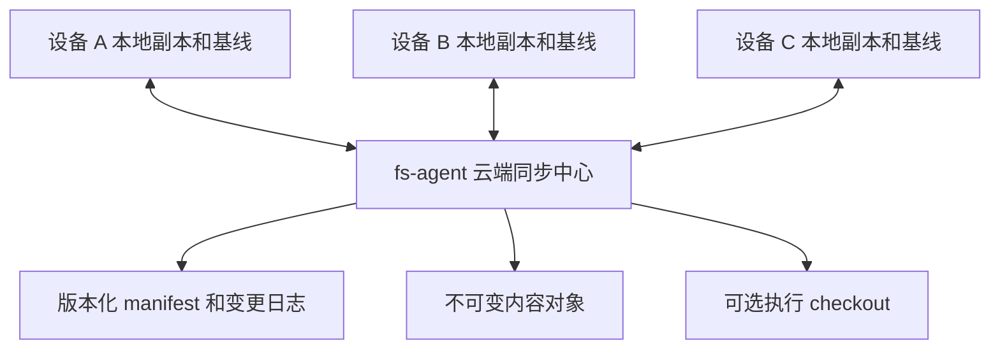

# 项目多端同步设计

状态：设计草案，2026-10-03。本文描述拟新增能力，不表示当前代码已实现。

本文面向 itookit 的 Web、Tauri、CLI 和 fs-agent 维护者。目标是让 fs-agent 提供类似云存储的作用：同一项目可以关联多个设备副本，设备离线修改后通过云端交换变化，同时保留冲突、删除和操作结果的明确语义。

核心决策是采用云端中心模型。fs-agent 持有经过条件发布的项目数据版本、不可变内容对象和变更日志；每台设备独立保存自己的同步基线。项目同步策略归 app-core，目录同步机制归独立同步核心，会话语义归 llm-session。远程挂载、目录同步、会话同步和执行权转移分别建模。

服务端优先实施，具体存储、事务、路由、恢复和测试计划见 [fs-agent 多端同步服务实施方案](fs-agent-sync.md)。其中的副本操作序号和通用对象包进一步细化本文协议草图；客户端按该明确契约接入。

服务端首版备份边界为数据集级历史及回收站恢复，并提供管理员停机灾备。历史窗口从旧版本被替代时起算；项目删除恢复与任意时间点项目 checkpoint 分别建模。发布同时检查项目生命周期 revision；云端灾备恢复后，客户端按新 historyEpoch 注册新副本并全量对账，不沿用旧操作序列。具体字段、接口和验收以服务端方案为准。

## 1 目标与范围

### 1.1 必须支持的场景

1. 设备 A 发布项目，设备 B 和 C 关联同一云端项目，在不同宿主目录或浏览器 VFS 中建立副本。
2. 任意设备上传或下载变化，其他设备通过增量拉取或全量对账发现这些变化。
3. 多台设备离线编辑后重新连接；非冲突变化可收敛，冲突不静默丢失。
4. 删除传播到其他设备；长期离线设备不能无提示地复活已经删除的资源。
5. 用户可以只同步目录，也可以增加会话历史、附件和项目组织信息。
6. 支持上传、下载、双向同步、镜像，以及明确选择来源的强制覆盖。
7. 同步过程中发生取消、断线或重启，可以确认提交结果并安全恢复。

### 1.2 首期边界

首期不实现设备间 P2P、多个云端之间的复制、实时协同编辑、跨设备运行中任务迁移或跨目录与会话的分布式事务。自动同步属于触发策略，必须建立在手动同步已经可靠的机制上。

普通远程挂载继续直接访问授权 export。未关联云端同步项目时，文件访问和远程执行不增加同步前置条件。同步中心可关闭执行能力，单独作为云存储运行。

## 2 当前代码基础

以下为当前工作树中的实现事实，后续章节均为设计要求。

| 当前代码 | 可复用基础及限制 |
| --- | --- |
| [ProjectService](../../packages/app-core/src/projects/project-service.ts) | 稳定项目 ID、目录绑定和项目视图；openFiles 会组合挂载，不能直接把该视图全部递归复制 |
| [ProjectRemoteMountService](../../packages/app-core/src/projects/remote-mounts.ts) | 连接、凭据引用、项目授权和可用状态；同步关系需要独立记录 |
| [SessionFilesService](../../packages/app-core/src/vfs/session-files.ts) | 授权 revision、cwd、派生视图撤销和挂载守卫；该 revision 不代表目录内容版本 |
| [HTTP capabilities](../../packages/vfsdriver-http/src/capabilities.ts) | 已有能力发现，sync 目前只有 push 布尔值且声明为 false |
| [HttpFSBackend](../../packages/vfsdriver-http/src/backend.ts) | 条件替换、Range 读取、操作结果查询；删除和重命名目前没有相同的版本条件 |
| [fs-agent revision](../../tools/fs-agent/src/fs/revision.rs) | 服务生命周期内的文件身份凭证，不能作为内容摘要；命令后会使凭证失效 |
| [fs-agent router](../../tools/fs-agent/src/http/mod.rs) | 当前文件和进程路由，没有本文提出的同步项目 API |
| [SessionBundle](../../packages/app-core/src/session/session-bundle.ts) | 格式版本、历史和附件交换；导入创建新身份，导出没有跨多个读取的快照边界 |
| [RoundGraphService](../../packages/llm-session/src/persistence/round-graph-service.ts) | 已有历史父引用和分支 head；输出、状态、执行引用及删除标记仍可原地更新，Round ID 不是不可变内容身份 |
| [SessionLeaseStore](../../packages/app-core/src/kernel/session-lease.ts) | 基于共享 SeqFile 事务的单写者租约；复制租约记录不能实现跨副本互斥 |
| [sync-server](../../apps/sync-server/src/routes/sync.ts) | 哈希及 mtime 比较、上传下载；缺少共同基线、项目分区和条件发布，不能直接充当多端一致性协议 |

现有执行边界见 [fs-agent 与 Harness](agent-server.md)，文件协议见 [HTTP 外挂文件系统](vfs-http-driver.md)，会话持久化见 [llm-session API](../llm-session-api.md)。本文新增独立同步协议，不改变已有文件接口的语义。

## 3 多端拓扑与身份



云端是已发布状态的权威来源，设备是可独立修改的副本。云端权威不意味着冲突时自动选择云端内容；本地未发布内容必须保留，冲突由策略处理。

### 3.1 身份模型

| 身份 | 含义 |
| --- | --- |
| authorityId | 云端同步存储的持久身份，独立于 endpoint 和进程启动 epoch |
| namespaceId | 账号或租户的数据与授权分区 |
| cloudProjectId | 云端项目的稳定身份 |
| localProjectId | 当前 MindOS 实例中的项目身份，通过绑定关联云端项目 |
| replicaId | 某个安装实例中某个项目副本的持久身份 |
| datasetId | 项目内的文件目录、某个会话或组织信息的数据集身份 |
| operationId | 一次发布操作的身份，绑定主体、请求内容和结果 |

多个设备可以有不同的 localProjectId，不能把本地 ID 相等作为项目合并依据。目录路径、项目名、会话标题和 endpoint 都不作为同步身份。

浏览器存储清空或克隆设备后必须创建新的 replicaId；不能复用旧副本身份和写入租约。凭据轮换不改变副本身份。云端存储恢复后若回退了版本历史，必须更换存储历史代次，拒绝旧 cursor 和旧发布条件；不得在同一历史身份下复用已签发版本。

### 3.2 副本绑定

绑定保存 authorityId、namespaceId、cloudProjectId、replicaId、当前设备的目录来源引用、所选数据集及同步策略。宿主绝对路径、credentialRef 和挂载授权是设备本地配置，不上传为可在其他设备执行的授权。

每个副本维护独立基线。设备 A 的成功同步不能更新设备 B 的基线，也不能表示设备 B 已经下载了数据。

设备 B 随时与云端已发布 head 对账，无需等待 A 的全部本地修改发布。A 尚未发布的修改只有 A 可见；A 随后连接时仍使用自己的基线。服务端执行 checkout 同样是一个工作副本，其变化发布后才对其他设备可见。

## 4 数据范围与一致性边界

### 4.1 数据集划分

| 数据集 | 内容 | 默认策略 |
| --- | --- | --- |
| files | 主项目目录的文件、空目录和受支持的文件元数据 | 首期支持，显式开启 |
| session | 单个会话的历史、分支、设置和附件 | 独立开启，不包含运行所有权 |
| organization | 项目名称、分组和已定义的导航引用 | 完整导航后续支持；最小会话成员目录与 session 同期交付 |
| definitions | 用户选择的 Flow、Agent、Skill 等定义 | 按依赖显式选择，凭据除外 |

额外挂载默认排除。用户选择额外挂载时，为其建立独立数据集和授权绑定，不从组合视图推断其属于主目录。只读参考目录不能因同步选择被提升权限。

会话分组目录是工作台组织关系，与主项目文件目录分别处理。不得通过扫描主项目目录猜测会话成员，也不得直接复制完整 MindOS profile。

不复制租约、凭据、进程句柄、临时运行目录和运行中 Kernel 状态。设备 UI 展开状态可以保留为本地状态；未来需要跨端共享时，采用独立且明确的覆盖规则。

### 4.2 原子性

云端必须支持单个数据集 manifest 的原子条件发布。不同数据集拥有独立 head，避免上传一个目录文件就使另一个会话的发布条件失效。

项目同步是多个数据集同步的编排，首期允许 files 成功而 session 冲突。UI 按数据集显示结果，不宣称整个项目具备事务原子性。

一个数据集内也可只发布独立且已解决的操作。云端该次 manifest 提交仍然原子，但未解决项保留云端原状及本地冲突记录；这不表示所有资源都已同步完成。

未来如需要“此会话引用这一版目录”，可新增不可变项目 checkpoint，引用各数据集的已发布 head。checkpoint 表示资源版本组合，不自动恢复运行环境，也不构成跨数据集写入事务。

## 5 模块划分与策略机制分离

| 模块 | 拟承担职责 | 禁止承担 |
| --- | --- | --- |
| app-core 的 projects/sync | 范围及覆盖语义、新会话纳入策略、同步关系、触发、守卫和数据集编排 | HTTP 实现、DOM 交互、直接递归复制所有挂载 |
| 新增 sync-core | 三方比较、局部计划、基线推进、传输、部分成功和恢复 | 项目导航、Session 业务、宿主路径、具体服务商 |
| 本地同步 store 及宿主适配 | 操作日志、基线对象、冲突、待应用结果、同副本串行协调 | 自行选择冲突赢家、隐式覆盖应用结果 |
| vfsdriver-http 的 sync 适配 | 云端协议、能力发现、对象传输和结果查询 | 决定冲突赢家、持有项目业务状态 |
| vfs-core | 文件访问、通用条件 IO 和必要的可选能力 | 项目同步调度、会话合并、云端账号模型 |
| llm-session | 快照闭包、历史对象版本、祖先判断、稳定分支去重和条件应用 | 云端 HTTP、项目同步触发和凭据管理 |
| app-core 的 session 用例 | 会话同步和目标端依赖绑定 | 直接覆盖原始存储文件来合并会话 |
| app-shell 和 CLI | 计划预览、用户决策、进度和本地化 | 无条件覆盖、绕过提交前校验 |
| fs-agent | 同步存储、授权、对象校验、条件发布、日志和操作恢复 | Agent 推理、项目冲突选择、Session 调度 |

sync-core 通过注入端口工作，可以依赖 vfs-core 的通用契约，不依赖 app-core、llm-session、UI 或具体 HTTP 驱动。HTTP 适配可以依赖 sync-core 的端点契约。app-core 负责装配，宿主差异通过端口注入。

项目策略采用 contracts、policy、service、store、adapters 分层。policy 无 I/O；service 只编排；store 管持久记录；runtime 只接线和管理生命周期。第一阶段可先实现为内部目录，但迁移成独立包时不能改变上述依赖方向。

目录端点与会话端点复用对象传输、发布结果及取消语义，不共享任意业务数据的通用合并器。会话历史必须交给会话协议验证，不能套用普通 JSON 文件覆盖。

长任务可以按实际需要接入 durable-kernel 的 effect 与 reconcile；同步核心本身不要求启动 LLM 或 Session，不另造一套应用任务调度器。

## 6 云端存储模型

### 6.1 内容对象与 manifest

内容对象以摘要标识，上传后不可修改。云端验证摘要、长度和授权范围；不能信任客户端声称的摘要。首期以整文件对象为单位，大文件分块作为后续扩展。

manifest 是某个数据集的完整逻辑状态。目录项包含规范相对路径、类型、对象摘要、大小及协议定义的元数据。目录项不包含宿主绝对路径。会话 manifest 引用会话协议对象，服务端可将其视为经过格式约束的存储对象，不理解 LLM 调度。

manifest 本身也作为对象上传，摘要基于协议规定的规范编码字节。publish 识别对象类型及格式版本，验证路径结构、引用闭包和预算后才更新 head；任意 blob 不能作为有效 manifest 发布。读取 manifest 的路由是同一不可变对象的受控读取入口，不另建一份可变内容。

每个数据集有持久 head 和递增 generation。generation 用不透明字符串传输，客户端不能依赖 JavaScript Number 自行加一；文件 HTTP revision、进程 epoch 和授权 revision 均不能替代它。

示意契约如下，所有类型为拟新增类型：

```ts
interface DatasetHead {
    authorityId: string;
    historyEpoch: string;
    datasetId: string;
    generation: string;
    manifestHash: string;
}

interface PublishRequest {
    operationId: string;
    replicaId: string;
    expectedHead: DatasetHead;
    nextManifestHash: string;
}

interface PublishReceipt {
    operationId: string;
    outcome: 'committed' | 'not-committed' | 'unknown';
    head?: DatasetHead;
    code?: string;
}
```

首个 head 通过独立的条件创建操作建立。发布新 manifest 前，引用的对象必须完整可读且归当前授权范围。head、变更日志和发布回执必须在同一持久提交边界内落地，或通过 journal 恢复出等价结果。

云端可以使用数据库和对象目录，也可以使用日志与快照；协议不依赖具体数据库。服务端正常重启不改变持久 authorityId、generation 或发布结果。

### 6.2 变更日志与 cursor

日志记录数据集版本提交、资源删除和必要的成员变化。通知只用于提示“有新版本”，客户端必须通过日志或 head 对账确认内容；丢失通知不影响正确性。

首版 changes 的粒度为数据集提交和成员生命周期事件：包含 sequence、datasetId、kind、previousHead、head，以及发生创建或删除时的成员信息。它不逐项携带文件变化；客户端读取固定 manifest 后比较资源，资源删除由前后 manifest 差异及保留的删除记录确认。

分页日志必须有固定上界或连续性保证。cursor 绑定 namespace、项目、历史代次与查询范围；过期返回明确的需要全量对账状态，不能悄悄从当前时刻开始。

需要分别保存三类进度：已发现的云端日志位置、已经应用到本地的资源版本、可以用于压缩日志的确认位置。发现某次提交不表示已经应用；尚有冲突或未处理范围时，不能推进统一应用基线。

下载设备确认某个位置时，必须已经保存足够的本地恢复信息。上传成功不代表其他设备已确认。设备长期离线不能永久阻止清理，具体处理见删除与保留策略。

首期承诺文件级增量对象传输：相同摘要的文件不重复上传，但单个文件修改后仍可能上传完整新文件。日志增量发现不等于 manifest 元数据细粒度增量，后者首期仍可能全量读取。文件内部块级增量另行扩展，会话对象粒度见第 11 节。

### 6.3 管理存储与执行目录

同步权威存储采用受管对象与 manifest，不能把任意可被外部进程修改的 export 目录直接声明为可靠云端版本库。

已有普通 export 可作为导入来源，或作为受管同步版本的 checkout。checkout 必须记录来源 head、目录身份和脏状态；外部修改使其成为待发布变化，不能偷偷改动已发布 manifest。

远端执行使用指定版本的 checkout。任务完成后，可以通过显式发布用例把结果提交回云端；期间其他设备发布了变化，结果回传仍需三方比较。执行失败、取消和网络断开均不等于 checkout 没有变化。

文件工具与 Bash 继续读取同一 checkout 和授权挂载。同步中心的不可变对象不直接当作进程工作目录。

## 7 客户端基线与三方比较

### 7.1 基线内容

每个副本按数据集和资源保存：上次确认的内容身份、删除状态、来源 head、过滤配置 revision，以及本地成功应用记录。基线只记录该副本实际确认的状态。

设 B 为该资源的共同基线，L 为当前本地，R 为最新云端状态。hash 判断内容相同，类型和受支持元数据也参与比较。mtime 和文件大小只能优化扫描，不能决定冲突胜负。

| L 和 R 相对 B 的变化 | 双向同步的处理 |
| --- | --- |
| 双方均未变化 | 无操作 |
| 仅 L 变化 | 生成待发布变化 |
| 仅 R 变化 | 生成待下载变化 |
| 双方变化但最终状态相同 | 更新确认基线，无需传输 |
| 双方变化且最终状态不同 | 冲突，保留两端内容 |
| 一端删除，另一端修改 | 删除与修改冲突 |
| 双方删除 | 确认删除，推进该资源基线 |

首次关联没有 B。双方不同必须选择初始化方式：从云端建立新副本、把本地发布为新云端项目，或对已有两端执行保守合并。没有基线的缺失不能被当成删除。

这里的冲突是差异分类，不意味着必须立即人工处理。文件集合中互不依赖的变化可以自动合并；同一文本满足大小、编码与基线可读条件时可尝试三方合并；会话使用领域历史合并，不能复用文本算法。文本自动合并成功只证明算法未检测到文本冲突，不证明代码或业务逻辑正确。

承诺三方文本合并的资源必须保留 B 的正文，不能只有摘要。默认由本地对象缓存固定当前基线正文；基线变化或取消此项能力后才解除保护。若基线正文确实不可获取，则显示该限制并提供两侧比较、采用一侧或保留两份，禁止冒充三方合并。

### 7.2 多端并发发布

设备 A 和 B 都以云端 head H0 规划，A 首先发布得到 H1。B 发布时 expectedHead 不匹配，服务端拒绝提交；B 拉取 H1，使用自己原有 B、当前 L 和新 R 重新规划。

如果 A 修改 a 文件、B 修改 b 文件，B 的新 manifest 必须包含 A 的 a 文件和 B 的 b 文件，不能再次提交旧的完整 manifest 覆盖 A。两台设备修改同一文件时进入冲突。

首期采用数据集级 head 条件，接受无冲突发布也可能重规划的开销。后续可增加资源级条件合并，但服务端仍需要验证完整结果，不能用“不同路径”绕过目录与文件类型冲突。

自动重规划限制次数并退避；持续竞争时提示稍后重试。冲突决策绑定预览时的两端版本，任何相关版本变化都使该决策过期。

### 7.3 部分范围和部分冲突

新 manifest 必须由本次固定读取的云端 manifest 加上本次允许提交的修改构建，不能用本地扫描结果替代整份云端 manifest。发布条件绑定这一云端 head；条件失败后重新读取并构建。

只同步 src 时继承云端 docs 的状态；某文件冲突时，在发布结果中继承其云端状态，并保留本地内容、原基线和冲突对象。独立无冲突项可继续上传下载。发布时继承的范围和未处理资源不推进本地基线。

目录删除与子项修改、重命名的来源与目标、文件目录类型转换等作为关联操作组。组内有冲突或能力不足时整个组阻塞，其他独立组可完成。UI 显示部分完成和剩余冲突数。

### 7.4 基线推进规则

本地存储分开记录 observedHead、每资源 baseline、publishedSnapshot 和 pendingApply；不提供用一个 lastSyncedHead 替代这些状态的写入接口。

| 结果 | 基线与后续处理 |
| --- | --- |
| 仅发现 head 或下载对象到暂存区 | 不推进 baseline |
| 上传对象但未发布 | 不推进 baseline |
| 下载目标已经确认应用 | 该资源 baseline 更新到应用的准确状态，来源记录固定 head |
| 从本地快照 P 发布成功 | 确认该资源曾有的 P，不采样当前文件充当 P；当前文件若为新编辑 P2，则 P2 仍是相对 P 的变化 |
| 合并结果 M 已发布但本地尚未应用 | 保存 publishedSnapshot 和 pendingApply；保留旧 baseline，先恢复应用再做该资源的新规划 |
| 云端 manifest 中仅继承的项 | 不因整份 manifest 发布成功而推进该项 baseline |
| 冲突未解决或发布结果 unknown | 保留原 baseline，固定相关对象；先解决冲突或确认结果 |
| 双方相同且读取版本经校验 | 更新该资源 baseline；随后出现的新编辑仍被识别为变化 |

P 表示从该资源本地稳定读取并捕获的状态；服务端合并生成、从未存在于本地的 M 不能套用 P 的规则。多个资源的 baseline 可以来自不同 head。每次推进同时持久化对应的操作确认，不能先把整个数据集标记为已应用。

## 8 同步流程与恢复

### 8.1 规划

1. 校验云端身份、当前授权、数据集范围和目标绑定。
2. 解析主目录真实来源，检查本地写权限、空间和当前运行状态。
3. 获取云端固定 head 与 manifest，读取本地基线。
4. 建立本地稳定扫描结果；没有快照时使用写入屏障或变化检测与重扫。
5. 进行三方比较，生成包含新增、修改、删除、冲突和预计字节数的计划。
6. 策略自动接受允许的操作，交互端只提交明确的冲突决策。

读取文件时如果变化导致摘要无法与扫描结果一致，标记该项不稳定并重扫。watch 事件只是加速脏状态发现，不能证明没有漏掉外部修改。

### 8.2 发布与下载

上传先传缺少的对象，再条件发布 manifest。对象已上传但 head 尚未提交，不算同步成功；未引用对象由保留与 GC 策略清理。

下载从固定 manifest 取得对象并校验，暂存后按本地目标条件应用。规划后本地又被编辑时拒绝覆盖。宿主不支持跨文件原子替换时，按项记录成功结果，保留部分完成状态；不能宣称整个目录已原子切换。

双向同步可以产生上传和下载两个阶段，必须分别记录提交边界，不能伪装为两端原子事务。任何阶段完成后仍可能出现新变化，状态应绑定最后对账的版本和时间。

### 8.3 幂等与取消

operationId 在发送发布请求前持久化。同一身份和请求的重试返回原结果；同一 ID 携带不同内容必须拒绝。响应丢失时先查询结果，不能创建新 ID 盲目发布。

回执保留时间与客户端恢复窗口必须通过能力或协议约定。回执过期后，以固定 manifest/head 对账确认当前内容；摘要相等可证明内容收敛，不能单独证明原请求曾经提交。无法证明原操作结果时保持 unknown，并重新规划，不能声称原操作未提交。

取消可停止扫描或对象传输。发布跨越提交边界后，取消不能撤销已经提交的 head。UI 分别显示“停止等待”“服务端取消已确认”“已提交”。

本地崩溃恢复读取操作记录，先核对云端回执和本地应用结果，再更新基线。部分成功不回滚其他设备的提交；恢复只处理本次未确认项。

### 8.4 本地应用日志与崩溃窗口

操作日志至少包含固定云端 head、范围 revision、逐项原基线和本地输入状态、计划目标对象、操作组、operationId、发布请求摘要与回执、逐项应用状态和冲突决策。日志引用的对象必须持久可读，不能只保留临时内存路径。

同一副本的恢复和同步写入串行协调，覆盖多个窗口及进程；仅有进程内 Promise 队列不够。重叠目录即使注册为不同副本，也需要共享应用守卫或拒绝这种绑定。同步锁不替代对编辑器、Agent 和外部文件写入的检测。

单项下载遵循：持久化应用意图和目标对象 → 校验本地前置状态 → 条件替换 → 确认替换持久化 → 在本地控制存储事务中同时记录应用回执及新 baseline。文件替换与控制存储不是同一事务时，宿主适配必须提供可恢复的 journal 或结果核对机制。

恢复按以下顺序执行：先确认已发送的发布结果，再核对待应用项，最后推进已确认项的 baseline 并开始普通对账。对待应用项：

- 当前完整状态等于计划输出，可确认收敛到该输出并推进 baseline；此后再与最新云端版本比较。
- 当前仍等于输入且可靠记录证明未开始替换或替换未提交，可按条件重试；若回执证明已经应用后又被用户改回，则保留这次编辑。已经开始替换但结果未知时，输入相等也不能排除“应用后改回”，应保留歧义。
- 当前与输入及输出均不同，有可靠应用回执时，以已应用输出作为 baseline 保留后续编辑；没有足够证据时保留全部内容并报告应用结果待确认。

仅提前写一条意图日志，不能证明文件已经替换。若替换后又发生外部写入且回执未落盘，不能推断该变化的先后关系。无法提供可靠 journal 的后端应声明这一恢复限制，保守处理歧义，不承诺任何情况下都无假冲突。

例如 baseline 中 b=0，下载 b=1 后、确认事务前崩溃，恢复看到 b=1 且计划目标也是 1，应先确认该次应用并把 b 的 baseline 推进到 1，再与云端 b=2 对账，从而按单侧云端变化下载 2。不能直接用旧 baseline=0 开始规划。

已发布的合并结果尚未应用而本地又有新编辑时，保留原本地输入、已发布结果与当前内容，先产生恢复决策；不能覆盖当前内容，也不能重复创建同一次合并提交。

## 9 同步模式与强制覆盖

同步配置分别保存 direction、deletionPolicy、conflictPolicy、scope 和 overwriteScope。overwriteScope 明确为仅选中冲突项或所选全部范围。触发方式单独保存为手动、定时、变更后或执行前准备。

| 模式 | 语义 |
| --- | --- |
| 上传 | 本地到云端；云端独有内容默认保留，云端变化仍可形成冲突 |
| 下载 | 云端到本地；本地独有内容默认保留，本地变化仍可形成冲突 |
| 双向 | 基于各副本的基线传播双方变化 |
| 本地镜像到云端 | 所选范围内以本地为来源，删除云端多余项 |
| 云端镜像到本地 | 所选范围内以云端为来源，删除本地多余项 |
| 冲突采用指定侧 | 仅对选中冲突项选本地或云端，其他项继续正常比较 |
| 用本地覆盖云端选中范围 | 所选范围内以本地存在项覆盖云端同名项，即使只有云端变化；目标独有项保留 |
| 用云端覆盖本地选中范围 | 对称覆盖当前副本，目标独有项保留 |

单向同步不等于无条件覆盖，强制覆盖不等于取消条件提交。冲突选择只改变选中项的赢家，范围覆盖还会替换目标单侧变化，镜像进一步删除目标独有项。三者都不绕过授权、身份、目标版本、忙时守卫、空间或完整性校验。冲突项本身是删除状态时，采用该状态也属于删除，必须出现在删除预览中。

本地覆盖或镜像到云端会改变云端已发布状态，其他设备后续可以拉取；预览必须明确项目、范围及删除数量。云端覆盖或镜像到本地只修改当前副本，不发布云端变化。采用一侧解决冲突的实际写入端由 direction 和计划决定；与方向不符时应显示该项跳过或要求显式改变方向，不能偷偷反向写入。其他设备的未发布修改仍由其各自基线保护。

首期默认保留目标独有项，删除需要明确策略。覆盖前保留可恢复版本；恢复旧版本通过新的条件发布完成，不回退历史 generation。

## 10 删除过滤与跨平台目录

### 10.1 删除传播和保留

日志记录删除 tombstone 及对应版本。在线副本确认后可以清理历史；长期离线副本超过保留窗口则标记过期，下次连接必须全量对账。

过期副本不能把所有本地存在项当成新建直接上传。对于缺少历史、无法判断是否曾被删除的项，保留本地内容并要求选择恢复、另存或放弃。首次初始化和基线丢失遵循同样规则。

删除文件夹需要比较整个受影响子树；删除与子项修改、文件与目录转换均属于冲突。重命名首期可以按删除加新增处理；推测重命名只能优化传输，不能减少冲突保护。

删除本地项目、副本解绑、删除云端项目是不同命令。解绑不删除云端数据。云端项目删除要求独立权限，进入可恢复状态，并让其他设备停止发布，而不是由普通目录清空推断。

### 10.2 范围过滤

同步规则独立于文件树展示过滤和工具发现规则。可以提供基于 gitignore 的同步预设，但必须明确规则来源和实际排除项。默认排除凭据及约定临时产物，用户可以检查规则。

排除项不参与镜像删除。过滤配置改变时建立新的范围 revision：新增纳入项需要初始化比较，移出范围的项保留双方内容和必要历史，不推断删除。每个副本可有不同范围，未选择的数据集或路径不能被其发布操作擦除。

### 10.3 文件系统差异

云端采用规范相对路径并声明命名语义；不通过统一转小写或静默 Unicode 归一化合并文件。目标端提前检查大小写、Unicode、保留名、路径长度和文件目录碰撞，无法表示则报告不可同步项。

首期只支持普通文件和目录，拒绝符号链接及特殊文件，不自动跟随链接。可执行位等元数据按目标能力声明处理；无法保存时显示降级，不宣称完整还原。ACL、owner、设备节点和宿主 inode 不作为可移植状态。

## 11 会话同步与执行所有权

### 11.1 会话历史协议

会话同步首先支持历史副本和安全接续，不同步运行中任务。会话数据集必须有稳定逻辑身份、格式版本、一致性快照、历史对象和附件引用、分支 head，以及依赖定义引用。

现有 SessionBundle 保持“导入为新会话”的语义。新增同步接口允许识别和条件应用已有副本，不能通过反复导入创建重复会话。

llm-session 定义封存历史对象及校验规则。只有明确不可变的对象才能按摘要去重；运行中的 round 必须等待封存或通过专门快照协议处理。分支 head、设置和组织信息作为可变引用采用条件更新。

首期以单个封存 Round 的可移植版本作为历史对象，附件与大内容使用独立对象引用，并规定每个对象上限；增加一个 Round 不重新上传所有历史正文。manifest 索引仍可能完整传输。超出上限的历史需要已定义的分段格式，否则明确拒绝，不能静默截断。

现有 RoundGraphService 允许输出、status、executions、删除和 stale 标记原地变化，因此封存必须是显式导出语义。同步对象使用 logicalRoundId、内容摘要和版本关系共同标识；同一 ID 不同内容不得简单去重。已封存内容再次被编辑时生成新对象版本，原对象保留；执行期字段与可移植正文的取舍由会话格式规定。

两个设备从同一历史继续对话时，保存为独立分支或设备分叉，再由用户选择当前分支。普通文本三方合并器不能合并会话 Round、工具结果或执行记录。

目标端验证所有引用可达，恢复父子会话和项目成员时使用稳定逻辑 ID。附件先完整上传，manifest 最后发布。缺少 Agent、Connection、Skill、Flow revision 或上下文对象时，可以显示历史并提示依赖缺失，禁止伪造完整可执行状态。

连接 ID 和权限属于本地绑定；目标端继续对话前重新选择连接及工作区授权。会话采用哪个文件 head 可以作为快照引用记录，引用不授予目录访问权。

### 11.2 最小会话成员目录

会话同步必须同时交付可枚举的数据集成员目录。每条包含 datasetId、kind、logicalSessionId、cloudProjectId、head、active/deleted 状态及成员 revision。它负责会话发现，完整分组、排序和导航仍属于 organization 的后续扩展。

首次发布会话时，数据集创建、首个 head、成员可见性、变更事件与回执在同一服务端持久提交边界内完成；只有对象完整的会话才进入可枚举目录。后续发布与成员中的 head 同步更新，删除以带条件的生命周期操作产生 tombstone。该元数据事务不要求同时提交项目文件或其他会话。

绑定保存会话选择模式：同步全部当前及未来会话，或只同步显式选择的稳定 ID。即使只选择部分，仍可以读取授权范围内的成员变化并显示新会话待选择。全量清单按固定 catalog revision 分页，并返回对接 changes 的 cursor；新变化从该位置继续读取，避免枚举与订阅之间漏掉新增。

### 11.3 重复同步与分叉

祖先关系以验证过的历史父引用和对象版本关系判断，不能只比较时间、标题、数组前缀或 logicalRoundId。缺少祖先对象时先补齐；无法补齐则保留双方并报告缺失依赖。同一 Round 的并发编辑属于版本冲突，不能通过合并对象集合自动选定一个版本。

| 历史关系 | 处理 |
| --- | --- |
| 两侧对象和引用相同 | 无操作，不增加会话或分支 |
| 本地引用是云端引用祖先 | 在目标引用版本未改变且方向允许时快进 |
| 云端引用是本地引用祖先 | 在方向允许时发布本地新增对象和引用 |
| 从共同祖先分叉 | 合并可验证对象集合，保留两个分支，不创建自动拼接对话的 merge Round |
| 同一分叉再次出现 | 更新或复用已有稳定分支，不再次创建副本 |
| 删除与追加并发 | 保留新增历史，产生删除与追加冲突 |

同步协议为分支分配稳定 refId，名称只是显示字段。设备第一次离线编辑某引用前持久化来源 refId、replicaId 和一次 forkId；该身份随发布保留。导入端按来源分叉身份映射目标 refId，重复拉取使用同一映射；此分叉的后续追加继续推进该 refId。重复发布还受 operationId 与 expectedHead 保护，不能每次按 branch-N 重新命名并创建。

标题及可移植设置按字段或不可拆分配置组做三方比较，单侧变化可应用、双侧不同进入冲突，禁止按时间最后写入覆盖。分支名与删除引用采用稳定 refId 和条件修改。currentBranch/currentHead 作为当前设备的选择保留本地，不因背景同步切换；显式“采用云端会话”才切换选中引用。

“采用云端会话”默认切换到选定云端分支，保留本地独有历史为可恢复分支。彻底删除分支及其不可达历史属于独立动作，遵守保留和并发条件，不能使用普通目录镜像实现。

### 11.4 接续验收

S4 必须分别证明历史可查看，以及受支持配置下历史、附件、上下文和定义依赖完整后能创建新的运行继续对话。只验证“依赖缺失时报错”不算通过接续验收。

导入的工具结果和执行引用仅作历史证据，不触发旧任务恢复。新设备接续创建新的运行及 effect 身份，不自动重放旧工具调用、未确认外部副作用或 pending execution。存在未完成运行的源会话按下一节处理。

### 11.5 租约边界

跨副本复制 SessionLeaseStore 记录不能保证排他运行。查看历史无需执行租约；离线继续只能产生独立分叉。

如后续提供“同一逻辑会话由单个设备接续”的模式，云端单独提供 owner、到期时间和单调 fencingToken。续租与过期判断使用服务端时间，任何受保护写入都必须验证 token。数据存储同步租约与会话执行所有权租约分别管理。

中心租约只能约束实际验证 token 的服务。若旧设备的本地 Kernel 或外部副作用不能被阻止，不能宣称已经完成执行权转移。首期不支持运行中任务接管；发现未结束任务时要求在原设备确认停止，或在新分叉中继续。

后续运行迁移必须单独设计 Kernel checkpoint、上下文可达闭包、effect reconcile、授权重建和旧执行者回收，不通过文件同步自动触发恢复。

## 12 运行期间同步与自动策略

项目内多个 Session、编辑器和外部进程都可能修改目录，不能只检查当前会话。app-core 注入项目级使用守卫，对下载替换、镜像删除、切换 checkout 和挂载重绑定执行忙时预检。

上传若有真实稳定快照可允许任务并行，否则等待写入屏障或检测变化后重新规划。下载和镜像需要取得与目标写入方协调的保护；无法阻止外部写入的宿主只能提供明确的降级保证，不能使用先 stat 再覆盖冒充强 CAS。

fs-agent 已有命令与文件访问互斥，可复用其机制，但整个同步提交边界必须受保护，不能只对每个 HTTP 请求分别加锁。

自动同步默认不自动解决冲突、不自动镜像删除、不接管执行所有权。断线重连先恢复未确认操作，再增量对账。执行前准备和结果回传是 app-core 的显式策略，失败时不能把文件工具和 Bash 指向不同版本的目录。

## 13 状态与用户提示

分别维护连接状态、内容状态、操作阶段和目标可写性，不能用单个 synced 布尔值代表所有状态。

| 维度 | 状态示例 |
| --- | --- |
| 连接 | online、offline、identity-changed、unauthorized |
| 内容 | unchecked、equal、local-changed、cloud-changed、both-changed、conflict |
| 操作 | idle、scanning、transferring、publishing、applying、partial、failed、unknown |
| 可写性 | writable、readonly、busy、grant-expired、replica-expired |

“已同步”仅表示所选范围在某次确认版本下相同，同时显示检查时间；新通知或本地变化立即使其过期。连接在线不能推导内容相同。

| 情况 | 提示与动作 |
| --- | --- |
| 双方修改同一文件 | 显示本地、云端和基线差异；选一侧、保留两份或文本三方合并 |
| 删除与修改冲突 | 明确选择删除或保留修改，不自动按时间决定 |
| 预览后版本变化 | 计划过期，重新扫描；强制决策同样过期 |
| 其他设备发布变化 | 提示云端更新，按当前副本基线重新规划 |
| 运行忙或未保存编辑 | 等待、排队、先保存或由用户停止相关任务 |
| 发布响应丢失 | 显示结果待确认，查询 operationId |
| 部分下载成功 | 列出完成、冲突及未执行项，保留恢复入口 |
| 副本或 cursor 过期 | 全量对账，并保护可能复活的旧本地内容 |
| 身份改变 | 停止自动同步，重新绑定，保留本地副本 |

冲突以独立记录保存相关基线、两端对象及决策版本，不把文本冲突标记写入二进制文件或会话对象。保留两份需要生成经过命名校验的目标路径或会话分支，并作为新变化发布。

错误从核心返回结构化 code、数据集、相对路径、阶段、可重试性和提交结果。中文及英文文案归 common，UI 不展示凭据或服务端宿主路径。

CLI 非交互模式默认停止需要选择的项，独立项可完成；输出结构化 completed、partial、conflict、unknown 或 failed。只有请求范围全部已确认完成才返回成功，其他结果返回非零并保留恢复记录。显式策略参数的含义与 UI 一致，不能把无交互理解为默认覆盖。

## 14 fs-agent 协议与能力

以下为拟议独立协议，路由命名可在实施时调整；不能把这些操作隐藏在现有 content 写入中。

| API | 作用 |
| --- | --- |
| GET /v1/sync/capabilities | 协议版本、存储身份、保证、限制与保留窗口 |
| POST /v1/sync/projects | 在当前 namespace 条件创建云端项目 |
| GET /v1/sync/projects | 枚举当前主体可见的云端项目 |
| POST /v1/sync/projects/:id/datasets | 条件创建数据集、首个 head 与成员记录，携带 operationId |
| GET /v1/sync/projects/:id/datasets | 固定 catalog revision 枚举成员，返回与 changes 对接的 cursor |
| GET /v1/sync/projects/:id/datasets/:dataset/head | 查询持久 head |
| GET /v1/sync/projects/:id/manifests/:hash | 读取固定 manifest |
| POST /v1/sync/projects/:id/objects/check | 检查当前授权范围内缺少的对象 |
| PUT /v1/sync/projects/:id/objects/:hash | 上传并验证不可变对象，含按规范编码的 manifest |
| GET /v1/sync/projects/:id/objects/:hash | 下载及有界 Range 读取 |
| POST /v1/sync/projects/:id/datasets/:dataset/publish | 条件发布 manifest |
| GET /v1/sync/projects/:id/changes | 按 cursor 拉取数据集 head 与成员生命周期事件 |
| POST /v1/sync/projects/:id/read-pins | 固定授权 manifest 闭包供下载，返回到期时间及释放续期句柄 |
| POST /v1/sync/projects/:id/replicas/:replica/ack | 确认恢复信息已落盘的进度 |
| GET /v1/sync/projects/:id/operations/:operation | 查询持久发布结果 |

取消、云端项目删除、版本恢复和副本注销通过显式命令扩展，不复用文件目录删除接口。首期手动全量对账仍需要 head、对象、条件发布和结果查询；增量日志开放后再声明 changes 能力。

sync 能力至少分别声明 read、publish、atomicManifest、changeFeed、historyRestore、operationRecovery，以及最大对象、manifest、批量预算和保留限制。会话所需条件由客户端根据这些存储能力及自己的会话协议判断，不能只凭 sync.push=true 自动开放所有模式。

read-pins 提供受配额约束的版本读取保留；创建时原子验证 manifest 及其闭包仍存在并登记 GC 根。续期与释放使用独立句柄命令，到期后返回明确的保留失效错误。单次读取已经开始时保持对象可读至该请求结束；跨多次请求不自动延长整个快照的保留期。

同步能力与 process.exec、terminal.pty 独立。具备文件 rw 权限不自动具备云端发布或项目删除权限。

旧服务器没有独立同步路由时保持原有 files-only/exec 行为。扩展 capabilities 的版本及兼容解析规则必须一起设计，旧客户端不能因新增字段而误认为已有同步保证。

## 15 安全配额与保留

所有项目、对象、manifest、日志、operation 和副本接口按认证主体及 namespace 授权。知道对象哈希不授予读取权；对象存在性检查不得泄露其他租户内容。物理去重可独立实施，逻辑授权和引用计费必须隔离。

服务端验证相对路径、规范编码、重复项、父子类型冲突、对象闭包和提交预算。复用现有安全目录解析，但云端存储目录由服务端管理，客户端不能提交任意宿主路径。

传输使用 HTTPS 或受控本地连接，凭据通过宿主 provider 注入。日志只记录主体引用、项目、operation、阶段、错误码和统计量，不记录凭据、正文或秘密路径。

配额覆盖项目数量、总逻辑字节、版本保留、暂存对象、manifest 大小、并发操作和下载预算。配额不足在发布前明确拒绝，不能发布引用缺失对象的 head。

GC 以已发布 manifest、保留历史、暂存上传保护、有效读取 pin 和未确认操作为根。对象上传与 GC 需要同一套保护机制，避免上传到发布之间对象被清理。删除云端项目先进入回收期，过期后才回收不可达内容。

客户端在下载旧 head 的对象前取得读取 pin；pin 生效期间新 head 发布或历史清理不能移除其闭包。pin 失效且旧对象已经清理时，明确提示快照过期，重新规划；不得用新 head 对象混填旧 manifest。保留期限有限，不能保证无限离线后仍可读任意旧版本。

本地 GC 固定三方合并基线正文、未解决冲突的 B/L/R 对象、待应用结果和恢复日志引用。冲突内容在创建冲突记录前持久化到本地，完成后可释放云端读取 pin，避免无限占用云端历史。空间不足时停止需要该保证的操作并明确提示，不能先清理基线再声称支持自动合并。解除冲突或推进基线后通过引用计数或可达性扫描回收旧对象。

同步服务单节点首期只允许一个持久版本权威，防止两个 fs-agent 实例各自签发 generation。多实例高可用需共享事务存储或一致的单写者机制，不能仅复用普通目录的 advisory lock 声称具备分布式一致性。

## 16 实施阶段与验收

| 阶段 | 交付边界 |
| --- | --- |
| S0 | 身份及端口；对象与 manifest、数据集目录、条件发布、持久回执和读取保留 |
| S1 | 主目录手动上传下载；独立资源基线、应用意图与崩溃恢复、文件级增量和冲突对象保留 |
| S2 | 多端双向文件同步、局部计划、删除、增量发现、cursor 过期、基线正文保留和可降级文本三方合并 |
| S3 | 明确范围覆盖、镜像及版本恢复、自动触发和跨平台能力检查 |
| S4 | 最小会话成员发现、Round 版本对象、分支去重、快照闭包；历史查看和成功创建新运行接续 |
| S5 | 按需求增加定义同步、执行 checkout 准备和显式结果回传 |

每阶段按实际能力开放入口，不能以协议草图替代真机验收。关键验收矩阵：

| 场景 | 必须满足的结果 |
| --- | --- |
| A 发布，B 与 C 下载 | 同一云端项目，不同本地绑定；基线分别推进 |
| A 与 B 从同一 head 修改不同文件 | 首次竞争发布被条件拒绝，重规划后同时保留双方修改 |
| A 与 B 修改同一文件，C 拉取 | 双方内容保留；C 只接收已发布版本，不替冲突设备作决定 |
| A 删除，B 离线修改，C 在线下载 | C 应用删除，B 重连进入删除与修改冲突 |
| B 超过保留窗口后重连 | cursor 明确过期，全量对账，不静默复活旧文件 |
| 上传后服务崩溃、发布响应丢失 | 回执和 head 可恢复，不重复发布，不丢日志 |
| 下载期间本地编辑、任务运行 | 条件拒绝或可靠协调，不覆盖新内容 |
| 强制覆盖预览后另一设备发布 | 原计划过期，重新取得用户决策适用的版本 |
| 镜像与过滤规则变化 | 排除范围不删除，新纳入项保守初始化 |
| 大小写碰撞、链接、特殊文件 | 预检拒绝或明确降级，不静默改名或跟随链接 |
| 同步期间取消和本地重启 | 准确区分已提交、未提交、部分完成和 unknown |
| 会话两端离线继续 | 保存独立分支，引用闭包完整，执行所有权不被复制 |
| 租户越权和对象哈希探测 | 不读取、不发布、不泄露其他 namespace 内容 |
| 云端备份恢复导致历史回退 | 历史代次变化，旧条件和 cursor 被拒绝 |
| 下载应用后、基线事务前崩溃，云端再次修改 | 先确认应用到的目标，再对账最新云端，不产生示例中的假冲突 |
| 替换后又发生外部编辑，但无可靠应用回执 | 保留当前文件及计划对象，报告恢复歧义，不猜测应用顺序 |
| 合并发布成功、本地应用前崩溃 | 找回固定发布结果，条件应用；不重复合并或覆盖后续本地编辑 |
| 上传快照期间本地再次编辑 | baseline 确认发布快照，新编辑保留为待同步变化 |
| 旧基线正文缺失 | 明确降级两侧比较或保留两份，不伪造三方合并 |
| 一项冲突，其他项无关 | 独立项完成，冲突项及原基线保留；父子关联组不拆分 |
| B 只选 src，A 更新 docs | B 的发布继承云端 docs，不擦除或回退未选范围 |
| A 新增会话，B 已绑定项目 | B 通过成员目录和事件发现，并按选择模式下载或提示 |
| 同一分叉多次同步及继续追加 | 映射到同一稳定分支，不重复创建会话或分支 |
| 同一 Round ID 被两端改成不同内容 | 检出版本冲突，不按 ID 去重丢弃内容 |
| 一端删除会话，另一端追加 | 保留追加历史并产生删除冲突 |
| 旧 head 下载期间发布新 head 并运行 GC | pin 有效时完成下载；过期后明确重规划 |
| 两个窗口或 CLI 同时同步同一副本 | 恢复与基线写入串行，不把另一操作的结果当作自身确认 |
| B 下载完整受支持会话后继续 | 创建新运行成功，旧工具副作用不被重放 |

测试层次包括纯策略与三方比较、端口契约、fs-agent 存储崩溃恢复、HTTP 客户端到服务端集成，以及 Web/Tauri/CLI 多副本验收。实施时同步更新包依赖守卫与相关活文档。

## 17 实施前需确定的参数

总体拓扑、模块边界、条件发布和副本基线按本文执行。下列参数在对应阶段确定，不阻塞职责拆分：

- 服务端持久存储采用数据库还是 journal，并证明 head、日志与回执的提交边界。
- tombstone、旧 manifest、操作回执和过期副本的保留窗口及管理员配置。
- 文件默认排除预设、可执行位支持和大文件对象预算。
- 会话快照所需上下文闭包及目标端可接续的最小依赖集合。
- 同步中心提供给普通远程文件浏览的只读版本视图，以及 checkout 的生命周期。

对这些参数的后续选择不能削弱本设计的共同基线、条件发布、结果确认和授权隔离要求。

## 18 项目目录布局与会话归属

### 18.1 项目数据边界

按项目同步需要明确项目拥有的数据，不要求所有数据现在就物理存储在主工作目录。逻辑 ProjectSpace 表达工作目录、项目元数据、会话成员及各自存储来源的集合；优先扩展已有解析端口，同步按这些来源生成数据集。它不是必须新增的另一套持久存储系统。

推荐把“项目数据容器”和“Agent 工作目录”分开。对于由 MindOS 管理的新项目，可以采用以下概念布局，实际路径由存储适配器决定：

```text
<project-space>/
├── workspace/                  用户项目文件，映射到 /workspace
└── .mindos/                    可移植项目数据
    ├── project.json            格式版本及稳定项目身份
    ├── organization.json       项目内成员与组织关系
    └── sessions/
        └── <logical-session-id>/
            ├── manifest.json   会话快照索引与分支引用
            ├── history/        已封存且通过验证的历史对象
            ├── attachments/    附件或对象引用
            └── dependencies.json
```

该布局为拟议的可移植格式，不是把现有 session.seq 原样移动后的结果。项目容器拥有会话数据，但默认进程挂载仅覆盖 workspace，因此会话历史不自动进入 Agent 可写范围。

对已有宿主目录项目，继续使用原授权目录作为 workspace。ProjectSpace 的控制数据可以存储在 MindOS 数据根，不能要求给只读目录或第三方仓库写入 .mindos 后才能关联和同步。

### 18.2 工作目录内的 mindos 目录

`<workspace>/.mindos/sessions/` 适用于“复制一个目录就能携带项目历史”的便携需求。使用复数 sessions，与当前多个会话模型一致。可提供显式的项目内便携快照模式，但默认不把它当成正在运行的唯一会话数据库。

| 方案 | 优点 | 约束及定位 |
| --- | --- | --- |
| 当前集中存储加逻辑项目映射 | 兼容现有数据根、只读项目和浏览器 | 通过领域导出收集项目内容，适合作为第一阶段 |
| ProjectSpace 中工作目录与控制数据分开 | 项目拥有完整数据，Agent 默认只访问工作目录 | 推荐的新项目数据模型，存储可逐步迁移 |
| workspace 内 .mindos 便携快照 | 目录复制、外部备份方便 | 显式可选模式，需要去重、保护和导入校验 |
| workspace 内 .mindos 作为直接运行存储 | 表面路径统一 | 首期不采用，需要完整记录后端、隔离与恢复重构 |

隐藏目录和 gitignore 不能阻止 Bash、Agent 或外部程序读取修改 .mindos。需要隔离时，把控制数据放到工作目录之外，或由真实挂载机制屏蔽并验证文件与进程侧权限；不能只让文件树隐藏它。

便携快照包含历史正文及附件，可能与公开代码仓库有不同的隐私范围。创建时应明确其内容和 Git 跟踪策略，默认不自动提交到 Git。只读项目和不支持隔离的宿主使用外部控制数据即可。

files 数据集必须排除受协议管理的 .mindos 子树，sessions 和 organization 由各自适配器处理。用户把它纳入普通文件同步时，应识别格式并转交项目导入流程，避免同一会话被普通目录同步和会话同步各处理一次。

### 18.3 当前存储不能直接靠目录复制迁移

当前 [Session 存储布局](../../packages/llm-session/src/persistence/session-storage-layout.ts) 将会话放在 MindOS 的 /var/lib/sessions 下，Kernel 记录位于该会话的 kernel 子目录。项目草稿和收藏位于 /var/lib/projects 下，成员关系在共享 folders.seq 中，SessionFilesService 还直接引用会话 session.seq 路径。

更关键的是 [LocalFSBackend](../../packages/vfsdriver-localfs/AGENTS.md) 将 SeqFile 记录和元数据放在 SQLite sidecar 中。目录里有 session.seq 并不代表完整记录就在该文件字节中；复制目录或单独复制某个 SQLite 文件都不是可移植会话协议。浏览器 IndexedDB 同样需要通过逻辑读取导出。

因此迁移必须使用领域级快照，并明确上下文和历史引用闭包。便携目录不能包含依赖宿主 SQLite、IndexedDB 或原 MindOS 数据根才能解释的隐藏引用。现有只读会话投影可复用展示思路，但多个读取仍需快照边界才能用于同步。

### 18.4 存储解析端口

新增项目数据源解析端口，返回 workspace 来源、项目元数据来源和会话数据集清单；新增会话存储定位端口，把稳定逻辑身份映射到本地记录存储、附件存储和执行存储。名称在实施时确定，不能与已有 Kernel storageResolver 职责重复。

调用方不拼接具体目录，llm-session 通过定位端口获取自己的存储，app-core 解析项目归属并装配端口，vfsdriver 只提供记录和文件能力。UI 导航路径变化不迁移数据；真正改变项目归属或存储位置走显式命令。

现有 Kernel SessionDirectoryStorageResolver 可适配新的定位结果，但仅改变 Kernel resolver 不足以迁移会话；repository、成员关系事务、SessionFilesService、附件和恢复扫描必须一起切换。

项目成员以稳定 projectId 与 logicalSessionId 关联，不只凭可重命名的分组路径前缀推断。共享全局索引可用于搜索及发现，逻辑上可从项目 manifest 重建；该索引不应成为复制某个项目时必须带走其他项目数据的原因。

没有项目归属的会话保留独立数据空间。会话跨项目移动需要选择“仅改变分组”还是“转移数据归属”；后者明确改变云端数据集授权与引用，不能当作普通文件夹 rename。

### 18.5 本地状态与可同步状态分开

replicaId、credentialRef、基线、cursor、操作恢复、缓存和运行租约保留在设备本地控制存储，不写入可同步的便携目录。可移植 project.json 只包含项目逻辑身份和格式信息，目标端重新关联本地副本。

便携快照必须记录 snapshotId、来源数据集 head 及格式版本。单向导出到快照目录时采用暂存和完整性标记；完成前不能让其他工具误认为是有效项目。手工修改快照后需要显式验证导入，不能与运行存储建立两个自动互相覆盖的权威。

两个设备复制同一个便携目录时共享逻辑项目身份，但建立不同的 replicaId；复制目录不复制执行所有权，也不共享宿主挂载授权。

### 18.6 迁移顺序

1. 先增加稳定项目归属和存储定位端口，默认仍解析到当前集中存储，不移动现有数据。
2. 同步由领域快照收集项目数据，先支持多端同步，不把目录重构作为前置条件。
3. 增加完整可移植格式和可选 .mindos 导入导出，验证 SQLite、IndexedDB 与 HTTP 来源得到等价数据。
4. 如需把新项目运行存储归入 ProjectSpace，先补全目标记录能力及事务边界，再迁移静止项目。
5. 迁移取得相关会话写入权并阻止新任务，写目标、验证引用、持久切换定位映射，重新核对恢复与视图，再回收旧存储。

迁移意图必须可恢复，失败时只能保留一个明确的当前权威，不能双写两个未经协调的根。云端逻辑身份不因设备本地路径迁移而改变。

新增验收包括：只读宿主项目可同步会话、移动或重命名项目不丢历史、普通文件镜像不覆盖会话控制数据、复制 .mindos 不复制副本与租约、sidecar 记录完整导出、迁移过程中重启可恢复，以及 Agent 删除 workspace 不删除会话存储。
