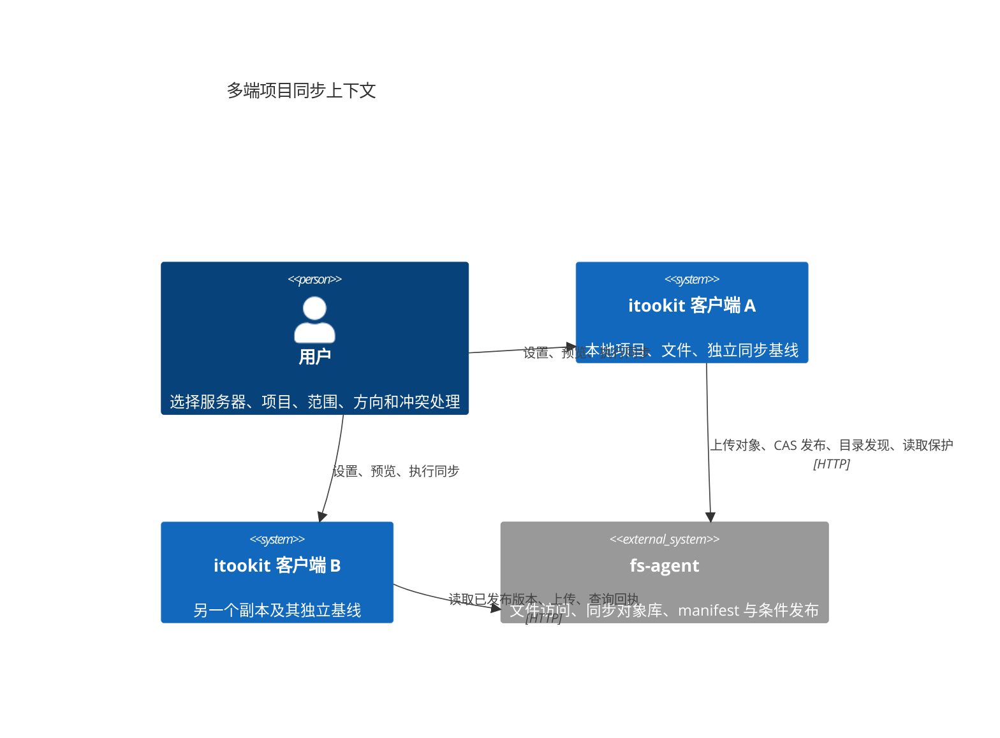
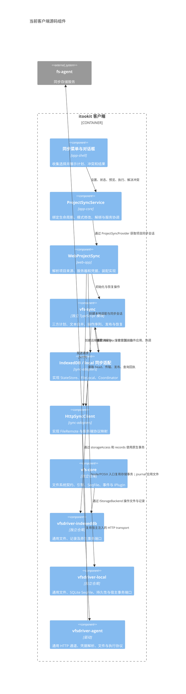
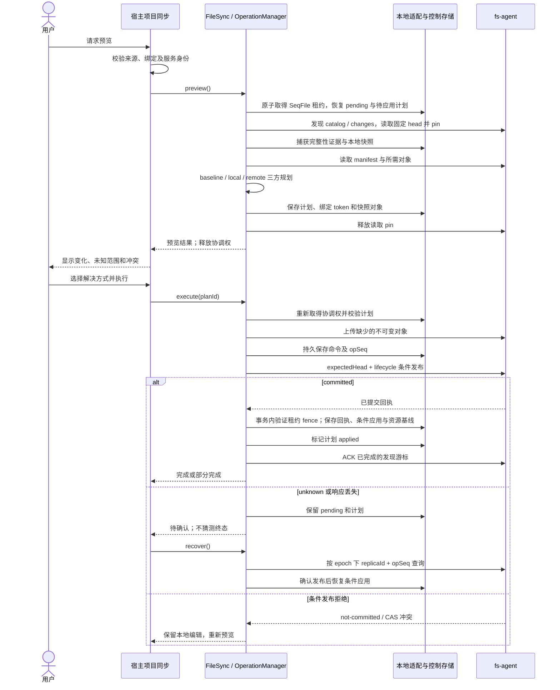
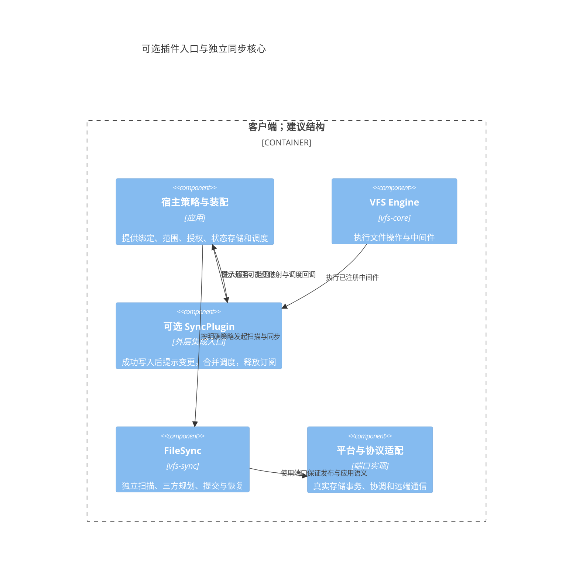

# 同步模块与 VFS 边界：独立核心与可选插件

本文依据当前 `vfs-sync`、`sync-adapters`、`vfs-core` 与 Web 项目同步装配代码分析。图中的可选插件是演进建议，当前尚未实现。

结论：保持 `vfs-sync` 为独立模块；保留端口适配职责。可以在外层提供 VFS 插件用于变更提示和生命周期接入，但不把同步正确性建立在文件中间件上。独立模块和插件入口可以同时存在。

## 1. 系统上下文

客户端只与服务器的已发布版本对账，不直接复制另一端未发布的工作目录。服务器的 export 文件访问与 sync 对象存储是不同能力；相同连接可以复用凭据。

## 2. 当前组件关系

这里用 C4 Component 表示源码组件；这些组件在同一客户端进程中运行，并非独立部署服务。实线表示调用或实现关系，不能直接当成 package.json 的依赖清单。

`vfs-sync` 不导入 `vfs-core`、IndexedDB、HTTP 驱动或应用模块。它定义自己的端口和同步模型，因此可用于没有 VFS 的宿主。`vfs-core` 也不导入同步模块；它定义存储接口，驱动实现这些接口。

`sync-adapters` 依赖 `vfs-sync` 和具体驱动，并为核心提供实现。当前 IndexedDB 适配直接使用已导出的 nodes/records/tags 存储契约，在同一事务中提交文件、基线和应用证据，并非通过普通 VFS read/write 拼出原子性。这是目前较强的耦合点，应通过公共端口与驱动升级回归约束。

宿主目前只装配受管 IndexedDB 文件同步。独立 local 驱动可用，不等于已经具有 local 同步适配；会话同步及安全接续仍需独立领域协议。

## 3. 策略与机制分别由谁负责

| 职责 | 当前归属 | 边界 |
|---|---|---|
| 本地项目、云端项目、服务器、凭据 | WebProjectSync / ProjectSyncService | 宿主知道项目身份和来源，核心不查 sidebar |
| 纳入范围、排除项、方向、传播删除 | 宿主传入 Scope 与 Binding | 核心校验并执行这些选择 |
| 三方比较、缺失证据、删除冲突、文本合并 | vfs-sync planner / mergeText | 确定的安全规则；不访问具体存储 |
| 用户选本地或云端、是否启用自动同步 | 宿主 UI 与策略 | 核心执行明确决策，不替用户决定 |
| opSeq、unknown、回执过期后的对账 | vfs-sync OperationManager | 协议算法，不以网络断开推定未提交 |
| manifest 编码、摘要、恢复流程 | vfs-sync | 可复用的同步机制 |
| 原子快照、条件应用、SeqFile 状态 | IndexedDB / local 同步适配 | 宿主存储能力；普通文件 API 无法保证 |
| IndexedDB 租约、事务内 fencing、浏览器保留状态 | IndexedDBSyncCoordinator / IndexedDBSyncStore | 具体平台机制；Web Locks 可显式选用 |
| HTTP 请求、对象传输、协议字段 | HttpSyncClient / agent transport | transport 不决定项目范围与合并策略 |
| 文件访问、事件、插件中间件 | vfs-core | 通用文件机制，不理解同步 baseline |

策略与机制已经分开，但并非每条策略都需要 trait。当前范围、方向和冲突决策可用普通数据表示。若将来增加自动同步、配额选择或会话纳入策略，应由宿主生成明确输入，避免在传输或驱动内部隐式决定。

## 4. 预览、执行与恢复的事件流

图示为正常有上传的路径；下载专用、无云端变更时无需发布。ACK 失败独立记录，不能否定已经完成的发布和应用。冲突未解决的项保留内容与原基线；其他独立项可完成。

跨窗口协调由适配实现持久租约，vfs-sync 仅传递守卫上下文；租约接管后，旧任务的本地写入由事务内 fencing 拒绝。接管者先恢复原 pending 身份，云端仍以 CAS 和回执约束发布。默认网页接入不要求 Web Locks。

远端发布和本地应用不是一个事务。正确性来自持久计划、准确回执、绑定身份与条件应用。预览阶段的远端 pin 在读取完成后释放，后续依赖已落本地缓存；缓存自身的保护与浏览器持久性仍需分别验证。

## 5. 插件能够承担什么

当前 `IPlugin` 提供操作中间件、init/dispose。其 init 没有宿主上下文参数，需要通过构造闭包注入依赖。中间件是文件调用链，不是持久变更日志。

插件可以在 `await next()` 成功后发出范围变更提示、合并重复提示、接入生命周期。不要在文件写入链中等待云端发布；本地成功写入应能离线完成。

插件不能单独发现其他窗口、外部进程或原生事务的修改；也不能仅凭事件缺失证明删除。它不提供本地与云端原子提交，不替代 baseline、操作日志、读保护、epoch 和 opSeq。

同步下载也会改本地内容。若通过 VFS 应用，插件需要明确的来源标记或自写抑制，避免同步循环；若直接使用原生事务，则要由适配提交后的宿主通知刷新视图。当前适配通过原生 IndexedDB 事务或 local journal 应用，不自动经过 VFS 插件链，事件刷新路径需要单独落实。

## 6. 为什么仍需要适配

| 方案 | 可行性与代价 |
|---|---|
| 只保留独立 vfs-sync + 注入端口 | 当前方案；便于测试、跨平台与独立发布 |
| 外层增加 VFS 插件入口 | 可选；改善自动触发，复用同一同步核心与适配 |
| vfs-sync 直接依赖 vfs-core | 可以做，但普通 VFS API 仍不提供所需原子能力，增加耦合收益有限 |
| 将完整同步机制放入 VFS 中间件 | 无法覆盖旁路写入和恢复，容易让文件操作受网络故障影响 |
| 删除适配，直接用通用 read/write | 不能兑现文件、基线、应用证据的同事务与条件替换保证 |

适配是职责，未必必须是单独 npm 包。小项目可把实现放宿主目录；可复用后端可以提供独立适配包。即使改叫 plugin，存储能力与协议映射的代码仍需要存在。

两个宿主共享 SeqControl、LeaseCoordinator、便携编解码、缓存和 FileLocal 编排；原生事务与文件 journal 保持不同实现。local 驱动只提供通用存储事务与持久性，不导入同步代码。

当前 `sync-adapters` 是 private 包，同时包含 Web IndexedDB、独立 Node/POSIX local 入口和 HTTP 协议实现。维护上可以先保持目录隔离；只有独立发布或宿主依赖负担确有需求时，再拆分入口或包，避免为了图中的方框增加抽象。

## 7. 演进建议与验收

1. 保持两个 core 无互相依赖；驱动不反向依赖同步策略。
2. 优先明确本地适配的快照、条件应用、缓存保护和提交后视图通知；local 已使用文件/SQLite journal 恢复，并保留无法确认的歧义，不能复用 IndexedDB 的原子承诺。
3. 自动同步确有需要时，再增加外层插件；注入项目服务与调度，不把项目绑定放入 vfs-core。
4. 会话同步保持 llm-session 领域适配，不能把普通文件事件当成历史分支协议。
5. 验收插件时证明离线写入可完成、原生/跨窗口修改仍靠扫描发现、同步自身不循环、解绑不应用旧计划、重启能恢复 unknown。

源码入口：

- [vfs-sync 公共 API](https://github.com/mushuanli/vfs-sync/blob/main/src/index.ts)、[FileSync](https://github.com/mushuanli/vfs-sync/blob/main/src/file-sync.ts)、[OperationManager](https://github.com/mushuanli/vfs-sync/blob/main/src/operations.ts)。
- [VFS 插件契约](https://github.com/mushuanli/vfs-core/blob/main/src/interfaces/plugin/plugin.ts)。
- [IndexedDB / local 同步适配](../../packages/sync-adapters/src/indexeddb/session.ts)、[控制存储](../../packages/sync-adapters/src/indexeddb/store.ts)、[HTTP 同步客户端](../../packages/sync-adapters/src/http/client.ts)。
- [项目同步服务](../../packages/app-core/src/projects/sync/service.ts)、[Web 装配](../../apps/web-app/src/sync.ts)。
- 更完整的客户端实施契约见 [项目同步设计](project-sync.md)。
