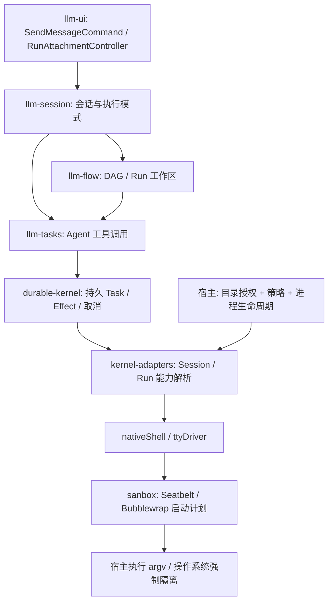

# 系统沙箱：Seatbelt / Bubblewrap 与执行链边界

## 结论与当前实现

系统沙箱属于**宿主进程能力层**。在创建 `nativeShell` / `ttyDriver` 时固定策略，在实际 spawn 前应用策略；由 `kernel-adapters` 按 Session / Run 提供这组能力。不要把操作系统沙箱实现放进 `llm-ui`、`llm-flow` 或 `durable-kernel`。

新增包 [packages/sanbox](../../packages/sanbox/README.md)，包名 `@itookit/sanbox` 沿用需求拼写。已提供：

- `SandboxPolicy`：只读目录、读写目录、默认拒绝的网络策略。
- `createSandboxLaunchPlan`：分别生成 Bubblewrap argv / Seatbelt SBPL 与 argv。
- `selectSandboxBackend`：Linux → Bubblewrap；macOS → Seatbelt；其他平台明确拒绝。
- Node 子入口 `prepareSandbox`：解析真实路径、固定授权快照、逐次验证 cwd、检查启动器。
- Node 子入口 `probeSandbox`：以同一策略实际运行 `/bin/sh`，确认隔离能启动。

桌面已完成实际接线：`session_shell_exec` → Tauri `session_bash::command` → `packages/sanbox/native` 的 `session_command` → Bubblewrap/Seatbelt。授权路径从 Rust 的目录句柄解析，网络由宿主固定为 deny；不接受前端生成的 profile/argv。TypeScript/Rust 共用 `src/runtime-policy.json`。现有执行模式中的 Bash 自动走此链路，无需新增 UI 开关；Flow 复用同一工厂和独立工作区授权。

CLI 仍使用原有 native/OCI 路径，桌面尚未提供持久 TTY 驱动；MCP 和父进程 VFS 不属于此 Bash 接线的覆盖范围。

## 已有链路与落点



| 层 | 应承担的职责 | 代码入口 |
|---|---|---|
| llm-ui | 提交执行请求、展示生效策略/错误/审批；配置请求必须经宿主核验 | [SendMessageCommand](../../packages/llm-ui/src/commands/SendMessageCommand.ts)、[ExecutionModeControl](../../packages/llm-ui/src/components/input/ExecutionModeControl.ts) |
| llm-session / llm-flow | 保存执行意图，选择持久 Run 工作区身份；节点只可在宿主授权上收窄权限 | [create-kernel-runtime](../../packages/app-core/src/runtime/create-kernel-runtime.ts) 中工作区作用域装配 |
| durable-kernel | Effect 调度、授权记录、审批、取消确认、恢复；通过端口依赖外部能力 | [BashEffectAdapter](../../packages/kernel-adapters/src/effects/bash-effect.ts) 实现 `process.exec` 外部能力 |
| kernel-adapters | 为 Effect 解析 Session/Run 能力；Bash、shell_session/tty_write 共用作用域 | [create-kernel-adapters-runtime](../../packages/kernel-adapters/src/runtime/create-kernel-adapters-runtime.ts) |
| app-core | 平台无关装配：`createSessionProcesses`、`fileContextForScope`，释放时先停进程后放开文件 | [session-process-context](../../packages/app-core/src/vfs/session-process-context.ts)、[workspace-process-context](../../packages/app-core/src/vfs/workspace-process-context.ts) |
| CLI / Tauri 宿主 | 验证原生目录授权、选择后端、探测、启动、管理进程树 | [CLI shell](../../apps/cli/src/shell.ts)、[Tauri session-bash](../../apps/tauri-app/src/shell/session-bash.ts) |
| sanbox | 将已验证策略编译为底层沙箱参数；保持无 UI / Kernel / Flow 依赖 | [公共入口](../../packages/sanbox/src/index.ts)、[Node 入口](../../packages/sanbox/src/node.ts) |

既有 CLI 使用 OCI（Podman/Docker）或显式 native 模式，并已有 `OciSandboxShell` / `OciTtyDriver`。Tauri 的 [Rust session_bash](../../apps/tauri-app/src-tauri/src/session_bash.rs) 现在仅保留宿主策略和回归测试，实际参数交由本包 [Rust 入口](../../packages/sanbox/native/src/lib.rs) 创建。相比原实现，新增默认网络隔离与 macOS Seatbelt 分支，并保留 Linux 虚拟挂载、流式输出、超时和取消语义。

## 与现有 OCI 的比较及证据

| 维度 | 现有 CLI OCI | 新包 Bubblewrap |
|---|---|---|
| 系统依赖 | Podman 或 Docker，并需可用镜像 | `bwrap` 与允许相关 namespace 的 Linux 内核 |
| 程序环境 | 由镜像固定工具及版本，便于复现 | 直接使用宿主基础程序，依赖目录由宿主开放 |
| 成本 | 需构建/存储镜像；单次命令启动一个容器 | 无镜像管理，直接启动受限进程 |
| 目录映射 | 已支持宿主目录映射到 `/workspace` 等虚拟路径 | TypeScript 入口保持原生路径；Rust 桌面入口支持虚拟挂载 |
| 资源限制 | 已构造 PID 上限，以及可选 CPU/内存限制参数 | 新包尚无 CPU/内存/PID 限额 |
| 生命周期 | 还需实测引擎客户端退出后容器及后代确实停止 | 仍需宿主管理进程与退出确认 |

本项目 OCI 不要求必须有 Docker：`sandboxDoctor('auto')` 按 Podman → Docker 顺序探测。默认镜像 `mindos-sandbox:v1` 的构建文件在 [Dockerfile](../../apps/cli/sandbox/Dockerfile)。当前 doctor 只调用 `version --format '{{.Client.Version}}'`，不验证镜像存在或真正运行容器；探测通过不足以证明执行可用。

OCI 不是未引用的占位类：[CLI runtime](../../apps/cli/src/runtime.ts) 调用 `createShell`，把 `OciSandboxShell` 注入 Bash 能力，并为交互命令创建 `OciTtyDriver`，二者实际调用容器引擎的 `run`。但 [历史验收记录第 59–60 节](../minimal-system-acceptance.md) 明确只证明参数/授权/路径构造正确，没有真实容器端到端证据。本次复核 PATH 中同样未找到 `docker` 或 `podman`，旧 shell 测试 11 项通过，仍不能替代容器验收。

此外，[快捷 prompt 装配](../../apps/cli/src/commands.ts) 默认配置 `sandbox.mode: native`，多个示例也显式选择 native；只有省略该配置的工作流默认采用 OCI。`native` 的 cwd 检查不是操作系统沙箱，不能限制任意 shell 脚本访问宿主其他路径。桌面端既有隔离来自 Rust Bubblewrap，并非 CLI OCI。

桌面已将 Seatbelt/Bubblewrap 用作 Bash 执行后端，将 OCI 保留为需要固定 Linux 工具链、镜像环境和资源限额的可选后端；不能因为新增包就自动扩大现有原生执行路径的隔离声明。

## llm-ui 应该增加什么

`ExecutionModeControl` 的「对话/执行」只选择工具执行意图，不等于操作系统隔离等级。不要把「执行模式」标成「沙箱已启用」。

适合在 [WorkspaceDirectoryMenu](../../packages/llm-ui/src/shell/WorkspaceDirectoryMenu.ts) 所调用的**宿主工作目录配置**中加入沙箱配置入口，并在输入区附近展示宿主回传的实际状态：后端、目录权限、网络状态、不可用原因。UI 不生成路径授权、不自己调用系统二进制、不用前端布尔值跳过隔离。

`TtyController` / `TtyPanel` 继续只消费输出与控制请求；限制必须覆盖创建持久 TTY 的 `ttyDriver.spawn`。仅包装 Bash / `process.exec` 会遗漏 `shell_session`。审批只允许某次动作，不自动解除目录与网络限制。

Flow 编辑器若以后允许节点选择策略，应保存版本化策略引用或收窄请求；宿主计算有效权限，子节点不得扩大父 Run 权限。当前包尚不引入此持久配置协议。

## 宿主接入顺序

1. 从 Session 的目录授权取得原生路径，映射虚拟 cwd，核验授权 revision；由可信配置确定 network。
2. 在 `ApplicationKernelPlatform.createSessionProcesses` 创建策略快照与两类驱动。Node 使用 `prepareSandbox` 并在作用域建立时 `probeSandbox`；每次启动通过 `wrap` 获取 argv。已有 runner 负责超时、流式输出、取消和关闭确认。
3. TTY 启动应用同一策略，后续写入自然继承原进程沙箱。驱动不能把模型 env 合并给外层启动器；当前 `NodePtyDriver` / `NodeTTYDriver` 会合并宿主环境，接入前必须提供替换环境的执行入口或调整驱动契约。
4. Flow 独立工作区通过 `scopeForEffect` / `fileContextForScope` 配对文件视图与进程授权；沿用 `acquireWorkspaceProcessContext` 的 revision 检查与清理顺序。不得按全局项目根创建一个通用沙箱供所有 Run 共享。
5. 关闭或撤销作用域时，先取消并等待全部 Bash/TTY/子进程停止，再释放目录与临时文件。新模块不替代现有 `EffectAdapter.cancel` 的停止确认契约。
6. 恢复时依据持久身份与**当前仍有效**授权重新取得能力；策略缺失、目录变更、后端不可用时拒绝恢复执行，不能使用旧内存对象或降级原生 shell。

Seatbelt 没有 Linux mount namespace 的目录重映射能力。TypeScript 入口两后端都使用真实绝对路径；Rust 桌面入口在 Linux 继续支持 `source → /workspace` 映射，在 macOS 根据最长匹配挂载解析真实 cwd，并检查符号链接没有越界。macOS Bash 可使用当前目录相对路径或实际原生路径，但脚本中的 `/workspace/...` 字面量不能自动工作；不能通过字符串替换 shell 脚本伪造路径映射。

Tauri WebView 不运行 Node，因此桌面通过 Cargo path dependency 使用包内 Rust crate；前端无需引入 Node 入口。Rust 从授权句柄重新取得并验证目录和 cwd，网络策略由宿主固定，不接收前端任意 profile/argv。macOS 分支已实现并测试配置生成，但实际策略兼容性和进程清理仍需 macOS 实机验证。

## 权限语义与限制

默认关闭网络；只给显式目录以及基础系统运行文件读权限，写权限限于显式读写目录。Linux 另有沙箱私有 `/tmp`、`/proc`、最小 `/dev`。Seatbelt 允许读取文件元数据以供路径解析，但未授权路径的文件内容仍被禁止；macOS 临时写入需授予专用目录，不开放整个共享 `/tmp`。

纯编译器只校验路径形状，Node 入口进一步 realpath；它们不建立授权。授权根及其父目录在准备到启动期间必须由可信宿主管理，不能允许其他并发执行替换目录。跨进程竞争的句柄固定、挂载撤销、硬链接等问题仍需要宿主的目录授权机制和工作区隔离处理。

Bubblewrap 网络命名空间不等于对所有宿主 IPC 的过滤。授权目录若含 Docker/D-Bus 等宿主服务 socket，会把这些能力暴露给子进程；宿主不能把此类目录当作普通工程输入。当前实现没有 seccomp 过滤、CPU/内存/PID 资源限额或网络域名代理；Seatbelt 也不提供 PID namespace。两种后端不承诺完全相同的内核级隔离能力。

MCP stdio server 必须在其**服务进程创建处**单独应用沙箱；仅包住 Agent 的 Bash 不会隔离已在宿主运行的 MCP。远程 HTTP MCP 和模型请求由宿主连接管理，不受子进程网络开关控制。VFS 内置 Read/Write 仍依赖 VFS 授权视图，系统沙箱不会自动拦截父进程里的文件操作。

实现参考：[Bubblewrap 官方说明](https://github.com/containers/bubblewrap)、[Bubblewrap 参数定义](https://github.com/containers/bubblewrap/blob/main/bwrap.xml)、[Chromium Seatbelt 设计](https://chromium.googlesource.com/chromium/src/+/main/sandbox/mac/seatbelt_sandbox_design.md)。Bubblewrap 的限制由调用者配置决定；Seatbelt 是按进程施加的系统访问策略，两者均需宿主正确装配。

## 验证

```bash
pnpm --filter @itookit/sanbox test
pnpm --filter @itookit/sanbox typecheck
pnpm --filter @itookit/sanbox build
SANBOX_TEST_NATIVE=1 pnpm --filter @itookit/sanbox test
pnpm --filter tauri-app test:rust
pnpm docs:check
```

普通测试覆盖后端选择、默认网络限制、argv/SBPL 转义、环境隔离、授权冲突、符号链接 cwd 越界、策略快照及不可用错误。原生测试需显式开启，实际验证授权写入、越界读写拒绝、子 shell 继承限制与 Linux 网络 namespace；开启后任何启动失败都使测试失败。Seatbelt 的配置生成可在 Linux 测试，真正的策略兼容性与隔离必须在 macOS 运行原生用例确认。


### 已完成的桌面验证

2026-09-22：Rust 包 6 项、Tauri 46 项与 app-shell 相关 30 项回归通过。真实 Tauri WebView 中使用模拟模型发起 Bash，经生产 Session/Kernel/IPC 链执行新沙箱，返回 `[exit 0] SANBOX_PROBE_PASS`，HistoryView 展示相同结果；实际验证目录边界、网络/mount/PID namespace、环境变量与子 shell 隔离。证据范围和未覆盖平台见 [桌面验收记录](../minimal-system-acceptance.md)。

开发版重新启动后，在 Linux 桌面会话选择工作目录、切换「执行」、使用允许 Bash 的 Agent，发送“请实际调用 Bash 执行 pwd 和 ls，并报告工具原始输出”即可触发此模块。此 prompt 只证明执行链可用；隔离验证需另准备宿主外部 marker，并比较 namespace、核对宿主文件结果，不能以模型自述作为证据。
