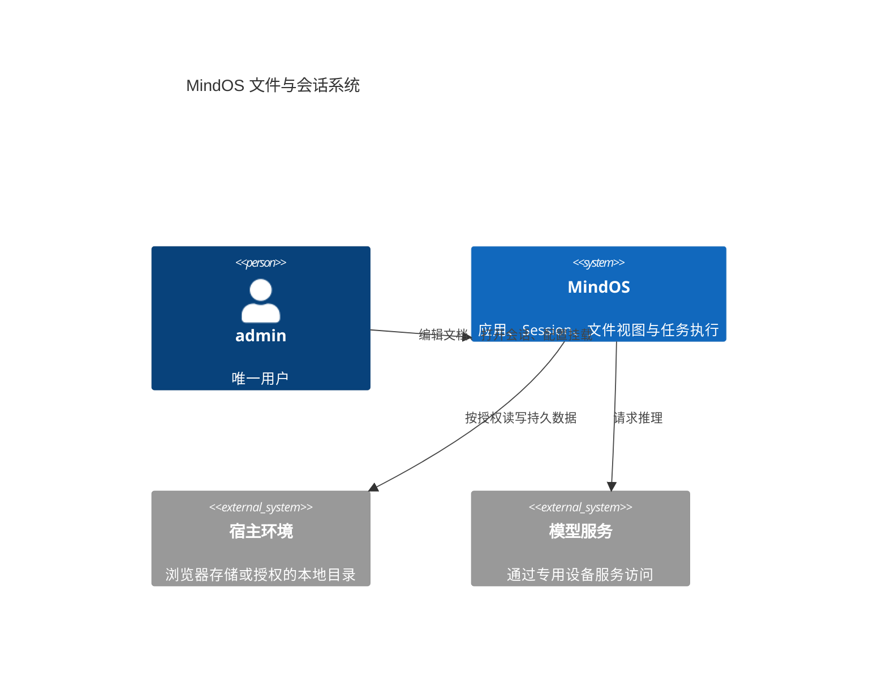
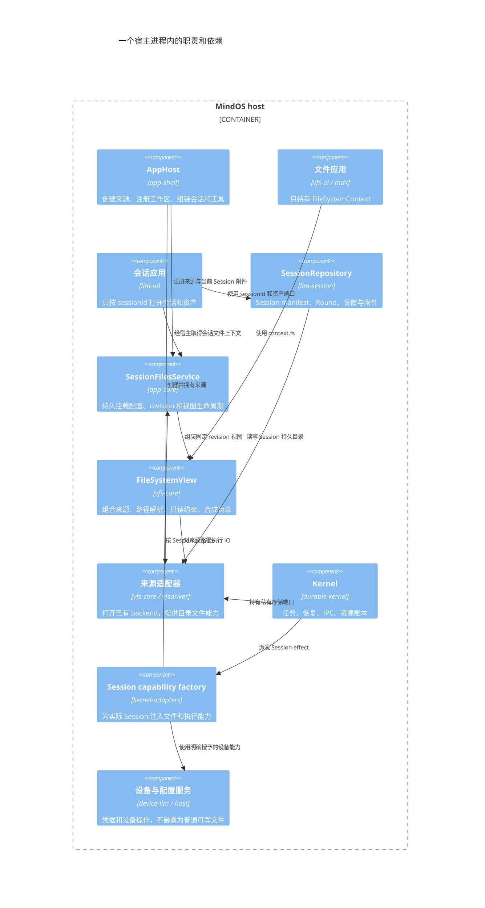
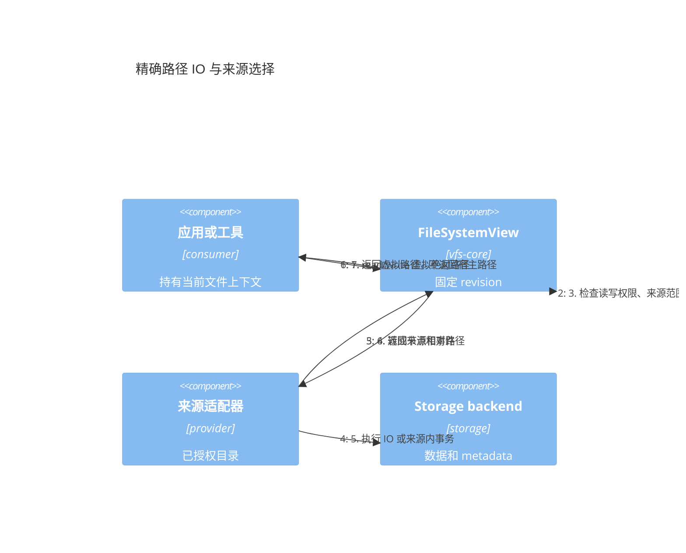
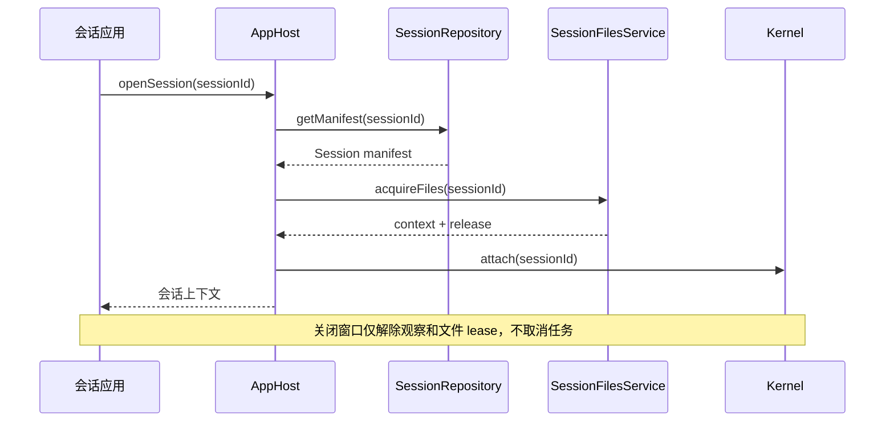
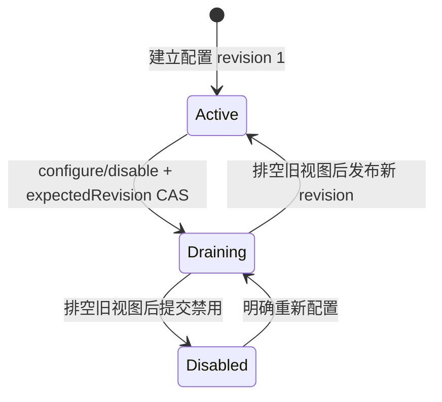

# VFS 与 Session：最终结构、C4 和接口审查

日期：2026-09-09。本文件是当前重构规范；旧设计文档仅保留历史背景。实现证据见 [验证状态](vfs-implementation-status.md)。

## 1. 结论和数据组织

采用单用户 `admin`。`[mindos]` 表示应用打开的文件系统根，不是内层目录名。Session 是业务实体，history 和 attachments 都属于 Session；SessionFS 是运行时组合视图，不是第二份数据。通用映射器属于 `vfs-core`，Session 仓库属于 `llm-session`，持久挂载配置及来源组装属于 `app-core`（`packages/app-core/src/vfs/session-files.ts`、`packages/app-core/src/vfs/directory-mounts.ts`）；`app-shell` 只做装配与兼容 re-export。

```text
[mindos]/
  etc/                            系统配置；原始凭据只由专用服务访问
  var/lib/
    kernel/                       全局 catalog、跨 Session IPC、资源账本
      local-sources/             宿主授权来源登记
        session-directories.json  Session 目录来源与默认目录偏好
    sessions/
      folders.seq                 Session 文件夹索引（跨 Session）
      <sessionId>/
        session.seq               session 元信息、settings、files 挂载配置
        history.seq               history DAG 索引、Round、context profile 记录
        attachments/              二进制和用户上传内容
        kernel/                   该 Session 的 task/journal/mailbox/执行记录
  run/                            内存来源，端点及可重建状态
  dev/                            宿主设备入口
  home/admin/
    chats/                        用户保存或导出的聊天文档
    notes/
    projects/
    .config/<app>/                用户级应用配置
```

`session.seq/history.seq` 是逻辑记录文件，`/var/lib/sessions/folders.seq` 同样承载文件夹记录（`packages/llm-session/src/persistence/session-repository.ts`）。IndexedDB 使用记录表，LocalFS 使用对应 sidecar SQLite；不能把空的物理 `.seq` 文件单独复制当成完整备份。LocalFS 的 `_meta/_db/meta` 是后端索引侧车，不是 Session 可见目录。

没有 `conversation/`、`/etc/mindos`、`/var/lib/mindos` 或预留的 `/var/lib/files`。可靠恢复所需的任务和 IPC 数据留在 `/var/lib`；移入 `/run` 会丢失重启恢复能力。

Session 用户文件视图默认只有：

```text
/attachments/    -> 当前 Session 的 attachments，读写
```

显式挂载默认目录后增加 `/workspace`，其他目录使用所选挂载名称；没有自动 `/home/admin` 授权，也没有系统或 history 文件投影。历史经 Repository/Kernel 业务接口访问。应用宿主可使用通用映射器组合其他来源，但 Session 的用户挂载限根下一层并禁止保留名称。其他 Session 的文件须先取得受限上下文再由宿主注册并授权；知道 sessionId 不构成授权。

[挂载实现规范](vfs-session-mount-access.md) 声明 UI、slash、配置和平台接口。来源支持 IndexedDB、子目录、其他受限视图及 Tauri 授权宿主目录；通用能力属于 vfs-core，Session 策略由 `app-core/files` 管理（`app-shell` 仅装配与 re-export）。

## 2. C4：系统上下文



## 3. 进程内组件



## 4. 部署与持久性

```mermaid
C4Deployment
  title 同一虚拟路径模型用于浏览器和桌面
  Deployment_Node(host, "MindOS host", "单用户 admin") {
    Container(app, "应用进程", "TypeScript", "组装应用视图和 Session 视图")
    Deployment_Node(root, "[mindos] 根来源", "IndexedDB 或本地 backend") {
      ContainerDb(etc, "/etc", "配置存储", "系统配置；凭据经专用服务")
      ContainerDb(sessions, "/var/lib/sessions", "持久数据", "各 Session 的 session.seq、history.seq、attachments、kernel")
      ContainerDb(kernel, "/var/lib/kernel", "持久数据", "catalog、跨 Session IPC、宿主来源登记与资源账本")
      ContainerDb(home, "/home/admin", "用户文档", "chats、notes、projects 和用户级应用配置")
    }
    Container(run, "/run", "易失来源", "端点、状态投影、可重建数据")
    Container(dev, "/dev", "设备投影", "设备端点，操作经 capability registry")
    ContainerDb(external, "授权宿主目录", "LocalFS backend", "作为独立来源，不改变全局根挂载")
  }
  Rel(app, root, "读取授权的目录能力")
  Rel(app, run, "读写运行时状态")
  Rel(app, dev, "调用设备")
  Rel(app, external, "组装到应用或 Session 视图")
```

## 5. 精确路径 IO



## 6. 打开会话



## 7. 挂载配置状态机



记录状态只有 `'active' | 'draining' | 'disabled'`（`FilesRecord.state`）。崩溃在 draining 阶段时记录保持 `draining`，重启后访问报 `EBUSY`，只有宿主显式 `configure` 才恢复。

## 8. 实际接口与调用方式

以下对应已实现接口，不再列出未实现的伪类型。完整定义见 [文件接口](../../packages/vfs-core/src/interfaces/services/file-system.ts)、[视图](../../packages/vfs-core/src/impl/services/FileSystemView.ts)、[Session 仓库](../../packages/llm-session/src/persistence/types.ts)、[挂载服务](../../packages/app-core/src/vfs/session-files.ts)、[编辑器](../../packages/ui-common/src/interfaces/IEditor.ts)。

```ts
interface FileSystemContext {
  readonly fs: IFileSystem;
  readonly cwd: string;
  readonly sessionId?: string;
}
interface FileSystemContextOwner {
  readonly context: FileSystemContext;
  release(): Promise<void>;
}
interface FileSystemMount {
  mountId: string;
  at: string;
  fs: IFileSystem;
  root?: string;
  access: 'ro' | 'rw';
}
// 返回 FileSystemView 实例（实现 IFileSystem，拥有 dispose）。
createFileSystemView({ viewId, revision, mounts, readablePaths });
// 返回 { fs: IFileSystem, dispose(): Promise<void> }。
await createFileSystemSource({ backend, viewId, access });

// SessionFilesService：宿主注册已打开的来源，不解析任意宿主路径。
files.registerSource(sourceId, sourceFs);
await files.configure(sessionId, { mounts: [{ mountId, at, sourceId, root, access }], cwd: '/workspace' }, expectedRevision);
const owner = await files.acquireFiles(sessionId, '/workspace');
await owner.context.fs.driver.readContent('/workspace/notes/example.md');
await owner.release();
await files.disable(sessionId, expectedRevision);

// ISessionRepository：业务读写与文件投影分离。
const sessionId = await repository.createSession(title);
await repository.getManifest(sessionId);
await repository.list();
await repository.updateManifest(sessionId, patch);
await repository.getSessionSettings(sessionId);
await repository.saveSessionSettings(sessionId, settingsPatch);
await repository.readDocument(sessionId, 'round-example.json');
await repository.writeDocument(sessionId, 'round-example.json', json);
await repository.listHistory(sessionId);
await repository.writeAttachment(sessionId, name, arrayBuffer);
const attachments = await repository.openAttachments(sessionId);
await attachments.dispose();

// 文件、会话、实体显式区分；草稿可不传 target。
type EditorTarget =
  | { kind: 'file'; path: string; namespaceId?: string; sessionId?: string }
  | { kind: 'session'; sessionId: string; branch?: string }
  | { kind: 'entity'; entityType: 'agent' | 'skill' | 'flow'; id: string };
interface EditorOptions {
  target?: EditorTarget;
  files?: FileSystemContext;
  assets?: IFileSystem; // 显式附件根，独立于文档路径
  // 其他 UI 参数沿用源码。
}
await sessionManager.bindSession(sessionId);
await commands.execute(SessionCommand.Bind, { sessionId });
// CreateFromFlow 返回 { sessionId }，导航直接使用该 ID。
```

Session manifest 的现有业务类型名仍是 `ConversationManifest`，包含 history DAG 投影；存储时拆成 session 元信息和 history 索引。拆存不是拆所有权。元信息和 history 索引更新使用记录事务；UI patch 在事务内合并。Round 图的写入顺序沿用先记录后索引，以及单宿主写入串行化，不宣称跨进程 history 编辑具备全图原子性。

`FileSystemView` 对应用只以 `IFileSystem` 暴露；宿主持有生命周期方法。`release` 只关闭本次上下文，不关闭共享来源；视图 `dispose` 排空在途 IO 并撤销旧句柄，不删除存储。工具和编辑器均持有固定 revision，重配后旧上下文失效，重新 acquire 才能继续。宿主阻止未结束 Task 期间变更挂载。

## 9. 删除入口及上游改动

| 包/调用链 | 当前入口及改动 |
| --- | --- |
| vfs-core | 删除 IModuleFS、ModuleFS、模块注册、getEngine、BaseModuleService 和 manager 便捷 IO；DirectoryFS 为内部来源适配；公共身份为 viewId；FileSystemStats 取代 FSModuleStats，删除模块生命周期事件及 ENOMODULE；文件句柄只保留 path |
| app-core | `vfs/session-files.ts` 持有 SessionFilesService，将 files 配置存入该 Session 的 session.seq；`vfs/directory-mounts.ts` 持有 DirectoryMountService 与宿主来源登记；`session/session-browser.ts` 提供可写浏览投影与删除链路；`vfs/session-process-context.ts` 把显式挂载交给平台进程工厂 |
| app-shell | SessionWorkbench 从 repository 列会话，按 sessionId 打开；文件 Workbench 注入 FileSystemContext，WorkspaceConfig.workspaceName 取代 moduleName；`files/*` 仅保留兼容 re-export |
| ui-common | 删除 EditorOptions.nodeId/ownerNodeId；目标通过 EditorTarget 表达；saveContent 为可选宿主能力，Session 不走普通文件保存 |
| llm-ui | 工厂只接受 Session target，未知 ID 报错；上传、历史渲染、资产管理和打印注入 Session 附件；搜索使用当前 Session 文件上下文 |
| llm-session | SessionRepository 取代 ChatEngine；绑定、运行状态和 TaskInput 删除重复文件 nodeId；删除 chatFileParser 和隐式文件初始化；Round/Profile 写 history 记录 |
| vfs-ui / mdx | 删除 .chat 保存特判、模块路径猜测；文档使用 target.path；Session 嵌入 Markdown 使用当前 Session 上下文派生的 /attachments 子视图，上传/预览/管理均随撤销失效；文件文档仍可使用伴生附件 |
| llm-flow / llm-settings-ui / app-settings | Flow 创建会话返回 sessionId；实体编辑器消费显式 target；配置、同步和备份使用注入的文件来源 |
| device-llm | 系统配置从 /etc 受限来源注入；凭据通过专用服务；无旧配置迁移探测。Skill 统一 `.yaml`，启动/reload 不加载旧 `.json/.yml`，保存不删除旧格式文件；Provider/Connection/MCP 继续使用各自当前 JSON 格式 |
| durable-kernel / kernel-adapters | catalog 和 Session kernel 目录分离；每 Session 创建文件及执行能力；删除全局文件工具 scope 和 Node FS fallback |
| Web | IndexedDB 固定新 schema；/run 使用内存；Session 恢复与编辑器文件列表无关 |
| Tauri | /home/admin 物理目录；外部目录通过独立来源；卸载先关闭工作区再关闭 backend；失败清理已打开来源 |
| CLI | /var/lib/kernel catalog 和 /var/lib/sessions/id/kernel resolver；显式当前 Session 工具上下文；恢复不读旧 .kernel |

文件树节点 key、Round/message/DAG node ID 是各自领域身份，保留这些名称不会恢复旧文件系统接口。MDX 文件插件内部的文档伴生附件能力仍用于普通文件，Session 渲染不调用它来定位 history 或附件。

## 10. 边界、生命周期与维护性

- 精确路径解析覆盖内容、metadata、records、refs、assets、搜索、遍历和事件；禁止 basename 回退、越界路径、覆盖保留挂载和跨来源假事务。
- 系统根由可信宿主持有；普通 Session 文件视图只含附件与用户授权来源。原始凭据、history 及全局账本不进入用户文件工具。
- configure/disable 在写入前拒绝非法或耗尽的安全整数 revision；configure 使用 expectedRevision CAS：写 draining → 排空旧视图 → 发布 active。崩溃后的 draining 保持禁用，明确重新 configure 才恢复；不会根据空 mounts 推断授权。
- 跨 Session 共享的是能力对象。撤销源视图后，派生视图旧句柄也失败；普通窗口关闭不取消后台 Task。
- 关闭应用先释放编辑器、Session scope、Kernel 等消费者，再关闭独立来源与根 backend。异步创建失败和迟到编辑器均释放附件及上下文。
- 备份是显式选择的工作区归档，保留二进制、记录和附属元数据；不是全系统 Session/Kernel 快照。跨来源 restore 不是原子操作，失败必须报告。
- SessionFS 不是 OS sandbox。Tauri 受限 Session 不再注入无约束 shell、原生 skill handler 或 Codex app-server；进程执行走等价授权的 Bubblewrap runner（`apps/tauri-app/src-tauri/src/session_bash.rs`、`apps/tauri-app/src/shell/session-bash.ts`），除固定提供的运行库/系统资源外只绑定显式挂载，cwd 必须在授权挂载内，且不隔离网络。单宿主拥有挂载变更权，不宣称跨进程多写协调。
- 删除只经业务生命周期：`SessionLifecycleService` 关闭 Kernel Session 并确认 `closed` 后才移除 Kernel 存储与仓库记录，失败保留全部数据；本轮不提供自动 Session 数据 GC。关闭、禁用挂载都保留历史，未来回收必须协调后台任务与共享引用，不能把文件树删除直接接到 Session 数据根。

此设计只保留文件视图、Session 仓库和宿主组装三层。新增 backend 实现来源接口；新增应用拿文件上下文；新增 Session map 使用现有挂载记录。无需独立 namespace/binding/grant/export 四套可变主记录，也无需预留无当前用途的 /var/lib/files。
