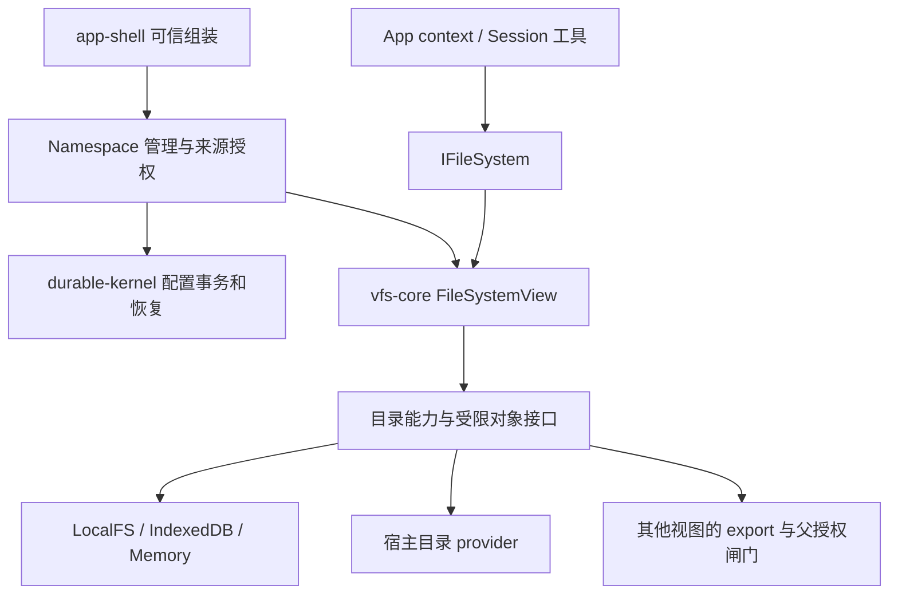

# VFS 重构：系统存储、用户数据与可组合文件视图

状态：待评审的新方案，未实现。日期：2026-09-07。

基于 [原 Session FS 设计](vfs-session-fs.md) 和当前工作区代码审查；工作区已有未提交实现变更，本文描述读取时的状态，不代表某个已发布版本。本次只新增设计文档。

本文建议替换旧设计中的模块中心抽象、chat 私有存储布局及第 23 节接口；保留其宿主授权、受限 IO、复合文件、配置 CAS、撤权 draining 与恢复要求。跨 Session IPC 是独立协议，本次不借文件系统重构重新实现它。涉及下面标记的产品选择，采用暂定默认值，尚未视作用户确认。

## 1. 核心结论

1. 将系统配置、持久运行状态、临时状态、用户文件分开。chat 是应用，不应继续同时充当用户文件目录和 kernel 存储所有者。
2. 应用面向通用 `IFileSystem`，通过 `context.fs` 获取当前视图。SessionFS 是绑定 Session 的这种视图，不再让应用围绕 `getEngine(moduleId)` 找文件。
3. 挂载来源统一为已授权的目录能力。存储目录、宿主目录、另一个视图导出的目录都可挂载，目标始终是当前视图的路径。
4. 应用可以直接使用 SessionFS，也可以创建自己的组合视图，以 SessionFS 导出作为根，再挂其他 Session 导出或宿主目录。它不修改被挂载 Session 的配置。
5. 通用 `FileSystemView`、目录能力、挂载解析属于 `vfs-core`；Session 身份、持久绑定、授权变更与恢复属于 kernel 和集成层。不新增另一套 Session 文件系统引擎。

“更直接”来自统一消费者接口和挂载来源，不是把所有持久状态开放成普通可写文件，也不是让每个应用必须先创建一个 durable Session 才能访问文件。

## 2. 当前实现审查

| 当前代码 | 已有机制 | 重构含义 |
| --- | --- | --- |
| `ScopedView.ts` | `/` 映射 `/module/<id>`，硬编码透出 `/etc`、`/dev` | 已有粗粒度系统目录区分，但没有独立可配置命名空间；挂载策略不应由 module 名称决定 |
| `access-controller.ts` | caller 是 moduleId/isSystem；隐藏路径、跨模块权限按目录和模块注册表判断 | 不是 Session/App 权限；`isSystem` 提前返回也跳过扩展 policy，不能复用为普通视图授权 |
| `ModuleContext.ts` | 默认以模块根选择 backend/records；支持少量 root override | CRUD 可按路径进入其他 backend，records 却绑定模块 backend；异构挂载必须按 owner 路由 metadata |
| `ModuleContext.toRealPath` | 兼容接受 `/module/<自身 id>/...` | 新视图不能继承这种内部路径入口；路径只在接收视图内解释 |
| `ModuleDriver.ts` | read/list/write 部分操作显式检查 access；stat/exists/walk 等路径不统一进入同一检查 | 不能将现有 ModuleFS 直接包装成可靠权限边界，必须审查全部操作入口 |
| `MountService.ts` | 全局 backend 挂载、最长前缀路由；unmount 直接 close backend | 可参考解析算法，但生命周期不适合多视图共享来源；需要引用计数与来源所有权 |
| `VFSEngine.listChildren` | 枚举选中 backend 的目录 | 不合成挂载父目录，不形成完整 namespace 遍历语义 |
| `ModuleDriver.on/onAny` | 按事件 moduleId 过滤 | 两个视图共享同一文件时不能按调用模块隔离事件，应按来源对象投影 |
| `ModuleDriver._readCache` | 按真实路径缓存，部分写入本实例失效 | 多视图和外部编辑需要版本或源事件失效；不能假设本实例是唯一写者 |
| `File.ts`、`EnginePort.ts` | FileHandle 依赖 IModuleFS；能力类端口仍含 moduleId、VFSEngine、单 backend | 可复用对象行为，但需要解除模块及全局 engine 耦合 |
| `core/types.ts` | FSNode 有 path/version，没有通用 id；ModuleContext 明确拒绝非路径输入 | 旧设计 `openFile(node.id)` 与实现不符；不要以改名方式假装已有稳定对象 ID |
| `app-shell/bootstrap.ts` | 工具以 basename 全局搜索，读写可能选首项，list 用 includes | 必须改成注入视图后的精确路径访问，这是实际消费端迁移，不只是新增 core 类 |
| `durable-kernel/domain/types.ts` | ResolvedStorageBinding 使用 IModuleFS + rootPath | kernel 存储也被模块类型耦合；应依赖所需的文件/事务记录能力 |

上述是静态审查发现，不是已运行攻击测试的漏洞结论。尤其 metadata、asset、refs、seq、插件、设备、事务及异常吞掉的行为，需要完整接口验收；只给 CRUD 加一个 path mapper 不够。

## 3. 数据分类与推荐布局

不能把整个 chat 等同于 `/var/run`。持久恢复状态应跨进程重启保留，对应 `/var/lib` 的职责；`/var/run` 对应 `/run` 的临时运行数据。这里借用生命周期分类，不要求实现完整 Linux FHS。[FHS 持久状态说明](https://refspecs.linuxfoundation.org/FHS_3.0/fhs/ch05s08.html)、[FHS /var/run 说明](https://refspecs.linuxfoundation.org/FHS_3.0/fhs/ch05s13.html)。

建议可信系统组装视图采用：

```text
/etc/mindos/                       系统配置；凭据通过专用服务访问
/var/lib/mindos/kernel/            catalog、session/task、journal、mailbox、资源账本
/var/lib/mindos/files/             namespace 配置、exports、来源绑定与迁移记录
/run/mindos/                       临时端点、运行实例信息、可重建状态
/home/<user>/chats/                用户聊天文档及用户附件
/home/<user>/notes/                笔记
/home/<user>/projects/             项目
/home/<user>/.config/<app>/        用户级应用配置（需要时）
/dev/                             显式注册的协议设备（需要时）
```

这是系统管理视图的逻辑地址，未必是宿主磁盘路径。浏览器可以由多个 IndexedDB store 承载；LocalFS 可映射为 app data 内多个目录/数据库。应用、module 名称不再决定物理存储分区。

系统私有 store 与用户数据至少必须有独立来源根和授权能力；推荐独立 backend/store，以消除从用户目录祖先、附件关联或宿主别名访问系统账本的通道。共用物理数据库时，内部表不能经用户来源的通用记录操作访问。

Session 用户根仍可直接是 `/project-a` 的来源，不必展示 `/home/<user>` 前缀。`/etc`、`/run`、`/dev` 不隐式注入用户视图；需要配置时由可信 host 挂载选定的只读投影。用户项目内自己的 `/etc` 只是用户文件夹。

chat 拆分规则：聊天文档、附件属于用户数据；执行状态和恢复事实归 kernel 私有存储；文档用稳定业务 `chatId/sessionId` 关联。若现有消息历史本身由内部记录维护，应区分可编辑用户文档与只读历史投影，不能复制出两份互相独立的权威历史。

删除或移动聊天文档不自动级联删除 Session 账本。显式“删除会话及历史”由业务服务执行关闭、停止执行、保留策略和 GC。应用卸载也不等于删除用户文件。

## 4. 四个概念及应用入口

| 概念 | 所有权与生命周期 |
| --- | --- |
| Source / Volume | 文件内容与 metadata 的存储来源，可被多个视图共享；不属于某次 UI 打开 |
| FileSystemView / Namespace | 独立挂载表和访问能力，不拥有被挂载的数据；可临时，也可由上层持久化配置 |
| Session binding | durable Session 关联 namespaceId；持久授权变更与恢复由集成层协调 |
| App context | 单个应用实例选择的 fs、cwd、可选 session；可与其他应用共享 SessionFS，也可使用独立组合视图 |

默认每个 Session 一个独立 namespace，多个 Session 可以挂同一数据源，但不默认共享可变挂载表。多个应用实例可使用同一个 Session 绑定。文件浏览器等无需 Session 的应用可以直接使用 host 授予的独立视图。

```ts
// 拟新增接口骨架，非当前可编译 API。
interface IFileSystem extends FSEventEmitter {
  readonly viewId: string;
  readonly revision: number;
  readonly driver: IFileSystemDriver; // 从 IFSDriver 抽离 moduleId
  readonly meta: IFSMetaDriver;       // 保留能力分组，所有入口受限
  openFile(path: string): IFile;
  capabilitiesAt(path: string): Promise<FSCapabilities>;
}

interface AppFileContext {
  readonly fs: IFileSystem;
  readonly cwd: string;
  readonly sessionId?: string;
}

interface SessionFileContext extends AppFileContext {
  readonly sessionId: string;
  readonly namespaceId: string;
}
```

应用读写 `context.fs`；文件工具的 bytes/text API 从同一 fs 适配。`IFile` 改依赖最小文件系统接口，不能通过全局 manager 重新打开源模块。SessionHandle 可由集成 facade 提供 `files`，不需要将应用 registry import 到 durable-kernel。

切换 Session 时创建/替换整个 App context，旧句柄仍绑定原视图或被明确关闭；不能把旧 `/report.md` 句柄悄悄指向新 Session 的同名文件。一个 Session 内配置更新则由稳定 facade 切换 revision，旧操作按撤权协议退出。

可信 host 持有 `NamespaceAdmin`；普通应用/工具仅持有 fs。具备管理授权的应用可以请求挂载操作，传递的是已有授权能力或授权引用，不能靠输入 sessionId、moduleId、host path 获得权限。

## 5. 统一挂载模型

```ts
// DirectoryCapability 的实例由可信服务签发并验证；不是可自造的 JSON。
interface DirectoryCapability {
  readonly capabilityId: string;
  readonly access: 'ro' | 'rw';
  // 内含来源身份、授权世代、受限 IO/meta/events 与释放引用协议。
}

interface MountSpec {
  readonly mountId: string;
  readonly at: string;
  readonly source: DirectoryCapability;
  readonly access: 'ro' | 'rw';
}

// root 与附加挂载统一建模；允许只读合成根。
declare function createFileSystemView(options: {
  viewId: string;
  revision: number;
  mounts: readonly MountSpec[];
  gate: ViewAccessGate;
}): Promise<IFileSystem>;
```

来源从 storage root、受限 host provider 或授权 view export 取得。底层 `IStorageBackend` 表示存储实现，不直接当作任意可共享授权能力。管理 API 与 data API 分离，dispose/reconfigure 归 owner controller 管理。

三种组装方式使用同一机制：

```text
应用直接使用 Session A：
  context.fs = sessionA.files

应用在当前 Session 之外添加文件：AppView
  /                 -> Session A 已授权导出的根
  /imports/b        -> Session B 导出的 /results，ro
  /reference        -> host 授权目录，ro

应用并列查看多个 Session：AppView（合成根）
  /sessions/a       -> Session A 导出
  /sessions/b       -> Session B 导出
  /local            -> host 授权目录，rw
```

AppView 的额外挂载只对该应用上下文可见。若希望 Session Task 也访问 `/reference`，必须配置该 Session 的 namespace，不能因为 UI 能看到就自动授予 Task。

“挂到进程内”在这里是进程内 VFS API 路由。它不改变 `node:fs`、Rust syscall 或 Bash 看见的 OS 文件树。原生执行需要独立 sandbox adapter 实现同等挂载/权限；IndexedDB 来源不能直接当 OS bind mount。沿用旧设计的执行隔离验收要求。

## 6. 跨视图导出与嵌套语义

暂定默认：导出显式目录集合，实时共享内容，固定导出时的来源拓扑；不自动继承源 Session 后续新增挂载。不做文件内容快照，也不复制文件。

导出时将可见子树解析为受限来源集合，保留原遮蔽边界，并记录父能力依赖。导出跨越已有挂载时只包含明确批准的部分；从未导出的底层目录不能因展平而重新出现。导出整根是显式选择，不是拥有 sessionId 的默认权利。

- 新增文件：在已授权来源目录内可见。
- 新增挂载或替换 mount 来源：不自动扩展既有 export；受影响旧 export 失效，重新导出。
- 源撤权、源禁用、导出撤销：下游能力链同步拒绝新操作，并纳入 draining；不能只靠异步事件通知撤权。
- 用户关闭 UI 不撤销 Session 导出；暂定 Session durable close 撤销以该 Session 为授权父级的 export。需要独立长期共享时，改用独立授权的 source export。
- 恢复：持久记录 exportId/generation、来源身份和父依赖，重新验证；失败为 unavailable，不能凭原路径静默重绑。
- 每次操作有效权限是底层来源授权、父导出权限、当前挂载权限与当前主体权限的交集。

组合依赖必须无环，并限制深度、挂载数和展平规模。配置更新也检查环；不能只在初次 mount 检查 A → B → A。展平是解析优化，不能丢失父授权闸门或让序列化凭据成为 bearer token。

第一版支持合成根及根上的多个非嵌套附加挂载，这已经覆盖上述应用组合。视图引用的嵌套与同一挂载表的路径嵌套是两个概念。一般的 `/a` 与 `/a/b` 同表嵌套延后；若导出已有子挂载，导出器必须保留其完整边界，不能用此限制偷偷丢失它们。

如果选择“持续跟随整个 SessionFS”，需要 live export 协议：源每次 topology 变化都要对下游重验证、关闸、发布依赖版本，新增授权需消费方确认或预先授予明确动态范围。它增加分布式配置复杂度，不建议作为默认。

## 7. 路径、对象与 metadata 统一

保留当前 path-based 操作，不在本次引入全局 inode 数据库。将 `openFile(nodeId)` 更名为 `openFile(path)`，旧签名作为兼容入口。路径表示当前地址；稳定身份由 provider 按能力提供，不用路径、moduleId 或 mtime 假装稳定 UUID。

每次操作统一执行：取得视图及父授权许可 → 规范化路径 → 最具体挂载解析 → 验证来源和权限 → 在受限来源执行 → 转换结果/事件。来源返回的 path、parentPath、assetDirPath、refs、搜索结果和错误也要转换；不返回带原始 source moduleId 的裸节点。

路径句柄不能保证外部 rename 后继续指向原对象。需要这种能力时显式返回 provider 支持的 identity handle；它必须绑定 view、mount 和 generation，每次使用重新验证授权。缓存命中也不能跳过权限校验。

沿用旧设计的路径段规则、遮蔽、ro、跨挂载 rename 拒绝、挂载点及其祖先结构操作保护、受限宿主相对 IO、链接策略与来源别名检测。合成目录参与 stat/list/walk/search，隐藏内容不能被全局搜索找回。

`driver`、`meta.assets/tags/seq/refs` 与 `IFile.asset` 共用 owner 路由。资产是 owner 的复合对象附属信息；系统账本迁走后，不再需要在普通 chat 资产内部反复排除 `.kernel`。迁移期间旧位置仍受保护。

ro 同时禁止 metadata/asset/seq 写入；宿主 sidecar 是否启用由 host 配置。不同视图共享同一来源的 metadata，不能按 Session 复制一份。关系写入需验证可见性及所需权限，不能泄漏未授权 refs 目标。

事务按实际事务域声明：文件内容事务、SeqFile 记录事务分别检测；跨 mount 操作默认拒绝原子事务，即使 backend 实例相同。复合对象 rename/delete 的恢复能力由 backend 提供，不以事件缓存充当数据回滚。

事件以来源位置/身份为基础投影到各视图；跨可见边界的 rename 降为 create/delete。watch overflow 发 invalidated；内容缓存按版本/来源事件失效，不可靠时关闭缓存。卸载只释放该视图引用，不关闭其他视图仍在使用的 backend。

## 8. 包边界与持久管理



| 包 | 职责 |
| --- | --- |
| vfs-core | IFileSystem、通用 view/resolver、受限目录能力、对象/metadata 路由、事件、能力生命周期接口；不含 sessionId 策略和 Linux 目录布局 |
| vfsdriver-* / platform | 来源存储、身份、sidecar、真实事务及受限宿主 IO；不会自行解释 Task 状态 |
| durable-kernel | Session 到 namespace 的绑定，持久配置变更意图/事务/审计，调度恢复；其存储依赖最小能力 port |
| kernel-adapters | SessionFileContext facade、授权依赖图、活动操作登记、关闸和 native execution cleanup 协调 |
| app-shell | 系统目录组装、来源注册、用户授权、应用 context、配置与诊断界面 |

应用私有临时视图只在内存中保存；需恢复的视图配置由上层持久管理。SessionRecord 存 namespaceId 和绑定版本，NamespaceRecord 存 schemaVersion/revision/mounts；写入同一事务域，避免 Session 内再复制一份 root/maps。持久 mounts 引用来源或 export 的授权记录，不存 fd、JS 对象或裸授权 token。

namespaceId、sessionId、mountId、source identity、文件版本分别建模。默认一对一 Session 绑定是产品策略，不是 core 类型限制。业务 IPC 不随 namespace 切换，导出文件也不授予另一 Session 的 shared/mailbox/task 权限。

配置变更继续采用 prepare → drain → commit，旧版停止接单、排空操作/执行并关闭订阅后发布。父 export 的撤权协调所有派生使用者；等待锁按稳定顺序获取，不在数据库事务中等待 IO，watch 不永久占据普通操作计数。

系统数据恢复先于用户来源绑定；用户宿主目录断开不能使 kernel catalog 本身不可读。先恢复未完成关闸，再绑定授权能力，再允许依赖文件的 Task 运行；保留 paused/terminal。迁移不改变文件 effect 的 unknown/reconciliation 语义。

## 9. 实施顺序与迁移

1. **抽离接口与建立行为基线。** 引入 IFileSystem/IFileSystemDriver；FileHandle 和 kernel storage port 去除不必要的 module 依赖。保留 ModuleFS compatibility adapter，记录现有 CRUD、assets、seq、refs、事务和事件行为。新接口不添加隐式 `/etc`、`/dev`。
2. **实现通用视图。** 交付 root/synthetic root、独立挂载表、完整对象代理、按 owner metadata 路由、能力报告与共享来源生命周期。先用现有 backend 的受限目录来源验证，不直接将旧 ModuleFS 当授权证明。
3. **迁出系统账本。** 注册 kernel 私有来源与用户数据来源，先切可信存储绑定，再开放用户 chat 导出。目录重命名不是主要任务，旧 `/module/<id>` 可以暂作物理布局，由兼容映射连接新逻辑目录。
4. **Session 和应用接入。** 持久 namespace binding、context 注入、工具精确路径访问、应用切换和额外挂载。删除 Session 路径上的全局搜索回退，完成管理 UI/诊断闭环。
5. **跨视图导出与 host provider。** 导出权限链、恢复、共享 metadata 与撤权；宿主平台通过受限 IO 测试后开放。原生 shell 作为单独执行 adapter 验收，不冒充进程内挂载的附带能力。

账本迁移采用停写窗口和可恢复 manifest：记录旧/新绑定与版本 → 停止相关执行并排空 → 复制和校验记录/索引/引用 → 在权威 catalog 原子切换 locator → 从新位置恢复。跨 backend 复制不是事务；切换前旧存储仍是权威，切换后只写新存储，不双写。catalog 本身迁移时由可信启动配置持有版本化位置指针，不能要求先读取尚未定位的 catalog。

旧账本保留只读备份至验收和保留期满足，随后显式 GC；旧 `.kernel` 的保护持续到清理完成。切换后新数据已产生时不能直接退回旧备份。业务 chat/session ID 不变；文档移动更新文档定位，不更改 kernel root。

## 10. 验收与待澄清选择

验收应覆盖：

- 两个 Session 同名路径不串读；同来源内容可共享、挂载配置独立。
- 同一个 AppView 并列多个 Session 导出及 host 目录；App 额外挂载不自动赋权给 Task。
- 全部 driver/meta/IFile 操作执行同一授权；隐藏项、refs、资产和错误不泄漏内部路径。
- CRUD 与 records 按同一 owner 进入正确 backend，异构 capability 和事务拒绝真实有效。
- 来源新增挂载不自动扩大 export；父撤权使派生旧句柄、缓存、watch 和新操作失效；无环与限额检查。
- dispose/unmount 一个视图不关闭共享 backend；外部编辑不会永久读取旧缓存。
- 聊天文档 rename/delete 不损坏 kernel 恢复；系统存储无法经用户附件/祖先挂载触达。
- 迁移复制、catalog 切换、恢复各崩溃点可恢复且单一写入权威；宿主来源缺失时系统仍可启动。
- 旧设计中的路径攻击、宿主目录置换竞态、CAS、draining、工具旁路及原生执行隔离测试继续适用。

待讨论的产品选择及本方案默认值：

| 问题 | 暂定默认 | 若选择另一方向 |
| --- | --- | --- |
| 跨 Session 挂载跟随整棵树还是明确导出？ | 明确导出，内容实时，拓扑不自动扩权 | live export 需要额外版本依赖与下游配置协调 |
| App 是否必须绑定 durable Session？ | 不必；有 Session 时使用 SessionFileContext | 强制绑定会使普通文件浏览也承担 Session 生命周期 |
| chat 删除是否删除执行历史？ | 普通文件删除不删除；业务命令单独处理 | 若联动，需先定义关闭、保留、清理失败的 UI 语义 |

建议先确定以上产品语义，再按阶段实现；它们不妨碍先认可“通用视图属于 vfs-core，Session 只是绑定，系统账本移出用户资产”的架构方向。
