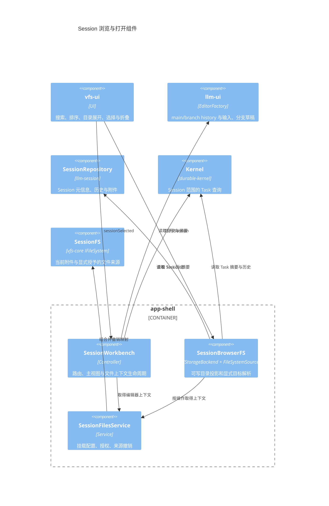
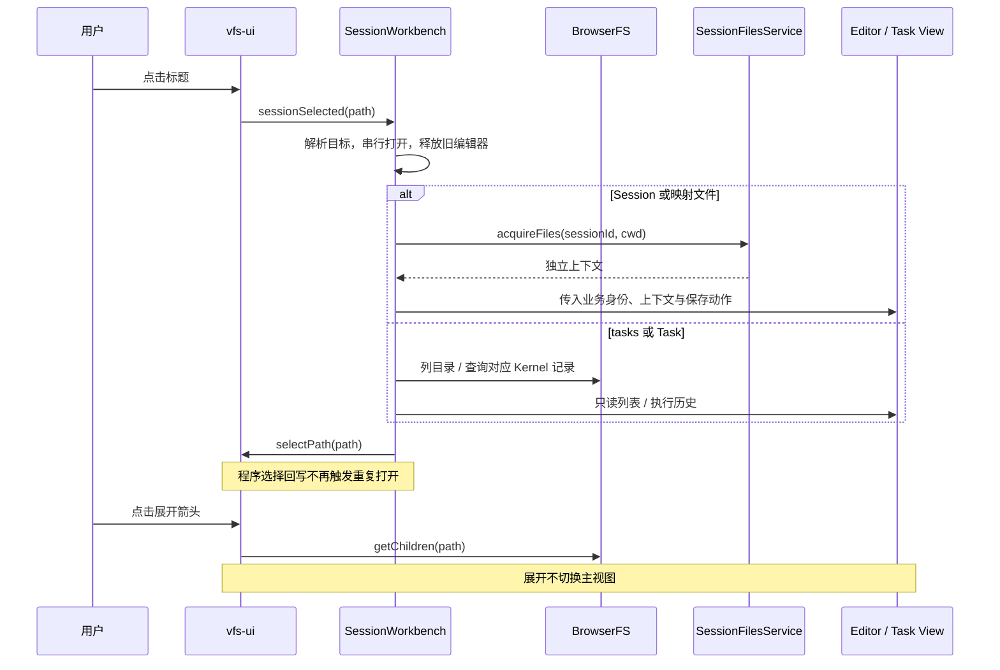

# Session 浏览投影：vfs-ui、映射文件与 Task 历史

状态：已实现，2026-09-08。本文声明当前源码契约，补充 [VFS 总体设计](vfs-c4-review.md)。旧 `.chat + assetdir` 入口与 SessionWorkbench 手写侧栏已移除，不做旧数据兼容。

挂载的授权、UI、slash 与平台边界见 [Session 挂载与访问边界](vfs-session-mount-access.md)，已同步实现。

## 1. 目录与交互

```text
SessionBrowserFS:/
  <sessionId>/              显示会话标题；打开 Session 聊天
    tasks/                  Task 列表
      <taskId>              首批 Task 的执行历史
      @more                 还有任务时显示；打开主视图分页列表
    files/                  当前 SessionFS 的实际映射
      <SessionFS 目录与文件>
```

Session 直属入口只有 tasks/files。点击标题打开 main history，顶部 branch 切换和底部输入框由 llm-ui 提供；点击箭头仅展开目录。Session ID 决定路径，标题修改不改变路径。已打开的同一条目重复选择保持当前视图；离开后普通重新打开 Session 默认 main。带分支的路由会显式打开指定分支，即使该 Session 已在当前视图中也会切换。

切换分支会更新 manifest.currentBranch/currentHead，后续发送沿该分支继续。草稿按 Session + branch 保存，切换期间禁用输入，关闭前等待草稿切换完成。运行中的 Session 保留已有的分支切换限制；重开正在运行的当前 main 分支允许执行。

tasks 主视图按存储索引显示列表，侧栏预览首批并在有后续页时显示“更多任务（打开分页列表）”；具体 Task 显示一份当前状态、输入、输出、错误摘要，以及审批、工具调用、失败、重试等关键事件；不展示流式片段和调度事件。Task 是只读执行信息，不是可续聊分支。历史读取为有限快照，不收集持续事件流。

files 直接代理受限 Session 文件上下文，不使用目录黑名单。未挂载时只有 attachments；用户明确授权后才增加 workspace 或其他目录。etc/var/dev/run/history 不在该用户上下文中，不能通过直接路径绕过。文本通过普通文件编辑器打开，文件身份和保存路径均为原 SessionFS 路径，cwd 为文件父目录；权限取自 capabilitiesAt。二进制文件提供下载，常见栅格图片提供预览，关闭时释放对象 URL。Session 聊天附件使用 `/attachments` 子视图。

投影支持 Session/文件夹 CRUD 与 `/files` 下的文件 CRUD。根级创建文件按导入 Session 处理，根级创建目录建立虚拟分组；Session 重命名写 `repository.updateManifest`。`/files` 写操作仍经 Session 文件上下文和授权校验。

删除统一走 `SessionLifecycleService`（`@itookit/app-core`，浏览器投影与文件夹递归删除共用）：`kernel.closeSession(id, true)` → 有界等待 `sessionStat(id).phase === 'closed'` → `kernel.removeSession(id)`（解除固定布局、删除 Kernel 存储根、清理 catalog）→ `repository.deleteSession(id)`。关闭抛错或超时抛 `EBUSY` 并**保留全部数据**，不进入删除；文件夹删除逐会话走同一路径，全部成功后才删文件夹记录。

导入/导出协议为 `itookit.session` v2（`session-bundle.ts`，浏览器投影与 `SessionWorkbench` 导出共用一份实现）：

```jsonc
{ "format": "itookit.session", "version": 2,
  "manifest": { "title", "summary", "origin", "folder", "uiState",
                "rootRoundId", "branches", "branchMeta", "currentBranch", "currentHead", "children" },
  "settings": { /* ChatSessionSettings */ },
  "documents": { "round-<roundId>.json": "...", "context-profile-…": "..." },
  "attachments": [{ "name": "a.png", "base64": "…" }] }
```

导入先校验再写入：文档必须是 JSON；`round-<roundId>.json` 的 `id` 必须等于文件名里的 roundId；`branches`/`currentHead`/`rootRoundId` 必须指向存在的文档（悬空的 `children` 条目被丢弃，其余引用不一致则报 `EINVAL`）。任一写入失败都会删除刚创建的空会话，不留半导入状态。v1（`{version:1, manifest, history}`）按旧格式兼容读取并同样恢复分支索引。根级写入的非 bundle 文件仍按"新建空会话"处理（侧栏新建会话依赖该语义）。

## 2. C4 组件边界



Browser 是 admin 宿主的浏览能力，不自动挂到 Session 工具上下文，也不把自身挂进 files，避免递归。vfs-core 不引入 Session/Task 业务类型。投影是读取适配器，不新增第二份 Session 权威数据。

Task 展示选择明确字段；不序列化 currentAttempt、租约、资源令牌等内部结构。所有 Task 查询使用 sessionId + taskId。原始 Kernel 账本不会通过 Task 视图直接输出。

## 3. 已实现接口与改动

`packages/app-shell/src/files/session-browser.ts`：

```ts
type BrowserTarget =
  | { kind: 'session'; sessionId: string }
  | { kind: 'tasks'; sessionId: string }
  | { kind: 'task'; sessionId: string; taskId: string }
  | { kind: 'files'; sessionId: string; path: string };

interface SessionBrowserDependencies {
  repository: ISessionRepository;
  files: SessionFilesService;
  kernel: Kernel;
}
function resolveBrowserTarget(path: string): BrowserTarget;
function createSessionBrowser(deps: SessionBrowserDependencies): Promise<FileSystemSourceOwner>;
```

files 的目录/文件身份通过 SessionFS.driver.getNode 查询，不能按扩展名判断业务目标。`FileSystemSourceOwner` 复用 vfs-core 的 `{ fs, dispose() }` 生命周期。内部 BrowserBackend 实现 IStorageBackend：Session/文件夹 mutation 映射到 repository，`/files` mutation 映射到当前 Session 文件上下文。

Task 展示 DTO 由 `taskSummary(TaskRecord)` 选择以下字段：id、sessionId、parentTaskId、program、status、version、createdAt、updatedAt、input、output、error（来自 lastError）。Task 详情和浏览文件内容导出均使用 Kernel.task 的当前摘要，不再读取全量历史版本。事件使用 Kernel.taskEventPage 的 Task 索引有限快照，不读取其他 Task 的事件。新 Session 尚无 Kernel 记录时 tasks 返回空列表。

vfs-ui 的 `VFSUIOptions` / `VFSUIShellOptions` 调整：

```ts
interface BrowserUIOptions {
  defaultEditorFactory?: EditorFactory; // 仅列表模式可省略
  activateDirectories?: boolean;       // 默认 false；投影开启
  primaryAction?: { label: string; run(): Promise<void> };
  directoryAction?: { label: string; visible(path: string): boolean; run(path: string): Promise<void> };
}
// VFSUIShell 新增
refresh(): Promise<void>;               // 重载并恢复已展开目录
selectPath(path: string): Promise<void>; // 展开祖先后选择条目
```

不新增通用资源框架或 operationPolicy。Browser 使用 readOnly:false；普通文件模式继续使用已有命令系统。Store 的 SESSION_SELECT 接受存在的目录条目；NodeList 根据 activateDirectories 决定目录标题是否发出选择。

`SessionWorkbench` 构造依赖增加 Kernel 与普通文件 EditorFactory。它持有 Browser source、vfs-ui shell、当前编辑器和其独立上下文，通过 resolveBrowserTarget 打开对应视图。bootstrap 提供这些依赖，Web/Tauri 共用。

`SessionFilesService.subscribe(listener: () => void): () => void` 通知挂载配置和注册来源变化；宿主合并刷新请求。Browser 文件读取每次取得当前上下文并在 finally 中释放，编辑器则独立持有固定上下文直至关闭；撤销后旧句柄不能重新获权。

llm-session / llm-ui 草稿接口：

```ts
interface ConversationUIState {
  branchDrafts?: Record<string, { inputText?: string; inputAgentId?: string }>;
  // 其余会话 UI 状态保持原定义；删除全局 inputText/inputAgentId。
}
// StateService
saveUIState(sessionId: string, state: UIState, branch = 'main'): Promise<void>;
loadUIState(sessionId: string, branch = 'main'): Promise<UIState | null>;
// StateManager
switchDraftBranch(branch: string): Promise<void>;
waitForDrafts(): Promise<void>;
```

Repository 在事务内按 branch 合并 branchDrafts，空字符串明确清空草稿。SessionService.ensureReady(sessionId, branch = 'main') 绑定后切换指定分支；普通打开 main，挂载后重载通过 EditorTarget.branch 保留当前分支，StateManager 以同一分支恢复草稿；BranchService 接受 null-head 的空分支，同分支 no-op 在生成状态检查前返回。

### 分支路由

Session 资源身份采用 `<sessionId>?branch=<encodeURIComponent(branch)>`，shell 再对整个资源身份编码到 hash。文件/Task 保持原投影路径；只在单层 Session ID 后识别 branch query，文件名中的 `?branch=` 不被误当作聊天分支。重复 branch、空值、控制字符或未知 query 参数拒绝。

SessionWorkbench 在仓库通知后核对当前聊天分支，分支变化通过 onSelect(resourceId, 'push') 写入浏览历史；普通打开与路由回放使用 replace 同步当前地址，避免返回时再插入历史项。当前活动资源返回包含分支的身份，sidebar 仍选择 Session 目录。分支名含斜线、中文、加号和查询符号均单独编码。

回放显式 main/其他分支会创建对应 EditorTarget.branch；无分支的同 Session 点击保持当前分支，离开后普通打开默认 main。挂载后重建继续使用 manifest.currentBranch。刷新有生命周期与活动身份检查，迟到的旧 Session 读取不能改写新视图的路由。

## 4. 打开与生命周期



- 根只读 Session 摘要，展开 tasks 才读 Task 摘要；不会在加载侧栏时读取所有 Task 历史。
- 仓库、Kernel 与来源通知触发合并刷新。主视图查询使用 generation 丢弃迟到结果，程序 selectPath 及其祖先展开期间的中间选择回写被忽略，避免连续导航形成循环。
- 浏览状态独立存于 `session-browser:v1:admin`，不恢复旧聊天文件树。
- 编辑器创建失败、创建期间关闭、正常切换均释放文件上下文和附件视图。退出解除订阅，等待打开/刷新结束，然后销毁消费者与投影。
- 后台刷新错误不会替换正在编辑的内容。

## 5. 验证与边界

自动测试覆盖：真实 DOM 下标题/箭头独立、目录选择和刷新；宿主通过真实 vfs-ui 打开聊天/Task/映射文件并保存；快速连续导航；仅 tasks/files 入口；Task 字段隔离、Session 范围查询；映射撤销；空 main、运行中重开当前分支；分支草稿合并和快速切换；失败/迟到编辑器释放。

Task 详情不加载版本历史，输入与结果只展示一次。事件仍使用 taskEventPage(sessionId, taskId, { afterIndex?, throughIndex?, limit? }) 的有界分页，固定首次 throughIndex；页面过滤流式输出与调度事件，只保留关键事件及详情，“继续查找关键事件”允许扫描后续页。过滤后的空页不代表后续没有关键事件。底层 task.seq 快照和 events.seq 未删除或压缩，恢复执行和流式订阅语义不变。事件与引用同事务写入，缺失索引的旧日志首次查询原子扫描补建一次，此后按键读取；无索引时的首次成本不能宣称为有界。Task 列表使用 listSessionTaskPage(sessionId, { afterIndex?, throughIndex?, limit? })，默认 100、最多 500 个成员，固定首次 throughIndex 排除后续新增任务，但各页读取当前 Task 状态。成员序号首次建索引时分配，状态更新不改变位置；旧 index.seq 首次查询原子补建序号。主视图有“加载更多任务”，侧栏只显示首批及保留路径 @more 的入口，避免侧栏展开退回全量读取。Task 文件导出只读取当前摘要。该接口限制请求键与解码数量，不据此宣称每种存储后端的物理 IO 已达到同样上界。聊天路由已编码 branch，支持浏览历史回放指定分支，自动验证覆盖宿主路由与编辑器目标传递；真实浏览器 GUI 验收仍未执行。文件侧栏已提供 Session/文件夹 CRUD 与 `/files` 文件 CRUD；通用文件类型插件路由仍不在本实现中，二进制提供安全预览/下载。

本次使用 jsdom 自动交互验证，尚未进行真实浏览器/Tauri GUI 人工验收。

files 的目录动作与主视图按钮复用挂载弹窗。slash 经 EditorHostContext.directoryCommands 调用同一宿主服务，不发送给模型。授权变更先撤销旧文件上下文，再重新打开当前 Session 编辑器；关闭 workbench 同时关闭弹窗。


Task 右键提供“强制复位任务（停止执行，保留记录）”，调用 Kernel.cancel，取消任务及其活动子任务，不将任务改回 created，也不重新执行。保留会话 history、DAG、输入、checkpoint 历史、Effect 与审批记录、产物；取消原因和时间由 Kernel 的取消事件记录。已终结任务保留原终态。菜单操作防止重复提交，清理失败或 cleanupPending 会显示错误，不伪造资源已释放。该入口不删除底层 SeqFile，也不撤销已经发生的外部副作用。
