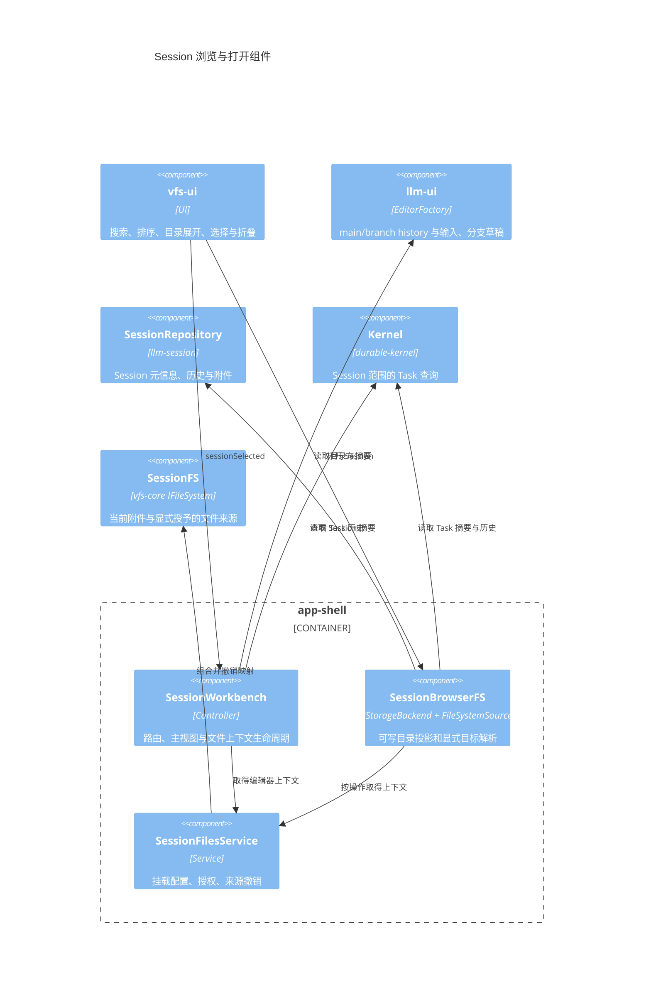
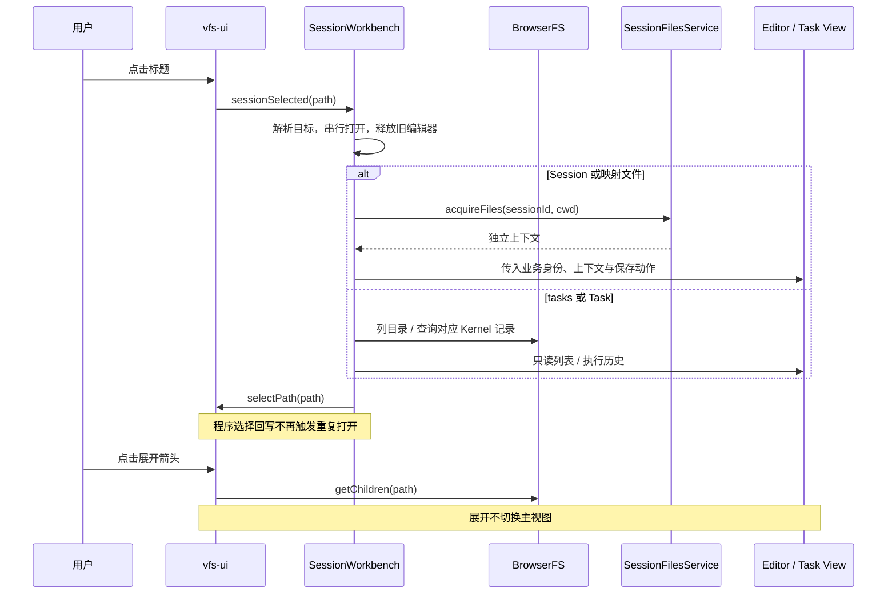

# Session 浏览投影：vfs-ui、映射文件与 Task 历史

状态：已实现，2026-09-09。本文声明当前源码契约，补充 [VFS 总体设计](vfs-c4-review.md)。旧 `.chat + assetdir` 入口与 SessionWorkbench 手写侧栏已移除，不做旧数据兼容。

挂载的授权、UI、slash 与平台边界见 [Session 挂载与访问边界](vfs-session-mount-access.md)，已同步实现。

vfs-ui 0.5.5 统一维护组件内部样式和交互。宿主通过 `appearance`、节点 `presentation.layout/titleLayout`、`toolbarOptions.variant` 和公开 CSS 变量选择展示；抽屉分组、业务动作及工作台布局仍由宿主提供。移动端通过 `VFS_DOM_EVENTS.resourceActivated` 切换正文，不查询内部 DOM 或模拟点击；抽屉展开变化通过 `directoryExpansionChanged` 通知。架构检查禁止 app-shell 使用 `.vfs-*` 内部选择器。

## 项目工作台（2026-09-26）

Web 与 Tauri 的 Chat／项目导航统一为“工作台”，由 `ProjectService`、`SessionWorkbench` 共用以下投影：

```text
工作台
  项目分组/                       可多级嵌套
    项目/                         稳定 project.id + 文件目录来源
      会话/                       持久路径段 @sessions，显示名称随语言变化
        会话分组/                 可多级嵌套
          <sessionId>/            聊天；可展开 tasks/files 诊断入口
      文件/                       路径段 @files，映射该项目文件目录
        文档与目录
```

浏览器路径为 `folder:<encoded name>/…/folder:%40sessions/<sessionId>`；项目文件使用 `folder:<encoded name>/…/@files/<file path>`。`BrowserTarget` 新增 `project-files`，宿主通过 `ProjectService.openWorkspace()` 取得以 `/workspace` 为规范路径的项目编辑视图，`openFiles()` 保留为内部 source view。此视图属于用户的导航能力，不会自动扩大任意 Session 的授权。

工作台是项目索引，不是所有项目共享的文件根。`SessionFolder.project.source.kind` 明确区分 local 与 remote：本地项目的兼容字段 `directory` 是独立文件根；远程项目的该字段为 `project:<projectId>` 逻辑引用，连接、export alias、远程 root 与访问权限仍由项目远程授权 catalog 唯一保存。新建远程项目不创建 `/home/admin/projects/<projectId>` 正文目录；会话、收藏和本机控制记录继续以 projectId 归属独立控制存储。

`ProjectService` 在创建本地根、绑定远程根和打开项目文件视图前检查同一来源命名空间内的根重叠，拒绝重复和父子包含关系。本地创建串行协调，远程绑定在自己的提交序列内验证，避免两个创建请求同时通过检查。缺少 source 标记的旧本地记录按本地根解析；旧远程根授权按远程引用解析，不使用原本地占位目录。旧重叠映射保留目录和导航记录，但拒绝文件访问并显示冲突项目，不能用隐藏列表替代边界检查，也不自动搬迁数据。

Session 的 `/workspace` 通过项目来源端口装配：本地沿用既有独立目录授权，远程直接取得受授权远程文件视图及其释放句柄。读取前检查项目边界，本地进程目录与 Web 同步来源也复核边界。远程项目不可回退本地文件或本地进程目录；只读权限不能在会话跨项目移动时提升。取得写租约的旧远程会话接入可把工作区授权转换成逻辑项目引用，不改变历史、附件或远程正文。VFS 命名空间隔离不替代宿主进程的实际隔离能力。

新建会话、从会话文件夹导入会话均在返回 ID 前完成项目挂载。项目名和分组路径可修改；稳定 ID、物理目录、Session ID 不变。会话可跨项目移动，整棵子会话树同步更新归属与默认工作区；分组跨项目移动仍被拒绝。“会话”与“文件”入口本身不可重命名或删除。删除项目只删除导航及所属会话，保留实际目录。

项目浏览器的改名适配把目录显示名称转换为 `folder:` 编码路径段，再交给文件驱动，使 `node:renamed` 的新路径与浏览器投影一致；Session 改名只更新标题，保留 Session ID。工作台刷新按稳定 projectId 跟踪项目改名，并更新当前路由和缓存标签路径。VFS 根目录重载清除已不存在根项的展开与选择记录，保留现有根项下尚未加载的后代；过期 reveal 路径不存在时停止展开，避免继续请求旧项目的 `@files`。

工作台没有已保存选择时显示欢迎页（手机显示项目列表）；恢复选择时仍打开上次内容。手机列表和内容分屏，通过“返回列表”切换。主导航收敛到工作台、笔记、记忆、更多，桌面继续显示完整功能入口。文件编辑及聊天顶部显示当前项目名称。

验证：`packages/app-core/tests/projects.test.ts` 覆盖共享、隔离、文件 CRUD、项目重命名、跨项目会话移动、收藏迁移及 IndexedDB 重开；`packages/app-shell/tests/project-workbench-ui.test.ts` 覆盖真实 vfs-ui 的项目选择、会话创建与文件保存。

## 1. 目录与交互

Session 在各自分组内按最后活动时间倒序排列，同一时间以 Session ID 升序确定顺序。节点 `createdAt` 映射真实创建时间，`modifiedAt` 映射持久活动时间；内容、分支、草稿与会话信息变化会更新顺序，滚动、折叠和历史可见性等纯浏览设置不更新活动时间。宿主排序优先于之前持久化的标题/修改时间排序，分组及 Flow 导航放在 Session 前；Session 内的 Task/映射文件仍沿用通用排序设置。

新建目标由 `fileCreation.resolveParent` 映射：选中 Session 时在所属分组创建同级会话/分组；Task 历史及只读挂载目录拒绝创建与导入；选中 files 内可写目录时保留原目标。内联命名、直接创建和导入使用同一映射，映射前后均检查目标权限。会话侧栏使用通用时间戳默认名称并全选，用户可直接确认或修改。切换会话仅解绑编辑器，不调用 Kernel `closeSession`；切工作区仅隐藏缓存界面，后台执行不因此停止。

```text
SessionBrowserFS:/
  <sessionId>/              显示会话标题；打开 Session 聊天
    tasks/                  Task 列表
      <taskId>              首批 Task 的执行历史
      @more                 还有任务时显示；打开主视图分页列表
    files/                  当前 SessionFS 的实际映射
      <SessionFS 目录与文件>
```

Session 直属入口只有 tasks/files。点击标题打开 main history，顶部 branch 切换和底部输入框由 llm-ui 提供；点击箭头仅展开目录。Session ID 决定路径，标题修改不改变路径。已打开的同一条目重复选择保持当前视图；离开后普通重新打开 Session 默认 main。带分支的路由会显式打开指定分支，即使该 Session 已在当前视图中也会切换。

打开 Session 不自动展开或枚举 tasks/files。启动恢复展开状态时只保留会话分组与 Flow 库，忽略之前展开的 Session 子目录和项目文件分支；手动点击箭头才加载下一层。定位深层文件只加载必要祖先，不递归恢复无关后代。项目文件先完成正文读取与编辑器创建，再后台同步导航和定位；文件页导航不查询会话摘要，过期导航不能重新选中旧文件。后台刷新只重读当前展开路径；已经折叠但仍有 children 缓存的目录不再重读。编辑器仍取得授权文件上下文并校验挂载根/cwd 类型，不扫描目录内容。真实 SessionWorkbench + vfs-ui 回归预置了展开的挂载目录，打开聊天后挂载目录枚举和侧栏 Task 页读取均为 0。

切换分支会更新 manifest.currentBranch/currentHead，后续发送沿该分支继续。草稿按 Session + branch 保存，切换期间禁用输入，关闭前等待草稿切换完成。运行中的 Session 保留已有的分支切换限制；重开正在运行的当前 main 分支允许执行。

tasks 主视图按存储索引显示列表，侧栏预览首批并在有后续页时显示“更多任务（打开分页列表）”；具体 Task 显示一份当前状态、输入、输出、错误摘要，以及审批、工具调用、失败、重试等关键事件；不展示流式片段和调度事件。Task 是只读执行信息，不是可续聊分支。历史读取为有限快照，不收集持续事件流。

files 直接代理受限 Session 文件上下文，不使用目录黑名单。未挂载时只有 attachments；用户明确授权后才增加 workspace 或其他目录。etc/var/dev/run/history 不在该用户上下文中，不能通过直接路径绕过。文本通过普通文件编辑器打开，文件身份和保存路径均为原 SessionFS 路径，cwd 为文件父目录；权限取自 capabilitiesAt。二进制文件提供下载，常见栅格图片提供预览，关闭时释放对象 URL。Session 聊天附件使用 `/attachments` 子视图。

投影支持 Session/文件夹 CRUD 与 `/files` 下的文件 CRUD。根级创建文件按导入 Session 处理，根级创建目录建立虚拟分组；Session 重命名写 `repository.updateManifest`。`/files` 写操作仍经 Session 文件上下文和授权校验。浏览器节点的 `_readOnly` 合并节点自身标记与 `capabilitiesAt(path).readonly`，tasks 容器和历史条目均标记只读；VFS UI 在打开命名输入框/文件选择器前检查，并在写入前复核。无挂载覆盖的虚拟父目录报告只读。

删除统一走 `SessionLifecycleService`（`@itookit/app-core`，浏览器投影与文件夹递归删除共用）：`kernel.closeSession(id, true)` → 有界等待 `sessionStat(id).phase === 'closed'` → `kernel.removeSession(id)`（解除固定布局、删除 Kernel 存储根、清理 catalog）→ `repository.deleteSession(id)`。`closeTimeoutMs`（默认 30s）同时约束 **`closeSession` 调用本身**（它在途 Effect 确认停止才返回）与随后等待 `closed` 的轮询：设备/进程始终不确认停止时抛 `EBUSY`（`…did not confirm its in-flight work within <n>ms; nothing was deleted`）而不是无限挂起，关闭抛错或超时同样抛 `EBUSY` 并**保留全部数据**，不进入删除，因此确认后可用同一入口重试；文件夹删除逐会话走同一路径，全部成功后才删文件夹记录。回归 `packages/app-core/tests/session-delete-lifecycle.test.ts`（含运行中 Task 取消、以及从不确认停止时的有界失败与重试）。

Session 的 `/tasks`、`/files` 是展示投影，不是 Session 拥有的物理子树。删除或重命名 Session/分组不遍历挂载目录；访问授权（包括 rw）不赋予 Session 对挂载目录的生命周期所有权。`BrowserBackend.assertMutableSubtree` 把保护责任留给实际 Session lifecycle / 文件变更入口；VFS 保留祖先固定布局检查，存在嵌套引擎挂载时仍回退递归检查。普通物理后端不实现此可选端口，保持原有子树保护。

回归使用包含 65 个文件的挂载目录：一次删除原本打开文件上下文 69 次、读 manifest 82 次、读 Task 预览 1 次；修复后分别为 0、7、0。此为内存后端调用计数，不是 Tauri 耗时。目录离线也能删除 Session；显式删除挂载文件仍检查物理固定布局，Session 删除后项目文件仍存在。证据见 `packages/app-core/tests/session-browser.test.ts`、`https://github.com/mushuanli/vfs-core/blob/main/tests/24-layout-guard.test.ts`；VFS/Core 回归分别 186/124 项通过。

导入/导出协议为 `itookit.session` v2（`session-bundle.ts`，浏览器投影与 `SessionWorkbench` 导出共用一份实现）：

```jsonc
{ "format": "itookit.session", "version": 2,
  "manifest": { "title", "summary", "origin", "folder", "uiState",
                "rootRoundId", "branches", "branchMeta", "currentBranch", "currentHead", "children" },
  "settings": { /* ChatSessionSettings */ },
  "documents": { "round-<roundId>.json": "...", "context-profile-…": "..." },
  "attachments": [{ "name": "a.png", "base64": "…" }] }
```

导入先校验再写入：文档必须是 JSON；`round-<roundId>.json` 的 `id` 必须等于文件名里的 roundId；`branches`/`currentHead`/`rootRoundId` 必须指向存在的文档（悬空的 `children` 条目被丢弃，其余引用不一致则报 `EINVAL`）。任一写入失败都会删除刚创建的空会话，不留半导入状态。v1（`{version:1, manifest, history}`）按旧格式兼容读取并同样恢复分支索引。根级写入的非 bundle 文件仍按"新建空会话"处理（侧栏新建会话依赖该语义）。

## 2. C4 组件边界


```mermaid
C4Component
  title Session 浏览与打开组件
  Container_Boundary(app, "app-shell") {
    Component(host, "SessionWorkbench", "Controller", "路由、主视图与文件上下文生命周期")
    Component(browser, "SessionBrowserFS", "IStorageBackend + FileSystemSource", "可写目录投影和显式目标解析")
    Component(files, "SessionFilesService", "Service", "挂载配置、授权、来源撤销")
  }
  Component(sidebar, "vfs-ui", "UI", "搜索、排序、目录展开、选择与折叠")
  Component(chat, "llm-ui", "EditorFactory", "main/branch history 与输入、分支草稿")
  Component(repo, "SessionRepository", "llm-session", "Session 元信息、历史与附件")
  Component(kernel, "Kernel", "durable-kernel", "Session 范围的 Task 查询")
  Component(vfs, "SessionFS", "vfs-core IFileSystem", "当前附件与显式授予的文件来源")
  Rel(sidebar, browser, "读取目录与摘要")
  Rel(sidebar, host, "sessionSelected")
  Rel(host, chat, "打开 Session")
  Rel(host, kernel, "查看 Task 历史")
  Rel(host, files, "取得编辑器上下文")
  Rel(browser, repo, "读取 Session 摘要")
  Rel(browser, kernel, "读取 Task 摘要与历史")
  Rel(browser, files, "按操作取得上下文")
  Rel(files, vfs, "组合并撤销映射")
```

Browser 是 admin 宿主的浏览能力，不自动挂到 Session 工具上下文，也不把自身挂进 files，避免递归。vfs-core 不引入 Session/Task 业务类型。投影是读取适配器，不新增第二份 Session 权威数据。

Task 展示选择明确字段；不序列化 currentAttempt、租约、资源令牌等内部结构。所有 Task 查询使用 sessionId + taskId。原始 Kernel 账本不会通过 Task 视图直接输出。

## 3. 已实现接口与改动

`packages/app-core/src/session/session-browser.ts`（app-shell 曾有的兼容 re-export 已于 2026-09-11 删除）：

```ts
type BrowserTarget =
  | { kind: 'folder'; path: string }
  | { kind: 'project-files'; folder: string; path: string }
  | { kind: 'session'; sessionId: string }
  | { kind: 'tasks'; sessionId: string }
  | { kind: 'task'; sessionId: string; taskId: string }
  | { kind: 'files'; sessionId: string; path: string };

interface SessionBrowserDependencies {
  repository: ISessionRepository;
  projects?: ProjectService;
  files: SessionFilesService;
  kernel: Kernel;
  /** 缺省时由 repository 与 kernel 构造 */
  lifecycle?: SessionLifecycleService;
}
function resolveBrowserTarget(path: string): BrowserTarget;
function createSessionBrowser(deps: SessionBrowserDependencies): Promise<FileSystemSourceOwner>;
```

文件夹路径段用 `folder:` 前缀加 `encodeURIComponent` 编码（`FOLDER_SEGMENT_PREFIX`），因此 Session 根可以出现在文件夹之下，`kind: 'folder'` 表示文件夹容器自身（`/` 也是 folder 目标）。

files 的目录/文件身份通过 SessionFS.driver.getNode 查询，不能按扩展名判断业务目标。`FileSystemSourceOwner` 复用 vfs-core 的 `{ fs, dispose() }` 生命周期。内部 BrowserBackend 实现 IStorageBackend：Session/文件夹 mutation 映射到 repository，`/files` mutation 映射到当前 Session 文件上下文。

Task 展示 DTO 由 `taskSummary(TaskRecord)` 选择以下字段：id、sessionId、parentTaskId、program、status、version、createdAt、updatedAt、input、output、error（来自 lastError）。Task 详情和浏览文件内容导出均使用 Kernel.task 的当前摘要，不再读取全量历史版本。事件使用 Kernel.taskEventPage 的 Task 索引有限快照，不读取其他 Task 的事件。新 Session 尚无 Kernel 记录时 tasks 返回空列表。

vfs-ui 的 `VFSUIOptions` / `VFSUIShellOptions` 调整（两者共有以下字段）：

```ts
defaultEditorFactory?: EditorFactory; // 仅列表模式可省略
activateDirectories?: boolean;       // 默认 false；投影开启
primaryAction?: { label: string; run(): Promise<void> };
directoryAction?: { label: string; visible(path: string): boolean; run(path: string): Promise<void> };
// VFSUIShell 新增
refresh(): Promise<void>;               // 重载并恢复已展开目录
selectPath(path: string): Promise<void>; // 展开祖先后选择条目
```

不新增通用资源框架或 operationPolicy。Browser 使用 readOnly:false；普通文件模式继续使用已有命令系统。Store 的 SESSION_SELECT 接受存在的目录条目；NodeList 根据 activateDirectories 决定目录标题是否发出选择。

`SessionWorkbench` 构造依赖增加 Kernel 与普通文件 EditorFactory。它持有 Browser source、vfs-ui shell、当前编辑器和其独立上下文，通过 resolveBrowserTarget 打开对应视图。bootstrap 提供这些依赖，Web/Tauri 共用。

`SessionFilesService.subscribe(listener: () => void): () => void` 通知挂载配置和注册来源变化；宿主合并刷新请求。Browser 文件读取每次取得当前上下文并在 finally 中释放，编辑器则独立持有固定上下文直至关闭；撤销后旧句柄不能重新获权。

llm-session / llm-ui 草稿接口：

```ts
interface ConversationUIState {
  branchDrafts?: Record<string, { inputText?: string; inputAgentId?: string }>;
  // 其余会话 UI 状态保持原定义；删除全局 inputText/inputAgentId。
}
// StateService
saveUIState(sessionId: string, state: UIState, branch = 'main'): Promise<void>;
loadUIState(sessionId: string, branch = 'main'): Promise<UIState | null>;
// StateManager
switchDraftBranch(branch: string): Promise<void>;
waitForDrafts(): Promise<void>;
```

Repository 在事务内按 branch 合并 branchDrafts，空字符串明确清空草稿。SessionService.ensureReady(sessionId, branch = 'main') 绑定后切换指定分支；普通打开 main，挂载后重载通过 EditorTarget.branch 保留当前分支，StateManager 以同一分支恢复草稿；BranchService 接受 null-head 的空分支，同分支 no-op 在生成状态检查前返回。

### 分支路由

Session 资源身份采用 `<sessionId>?branch=<encodeURIComponent(branch)>`，shell 再对整个资源身份编码到 hash。文件/Task 保持原投影路径；只在单层 Session ID 后识别 branch query，文件名中的 `?branch=` 不被误当作聊天分支。重复 branch、空值、控制字符或未知 query 参数拒绝。

SessionWorkbench 在仓库通知后核对当前聊天分支，分支变化通过 onSelect(resourceId, 'push') 写入浏览历史；普通打开与路由回放使用 replace 同步当前地址，避免返回时再插入历史项。当前活动资源返回包含分支的身份，sidebar 仍选择 Session 目录。分支名含斜线、中文、加号和查询符号均单独编码。

回放显式 main/其他分支会创建对应 EditorTarget.branch；无分支的同 Session 点击保持当前分支，离开后普通打开默认 main。挂载后重建继续使用 manifest.currentBranch。刷新有生命周期与活动身份检查，迟到的旧 Session 读取不能改写新视图的路由。

## 4. 打开与生命周期


```mermaid
sequenceDiagram
  participant U as 用户
  participant UI as vfs-ui
  participant H as SessionWorkbench
  participant B as BrowserFS
  participant F as SessionFilesService
  participant E as Editor / Task View
  U->>UI: 点击标题
  UI->>H: sessionSelected(path)
  H->>H: 解析目标，串行打开，释放旧编辑器
  alt Session 或映射文件
    H->>F: acquireFiles(sessionId, cwd)
    F-->>H: 独立上下文
    H->>E: 传入业务身份、上下文与保存动作
  else tasks 或 Task
    H->>B: 列目录 / 查询对应 Kernel 记录
    H->>E: 只读列表 / 执行历史
  end
  H->>UI: selectPath(path)
  Note over UI,H: 程序选择回写不再触发重复打开
  U->>UI: 点击展开箭头
  UI->>B: getChildren(path)
  Note over UI,E: 展开不切换主视图
```

- 根只读 Session 摘要，展开 tasks 才读 Task 摘要；不会在加载侧栏时读取所有 Task 历史。
- 仓库、Kernel 与来源通知触发合并刷新。主视图查询使用 generation 丢弃迟到结果，程序 selectPath 及其祖先展开期间的中间选择回写被忽略，避免连续导航形成循环。
- 浏览状态独立存于 `session-browser:v1:admin`，不恢复旧聊天文件树。
- 编辑器创建失败、创建期间关闭、正常切换均释放文件上下文和附件视图。退出解除订阅，等待打开/刷新结束，然后销毁消费者与投影。
- 后台刷新错误不会替换正在编辑的内容。

## 5. 验证与边界

自动测试覆盖：真实 DOM 下标题/箭头独立、目录选择和刷新；宿主通过真实 vfs-ui 打开聊天/Task/映射文件并保存；快速连续导航；仅 tasks/files 入口；Task 字段隔离、Session 范围查询；映射撤销；空 main、运行中重开当前分支；分支草稿合并和快速切换；失败/迟到编辑器释放。

Task 详情不加载版本历史，输入与结果只展示一次。事件仍使用 taskEventPage(sessionId, taskId, { afterIndex?, throughIndex?, limit? }) 的有界分页，固定首次 throughIndex；页面过滤流式输出与调度事件，只保留关键事件及详情，“继续查找关键事件”允许扫描后续页。过滤后的空页不代表后续没有关键事件。底层 task.seq 快照和 events.seq 未删除或压缩，恢复执行和流式订阅语义不变。事件与引用同事务写入，缺失索引的旧日志首次查询原子扫描补建一次，此后按键读取；无索引时的首次成本不能宣称为有界。Task 列表使用 listSessionTaskPage(sessionId, { afterIndex?, throughIndex?, limit? })，默认 100、最多 500 个成员，固定首次 throughIndex 排除后续新增任务，但各页读取当前 Task 状态。成员序号首次建索引时分配，状态更新不改变位置；旧 index.seq 首次查询原子补建序号。主视图有“加载更多任务”，侧栏只显示首批及保留路径 @more 的入口，避免侧栏展开退回全量读取。Task 文件导出只读取当前摘要。该接口限制请求键与解码数量，不据此宣称每种存储后端的物理 IO 已达到同样上界。聊天路由已编码 branch，支持浏览历史回放指定分支，自动验证覆盖宿主路由与编辑器目标传递；真实浏览器 GUI 验收仍未执行。文件侧栏已提供 Session/文件夹 CRUD 与 `/files` 文件 CRUD；通用文件类型插件路由仍不在本实现中，二进制提供安全预览/下载。

本次使用 jsdom 自动交互验证，尚未进行真实浏览器/Tauri GUI 人工验收。

files 的目录动作与主视图按钮复用挂载弹窗。slash 经 EditorHostContext.directoryCommands 调用同一宿主服务，不发送给模型。授权变更先撤销旧文件上下文，再重新打开当前 Session 编辑器；关闭 workbench 同时关闭弹窗。


Task 右键提供“强制复位任务（停止执行，保留记录）”，调用 Kernel.cancel，取消任务及其活动子任务，不将任务改回 created，也不重新执行。保留会话 history、DAG、输入、checkpoint 历史、Effect 与审批记录、产物；取消原因和时间由 Kernel 的取消事件记录。已终结任务保留原终态。菜单操作防止重复提交，清理失败或 cleanupPending 会显示错误，不伪造资源已释放。该入口不删除底层 SeqFile，也不撤销已经发生的外部副作用。

### 旧项目链接兼容

`#/projects/<resource>` 尝试关联“原项目文档”的文件区域，保留 `.prj` 原内容。若 `/home/admin/projects` 包含其他项目根，不再自动建立覆盖父目录的项目；工作台仍正常启动并提示根重叠，原文件不复制、不移动。无重叠时成功打开后保存规范的 `#/chat/<resource>` 地址。启动与历史导航遇到无效或已删除的会话地址时显示工作台提示并修正 URL；存储 I/O 错误仍向上传播。目录限定的 Session 地址也支持 `?branch=`，文件名中的查询字符保持原义。

### 单侧栏工作台与编辑标签

交互、数据约束与验收见 [项目、目录与编辑标签导航](project-session-navigation.md)。

SessionWorkbench 在一个 vfs-ui 导航列表中按当前项目投影目录、文件、收藏和顶层会话。ProjectNavigation 维护包含“所有项目”和“新建项目”的项目选择器、当前范围与同组成员展示，主区域由 app-shell 的 WorkbenchTabs 承载目录详情、文件与会话。进入项目文件不再创建或切换到第二个文件侧栏；内部 `@sessions` 容器由项目导航统一投影：从目录身份发现项目但缺少会话分组记录时，仍提供空的固定会话分区，stat/list 不报 ENOENT。导航读取不创建持久记录；创建或移动会话时由 ProjectService.sessionFolder 建立分组，已有分组不重复投影。

目录详情展示完整文件名与时间，文件行菜单通过 VFSUIShell.showItemMenu 复用原有授权和命令；全选、批量删除与移动通过 VFSUIShell 的语义操作接口复用菜单策略、确认与目标目录选择器。每个保持打开的编辑器保留 DOM 与文件上下文，标签切换不会销毁实例；读取请求的取消信号在完成后移交标签生命周期，保存操作不使用导航读取的取消信号。关闭失败保留资源，停止会话执行仍使用独立生命周期动作。

布局与非预览标签通过 VfsUIPersistence.workbenchPort 存到 `etc:/ui/<scope>.workbench.json`，原浏览树快照继续使用 `.ui.json`。恢复时只建立标签入口，活动路由按原启动阶段打开。手机保留列表/正文切换，同组导航不按父子深度叠加页面。

### 独立子会话

`ConversationManifest.parentSessionId` 是可空的组织关系，与 Round 分支和 Task 关系分开。每个会话保留原 ID、存储目录、历史、草稿及附件。父子共享项目与分组目录；调整父关系时同事务移动整棵子树的目录引用，拒绝循环及跨项目父关系变更；显式移动到另一项目目录时，将树根脱离原父关系并迁移整棵子树。缺省父关系的旧会话保持原位置。

`SessionLifecycleService` 停止成功后先调用仓库的 `prepareSessionDeletion`：持久化删除意图并提升直接子会话，然后移除 Kernel 与 Session 存储。失败可重试；应用启动取得租约后继续待删记录的清理，不恢复它们的执行。正常新建和归属修改拒绝挂入待删会话；删除其他会话不影响项目文件。

### 工作台选择项归档

项目工具栏使用 `WorkbenchArchiveExporter` / `WorkbenchArchiveImporter`（`@itookit/app-core`）完成选择项 JSON 往返。项目、分组、会话及其独立子会话按树导出，项目文件和嵌套附件使用 `file-archive.ts` 编码。导入生成新的项目/会话 ID，保留内容及相对组织结构；同名副本不覆盖，失败清理仅针对本次创建的对象。具体工具栏和目的目录语义见 [项目抽屉与子会话导航](project-session-navigation.md)。

### 导航摘要读取

Session browser 与项目/家族导航优先使用 `ISessionRepository.listSummaries`（不支持时回退 `list`），只需要身份、标题、时间、文件夹及父关系，不读取全部会话的 history index。完整会话的分支、草稿及历史在打开时加载和验证；摘要不承担执行或写入授权。当前仍枚举全部 Session 摘要以计算家族关系，尚未实现目录游标分页。


### 可见性与取消

工作区经可选 `WorkspaceController.setVisible` 接收 nav 可见性变化。隐藏期间停止视图专用刷新与后续读取，返回时刷新目录并恢复尚未完成的目标；Kernel 后台任务照常执行。项目工作台的新资源选择立即使旧加载失效，中间排队目标不执行，已经开始的不可取消 I/O 在后台收尾并延迟释放上下文。通用文件视图的过期加载不再更新当前编辑器。

隐藏时调用编辑器的可选 `flushPendingSave`，切换资源时等待旧编辑器完成保存。MDX 保存失败会拒绝销毁，保留原编辑内容及读写能力供重试；取消读取不取消保存。此处保留的是内存中的编辑器，尚未增加崩溃恢复草稿。

### 项目内的新会话草稿

项目卡片的“新会话”按钮位于“文件”入口之后。点击只打开复用 ChatInput 的项目草稿，不创建 Session；未发送的草稿不会出现在会话列表。每个项目使用 MindOS VFS 内 `/var/lib/projects/<projectId>/draft.seq` 的 `draft` 记录，保存文字、Agent、聊天选项与附件引用；真实附件字节独立存放在 `/var/lib/projects/<projectId>/draft-attachments/<draftId>/<attachmentId>`。项目重命名不影响草稿身份；Web 与 Tauri 共用 VFS 存储，不访问宿主系统 `/var`。草稿路由 `draft:<projectId>` 支持刷新后恢复，项目内再次点击“新会话”也会恢复。

输入及选项、附件变更立即排队保存，切换页面等待保存完成；自动保存正常时保持普通空会话界面，失败时显示提示；尚未保存时浏览器离开提示作为辅助保护。已提交存储的草稿可恢复；强制终止发生在异步提交之前仍可能丢失最后一次输入，不承诺同步磁盘落盘。CAS 拒绝旧窗口覆盖新草稿；保存失败保留输入、提示备份，不继续发送。

首次发送走项目草稿转正用例。每个项目的 `draft.seq` 中 `draft` 记录含 `version/id/state/data`，当前记录的 `id` 即项目的当前草稿指针：

- `draft`：可编辑，未创建真实 Session。
- `submitting`：已保存预留 `sessionId`、`submissionId` 与日期时间标题，随后幂等创建该 Session 并提交首条消息。队列接收成功不代表持久接受，不清空或替换草稿。
- `promoted`：保存在 `promotion/<draftId>` 回执中，包含原草稿、Session、提交 ID 与下一份草稿 ID；同一事务将当前 `draft` 换成新的空白 `draft` 记录。旧编辑器的 CAS 游标不能覆盖新草稿。

提交显式携带 `SendIntent.submission = { id, source: { kind: 'project-draft', ownerId: projectId, id: draftId } }`；首条 Round 使用 `submissionId` 作为 ID 并保存相同来源。只有准确匹配的 Round、execution 引用和已提交历史索引持久化后，`execution_task_projected` 才驱动项目服务核对并转正。普通创建、导入、CLI、子会话和 Flow 创建均不携带该来源，不会补建草稿。对已预留 Session 的人工重试会解析其当前草稿来源；转正后后续消息不再携带旧来源。

`ProjectDraftService` 在提交事务完成后发布 `project.draftPromoted`（含 `projectId/draftId/sessionId/submissionId/nextDraftId`）。UI 仅刷新导航，不执行补建、不切换到新草稿、不抢走当前正式会话的焦点；固定“新会话”入口继续位于“文件”下方。刷新或重启后服务扫描持久记录恢复漏掉的转正，打开项目草稿时也先核对；重复事件、多窗口恢复仅生成一个后继草稿。通知不是持久真相，也不承诺跨进程实时广播。

失败或结果未知时保留原草稿与提交身份，不自动重放消息；重开关联草稿后提交仅打开原 Session 供用户核对。普通编辑器内明确重试可沿用尚未被接受的提交身份。用户可在标题栏更多菜单“清空草稿”解除未决关联，已有真实 Session 不被删除。旧格式草稿首次读取时迁移；旧版只有 Session ID、没有提交 ID 的记录不能推断其接受结果，继续保留人工核对行为。断线项目仍禁止新会话；原有 Session 继续可查看。

项目的“文件”引用与“新会话”操作是固定入口，生命周期跟随项目。“文件”入口标记 `_fixedEntry`，单项与批量 move/delete 忽略该引用，底层投影同样防护；不影响入口内实际文件的正常移动和删除。“新会话”不是文件节点，键盘、拖动和菜单事件不冒泡触发所属项目的操作。

新会话复用普通会话的标题栏、欢迎区与底部 ChatInput 布局，不显示独立草稿说明页；标题只读为“新会话”，首次发送后替换为真实会话日期时间标题。

机制/策略隔离、目录和对外端口详见 [项目会话草稿架构](project-session-drafts.md)。


## 项目收藏夹

项目卡片顺序为收藏夹、文件、新会话、已有会话。收藏目录、文件和会话后可从收藏夹直接跳转；收藏动作由 vfs-ui 的 `favoriteAction` 端口（`state(node)` 查询 + `toggle(node)` 命令）提供，持久化由 ProjectFavorites 管理。新增 BrowserTarget favorites/favorite，导航路由分别为项目 `/@favorites` 与 `/@favorites/<favoriteId>`。详情见 [项目收藏夹](project-favorites.md)。

## 文件复制与跨项目移动

项目/会话的普通文件及目录通过浏览器所有者的 `transferItems` 解析源、目标，并在操作期间持有对应授权文件视图。项目根、会话、收藏夹及任务历史不是普通文件传输入口；目标必须是项目/会话的“文件”目录或其子目录。页面选择栏与右键菜单共用导出、复制到、移动到、删除的授权和命令。

传输机制位于 vfs-core 的 `transferFileSystemEntry`：复制需要源可读、目标可写；移动还需要源可删除。递归复制保留文件内容、记录和附件；同名冲突、只读目标、源目录自身及子目录目标在写入前拒绝。跨命名空间的外部引用和不支持的节点/能力明确报错，不静默丢弃数据。同一浏览器文件视图内移动优先使用原生 `driver.move`。

项目间路径重叠检查按实际文件来源解析：远程路径使用最长前缀挂载的服务器、账号、export alias 与授权 root；本地路径区分受管目录和宿主目录。远程根覆盖项目文件视图时，本地占位目录不参与比较。真实来源相同且目标等于源或位于源下时拒绝，并返回两个项目及解析路径，便于识别不同项目映射到同一目录的情况。

工作台根目录的新建目录操作经 ProjectService 创建项目，自动分配独立文件目录；项目 `@files` 下新建的子目录保持普通文件目录，不创建项目记录。旧会话分组属于导航元数据，不能把物理存储目录扫描结果直接当成项目索引。

新项目根必须独立，不能包含其他项目根或位于其内部。旧工作台直属数据目录补登记为独立项目；总目录或其他重叠映射保留原数据并报告来源冲突，不能自动认领为覆盖其他项目的文件根；列表过滤和项目存储根操作保护仅作为兼容防线，不承担主要隔离职责。普通文件及子目录仍能通过显式传输命令跨项目复制或移动；传输不会改写项目根绑定，也不搬动项目存储容器。

项目以工作台直属物理目录中的 `.mindos/info.seq` 为身份依据；全局会话文件夹索引只作为导航缓存，可重建，不能让已经删除的项目目录继续成为可访问项目。直属目录是项目，其子目录是普通目录，文件视图不展示 `.mindos` 内部记录。项目根不得相互包含。启动和创建前检查没有身份记录、且存在数据的工作台直属目录，为其补建项目身份；匹配旧索引时沿用原项目 ID、名称和会话归属。子目录不单独登记；正文保留原位。不可访问的文件深链在标签页显示局部错误，不阻止工作台启动。

只读远程项目的正文保持远程引用，本地配套目录为 `/home/admin/projects/.mindos/readonly/<项目名>/`，包含 `info.seq` 和 `sessions/<sessionId>/`。重命名移动配套目录并更新会话定位，解除引用不删除远程正文。本地可移植会话领域记录位于 `项目/.mindos/sessions/<sessionId>/`；运行任务、租约等控制状态仍留在 `/var/lib/`。宿主目录项目的会话数据暂存本地控制树。可写远程整个项目尚未开放，需先具备项目级多文件记录事务，不能把只读配套目录作为可写项目的隐式替代。

跨存储移动先完成目标复制，复核源内容后再删除源，不提供跨后端原子事务。复制或复核失败不开始删除；失败时目标可能保留部分副本。源删除失败仍保留完整目标副本。并发修改通过节点、内容、记录及目录子项复核检测；复核与删除之间没有后端条件删除保证，因此同时编辑时仍存在并发窗口。

项目记录与绑定文件目录的可用性分开处理。绑定目录缺失、变为文件或访问权限被撤销时，项目和会话仍可列举，“文件”入口标记只读且不可用并显示原因；不自动创建空目录替代原数据。目录恢复后刷新会重新检查权限并恢复入口。目录源缺失使用 `ENOENT`、非目录使用 `ENOTDIR`，避免被视图包装为无差别的 `EIO`；未预期的 IO 错误仍向上报告。


## 跨项目目标选择与导航范围

移动/复制文件时，目标选择器把各项目直接显示为该项目的文件根，仅加载实际子目录；移动会话时，项目名称直接代表其会话目录，不展示文件、收藏及任务入口。目录列表由宿主 `transferPolicy.targets` 独立提供，不修改主侧栏的展开与激活状态。对话框保持固定高度的滚动容器，保留 scrollTop，并预留滚动条宽度。

侧栏单击项目在右侧打开项目目录列表，单击会话或文件打开对应内容；均不根据打开资源自动切换侧栏项目范围。项目选择器执行显式切换，折叠按钮只控制展开与收起。“新建项目…”收进项目选择器，复用工作台根目录创建流程，不在当前项目下创建嵌套项目。顶部保留一个新会话入口，项目树不再重复显示创建行；文件从目录树进入，导入导出收进项目更多菜单。文件标签与收藏打开同样保留当前侧栏范围。点击“新会话”及恢复草稿仅打开正文编辑器并更新按钮状态，不调用侧栏导航同步，不切换项目、重载目录或重置展开状态；正式会话按草稿所属项目创建，列表成员变化仍可刷新当前范围。

会话归属以 manifest.folder 为准，项目 ID 从项目目录索引解析，不复制一份容易漂移的项目名称。跨项目会话移动经 `ProjectSessionMoves`：预检整棵子树的租约/未完成任务门禁，持久化 `/var/lib/projects/session-moves.seq`，撤销旧文件视图，提交子树归属，再逐成员更新默认 `/workspace` 授权和收藏。额外挂载、历史正文、Round 文件引用、Session ID 与物理存储路径保留；工作区原有只读权限保留。未完成记录阻止新文件上下文及新会话执行，失败可重试，取得会话租约后的启动接入恢复剩余步骤。恢复发现归属尚未改变时取消该成员的准备记录。

原项目的会话收藏迁入目标项目，按目标身份去重；目标新增成功后再删除来源收藏，恢复记录保留原收藏身份与状态。文件收藏不迁移。索引仍根据真实成员校准，不能仅修改侧栏节点冒充完成。多条 SeqFile/文件授权更新采用可恢复顺序，不承诺跨服务一次原子提交。


传输故障定位：移动/复制对话框展示底层 cause，而不是统一的 Source operation failed 包装。浏览器控制台的 `[VFS transfer]` 记录 load-targets / execute、方向、源与目标身份及完整错误链；`[Project transfer]` 区分根目标解析与 refresh-view（包含标签身份）。日志不记录文件正文或连接凭据。传输成功后的旧目录刷新失败必须与传输本身失败区分；已标记不可用的目标目录不能展开或提交。

灰色目标的悬停提示解释不可用原因。`[VFS transfer] target-disabled` 区分 target-unavailable、target-read-only、source-parent、source-descendant 和策略拒绝；`[Project transfer] target-availability` 记录不可用/只读项目的稳定身份、本地目录和远程挂载位置、权限及连接状态，不输出密码或 credentialRef。

已打开目录在移动或删除后仍保留标签；刷新确认 ENOENT 时清除旧列表、禁用创建操作并提示目录已移动或删除，保留返回上级和刷新入口。目录恢复后刷新可重新启用操作；I/O 和权限故障仍按错误报告，不伪装为空目录。


项目根为远程挂载（at=/）时，ProjectService.openFiles 以惰性本地源工厂交给远程组合器，组合器不打开被完全覆盖的本地占位目录。远程根的读取与可用性不依赖该占位目录是否存在；本地项目和仅挂载远程子目录的混合项目仍要求实际本地根存在。该行为不会补建缺失目录，也不会在远程失败时回退本地同名文件。

创建项目的名称占用检查与可见项目身份统一：真实项目和包含真实项目的导航分组仍保留名称；未被目录身份发现的旧导航记录不再占用创建入口。发生冲突时将旧导航子树及会话所属路径事务迁至唯一的 `.retired-project-*` 索引位置，保留原项目 ID、文件来源与会话内容，记录 `[Project index] Reconciled stale name`。不删除正文，不把旧会话重新归属给同名新项目；来源扫描的 I/O 或权限错误直接报告，不据此退役记录。

目录转换由 `project-directory-recovery` 负责，在初始化来源及创建名称检查前执行。`ProjectRepository.adoptLocal` 条件登记 `info.seq`，会话索引通过 `promoteProjectFolder` 补上项目身份，不把已有会话分配给新 ID。转换成功记录 `[Project recovery] Converted directory`；权限、I/O、身份或根重叠失败保留来源并记录失败，相关创建不能绕过错误并退役索引。重复执行沿用已经发布的身份。
