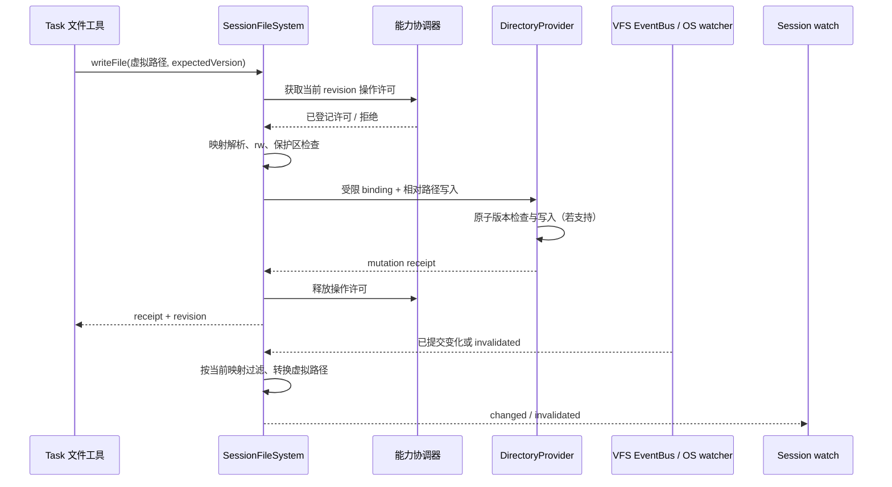
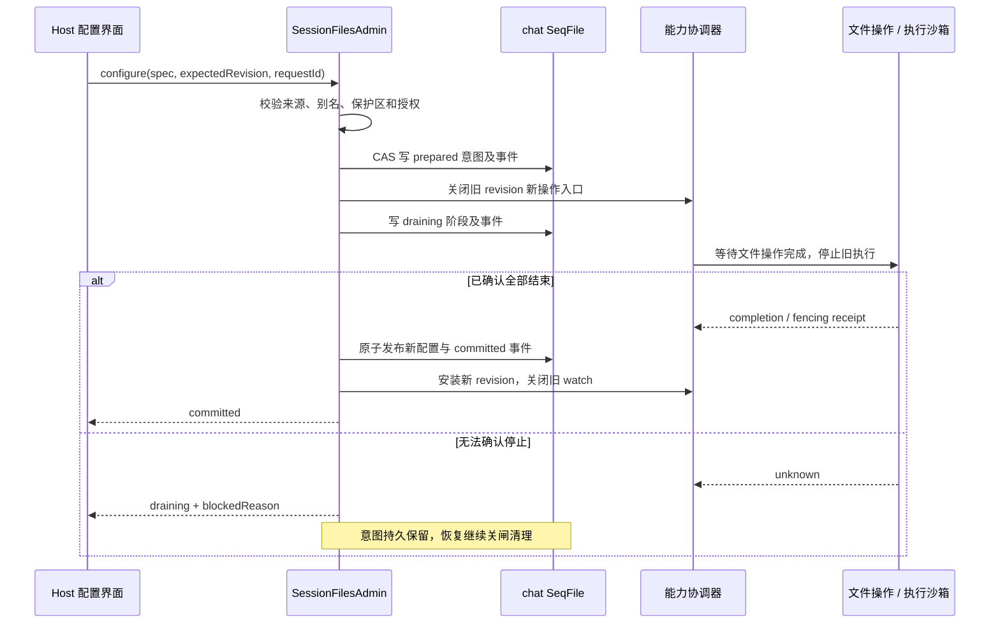
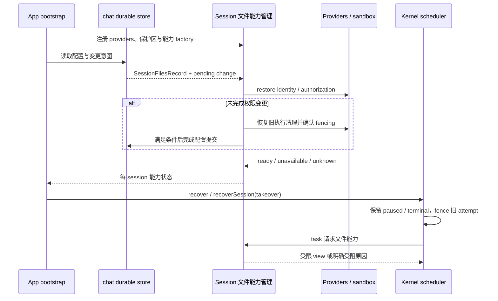
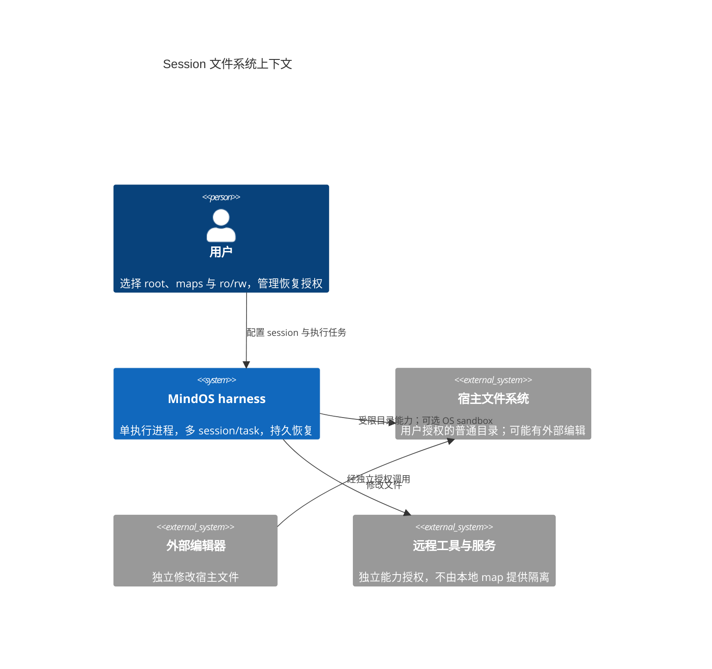
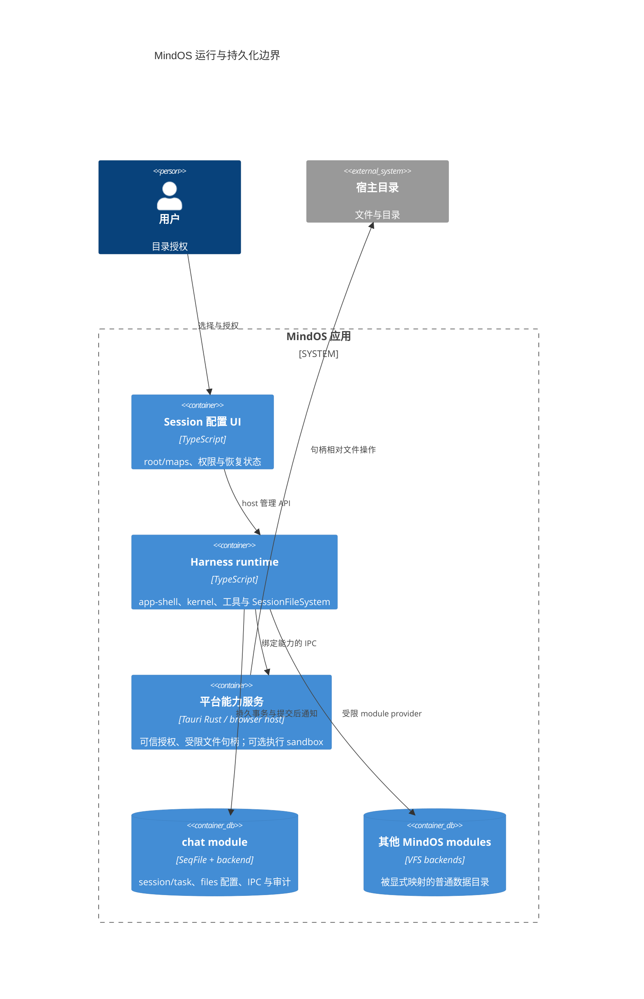
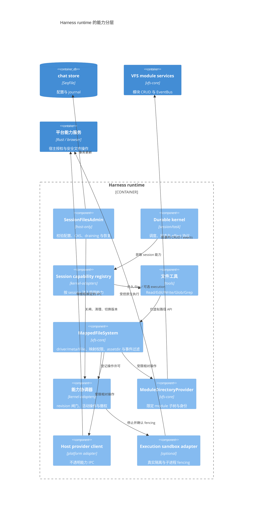
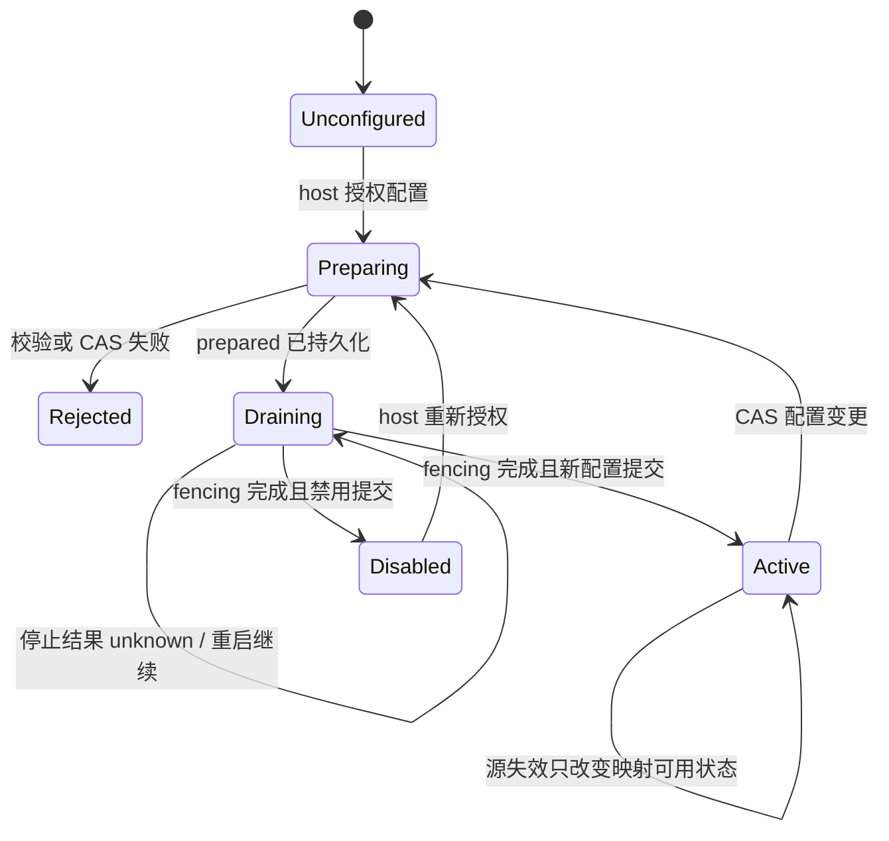
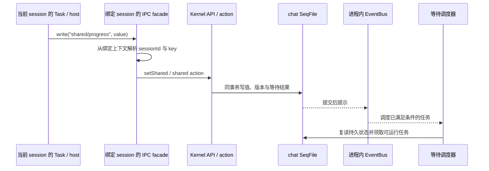
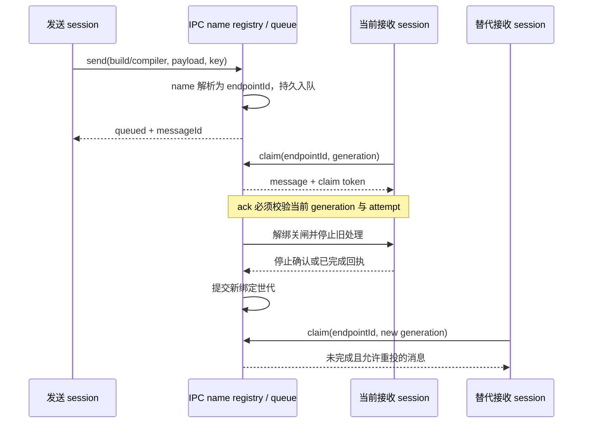
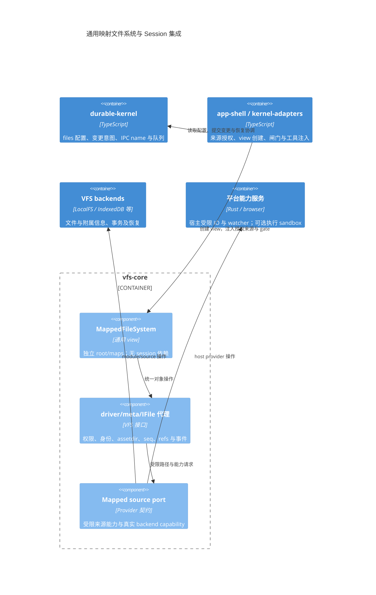

# Session 文件系统：目录映射、权限与恢复

> 2026-09-07 最终决策：旧数据和旧表结构直接作废，无迁移/兼容入口；Session 数据是 session.seq、history.seq、attachments、kernel，运行时投影 /history 和 /attachments。下文历史迁移提案不再执行。
> 历史方案：本文保留演进依据，不再作为当前接口规范。最新目标、旧入口删除范围与验收以 [C4 设计审查](vfs-c4-review.md) 为准；其中单用户每 Session 一条挂载配置取代独立 namespace/binding/grant/export 四套主记录，不再保留 moduleFS/customEngine 源码兼容入口。实际实现状态见 [实现进度](vfs-implementation-status.md)。

状态：设计方案，尚未按本文实现。日期：2026-09-07。

本文规定用户指定 root、映射多个宿主或 MindOS 模块目录时的完整契约、实现分层、迁移步骤与验收标准。文中的类型和方法为拟新增 API，不代表仓库已经提供。实现进度与历史验证见 [工作状态](../stat.md)。

本文采用以下统一架构决策：

- 通用 `MappedFileSystem` 实现在 `packages/vfs-core`，提供独立映射表和完整 VFS 对象能力，不新建 `packages/session-fs`。
- Session 文件配置、权限变更意图和恢复属于 durable-kernel；平台目录访问与执行隔离属于 backend/platform adapter；组装与工具注入属于 app-shell/kernel-adapters。
- Session 内 IPC 默认绑定当前 session，跨 session 业务通信使用持久 IPC name；两者都不依赖用户文件 root/maps。
- 映射文件及其 assetdir、metadata、SeqFile、refs 共用 VFS 接口与生命周期，实际原子性仍以 backend 能力为准。

## 1. 目标与范围

每个 session 有独立文件命名空间。用户选定的 root 映射为该 session 的 `/`，其他目录映射到指定虚拟路径。多个 session 可以选择同一个 root，但不共享各自的映射表和授权。Task 默认继承所属 session 的文件能力，不因知道其他 sessionId、moduleId、nodeId 或宿主绝对路径而获得访问权。

映射源有两种：宿主操作系统目录，以及 MindOS 模块内目录。系统目录可以作为宿主源，例如 `/opt/reference`；这里的“系统目录”不等于 MindOS 的 `etc` 模块。chat 只是 MindOS 内的一个模块，用于集中保存 session/task、等待、mailbox、资源账本等持久状态，不是宿主文件系统，也不是自动暴露给所有 session 的公共目录。

当前运行范围是一个进程执行 kernel、异常退出后由新进程恢复。文件权限不依赖多进程通知协议。独立 OS 进程测试用于验证崩溃与持久性，不意味着支持多个活跃 kernel 同时执行同一 session。

第一阶段交付完整的文件工具访问边界；未经隔离的 Bash、TTY、脚本执行必须拒绝。后续只有平台提供满足本文契约的执行沙箱，才开放原生执行。目录映射本身不构成操作系统沙箱，也不解决网络、外部服务或已授权工具返回数据的全部安全问题。

## 2. 当前实现与缺口

| 位置 | 已有能力 | 与本设计的差距 |
| --- | --- | --- |
| durable-kernel `SessionRecord`、`createSession` | 持久 session 与 storage binding、Task 恢复 | 无独立 root/maps 和文件权限版本 |
| `SessionWorkspaceApi` | 基于 resource handle 的 snapshot/diff/merge | 不是文件命名空间；保留原义，不直接复用名称 |
| vfs-core `IModuleFS` | 模块作用域 CRUD、metadata、事件 | 不是 session 作用域；其隐含 dev/etc 可见性不能继承给 session |
| app-shell `createVFSToolContext` | 给工具提供 read/write/list | 全局文件名搜索、首项回退与路径子串筛选，不能作为授权边界 |
| kernel-adapters session registry | 每 session 的工具/skill scope | 文件与 shell options 仍可全局注入，缺少权限绑定 |
| Tauri 文件与 shell commands | 宿主文件操作与命令执行 | 应用级目录检查或仅检查 cwd，不等于 session 隔离 |
| chat kernel storage | chat asset 下 `.kernel`、集中 catalog | 应保持私有，不通过文件映射直接开放 |

不能声称“文件都有 UUID 所以已经隔离”。session/task ID、VFS node 身份、目录路径、访问权限是不同概念；宿主文件也没有可跨平台直接复用的 VFS UUID。路径编码解决序列化冲突，不解决越权。

## 3. 命名空间与示例

```text
Session A                            源
/                                    host:/home/li/project-a     rw
/reference                           host:/opt/reference        ro
/notes                               module:notes:/research     rw

Session B
/                                    host:/home/li/project-a     ro
/input                               module:files:/incoming     ro

kernel 私有存储                      module:chat:<asset>/.kernel
```

A 的 `/src/main.ts` 解析到宿主 project-a/src/main.ts，`/reference/api.md` 解析到 /opt/reference/api.md。B 不因与 A 共用 root 获得 A 的 `/notes`。工具参数中的 `/etc/passwd` 表示 session 虚拟根下的 etc/passwd，不表示宿主 `/etc/passwd`。

所有工具只接收虚拟路径。展示结果、错误、搜索结果与文件事件优先使用虚拟路径，不泄漏宿主绝对路径或隐藏模块信息。宿主配置界面可以展示真实来源供用户审查。

映射是每 session 的逻辑挂载表，不在 root 创建真实软链接，不修改源目录，也不改变 VFS 全局 mount 表。挂载点及必要父目录是合成目录。root 内同名目录被映射遮蔽，不允许从被遮蔽路径回退访问原内容。

第一版允许 root 加多个互不嵌套的 map；禁止重复目标、map 覆盖 `/`、map 目标互为祖先，以及与已存在普通文件冲突的挂载父路径。root 自然是所有 map 的父级，这是特例。限制可降低遮蔽、撤权与递归删除的歧义，未来支持嵌套映射需提升 schema 并补充测试。

## 4. 持久数据模型

建议新增 `SessionFilesSpec`，避免与已有 `SessionWorkspaceApi` 快照能力混淆：

```ts
type FileAccess = 'ro' | 'rw';
type DirectorySource =
  | { kind: 'host'; authorityId: string; path: string }
  | { kind: 'module'; moduleId: string; path: string };

interface DirectoryMappingSpec {
  at: string;                   // root 固定为 /；其余为虚拟绝对路径
  source: DirectorySource;
  access: FileAccess;
}
interface SessionFilesSpec {
  root: Omit<DirectoryMappingSpec, 'at'>;
  maps: DirectoryMappingSpec[];
}
interface SessionFilesRecord {
  schemaVersion: 1;
  revision: number;              // 单调递增，删除后也不得复用
  state: 'active' | 'disabled';
  root: DirectoryMappingRecord;
  maps: DirectoryMappingRecord[];
}
interface DirectoryMappingRecord extends DirectoryMappingSpec {
  mappingId: string;             // 系统生成稳定 UUID
  sourceIdentity: {
    providerId: string;
    objectId: string;            // provider 验证的目录身份，不是用户指定可信值
    generation: string;          // 防止目录删除后同路径替换
  };
}
```

`authorityId` 是 host 注册的本机文件能力提供方，不是模型提交一个任意绝对路径就可创建的授权。路径用于展示和重新定位；授权能力及恢复凭据由 host 管理。浏览器授权句柄可能存于 IndexedDB 的 host 私有区域，不写入 JSON session 记录。记录不持久化 fd、进程句柄或可直接用于越权的 bearer token。

将 `files?: SessionFilesRecord` 写入 SessionRecord，与 session 更新使用相同 seq 事务。createSession 注册意图必须包含配置或其不可变引用/摘要，崩溃修复不得丢失 files 设置；同 ID 重建遇到不同 storage 或 files 配置返回冲突，不静默改权。配置变更同时持久化审计事件。配置大小、映射数量与路径长度有上限，并以服务端校验为准。

旧 session 的 `files` 缺失表示尚未授予文件能力，不表示全局访问。迁移由用户/host 显式选择 root 和 maps。session 可在无文件能力时继续运行不依赖文件的 task。

## 5. 公开 API 与授权入口

```ts
kernel.createSession({ storage, files?: SessionFilesSpec });
kernel.configureSessionFiles(sessionId, spec, { expectedRevision });
kernel.disableSessionFiles(sessionId, { expectedRevision });
kernel.inspectSessionFiles(sessionId); // host 视图，含状态和诊断

// 只交给该 session 的工具；不提供 map/unmap 或全局 provider
sessionFiles.stat(path);
sessionFiles.readFile(path, options?);
sessionFiles.writeFile(path, data, { expectedVersion? });
sessionFiles.mkdir(path, options?);
sessionFiles.list(path, { cursor?, limit? });
sessionFiles.remove(path, { recursive? });
sessionFiles.rename(from, to, { replace?, expectedVersion? });
sessionFiles.search(query, { root?, cursor?, limit? });
sessionFiles.watch(path, { recursive?, signal? });
```

配置入口属于可信 host 管理面，不属于模型可随意调用的普通文件工具。用户指定 root/maps 是授权事实，选择器只是交互形式；后台 API 同样必须验证调用主体。不得用 task effect grant 中的“允许调用 Write”代替具体路径授权，两者必须同时成立。

inspect 的 session 版本只返回虚拟路径、权限、可用状态及 revision，host 管理版本才能返回真实来源。第一版 task 不自行扩权，也不实现转授权；需要进一步缩权时，可以从 session 能力派生只读或子目录视图，但不能扩大父授权。

## 6. 路径解析与边界规则

每次文件操作遵循同一顺序：验证 session/配置状态 → 捕获 revision 与映射引用 → 规范化虚拟路径 → 选中映射 → 检查操作权限及保护区 → provider 以受限目录能力执行 → 将结果转换为虚拟路径。

规则如下：

1. 对外路径使用 POSIX `/`。相对路径基于虚拟 cwd，默认 `/`。不接受 NUL、反斜线、Windows drive/UNC 形式和 URL scheme；宿主 source.path 则按对应平台规则验证。
2. 规范化 `.` 和多余 `/`；拒绝任何 `..` 段，避免多层工具对路径产生不同解释。URI 边界只解码一次，文件 API 不隐式 percent-decode；不得在检查之后再次解码或改写路径。
3. 按目录段匹配，`/data` 不匹配 `/database`。不使用 basename、contains、全局搜索或“找不到则尝试宿主路径”。不存在即 ENOENT；不可用源返回明确不可用错误。
4. 解析最具体挂载；挂载点不能通过父映射绕过。list 合并合成挂载项，并隐藏被遮蔽的源项。递归遍历维护映射边界与游标，不能在底层 root 一次全扫描后直接返回。
5. 禁止删除、改名或替换挂载点，以及递归删除/移动含挂载点的祖先。跨映射 rename 返回 EXDEV，即使底层碰巧是同一目录；显式 copy 是独立的读和写，不宣称原子 move。
6. ro 禁止创建、写入、截断、删除、rename、修改 metadata/tags、创建链接及会改源的“辅助”操作。rw 仍受 provider 能力和宿主 OS 权限限制。
7. 第一版不允许通过文件 API 创建或跟随符号链接、junction/reparse point、特殊设备、socket、FIFO；只支持普通文件与目录。读取链接可返回受限的类型信息，不能以链接为路径继续解析。
8. protected roots 优先于 rw 映射。catalog、任意 session 的 `.kernel`、宿主实际存放这些记录的目录，以及 host 凭据目录由 host 注册保护，不能由 session 去除。保护按来源身份及实际存储位置校验，不能仅检查文件名 `.kernel`。

同一源目录的别名或祖先/后代重叠可能绕过 ro：将 `/secret` 映为 ro，但又把包含它的目录映为 rw，就能从另一条路径写入。第一版在同一 session 内拒绝 source 重叠和已知目录别名，检查同时覆盖 host 源与有宿主 backing 的 module 源。无法证明跨 provider 不重叠时，拒绝存在混合写权限的组合。不同 session 的权限彼此独立，允许 A rw、B ro，B 会观察 A 的合法修改。

宿主现存硬链接也会造成文件别名。严格 host provider 第一版拒绝多硬链接普通文件的内容访问；如果平台不能可靠识别这类情况，不得宣称该平台具有严格宿主边界。此约束不能防御拥有同等 OS 权限的恶意宿主进程：该进程属于信任边界外，需 OS sandbox、专用账号或隔离存储处理。

## 7. Provider 与操作系统实现

通用 `MappedFileSystem` 放入 `packages/vfs-core`，复用其 driver/meta/IFile/assetdir 与事件契约，不创建另一套文件系统包。它不依赖 session/task/kernel，只接收 viewId、revision、映射与已授权的来源能力。durable-kernel 保存 session 配置与变更意图；kernel-adapters 协调活动能力，app-shell 组装 providers 与工具。provider 内部接口使用已打开的目录能力和相对路径，不能将宿主绝对路径直接交给工具。详细依赖与接口见第 23 节。

### 7.1 ModuleDirectoryProvider

host 从 moduleId 获取指定 IModuleFS，解析已授权目录并绑定目录身份。所有 CRUD、搜索和事件限定在该子树，不暴露原始 `driver`、`meta`、`openFile(nodeId)` 或隐含 dev/etc 入口。只知道 UUID 不能访问对象，按身份操作仍需证明对象属于当前映射子树。

源目录若具有可信稳定 node identity，可在 rename 后重定位并保持映射；删除、替换或移出被允许的 module 边界则标记 unavailable。不同 backend 不一定提供稳定 ID，应通过 capability 显式声明；不支持时降级为严格路径+身份核验，失配必须重新授权，不能猜测重绑。

### 7.2 HostDirectoryProvider

Tauri 增加独立的 session 文件命令组：host 授权/打开来源，随后按 session、revision、mappingId 执行相对路径操作。不扩大全局 fs_* 白名单；也不信任前端传入的 access 字段。Rust 管理面保存真实授权，命令执行面验证调用绑定。前端 JS 与插件默认属于可信应用代码；若要隔离恶意插件，需要独立进程/IPC 主体身份，sessionId 本身不是认证凭据。

Linux 优先使用目录 fd 与 openat2 的 BENEATH、NO_SYMLINKS、NO_MAGICLINKS 等约束；不可用时只有逐级目录 fd 加不跟随链接的等价实现通过竞态测试后才能启用。创建文件通过已验证父目录句柄，rename/unlink 使用受限父目录句柄。不得采用“realpath 检查一次，然后普通绝对路径 open”的存在 TOCTOU 窗口实现。

macOS/Windows 需要各自的句柄相对操作、链接/reparse 检查及目录身份验证实现与测试，未完成则返回 unsupported。目录身份在进程内由打开句柄固定；重启后不能单凭 inode/dev 或路径判断身份永不复用，provider 必须提供足够可靠的持久授权/身份验证，无法确认时要求 host 重新绑定。

用户可以授权宿主系统目录，但只开放 provider 支持的普通目录内容。`/proc`、`/sys`、`/dev` 等虚拟/设备树不在第一版普通目录能力内。宿主 `/` 或包含保护存储的广泛目录第一版拒绝，避免以部分隐藏策略冒充完整宿主隔离。用户选定的普通 root 与宿主根目录 `/` 必须区分。

### 7.3 浏览器

Module provider 可使用现有 IndexedDB backend。宿主目录只能通过浏览器实际支持并已获授权的目录句柄 provider；权限失效或平台不支持时明确不可用，不能退回 Node 或全局 VFS。恢复需要重新查询浏览器权限，必要时等待用户在 host 界面重新授权。浏览器目录句柄的持久化、身份比较和符号链接行为须以目标浏览器实际验证结果为准。

## 8. 权限变更与并发

配置更新使用 expectedRevision CAS，准备新映射全部成功后才发布；任何源失败都不发布半套配置。新版本提交前阻止新的旧版本操作进入，提交后销毁旧 view 的 watch、缓存和句柄入口。

撤权不能假装撤销已经返回的数据，也不能保证收回已经进入 OS 系统调用的写入。定义 configure 成功的边界为：旧 revision 不再接受新操作，旧文件操作已完成或确认停止，旧 native execution 已停止并确认 fencing，新 revision 已持久发布。需要持久的 configuration-change 意图记录保存 old/new revision 与阶段：prepared → draining → committed；重启先继续 draining，不能因为只看到旧 active 配置就恢复已撤销的执行。

准备与 draining 期间不持有长期 seq 事务。耗时操作可取消；无法确认停止则配置保持 pending/blocked，不能超时后宣称撤权成功。文件操作和原生执行登记到 session 的能力使用表，由协调器关闸并等待完成。配置事务只完成最终发布与审计，符合已有 managed physical cleanup 的“确认停止后归还”原则。

同一 root 的多 session 共享真实文件内容，映射不是快照。write/patch 使用 provider 支持的 expectedVersion CAS；不支持可靠 CAS 时返回 capability 不支持，不能把 mtime 近似检查宣传为原子并发保护。普通无条件写入由调用者承担覆盖语义。跨 provider 复制没有分布式事务，部分完成必须可见并可重试。

## 9. 工具、Skill 与原生执行接入

kernel-adapters registry 增加按 sessionId 获取能力的 factory，每个真实 session 注入独立 SessionFileSystem。factory 返回随 revision 更新的代理，每次调用校验当前授权；不能只在第一次创建 scope 时捕获全局或旧授权。legacy scope 仅供明确可信 host 用途，不被真实 session 复用。

app-shell 删除 session 路径上的全局名称搜索，用 SessionFileSystem 实现 ToolVFSContext。FileRead/Edit/Write/Glob/Grep 全部接入同一个 view；扩充二进制、分页、取消与版本接口时提供兼容适配层。Glob/Grep 不能先调用无约束 rg/fd，再在结果层过滤；VFS 失败也不能 fallback 到 node:fs。

Bash、TTY、Skill 脚本、动态 tool handler、插件和 MCP 都是独立能力面。未审核的本机自定义 handler 不因使用 toolService 就自动受控；严格 session 默认拒绝具有不受控本机执行能力的工具，只有明确使用受限文件 API 或已提供隔离契约的 adapter 才能注册。远程工具由独立授权管理，不能把其执行结果算作本地映射隔离的证明。

原生执行接口必须声明实际 enforcement、支持的源类型、ro 保证、子进程终止和恢复 fencing，而非仅声明一个 nativeShell。Linux 可另行实现 mount/user namespace 或受控容器方案，将虚拟根构造成隔离文件树，清除继承 fd、危险环境变量和可逃逸的 proc/device 入口；系统运行库作为明确的只读运行时能力暴露并列入可见性说明。runtime 文件不是隐式访问宿主其他目录的例外通道。

纯 IndexedDB module 没有宿主目录路径，不能直接 bind mount。第一版 file-tools 可访问、native execution 拒绝包含不支持源的请求；后续 FUSE/受控文件桥接需要独立设计。导出副本/执行后回写不等于实时 mount，必须显式标注快照、冲突检测及回写授权，禁止静默替代。

## 10. chat IPC 与文件通知

chat module 集中 durable 存储，使同一进程中的 session/task 状态可以使用同一事务能力与提交后 EventBus 通知。它不会自动赋予 session 读其他 session 私有记录的权限，也不会因为另一个目录被 map 而自动建立 mailbox/resource 授权。跨 session 通信用 kernel message/shared/resource API；需要交换普通文件时显式 map 一个共享用户数据目录。

进程内 kernel 通知继续使用持久状态 + 提交后 EventBus + deadline timer + 启动恢复，不为本设计新增默认周期轮询。事件是加速信号，持久状态才是恢复依据；进程退出期间的事件不能依赖内存 EventBus 保存。

SessionFileSystem.watch 是另一个观察面：module 源订阅相应 VFS 事件，host 源使用 provider 的 OS watcher。chat EventBus 不会自动知道宿主外部编辑器修改文件。watch 先建立订阅再读取基线，以 revision/游标合并并去重；无可重放序列或发生 watcher overflow 时发 invalidated，调用方重新 list/stat。不能承诺每次宿主修改都对应一个可靠事件。

watcher 输出映射后的虚拟路径，权限撤销立即关闭；禁止泄漏未映射节点名。无 waiter 时不建立每任务 watcher，按源/映射共享订阅并引用计数。有 waiter 后先读当前条件，再等待并复读，处理“条件先完成”和“订阅期间变化”。等待者取消或终态移除订阅；重复事件不重复完成 task。文件 watch 默认不是 durable task 条件；若以后支持文件条件，必须定义版本/快照证据与恢复重扫，不能仅保存一次性 watcher 回调。

## 11. 崩溃恢复与 rename

启动顺序：注册 providers 和保护区 → 初始化 kernel → 读取 session files 配置及未完成配置意图 → 重新绑定来源并验证授权/身份 → 安装 session 能力 factory → 恢复 task。相关 task 调度不能早于能力注册完成。

恢复保留 session/task 原有生命周期：paused 保持暂停，terminal 不重跑；可继续的 task 使用同一 sessionId/taskId，旧 attempt 由现有 takeover 机制 fence。某映射不可用时仅拒绝依赖它的操作，其他映射仍可用；需要该来源的任务进入可诊断的受阻/等待授权流程，不能把文件缺失误判为任务成功或自动换成其他同名目录。

绑定 identity 与文件路径分离：支持稳定身份的 module 源 rename 可更新展示路径；宿主进程内 fd 可以固定旧目录对象，但重启需重新验证。删除后同路径新建不继承旧授权。映射根不允许经 session 自己 rename；外部 rename 由 provider 报告 rebound 或 unavailable。namespace revision 变更与文件内容版本分开，文件普通改名不需要重写所有 session/task UUID。

Task 恢复不意味着文件 effect 可以无条件重放。纯 read 可重试；有 expectedVersion 的 patch 可检测冲突；已提交外部写但未提交 effect 回执属于未知结果。需要严格幂等的操作由 adapter 保存 operationId/回执或可验证发布协议，否则沿用 unknown/reconciliation 处理，不能承诺所有文件操作 exactly-once。

## 12. 错误与可观测性

稳定错误码建议包括 EACCES、ENOENT、EINVAL、EXDEV、EROFS、SOURCE_UNAVAILABLE、IDENTITY_MISMATCH、REVISION_CONFLICT、CAPABILITY_UNSUPPORTED、RECONFIGURATION_PENDING。对无权访问的对象不通过错误差异泄漏其真实存在性。权限错误不触发其他路径或 backend 的自动重试。

审计记录包含 sessionId、taskId/可信调用主体、mappingId、revision、操作种类、虚拟路径、结果与时间；真实来源仅进入受保护 host 诊断，默认不记录文件正文或凭据。指标覆盖拒绝次数、source 失效、旧版本操作、watch invalidation、配置 draining 时长、恢复绑定失败。

## 13. 实施计划与代码落点

| 阶段 | 修改位置 | 交付与退出条件 |
| --- | --- | --- |
| P1 配置与恢复契约 | durable-kernel domain/store/kernel/public exports | files 持久化、配置 CAS/意图、旧 session 默认无文件权限；创建与更新崩溃测试通过 |
| P2 文件视图 | vfs-core 的 MappedFileSystem、driver/meta/IFile 代理与 module provider | 路径解析、ro、保护区、身份校验、assetdir/metadata/seq/refs 与事件；不暴露源 raw driver |
| P3 工具集成 | kernel-adapters registry、tools、llm-common、app-shell | per-session factory，消除全局搜索和 native fallback；无隔离 shell/TTY/脚本 fail closed |
| P4 宿主目录 | Tauri Rust session 文件命令、TS provider；浏览器可选 provider | 可信 host 授权、受限句柄操作、宿主普通目录及 asset/metadata 绑定；竞态与恢复验证 |
| P5 配置入口 | app-shell API、session 创建/设置界面 | root 选择、map 添加/移除、ro/rw、冲突诊断、恢复重授权与 pending 展示 |
| P6 原生执行 | 独立 platform sandbox adapter | 实际 OS 隔离、子进程清理、权限变更 fencing；未验收的平台保持拒绝 |

P1–P5 共同构成用户目录映射功能的完整首版，只有 P1/P2 不能宣称已交付。P6 是后续显式开放执行能力的门槛，不能以 cwd 检查代替。每阶段更新 doc/stat.md，仅将通过相应测试的能力标记完成。

## 14. 验证与验收矩阵

| 类别 | 必须覆盖的行为 |
| --- | --- |
| namespace | root、host/module 混合 map、相同 basename、遮蔽、合成父目录、分页与虚拟 cwd |
| 权限 | ro 全部变更操作失败；raw nodeId/moduleId/宿主绝对路径不能绕过；保护区优先；重复与别名源拒绝 |
| 路径攻击 | ..、编码与双解码、NUL、反斜线、前缀混淆、symlink/junction、硬链接、特殊文件 |
| 系统调用竞态 | 校验到打开之间替换目录/链接；创建/rename/delete 的父目录置换；不能访问授权子树外对象 |
| 多 session | 同 root 独立权限；同名文件来自不同源不串读；A 修改可被 B 观察，B ro 不能写 |
| 工具旁路 | Read/Edit/Write/Glob/Grep、rg/fd/native fallback、Bash/TTY、Skill/自定义 handler，恢复后仍受限 |
| 配置并发 | CAS 冲突、操作中 revoke、旧 view/旧句柄失效、watch 关闭、draining 超时不假成功 |
| 恢复 | 配置事务前后 kill、draining 中 kill、目录 rename/删除替换、授权失效、provider 缺失、paused/terminal 保留 |
| 文件效果 | 写成功但 receipt 前 kill；重放检测或 unknown，不重复追加、不误报 exactly-once |
| 事件 | 条件先满足、订阅竞态、重复事件、waiter 取消/不存在、OS watcher overflow 与外部编辑 |
| 平台 | Memory 单元测试、真实 SQLite/LocalFS 集成、Tauri 宿主操作、真实浏览器 IndexedDB/权限句柄 |

app-shell 是端到端集成测试的合适位置，验证创建 session → 配置 → 工具调用 → 进程重启 → task 恢复。路径解析与完整 VFS 代理测试放 vfs-core；真实宿主竞态测试放 provider/Rust 层；持久事务 kill 测试放 backend/kernel 集成层。Memory FS、多 Kernel 实例和 fake-indexeddb 不能替代真实 OS kill、浏览器终止或原生隔离证据。

验收时必须证明：未 map 的目录不能通过任何已开放的本机文件/执行工具访问；不同 session 配置互不污染；rw 不超出 host 实际权限；恢复不扩大权限、不错误重绑同名目录；chat 私有账本始终不可作为普通文件修改。原生 shell 未提供合格 sandbox 时，测试应确认明确拒绝，而不是跳过后声称隔离成功。

## 15. 设计取舍与后续扩展

本设计采用“每 session 文件能力 + provider + 可选 OS 执行沙箱”，与以容器挂载实现 ro/rw 的 harness 在权限目标上一致，但允许 MindOS 虚拟目录作为普通映射源。纯路径白名单、全局 VFS 搜索和仅限制 cwd 不满足该目标；容器 volume 也不能直接挂载纯 IndexedDB 数据。

首版明确不支持嵌套 map、session 自行扩权、跨 provider 原子 rename、透明 IndexedDB 原生命令挂载、任意设备目录、恶意同权限宿主进程隔离，以及所有外部文件操作 exactly-once。后续可增加 task 缩权、可信文件桥接、快照工作区、跨 provider 复制协议与平台沙箱；每项必须独立定义授权、恢复和失败语义，不能隐式扩大已有 session 的权限。

## 16. 接口详细契约

本节是实现目标接口；落地时应拆分为 domain、host、provider、tool 四个导出面，避免工具通过类型可见性意外获得管理权。第 5 节的简写调用以本节参数和返回语义为准。

### 16.1 公共数据与文件操作

```ts
type SessionId = string;
type MappingId = string;
type VirtualPath = string; // runtime 校验；品牌类型不能代替安全校验
type FileVersion = string; // provider 的不透明版本，不跨 provider 比较
interface FileCallOptions {
  signal?: AbortSignal;
}
interface FileEntry {
  path: VirtualPath;
  kind: 'file' | 'directory' | 'link';
  size?: number;
  version?: FileVersion;
  access: FileAccess;
  synthetic: boolean;
}
interface FilePage {
  entries: FileEntry[];
  nextCursor?: string;
  revision: number;
  // 普通目录可能并发变动；无 snapshot token 时不承诺快照分页
  snapshot?: string;
}
interface WriteOptions extends FileCallOptions {
  expectedVersion?: FileVersion | null; // null = 仅允许创建；缺省为无条件写
  operationId?: string;                // 仅 provider 声明支持时可要求幂等
}
interface MutationReceipt {
  revision: number;
  version?: FileVersion;
  operationId?: string;
  durability: 'committed' | 'best-effort';
}
interface SessionFileSystem {
  readonly sessionId: SessionId;
  describe(): Promise<SessionFilesView>;
  stat(path: VirtualPath, options?: FileCallOptions): Promise<FileEntry>;
  readFile(path: VirtualPath, options?: FileCallOptions): Promise<{
    data: Uint8Array; version?: FileVersion; revision: number;
  }>;
  writeFile(path: VirtualPath, data: Uint8Array,
    options?: WriteOptions): Promise<MutationReceipt>;
  mkdir(path: VirtualPath, options?: FileCallOptions & {
    recursive?: boolean;
  }): Promise<MutationReceipt>;
  list(path: VirtualPath, options?: FileCallOptions & {
    cursor?: string; limit?: number;
  }): Promise<FilePage>;
  remove(path: VirtualPath, options?: WriteOptions & {
    recursive?: boolean;
  }): Promise<MutationReceipt>;
  rename(from: VirtualPath, to: VirtualPath, options?: WriteOptions & {
    replace?: boolean; expectedTargetVersion?: FileVersion | null;
  }): Promise<MutationReceipt>;
  search(query: { pattern: string; mode: 'name' | 'text'; regex?: boolean },
    options?: FileCallOptions & { root?: VirtualPath; cursor?: string; limit?: number }
  ): Promise<{ matches: FileMatch[]; nextCursor?: string; revision: number }>;
  watch(path: VirtualPath, options?: FileCallOptions & {
    recursive?: boolean;
  }): AsyncIterable<SessionFileEvent>;
}
interface FileMatch {
  path: VirtualPath;
  line?: number;
  text?: string;
}
interface SessionFilesView {
  revision: number;
  state: 'unconfigured' | 'active' | 'disabled' | 'reconfiguring';
  mappings: Array<{
    mappingId: MappingId; at: VirtualPath; access: FileAccess;
    status: 'ready' | 'unavailable' | 'needs-authorization';
    reason?: string; // 脱敏错误码，不包含隐藏来源
  }>;
}
```

内容接口以 bytes 为基础，ToolVFSContext 适配器负责 UTF-8 文本编解码。实现必须限制单次读取、搜索结果、正则执行时间和递归深度，并支持取消；不能先无限读取再限制返回值。取消不表示已经完成的写入被回滚。

list/search 的 cursor 绑定 session、revision、映射与查询，不能让客户端伪造一个 backend 路径；版本变化后返回 REVISION_CONFLICT，调用方重新开始。MutationReceipt 的 committed 只代表 provider 所声明的持久边界，不能与 kernel effect 回执原子性混淆。所有跨文件原子或 CAS 能力在 provider 不支持时拒绝，不做悄悄降级。

### 16.2 可信配置管理面

```ts
interface SessionFilesAdmin {
  inspect(sessionId: SessionId): Promise<SessionFilesInspection>;
  configure(sessionId: SessionId, spec: SessionFilesSpec, options: {
    expectedRevision: number; // 未配置状态为 0
    requestId: string;        // 同 ID 同参数重放，同 ID 异参数冲突
  }): Promise<ConfigurationChange>;
  disable(sessionId: SessionId, options: {
    expectedRevision: number; requestId: string;
  }): Promise<ConfigurationChange>;
  change(sessionId: SessionId, requestId: string): Promise<ConfigurationChange>;
  watch(sessionId: SessionId, options?: {
    after?: number; signal?: AbortSignal;
  }): AsyncIterable<SessionFilesAdminEvent>;
}
interface SessionFilesInspection {
  view: SessionFilesView;
  record?: SessionFilesRecord;
  pending?: ConfigurationChange;
}
interface ConfigurationChange {
  requestId: string;
  sessionId: SessionId;
  fromRevision: number;
  toRevision: number;
  phase: 'prepared' | 'draining' | 'committed' | 'rejected';
  blockedReason?: string;
}
```

configure 可以返回 draining，只有 committed 表示新配置已经生效；UI/API 不得将“请求已受理”展示为“权限已撤销”。一个 session 同时至多一个未完成变更，其他请求返回冲突。校验失败可 rejected；进入 draining 后不得未经授权自动回滚成继续开放旧权限。恢复凭据丢失导致准备资料不可恢复时保持关闸，由 host 补齐目标配置或显式禁用。

### 16.3 Provider 内部面

```ts
interface DirectoryProviderCapabilities {
  stableIdentity: boolean;
  safeRelativeOperations: boolean;
  conditionalWrite: boolean;
  atomicRename: boolean;
  durableMutation: boolean;
  idempotentMutation: boolean;
  watch: 'none' | 'invalidate' | 'changes';
  nativeMount: boolean;
}
interface DirectoryBinding {
  readonly bindingId: string; // host 内部不透明句柄，不能由工具自选
  readonly identity: DirectoryMappingRecord['sourceIdentity'];
  readonly capabilities: DirectoryProviderCapabilities;
  close(): Promise<void>;
}
interface DirectoryProvider {
  readonly id: string;
  readonly kind: 'host' | 'module';
  prepare(source: DirectorySource, authority: HostAuthorityContext): Promise<DirectoryBinding>;
  restore(record: DirectoryMappingRecord,
    authority: HostAuthorityContext): Promise<DirectoryBinding>;
  execute(binding: DirectoryBinding, operation: ProviderOperation,
    context: ProviderOperationContext): Promise<ProviderResult>;
  watch(binding: DirectoryBinding, options: {
    relativePath: string; recursive: boolean; signal: AbortSignal;
  }): AsyncIterable<ProviderFileEvent>;
}
interface HostAuthorityContext {
  principalId: string;
  authorizationRef: string; // host 管理的授权引用，不接受模型声明
}
interface ProviderOperationContext {
  sessionId: SessionId;
  mappingId: MappingId;
  revision: number;
  signal?: AbortSignal;
}
type ProviderOperation =
  | { kind: 'stat' | 'read'; path: string }
  | { kind: 'list'; path: string; cursor?: string; limit: number }
  | { kind: 'write'; path: string; data: Uint8Array; options: WriteOptions }
  | { kind: 'mkdir'; path: string; recursive: boolean }
  | { kind: 'remove'; path: string; recursive: boolean; options: WriteOptions }
  | { kind: 'rename'; from: string; to: string; replace: boolean;
      options: WriteOptions; expectedTargetVersion?: FileVersion | null };
type ProviderResult =
  | { kind: 'stat'; entry: ProviderEntry }
  | { kind: 'read'; data: Uint8Array; version?: FileVersion }
  | { kind: 'list'; entries: ProviderEntry[]; nextCursor?: string }
  | { kind: 'mutation'; receipt: Omit<MutationReceipt, 'revision'> };
interface ProviderEntry {
  relativePath: string;
  kind: 'file' | 'directory' | 'link';
  size?: number;
  version?: FileVersion;
}
```

ProviderOperation 的路径必须是绑定目录内相对路径；即使 namespace resolver 已检查，provider 仍须拒绝绝对路径、上跳与链接逃逸。search 在视图层通过受限 list/read 实现；后续 native search 只能作为通过同等隔离验证的优化。提供方输出也要验证，防止异常 backend 返回树外路径。所有 execute 调用都由能力协调器登记，工具不能直接获得 DirectoryBinding。

### 16.4 工具注入与执行沙箱

```ts
interface SessionCapabilitiesFactory {
  forSession(sessionId: SessionId): Promise<{
    files: SessionFileSystem;
    vfs: IMappedFileSystem;
    execution?: SessionExecutionSandbox;
  }>;
}
interface SessionExecutionSandbox {
  describe(): {
    enforcement: 'os-sandbox';
    supportedSources: Array<'host' | 'module'>;
    readOnlyEnforced: true;
    descendantFencing: true;
  };
  spawn(spec: {
    sessionId: SessionId;
    revision: number;
    operationId: string;
    executable: string; args: string[]; cwd: VirtualPath;
    env?: Record<string, string>;
  }): Promise<SandboxExecution>;
  recover(operationId: string): Promise<'stopped' | 'running' | 'unknown'>;
}
interface SandboxExecution {
  operationId: string;
  output: AsyncIterable<{ stream: 'stdout' | 'stderr'; data: Uint8Array }>;
  completion: Promise<{ exitCode: number | null }>;
  stop(): Promise<{ state: 'stopped' | 'unknown'; receipt?: string }>;
}
```

execution 接口的类型声明不是安全证明。平台 adapter 必须通过第 14 节验收，才可被 host 注册。executable/cwd 在沙箱内解释，环境变量采用允许名单，输出有背压和上限。stop 必须覆盖后代进程，关闭 UI 的 TTY 不等于停止设备或子进程。恢复返回 unknown 时禁止据此完成撤权；该执行占用继续由 cleanup/fencing 协议管理。

## 17. 事件定义与投递语义

### 17.1 持久管理事件与临时文件事件

```ts
interface SessionFilesAdminEvent {
  eventId: string;
  sessionId: SessionId;
  seq: number;                  // 使用现有 session journal 的序号域
  revision: number;
  occurredAt: number;
  payload:
    | { type: 'files.change-prepared'; requestId: string; nextRevision: number }
    | { type: 'files.draining'; requestId: string }
    | { type: 'files.configuration-committed'; requestId: string }
    | { type: 'files.change-rejected'; requestId: string; code: string };
}
type ProviderFileEvent =
  | { type: 'changed'; relativePath: string;
      change: 'created' | 'modified' | 'removed'; version?: FileVersion }
  | { type: 'renamed'; from: string; to: string }
  | { type: 'invalidated'; reason: 'overflow' | 'reconnected' | 'unknown' }
  | { type: 'unavailable'; code: string };
interface SessionFileEvent {
  sessionId: SessionId;
  mappingId: MappingId;
  revision: number;
  streamId: string;
  sequence: number;             // 仅在当前 streamId 内单调；重启不可用于续读
  payload:
    | { type: 'baseline'; path: VirtualPath }
    | { type: 'changed'; path: VirtualPath;
        change: 'created' | 'modified' | 'removed'; version?: FileVersion }
    | { type: 'renamed'; from: VirtualPath; to: VirtualPath }
    | { type: 'invalidated'; path: VirtualPath; reason: string }
    | { type: 'unavailable'; code: string }
    | { type: 'closed'; reason: 'revoked' | 'disabled' | 'session-closed' };
}
```

管理事件与对应配置阶段在同一 seq 事务提交，随后发布 EventBus 提示；消费者按 seq 重读日志，重复提示无副作用。journal 如有保留窗口，过旧 after 返回明确需重建快照的错误，不能静默丢历史。source 的临时可用状态属于运行时观察，不能仅靠一次 unavailable 事件永久修改持久授权。

文件事件不进入 chat journal 保存每次文件内容变化，避免把外部文件系统伪装成事务日志。baseline 表示 watch 已建立且初次观察可开始，不宣称原子目录快照；订阅期间缓冲事件，不能对齐版本时发送 invalidated。rename 只有一侧位于授权可见树时，转换为 removed/created，不泄漏另一侧路径。订阅者缓冲溢出合并为 invalidated，不允许无限占用内存。

### 17.2 文件写入事件流



图中返回回执与 watcher 通知不存在通用先后保证；provider 可能合并或重复事件。工具调用成功不以 watcher 到达为条件，文件事件也不能证明 kernel effect 回执已提交。

### 17.3 配置撤权事件流



prepared 提交到进程内关闸之间也必须由同一 session 管理锁串行化操作入口；在该窗口进入的操作计入旧 revision draining。恢复只要看到未完成意图就先关闸。最终发布与打开新入口之间若崩溃，重启按 committed 配置重新绑定，不再恢复旧入口。

### 17.4 启动恢复事件流



## 18. Mermaid C4 架构视图

以下使用 Mermaid 的 C4Context/C4Container/C4Component 语法。查看器需支持 Mermaid C4 扩展；图后的边界说明同样构成设计契约。

### 18.1 C4 系统上下文



### 18.2 C4 容器视图



这里的容器是 C4 的运行/存储单元，不表示所有项都对应 Docker 容器。浏览器部署没有 Rust 服务，不能因此自动获得宿主路径访问；每个平台只能注册实际支持的 provider。

### 18.3 C4 runtime 组件视图



工具没有连向全局 VFS、chat store 或平台原始 fs/shell commands 的边。实际接入中如存在此类调用路径，必须移除或归为不向 session 开放的可信 host 能力；只修改图或 TypeScript 接口不足以形成边界。

## 19. 状态机与实施依赖



Rejected 是变更请求的终态，不是 session 文件能力的新状态；旧配置仍在，但仅适用于尚未进入 draining 的拒绝。该图合并展示配置请求与能力状态，持久模型应分别记录它们。运行时来源 ready/unavailable 与 session running/paused/terminal 也是独立维度，不应压成一个枚举。

实现依赖顺序为：P1 配置事务与恢复 → P2 安全视图/provider 契约 → P3 工具去旁路 → P4 宿主安全实现 → P5 用户配置闭环。P4 可以在 P2 契约稳定后开展，但 P3/P4 未验收前不得开放宿主映射给模型。P6 必须在同一权限表可被 OS sandbox 可靠执行后才开放 Bash/TTY。

## 20. Session 内 durable IPC 的相对寻址

### 20.1 决策：默认相对当前 session，不暴露存储路径

Session 内 IPC 应采用绑定当前 session 的简洁访问方式。调用方不填写 chat module、asset 目录、`.kernel` 或 sessionId；这些由 kernel 根据当前执行上下文解析。这里的“相对”是相对 IPC 命名空间，不是相对文件工具 cwd，也不是相对宿主 root。修改文件 cwd、map 或 root 不会改变 IPC 指向。

当前已有 API 已部分满足这一点：`session.getShared(key)`、`session.setShared(key, value)`、`session.attachTask(taskId)` 和 `session.signal(taskId, signal)` 都由 SessionHandle 隐式绑定 sessionId；但尚无统一的 IPC 路径 facade。不能把拟新增的 `ipc.read('shared/progress')` 描述为现有 API。

已有方式即可保持简洁：

```ts
await session.setShared('progress', { completed: 3 });
const progress = await session.getShared('progress');
const worker = await session.attachTask(workerId);
const status = await worker.stat();
```

### 20.2 两套根，避免混淆

| 调用入口 | 相对基准 | 示例 | 是否受用户 map 控制 |
| --- | --- | --- | --- |
| `files` | session 文件虚拟根与 cwd | `files.readFile('src/main.ts')` | 是 |
| `ipc` | 当前 session IPC 根 | `ipc.read('shared/progress')` | 否；由 kernel 对象授权控制 |
| 跨 session 命名 IPC | 当前 kernel IPC domain 的已授权端点 | `ipc.send('build/compiler', topic, payload, options)` | 否；map 不授予 IPC 权限 |

不在用户文件根自动放置一个可写 `.ipc`/`.kernel` 目录。若将来提供文件式 IPC 挂载，它必须是调用 kernel API 的专用协议设备，而非实际 seq 文件透传，并独立定义读写命令、权限和事务语义。首版采用独立 `ipc` 入口，避免与用户已有目录冲突。

### 20.3 拟新增相对 IPC facade

优先保留类型化对象 API，路径 facade 用于工具协议、调试与需要统一寻址的调用方；两者共用已有 store、等待与 mailbox 实现，不增加第二套持久账本。

```ts
interface SessionIpc extends NamedIpc {
  // 仅 shared 可通过此读写入口修改；不提供任意对象 write。
  read<T extends JsonValue>(address: `shared/${string}`):
    Promise<SharedStateEntry<T> | undefined>;
  write<T extends JsonValue>(address: `shared/${string}`, value: T,
    options?: SharedStateWriteOptions): Promise<SharedStateEntry<T>>;
  task(taskId: string): Promise<TaskHandle>;
  sendLocal(topic: string, payload: JsonValue, options?: {
    targetTaskId?: string; expiresAt?: number;
  }): Promise<CrossSessionMessage>;
  // watch 返回现有持久 journal 的提示，消费者复读对应状态。
  watch(options?: { after?: number }): AsyncIterable<EventEnvelope>;
}
```

`ipc.sendLocal()` 默认发到当前 session，底层复用 mailbox 协议；传入 targetTaskId 时验证目标属于当前 session。未指定 task 的 topic 消息是否广播、如何消费与确认，必须沿用现有 mailbox 语义，不因为添加简写而变更投递规则。Task program 内写入/发消息仍通过现有 reducer action 进入 decision 事务，不能在纯 reducer 中调用异步 facade 产生事务外副作用。

第一版路径形式只定义 `shared/<key>`；Task、resource 等保留 `ipc.task(id)` 或现有 resources API，避免创造通用文件 write 绕过生命周期。将来添加 `tasks/<id>/status` 只读投影时，需逐个声明允许的操作，不能默认所有 record 都可直接修改。

### 20.4 路径、身份与权限规则

- 可接受一个前导 `./`，其余地址必须是 IPC 相对地址；拒绝绝对路径、`..`、反斜线、NUL 和未知 namespace。不支持通过 `../<sessionId>` 跳到另一 session。
- `shared/` 后剩余文本作为一个 shared key，例如 `shared/build/progress` 对应 key `build/progress`，不是实际多层文件路径。不隐式 URL 解码，存储层统一编码；已有不符合新 facade 地址规则的 key 仍可由原始类型化 shared API 访问，避免破坏兼容性。
- sessionId/taskId/resourceId 仍是稳定身份，短地址只是去掉重复上下文，不把 UUID 改成易冲突的文件名。第一版不引入 task 昵称；后续别名须持久化并定义唯一性、重绑和删除语义。
- IPC 句柄由可信运行上下文绑定 sessionId/taskId 和权限，不能让工具参数覆盖绑定。能够构造短路径不等于具有目标对象权限。
- 跨 session 业务通信使用第 21 节 IPC name，调用方不依赖目标 sessionId。既有 `sendToSession` 保留为直达实例的兼容入口；不通过 peer 直接读取另一 session 私有 shared，也不允许任意路径穿越。

### 20.5 事件与恢复保持原协议



先写后等待时读取当前值/版本，先等待后写时使用持久等待注册与提交唤醒。没有 waiter 时仍保存 shared 值或 mailbox 消息，不需要人为保留内存监听器。事件遗漏或进程退出后由原有启动恢复重建调度；相对地址在恢复时重新绑定同一个 sessionId，不依赖用户目录是否 rename 或映射是否可用。

验收增加：同一短地址在不同 session 中互不串读；更改文件 cwd/root/maps 不影响 IPC；跨 session 路径逃逸失败；facade 与原 API 的版本、消息回执和等待结果一致；恢复后无需改写调用方短地址。该 facade 可在文件映射实施期间独立添加，但不得把用户文件目录迁移作为 IPC 正确性的前置条件。

## 21. 跨 session IPC name：与接收 session 解耦

跨 session 推荐入口与第 20 节一致：业务调用方使用 IPC name，不直接以 sessionId 作为服务地址。sessionId 仍用于内部身份、审计与执行归属。当前实现的 CrossSessionMessage、TaskMessageRequest 和 mailbox delivery 仍绑定 targetSessionId（Task 消息还绑定 targetTaskId）；**尚未实现命名端点、绑定世代和端点队列**，不能用 sendToSession 的简单别名声称已经解耦。

### 21.1 命名对象与接口

IPC name 表示持久命名端点，例如 `build/compiler`；一个端点可以暂时没有绑定 session。第一版是单活消费者的持久队列，不隐含广播或多消费者负载均衡。端点归可信 host principal 所有，接收 session 只是绑定的服务实例，session 关闭不删除端点。

```ts
interface IpcEndpoint {
  endpointId: string;           // UUID，删除重建不得复用
  name: string;                 // 当前 kernel IPC domain 内唯一
  revision: number;             // 管理配置 CAS
  generation: number;           // 绑定世代，解绑/重绑时单调递增
  state: 'active' | 'closing' | 'deleted';
  ownerPrincipalId: string;
  binding?: { sessionId: string; taskId?: string };
}
interface NamedIpc {
  send(name: string, topic: string, payload: JsonValue, options: {
    idempotencyKey: string; expiresAt?: number;
  }): Promise<{ messageId: string; endpointId: string; status: 'queued' }>;
  // 查询须验证发送者身份；queued/delivered 不表示已执行业务。
  receipt(messageId: string): Promise<{
    status: 'queued' | 'claimed' | 'acknowledged' | 'rejected'; code?: string;
  }>;
}
interface IpcEndpointAdmin {
  create(name: string, options: { requestId: string }): Promise<IpcEndpoint>;
  bind(name: string, receiver: { sessionId: string; taskId?: string },
    options: { expectedRevision: number; requestId: string }): Promise<IpcEndpoint>;
  unbind(name: string, options: {
    expectedRevision: number; requestId: string;
  }): Promise<IpcEndpoint>;
  destroy(name: string, options: {
    expectedRevision: number; requestId: string;
  }): Promise<IpcEndpoint>;
}
```

示例：`ipc.send('build/compiler', 'compile', input, { idempotencyKey })`。调用方不随服务 session 重启或替换修改目标。第一版名称不跨 kernel IPC domain，跨 domain transport 留作扩展。名称为严格相对地址，沿用禁止上跳、绝对路径及隐式解码的规则；registry 存储键统一编码。

name 不是访问凭据。create/bind/unbind/destroy 属于可信 host 管理面；send、consume 和 inspect 具有独立授权，默认拒绝未授予的调用主体。转交接收 session 不自动授予其发送方或其他端点的能力。

### 21.2 队列、解绑与恢复语义

- 名称不存在时 send 返回 ENDPOINT_NOT_FOUND，不根据发送请求自动创建，避免误拼写与名称抢占。端点存在但没有绑定时，消息进入端点持久队列；配置数量、字节和保留时限上限，超限返回明确错误。
- 发送事务将 name 解析为 endpointId 并持久保存该 ID；重试不能重新按 name 指向另一个新端点。幂等身份包含发送主体与 key，参数摘要包含 endpointId、topic、payload 和期限。同 key 异参数冲突。
- 接收 claim 记录 messageId、endpointId、generation、接收 session/task 和 attempt fencing 身份。队列是唯一投递真相；session inbox 只能是带 claim 引用的可恢复投影，不能同时维护两个无原子关系的“已消费”标志。
- unbind 增加 generation，撤销旧消费者领取与 ack 权限；未领取消息保留。旧 claim 转交前，必须停止旧处理器或确认它不能再产生外部副作用。账本 generation 只能 fence 内部提交，不能停止旧设备操作。
- 处理结果已提交并 ack 的消息不重投；已领取但未确认的消息可能重投。接收业务需按 messageId 去重，外部副作用采用幂等或 reconciliation；不承诺 exactly-once。
- bind 替换活动接收者需要持久 draining 意图，流程与第 17 节权限变更一致。未确认停止时维持关闸并返回 pending；上述 bind/unbind 的 Promise 只有真正完成才返回 IpcEndpoint，host 请求超时使用 requestId 查询管理操作进度，不将超时视为成功。
- session close/unavailable 使绑定停止接收，端点与队列继续存在；是否绑定替代 session 由 host 决定，不搜索同名 task 猜测目标。重启恢复 registry、队列与绑定世代，再恢复接收 task。
- destroy 先 closing 拒绝新发送，清理消费者 claim，给未完成消息持久 rejected 回执，最后写 tombstone。重建同名端点使用新 endpointId，旧消息不会迁移过去；旧 receipt 保留至明确 GC 策略允许清理。

registry、endpoint queue、claim、receipt 放在 chat 的 kernel 私有事务存储内，与普通 maps 无关。同一事务域内可以原子更新队列与接收投影；不在同一事务域的兼容 session 必须使用显式 outbox/inbox 协议，不能假设放在同一个 module 名称下就天然跨 backend 原子。



实施需新增 endpoint domain/store、绑定管理、队列消费者与 task action；保留 sendToSession 作为明确直达某实例的兼容接口。新增验收覆盖：未绑定入队、名称不存在、重名竞争、重绑与 ack 竞态、旧世代提交失败、消费者外部副作用 unknown、同名删除重建、队列限额及各事务边界 kill 恢复。

## 22. 映射文件统一使用 VFS 与 assetdir

第 7、16 节的文件视图统一由 vfs-core 的 **MappedFileSystem 提供完整、受限的 VFS 兼容面，而不止 read/write/list 的简化接口。映射内文件支持 assetdir、IFile、tags、SeqFile、refs 和事件，是否可用由 provider 的真实能力决定。** 第 16 节 bytes 文件 API 保留为工具便捷适配器，不再作为完整功能边界。

现有 vfs-core 已定义 IFSDriver、IFSMetaDriver、IFile/AssetObj，支持文件及伴生 assetdir 的统一操作；但是当前尚未实现将这些能力安全地投影到 per-session maps。直接返回源 IModuleFS 会暴露树外节点、原始 metadata 和内部账本，不能采用。

### 22.1 统一接口与包装规则

```ts
interface IMappedFileSystem extends FSEventEmitter {
  readonly viewId: string;
  readonly revision: number;
  readonly driver: IFSDriver;       // 代理：路径全部是 view 虚拟路径
  readonly meta: IFSMetaDriver;     // 代理：每个 owner/引用/seq 路径均校验
  capabilitiesAt(path: string): Promise<FSCapabilities>;
  openFile(nodeId: string): IFile;  // nodeId 只能解析为当前视图内有效节点
  dispose(): Promise<void>;
}
```

此处 IFSDriver.moduleId 需要承载明确的合成 view identity，例如 `session-view:<sessionId>`，不能伪装成源 moduleId。落地前审查所有依赖 moduleId 的调用方，必要时抽取共享 IFileSystemDriver 接口供 module/session driver 实现，避免让消费者拿合成 ID 向全局 VFS 查询。FSNode.id、path、parent、asset owner、引用和返回 IFile 都经代理转换，不返回可直接打开源文件的裸对象。

视图 nodeId 是 view 内不透明引用，关联 mappingId、源对象身份和世代；不能仅以 source nodeId 做全局 lookup。旧句柄每次使用都验证当前权限，map 撤销或目标身份替换后失效。合成挂载目录没有真实 backend node，需提供受限节点描述。全局 capabilities 是保守交集；capabilitiesAt 才反映目标路径能力，异构 map 不能声称整个 view 都支持同一种事务。

### 22.2 Assetdir 授权与存储

```ts
const node = await fs.driver.getNode('/notes/report.md');
if (!node) throw new Error('File not found');
const file = fs.openFile(node.id);
await file.asset('diagram.svg').write(svg);
await fs.meta.assets.putAsset('/notes/report.md', 'summary.json', json);
```

两种 asset API 必须操作同一 owner 的同一伴生目录，不能各自存一份。沿用 vfs-core 的 owner/assetdir 关联、首次写入创建、rename/move 跟随与删除级联语义。

- map 授权的是文件及其用户可访问附属信息。asset、tags、refs、seq 写入继承 owner 的 rw；ro 文件不能在旁路 metadata store 写入注释。若需要给 ro 文档加个人注释，应在另一个显式 rw 对象保存引用，不能修改原 owner。
- assetdir 是 owner 的附属对象，通过 owner 能力访问，不要求用户再次 map 实际 `_filename` 路径。隐式授权只覆盖 provider 验证的真实 owner 关联，不覆盖任意同名下划线目录。
- assets.getAssetDirPath 返回虚拟路径；该路径仍经过同样代理检查，不能返回宿主或源 module 路径。includeHidden 不表示绕过保护区；repair/removeAssetDir 等管理操作也必须受限。
- chat 文件的用户附件可以开放，但其 `.kernel` 子树和任何 kernel 私有记录继续拒绝，即使 owner 可读写也不能读取、枚举、repair、复制或级联删除这些记录。删除/rename 会影响保护数据时整项拒绝，不允许先部分修改。
- map 指向文件所在目录，assetdir 必须位于该 provider 授权的复合对象范围。发现 owner 关联指向任意树外路径时不能盲目跟随；host 明确授权的 provider 私有 metadata 区可作为复合对象内部实现，但只通过 owner API 暴露。

### 22.3 宿主普通文件的 VFS 元数据

module 源复用现有 backend 的 asset/metadata 实现。host 源需要真正的 VFS backend/provider 层：复用 LocalFS 的数据模型与生命周期协议，但底层 IO 必须替换为第 7 节的受限目录操作，不能把现有应用级 TauriFsOps 直接视作 session 安全实现。

优先复用源目录已有可信 VFS sidecar/assetdir 关联；普通宿主目录首次使用时由 host 显式选择启用 metadata 存储。可以采用目录内伴生存储或 provider 私有 sidecar，但必须记录 store identity、owner stable identity、格式版本及迁移策略；同一物理来源在不同 session 中共享同一份对象 metadata，不能因 mappingId 不同复制成各自的信息孤岛。

目录内模式的初始化属于写操作，ro 不允许自动创建目录或数据库。私有 sidecar 模式也不能借此绕过 owner ro；host 的基础身份登记与用户修改 asset/tags 是不同操作。无法安全绑定 owner 或 backend 不支持时返回 FSCapabilityError，不能悄悄把附件写到 chat session 私有目录并宣称已统一。

### 22.4 生命周期、事务与事件

rename/move/delete/copy 必须将主文件、assetdir、tags、refs 与 SeqFile records 作为同一 VFS 复合对象处理。复用已有 LocalFS rename 意图/恢复机制时，检查它覆盖的具体数据范围；对 host 外部直接 rename，无法可靠识别对象时标记需协调修复，不按 basename 重新绑定资产。

同映射且 backend 支持的事务才允许 driver.transaction；第一版事务预先绑定一个 mapping/provider，操作访问其他 map 时拒绝并回滚已支持事务内的修改。预先拒绝不支持原子性的 provider，不能执行部分操作后才宣称无法回滚。SeqFile 记录事务与普通文件 bytes 事务是不同能力，不能混为一体。跨 map copy 属显式可恢复操作，目标生成新身份并复制可见 asset，引用策略需声明，不复制保护记录。

VFS node/asset/tag/ref/seq 事件在相应真实提交后经视图过滤并转换路径；保留原事件类型以便已有消费者复用，同时由第 17 节 watch 适配器生成简化事件。rollback 不发布成功事件；多存储恢复协议只能在确定提交后发布完成通知，未完成时发 invalidated。搜索沿用 vfs-core 规则：asset 命中投影到可见 owner 并去重，不返回内部原始路径。refs 不泄漏未授权目标的身份或标题，写入 refs 的两端均需符合操作权限。

### 22.5 对实施计划的调整

P2 在 vfs-core 交付 MappedFileSystem 的 driver/meta/IFile 全链路代理，P4 需要交付宿主 provider 的 asset/metadata 绑定；不再将 assetdir 支持视为可省略的工具附加项。能力不支持的平台明确报告限制，不以空成功替代。

增加验收：module/host map 的同一 IFile API、asset 首次创建与 ro 拒绝、同源多 session metadata 一致、文件 rename/move/delete 的资产联动、跨 map 事务拒绝、SeqFile CAS、引用过滤、内部资产搜索投影、旧句柄撤权、恶意 owner 关联、保护 `.kernel` 的级联操作、主文件与 sidecar 更新各崩溃点恢复。统一的是接口、对象关系与生命周期，不是声称所有 backend 都具有相同物理布局和原子性。

## 23. vfs-core 模块归属与最终组装契约

### 23.1 职责与依赖

`MappedFileSystem` 是通用文件视图，不是一种持久 backend，也不是新的 MindOS module。一个 module、一个工具沙箱或一个 session 都可以使用它。每个实例持有自己的映射配置，不调用全局 mount/unmount 修改其他使用者的视图。

| 所属位置 | 新增/复用内容 | 不承担的职责 |
| --- | --- | --- |
| `vfs-core` | IMappedFileSystem、MappedFileSystem、映射解析、受限 driver/meta/IFile 代理、来源 capability、asset 生命周期与事件投影 | session/task 状态、IPC name、进程接管、设备停止 |
| `vfsdriver-localfs` 等 backend | 源文件/metadata/assetdir 存储、稳定身份、原子性及恢复协议 | session 授权 UI 和 Task 调度 |
| Tauri/browser platform adapter | 可信宿主授权、受限句柄 IO、OS watcher、可选 OS execution sandbox | 自行解释 durable task 状态 |
| `durable-kernel` | session files 持久记录、CAS/配置意图、IPC name 与 durable 队列、恢复顺序 | 直接实现宿主文件 syscall 或依赖工具包 |
| `kernel-adapters` | 将 session 与 view 绑定、revision 闸门、活动操作登记、执行 cleanup 协调、工具适配 | 修改全局 VFS mount 表 |
| `app-shell` | 注册 providers/保护区、管理权限入口、初始化与注入顺序 | 通过全局文件名搜索猜测 session 文件 |

依赖方向是集成层调用 kernel 与 vfs-core；kernel 通过注入的能力生命周期 port 请求关闸/清理，不反向 import kernel-adapters。vfs-core 不 import durable-kernel、app-shell、tools 或 Tauri。平台依赖通过最小 provider 接口注入，浏览器构建不加载 Node/Rust 实现。

建议文件落点（拟新增，可随仓库命名规范调整）：

```text
packages/vfs-core/src/interfaces/services/mapped-fs.ts
packages/vfs-core/src/interfaces/storage/mapped-source.ts
packages/vfs-core/src/impl/mapping/MappedFileSystem.ts
packages/vfs-core/src/impl/mapping/MappedDriver.ts
packages/vfs-core/src/impl/mapping/MappedMetaDriver.ts
packages/vfs-core/src/impl/mapping/MappedFile.ts
packages/vfs-core/src/impl/mapping/MappingResolver.ts
packages/vfs-core/tests/                         # 映射及复合对象行为
packages/durable-kernel/src/domain/             # files 配置、IPC endpoint
packages/durable-kernel/src/ports/              # 能力生命周期协调 port
packages/kernel-adapters/src/runtime/           # session view registry 与闸门
```

### 23.2 通用创建接口

第 4 节的 SessionFilesRecord 是持久管理输入，不能直接作为不可信工具传参创建授权。host 校验并绑定源之后，转换为以下 vfs-core 输入：

```ts
interface MappedSourceCapability {
  readonly sourceId: string;
  readonly identity: {
    providerId: string; objectId: string; generation: string;
  };
  readonly access: FileAccess;   // 来源授权上限，映射只能缩权
  // 由 provider 创建并验证；不得仅相信普通 JSON 对象的字段。
  // 具体 CRUD/meta/event 方法使用 vfs-core 契约，内部保有受限目录句柄。
}
interface MappedFileSystemOptions {
  viewId: string;
  revision: number;
  root: { source: MappedSourceCapability; access: FileAccess };
  maps: Array<{
    mappingId: string;
    at: string;
    source: MappedSourceCapability;
    access: FileAccess;
  }>;
  rootMappingId: string;
  policy: MappedAccessPolicy;
}
interface MappedAccessPolicy {
  // 所有 driver/meta/IFile/asset 操作统一进入此钩子。
  // vfs-core 自己也检查映射权限，钩子不能扩大来源权限。
  enter(operation: {
    viewId: string; revision: number;
    mappingId: string; kind: 'read' | 'write' | 'watch';
    paths: string[];
  }): Promise<{ release(): void }>;
  // 实际实现使用 provider 校验的来源身份/对象关系，不只匹配路径文本。
  isProtected(sourceId: string, relativePath: string): Promise<boolean>;
}
declare function createMappedFileSystem(
  options: MappedFileSystemOptions,
): Promise<IMappedFileSystem>;
```

MappedSourceCapability 在这里是省略 IO 方法的授权契约骨架，落地时必须关联 provider 的实际实例或不可伪造授权句柄；工具不能通过自己构造同形对象注册来源。第 16.3 节的 DirectoryProvider 是 host 绑定层接口，其中 sessionId/HostAuthorityContext 不能原样下沉到 vfs-core：通用 IO context 使用 viewId/revision/mappingId；host adapter 在外层关联 session 与 principal。

每个 MappedFileSystem 的映射表不可变。reconfigure 由上层创建新 revision 的 view，关闸旧操作、完成持久提交后切换 facade 指针；dispose 关闭该 view 订阅并释放它持有的来源引用，不擅自销毁共享 provider/backend。旧 view 引用即使未被 GC，也因 policy gate 拒绝继续执行。watch 的许可只用于订阅建立，不长期占用 draining 的普通操作计数；订阅另行登记，撤权时关闭，避免等待永久 watcher 导致死锁。

### 23.3 Session 便捷接口与完整 VFS 的关系

```ts
interface SessionFileCapabilities {
  readonly sessionId: string;
  readonly vfs: IMappedFileSystem;    // 完整 VFS 对象操作
  readonly files: SessionFileSystem; // 第 16 节工具便捷接口
}
```

两个入口使用同一映射解析、同一来源对象与同一闸门。files 适配 vfs，而不是两套独立 provider 调用实现。SessionCapabilitiesFactory 返回上述能力及可选 execution；已有只使用 files 的工具无需知道 module/backend。共享的 IFile 抽象应依赖受限 driver/meta，而不是通过全局 manager 重新获取源 IModuleFS。

首版保留 IFSDriver 的现有方法签名，map 内不支持的方法明确抛 FSCapabilityError。若需要消除 moduleId 的语义耦合，抽取与模块无关的 driver 基接口，同时为现有 IModuleFS 保留兼容 wrapper；不能通过全局注册一个假的 session module 来规避类型问题。

### 23.4 更新后的 C4 通用组件边界



### 23.5 整体验收与完成声明

目录映射交付必须包含通用 vfs-core 视图、session 持久集成、宿主 provider、assetdir/metadata 绑定与用户配置闭环。IPC name 是 durable-kernel 的另一项交付，验收包含 registry/queue/binding generation，不能因文件 map 完成就将它标记完成。现有 sessionId 消息、现有 module assetdir 与拟实现 mapped view 三者分别记录测试结果。

该划分统一文件信息的接口和存储关联，同时保持 durable IPC 通过 kernel 协议访问；用户 map 可以包含普通共享数据，但不会暴露 chat 私有账本。文档中的全部新增接口目前仍是设计目标，后续实现按 P1–P6 和第 21 节命名 IPC 的独立验收推进。
