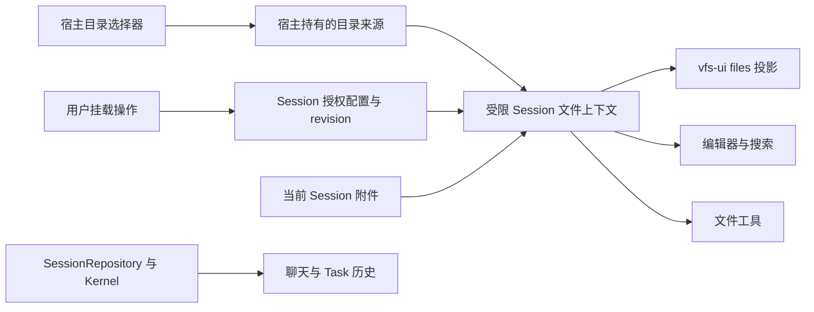

# Session 挂载与访问边界

状态：已实现，2026-09-08。本文替代“完整 SessionFS 加隐藏目录”和“打开时自动挂载 admin-home”的旧行为。平台能力及验证限制见第 5、7 节。

## 1. 核心契约

Session 可访问的用户文件 = 自有 attachments + 用户明确授予的挂载。

- 来源注册只意味着宿主能够连接该来源，不授予任何 Session 访问权。
- 未挂载目录不能通过列目录、绝对路径、搜索、编辑器、附件引用或后台 Task 访问。
- vfs-ui、文件编辑器、文件工具使用同一份受限文件上下文；侧栏不是授权过滤器。
- /etc、/var、/dev、/run、history、session.json 不进入用户文件上下文。Session 历史与 Task 信息继续由 repository/Kernel 业务接口提供。可信运行时需要的系统投影不通过用户文件工具公开。
- 挂载对整个 Session 生效，包含各 history branch；branch 是对话状态，不能隐式更改授权。

附件沿用唯一的 `/attachments` 命名，不添加 `/attachment` 别名。

## 2. 目录

新 Session：

```text
<sessionId>/
  tasks/
  files/
    attachments/          Session 自有附件，可读写
```

用户选择目录后，例如：

```text
<sessionId>/
  tasks/
  files/
    attachments/
    workspace/            rw → /home/admin/projects/demo
    notes/                ro → /home/admin/notes
    reference/            ro → 用户选择的宿主目录
```

files 是 Browser 前缀。Agent 和编辑器使用 `/workspace/src/a.ts`，不使用 `/<sessionId>/files/workspace/src/a.ts`。

挂载点采用根下一层名称，UI 默认建议 workspace 或来源目录名；名称冲突要求重新命名。未挂载时不生成空 workspace、mounts、home 等目录。禁止挂载 `/`、覆盖 attachments、重叠挂载或占用系统保留名称。vfs-core 仍保留通用组合能力，这些约束由 SessionFilesService 实施。

默认 cwd 为 `/`；根只能列目录，不能凭空创建未授权的顶层路径。挂载时可勾选“设为工作目录”，之后 cwd 必须落在有效挂载内；移除当前工作目录时回到 `/`，不会自动改用另一来源。

Session 持久布局保持 `/var/lib/sessions/<id>/{session.seq,history.seq,attachments/,...}`。用户挂载是映射，不复制到 Session 目录，卸载不删除来源。上传附件则是复制进当前 Session，不能因此获得对原附件所在目录的访问权。

## 3. UI

files 行提供一个“＋”动作，点击 files 主视图顶部也提供“挂载目录”和“管理挂载”。两处复用 app-shell 的同一挂载控制器，不写两套业务逻辑。vfs-ui 仅提供通用条目动作扩展点。

新 Session 的 files 主视图显示 attachments 和说明：“尚未挂载工作目录，此会话仅能访问附件。”

挂载弹窗：

```text
挂载目录
来源        [默认目录 ▾]  [选择其他目录…]
目录        /home/admin/projects/demo
会话路径    /workspace
访问        ○ 只读   ○ 可读写
            □ 设为工作目录
                         [取消] [挂载]
```

- 默认目录是用户设置的快捷选项，点击挂载才授权；不自动附加到新 Session。
- “选择应用目录”从 /home/admin 开始逐层选择；默认目录未设置时不猜测或自动授权。
- “选择其他目录”由平台提供受限目录选择器，可选应用内目录或宿主目录。弹窗展示实际来源、范围、会话路径和读写方式。
- 按用户要求，挂载默认可读写；UI 可选择只读，命令用 r 指定只读。
- 挂载行展示实际来源、只读/读写和工作目录标识；“管理挂载”可修改权限、设置 cwd 或卸载。
- 卸载只撤回该 Session 的授权，不删来源文件；本次没有提供全局删除来源动作。
- 外部来源失效保留“需要重新连接”的挂载条目，读写报错，不以同名目录或用户 home 替代。

宿主选择来源时可以浏览自己的管理视图；选择器获得的宿主能力不传给 Agent。平台没有目录授权能力时禁用该来源选项，不能用上传文件夹冒充持续挂载。

## 4. 接口与实现归属

复用现有 SessionMountRecord，补齐 FilesRecord.cwd；继续在 session.seq 的 files 记录中通过 revision/CAS 更新，不新增第二份授权表。

```ts
interface SessionMountRecord {
  mountId: string;
  sourceId: string;
  root?: string;            // 来源内的授权子目录，不是宿主绝对路径
  at: string;              // Session 内挂载点
  access: 'ro' | 'rw';
}
interface FilesRecord {
  revision: number;
  state: 'active' | 'draining' | 'disabled';
  cwd: string;
  mounts: SessionMountRecord[];
}

interface SessionFilesService {
  inspect(sessionId: string): Promise<FilesRecord | null>;
  configure(sessionId: string,
    next: { mounts: SessionMountRecord[]; cwd: string },
    expectedRevision: number): Promise<FilesRecord>;
  acquireFiles(sessionId: string, cwd?: string): Promise<FileSystemContextOwner>;
  subscribe(listener: () => void): () => void;
}
```

这是已实现接口；configure 的旧 mounts 数组参数已删除。编辑器的相对路径可从已取得的上下文派生 cwd，但必须验证仍在视图范围；不能通过传入 cwd 扩大访问。

平台来源端口属于宿主；Web 当前仅支持应用内目录，Tauri 注入原生目录来源。没有平台 provider 时不显示宿主目录按钮。

```ts
interface DirectorySourceProvider {
  selectDirectory(): Promise<string | null>;
  openDirectory(path: string): Promise<IFileSystem>;
  dispose(): Promise<void>;
}
// DirectoryMountService，宿主服务，不注册为 Agent 工具。
getHome(): string | undefined;
setHome(directory: string): Promise<string>;
mountHome(sessionId: string): Promise<string>;
addDirectory(sessionId: string, directory: string,
  access?: 'ro' | 'rw', at?: string, asCwd?: boolean): Promise<string>;
remove(sessionId: string, mountId: string): Promise<void>;
update(sessionId: string, mountId: string, access: 'ro' | 'rw', asCwd: boolean): Promise<void>;
reconnect(sessionId: string, mountId: string): Promise<void>;
// EditorHostContext 注入，仅供用户 slash 命令。
directoryCommands?: {
  addDirectory(directory?: string, access?: 'ro' | 'rw'): Promise<string>;
  setHome(directory?: string): Promise<string>;
};
// vfs-ui 的通用目录动作扩展，不包含 Session 业务。
directoryAction?: {
  label: string; visible(path: string): boolean; run(path: string): Promise<void>;
};
```

持久来源定位与默认目录在 `/var/lib/kernel/local-sources/session-directories.json`，版本为 1。它属于授权管理数据，不能放进可挂载的 `.config`，否则 Agent 可能改写重启后的宿主来源。Session 自身授权仍只有 `session.seq` 的 files 记录；注册来源不等于授权。

命令及 UI 共用 DirectoryMountService：

```text
/set-home /home/admin/projects/demo   保存默认目录，不挂载
/add-dir /home/admin/notes r          挂到 /notes，只读
/add-dir "/path/with spaces" w        Tauri 宿主目录，可读写
/add-dir /path/to/demo                默认可读写，挂到 /demo
/add-dir                             打开挂载管理
/set-home                            打开默认目录设置
```

路径支持引号，不执行 shell 展开。`~` 表示应用用户目录 `/home/admin`；Tauri 原生选择器以 `host:` 标识宿主来源。点击“挂载默认目录”显式建立 `/workspace`，可读写并设为 cwd；其他挂载默认不改变 cwd。额外目录名称由 basename 建议，冲突可在 UI 改名，不静默遮蔽。`workspace` 是本应用的工作目录约定，`home` 留给真实用户根的含义。

| 层 | 改动 |
| --- | --- |
| app-shell SessionWorkbench | 删除自动 admin-home → /workspace；加入挂载动作与管理 UI |
| app-shell SessionFilesService | 附件加显式挂载组成唯一用户文件上下文；cwd、只读、revision 与撤销统一校验 |
| app-shell session-attachments | 删除 system-mounts 旧入口；只组装当前 Session 附件 |
| app-shell SessionBrowser | files 直接代理受限上下文，删除目录黑名单，不再代理完整系统视图 |
| vfs-ui | 通用条目动作钩子；files 的“＋”与挂载状态由宿主提供 |
| llm-ui | 文件搜索、上传、引用、当前目录提示使用同一授权上下文；挂载变化后重新绑定或明确失效 |
| kernel-adapters / device 工具 / TTY | 文件工具不允许回退宿主 fs；进程访问边界必须与 Session 授权一致 |
| Web / Tauri | 共用挂载 UI 和 slash；Web 提供应用内目录，Tauri 另有受限宿主目录 provider；CLI 不新增这些 UI 命令 |
| vfs-core / localfs driver | 保持业务无关；验证挂载边界、只读、撤销、符号链接与真实路径约束 |

## 5. 访问执行与撤销



必须覆盖 list/stat/read/write、递归搜索、元数据、附件解析、复制目标与源，以及宿主符号链接/真实路径的越界。未挂载路径拒绝，不能把虚拟路径解析失败转为宿主绝对路径读取。来源本身只读时，Session 配置不能提升为读写。

所有非终态 Task（含等待和暂停状态）会阻止宿主挂载变更，用户需先完成或取消 Task。运行 Task 持有启动时的授权 revision。变更挂载使旧上下文失效，不能静默切换到新目录或让现有 Task 自动获得新增授权；变更后清理缓存的 Kernel adapter scope，下一次执行重新取得授权。聊天编辑器重建时保留当前 branch 与对应草稿。缩小权限与卸载必须使旧句柄失败。进程若不能实时撤销对应目录访问，应停止并回收该进程后才报告卸载成功。

进程执行是必要的独立检查点：VFS 只能约束经过 VFS 的操作。原生 shell/PTY 若仍可直接读宿主文件，则仅修改 cwd、过滤路径或限制文件工具不能实现本方案。提供 process 能力的平台必须通过 OS 沙箱/容器/受控执行器实施等价文件范围；无法实施的平台不得向受限 Session 提供无约束宿主 shell。运行程序所需的运行库等系统资源由执行器固定提供，与用户数据挂载分开，不借此授权其他用户数据。

Tauri 已移除向 Session 注入无约束 native shell、原生 skill tool handler 和本地 Codex app-server 传输。当前没有等价目录授权的进程执行器，因此这些能力不能在受限 Session 中使用。CLI 的独立原生/OCI 执行策略不由本次 UI 挂载功能修改。

Tauri 文件 IO 使用原生 directory_open/close/io，保存规范化目录根，每次拒绝 parent traversal 和符号链接，关闭 scope 后 IO 失败；元数据位于独立 sidecar，用户内容保持原路径，包括 __tests__。这不等于 OS 进程沙箱，也不宣称能抵抗外部宿主进程在路径检查和 IO 之间恶意换链的竞态。

## 6. 其他 harness 的参考

以下为官方文档描述；关于 MindOS 的选择是本方案的设计判断，不能把这些机制都等同于 VFS 挂载。

| Harness | 官方机制 | 本方案借鉴与区别 |
| --- | --- | --- |
| Codex | `--cd` 设置工作目录；`--add-dir` 增加工作区之外的可写目录；CLI 提供平台沙箱入口 | 借鉴主工作目录和额外授权；add-dir 的写授权不代表未列目录一律不可读。[官方文档](https://learn.chatgpt.com/docs/developer-commands?surface=cli) |
| Claude Code | `--add-dir`、`/add-dir`、additionalDirectories 扩展目录访问；读与编辑规则另行控制 | 借鉴会话内添加目录与明确权限；不能只把允许编辑目录当成完整读隔离。[官方文档](https://code.claude.com/docs/en/permissions) |
| OpenCode V2 | 外部目录先检查 external_directory，再检查 read/edit；文档说明 shell 使用宿主用户权限，对命令参数中的目录并非完整边界 | 借鉴目录授权与操作授权分层；必须补足进程边界。[官方文档](https://opencode.ai/v2/docs/permissions) |
| Aider | 以一个 Git repo 为编辑中心，可 `/read` 另一个 repo 的文件 | 借鉴工作项目与只读参考；加入模型上下文不是 OS 文件隔离。[官方文档](https://aider.chat/docs/faq.html) |

MindOS 的目标更明确：空 Session 不附加用户目录；每个挂载是该 Session 的真实访问授权；用户只需理解附件、工作目录与附加目录。

## 7. 验收

1. 未配置挂载的 files 仅列 attachments；直接访问 home、workspace、系统目录、history 与其他 Session 附件失败。
2. 挂载 demo 后只访问 demo 子树，兄弟项目不可通过绝对路径、..、链接或搜索访问。
3. 只读挂载不能写入、重命名、删除、写 metadata，也不能经 shell 绕过。
4. 两个 Session 选择同名挂载点不会串来源；注册来源不会让其他 Session 自动获得访问。
5. 默认目录设置不改变已有 Session，创建 Session 不隐式挂载。
6. 卸载不删文件，旧句柄失效；重新连接不会扩大根目录或权限。
7. 文件工具与受限进程执行分别验证访问边界；未完成进程侧验证不能宣称实现完整隔离。

本轮自动验证包含目录命令拦截、默认目录不授权、只读、撤销、失效来源恢复、实际 DOM 挂载与分支保留，以及原生路径边界。完整 Tauri cargo check 被环境缺少 glib-2.0 开发库阻塞；独立编译实际 Rust 路径与 IO 模块的测试已通过。尚无真实 GUI 人工验收。
