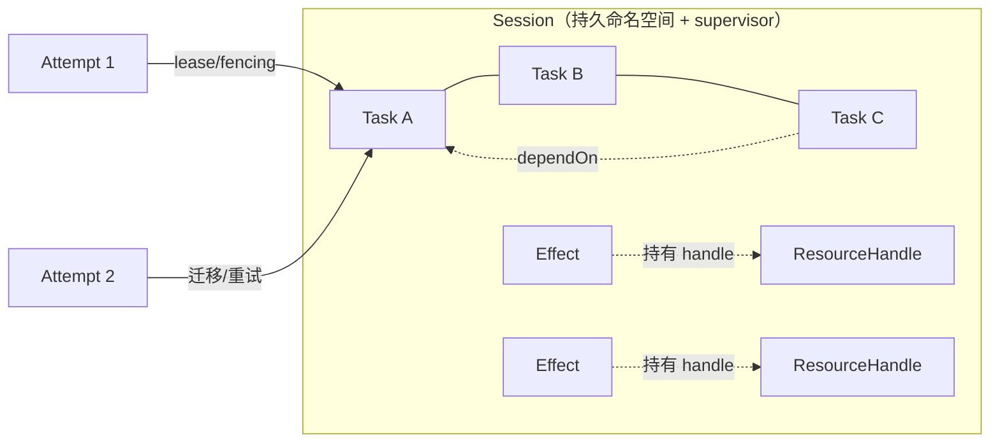
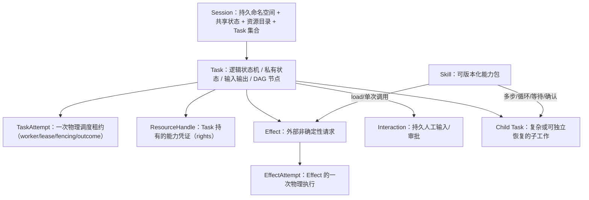
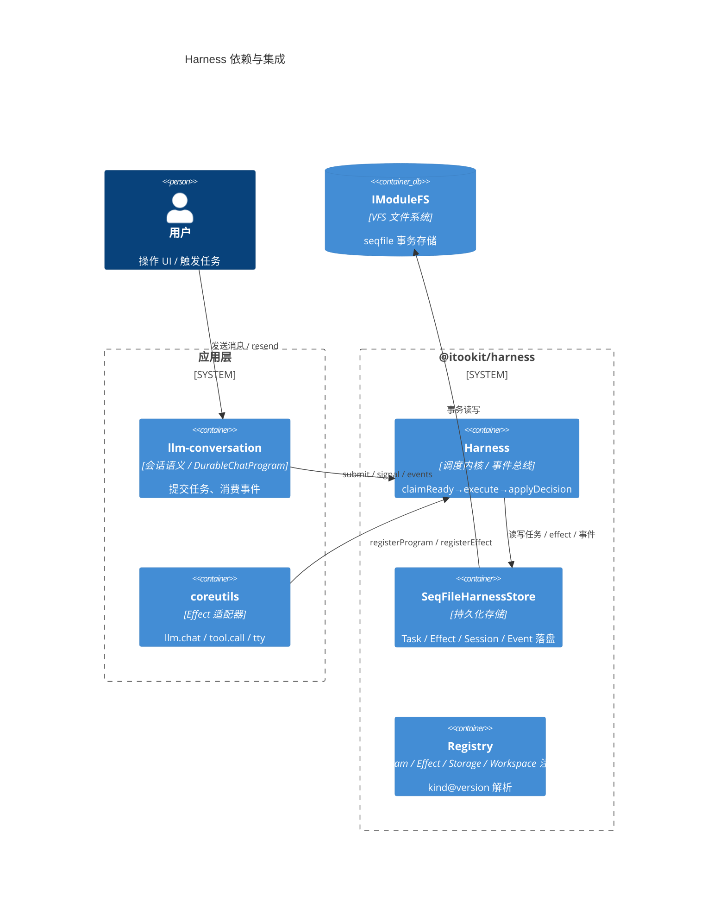
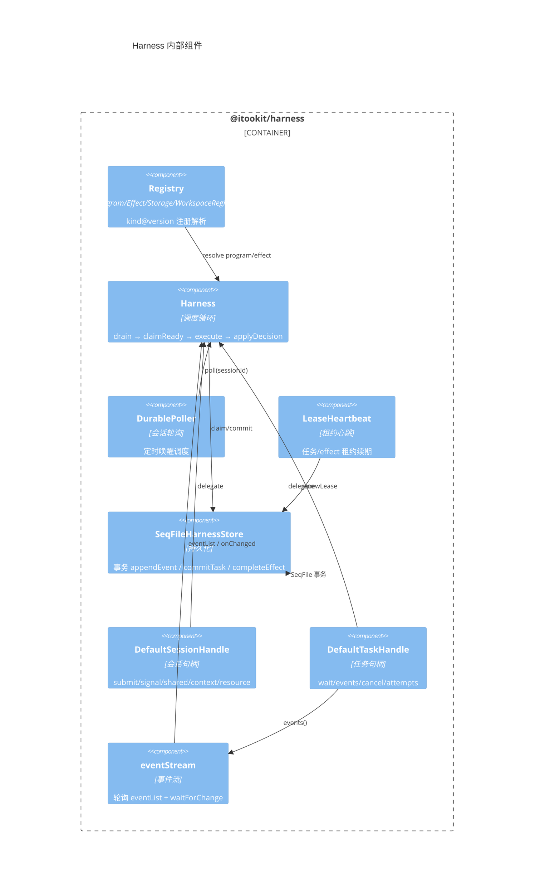
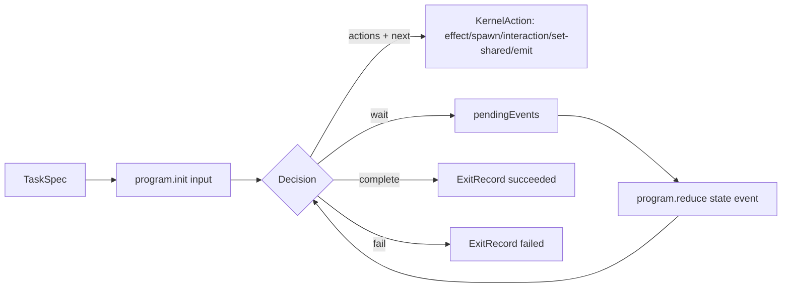
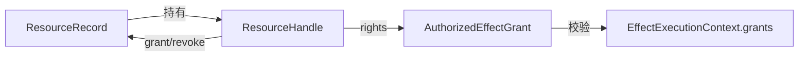
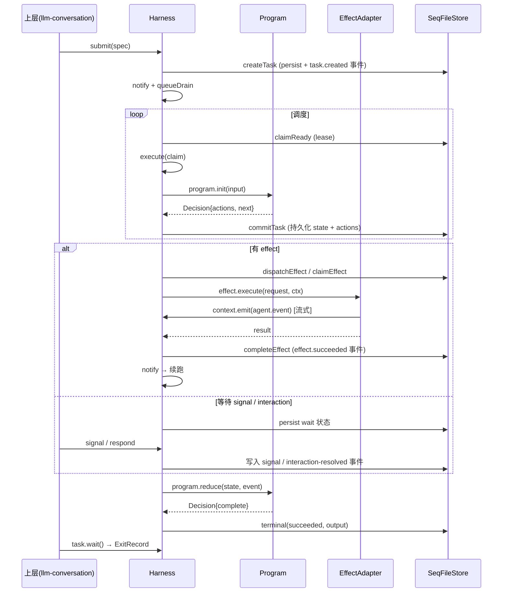
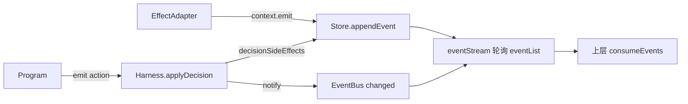
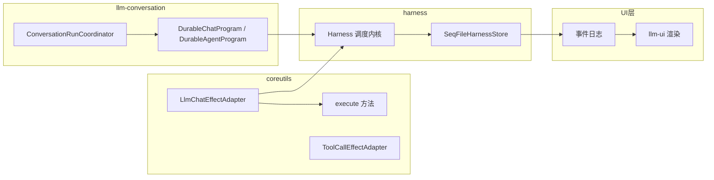

# @itookit/harness 设计文档

> Durable Session/Task 调度与资源内核 —— 平台无关的可恢复任务执行引擎。

## 1. 定位与职责

**harness** 是 LLM 子系统底层的高可靠任务执行内核，提供：

- **Durable Task Program**：任务以状态机（`init` / `reduce`）表达，所有中间状态可持久化，进程崩溃后可恢复续跑。
- **Effect 执行**：任务通过 side-effect 访问外部能力（LLM、Tool、TTY 等），effect 结果持久化，支持重试 / reconcile。
- **Session 生命周期**：session 是任务的容器，管理 open / suspended / closing / closed / archived 状态。
- **资源权限**：Resource / Handle / Grant 体系，任务需持有权限才能执行 effect。
- **事件流**：session 级事件日志，UI / 上层经 `TaskHandle.events()` 轮询消费（含 effect 期间增量推送）。

**依赖**：仅 `@itookit/stdio`（`IModuleFS`）。不依赖任何 LLM / UI / 具体设备实现。

**设计定位**：harness 是一个 **Agent 专用的轻量 Durable Kernel** —— 只保留最小必要抽象，不照搬 Linux 进程/文件系统等通用 OS 名词，也不耦合任何厂商或工具类型。

## 2. 核心抽象模型（设计裁决）

最终模型只有五个核心运行时抽象。每个抽象有明确的职责边界与持久身份：

| 抽象 | 职责 | 持久身份 |
|---|---|---|
| **Session** | 持久命名空间、上下文分支、资源根、预算根、Task 集合；supervisor scope | 是 |
| **Task** | 有输入、私有状态、loop、输出和终态的逻辑工作单元；也是 DAG 节点 | 是 |
| **Attempt** | Worker 对 Task 的一次带 lease/fencing 的物理执行 | 仅审计 |
| **Effect** | LLM、Bash、tool、MCP 等非确定性外部动作 | 是 |
| **ResourceHandle** | 文件、workspace、artifact、stream、model、skill、MCP server、budget 等类型化 capability | 是 |



### 2.1 设计裁决

1. **Session 不是 Linux process** —— 而是持久 namespace + supervisor scope，管理上下文分支、资源、预算与 Task 集合。
2. **Task 是唯一逻辑执行身份** —— 删除 Run / Process / ExecutionTask 等多套重叠身份。
3. **loop 在 Task 内；DAG 在 Task 之间** —— 跨节点循环编译成 iteration controller，不在 Task 内再造控制流。
4. **Attempt 处理 Worker 崩溃、lease、retry 与迁移** —— 不能以 TaskId 代表物理执行。
5. **Effect 隔离所有非确定性调用** —— 提供开放 adapter registry，不硬编码厂商或工具类型。
6. **Skill 是可版本化的 TaskProgram + Resource bundle** —— 复杂 Skill 作为子 Task 执行，而不是一个黑盒 Effect。
7. **Session context、Task private state、Task event trace、long-term memory 分开保存** —— 各自独立生命周期。
8. **Session 内同步由 SessionStore 保证** —— 跨 Session 协作统一经 CrossSessionBus，不直接访问对方数据库。
9. **持久化统一使用 `@itookit/stdio` 事务型 SeqFile** —— Web 用 IndexedDB，LocalFS/Tauri 可在后端内部用 SQLite sidecar。
10. **Task 目录是事实源** —— Session index.seq 是可重建调度投影；通知只是低延迟 hint，不进入 TaskProgram 业务语义。

### 2.2 推荐理解模型（架构评审采纳）

> Harness 是「**声明驱动的持久状态机**」：TaskProgram 用 `Decision` + `KernelAction` 声明下一步（`domain/types.ts:223`），但 reducer 本身仍是普通 TS 代码（非强制纯声明式）。



**关键区分**：
- **Effect 不是"所有执行内容"** —— 纯计算/状态转换在 `init`/`reduce`；外部非确定性调用才是 Effect；`spawn` 建子 Task、`request-interaction` 人工确认、`set/delete-shared` 共享状态、`emit` 业务事件，都是独立的 `KernelAction`
- **Task 拥有的是 Handle，不是 Resource 本体** —— `ResourceRecord.sessionId` 表示资源所在 Session；所有权在 `ResourceHandle.holderTaskId`；Task 间**必须显式 grant**，无自动共享
- **Attempt 不保存业务状态** —— 业务进度必须显式编码进 `TaskRecord.state`；一个逻辑 Effect 可产生多个 EffectAttempt（retry/reconcile/cancel）
- **ResourceHandle 不是状态操作器** —— 它只回答「当前 Task 是否被允许以某权限访问指定 Resource」；状态分平面：Task.state / shared.seq / ContextCommit / EventJournal / Attempt lease / Resource 外部状态

**Skill 的分类**：Skill 是能力包（manifest + Resource bundle + 可选 TaskProgram + 可选 EffectAdapter），具体动作再归类：

| Skill 动作 | 分类 |
|---|---|
| 加载 / 挂载 / 解析 | Effect：`skill.load`（已实现，coreutils `SkillLoadEffectAdapter`）|
| 单次 MCP / HTTP / 脚本调用 | Effect |
| 读文件 → LLM 分析 → 写文件（多步）| 子 Task（未实现通用 `skill.invoke` Program）|
| 循环 / 等待 / 确认 / 多步骤 | 子 Task |
| Skill 定义 / 脚本 / assets | Resource / artifact |

### 2.3 与当前实现的对照

> 本表经架构评审修正（2026-08-09）：采纳「声明驱动的持久状态机」视角，并标注实现落地程度。

| 设计裁决 | 准确结论 | 实现状态 |
|---|---|---|
| ① Session = namespace + supervisor | Session 是持久命名空间 + 共享状态 + 资源目录 + Task 集合；资源属于 Session 命名空间（`ResourceRecord.sessionId`），**Task 不自动共享，须持有或被授予 Handle** | ✅ 显式 grant 已实现 |
| ② Task 唯一逻辑身份 | Task 是唯一逻辑工作单元（输入、私有状态、loop、输出、终态、DAG 节点）；无 Run/Process/ExecutionTask | ✅ |
| ③ loop 在 Task 内、DAG 在 Task 间 | `WaitSpec` + `spawn` + `dependsOn`；跨节点循环编译成 iteration controller | ✅ |
| ④ Attempt 物理执行 | Attempt 只保存 worker/lease/fencing/时间/outcome；**不保存业务状态或执行栈**，业务进度必须显式编码进 `TaskRecord.state` | 🟡 调度状态已实现，业务执行栈不保存（符合裁决④，但无强制隔离） |
| ⑤ Effect 开放 registry | Effect 是 TaskProgram 声明的**外部非确定性动作**之一；纯计算/状态转换在 init/reduce，外部调用才走 Effect；`EffectRegistry` kind@version，不耦合厂商 | ✅ |
| ⑥ Skill 分类 | Skill 是**可版本化能力包**（manifest/instructions/assets/required capabilities + 可选 TaskProgram/EffectAdapter），不简单归为 Task 或 Effect。具体动作分类：load/单次调用 → Effect；多步/循环/等待/确认 → 子 Task；定义/脚本 → Resource | 🟡 仅实现 `skill.load` Effect（coreutils `SkillLoadEffectAdapter`）；`skill.invoke` Durable Program 未实现 |
| ⑦ 状态分域存储 | Task 私有状态（`TaskRecord.state`）、Session 共享（shared.seq）、上下文（ContextCommit）、事件（EventJournal）、资源外部状态分开保存 | ✅ |
| ⑧ SessionStore / CrossSessionBus | Session 内同步由事务保证；跨 Session 经 `sendCrossSession` + outbox/inbox，不直接访问对方数据库 | ✅ |
| ⑨ SeqFile + 后端可替换 | 统一用 `@itookit/stdio` 事务型 SeqFile；`SessionStorageResolver` 抽象，Web IndexedDB / LocalFS SQLite 后端可替换 | ✅ |
| ⑩ Task 目录事实源 | Task 目录是事实源，`ready/` index.seq 是可重建调度投影；`notify` 仅唤醒轮询，不进业务语义 | ✅ |

**已知差距（架构评审确认）**：
- 复杂 Skill → Durable Child Task（`skill.invoke` Program）**未实现**，只有 `skill.load` Effect
- `TaskSpec.context` / `TaskSpec.inherit` 声明字段**未出现在当前接口**（当前只有 parent/spawnKey/dependsOn/retry/priority/labels/deferStart）
- **Program 确定性未强制隔离**：仅架构约定 reducer 保持纯函数，类型系统不能阻止 Program 内直接调用 `fetch()` / `Date.now()` / Provider SDK

## 3. 架构总览（C4 Container）





## 4. 目录结构

```
packages/harness/src/
├── index.ts                     # 统一导出
├── domain/
│   ├── types.ts                 # 核心类型：TaskSpec/Decision/Effect/Resource/Handle/Workspace
│   └── interaction.ts           # 交互（HITL/审批）协议
├── application/
│   └── harness.ts               # Harness 调度内核（核心实现）
├── ports/
│   ├── registry.ts              # Program/Effect/Storage/Workspace 注册表
│   └── plugin.ts                # HarnessPlugin + HarnessRegistration 插件端口
├── public/
│   ├── session-handle.ts        # DefaultSessionHandle
│   ├── task-handle.ts           # DefaultTaskHandle
│   └── event-stream.ts          # 事件轮询生成器
├── infrastructure/
│   └── seqfile/
│       └── store.ts             # SeqFileHarnessStore 持久化
└── runtime/
    ├── durable-poller.ts        # 会话级轮询调度
    └── lease-heartbeat.ts       # 租约心跳
```

## 5. 核心接口

### 5.1 Task Program（状态机）



```ts
interface DurableTaskProgram<S, I, O> {
  manifest: { kind: string; version: string };
  init(input: I): Decision<S, O> | Promise<Decision<S, O>>;
  reduce(state: Readonly<S>, event: TaskInputEvent): Decision<S, O> | Promise<Decision<S, O>>;
}

type Decision<S, O> = {
  state: S;
  actions?: KernelAction[];
  next: { type: 'continue' } | { type: 'wait'; on: WaitSpec }
      | { type: 'complete'; output: O } | { type: 'fail'; error: SerializableError; retryable?: boolean };
};

type KernelAction =
  | { type: 'effect'; effect: EffectRequest }
  | { type: 'spawn'; spawnKey: string; spec: TaskSpec }
  | { type: 'request-interaction'; interaction: InteractionRequest<JsonValue> }
  | { type: 'set-shared' | 'delete-shared'; key: string; value?: JsonValue; expectedVersion?: number | null }
  | { type: 'emit'; eventType: string; payload?: unknown };
```

**不变量**：`reduce` 是纯函数 —— 给定 `(state, event)` 返回新的 `(state, actions, next)`，状态必须可 JSON 序列化（`assertDurableValue` 校验），崩溃后可从最后一个持久化状态 + `pendingEvents` 续跑。

### 5.2 Effect（外部能力）

```ts
interface EffectAdapter<Req, Res> {
  kind: string; version: string;
  execute(request: Req, context: EffectExecutionContext): Promise<Res>;
  reconcile?(request: Req, context): Promise<EffectReconcileResult<Res>>;  // worker 丢失后
  cancel?(request: Req, context): Promise<void>;                          // 取消
}

interface EffectExecutionContext {
  sessionId; taskId; effectId; abortSignal;
  grants: AuthorizedEffectGrant[];           // 授权资源句柄
  sessionState?: { get<T>(k): Promise<...>; set<T>(k, v, ver?): Promise<...> };
  emit?(event: { type: string; payload?: unknown }): Promise<void>;  // effect 期间增量事件
}
```

**`emit`**：effect 执行期间写入 session 事件日志（`agent.event`），UI 经 `TaskHandle.events()` 实时读到 —— 支撑 LLM 流式 chunk 推送。事件带 `taskId` 供流层过滤。

### 5.3 资源与权限



- `ResourceSpec` → `createResource` → `ResourceGrant { resource, handle }`
- effect 请求声明 `grants: [{ handleId, right }]`，执行前 `assertCapabilityGrant` 校验
- `BudgetAccount` 按 `(resourceId, dimension)` 记账，`chargeBudget` 扣费

### 5.4 持久化（SeqFile）

- **Task**：`task/{id}/record` + 版本快照 `snapshotKey(version)`，`commitTask` 事务内写 `task.{status}` 事件
- **Effect**：`effect/{taskId}/{effectId}/record`，`claimEffect` → `completeEffect`
- **Event**：`event/{seq}`（16 位补零），`appendEvent` 事务递增 seq
- **Shared State**：`shared/{key}/record` + 版本历史
- **Session**：`session/record` + `session.{status}` 事件

## 6. 任务执行流程（时序）



**关键设计**：
- **租约**：`claimReady` / `claimEffect` 拿租约（workerId + leaseToken + leaseUntil），`LeaseHeartbeat` 续期；租约过期 → 其他 worker 接管（reconcile）
- **事件驱动续跑**：每个决策 commit 后 `notify`，`DurablePoller` / `queueDrain` 唤醒
- **恢复**：`recover()` 扫描 sessions → `openSession` → `dispatchPendingEffects` → `relayPendingMessages`

## 7. 事件流



事件类型（`agent.event` 载荷为 AgentEvent 规范）：
- 任务生命周期：`task.created` / `task.running` / `task.succeeded` / `task.failed` / `task.retry.scheduled`
- effect：`effect.succeeded` / `effect.failed` / `effect.indeterminate`
- session：`session.created` / `session.{status}`
- 增量：`agent.event`（effect 期间 emit，含 `stream:content` / `stream:thinking` 等）
- 交互：`task.interaction.requested`（HITL / 审批）

**消费路径**：`TaskHandle.events()` → `eventStream`（`after` 游标 + `waitForChange` 唤醒）→ 按 `taskId` 过滤 → 终态停止。

## 8. 关键设计决策

| 决策 | 理由 |
|---|---|
| **状态机纯函数** | 可持久化、可重放、可恢复，worker 崩溃不丢状态 |
| **effect 分离** | 外部调用与状态机解耦，可重试/reconcile，失败不影响任务状态一致性 |
| **租约 + 心跳** | 单 worker 崩溃后其他 worker 接管，实现高可用 |
| **appendEvent 独立事务** | effect 期间增量写事件不影响任务主事务，seq 单调 |
| **事件轮询** | 简单可靠，`waitForChange` 降低轮询延迟；UI 增量渲染天然适配 |
| **kind@version 注册** | Program/Effect 版本化，支持协议演进与多版本共存 |

## 9. 与上层协作



- **llm-conversation** 提交 `llm.chat` / `llm.agent` program 的 TaskSpec，harness 调度执行
- **coreutils** 提供 `llm.chat` / `tool.call` / `tty` 等 EffectAdapter，经插件注册
- **LLM 流式**：adapter 在 `execute` 期间 `context.emit` → harness 写 `agent.event` → UI 逐 token 渲染（见 `doc/feat/llm-v3-design.md`）
- **资源隔离**：每次任务 `createResource(llm://session)` + `bindCapabilities` 授权，effect 需持有 execute 权限

## 10. 测试

```bash
pnpm --filter @itookit/harness test       # vitest
pnpm --filter @itookit/harness typecheck
```

- `harness.test.ts`：34+ 用例，MemoryBackend + 真 Harness —— 任务持久化/恢复、effect 租约、流式 emit 事件消费、依赖/共享状态/工作区/交互等
- 存储事务（`seqfile`）由 `@itookit/stdio` / vfsdriver 后端测试覆盖
