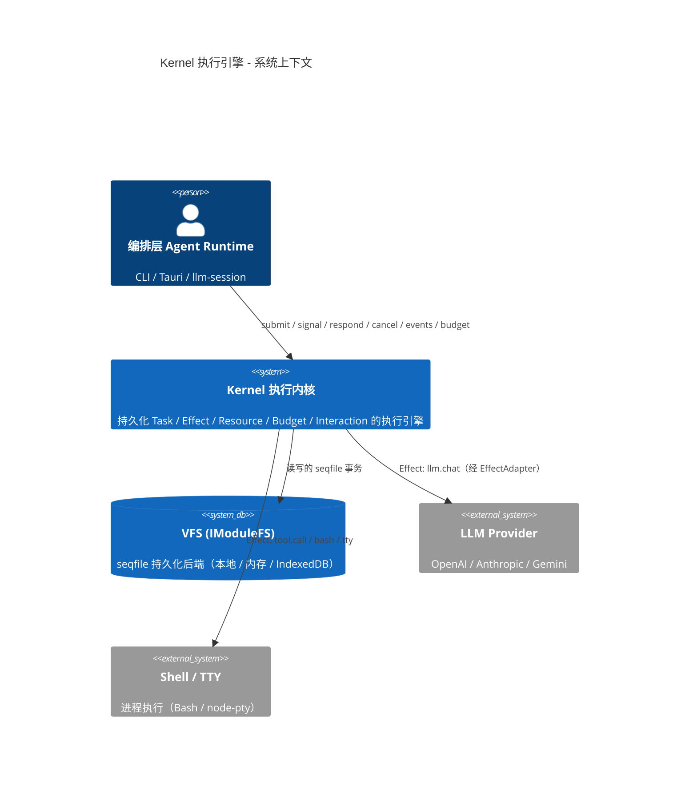
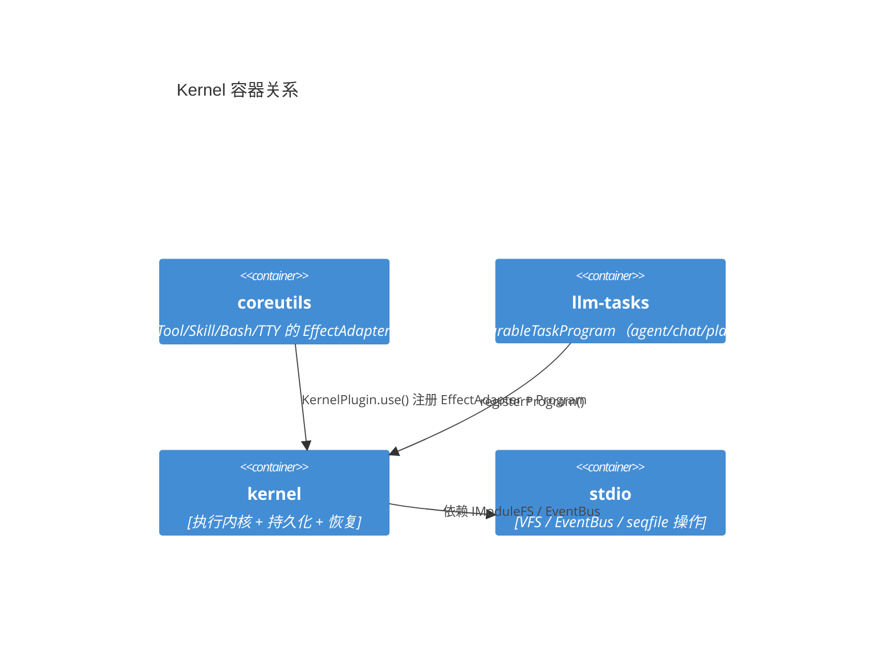
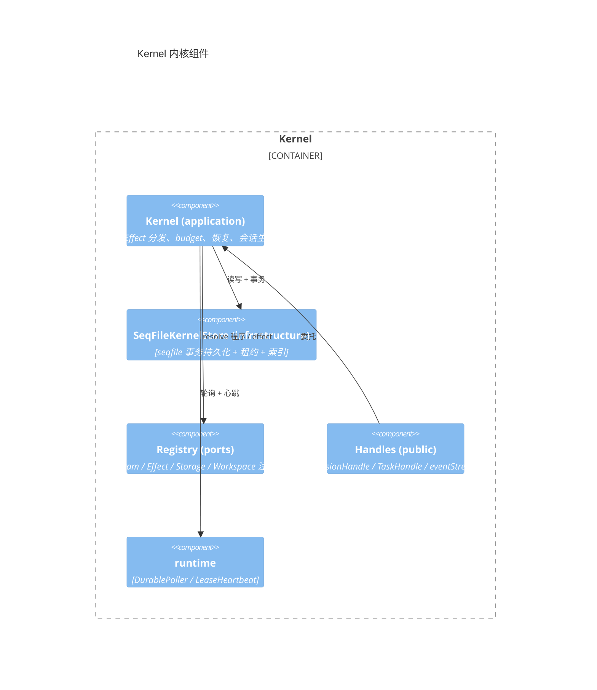
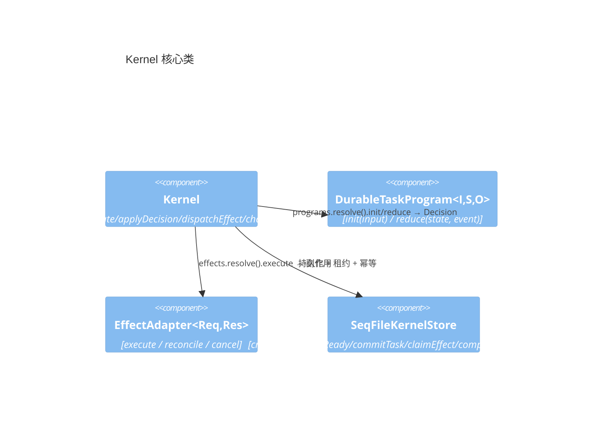
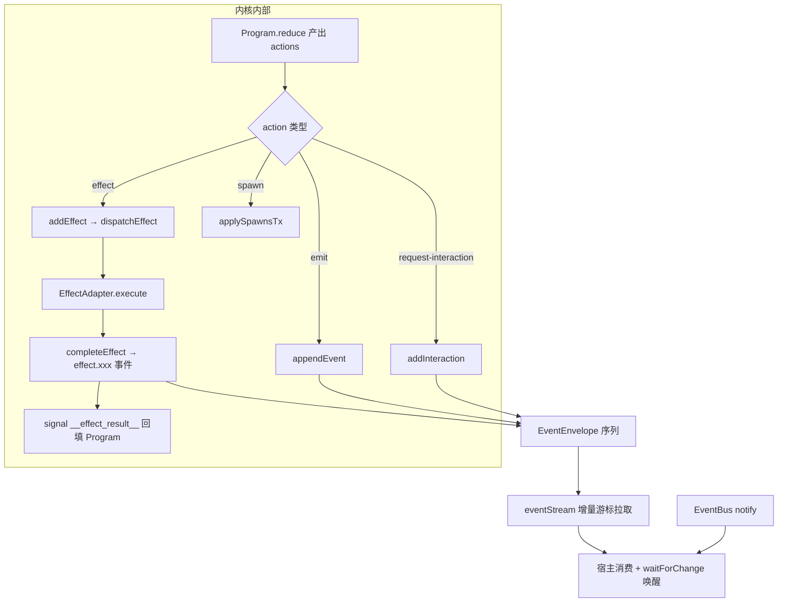
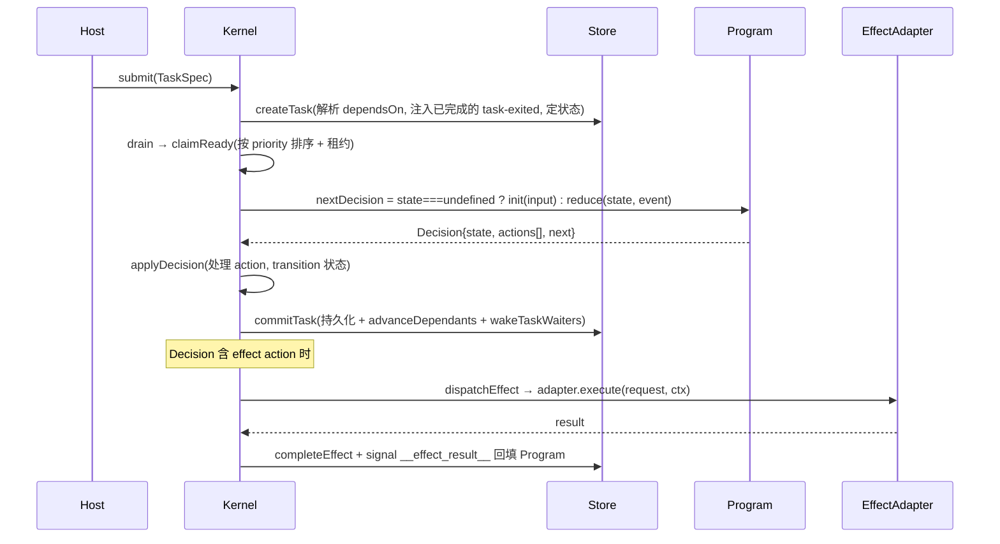

# Kernel 执行模块审查报告

> 对 `packages/kernel`（约 4756 行）执行内核的架构、接口、事件流、内部流程、模块划分与代码质量的审查分析。
> 与 `kernel-design.md`（设计裁决）互补：本文评估**当前实现是否符合设计、是否正确完整、可精简项**。

## 1. 模块定位

`packages/kernel` 是**持久化的通用执行内核**——它不关心"执行什么"，只提供一套抽象让上层（coreutils / llm-tasks）注册"任意功能"的执行器。LLM、工具、技能、spawn、Bash、TTY 都通过同一套 `Effect` / `Task` 抽象接入。

**依赖**：仅 `@itookit/vfs-core`（`IModuleFS` / `EventBus`），不依赖任何 LLM / UI / 具体设备。

分层结构（六层，依赖单向向下）：

```text
domain（纯类型）→ ports（接口+注册表）→ application（调度内核）
                                              ↓
        infrastructure（持久化）← public（API handle）← runtime（轮询/心跳）
```

```
src/
├── domain/            # 纯类型，无实现（types.ts, interaction.ts）
├── ports/             # 接口 + 注册表（plugin.ts, registry.ts）
├── application/       # 调度内核（kernel.ts）
├── infrastructure/    # seqfile 持久化（seqfile/store.ts）
├── public/            # 对外 handle（session-handle, task-handle, event-stream）
└── runtime/           # 运行时机制（durable-poller, lease-heartbeat）
```

---

## 2. C4 架构图

### 2.1 Context 层（系统上下文）



### 2.2 Container 层（容器关系）



### 2.3 Component 层（内核组件）



### 2.4 Code 层（核心类）



---

## 3. 接口契约

| 接口 | 定义 | 作用 | 评价 |
|---|---|---|---|
| `DurableTaskProgram<I,S,O>` | `init(input)→Decision`、`reduce(state,event)→Decision` | 任务状态机（纯函数、可持久化） | ✅ 正确，"任意功能"的统一抽象 |
| `EffectAdapter<Req,Res>` | `execute(req,ctx)`、`reconcile?(req,ctx)`、`cancel?(req,ctx)` | 副作用执行（llm/tool/skill/bash/tty） | ✅ 覆盖执行 / 幂等恢复 / 取消三生命周期 |
| `SessionStorageResolver` | `resolve(ref)→ResolvedStorageBinding` | 会话存储定位（VFS 后端） | ✅ 存储解耦 |
| `WorkspaceAdapter` | `snapshot / diff / merge` | 工作区版本（快照 / diff / merge） | ✅ 合理 |
| `KernelPlugin` | `install(registration)`、`onSessionClosed?` | 插件装配（coreutils 用它注册全套 effect） | ✅ 正确 |
| `KernelAction` | `effect/spawn/request-interaction/set-shared/delete-shared/emit` | Program 与内核的唯一交互 | ✅ 边界清晰 |
| `WaitSpec` | `signal/effect/task/child/interaction` + `any/all/quorum` | 等待条件组合 | ✅ 表达力强 |
| `Decision` | `state + actions[] + next(continue/wait/complete/fail)` | 状态机转移 | ✅ 正确 |

---

## 4. 事件流



**事件模型**：`EventEnvelope { sequence, sessionId, taskId, type, payload, occurredAt }`，`sequence` 单调递增，`eventList(sessionId, after)` 增量游标拉取，`eventStream` 是 `AsyncGenerator`。

核心事件类型：`task.created/started/leased/waiting/succeeded/failed`、`effect.leased/succeeded/failed/attempt.lost`、`budget.configured/consumed`、`session.created`、`agent.event`（业务层透传）。

---

## 5. 执行时序（核心调度循环）



**幂等与恢复**：`EffectRequest.idempotencyKey` + `EffectAdapter.reconcile()`（worker 丢失后判定 `retry/indeterminate/completed`）+ 租约心跳 + `recover()` 重建索引、重新入队过期租约、重试丢失 effect。

---

## 6. 审查结论

### 6.1 当前是否实现？

**已完整实现。** kernel 是完整的持久化执行内核，`llm / tools / skills / spawn` 全部通过统一抽象接入：

| 功能 | 接入方式 |
|---|---|
| LLM | `Effect: llm.chat`（coreutils 的 `LlmChatEffectAdapter`）|
| Tools | `Effect: tool.call`（`ToolCallEffectAdapter`）|
| Skills | `Effect: skill.load`（`SkillLoadEffectAdapter`）|
| Bash / TTY | `Effect: bash / tty`（`BashEffectAdapter` / `TtyEffectAdapter`）|
| Spawn | `KernelAction: spawn`（动态子任务）|
| 人机交互 | `KernelAction: request-interaction` + `respondInteraction` |

kernel **本身不包含任何 LLM / 工具逻辑**——这是正确的设计：它是"执行机制"，不是"业务实现"。

### 6.2 是否正确完整实现？

**正确且较完整。** 核心机制齐全：幂等（idempotencyKey + reconcile）、租约（lease + heartbeat）、恢复（recover）、重试（retry + backoff）、并发（maxConcurrent）、优先级（priority 排序）、依赖（dependsOn + condition/onFailure）。

⚠️ **1 处不完整**：`workspaceContext()`（`kernel.ts:696`）里 `abortSignal: new AbortController().signal` 每次新建一个**从不 abort** 的信号，`WorkspaceAdapter` 无法被取消——这是死代码 / 半成品。

### 6.3 接口定义是否正确合理？

**合理，且设计成熟。** 三个核心接口值得肯定：
- `DurableTaskProgram` 的 `init/reduce` 是**纯函数状态机**，state 强制可 JSON 序列化（`inspectDurableValue` 校验），这是"任意功能可持久化恢复"的正确根基。
- `EffectAdapter` 的 `execute/reconcile/cancel` 三方法覆盖正常执行、幂等恢复、取消三生命周期。
- `KernelAction` 是 Program 与内核的唯一交互面，边界干净。

### 6.4 事件流是否合适？

**合适，但有轮询开销。** `sequence` 单调递增 + 增量游标 + `EventBus` 通知是合理的。`waitForChange` 是"通知 + 250ms 轮询兜底"混合——通知能立即唤醒，但轮询兜底有固定延迟；LLM 流式高频事件靠 `llm-chat-effect` 的 `STREAM_BATCH_MS=40ms` 批处理缓解。可接受。

### 6.5 内部流程是否清晰简明？

**清晰。** 主循环是教科书式的：`submit → createTask(解析依赖) → drain → claimReady → execute → nextDecision(init/reduce) → applyDecision(处理 action + transition) → commitTask(持久化 + 唤醒依赖)`。状态机转移集中在 `transition()`，清晰。

### 6.6 模块划分是否正确解耦、易扩展？

**分层正确，但有两个"上帝类"。** domain/ports/application/infrastructure/public/runtime 六层划分正确、依赖单向。但：
- `application/kernel.ts` **988 行**，混合了调度、Effect 分发、budget、workspace、context、消息、资源、恢复、会话生命周期——职责过多，应拆成 `TaskScheduler / EffectDispatcher / ResourceManager / WorkspaceManager` 等协调器。
- `infrastructure/seqfile/store.ts` **1815 行**，包含全部持久化（session/task/effect/resource/budget/context/message/workspace/index）——应按聚合边界拆分。

扩展性本身是好的（注册表 + 端口），只是内聚度需要收敛。

### 6.7 代码质量可否进一步精简？

**可以。** 具体点：

1. **kernel.ts 过长**：988 行上帝类，建议按职责拆分（调度 / Effect / 资源 / 工作区 / 上下文 / 消息）。
2. **store.ts 过长**：1815 行，建议按聚合根拆分（TaskStore / EffectStore / ResourceStore / ContextStore）。
3. **死代码**：`workspaceContext` 的 `new AbortController().signal` 从不使用。
4. **import 风格不一致**：`kernel.ts` 大量使用内联 `import('../domain/types').X`（`submit`、`respondInteraction`、`getShared` 等），与顶部 `import type` 混用，应统一到顶部。
5. **可合并的重复**：`decisionSideEffects` 手工展开 action 与 `prepareSpawns` 分离，可统一为一次遍历。

---

## 7. 总体评价

kernel 是一个**设计良好、实现完整、接口成熟**的执行内核。它的核心洞察——**用 `DurableTaskProgram`（纯函数状态机）+ `EffectAdapter`（副作用端口）+ `KernelAction`（统一交互原语）三个抽象，把"任意功能执行"收敛为可持久化、可恢复、可幂等的统一模型**——是正确的，且已被 CLI 的多 Agent DAG、预算、HITL、补偿、Supervisor 等上层能力充分验证。

主要短板不在正确性，而在**内聚度**：`kernel.ts` 和 `store.ts` 两个文件承担了过多职责，是后续重构的首要目标；`workspaceContext` 的 abortSignal 是唯一明确的半成品。
