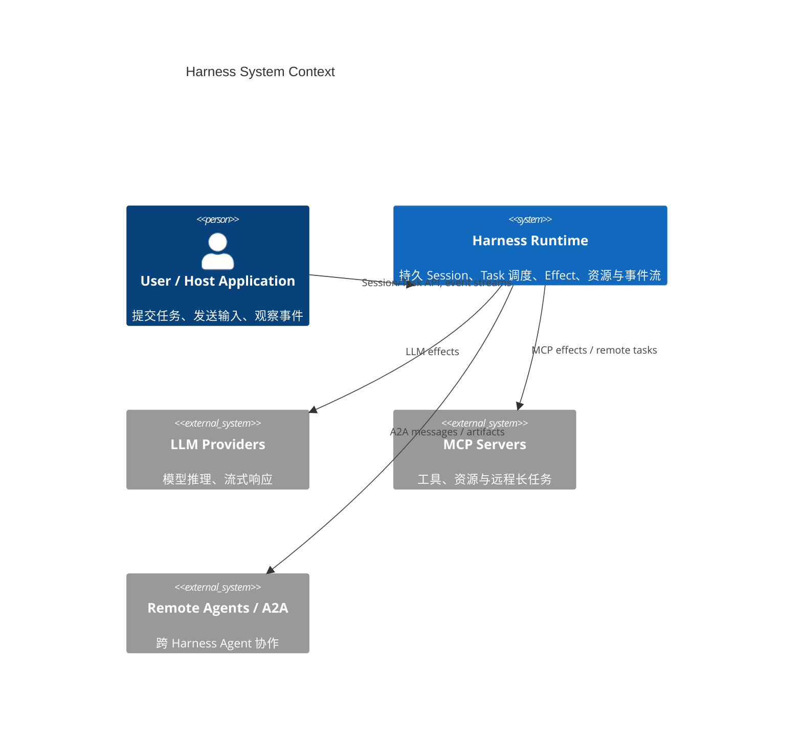
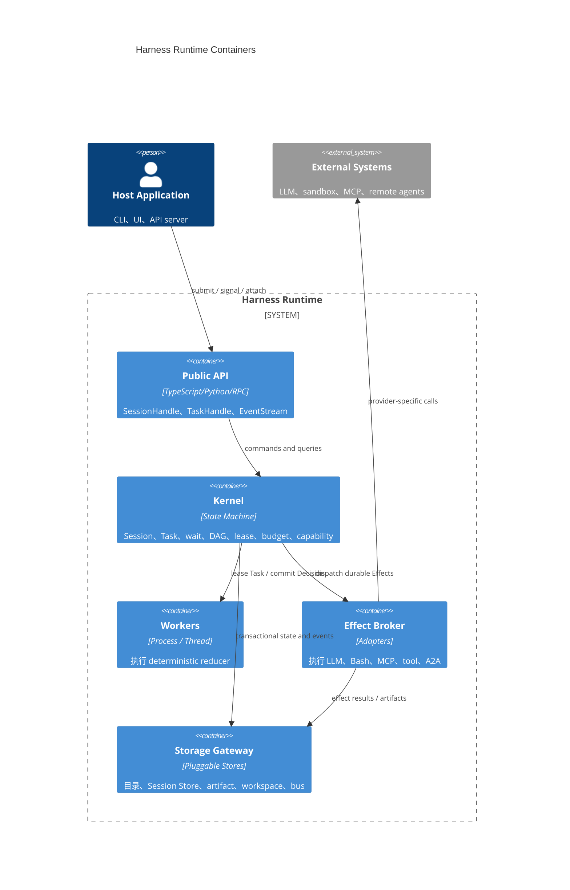
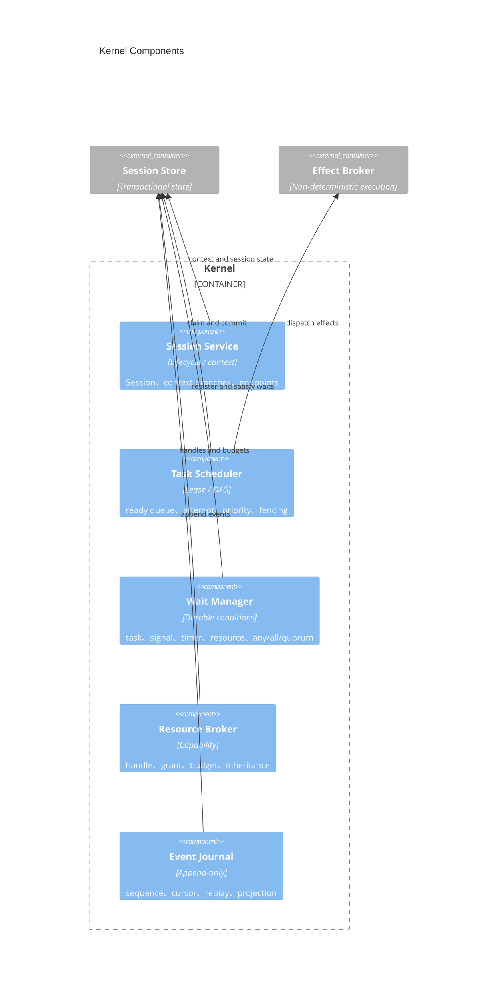
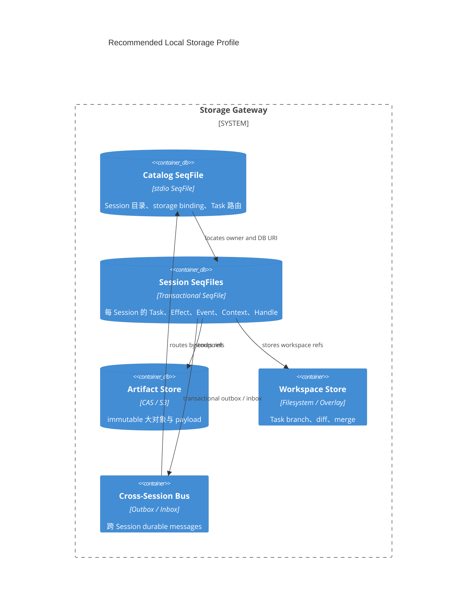
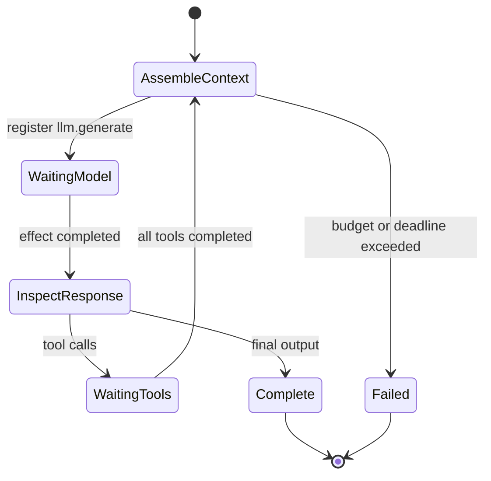
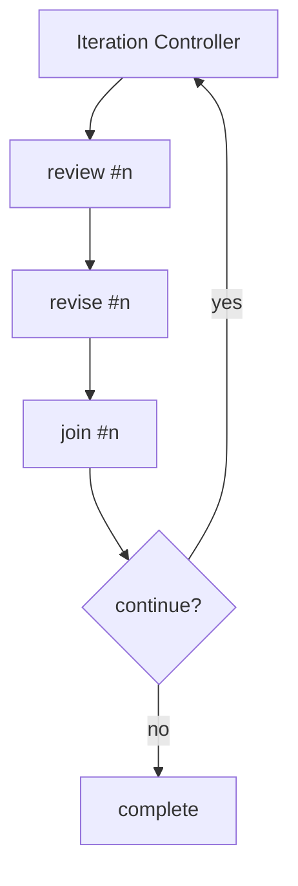
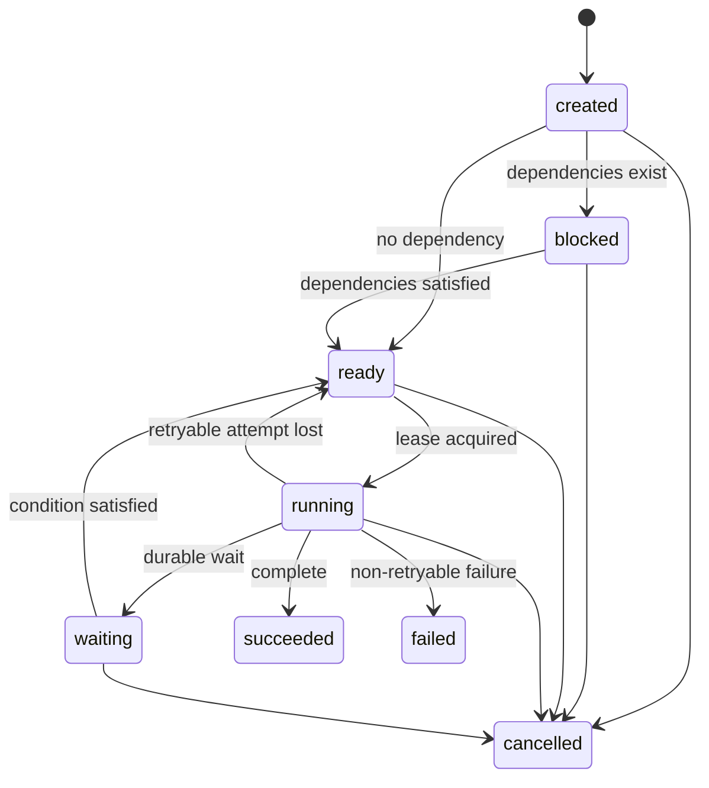
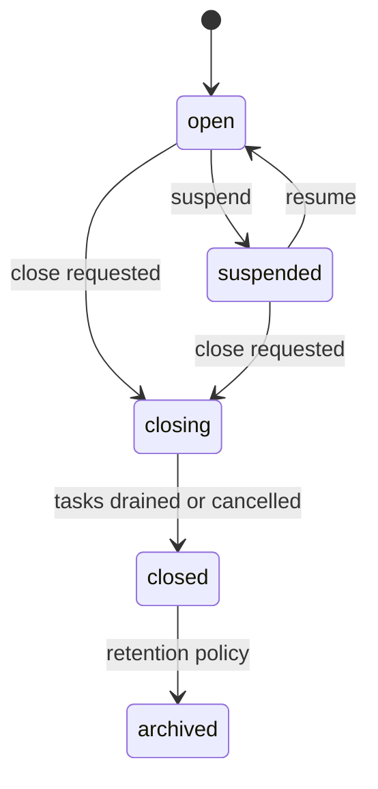
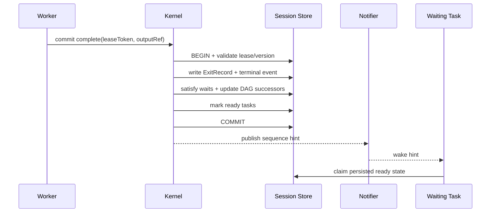
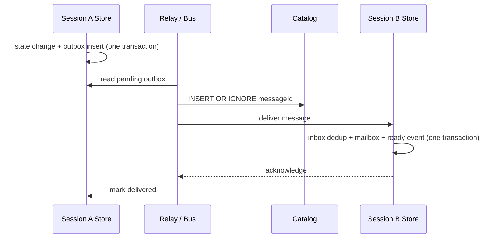

# Harness Session / Task 最终设计方案

> 版本：3.0
> 日期：2026-08-09  
> 状态：最终设计，已按当前实现校准  
> 范围：定义通用、持久、可恢复、可扩展的 Harness Session/Task 内核，覆盖 LLM loop、动态 DAG、Bash、Skill、MCP、跨进程与跨 Session 协作。

## 0. 实施任务与完成状态

状态定义：`✅ 已完成` 表示代码已落地且相关测试/类型检查通过；`🟡 待验证` 表示代码已落地但尚未完成全部平台验证；`🚧 进行中` 表示仍在迁移或补齐；`⬜ 未开始` 表示属于后续阶段。

| 实施 Task | 状态 | 当前结果 / 完成条件 |
|---|---|---|
| T01 stdio 事务型 SeqFile 契约 | ✅ 已完成 | 已增加跨 SeqFile transaction、CAS、increment、append、稳定 prefix scan 和 `transactionalSeqFiles` capability；stdio typecheck 通过。 |
| T02 Memory RecordStore | ✅ 已完成 | 已实现 copy-on-write 原子提交与回滚，作为 Harness 单元测试后端。 |
| T03 IndexedDB RecordStore | ✅ 已完成 | 使用单个 `readwrite` transaction；接口与工程类型检查通过。通用事务语义由 stdio 的 17 项 SeqFile 测试覆盖。 |
| T04 LocalFS/Tauri RecordStore | 🟡 待验证 | records schema、事务接口和 backend adapter 已接入；adapter 事务测试及两个平台 TypeScript 检查通过，仍需原生 SQLite 并发、重启与 Tauri 实机验证。 |
| T05 `@itookit/harness` 新包与依赖边界 | ✅ 已完成 | 核心包已建立，唯一生产依赖为 `@itookit/stdio`；核心 typecheck 通过。 |
| T06 Session/Catalog/StorageResolver | ✅ 已完成 | 已实现 `catalog.seq`、`StorageBindingRef`、resolver registry、Session create/open/list 与 Chat assetdir resolver。 |
| T07 Durable Task 状态机与目录事实源 | ✅ 已完成 | 已实现 Task create/claim/commit/signal/cancel、Effect/Signal/Interaction wait、Attempt lease/fencing、完整 Attempt 记录、逐版本 Task snapshot、EventJournal 和过期 Attempt 恢复；运行状态与历史均以 `task.seq` 为事实源。 |
| T08 Durable Effect | ✅ 已完成 | 已实现开放 EffectRegistry、Effect Attempt lease/heartbeat/fencing、事务外执行、结果先持久化再唤醒、崩溃后 reconcile/indeterminate、取消持久化与 adapter cleanup；deadline 会主动结束等待并调用 adapter cancel，Effect 请求/结果拒绝非 JSON 对象。 |
| T09 DAG、依赖推进与 Durable Wait | ✅ 已完成 | dependency readiness、ExitRecord 传递、Signal/Effect/Task wait、防丢唤醒、`spawn + wait child`、`(parentTaskId, spawnKey)` 幂等事务及嵌套 `any/all/quorum` 已实现。 |
| T10 ResourceHandle/Grant | ✅ 已完成 | 已实现 ResourceRecord、Handle 权限子集授权、父链校验、级联 revoke、generation fencing、Effect 执行前 grant 检查及资源祖先 Budget。 |
| T11 Session 生命周期 | ✅ 已完成 | create/open/suspend/resume/close、关闭时批量取消及 Session/Catalog 状态同步已实现；生命周期行为测试通过。 |
| T12 Coreutils 能力包迁移 | ✅ 已完成 | 已建立 `@itookit/coreutils`，只保留抽象端口、平台无关公共实现、Session-scoped runtime 和 Durable Effect/Program；Node/Browser/Tauri 的文件系统、网络和 Shell 实现由 `apps/*` 注入。 |
| T13 Conversation/UI/App 一次性切换 | ✅ 已完成 | App Shell 直接装配 `Harness + CoreutilsRuntime`；Conversation 使用 `SessionHandle/TaskHandle`；UI 使用 `TaskHandle/EventEnvelope/Interaction`，生产代码不再依赖旧 ControlPlane。 |
| T14 Context/CrossSession/Budget/Workspace | ✅ 已完成 | Durable core v1 已实现 ContextCommit DAG/branch CAS、Session shared history、跨 Session outbox/inbox、祖先 Budget，以及开放 WorkspaceAdapter 的持久 snapshot/diff/merge 与合并父链。 |
| T15 全仓验证与故障注入 | 🟡 待验证 | stdio、Harness、Conversation projection、LocalFS adapter 测试，相关包类型检查/构建及 Web/Tauri Vite 构建通过；跨实例唯一 claim、notifier 丢包轮询和过期 Attempt replay 已覆盖。仍需真实进程 kill、原生 SQLite/IndexedDB 并发重启及 Tauri 实机验证。 |
| T16 Retry/Lease 长运行增强 | ✅ 已完成 | 已实现显式 retryable failure 与 reducer exception 的自动 retry、持久 `readyAt/lastError`、固定 backoff、Attempt 失败历史、运行中 lease heartbeat、过期 commit 拒绝、worker dispose 后 lease recovery，以及 retry budget 耗尽终止。 |
| T17 Durable Interaction | ✅ 已完成 | 已实现 `input/approval` 请求、Task 内持久 InteractionRecord、`interaction` wait、Session/Task respond API、响应事件与恢复后继续执行。 |
| T18 Harness 分层与公开扩展边界 | ✅ 已完成 | 已拆分 domain/application/ports/runtime/infrastructure/public；插件只能注册 Program、Effect、StorageResolver、Workspace，不访问存储内部。 |
| T19 旧 Process Kernel 清理 | ✅ 已完成 | `packages/llm-harness`、旧 Process Kernel/Scheduler/Checkpoint、`ProcessProgram/ProcessHost/RunHandle` 公共协议及旧 LLM Process Program 已删除，生产引用扫描为零。 |
| T20 Chat/Agent Durable Program 迁移 | ✅ 已完成 | `@itookit/llm-runtime` 提供 Durable Chat/Agent Program；LLM/Tool 通过授权 Effect 执行，HITL 使用 Interaction；Flow 编译为新 Harness `TaskSpec/dependsOn` DAG。 |
| T21 Coreutils 可靠性与平台边界加固 | 🟡 待验证 | 已实现 Session 级 Tool/Skill/TTY 隔离、Skill loaded shared-state 恢复、所有能力 ResourceHandle execute 授权、失败结果转 Effect failure、LLM finally 清理、TTY 所有权、Durable approval program、Web/Tauri 应用注入和 Tauri Shell timeout/cancel；待 Tauri 实机与真实进程崩溃验证。 |
| T22 声明驱动模型与 Durable Skill 契约 | ✅ 已完成 | 已明确 Task/Attempt/Effect/Resource 状态边界；TaskHandle 可直接创建归属自身的 Resource；Skill manifest 可声明 `taskProgram` 并由 `createSkillTaskSpec` 编译为 deferred Durable Task；Program Decision 的 state/output/action payload 在提交前验证为 durable JSON。 |
| T23 特权 Slash Command | ✅ 已完成 | `/plan`、`/exec` 通过应用端口创建 deferred Durable Task 并绑定最小 ResourceHandle；`/approve`、`/cancel`、`/resume` 操作当前附着 Task，当前特权 Task id 写入 Session shared state 以便编辑器重载后恢复附着。命令文本属于 UI，ExecProgram 属于 Coreutils，PlanProgram 属于 LLM Runtime，依赖由 App Shell 组装。 |

### 0.1 当前 Task 运行状态语义

```text
created -> blocked -> ready -> running -> waiting -> ready
                               |           |
                               +-----------+
                               |
                               +-> succeeded
                               +-> failed
                               +-> cancelled
```

- `created`：普通提交会直接进入 `blocked/ready`；`deferStart` 提交会保持 `created`，允许先分配 ResourceHandle、写入启动 Signal，再通过 `TaskHandle.start()` 激活，避免资源绑定与 worker claim 竞态。
- `blocked`：存在未满足 dependency；不会进入 ready queue。
- `ready`：`index.seq` 中存在可重建的 ready 投影，可被任一 Worker claim。
- `running`：持有唯一有效 Attempt lease；提交必须匹配 Task version、lease epoch 和 lease token。
- `waiting`：没有占用 Worker，等待 Effect、Signal 或其他持久条件；条件满足后原子转回 `ready`。
- `succeeded/failed/cancelled`：终态，持久 `ExitRecord`；不可回到非终态。retryable failure 或 lost Attempt 在预算内回到 `ready` 并创建新 Attempt，预算耗尽后进入 `failed`。

### 0.2 文档状态维护规则

- 每完成一个实施 Task，必须同步更新本表、相关 Phase 和测试结果。
- “已完成”必须同时满足实现、类型检查和对应行为测试，不以接口占位或未验证代码计为完成。
- 设计目标与实施状态分开维护；第 1–31 节描述最终架构，本节描述当前仓库事实。

### 0.3 当前验证基线

| 验证项 | 结果 |
|---|---|
| stdio 事务型 SeqFile | 17 项测试通过 |
| Coreutils capability runtime | 20 项测试通过，覆盖 Effect 注册、Session Skill 隔离与恢复、streaming LLM、scope 释放、Durable approval、审批后 Exec，以及 Skill manifest→Durable TaskSpec 编译和真实 Task 执行 |
| Harness Durable Kernel | 35 项测试通过，覆盖悬挂 Effect deadline/cancel、非 JSON Effect、非 durable Decision 拒绝，以及 TaskHandle 创建归属资源后启动 deferred Task |
| LLM Runtime | 10 项测试通过，覆盖 ContextAssembler、ProviderMessageAdapter 与 Durable Plan 生成/审批；Durable Agent 的 Effect/DAG 集成由 Conversation 测试覆盖 |
| Conversation / Durable Flow | 42 项完整测试通过，其中 Durable 测试覆盖 manifest 版本历史、DAG fan-in 聚合及 Agent 节点授权 LLM Effect |
| LocalFS RecordStore adapter | 2 项事务测试通过 |
| TypeScript | `common`、`harness`、`coreutils`、`llm-runtime`、`llm-conversation`、`llm-ui`、Web、Tauri 检查通过 |
| Tauri Rust | `cargo check` 通过；Shell command 支持 request id、timeout 和 abort kill，仍待实机交互验证 |
| Build | `stdio`、`harness`、`coreutils`、`llm-runtime`、`llm-conversation`、`llm-ui`、LocalFS、IndexedDB、Web 和 Tauri Vite build 通过 |

这里的“通过”不替代原生 SQLite、浏览器 IndexedDB 和 Tauri 实机上的并发、崩溃恢复测试。当前 Node 25 环境缺少 `better-sqlite3` 对应原生 binding，因此 LocalFS 全量原生测试不能运行；该项仍记录为仓库验证债务。

### 0.4 当前状态是否正确、完整持久化

结论：**v1 内核的权威运行状态、共享状态和恢复历史均已持久化，不依赖 Promise、EventEmitter 或进程内对象；跨 Session 可变共享和外部 workspace 内容落盘策略仍属于明确边界。**

| 状态范围 | 权威存储 | 历史/恢复信息 | 一致性语义 |
|---|---|---|---|
| 全局目录状态 | `/.config/harness/catalog.seq` | Session 路由和 Task→Session 路由；可由各 Session 事实源修复 | 只做全局定位，不保存 Task 私有状态或 Session 业务共享值 |
| Session 生命周期 | `.harness/session.seq` | `events.seq` 保存 create/status change 事实 | Session 本地事务提交；Catalog 是跨存储可修复投影 |
| Session 内共享状态 | `.harness/shared.seq` | 当前值、单调 version、不可变 `history/<key>/<version>`，删除也保留 tombstone revision | API 支持 CAS；Task 的 `set-shared/delete-shared` 与 Task Decision 在同一事务提交 |
| Coreutils Session 能力状态 | `.harness/shared.seq` 的 `coreutils.skills.loaded`；每个 Session 独立 Runtime scope | Skill loaded id 集合使用 CAS 更新，scope 重建时重放注册；Tool/Skill/TTY 内存对象不跨 Session 共享 | Session close 触发插件 lifecycle dispose；TTY 进程句柄不可持久化，worker 丢失后 Effect 进入 `indeterminate` |
| Session 上下文共享 | `.harness/context.seq` | 不可变 ContextCommit DAG、多父 merge、命名 branch head/version | branch head 使用 CAS；并发写不会静默覆盖 |
| Session 间协作状态 | 各自 `.harness/messages.seq` | source outbox 的 pending/delivered、target inbox 去重副本及双方 EventJournal | 不直接共享可变内存或数据库行；使用 at-least-once relay + inbox idempotency |
| Task 私有状态 | `tasks/<task-id>/task.seq` 的 `record` | 每个 version 的不可变 `snapshot/<version>` | input/state/status/wait/pendingEvents/effects/output/exit/currentAttempt 一起提交；Decision 的 state/output/action payload 提交前拒绝函数、Promise、循环引用和其他非 JSON 值 |
| Task 运行状态 | 同一 `TaskRecord` | `attempt/<attempt-id>` 保存 started/finalized attempt；`events.seq` 保存 leased/waiting/retry/terminal/lost 等事实 | claim 由事务串行化；commit 校验 version + lease epoch + lease token + lease deadline；heartbeat 续租不改变逻辑 version |
| Task Interaction 状态 | `TaskRecord.interactions` | 请求、响应值、requestedAt/resolvedAt 和 `task.interaction.requested` 事件 | 请求先随 Decision 持久化再等待；respond 原子写响应、pending event 并唤醒 Task；重启不丢审批/输入 |
| Task Effect 运行状态 | `TaskRecord.effects` | 每个 Effect 保存逻辑状态、所有物理 EffectAttempt、当前 lease、结果/错误 | 长操作 heartbeat 续租；恢复时先 reconcile；不可确认副作用进入 `indeterminate`；Task cancel 原子标记 Effect cancelled 后 abort/cancel adapter |
| Task→Session 共享写 | `shared.seq` + Task `task.seq` | SharedState revision + Task snapshot +同 sequence EventJournal | 当前已支持 `set-shared/delete-shared` 原子 side effect；ContextCommit 仍通过独立 Session API 提交 |
| Resource/Grant/Budget | `.harness/resources.seq` | Resource/Handle/Budget 当前记录与 create/grant/revoke/configure/consume 事件 | grant 不提权、父链授权、generation/revoke fencing、祖先 Budget 原子扣减 |
| Workspace 协作 | `.harness/resources.seq` 的 workspace snapshot/diff entries | snapshot 不可变、merge snapshot 保存左右 parentIds、操作写入事件 | Harness 只保存逻辑快照和 lineage；内容捕获、diff、merge 由仅按 kind/version 注册的 adapter 实现 |
| Conversation 投影 | Conversation manifest/runtime projection | 版本历史与 unread recovery | 它是 Harness Event/Task 状态的 durable projection，不替代 Harness 事实源 |

当前明确不保存或不允许的隐式状态：

- 不保存 generator、Promise、socket、provider client 或进程内闭包；重启后必须从持久 Task record 和 event 恢复。
- 不把 TTY PID/pipe 当成可恢复状态；只持久化 Resource/Handle 和 Effect 事实，活进程由 Session scope 持有，关闭时终止，worker 崩溃后不得伪装为已重连。
- 不提供“所有 Session 共同修改同一个 KV”的隐式全局状态；跨 Session 共享走消息、不可变 artifact/workspace snapshot，未来需要可变共享时应通过显式 SharedResource adapter。
- `ContextCommit` 已支持 `authorTaskId`，但尚未作为 `KernelAction` 与 Task Decision 同事务提交；需要严格原子性的 Task→Session 写应使用当前 `set-shared/delete-shared`。
- retryable Decision 和 reducer exception 会在 `maxAttempts` 内按持久 `readyAt` 重放失败前 state/event；过期 Attempt 由 `recover()` 标记 `lost`，预算内重新入队，耗尽后持久失败 ExitRecord。
- heartbeat 只保护仍然存活且事件循环可调度的短 reducer；外部慢操作仍应使用 Durable Effect，CPU 长阻塞 reducer 不能依赖 heartbeat 规避调度量子。
- EventJournal 与不可变 snapshot 是审计历史；`index.seq` 和 Catalog Task 路由只是可重建投影，不得作为历史事实源。

### 0.5 SQLite、SeqFile 与目录位置澄清

Harness 只依赖 `@itookit/stdio`，因此其稳定契约是逻辑 SeqFile 路径，而不是直接打开某个 SQLite 文件：

```text
chat module
  /.config/harness/catalog.seq                 # 全局目录
  <assetdir>/.harness/session.seq              # Session 本地状态
  <assetdir>/.harness/tasks/<task-id>/task.seq # Task 状态与历史
```

在 LocalFS/Tauri 部署中，SeqFile record 由 stdio backend 的 SQLite sidecar 事务承载；当前物理文件名是 backend 管理的 `index.db`，不是 Harness 自行创建的 `local.db`。在 Web 中同一逻辑结构由 IndexedDB 承载，在测试中由 Memory RecordStore 承载。这样既满足全局/Session 逻辑隔离，又保持 Harness 不依赖 SQLite、IndexedDB 或平台插件。若产品必须让每个 `.harness/local.db` 成为可复制物理单元，应新增 stdio storage resolver/backend 配置，而不在 Harness 内引入数据库驱动。

## 1. 结论

Harness 应实现为一个 **Agent 专用的轻量 Durable Kernel**，而不是把 Linux 名词逐一照搬。

最终模型只有五个核心运行时抽象：

| 抽象 | 职责 | 持久身份 |
|---|---|---|
| `Session` | 持久命名空间、上下文分支、资源根、预算根和 Task 集合 | 是 |
| `Task` | 有输入、私有状态、loop、输出和终态的逻辑工作单元；也是 DAG 节点 | 是 |
| `Attempt` | Worker 对 Task 的一次带 lease/fencing 的物理执行；活动记录参与 fencing，结束后用于审计，不承载业务状态 | 是（非逻辑身份） |
| `Effect` | LLM、Bash、tool、MCP 等非确定性外部请求；一个逻辑 Effect 可有多个物理 EffectAttempt | 是 |
| `ResourceHandle` | 文件、workspace、artifact、stream、model、skill、MCP server、budget 等类型化 capability 凭证，不是通用状态容器 | 是 |

最终设计裁决：

1. `Session` 不是 Linux process，而是持久 namespace + supervisor scope。
2. `Task` 是唯一逻辑执行身份；删除 `Run/Process/ExecutionTask` 多套重叠身份。
3. loop 在 Task 内；DAG 在 Task 之间；跨节点循环编译成 iteration controller。
4. `Attempt` 处理 Worker 崩溃、lease、retry 和迁移，不能用 TaskId 代表物理执行。
5. `Effect` 隔离所有非确定性调用；提供开放的 adapter registry，不硬编码厂家或工具类型。
6. Skill 是可版本化能力包，可包含 `TaskProgram + Resource bundle + EffectAdapter`；加载/短调用是 Effect，复杂 Skill 作为 Task 执行，不能成为黑盒 Effect。
7. Session context、Task private state、Task event trace、long-term memory 分开保存。
8. Session 内同步由 `SessionStore` 保证；跨 Session 协作统一经过 `CrossSessionBus`，不直接访问对方数据库。
9. Harness 持久化统一使用 `@itookit/stdio` 的事务型 SeqFile；Web 使用 IndexedDB，LocalFS/Tauri 可在后端内部使用 SQLite sidecar。
10. Task 目录是事实源，Session `index.seq` 是可重建调度投影；通知只是低延迟 hint，不进入 TaskProgram 业务语义。

### 1.1 声明驱动状态机的准确理解

Harness 不是“所有内容都写成配置”的纯声明式系统，而是**声明驱动的持久状态机**：
`DurableTaskProgram.init/reduce` 执行确定性计算并返回 `Decision`，Harness 只提交
Decision 中显式声明的 state、action、wait 和终态。

```text
Session（命名空间、共享状态、资源目录、Task 集合）
└── Task（逻辑工作单元、私有状态、输入输出、DAG 节点）
    ├── TaskAttempt（一次 Worker lease/fencing，不保存业务执行栈）
    ├── ResourceHandle（Task 持有的授权凭证）
    ├── Effect（外部非确定性请求）
    │   └── EffectAttempt（一次物理外部执行）
    ├── Interaction（持久输入或审批）
    └── Child Task（复杂、可独立恢复的子工作）
```

必须区分以下状态平面：

| 状态平面 | 归属与写入方式 |
|---|---|
| Task 业务状态 | `TaskRecord.state`；仅由 Program Decision 推进 |
| Task/Effect 物理执行状态 | `TaskAttempt/EffectAttempt`；由 Harness lease、heartbeat、fencing 和 recovery 管理 |
| Session 共享状态 | `shared.seq`；优先由 `set-shared/delete-shared` action 与 Task Decision 原子提交 |
| Context 历史 | 不可变 `ContextCommit` DAG 与 branch CAS |
| Resource 外部状态 | 由 URI 对应的 adapter/Effect 操作；ResourceHandle 只证明调用者拥有相应 right |
| Event 历史 | EventJournal；先持久化再通知，不替代上述事实源 |

TaskProgram 的外部 I/O 必须通过 Effect、Interaction、spawn 或其他 KernelAction 表达。
JavaScript 无法从类型层证明 reducer 完全确定性，因此当前内核额外在提交前验证所有
Decision 持久字段，但仍禁止 Program 直接调用 Provider SDK、`fetch`、Shell 或平台 API。

---

## 2. 目标与非目标

### 2.1 目标

- 同时支持单轮命令、长期 Agent loop、静态/动态 DAG、subtask、HITL 和远程 Agent。
- 支持 Bash、LLM、MCP、A2A 及未来未知 Effect 类型，并支持由 TaskProgram、资源和 EffectAdapter 组成的 Skill 能力包。
- 支持单进程、同机多进程、Session 独立归档与迁移。
- 任意 durable wait 点崩溃后可恢复，不丢失唤醒和已提交结果。
- Task 间共享必须显式、可授权、可审计，不能依赖进程内对象。
- 接口保持小而稳定，存储、调度、Effect 和通知后端均可替换。

### 2.2 非目标

- 不模拟 Linux 虚拟内存、线程或完整 POSIX API。
- 不承诺所有外部系统的 exactly-once side effect。
- 不允许跨 Session 直接建立本地 DAG edge 或打开对方 SeqFile 存储。
- 不用一个万能 `IIOStream` 抹平 File、KV、Workspace、Budget 等不同语义。
- 不把 tracing/logging 当作恢复的 source of truth。

---

## 3. 设计原则与不变量

### 3.1 设计原则

1. **Logical identity first**：TaskId 在 retry、resume、进程重启期间不变。
2. **Persist before notify**：状态和事件先提交，通知只作低延迟提示。
3. **Explicit effects**：网络、模型、shell、MCP 和外部写入只能通过 Effect broker。
4. **Explicit sharing**：跨 Task 只通过 Artifact、ContextCommit、Message 或 ResourceHandle。
5. **Snapshot reads, explicit commits**：Task 从确定的 ContextCommit 读取，以 CAS/branch/merge 写回。
6. **At-least-once execution, idempotent observation**：物理执行可重试，逻辑 Effect 使用稳定幂等键。
7. **Same semantics everywhere**：同进程优化不得绕过权限、事件和持久状态。
8. **Global scope stays small**：全局目录只保存路由、placement、全局 quota 和可修复调度投影。

### 3.2 必须成立的不变量

- 一个 Task 同时最多有一个有效 lease。
- 旧 fencing token 永远不能提交状态。
- terminal Task 不可回到非 terminal；retry 只创建新 Attempt。
- Task state、actions、wait 和对应 event 在同一事务提交。
- Task 完成、ExitRecord、DAG 推进和 waiter 唤醒在同一事务提交。
- wait 注册与目标完成并发时不存在 lost wakeup。
- 同一 EffectId 的成功结果最多记录一次。
- 同一 `(parentTaskId, spawnKey)` 最多创建一个 child Task。
- Context head 更新必须 CAS；并发写形成显式分支或冲突。
- Handle 子授权的 rights 不得超过父 Handle。
- Notifier 全部丢失时，系统仍可通过持久 Store 推进。

---

## 4. C4 Level 1：系统上下文



Harness 对外只暴露稳定的 Session、Task、Event 和 Resource 接口；provider session id、HTTP connection、进程 PID 和具体后端路径均为内部实现信息。

---

## 5. C4 Level 2：Harness 容器



Kernel 不直接依赖某个 provider SDK；Effect Broker 不直接修改 Task state，只提交 EffectResult，由 Kernel 投递为 TaskInputEvent。

---

## 6. C4 Level 3：Kernel 组件



---

## 7. C4 Level 2：存储部署



事务型 SeqFile 是 Harness 唯一存储语义。IndexedDB、LocalFS sidecar SQLite 或未来其他数据库只是 stdio backend 的实现差异，上层语义不变。

---

## 8. 核心数据模型

### 8.1 标识与引用

所有持久标识推荐 UUIDv7 或 ULID；引用与运行时对象分离。

```ts
type SessionId = string;
type TaskId = string;
type AttemptId = string;
type EffectId = string;
type EventId = string;
type HandleId = string;
type ResourceId = string;
type ContextCommitId = string;
type MessageId = string;

interface ArtifactRef {
  uri: `artifact://${string}`;
  hash: string;
  size: number;
  mime?: string;
}

interface ResourceRef<K extends string = string> {
  id: ResourceId;
  kind: K;
  generation: number;
}
```

### 8.2 Session

Session 是持久命名空间，不占用 Worker。

```ts
type SessionStatus = 'open' | 'suspended' | 'closing' | 'closed' | 'archived';

interface SessionRecord {
  id: SessionId;
  status: SessionStatus;
  contextHead: ContextCommitId;
  resourceNamespaceId: ResourceId;
  budgetRootId: ResourceId;
  nextEventSeq: number;
  version: number;
  createdAt: string;
  updatedAt: string;
}
```

Session 拥有：

- ContextCommit DAG 与命名 branch；
- Session endpoints 和 mailbox；
- workspace/artifact namespace；
- 根预算与安全策略；
- Task 集合和 Session 内有序事件流。

Session 不保存：

- generator、Promise、socket 或 provider client；
- Task 私有可变 state；
- 大 prompt/completion/file 本体；
- provider connection 对应的“会话”作为权威身份。

### 8.3 Task

```ts
type TaskStatus =
  | 'created' | 'blocked' | 'ready' | 'running' | 'waiting'
  | 'succeeded' | 'failed' | 'cancelled';

interface TaskRecord<S = unknown> {
  id: TaskId;
  sessionId: SessionId;
  parentTaskId?: TaskId;         // supervision only
  rootTaskId: TaskId;
  spawnKey?: string;             // parent 内幂等创建键
  program: ProgramRef;
  status: TaskStatus;
  inputRef: ArtifactRef;
  state: S;                      // 小型、JSON round-trip safe
  contextBase: ContextCommitId;
  workspaceRef: ResourceRef<'workspace'>;
  mailboxCursor: number;
  unresolvedDeps: number;
  priority: number;
  retry: RetryPolicy;
  attemptCount: number;
  readyAt?: number;              // backoff 截止时间
  lastError?: SerializableError;  // 最近失败，成功后仍可审计
  currentAttempt?: TaskAttempt;
  outputRef?: ArtifactRef;
  exitRef?: ArtifactRef;
  version: number;
  createdAt: string;
  updatedAt: string;
}

interface ProgramRef {
  kind: string;
  version: string;
}

interface ExitRecord<O = unknown> {
  taskId: TaskId;
  status: 'succeeded' | 'failed' | 'cancelled';
  output?: O;
  outputRef?: ArtifactRef;
  errorRef?: ArtifactRef;
  usage?: UsageSummary;
  completedAt: string;
}
```

Task 私有 state 保存在 `tasks/<task-id>/task.seq` 的小型 JSON 记录中，以便与 status/actions/wait 原子提交；建议上限 256 KiB。更大数据必须写为 ArtifactRef、ContextCommit 或 ResourceRef。

### 8.4 Attempt

```ts
interface TaskAttempt {
  id: AttemptId;
  taskId: TaskId;
  workerId: string;
  leaseToken: string;
  leaseEpoch: number;
  leaseUntil: string;
  startedAt: string;
  finishedAt?: string;
  outcome?: 'yielded' | 'lost' | 'failed' | 'completed';
}
```

失败的是 Attempt；只有 retry policy 耗尽或错误不可重试时，Task 才失败。

### 8.5 四种不同关系

以下关系必须分开建模：

| 关系 | 数据结构 | 含义 |
|---|---|---|
| Supervision | `parentTaskId` | cancel、ownership、异常传播 |
| Dependency | `task_edges` | DAG 顺序与数据依赖 |
| Context lineage | `context_parents` | 对话/记忆分支与合并 |
| Resource sharing | `resource_handles` | capability 与权限传播 |

禁止用一个 `parentProcessId` 同时承担这四种语义。

---

## 9. Public API

```ts
interface Harness {
  createSession(spec?: CreateSessionSpec): Promise<SessionHandle>;
  openSession(id: SessionId): Promise<SessionHandle>;
  listSessions(query?: SessionQuery): AsyncIterable<SessionSummary>;

  openTask<O = unknown>(id: TaskId): Promise<TaskHandle<O>>;
  inspectTask(id: TaskId): Promise<TaskSnapshot>;
  recover(): Promise<RecoveryReport>;
  use(plugin: HarnessPlugin): Promise<void>;
}

interface SessionHandle {
  readonly id: SessionId;

  submit<I, O>(spec: TaskSpec<I>): Promise<TaskHandle<O>>;
  send(target: SessionEndpoint, message: OutgoingMessage): Promise<MessageReceipt>;
  signal(task: TaskId, signal: TaskSignal): Promise<void>;
  respond(task: TaskId, response: InteractionResponse): Promise<void>;

  forkContext(from: ContextCommitId, branch?: string): Promise<ContextCommitId>;
  mergeContext(parents: ContextCommitId[], delta: unknown): Promise<ContextCommitId>;

  openResource<K extends string>(grant: GrantRef<K>): Promise<ResourceHandle<K>>;
  events(options?: EventStreamOptions): AsyncIterable<EventEnvelope>;

  suspend(): Promise<void>;
  resume(): Promise<void>;
  close(options?: { cancelRunning?: boolean }): Promise<void>;
}

interface TaskHandle<O = unknown> {
  readonly id: TaskId;

  status(): Promise<TaskSnapshot>;
  wait(options?: { timeoutMs?: number }): Promise<ExitRecord<O>>;
  poll(): Promise<ExitRecord<O> | undefined>;
  signal(signal: TaskSignal): Promise<void>;
  respond(response: InteractionResponse): Promise<void>;
  cancel(reason?: string): Promise<void>;

  events(options?: EventStreamOptions): AsyncIterable<EventEnvelope>;
  grant(handle: HandleId, to: TaskId, rights: Right[]): Promise<GrantRef>;
}
```

`wait()` 可重复调用并返回同一持久 ExitRecord；不要求 Linux zombie/reap 语义。

### 9.1 TaskSpec

```ts
interface TaskSpec<I = unknown> {
  program: ProgramRef;
  input: I | ArtifactRef;

  parent?: TaskId;
  spawnKey?: string;
  dependsOn?: TaskDependency[];

  context: {
    base: ContextCommitId;
    write: ContextWritePolicy;
  };

  inherit?: InheritancePolicy;
  retry?: RetryPolicy;
  budget?: BudgetRequest;
  priority?: number;
  deadline?: string;
  labels?: Record<string, string>;
}

interface TaskDependency {
  task: TaskId;
  condition?: 'succeeded' | 'terminal';
  mapOutputAs?: string;
  onFailure?: 'fail' | 'skip' | 'continue' | 'fallback';
}
```

---

## 10. DurableTaskProgram

TaskProgram 是可版本化的 deterministic reducer，不直接执行网络、shell 或模型调用。

```ts
interface TaskProgramManifest {
  kind: string;
  version: string;
  inputSchema?: ArtifactRef;
  stateSchema?: ArtifactRef;
  outputSchema?: ArtifactRef;
  requiredCapabilities?: string[];
}

interface DurableTaskProgram<S, I, O> {
  readonly manifest: TaskProgramManifest;

  init(input: I, context: InitContext): Decision<S, O>;
  reduce(
    state: Readonly<S>,
    event: TaskInputEvent,
    context: ReduceContext
  ): Decision<S, O>;

  migrate?(fromVersion: string, state: unknown): S;
}

interface Decision<S, O> {
  state: S;
  actions?: KernelAction[];
  next:
    | { type: 'continue' }
    | { type: 'wait'; on: WaitSpec }
    | { type: 'complete'; output: O | ArtifactRef }
    | { type: 'fail'; error: SerializableError; retryable: boolean };
}
```

每次 Decision 的 `state + actions + next + events` 必须在一次 SessionStore transaction 中提交。

### 10.1 TaskInputEvent

```ts
type TaskInputEvent =
  | { type: 'started'; inputRef: ArtifactRef }
  | { type: 'effect-completed'; effectId: EffectId; resultRef: ArtifactRef }
  | { type: 'effect-failed'; effectId: EffectId; errorRef: ArtifactRef }
  | { type: 'task-exited'; task: TaskRef; exitRef: ArtifactRef }
  | { type: 'interaction-resolved'; interactionId: string; value: JsonValue }
  | { type: 'signal'; seq: number; signal: TaskSignal }
  | { type: 'timer-fired'; timerId: string }
  | { type: 'resource-changed'; resource: ResourceRef; version: number }
  | { type: 'context-conflict'; currentHead: ContextCommitId };

type TaskRef =
  | { id: TaskId }
  | { spawnKey: string };       // 相对于当前父 Task
```

### 10.2 KernelAction

```ts
type KernelAction =
  | { type: 'effect'; effect: EffectRequest }
  | { type: 'spawn'; spawnKey: string; spec: TaskSpec }
  | { type: 'request-interaction'; interaction: InteractionRequest }
  | { type: 'set-shared'; key: string; value: JsonValue; expectedVersion?: number | null }
  | { type: 'delete-shared'; key: string; expectedVersion?: number | null }
  | { type: 'emit'; eventType: string; payload?: unknown; payloadRef?: ArtifactRef }
  | { type: 'commit-context'; delta: unknown | ArtifactRef; policy: ContextWritePolicy }
  | { type: 'send-message'; target: SessionEndpoint; message: OutgoingMessage }
  | { type: 'grant'; handle: HandleId; task: TaskId; rights: Right[] };
```

动态 spawn 对 `(parentTaskId, spawnKey)` 做唯一约束；reducer 重放不会重复创建 child。

### 10.3 调度量子

`continue` 不允许无限占用 Worker。Kernel 应限制一次 claim 内的 reducer 次数或 CPU 时间，达到 quantum 后保存 state 并重新入队，以保证 Session 间公平性。

---

## 11. Effect 扩展模型

Effect kind 使用开放、命名空间化字符串，不使用封闭枚举。

```ts
interface EffectRequest<Req = unknown> {
  id: EffectId;                  // 稳定逻辑 ID
  kind: string;                  // process.exec / llm.generate / mcp.tools.call
  version: string;
  request: Req | ArtifactRef;
  idempotencyKey: string;
  timeoutMs: number;
  retry: RetryPolicy;
}

type EffectStatus =
  | 'pending' | 'leased' | 'succeeded' | 'failed'
  | 'cancelled' | 'indeterminate';

interface EffectAttempt {
  id: string;
  workerId: string;
  leaseToken: string;
  leaseUntil: number;
  startedAt: number;
  finishedAt?: number;
  outcome?: 'completed' | 'failed' | 'lost' | 'cancelled' | 'indeterminate';
}

interface EffectAdapter<Req, Res> {
  readonly kind: string;
  readonly version: string;

  execute(request: Req, context: EffectExecutionContext): Promise<Res>;
  cancel?(request: Req, context: EffectExecutionContext): Promise<void>;
  reconcile?(request: Req, context: EffectExecutionContext): Promise<ReconcileResult<Res>>;
}

interface EffectRegistry {
  register(adapter: EffectAdapter<unknown, unknown>): void;
  resolve(kind: string, version: string): EffectAdapter<unknown, unknown>;
}

interface HarnessPlugin {
  readonly id: string;
  readonly version: string;
  install(registration: HarnessRegistration): void | Promise<void>;
}

interface HarnessRegistration {
  registerProgram(program: DurableTaskProgram): void;
  registerEffect(adapter: EffectAdapter): void;
  registerStorageResolver(resolver: SessionStorageResolver): void;
  registerWorkspace(adapter: WorkspaceAdapter): void;
}
```

建议内置 kind：

```text
process.exec
llm.generate
llm.embed
tool.call
mcp.tools.call
mcp.resources.read
a2a.send-message
browser.navigate
database.query
sandbox.create
```

### 11.1 Effect 可靠性边界

- reducer 只登记 EffectRequest，然后进入 durable wait。
- Broker 在事务外执行外部动作。
- Broker 先持久化 result，再投递 `effect-completed`。
- retry 使用相同 EffectId/idempotencyKey，物理 attempt 单独编号。
- provider 支持幂等键时向下透传。
- 外部动作可能已发生但结果未持久化时：可查询则 reconcile；不可查询且不可幂等则进入 `indeterminate`，禁止盲目重放。
- 长 Effect 使用独立 lease heartbeat，不占用 Task reducer Worker；每次物理执行记录 EffectAttempt。
- Task 取消时先在同一 Task transaction 把 pending/leased Effect 标记为 cancelled，再 abort 当前执行并调用 adapter `cancel()`。

因此系统提供的是 **at-least-once physical execution + exactly-once durable result record**，不是虚假的端到端 exactly-once。

---

## 12. Bash、LLM、Skill 与 MCP

### 12.1 Bash / Process

Bash 是 `process.exec` Effect：

```ts
interface ProcessExecRequest {
  argv: string[];
  cwd: ResourceRef<'workspace'>;
  stdin?: HandleId;
  stdout?: HandleId;
  stderr?: HandleId;
  env?: Record<string, string | SecretRef>;
  timeoutMs: number;
  sandbox: ResourceRef<'sandbox'>;
  networkPolicy?: ResourceRef<'network-policy'>;
}
```

Task 必须持有 workspace、sandbox、execute 权限和预算；不得自动获得宿主机 shell、HOME 或环境密钥。

长进程由 Effect Broker 维护进程 attempt。Worker 崩溃后若无法重新连接原进程，应依据 process adapter policy 标记 lost、retry 或 indeterminate。

需要 stdin 的命令不能把输入闭包留在内存中。建议拆成“可恢复 process resource + 短 `process.write` Effect + Durable Interaction”：命令需要用户输入时 Task 先持久化 `request-interaction` 并等待，响应落盘后再发 write Effect。若平台只能提供不可重连的本地 PID/pipe，进程在 worker 崩溃后必须进入 `indeterminate` 或由明确策略重启，不能假装已完全恢复。

### 12.2 LLM

```ts
interface LlmGenerateRequest {
  model: ResourceRef<'model'>;
  context: ContextCommitId;
  inputRef: ArtifactRef;
  toolset?: ResourceRef<'toolset'>;
  responseSchema?: ArtifactRef;
  stream?: boolean;
  maxOutputTokens?: number;
}
```

流式 token 可作为 partial event 输出，但 Task reducer 只在最终结果持久化后继续。模型调用消耗 Session→Task 层级 budget。

模型调用前的确认同样使用 Durable Interaction。审批请求、选择结果和时间戳属于 Task 私有持久状态；浏览器刷新或进程重启后 UI 可从 Task snapshot 重新呈现，审批通过后才登记 `llm.generate` Effect。

### 12.3 Skill

Skill 本身不是 Task 或 Effect，而是可版本化能力包：

```ts
interface SkillRef {
  name: string;
  version: string;
  packageRef: ArtifactRef;
  manifestRef: ArtifactRef;
  taskProgram?: { kind: string; version: string };
}
```

Skill 可以包含指令、assets、脚本、TaskProgram、Effect adapters 和所需 capability。
分类依据是“本次动作”的恢复语义：加载/挂载 Skill 是 `skill.load` Effect；单次
HTTP/MCP/Shell 调用是 Effect；包含多步状态、等待、审批或子任务的 Skill 作为
Durable Task 执行。

当前 API 不声明尚未实现的 `TaskSpec.context/inherit` 占位字段。复杂 Skill 在 manifest
的 `taskProgram` 中引用由插件注册的 `DurableTaskProgram`，再编译为真实 TaskSpec：

```ts
const spec = createSkillTaskSpec(skill, { path: 'src/index.ts' });
const task = await session.submit(spec); // 默认 deferStart=true
const workspace = await task.createResource({
  kind: 'workspace',
  uri: 'workspace://skill-branch',
  rights: ['read', 'write', 'execute']
});
await task.signal({
  type: 'capabilities',
  payload: { workspaceHandleId: workspace.handle.id }
});
await task.start();
```

`createSkillTaskSpec` 只负责稳定地把 manifest 映射为 Task；实际 Program 必须由 Skill
插件注册。Skill 内部调用 LLM、Bash、MCP 或 subtask 时仍产生普通 Effect/Task，
不能隐藏成不可观察的大黑盒。仅提供 instructions/tools、没有 `taskProgram` 的 Skill
不能调用该编译入口。

### 12.4 MCP

短调用是 Effect：

```ts
interface McpToolCallRequest {
  server: ResourceRef<'mcp-server'>;
  tool: string;
  arguments: unknown;
  protocolVersion: string;
}
```

MCP server 返回长任务句柄时，转换为 `mcp.remote-task` 子 Task。该 Task 可独立执行 get/update/cancel，父 Task 仍使用普通 `wait(child)`。

远程 MCP/A2A Task 的 provider id 只保存在 Effect/Resource metadata 中，不能替代本地 TaskId。

---

## 13. Loop 与 DAG

### 13.1 Task 内 Agent Loop



每个 loop 必须配置：

- max turns；
- wall deadline；
- token/cost budget；
- 最大并行 tool calls；
- 无进展检测；
- cancel/pause 检查点；
- context compaction policy。

### 13.2 Task 间 DAG

静态和动态 DAG 使用同一 `task_edges`。fan-out 创建多个 Task；join Task 的 `unresolvedDeps` 归零后进入 ready。

新增 edge 时必须：

- 验证两个 Task 属于同一 Session；
- 用 recursive CTE 或拓扑序拒绝形成环；
- 明确 dependency failure policy；
- 只传递 ArtifactRef/ContextCommit/ResourceGrant，不共享私有 state。

### 13.3 Loop + DAG

禁止调度图出现裸环：

```text
review -> revise -> review
```

应编译为 `IterationController` Task，每轮动态创建无环子图：



这样每轮都有 iteration id、独立输出、预算、评估与恢复边界。

---

## 14. Task 生命周期



`running` 必须对应有效 Attempt lease。进程 PID 消失只意味着 Attempt 可能 lost，不能直接把 Task 判定为 failed。

### 14.1 Session 生命周期



Session suspended 时停止新 Task claim，但 durable messages、signals 和 timers 仍可保存。

### 14.2 Retry 与 Lease

- `maxAttempts` 表示包含首次执行在内的总 Attempt 上限，必须是正整数。
- `backoffMs` 是非负固定间隔；重试时持久化 `readyAt`，因此重启不会绕过等待。
- 显式 `retryable: true` failure 与 reducer exception 使用同一机制；失败 Attempt 记为 `failed`。
- retry 重放失败前的 state 和未消费 event；失败 Decision 返回的临时 state 不会污染恢复点。
- lost Attempt 记为 `lost`，同样消耗 Attempt 预算；预算耗尽时 Task 持久化失败 ExitRecord。
- heartbeat 只刷新 lease deadline；Task version、Decision snapshot 和业务 EventJournal 不因心跳膨胀。

---

## 15. Wait 与 Signal

当前 v1 已实现的类型为：

```ts
type WaitAtom =
  | { type: 'task'; id: TaskId }
  | { type: 'child'; spawnKey: string }
  | { type: 'effect'; id?: EffectId }
  | { type: 'signal'; id?: string }
  | { type: 'interaction'; id: string };

type WaitSpec = WaitAtom
  | { type: 'all'; waits: WaitSpec[] }
  | { type: 'any'; waits: WaitSpec[] }
  | { type: 'quorum'; required: number; waits: WaitSpec[] };

type TaskSignal =
  | { type: 'cancel'; reason?: string }
  | { type: 'pause' }
  | { type: 'resume' }
  | { type: 'input'; topic: string; payloadRef: ArtifactRef }
  | { type: 'budget-updated'; budgetId: ResourceId };

interface InteractionRequest<T = JsonValue> {
  id: string;
  kind: 'input' | 'approval';
  prompt: string;
  payload?: T;
}
```

timer/resource/version wait 属于后续叶子类型；组合树、child 解析、已完成 target hydration 和 lost-wakeup 防护已经落地。

当前 v1 实现规则：

1. 注册 wait 时，在同一事务检查条件是否已经满足。
2. 嵌套 any/all/quorum 递归求值；空组和非法 quorum 在提交时拒绝。
3. Task/child 叶子写入 `wait/task/<target>/<waiter>` 反向索引；Signal/Effect 叶子从 Task `pendingEvents` 求值。
4. 目标完成时只读取命中的 task wait 索引，并将 ExitRecord 幂等写入 waiter 的 pending events。
5. wait 满足、waiter 转 ready、Task snapshot、ready index 和 EventJournal 在同一事务提交。

mailbox cursor、timer/resource/version 叶子和 supervision tree cancel propagation 是后续增强，不应在当前 v1 中假定已经实现。

### 15.1 Task 完成与唤醒



通知在 COMMIT 之后；通知丢失只增加延迟。

---

## 16. Context、History 与 Memory

必须区分四类数据：

| 数据 | 所有者 | 用途 |
|---|---|---|
| ContextCommit DAG | Session | 后续模型上下文的权威分支历史 |
| Task private state | Task | reducer 恢复点 |
| Task/Event trace | Task/Session | 调试、审计、评估、训练 |
| Long-term memory | User/Application | 跨 Session 搜索知识 |

### 16.1 ContextCommit

```ts
interface ContextCommit {
  id: ContextCommitId;
  sessionId: SessionId;
  parentIds: ContextCommitId[];
  deltaRef: ArtifactRef;
  authorTaskId?: TaskId;
  createdAt: string;
}

type ContextWritePolicy =
  | { mode: 'private' }
  | { mode: 'branch'; branch: string }
  | { mode: 'compare-and-append'; expectedHead: ContextCommitId }
  | { mode: 'merge'; parents: ContextCommitId[]; strategy: 'explicit' };
```

两个并行 Task 从 `C10` 运行并产生 `C11a/C11b` 时，系统保留两个分支，不能按完成时间静默 last-writer-wins。

ContextAssembler 从 commit、summary、retrieval memory 和 Task input 中按预算组装 prompt；Session history 不等于每次全量输入模型。

---

## 17. Resource 与 Capability

### 17.1 不把所有资源变成 Stream

`IIOStream` 只表达顺序 read/write/close：stdin、stdout、stderr、pipe、token/event stream。

以下对象保留独立接口：

- `IFile`：random access、append、truncate、atomic replace；
- `IArtifact`：immutable、content-addressed；
- `IWorkspace`：snapshot、branch、diff、merge；
- `IKVStore`：transaction、CAS；
- `IBudget`：reserve、consume、release；
- `IDeviceHandle`：LLM、TTY、MCP、sandbox 的代理。

文件 `write=overwrite` 与设备 `write=send` 不同，不能以统一接口掩盖语义差异。

### 17.2 Handle

```ts
type Right = 'read' | 'write' | 'execute' | 'grant' | 'admin';

interface ResourceRecord {
  id: ResourceId;
  sessionId: SessionId;
  kind: string;
  uri: string;
  generation: number;
}

interface ResourceHandle {
  id: HandleId;
  resourceId: ResourceId;
  rights: Right[];
  holderTaskId: TaskId;
  parentHandleId?: HandleId;
  generation: number;
}
```

Resource 属于 Session 命名空间；Task“拥有资源”的准确含义是 Task 持有该 Resource
的 Handle。`TaskHandle.createResource()` 自动把初始 Handle 的 `holderTaskId` 绑定为
当前 Task，避免调用方手工填写其他 Task 身份。

不存在默认资源继承。Task 不得通过 TaskId 读取另一 Task 的资源；共享必须调用
`SessionHandle.grantResource(parentHandleId, targetTaskId, rights)` 派生降权 Handle，
且 rights 必须是父 Handle 权限子集。ResourceHandle 只负责准入和撤销传播；Task
私有状态、Session shared state、ContextCommit 仍使用各自独立接口。

### 17.3 标准 I/O 槽位

建议 Task HandleTable 预留：

```text
0 = input mailbox
1 = semantic event stream
2 = diagnostic stream
3+ = explicitly granted handles
```

槽位可适配到 `IIOStream`，但内核仍保存结构化 Event/Message。

### 17.4 Budget Tree

预算按 Session→Task→Effect 分层：

- token；
- cost；
- wall time；
- LLM/tool 并发；
- process 数；
- workspace/artifact bytes；
- 网络请求数。

预算支持 weight、hard limit、reservation 和 usage ledger。取消释放 reservation，但不回滚已消费资源。

### 17.5 Workspace Adapter

当前 Workspace 能力由开放 adapter registry 扩展，Harness 不读取宿主文件系统，也不硬编码 Git 或某种 diff 格式：

```ts
interface WorkspaceAdapter {
  readonly kind: string;
  readonly version: string;
  snapshot(uri: string, context: WorkspaceExecutionContext): Promise<JsonValue>;
  diff(base: JsonValue, target: JsonValue, context: WorkspaceExecutionContext): Promise<JsonValue>;
  merge(base: JsonValue, left: JsonValue, right: JsonValue,
        context: WorkspaceExecutionContext): Promise<{
    payload: JsonValue;
    conflicts?: JsonValue[];
  }>;
}
```

调用前由 ResourceHandle 校验 `read`/`write` 权限；snapshot/diff/merge 结果及 merge parent lineage 持久化到 Session `resources.seq`。adapter 只负责内容语义，不能直接修改 Task record。

---

## 18. Event Journal 与事件流接口

Event 是已发生事实，不是可变状态副本。

```ts
interface EventEnvelope<T = unknown> {
  id: EventId;
  sessionId: SessionId;
  sequence: number;              // Session 内严格单调
  taskId?: TaskId;
  attemptId?: AttemptId;
  effectId?: EffectId;
  type: string;                  // task.created / effect.completed / ...
  timestamp: string;
  causationId?: EventId;
  correlationId?: string;
  trace?: { traceId: string; spanId?: string };
  payload?: T;                   // 只允许小 payload
  payloadRef?: ArtifactRef;
  schemaVersion: number;
}

interface EventStreamOptions {
  after?: number;
  until?: number;
  follow?: boolean;
  types?: string[];
  taskId?: TaskId;
  signal?: AbortSignal;
}

interface EventJournal {
  append(transaction: StoreTransaction, events: NewEvent[]): Promise<EventEnvelope[]>;
  read(sessionId: SessionId, options?: EventStreamOptions): AsyncIterable<EventEnvelope>;
  latestSequence(sessionId: SessionId): Promise<number>;
}
```

### 18.1 事件分类

```text
session.created / suspended / resumed / closing / closed
task.created / blocked / ready / leased / waiting / completed / failed / cancelled
attempt.started / yielded / lost / finished
effect.requested / leased / partial / completed / failed / indeterminate
wait.registered / satisfied
signal.accepted
message.enqueued / delivered / acknowledged
context.committed / branched / merged / conflicted
resource.created / granted / revoked / version-changed
budget.reserved / consumed / released / exceeded
```

### 18.2 顺序与投递语义

- 只保证 Session 内 sequence 全序，不提供所有 Session 的全局顺序。
- stream consumer 持久保存 `lastSequence`，按 event id/sequence 幂等处理。
- EventJournal 是 source of truth；EventEmitter、Unix socket、LISTEN/NOTIFY 只是 notifier。
- partial token/command output 可设 retention/compaction；Task terminal、Effect result、context commit 等关键事件不可在活跃 retention 期删除。
- 大 payload 写 ArtifactStore，事件只存 ref。

### 18.3 背压

订阅端跟不上时：

- durable consumer 从 Journal 继续；
- live subscriber 可丢弃可重建 partial event，但不能跳过状态事件；
- API 应返回当前 cursor/lag；
- 禁止以无限内存队列缓存慢消费者。

---

## 19. Session 内与跨 Session 通信

### 19.1 通信矩阵

| 场景 | 机制 |
|---|---|
| 同 Session、同进程 | SessionStore；内存 notifier 可优化 |
| 同 Session、不同进程/标签页 | 同一事务型 SeqFile backend + lease/fencing |
| 不同 Session、同进程 | CrossSessionBus |
| 不同 Session、不同进程/主机 | 同一 CrossSessionBus |

部署方式不能改变业务语义。同进程的跨 Session 调用也不能直接共享对象。

### 19.2 Endpoint 与 Message

```ts
interface SessionEndpoint {
  sessionId: SessionId;
  name: string;
  capabilities: string[];
}

interface OutgoingMessage {
  id: MessageId;
  topic: string;
  payloadRef: ArtifactRef;
  idempotencyKey: string;
  correlationId?: string;
  replyTo?: SessionEndpoint;
}

interface CrossSessionBus {
  send(source: SessionEndpoint, target: SessionEndpoint, message: OutgoingMessage): Promise<MessageReceipt>;
  subscribe(target: SessionEndpoint, options?: { after?: string }): AsyncIterable<IncomingMessage>;
  acknowledge(messageId: MessageId): Promise<void>;
}
```

跨 Session 不建立本地 `task_edges`。远程协作包装成 `remote-session-task`，内部以 message correlationId 等待结果。

### 19.3 Transactional Outbox



跨 Session storage binding 无法依赖一个 SeqFile transaction，因此使用 at-least-once delivery + inbox dedup，获得 effectively-once 的 Task 观察语义。

### 19.4 跨 Session 资源

- immutable artifact：分享 content-addressed ArtifactRef；
- workspace：导出 snapshot/diff，接收端建立自己的 branch；
- mutable shared data：放独立 SharedResource service；
- provider quota：使用 Catalog/global budget；
- Task result：传递 ExitRef/ArtifactRef，不传内部 state。

---

## 20. Store 抽象与部署模式

```ts
interface HarnessStores {
  directory: SessionDirectory;
  sessions: SessionStoreProvider;
  messages: CrossSessionBus;
  objects: ArtifactStore;
  workspaces: WorkspaceStore;
  notifier: Notifier;
}

interface SessionStoreProvider {
  create(sessionId: SessionId): Promise<SessionStore>;
  open(sessionId: SessionId): Promise<SessionStore>;
  close(sessionId: SessionId): Promise<void>;
}

interface SessionStore extends KernelStore {
  readonly sessionId: SessionId;
  transaction<T>(operation: (tx: SessionTransaction) => Promise<T>): Promise<T>;
}

interface KernelStore {
  createTask(tx: SessionTransaction, spec: PersistedTaskSpec): Promise<TaskRecord>;
  claimReady(worker: WorkerId, leaseMs: number): Promise<TaskClaim | undefined>;
  commitDecision(claim: TaskClaim, decision: PersistedDecision): Promise<void>;
  completeEffect(effectId: EffectId, result: EffectResult): Promise<void>;
  appendSignal(taskId: TaskId, signal: PersistedSignal): Promise<void>;
  renewLease(claim: TaskClaim, leaseMs: number): Promise<boolean>;
  sweepExpiredLeases(now: string): Promise<number>;
}

interface Notifier {
  publish(hint: { sessionId: SessionId; sequence: number }): void;
  subscribe(sessionId: SessionId): AsyncIterable<void>;
}
```

### 20.1 事务型 SeqFile（唯一 Harness 存储语义）

```text
/module/chats/.config/harness/
  catalog.seq

_<session>.chat/.harness/
  session.seq
  shared.seq
  context.seq
  messages.seq
  events.seq
  graph.seq
  resources.seq
  index.seq
  tasks/<task-id>/
    task.seq
    artifacts/
```

当前 v1 将 Task 输入、私有 state、wait、当前 Attempt、Effect 结果、pending events、输出和 ExitRecord 一并保存在 `task.seq` 的 `record` 中，并保存不可变 `snapshot/<version>` 与 `attempt/<id>` 历史。`shared.seq` 保存 Session namespaced shared state；`context.seq` 保存 ContextCommit DAG 和 branch CAS head；`messages.seq` 保存跨 Session outbox/inbox；`resources.seq` 保存 Resource/Handle/Budget。大对象写入 `artifacts/` 或 Workspace 后以引用保存。Task 目录是事实源，调度索引和全局路由可恢复重建。

### 20.2 平台部署

```text
Harness / SessionStore
  -> stdio transactional SeqFile
       -> IndexedDB records transaction (Web)
       -> LocalFS sidecar transaction (Node/Tauri)
       -> Memory copy-on-write transaction (test)
```

Harness 不 import `better-sqlite3`、Tauri SQL 或 IndexedDB API。平台后端必须声明 `transactionalSeqFiles` capability，并提供可串行化事务、CAS、原子 increment/append 和稳定前缀扫描；不支持时 Harness 初始化立即失败。

### 20.3 多主机

首版保证同一 backend 上的多 Worker、多浏览器标签页或同机多进程竞争安全。多主机有两条路径：

1. Session placement：一个 Session 同时只归属一台主机，迁移时 quiesce、checkpoint、复制、提升 lease epoch；
2. 为 stdio 提供满足事务型 SeqFile 契约的分布式 RecordStore backend。

业务 TaskProgram 和 Handle API 均不改变。

---

## 21. 事务型 SeqFile 配置与职责

```ts
interface ITransactionalSeqFileOperations extends ISeqFileOperations {
  transaction<T>(operation: (tx: ISeqFileTransaction) => Promise<T>): Promise<T>;
}

interface ISeqFileTransaction {
  getEntry(path: string, key: string): Promise<string | null>;
  setEntry(path: string, key: string, value: string): Promise<void>;
  deleteEntry(path: string, key: string): Promise<void>;
  compareAndSet(path: string, key: string, options: CompareAndSet): Promise<boolean>;
  increment(path: string, key: string, delta?: number): Promise<number>;
  append(path: string, prefix: string, value: string): Promise<string>;
  walkEntries(path: string, callback: EntryCallback, options?: WalkOptions): Promise<WalkResult>;
}
```

原则：

- SeqFile 保存小而结构化、需要事务一致性的控制状态。
- 外部调用、文件复制、模型请求不能在 SeqFile transaction 内执行。
- Task state JSON 上限 256 KiB；大 payload 写入 Task artifacts 后以 hash/ref 引用。
- 目录创建采用幂等两阶段协议；未登记的空目录由恢复扫描清理。
- 事务回调只允许存储操作，保持短小并避免跨 backend/mount。
- `setEntries()` 必须原子；前缀遍历必须稳定排序；CAS/append 必须支持跨实例竞争。

### 21.1 Catalog SeqFile keys

```text
catalog.seq
  session/<session-id> -> SessionRecord + StorageBindingRef
  task/<task-id>       -> session-id
```

Catalog 使用稳定 `StorageBindingRef { kind, locator }`，不保存会随 `.chat` 重命名变化的 assetdir 路径。`chat-asset` resolver 根据 sessionId 在打开时重新解析当前 assetdir。

### 21.2 Session SeqFile keys

```text
session.seq
  record                       -> SessionRecord
shared.seq
  value/<encoded-key>          -> SharedStateEntry
  head/<encoded-key>           -> latest revision
  history/<key>/<version>      -> immutable SharedStateRevision
context.seq
  commit/<commit-id>           -> immutable ContextCommit
  branch/<name>                -> { head, version, updatedAt }
messages.seq
  outbox/<message-id>          -> pending/delivered CrossSessionMessage
  inbox/<message-id>           -> deduplicated delivered message
events.seq
  next-sequence                -> integer
  event/<padded-sequence>      -> EventEnvelope
index.seq
  task/<task-id>               -> TaskSummary
  ready/<task-id>              -> { priority, createdAt, readyAt? }
graph.seq
  edge/<from>/<to>             -> TaskDependency
  spawn/<parent>/<spawn-key>   -> child TaskId
  wait/task/<target>/<waiter>  -> durable WaitSpec
resources.seq
  resource/<resource-id>       -> ResourceRecord / Workspace ref
  handle/<handle-id>           -> ResourceHandle
  budget/<resource>/<dimension> -> BudgetAccount
  workspace/snapshot/<id>      -> immutable WorkspaceSnapshot
  workspace/diff/<id>          -> immutable WorkspaceDiff
tasks/<task-id>/task.seq
  record                       -> TaskRecord {
                                    input, state, currentAttempt,
                                    retry, attemptCount, readyAt, lastError,
                                    effects { attemptCount, attempts,
                                              currentAttempt, result/error },
                                    interactions, pendingEvents,
                                    output, exit, version, ...
                                  }
  snapshot/<version>           -> immutable TaskRecord
  attempt/<attempt-id>         -> immutable/finalized TaskAttempt
```

当前 Task Attempt 也嵌入 `TaskRecord.currentAttempt` 以参与 lease/fencing 事务，同时在 `attempt/` 下保留完整审计历史。Effect 的每个物理尝试保存在 `effects[id].attempts`，Interaction 请求/响应保存在 `interactions[id]`。Effect、Interaction 与 mailbox 继续内嵌在一个 `TaskRecord` 中，以便一次事务提交完整 Task 决策；只有在规模或查询需求证明需要时才拆分独立 entries。

`task.seq` 与 Session Event 是事实；`index.seq` 和 Catalog Task 路由可从 `tasks/` 扫描重建。当前实现同时保留 latest Task state 和逐版本不可变 snapshot，支持状态审计；snapshot 保留/压缩策略后续按 Session retention policy 增加。

<!-- Legacy relational schema retained only in source history; it is not normative.

### 21.1 Catalog 核心表

```sql
CREATE TABLE catalog_sessions (
  id TEXT PRIMARY KEY,
  state_db_uri TEXT NOT NULL,
  owner_host TEXT,
  lease_epoch INTEGER NOT NULL DEFAULT 0,
  status TEXT NOT NULL,
  updated_at INTEGER NOT NULL
);

CREATE TABLE session_endpoints (
  session_id TEXT NOT NULL,
  name TEXT NOT NULL,
  capabilities_ref TEXT,
  PRIMARY KEY(session_id, name)
);

CREATE TABLE runnable_sessions (
  session_id TEXT PRIMARY KEY,
  next_ready_at INTEGER NOT NULL,
  priority INTEGER NOT NULL DEFAULT 0,
  ready_hint INTEGER NOT NULL DEFAULT 0,
  lease_owner TEXT,
  lease_until INTEGER,
  lease_epoch INTEGER NOT NULL DEFAULT 0
);

CREATE TABLE cross_session_messages (
  id TEXT PRIMARY KEY,
  source_session_id TEXT NOT NULL,
  target_session_id TEXT NOT NULL,
  endpoint TEXT NOT NULL,
  topic TEXT NOT NULL,
  payload_ref TEXT,
  status TEXT NOT NULL,
  created_at INTEGER NOT NULL
);
```

`runnable_sessions` 是可修复的调度投影，不是 Task state 的权威来源。

### 21.2 Session 核心表

```sql
CREATE TABLE sessions (
  id TEXT PRIMARY KEY,
  status TEXT NOT NULL,
  context_head TEXT,
  resource_namespace_id TEXT NOT NULL,
  budget_root_id TEXT NOT NULL,
  next_event_seq INTEGER NOT NULL DEFAULT 1,
  version INTEGER NOT NULL DEFAULT 0,
  created_at INTEGER NOT NULL,
  updated_at INTEGER NOT NULL
);

CREATE TABLE tasks (
  id TEXT PRIMARY KEY,
  session_id TEXT NOT NULL REFERENCES sessions(id),
  parent_task_id TEXT,
  root_task_id TEXT NOT NULL,
  spawn_key TEXT,
  program_kind TEXT NOT NULL,
  program_version TEXT NOT NULL,
  status TEXT NOT NULL,
  input_ref TEXT NOT NULL,
  state_json BLOB NOT NULL,
  context_base TEXT NOT NULL,
  workspace_ref TEXT NOT NULL,
  mailbox_cursor INTEGER NOT NULL DEFAULT 0,
  unresolved_deps INTEGER NOT NULL DEFAULT 0,
  priority INTEGER NOT NULL DEFAULT 0,
  output_ref TEXT,
  exit_ref TEXT,
  version INTEGER NOT NULL DEFAULT 0,
  created_at INTEGER NOT NULL,
  updated_at INTEGER NOT NULL,
  UNIQUE(parent_task_id, spawn_key)
);
CREATE INDEX tasks_ready_idx ON tasks(status, priority DESC, created_at);

CREATE TABLE task_attempts (
  id TEXT PRIMARY KEY,
  task_id TEXT NOT NULL REFERENCES tasks(id),
  worker_id TEXT NOT NULL,
  lease_token TEXT NOT NULL,
  lease_epoch INTEGER NOT NULL,
  lease_until INTEGER NOT NULL,
  outcome TEXT,
  started_at INTEGER NOT NULL,
  finished_at INTEGER
);
CREATE INDEX attempts_lease_idx ON task_attempts(lease_until, outcome);

CREATE TABLE task_edges (
  from_task_id TEXT NOT NULL REFERENCES tasks(id),
  to_task_id TEXT NOT NULL REFERENCES tasks(id),
  condition TEXT NOT NULL,
  output_key TEXT,
  failure_policy TEXT NOT NULL,
  PRIMARY KEY(from_task_id, to_task_id)
);

CREATE TABLE wait_groups (
  id TEXT PRIMARY KEY,
  waiter_task_id TEXT NOT NULL REFERENCES tasks(id),
  parent_group_id TEXT REFERENCES wait_groups(id),
  mode TEXT NOT NULL,
  required_count INTEGER NOT NULL,
  satisfied_count INTEGER NOT NULL DEFAULT 0,
  resolved INTEGER NOT NULL DEFAULT 0,
  created_at INTEGER NOT NULL
);

CREATE TABLE task_waits (
  id TEXT PRIMARY KEY,
  waiter_task_id TEXT NOT NULL REFERENCES tasks(id),
  group_id TEXT NOT NULL REFERENCES wait_groups(id),
  target_kind TEXT NOT NULL,
  target_id TEXT NOT NULL,
  satisfied INTEGER NOT NULL DEFAULT 0,
  created_at INTEGER NOT NULL
);
CREATE INDEX waits_target_idx ON task_waits(target_kind, target_id, satisfied);

CREATE TABLE mailbox_messages (
  task_id TEXT NOT NULL REFERENCES tasks(id),
  seq INTEGER NOT NULL,
  kind TEXT NOT NULL,
  topic TEXT,
  payload_ref TEXT,
  created_at INTEGER NOT NULL,
  PRIMARY KEY(task_id, seq)
);

CREATE TABLE task_events (
  session_id TEXT NOT NULL REFERENCES sessions(id),
  session_seq INTEGER NOT NULL,
  event_id TEXT NOT NULL UNIQUE,
  task_id TEXT,
  attempt_id TEXT,
  effect_id TEXT,
  type TEXT NOT NULL,
  payload_ref TEXT,
  schema_version INTEGER NOT NULL,
  created_at INTEGER NOT NULL,
  PRIMARY KEY(session_id, session_seq)
);

CREATE TABLE effects (
  id TEXT PRIMARY KEY,
  task_id TEXT NOT NULL REFERENCES tasks(id),
  kind TEXT NOT NULL,
  version TEXT NOT NULL,
  status TEXT NOT NULL,
  request_ref TEXT NOT NULL,
  result_ref TEXT,
  idempotency_key TEXT NOT NULL,
  attempt_count INTEGER NOT NULL DEFAULT 0,
  lease_token TEXT,
  lease_until INTEGER,
  error_ref TEXT,
  UNIQUE(task_id, idempotency_key)
);

CREATE TABLE resources (
  id TEXT PRIMARY KEY,
  session_id TEXT NOT NULL REFERENCES sessions(id),
  parent_resource_id TEXT REFERENCES resources(id),
  kind TEXT NOT NULL,
  owner_task_id TEXT,
  backend_uri TEXT NOT NULL,
  generation INTEGER NOT NULL DEFAULT 1,
  metadata_ref TEXT
);

CREATE TABLE resource_handles (
  id TEXT PRIMARY KEY,
  resource_id TEXT NOT NULL REFERENCES resources(id),
  holder_task_id TEXT NOT NULL REFERENCES tasks(id),
  parent_handle_id TEXT REFERENCES resource_handles(id),
  rights INTEGER NOT NULL,
  generation INTEGER NOT NULL,
  expires_at INTEGER,
  revoked_at INTEGER
);

CREATE TABLE budget_limits (
  account_id TEXT NOT NULL REFERENCES resources(id),
  dimension TEXT NOT NULL,
  hard_limit REAL,
  used REAL NOT NULL DEFAULT 0,
  reserved REAL NOT NULL DEFAULT 0,
  weight INTEGER NOT NULL DEFAULT 100,
  version INTEGER NOT NULL DEFAULT 0,
  PRIMARY KEY(account_id, dimension)
);

CREATE TABLE budget_ledger (
  id TEXT PRIMARY KEY,
  account_id TEXT NOT NULL REFERENCES resources(id),
  task_id TEXT REFERENCES tasks(id),
  effect_id TEXT,
  dimension TEXT NOT NULL,
  kind TEXT NOT NULL,
  amount REAL NOT NULL,
  created_at INTEGER NOT NULL
);

CREATE TABLE context_commits (
  id TEXT PRIMARY KEY,
  session_id TEXT NOT NULL REFERENCES sessions(id),
  delta_ref TEXT NOT NULL,
  author_task_id TEXT,
  created_at INTEGER NOT NULL
);

CREATE TABLE context_parents (
  commit_id TEXT NOT NULL REFERENCES context_commits(id),
  parent_id TEXT NOT NULL REFERENCES context_commits(id),
  ordinal INTEGER NOT NULL,
  PRIMARY KEY(commit_id, parent_id)
);

CREATE TABLE context_branches (
  session_id TEXT NOT NULL REFERENCES sessions(id),
  name TEXT NOT NULL,
  head_commit_id TEXT NOT NULL REFERENCES context_commits(id),
  version INTEGER NOT NULL DEFAULT 0,
  PRIMARY KEY(session_id, name)
);

CREATE TABLE outbox (
  message_id TEXT PRIMARY KEY,
  source_endpoint TEXT NOT NULL,
  target_session_id TEXT NOT NULL,
  target_endpoint TEXT NOT NULL,
  topic TEXT NOT NULL,
  payload_ref TEXT,
  status TEXT NOT NULL,
  attempts INTEGER NOT NULL DEFAULT 0,
  created_at INTEGER NOT NULL
);

CREATE TABLE inbox_dedup (
  message_id TEXT PRIMARY KEY,
  received_at INTEGER NOT NULL
);
```

-->

---

## 22. 关键事务

### 22.1 Claim Task

1. 从 ready task 中按 priority/createdAt 选择候选。
2. 条件更新 Task 为 running。
3. 创建 Attempt 和 fencing token。
4. 追加 `task.leased` event。
5. 一次短事务提交。

在事务型 SeqFile 中扫描 `ready/` 投影后读取权威 `task.seq`，跳过 `readyAt > now` 的 backoff Task，并使用 version + lease epoch/token 条件提交；只有 `status='ready'` 且不存在有效 lease 的记录可成功 claim。

Worker 在 reducer 执行期间以 `leaseMs / 3` 周期续租。续租只更新 `record.currentAttempt` 与 `attempt/<id>` 的 `leaseUntil`，不增加 Task 逻辑 version，也不覆盖不可变 Task snapshot。commit 除 fencing 字段外还拒绝已经过期的 lease。

### 22.2 Commit Decision

同一事务：

1. 校验 Task version、lease token、lease epoch；
2. 更新小型 state_json；
3. 幂等登记 Effect/spawn/message/context actions；
4. 注册 wait 或设置下一状态；
5. 追加对应 events；
6. 更新 Session sequence；
7. COMMIT 后发送 notifier hint。

### 22.3 Complete Task

同一事务：

1. 写 output/ExitRecord refs；
2. Task 进入 terminal；
3. 追加 terminal event；
4. 满足命中的 task waits；
5. 更新 DAG successors 的 unresolvedDeps；
6. 将满足条件的 Task 改为 ready；
7. 完成 Attempt；
8. COMMIT 后通知。

### 22.4 Crash Recovery

- Attempt lease 过期：Attempt→lost；未耗尽 `maxAttempts` 时按 backoff 回 ready，耗尽时写失败 ExitRecord。
- reducer exception 与显式 `retryable: true` failure：保留失败前 state/pending event，按相同输入重放。
- Effect lease 过期：依据 adapter 的 idempotency/reconcile 能力回 pending 或 indeterminate。
- running 但没有有效 Attempt 的 Task 由 sweeper 修复。
- outbox pending 消息由 relay 重试。
- stale runnable-session hint 可重建，不影响 Task correctness。

---

## 23. 安全与隔离

- Task 只访问 HandleTable 中已授予资源。
- Secret 只以 SecretRef 出现，不能写入 Task state/event/prompt 日志。
- Bash 必须通过 sandbox、cwd、network policy 和 env allowlist。
- MCP/LLM credential 由 Resource adapter 管理，Task 只见 capability。
- Handle generation/revocation 在敏感操作时重新校验；进程内 cache 不是授权来源。
- Skill manifest 声明所需 capability，调用者显式批准 inheritance。
- 跨 Session endpoint 验证 capability 和 caller identity。
- Event content 默认支持脱敏；完整 prompt/completion 只在显式 policy 下保存。

---

## 24. 可观测性、评估与训练

Event Journal 可投影为 OpenTelemetry GenAI spans，但恢复只依赖 SessionStore。

建议预留：

```text
traceId / spanId
programVersion
promptVersion
modelRef
toolsetVersion
skillVersion
policyVersion
evalRefs[]
rewardRefs[]
```

核心指标：

- ready/waiting/running Task 数；
- queue wait、Attempt duration、lease loss；
- Effect latency/retry/indeterminate；
- token/cost/turn/tool-call usage；
- context size/compaction；
- event subscriber lag；
- SeqFile transaction wait、CAS conflict、append/scan latency；
- cross-session delivery lag/dedup rate。

Task/Event/Effect schema 应保持稳定，以支持 Agent Lightning 类训练执行解耦和 AFlow 类 workflow 优化；训练数据不能依赖非结构化 console log。

---

## 25. 协议互操作

### MCP

- MCP tools/resources 映射为 Effect/Resource adapters。
- MCP protocol session 不等同于 Harness Session。
- MCP long-running task 映射为受监管 child Task。

### A2A

- A2A TaskId 保存在 remote task metadata。
- 本地始终生成 Harness TaskId。
- Message、Artifact 和 Task state 通过 adapter 转换。

### OpenTelemetry

- Task、Effect、LLM、tool 生成标准 spans/metrics。
- replay 时避免重复导出逻辑 span，使用持久 trace identity。

---

## 26. 建议模块边界

```text
@itookit/harness (唯一生产依赖 @itookit/stdio)
  src/domain/          # 纯协议与状态模型：Session/Task/Effect/Interaction/Resource
  src/application/     # 用例编排：Harness；不包含 provider 逻辑
  src/ports/           # Registry 与 HarnessPlugin/HarnessRegistration
  src/runtime/         # poller、Task/Effect lease heartbeat
  src/infrastructure/  # stdio SeqFile store；唯一持久化实现入口
  src/public/          # SessionHandle、TaskHandle、EventStream
  src/index.ts         # 稳定公开出口

@itookit/stdio
  transactional SeqFile and backend capability

@itookit/coreutils
  LLM / Tool / Skill / Bash / TTY capability ports
  platform-neutral Session-scoped runtime
  CoreutilsHarnessPlugin + approved-effect / exec DurableTaskProgram
  llm.chat / tool.call / process.exec / tty.command / skill.load EffectAdapter

apps/web-app
  Browser HTTP Skill adapter

apps/tauri-app
  Tauri filesystem Skill source + HTTP/Shell adapters
  Tauri process timeout/cancel implementation

@itookit/llm-runtime
  Durable Chat / Agent / Plan TaskProgram
  ContextAssembler + provider-neutral message policy
  depends only on common + Harness public contracts

@itookit/llm-conversation
  ChatHarnessStorageResolver / Round and Conversation projection
  Flow manifest registry + TaskSpec/dependsOn DAG compiler

@itookit/llm-ui
  Slash command syntax + attached Task selection
  depends on IPrivilegedCommandService, never on concrete Exec/Plan programs

@itookit/app-shell
  PrivilegedCommandService composition
  resolves Agent configuration, submits Task, binds ResourceHandle, starts Task
```

旧的根目录 `harness.ts/types.ts/store.ts/registry.ts` 兼容 re-export 已在确认无引用后删除，内部测试也直接使用分层入口。Kernel 不能 import provider SDK 或平台数据库 API；provider adapter 不能直接修改 SeqFile 内核状态。插件仅持有 `HarnessRegistration`，因此无法越过公开端口修改 Store。

### 26.1 特权命令归属与语义

| 命令 | Durable 语义 | 代码归属 |
|---|---|---|
| `/plan <goal>` | 创建 `llm.plan@1` Task，绑定 `llm` execute handle；LLM 结果写入 Task state，并创建持久 approval Interaction | 语法在 `llm-ui`；Program 在 `llm-runtime`；提交在 `app-shell` |
| `/exec <command>` | 创建 `coreutils.exec@1` Task，绑定 `process` execute handle；批准前绝不产生 `process.exec` Effect | 语法在 `llm-ui`；Program/Effect 在 `coreutils`；提交在 `app-shell` |
| `/approve` | 查找当前附着 Task 最新的 pending approval，并调用 `TaskHandle.respond()` | `llm-ui` Task 控制适配；状态和校验属于 Harness |
| `/cancel` | 调用当前附着 Task 的 `TaskHandle.cancel()`，终止状态持久化 | `llm-ui` Task 控制适配；取消语义属于 Harness |
| `/resume` | `created` Task 调用 `start()`；明确等待 `resume` Signal 的 Task 发送 Signal；Effect/Interaction 等待不会被错误唤醒 | `llm-ui` Task 控制适配；调度语义属于 Harness |

斜杠命令不是 Skill：它们是用户到控制面的特权语法。Skill 可以编译为 Task 或 Effect，但不能覆盖 Harness 的授权、审批、取消和恢复规则。`/exec` 也不再使用旧的“直接 Tool 调用”路径，因此刷新或进程重启后仍可从 Task/Interaction/Effect 事实恢复。

当前附着的特权 Task id 保存在 Session shared key `ui.privileged.active-task`；它只是可恢复的 UI 选择指针，不复制 Task 状态。Task 的 state、Interaction、Effect、Attempt 和 ExitRecord 仍以 `tasks/<task-id>/task.seq` 为唯一事实源。

### 26.2 当前代码归属与清理判定

| 模块 | 当前用途 | 现在能否删除 | 清理条件 |
|---|---|---|---|
| `packages/harness` | 新 Durable Session/Task 唯一核心 | 否 | 长期保留 |
| `packages/stdio` 的 transactional SeqFile | Harness 唯一存储契约 | 否 | 长期保留；具体 backend 可替换 |
| `packages/llm-harness` | 旧 Process Kernel、RunHandle、DAG 调度 | 是，已删除 | 生产引用已清零；调度统一由 `packages/harness` 承担 |
| `packages/coreutils` | 能力抽象、平台无关公共实现、Session-scoped runtime 与 Durable Effect/Program | 否 | 长期保留；具体平台实现归属 `apps/*` |
| `packages/llm-runtime` | Durable Chat/Agent Program、上下文组装、Provider 消息策略 | 否 | 长期保留；不包含 Session、Flow、Scheduler 或平台实现 |
| `packages/llm-common` 的旧 Process 公共协议 | 旧 `ProcessProgram/ProcessHost/RunHandle` | 是，已删除 | 新公共执行协议只来自 `@itookit/harness` |
| `packages/llm-conversation` coordinator | Round/Flow 到 Durable Task 的业务编排 | 否 | 保留 Conversation 业务，不拥有第二套调度状态机 |
| `packages/llm-ui/RunAttachmentController` | Task 控制面适配 | 否 | 已重写为 `TaskHandle/EventEnvelope/InteractionRequest` |
| `packages/harness/src` 根兼容 re-export | 已无引用 | 是，已清理 | 公开包入口继续由 `src/index.ts` 提供 |

因此，“有了新 Harness”不等于其他模块已经无用。可清理的是迁移完成后的**重复状态机、重复 checkpoint、重复 Run/Process 身份和仅服务旧内核的投影**；Bash、TTY、LLM、Skill、Tool、MCP 等能力本身仍需保留，只改变接入方向。

### 26.3 删除门禁

旧模块删除门禁及当前结果：

1. `rg` 不再发现生产代码引用 `HarnessKernel/ProcessHost/ProcessProgram/RunHandle`：已满足；
2. App Shell 直接注入 `Harness`，Conversation 和 UI 只持有 `SessionHandle/TaskHandle`：已满足；
3. Chat、Agent、DAG、Bash/TTY、LLM 审批有 Durable Program/Effect/Interaction 测试：代码路径已覆盖，真实平台长进程仍按 T21 验证；
4. 浏览器、Tauri、LocalFS/SQLite 和 IndexedDB 恢复测试通过；
5. 删除后相关包 typecheck/test 与 Web/Tauri build 通过：已满足。

---

## 27. 已完成的 Harness 迁移

| 旧抽象 | 当前抽象 | 迁移结果 |
|---|---|---|
| `ISession.signal/events` | `SessionHandle` + mailbox + EventStream | 已迁移；Session 只承担身份、资源与共享状态，不参与调度 |
| `ProcessProgram` | `DurableTaskProgram` | 已迁移；Chat/Agent/Flow 均使用 manifest、version、reducer 与 Effect action |
| `ProcessRecord.state` | `TaskRecord.state` | 已迁移；与 status、actions、wait 原子提交 |
| `ProcessCheckpoint` | latest Task state + immutable version snapshots | 已迁移；由 `task.seq` 的 record/snapshot/attempt 统一承接 |
| `ExecutionTask / RunRequest` | `TaskSpec / TaskHandle` | 已迁移；不再保留第二套运行身份 |
| `ProcessRecord` | `TaskRecord + TaskAttempt` | 已迁移；逻辑 Task 与物理执行分离 |
| `RunEventStore` | `EventJournal + Notifier` | 已迁移；持久 Event 是事实，通知只是 hint |
| `TaskGraph` | `dependsOn` + `task_edges` 投影 | 已迁移；DAG 编译为普通 Task 依赖，不拥有第二套状态机 |
| `parentProcessId` | `parentTaskId` | 已迁移；仅用于 supervision，不隐式复制资源 |
| `ProcessContext.resources` | `ResourceHandle / HandleTable` | 已迁移；capability 类型化并显式 grant/revoke |
| `IIOStream` | Stream resource | 已迁移；与 File/KV/Workspace/Budget 保持独立能力边界 |

当前生产执行链路为：

```text
app-shell/bootstrap
  -> Harness + CoreutilsHarnessPlugin
  -> llm-conversation SessionHandle / TaskSpec
  -> llm-runtime DurableChatProgram / DurableAgentProgram
  -> TaskHandle / EventStream / Interaction
  -> llm-ui RunAttachmentController（Task 控制面适配）
```

迁移已按由内向外的顺序完成：能力注册、Durable Program、Conversation 编排、UI
控制面和 App Shell 装配均已切换到新 API。旧 kernel、scheduler、checkpoint、
`ProcessProgram/ProcessHost/RunHandle` 公共协议及 `packages/llm-harness` 已删除，
不再保留 compatibility adapter 或双写路径。

---

## 28. 分阶段实施

### Phase 1：内核语义

- 固定 Session/Task/Attempt/Effect/Resource 五个核心名词。
- Task state machine、lease/fencing、wait table、EventJournal。
- 事务型 SeqFile adapter（Memory、IndexedDB、LocalFS/Tauri）。
- 现有 LLM/tool/vfs adapter。

验收：进程在任意 wait 点被 kill，重启后不丢状态、不重复已成功 Effect、不丢 waiter wakeup。

### Phase 2：通用执行与隔离

- DurableTaskProgram reducer。
- EffectRegistry：Bash、LLM、Skill、MCP。
- ResourceHandle/Grant/BudgetTree。
- ContextCommit branch/merge。
- workspace branch + Artifact CAS。

验收：并行 Task 不覆盖 context/workspace；未授权 Task 无法打开资源；Skill 内部步骤可观察和恢复。

### Phase 3：Session 解耦

- SessionStoreProvider。
- `catalog.seq + per-session task tree`。
- CrossSessionBus、outbox/inbox、runnable-session projection。
- Session placement/migration。

验收：Session 可独立复制、归档和恢复；同进程与跨进程的跨 Session 行为一致。

### Phase 4：分布式与生态

- PostgreSQL/Temporal/Restate Store adapter。
- MCP Tasks/A2A adapter。
- OpenTelemetry、eval/reward lineage。
- graph/workflow optimizer 接口。

---

## 29. 测试矩阵

### 状态机与事务

- terminal monotonic；
- duplicate complete；
- stale lease/fencing；
- retryable/non-retryable attempt；
- register-wait 与 target-complete 竞态；
- any/all/quorum 嵌套；
- DAG fan-out/join/failure policy；
- context CAS conflict/branch/merge。

### 故障注入

在以下位置逐一 kill 进程：

- Decision transaction 前/后；
- Effect 发出前/外部完成后/结果提交后；
- Artifact rename 前/后；
- Task terminal transaction 前/后；
- outbox 写入/relay/global message/inbox/ack 各阶段；
- lease renew 前/后；
- SeqFile transaction commit 前/后。

### 属性测试

- 同一 spawnKey 不重复 child；
- 同一 EffectId 不产生两个成功结果；
- grant rights 永不提权；
- budget usage 不超过 ancestor hard limit；
- 任意 notifier 丢包仍最终推进；
- event sequence 不重复且严格递增；
- crash/replay 后最终投影等价。

---

## 30. 最终决策摘要

```text
Session = durable namespace
Task = logical durable state machine + internal loop + DAG node
Attempt = leased physical execution
Effect = durable non-deterministic operation
ResourceHandle = typed capability
EventJournal = persisted facts and replay cursor

Loop = inside Task
DAG = between Tasks
Cross-session = messages, not DAG edges
Task sharing = refs and grants, not private state

Harness storage = transactional SeqFile
Web backend = IndexedDB record transaction
Local/Tauri backend = LocalFS sidecar transaction
Task directories = source of truth
index.seq = rebuildable projection
Distributed storage = replace stdio RecordStore backend
```

这套设计在抽象数量上保持克制，同时完整覆盖聊天连续性、Agent loop、Bash/LLM/Skill/MCP、父子委派、动态 DAG、HITL、跨进程恢复、跨 Session 通信、文件协作、预算、安全、观察和未来训练优化。

---

## 31. 参考依据

- Linux pidfd 提供稳定、可 wait/poll/signal 的 Task 引用：[pidfd_open(2)](https://man7.org/linux/man-pages/man2/pidfd_open.2.html)
- Linux clone 展示复制与共享 fd/fs 语义的区别：[clone(2)](https://man7.org/linux/man-pages/man2/clone.2.html)
- cgroup v2 的 weight、limit、protection、allocation 启发层级预算：[Linux cgroup v2](https://docs.kernel.org/admin-guide/cgroup-v2.html)
- IndexedDB transaction 为 Web 提供跨标签页原子 record 更新：[IndexedDB API](https://developer.mozilla.org/docs/Web/API/IndexedDB_API)
- SQLite WAL 可作为 LocalFS/Tauri sidecar 的内部事务实现，但不进入 Harness 契约：[SQLite WAL](https://www.sqlite.org/wal.html)
- Temporal Event History/Activity 模型验证了 command/effect 与非确定性调用隔离：[Temporal Event History](https://docs.temporal.io/workflow-execution/event)
- LangGraph 区分 thread checkpoint 与 cross-thread store：[LangGraph Persistence](https://docs.langchain.com/oss/python/langgraph/persistence)
- Anthropic Agent SDK 的 session/subagent/team 分层：[Claude Agent SDK](https://code.claude.com/docs/en/agent-sdk/overview)
- OpenAI Agents SDK 的可插拔 Session 与 durable execution integrations：[OpenAI Agents SDK Sessions](https://openai.github.io/openai-agents-python/sessions/)
- Google ADK 的 Session/Event/State/Artifact 与 graph workflow：[Google ADK Sessions](https://adk.dev/sessions/session/)
- MCP 最新规范将协议核心无状态化，长任务作为 Tasks extension：[MCP 2026-07-28](https://modelcontextprotocol.io/specification/2026-07-28)
- A2A 对 Task、Message、Artifact 和状态生命周期的互操作定义：[A2A Specification](https://a2a-protocol.org/latest/specification/)
- AIOS 的 Agent kernel/resource scheduling：[AIOS](https://arxiv.org/abs/2403.16971)
- MemGPT 的分层虚拟上下文：[MemGPT](https://arxiv.org/abs/2310.08560)
- AFlow 的自动 workflow 搜索优化：[AFlow](https://arxiv.org/abs/2410.10762)
- Agent Lightning 的运行与训练解耦：[Agent Lightning](https://arxiv.org/abs/2508.03680)
