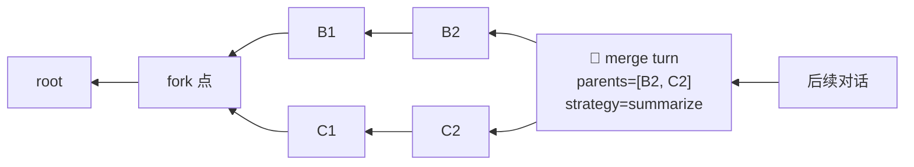
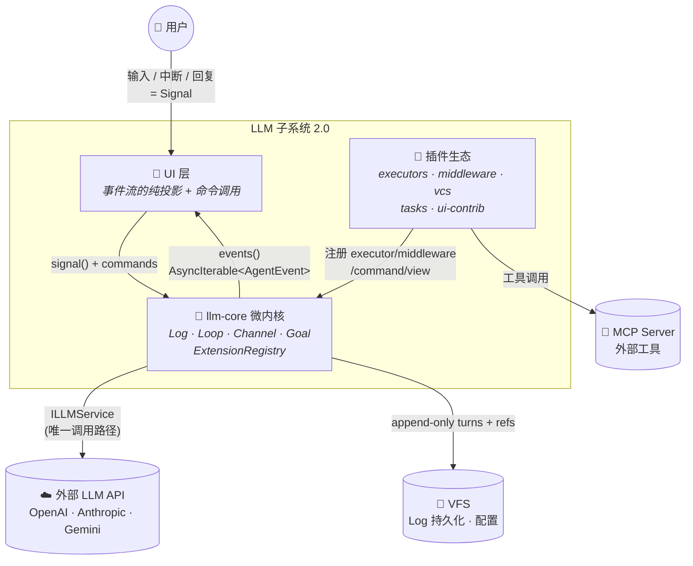
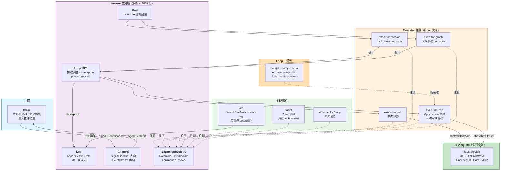
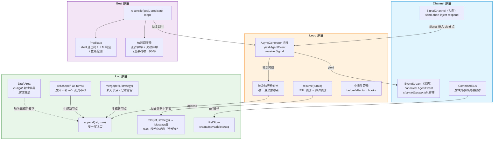

# LLM 子系统 2.0 — 四原语内核 + 插件框架设计

> 设计日期: 2026-07-13 | 最后更新: 2026-07-14（S9 完成：llm-kernel 物理删除 + HarnessAdapter 清理）| 分支: v4.1
> 前置分析: [llm-design.md](./llm-design.md)（现状五包架构审查）
> 定位: 本文档是重构的**宪法**——定义不变的内核原语与扩展契约，现有功能全部归约为原语组合

---

## 实施进度

**S1~S9 全部完成**（2026-07-14）。S7 分两阶段交付（基础设施 → 收尾清理），S6+S7+S8 拆分为五个子阶段全部交付。S9 完成 llm-kernel 物理删除 + HarnessAdapter/IHarnessContext 清理。剩余 1 项为延后的 llm-harness AgentLoopExecutor ILoop 化迁移。

| 阶段 | 状态 | 关键交付 | 剩余工作 |
|---|---|---|---|
| **S1** 统一 LLM 调用 | ✅ | `ILLMService` 成为 Agent Loop 路径唯一入口；`streamRaw()` 删除 | Kernel `executeQuery` 路径仍未迁移 |
| **S2** AgentEvent + ILoop | ✅ | canonical `AgentEvent` schema；`ILoop`/`ILoopMiddleware` 接口；`ExecutorRegistry` | 旧事件消费者完全迁移至 canonical AgentEvent |
| **S3** Loop 协程 + 中间件 | ✅ | `drive()` 协程宿主接入 TaskRunner；`LoopExecutor`（AsyncGenerator ILoop）取代 UnifiedLoopStrategy；`chatExecutor`；6 个内置中间件；`SessionActor` 桥接；HarnessAdapter/UnifiedLoopStrategy 下线 | `AgentLoopExecutor` 旧代码移除（llm-harness）；resume() 完整实现；mission/lite-sub-agent-router 迁移至 ILoop |
| **S4** Log 收敛 | ✅ | `ChatEngineLog` 完整 ILog 实现（VFS DraftArea、ChatManifest RefStore、fold 缓存、merge 去重、rebase 结构）；`createSessionLogAdapter` → ChatEngineLog；RefStore 异步化；ChatManifest 新增 `tags`；**验收达成**：`LockManager`/`manifest-repair`/`ThrottledWriter` 已真正删除；`SessionState` 重新定位为合法的 ILog.fold() 投影缓存；旧 ID（`BBB_SSSSS_R`）→ ULID（`makeNodeId` 改用 `ulid()`） | — |
| **S5** Goal 统一 | ✅ | `IController`/`Goal`/`GoalNode`/`Predicate`/`Verdict` 接口（common）；`DependencyScheduler`（Kahn 拓扑 + 事件驱动）；`reconcile()` 算法；3 个内置 Predicate（truncation/shell/llm-judge）；**验收达成**：4 个控制回路全部切换至 reconcile()/DependencyScheduler 驱动；AutoContinue → `createTruncationDetectionMiddleware`；BackPressure 存根 → 真实实现；Mission → `reconcile()` + `SubAgentLoopAdapter` + `createMissionGoal`；SessionGraph → `executeWithReconcile()` + `AgentRuntimeLoopAdapter` + `createGraphGoal` | — |
| **S6a** 内核裁剪 | ✅ | llm-kernel 删除 15 个死代码文件（~60%）；`ExecutorType` 收缩为 `'agent'`；`initializeKernel` 简化；`executePlan()` 删除 | — |
| **S6b** @deprecated 清理 | ✅ | 删除 `CompletionAnalyzer` 文件 + `AutoContinueHandler` 类 + `executeSession()` 路径 + `orchestrator-interfaces.ts` + llm-harness 2 个死代码文件 + `autoContinue` 死配置管线 | — |
| **S6c** 内核收敛 + 适配器清理 | ✅ | `LLMKernelAdapter` + `UIEventAdapter` 删除；`executeTask()` 切换为 `ILLMService.chatStream()` 直连；`AgentExecutor` + `BaseExecutor` 物理删除（llm-kernel）；`DependencyGraph` 删除（`resolveDependencyTree()` 替代）；`auto-continue.ts` 删除；`HarnessAdapter` 解耦（`IHarnessContext` 服务定位器 + llm-ui 3 文件迁移） | — |
| **S7** 事件统一 | ✅ | ★ `SessionEvent` = canonical `AgentEvent` (15) + `MessageProjectionEvent` (3) + `SessionStructuralEvent` (8，含 regenerate) 替代 `OrchestratorEvent` (28)；`OrchestratorEvent` 类型已删除；`SessionEventBus` 直接接受 `SessionEvent`（无过渡期格式检测）；所有生产者（SessionManager、TaskRunner、HarnessAdapter、SessionActor）统一 emit `SessionEvent`；`HistoryView` / `SessionEventHandler` 旧事件 fallback 已清理；`EventBatchProcessor` 默认 chunkType/statusType 切换为 `message:updated`/`message:status`；`ClaudeCodeStrategy`（死代码）已删除；`HarnessStrategy` 已删除；`getHarnessAdapter()` 已删除 | — |
| **S8** llm-kernel 消除 | ✅ | ★ `@itookit/llm-kernel` 包消除 — `NodeStatus`/`ExecutorConfig`/`ExecutorType` 内联至 `llm-engine/core/types.ts`；`setKernelDeviceManager`/`getKernelDeviceManager` 迁移至 `llm-engine/core/device-registry.ts`（新建）；`initializeKernel()` inline 至 `initializeLLMEngine()`；所有 7 处 import 路径更新（llm-engine ×4、app-shell ×2、test ×1）；6 个 `package.json` 依赖移除（llm-engine、app-shell、web-app、tauri-app、demo）；3 个 `vite.config` alias 移除（web-app、tauri-app、demo）；`tsup.config.ts` external 清理 | — |
| **S9** 清理收尾 | ✅ | ★ `@itookit/llm-kernel` 包物理删除（源码 + dist + package.json + 配置）；`HarnessAdapter` 类删除（~370 行，`execute()` 从未被调用）；`IHarnessContext` 删除（`harness-context.ts`，从未被初始化）；`useClaudeCode`/`maxTurns` 死字段移除（`ExecutionOverrides`）；llm-ui 3 文件清理 `getHarnessContext()` 调用；SlashCommandRouter 删除 `buildHarnessSlashCallbacks`（~90 行）；`buildHarnessCallbacks`/`injectIntoRunningHarness` 简化为空实现；6 个 CLAUDE.md 文档更新 | — |

### S3 完成内容（2026-07-14）

#### 新增文件

| 文件 | 包 | 说明 |
|---|---|---|
| `core/session-actor.ts` | llm-engine | `SessionActor` — drive() ↔ EventBus 桥接，信号队列管理 |
| `executors/chat-executor.ts` | llm-engine | `chatExecutor` — 单次问答 ILoop（最小实现，测试基线） |
| `executors/loop-executor.ts` | llm-engine | `LoopExecutor` — Agent Loop ILoop（AsyncGenerator），含流式 LLM 调用、工具并行/串行执行、中间件管线 |
| `executors/loop-middleware.ts` | llm-engine | 6 个 ILoopMiddleware：budget、error-recovery、compression、hitl、skills、back-pressure |
| `executors/loop-presets.ts` | llm-engine | `createLoopExecutor(preset)` 工厂：lite = [budget, error-recovery]；full = 全部 6 个 |
| `executors/index.ts` | llm-engine | 桶导出 |

#### 修改文件

| 文件 | 改动 |
|---|---|
| `session/task-runner.ts` | `processQueue()` 改为 ExecutorRegistry dispatch（按 mode）；`executeAgentLoopTask()` 改为 `drive()` + `SessionActor` 桥接 AgentEvent；删除 `selectStrategy()`/`setHarnessAdapter()`/`setToolExecutor()` 等旧方法；新增 `createSessionLogAdapter()` 临时 ILog 桥接 |
| `session/session-manager.ts` | 删除 `setHarnessAdapter()`；移除 `HarnessAdapter` import |
| `index.ts` (llm-engine) | 删除 HarnessAdapter/UnifiedLoopStrategy/agent-loop-strategy 导出；新增 executors/middleware/SessionActor 导出；`initializeLLMEngine()` 默认注册 chat + loop(lite)，接受 `executors` 参数；删除 `harnessRuntime`/`harnessSkillService`/`harnessToolService` 选项 |
| `core/types.ts` | `ExecutionOverrides` 新增 `mode?: string` 字段 |
| `bootstrap.ts` (app-shell) | 删除 `harnessRuntime`/`harnessSkillService`/`harnessToolService` 传递 |

#### 架构变化

```
旧路径:
  TaskRunner.processQueue()
    ├─ useHarness=true → selectStrategy()
    │   ├─ HarnessStrategy(harnessAdapter) → AgentLoopExecutor.run()
    │   └─ UnifiedLoopStrategy(llmService, toolExecutor).run()
    └─ useHarness=false → executeTask() → LLMKernelAdapter.executeQuery()

新路径:
  TaskRunner.processQueue()
    ├─ mode specified → executeAgentLoopTask(mode)
    │   └─ ExecutorRegistry.get(mode).run(ctx) → drive(gen, actor, ctx)
    │       ├─ mode='chat'     → chatExecutor (单轮，无工具)
    │       ├─ mode='loop'     → LoopExecutor(lite) = [budget, error-recovery, truncation]
    │       └─ mode='loop:full' → LoopExecutor(full) = 全部 7 个中间件
    └─ mode absent → executeTask() → ILLMService.chatStream()（S6c: 替代 LLMKernelAdapter）
```

### 新增文件清单（S1~S3 累计）

| 文件 | 包 | 说明 |
|---|---|---|
| `interfaces/agent/agent-event.ts` | common | canonical AgentEvent schema（~22 事件） |
| `interfaces/agent/loop.ts` | common | ILoop / ILoopMiddleware / ILog / Turn / Signal |
| `core/executor-registry.ts` | llm-engine | mode→ILoop 分发注册表 |
| `core/loop-driver.ts` | llm-engine | `drive()` 协程宿主（pause/resume 一条路径） |
| `core/middleware-pipeline.ts` | llm-engine | `composeMiddleware()` 管线组装 |
| `core/session-actor.ts` | llm-engine | SessionActor — AgentEvent 桥接 + 信号队列 |
| `executors/chat-executor.ts` | llm-engine | chatExecutor — 单次问答 ILoop |
| `executors/loop-executor.ts` | llm-engine | LoopExecutor — Agent Loop ILoop（AsyncGenerator） |
| `executors/loop-middleware.ts` | llm-engine | 6 个内置 ILoopMiddleware |
| `executors/loop-presets.ts` | llm-engine | createLoopExecutor(lite\|full) 工厂 |
| `executors/index.ts` | llm-engine | 桶导出 |
| `persistence/ulid.ts` | llm-engine | ULID 生成（Crockford base32） |
| `persistence/chat-engine-log.ts` | llm-engine | `ILog` facade on old ChatEngine |

### 修改文件清单（S1~S3 累计）

| 文件 | 改动 |
|---|---|
| `unified-loop-strategy.ts` | `LLMKernelAdapter` → `ILLMService`（S1）；**S3 中从 index.ts 移除导出，文件保留供内部兼容** |
| `claude-code-runner.ts` | 同上 |
| `lite-sub-agent-router.ts` | 同上 |
| `mission-service.ts` | `kernelAdapter` → `llmService` |
| `task-runner.ts` | 新增 `setLLmService()`（S1）；**S3 中接入 ExecutorRegistry + drive()，删除 selectStrategy 等旧方法** |
| `session-manager.ts` | 新增 `setLLMService()`（S1）；**S3 中删除 setHarnessAdapter** |
| `index.ts` (llm-engine) | `EngineInitOptions.llmService` + 新模块导出（S1）；**S3 中删除 HarnessAdapter/UnifiedLoopStrategy 导出，新增 executors 导出，更新 initializeLLMEngine** |
| `core/types.ts` | **S3 中 ExecutionOverrides 新增 mode 字段** |
| `bootstrap.ts` (app-shell) | 传递 `llmService`（S1）；**S3 中删除 harnessRuntime 等参数** |
| `llmkernel-adapter.ts` | 删除 `streamRaw()` |
| `agent-types.ts` (common) | `AgentEventType` 标记 @deprecated |
| `types.ts` (engine) | `OrchestratorEvent` 标记 @deprecated |
| `interfaces/agent/index.ts` (common) | 新增 agent-event、loop 导出 |

### S4 完成内容（2026-07-14）

#### 新增/重写文件

| 文件 | 包 | 说明 |
|---|---|---|
| `persistence/chat-engine-log.ts` | llm-engine | **重写** — 完整 ILog 实现：VFSDraftArea（崩溃安全草稿持久化）、ChatEngineRefStore（ChatManifest 驱动的分支/标签管理）、fold TTL 缓存、merge 去重 + 三策略支持、rebase 下游结构 |

#### 修改文件

| 文件 | 改动 |
|---|---|
| `interfaces/chat.ts` (common) | ChatManifest 新增 `tags?: Record<string, string>` 字段 |
| `interfaces/agent/loop.ts` (common) | RefStore 接口方法签名改为支持 `Promise` 返回（`create`、`move`、`tag`、`delete`、`list`） |
| `session/task-runner.ts` | `createSessionLogAdapter()`（S3 临时桥接）替换为 `new ChatEngineLog(this.engine, sessionId)`；移除 `prebuiltMessages` 预计算；内联 accumulator/persist/finalize 替代 `createThrottledWriter` |
| `session/session-state.ts` | 移除 @deprecated，重新定位为 ILog.fold() 投影缓存 |
| `persistence/chat-engine.ts` | 移除 `LockManager` 导入（→ 内联 `withLock()` Promise 链）；移除 `manifest-repair` 导入及 3 个调用点 + 2 个死方法；`makeNodeId()` 改用 `ulid()`（替代 `BBB_SSSSS_R`）；移除 `allocateSn` |
| `index.ts` (llm-engine) | 新增 `ChatEngineLog` 导出；移除 `createThrottledWriter`/`ThrottledWriter` 导出 |

#### 删除文件

| 文件 | 原因 |
|---|---|
| `utils/LockManager.ts` | → ChatEngine 内联 `withLock()` Promise 链 |
| `utils/manifest-repair.ts` | → append-only 无不一致态 |
| `utils/throttled-writer.ts` | → TaskRunner 内联 accumulator 模式 |

### S5 完成内容（2026-07-14）

#### 新增文件

| 文件 | 包 | 说明 |
|---|---|---|
| `interfaces/agent/goal.ts` | common | `IController` / `Goal` / `GoalNode` / `TaskSpec` / `Predicate` / `Verdict` / `GoalNodeStatus` — 控制回路全部类型定义 |
| `core/goal/dependency-scheduler.ts` | llm-engine | `DependencyScheduler` — Kahn 拓扑排序 + `CycleError` 环检测；`readySet()` / `complete()` / `fail()` + 自动 `propagateSkipped`；事件驱动 `onChange()` 替代 500ms 轮询；`snapshot()` 驱动 `goal:progress` 事件 |
| `core/goal/reconciler.ts` | llm-engine | `reconcile()` 算法 — 并行/串行节点分发、并发上限控制、重试循环、HITL 暂停、Predicate 评估 |
| `core/goal/predicates.ts` | llm-engine | 3 个内置 Predicate：`truncation`（启发式截断检测）、`shell`（退出码判定）、`llm-judge`（verifier LLM 结构化判定） |
| `core/goal/index.ts` | llm-engine | 桶导出 |

#### 修改文件

| 文件 | 改动 |
|---|---|
| `interfaces/agent/index.ts` (common) | 新增 `goal` 导出 |
| `index.ts` (llm-engine) | 新增 Goal 模块导出（`DependencyScheduler`、`reconcile`、3 个 Predicate 工厂） |

#### 四个现有控制回路 → Goal 配置映射（全部已切换 ✅）

| 现有模块 | Goal 配置 | 迁移状态 |
|---|---|---|
| **Mission** | nodes = TodoItem[]；edges = todo deps；predicate = `llm-judge` | ✅ `MissionScheduler.run()` → `reconcile(createMissionGoal(plan), …)` + `SubAgentLoopAdapter` |
| **SessionGraph** | nodes = 文件依赖拓扑；edges = 文件 `dependencies`；predicate = `llm-judge` | ✅ `GraphOrchestrator.executeSession()` → `executeWithReconcile()` + `AgentRuntimeLoopAdapter` |
| **AutoContinue** | 单节点；predicate = `truncation`；retry = 续写 prompt | ✅ while(true) 循环 → `createTruncationDetectionMiddleware`（ILoop afterTurn） |
| **BackPressure** | 单节点；predicate = `shell`；retry feedback = stderr | ✅ 存根 → 真实 `createBackPressureMiddleware`（注入工具错误反馈供 LLM 自我修正） |

### S5 验收达成 — 新增内容（2026-07-14）

#### 新增文件

| 文件 | 包 | 说明 |
|---|---|---|
| `mission/sub-agent-loop-adapter.ts` | llm-engine | `SubAgentLoopAdapter` — 将 `ISubAgentRouter.delegate()`（同步）包装为 ILoop 协程 |
| `mission/mission-goal-factory.ts` | llm-engine | `createMissionGoal(plan)` — 将 `MissionPlan` 的 TodoItem[] + dependsOn 转为 Goal + GoalNode[] + edges |
| `session-graph/agent-runtime-loop-adapter.ts` | llm-engine | `AgentRuntimeLoopAdapter` — 将 `IAgentRuntime.run()` 包装为 ILoop 协程 |
| `session-graph/graph-goal-factory.ts` | llm-engine | `createGraphGoal(vfs, moduleName, path)` — 展开 Session 文件依赖图为 Goal |

#### 修改文件

| 文件 | 改动 |
|---|---|
| `interfaces/agent/loop.ts` (common) | `Turn` 新增 `result?: TurnResult`（LoopExecutor 存储运行时输出供 Predicate 消费）；`TurnResult` 新增 `finishReason?: string` |
| `core/goal/reconciler.ts` | **Bug 修复**：TurnResult 从 `turn.result` 读取（替代空数组）；retry-feedback 中间件返回 `{action: 'inject', text}`（替代空操作） |
| `core/goal/predicates.ts` | **Bug 修复**：`summarizeResult` 中 `block.content` → `block.text`；`parseVerdict` 返回类型显式标注 `Verdict`；修复 PauseRequest 字段（`question` → `message`） |
| `core/goal/dependency-scheduler.ts` | **Bug 修复**：移除未使用的 `Goal` import；`onChangePromise` 从 `readonly` 改为可变；`notify` 变量类型标注 `\| undefined` |
| `executors/loop-executor.ts` | 存储 `TurnResult` → `turn.result`；捕获流式响应中的 `finishReason`；`beforeTurn` 移至 `fold()` 之后以支持 `inject` 指令 |
| `executors/loop-middleware.ts` | 新增 `createTruncationDetectionMiddleware`（AutoContinue → ILoop afterTurn）；`createBackPressureMiddleware` 从存根替换为真实实现（注入工具错误反馈） |
| `executors/loop-presets.ts` | lite + full preset 均添加 `createTruncationDetectionMiddleware`；full preset 中间件 6→7 |
| `executors/index.ts` | 新增 `createTruncationDetectionMiddleware` 导出 |
| `mission/mission-scheduler.ts` | **重写** — `run()` 用 `reconcile()` + `DependencyScheduler` 替代 while(true)+500ms 轮询；删除内嵌 `runVerifier()`；使用 `createLLMJudgePredicate` + `SubAgentLoopAdapter` |
| `mission/mission-service.ts` | 传递 `llmService` 给 `MissionScheduler`（llm-judge predicate 所需） |
| `mission/index.ts` | 新增 `createMissionGoal`、`createSubAgentLoopAdapter`、`SubAgentLoopAdapterOptions` 导出 |
| `session-graph/graph-orchestrator.ts` | 新增 `executeWithReconcile()` 方法（reconcile-driven）；旧 `executeSession()` 标记 @deprecated |
| `session-graph/dependency-graph.ts` | `topoSort()` 标记 @deprecated（被 `DependencyScheduler` 替代） |
| `session-graph/completion-analyzer.ts` | `CompletionAnalyzer` 标记 @deprecated（被 `createLLMJudgePredicate` 替代） |
| `session-graph/index.ts` | 新增 `createGraphGoal`、`createAgentRuntimeLoopAdapter` 等导出 |
| `session/task-runner.ts` | 删除 `executeTask()` 中的 while(true) auto-continue 循环；删除 `trimTrailingAssistant`；移除 `AutoContinueHandler` 使用 |
| `session/auto-continue.ts` | `AutoContinueHandler` 标记 @deprecated → **S6b 已删除** |
| `index.ts` (llm-engine) | 新增 `createTruncationDetectionMiddleware`、Mission/Graph Goal 适配器导出；`AutoContinueHandler` 导出标记 @deprecated → **S6b 已移除** |

#### @deprecated 清单（S5 标记 → S6b 已删除）

| 组件 | 替代 | 最终状态 |
|---|---|---|
| `AutoContinueHandler` | `createTruncationDetectionMiddleware` | **已删除**（类 + `DEFAULT_AUTO_CONTINUE` 常量，`auto-continue.ts` 仅保留类型定义） |
| `CompletionAnalyzer` | `createLLMJudgePredicate` | **已删除**（文件 + 所有导出） |
| `DependencyGraph.topoSort()` | `DependencyScheduler` | **已删除（S6c）** — `DependencyGraph` 类已删除，替换为 `resolveDependencyTree()` 自由函数 |
| `GraphOrchestrator.executeSession()` | `GraphOrchestrator.executeWithReconcile()` | **已删除**（方法 + 5 个私有辅助方法） |

### S6a 完成内容（2026-07-14）— 内核裁剪

#### 删除文件（llm-kernel 死代码，共 15 个）

| 删除项 | 文件数 | 原因 |
|---|---|---|
| CLI Runner | `cli/runner.ts` + `cli/index.ts` | 零外部导入 |
| Worker 协议 | `worker/worker-adapter.ts` + `worker/worker-client.ts` + `worker/index.ts` | 零外部导入 |
| Plugin 系统 | `plugins/plugin-manager.ts` + `plugins/plugin-interface.ts` | 零插件注册 |
| Script Executor | `executors/script-executor.ts` | 未注册，零外部使用 |
| Http Executor | `executors/http-executor.ts` | 仅注册表中自引用，零外部使用 |
| Tool Executor | `executors/tool-executor.ts` | 仅注册表中自引用，零外部使用 |
| StateMachine | `runtime/state-machine.ts` | 零外部使用 |
| MemoryStore | `runtime/memory-store.ts` | 零外部使用 |
| 5 Orchestrator | `orchestrators/serial\|parallel\|router\|loop\|dag-orchestrator.ts` + `index.ts` | 零外部调用 `executePlan()` |
| Validators | `utils/validators.ts` | 零外部导入 |
| Logger | `utils/logger.ts` | 零外部导入 |

#### 修改文件

| 文件 | 改动 |
|---|---|
| `index.ts` (llm-kernel) | **重写** — 移除 ~15 个死代码导出；`initializeKernel()` 简化为仅初始化 Runtime（移除 PluginManager）；`KernelInitOptions.plugins` 保留为空接受项 |
| `executors/index.ts` (llm-kernel) | 移除 `HttpExecutor` 导入及 `registerBuiltins` 注册（仅保留 `agent`） |
| `core/types.ts` (llm-kernel) | `ExecutorType` 收缩为 `'agent'`（删除 `'http'` `'tool'` `'script'`） |
| `runtime/execution-runtime.ts` (llm-kernel) | 移除 `getOrchestratorRegistry` 导入；删除 `executePlan()` 方法（依赖已删除的 Orchestrator） |

#### S6a 保留项（被外部引用，不能删）

| 模块 | 引用方 |
|---|---|
| `core/types.ts`（`NodeStatus`） | `llm-engine` |
| `core/interfaces.ts`（`ExecutorConfig`） | `llm-engine` |
| `core/event-bus.ts`（`getEventBus`, `KernelEventMap`） | `llm-engine` |
| `core/device-registry.ts`（`setKernelDeviceManager`） | `app-shell` |
| `runtime/execution-runtime.ts`（`ExecutionRuntime`, `getRuntime`） | `llm-engine`（S6c: `execute()` 方法已删除，其余保留） |
| `utils/id-generator.ts` | 多处内部引用 |

> **S6c 更新**: `executors/agent-executor.ts` + `base-executor.ts` 已在 S6c 删除（唯一消费方 `LLMKernelAdapter` 随 Phase 3 删除）。

---

### S6b 完成内容（2026-07-14）— @deprecated 清理

在 S6a 内核裁剪基础上，删除已确认零消费者的 @deprecated 代码和死代码。

#### 删除文件（4 个）

| 文件 | 包 | 原因 |
|---|---|---|
| `skills/correction-log.ts` | llm-harness | 零内部/外部导入 |
| `skills/subagent-skill-bridge.ts` | llm-harness | 零内部/外部导入 |
| `core/orchestrator-interfaces.ts` | llm-kernel | 5 个 orchestrator 在 S6a 已删除，仅剩类型空壳 |
| `session-graph/completion-analyzer.ts` | llm-engine | 仅被已废弃的 `executeSession()` 使用 |

#### 删除代码块（llm-engine）

| 文件 | 删除内容 | 行数 |
|---|---|---|
| `session-graph/graph-orchestrator.ts` | `executeSession()` + 5 个私有方法（`runOneSession`、`buildPrompt`、`invokeAgent`、`skipRemaining`、`resolvePath`） | ~135 |
| `session/auto-continue.ts` | `AutoContinueHandler` 类 + `DEFAULT_AUTO_CONTINUE` 常量 + 相关 import | ~130 |

#### 清理死配置管线（llm-engine）

| 文件 | 删除内容 |
|---|---|
| `session/task-runner.ts` | `AutoContinueConfig` import；`TaskRunnerOptions.autoContinue` 字段（从不读取） |
| `session/session-manager.ts` | `AutoContinueConfig` import；constructor `autoContinue` 选项 + 透传 |
| `core/types.ts` | `ExecutionOverrides.autoContinue` 字段 |

#### 修改文件（llm-engine 导出清理）

| 文件 | 改动 |
|---|---|
| `index.ts` | 移除 `CompletionAnalyzer`、`AutoContinueHandler`、`CompletionVerdict` 导出 |
| `session-graph/index.ts` | 移除 `CompletionAnalyzer`、`CompletionVerdict` 导出；快速开始示例改用 `executeWithReconcile()` |
| `executors/loop-middleware.ts` | `DEFAULT_AUTO_CONTINUE` → 内联 `TRUNCATION_DETECTION_DEFAULTS` 常量 |

#### 附带修复

| 文件 | 包 | 问题 | 修复 |
|---|---|---|---|
| `device/skill-manager.ts` | device-llm | `invokeShellSkill` 访问不存在的 `skill.command`（`SkillDefinition` 无此属性） | 改为 `skill.tools.find(t => t.executionType === 'shell')?.command` |

#### S6b 验收标准

| 标准 | 状态 |
|---|---|
| 所有删除文件的符号零引用（grep 验证） | ✅ |
| llm-kernel 编译通过 | ✅ |
| llm-engine 编译通过 | ✅ |
| llm-harness 编译通过 | ✅ |
| device-llm 编译通过 | ✅ |
| 旧执行路径（`executeSession`）不可访问 | ✅ |
| `AutoContinueHandler` 零消费者 | ✅ |

---

### S6c 完成内容（2026-07-14）— 内核收敛 + 适配器清理

#### 删除文件（6 个）

| 文件 | 包 | 原因 |
|---|---|---|
| `session/auto-continue.ts` | llm-engine | 类型定义内联至 `loop-middleware.ts`（`TruncationDetectionConfig`）；`ContinueDecision` 零消费者 |
| `session-graph/dependency-graph.ts` | llm-engine | `topoSort()` → `resolveDependencyTree()` 自由函数（`graph-goal-factory.ts`）；`CycleError` 迁至同文件 |
| `adapters/llmkernel-adapter.ts` | llm-engine | `executeTask()` 切换为 `ILLMService.chatStream()` 直连 |
| `adapters/ui-event-adapter.ts` | llm-engine | 仅被 `LLMKernelAdapter` 使用，随之一并删除 |
| `executors/agent-executor.ts` | llm-kernel | 零外部消费者（唯一调用方 `LLMKernelAdapter` 已删除） |
| `executors/base-executor.ts` | llm-kernel | 仅被 `AgentExecutor` 继承 |

#### 新增文件

| 文件 | 包 | 说明 |
|---|---|---|
| `core/harness-context.ts` | llm-engine | `IHarnessContext` 服务定位器 — `setHarnessContext()` / `getHarnessContext()`，解耦 llm-ui 对 `HarnessAdapter` 的直接依赖 |

#### 修改文件

| 文件 | 包 | 改动 |
|---|---|---|
| `executors/loop-middleware.ts` | llm-engine | 内联 `TruncationDetectionConfig` 接口（替代 `AutoContinueConfig`）；删除对 `auto-continue.ts` 的 import |
| `session-graph/graph-goal-factory.ts` | llm-engine | **重写** — 新增 `resolveDependencyTree()` 自由函数（DFS 依赖解析 + 目录展开 + 环检测）；`createGraphGoal()` 改用此函数；移入 `CycleError` 类 |
| `session-graph/graph-orchestrator.ts` | llm-engine | `getStatus()` / `resetSession()` 改用 `resolveDependencyTree()`；移除 `this.graph`（DependencyGraph 实例） |
| `session-graph/index.ts` | llm-engine | `DependencyGraph` → `resolveDependencyTree` + `CycleError` 导出 |
| `session/task-runner.ts` | llm-engine | **核心变更** — `executeTask()` 中 `LLMKernelAdapter.executeQuery()` 替换为 `ILLMService.chatStream()` 直连；构建 `ChatMessage[]`（system prompt + history + 当前用户输入）；流式迭代 `ChatCompletionChunk` 并构造 `OrchestratorEvent`；token 统计优先使用真实数据（`llmUsage`），回退字符估算；移除 `kernelAdapter` 字段 |
| `adapters/harness-adapter.ts` | llm-engine | `initHarnessAdapter()` 同步调用 `setHarnessContext()`；`setSkillService()` / `setToolService()` 同步更新 context；`getHarnessAdapter()` 标记 @deprecated |
| `runtime/execution-runtime.ts` | llm-kernel | 删除 `execute()` 方法（~100 行）；保留 `cancel` / `cancelAll` / `getActiveCount` / `onEvent` / `onExecutionEvent` |
| `executors/index.ts` | llm-kernel | 移除 `AgentExecutor` import 和 `registerBuiltins()` 注册；保留空注册表框架（供将来扩展） |
| `index.ts` | llm-kernel | 移除 `AgentExecutor` / `AgentExecutorConfig` / `BaseExecutor` 导出 |
| `index.ts` | llm-engine | 移除 `LLMKernelAdapter` / `getLLMKernelAdapter` / `UIEventAdapter` / `DependencyGraph` / `AutoContinueConfig` / `ContinueDecision` 导出；新增 `IHarnessContext` / `setHarnessContext` / `getHarnessContext` 导出；注释掉的行清理 |
| `core/constants.ts` | llm-engine | 注释 `AutoContinueConfig.maxContinuations` → `TruncationDetectionConfig.maxContinuations` |
| `core/goal/dependency-scheduler.ts` | llm-engine | 注释 "engine DependencyGraph" → "deleted S6c, replaced by resolveDependencyTree" |
| `core/device-registry.ts` | llm-kernel | 文件头和函数注释移除 `AgentExecutor` 引用 |
| `shell/HarnessIntegration.ts` | llm-ui | `HarnessAdapter` 参数 → `IHarnessContext`；`getHarnessAdapterFn` → `getContextFn` |
| `shell/SlashCommandRouter.ts` | llm-ui | `getHarnessAdapter()` → `getHarnessContext()`；`.getSkillService()` → `.skillService` 等 |
| `shell/LLMWorkspaceEditor.ts` | llm-ui | 同上，4 处替换 |

#### 文档更新

| 文件 | 改动 |
|---|---|
| `packages/llm-kernel/CLAUDE.md` | S6c 说明；架构图更新；外部消费方更新；变更记录 |
| `packages/llm-engine/CLAUDE.md` | S6c 说明；架构图更新；执行路径更新；S6 删除清单扩展；Harness 服务访问说明 |
| `doc/pkgstructure.md` | `llm-kernel` 和 `llm-engine` 描述更新 |
| `doc/architecture.md` | LLM 引擎栈描述更新 |
| `doc/integration-chains.md` | kernel 路径描述更新 |

#### S6c 验收标准

| 标准 | 状态 |
|---|---|
| `LLMKernelAdapter` + `UIEventAdapter` 零引用（grep 验证） | ✅ |
| `AgentExecutor` + `BaseExecutor` 零引用 | ✅ |
| `DependencyGraph` 零引用 | ✅ |
| `auto-continue.ts` 零引用 | ✅ |
| `executeTask()` 走 `ILLMService.chatStream()` 直连 | ✅ |
| `IHarnessContext` 替代 `HarnessAdapter`（llm-ui 3 文件） | ✅ |
| llm-kernel 编译通过 | ✅ |
| llm-engine 编译通过 | ✅ |
| llm-ui 编译通过（我修改的 3 文件零新错误） | ✅ |

---

### S7 完成内容（2026-07-14）— 事件统一（基础设施）

S7 分两个阶段交付：基础设施（07-14 上午）→ 收尾清理（07-14 下午）。

#### Phase 1 — 基础设施（上午）

类型系统、EventBus 切换、UI 双路径、主要生产者迁移。

| 文件 | 包 | 改动 |
|---|---|---|
| `interfaces/agent/agent-event.ts` | common | 新增 `AgentEventToolInput`（`{ type: 'tool:input'; call: ToolCallInfo & { delta } }`）+ `AgentEventLogRefRenamed`（`{ type: 'log:ref_renamed'; ref; oldName; newName }`）；canonical union 13→15 |
| `core/types.ts` | llm-engine | 新增 `MessageProjectionEvent`（`message:appended/updated/status`，3 变体）、`SessionStructuralEvent`（`messages:cleared/deleted`、`message:edited`、`sibling:switched`，6 变体）、`SessionEvent = AgentEvent \| MessageProjectionEvent \| SessionStructuralEvent`；保留 `OrchestratorEvent` @deprecated |
| `session/session-event-bus.ts` | llm-engine | **重写** — 泛型 `OrchestratorEventMap` → `SessionEventMap`；`emitSession` 接受 `TransitionalEvent = SessionEvent \| OrchestratorEvent`，自动检测新旧格式；`onSession` handler 类型为 `(event: SessionEvent) => void` |
| `session/task-runner.ts` | llm-engine | **SessionActor 桥接** — `stream:content/thinking` 同时 emit canonical + `node_update`（树投影）；`turn:*`/`tool:*`/`finished`/`error` 直接 forward canonical `AgentEvent`；移除所有 `as OrchestratorEvent` 强制转换 |
| `session/session-manager.ts` | llm-engine | `onEvent` handler 类型 `OrchestratorEvent` → `SessionEvent`；3 事件重命名（`messages_deleted`→`messages:deleted`、`message_edited`→`message:edited`、`sibling_switch`→`sibling:switched`） |
| `shell/SessionEventHandler.ts` | llm-ui | `handleSessionEvent`/`handleBranchEvent`/`updateStatusFromEvent` 类型切换至 `SessionEvent`；`EVENT_SIDE_EFFECTS` 表新增 8 个新事件名条目 |
| `components/HistoryView.ts` | llm-ui | `processEvent`/`processEventImmediate`/`handleBatchedEvents` 类型切换至 `SessionEvent`；switch 内新增 canonical + projection + structural 分支 |
| `domain/ports/IHistoryPresenter.ts` | llm-ui | `processEvent(event: OrchestratorEvent)` → `processEvent(event: SessionEvent)` |

#### Phase 2 — 收尾清理（下午）

全部生产者迁移至 `SessionEvent`、`OrchestratorEvent` 类型删除、UI 旧 fallback 清理、死代码删除。

##### 新增文件

| 文件 | 包 | 说明 |
|---|---|---|
| — | — | Phase 2 无新增文件，全部为修改/删除 |

##### 修改文件

| 文件 | 包 | 改动 |
|---|---|---|
| `core/types.ts` | llm-engine | ★ **删除 `OrchestratorEvent` 类型定义**（28 变体，~45 行）；`SessionStructuralEvent` 新增 `regenerate_started` / `regenerate_completed`（6→8 变体） |
| `session/session-event-bus.ts` | llm-engine | ★ 删除 `TransitionalEvent` 类型；删除 `'payload' in event` 格式检测；`emitSession(sessionId, event: SessionEvent)` 直接接受 `SessionEvent`；移除 `OrchestratorEvent` import |
| `session/session-manager.ts` | llm-engine | ★ 6 个旧事件名替换：`branch_created`→`log:appended`（canonical flat）、`branch_switched`→`log:ref_moved`、`branch_renamed`→`log:ref_renamed`、`branch_deleted`→`messages:deleted`、`session_cleared`→`messages:cleared`、`session_start`→`message:appended`（payload 包装为 `{ sessionGroup }`） |
| `session/task-runner.ts` | llm-engine | ★ 树投影 `node_update`→`message:updated`（`nodeId`→`messageId`、`chunk`→`delta`）、`node_status`→`message:status`；`session_start`→`message:appended`、`node_start`→`message:appended`（`isExecutionRoot: true`）；`createEventHandler`/`handleUIEvents` 类型从 `OrchestratorEvent` 切换至 `SessionEvent`；清理旧事件名兼容逻辑 |
| `session/agent-loop-strategy.ts` | llm-engine | `AgentLoopContext.onEvent` 类型从 `(event: OrchestratorEvent) => void` → `(event: { type: string; [key: string]: any }) => void` |
| `session/unified-loop-strategy.ts` | llm-engine | 移除 `OrchestratorEvent` import；所有 `onEvent` 参数类型改为通用回调 |
| `adapters/harness-adapter.ts` | llm-engine | ★ `execute()` 的 `onEvent` 回调类型从 `OrchestratorEvent` → `SessionEvent`；内部所有 emit 改用 `message:updated`/`message:status`/`message:appended`（含 `as SessionEvent` cast）；error 事件改为 canonical `{ type: 'error', error: {...} }` 格式；删除 `HarnessStrategy` 死代码类（~65 行）；删除 `getHarnessAdapter()`；注释清理 |
| `index.ts` | llm-engine | 移除 `getHarnessAdapter` 导出 |
| `shell/SessionEventHandler.ts` | llm-ui | ★ `EVENT_SIDE_EFFECTS` 删除 10 个旧事件条目（`session_start`、`branch_*`、`messages_deleted` 等）；`handleBranchEvent` 删除 `branch_deleted`/`branch_renamed` 旧 case；`log:appended` 补充 `flashIndicator` 副作用 |
| `components/HistoryView.ts` | llm-ui | ★ `processEventImmediate` 删除 7 个旧 case（`session_start`、`node_start`、`node_status`、`messages_deleted`、`message_edited`、`session_cleared`、`sibling_switch`）；`immediateTypes` 移除旧事件名 |
| `components/common/EventBatchProcessor.ts` | llm-ui | ★ `chunkEventType` 默认值 `'node_update'`→`'message:updated'`；`statusEventType` 默认值 `'node_status'`→`'message:status'`；统一使用 `messageId`（移除 `nodeId` fallback）；移除双格式检测逻辑 |

##### 删除文件

| 文件 | 包 | 原因 |
|---|---|---|
| `session/claude-code-runner.ts` | llm-engine | 死代码 — 未导出、未注册、未实例化。已被 S3 的 `LoopExecutor` 替代 |

#### S7 验收标准

| 标准 | 状态 |
|---|---|
| `SessionEvent` 类型定义完整（= AgentEvent + Projection + Structural） | ✅ |
| `SessionEventBus` 泛型切换至 `SessionEventMap` | ✅ |
| ~~`SessionEventBus` 过渡期兼容~~ → 过渡期代码已删除 | ✅ |
| UI 消费者（HistoryView、SessionEventHandler）双路径 → 旧 fallback 已删除 | ✅ |
| `SessionActor` 桥接 canonical forward | ✅ |
| session-manager 全部旧事件名替换完成 | ✅ |
| `OrchestratorEvent` 类型定义已物理删除 | ✅ |
| `HarnessAdapter` 事件映射已迁移至 `SessionEvent` | ✅ |
| `EventBatchProcessor` 默认值已切换 | ✅ |
| `ClaudeCodeStrategy` / `HarnessStrategy` / `getHarnessAdapter` 死代码已删除 | ✅ |
| llm-engine 编译通过 | ✅ |
| llm-ui 编译通过（零新增错误） | ✅ |
| `grep -r "OrchestratorEvent" packages/ --include="*.ts"` 仅剩注释引用 | ✅ |

---

### S8 完成内容（2026-07-14）— llm-kernel 消除

#### 迁移映射

| 符号 | 原位置 | 迁移目标 |
|---|---|---|
| `NodeStatus` | `llm-kernel/core/types.ts` | → `llm-engine/core/types.ts` 内联 |
| `ExecutorConfig` | `llm-kernel/core/interfaces.ts` | → `llm-engine/core/types.ts` 内联 |
| `ExecutorType` | `llm-kernel/core/types.ts` | → `llm-engine/core/types.ts` 内联 |
| `setKernelDeviceManager` / `getKernelDeviceManager` | `llm-kernel/core/device-registry.ts` | → `llm-engine/core/device-registry.ts`（新建） |
| `initializeKernel` / `KernelInitOptions` | `llm-kernel/index.ts` | → inline 至 `initializeLLMEngine()` |
| 其余符号（EventBus、IExecutor、ExecutionRuntime、ID generators 等） | 各处 | → 删除（零外部消费者或已有替代） |

#### 新增文件

| 文件 | 说明 |
|---|---|
| `llm-engine/src/core/device-registry.ts` | `setKernelDeviceManager()` / `getKernelDeviceManager()` 单例（从 llm-kernel 迁移） |

#### 修改文件

| 文件 | 改动 |
|---|---|
| `llm-engine/src/core/types.ts` | 删除 `import { NodeStatus } from '@itookit/llm-kernel'`；新增 `NodeStatus`、`ExecutorType`、`ExecutorConfig` 内联定义 |
| `llm-engine/src/session/session-state.ts` | `import { NodeStatus } from '@itookit/llm-kernel'` → `from '../core/types'` |
| `llm-engine/src/session/agent-resolver.ts` | `import { ExecutorConfig } from '@itookit/llm-kernel'` → `from '../core/types'` |
| `llm-engine/src/session/task-runner.ts` | 同上 |
| `llm-engine/src/index.ts` | 删除 `initializeKernel, KernelInitOptions` import；`EngineInitOptions` 不再 `extends KernelInitOptions`；`initializeLLMEngine()` 内联 kernel init（log only）；新增 `setKernelDeviceManager` / `getKernelDeviceManager` 导出 |
| `llm-engine/package.json` | 移除 `@itookit/llm-kernel` from dependencies + peerDependencies |
| `llm-engine/tsup.config.ts` | 移除 `'@itookit/llm-kernel'` from external |
| `llm-engine/vite.config.ts` | 移除 `'@itookit/llm-kernel'` from external + globals |
| `app-shell/src/bootstrap.ts` | `import { setKernelDeviceManager } from '@itookit/llm-kernel'` → `from '@itookit/llm-engine'` |
| `app-shell/package.json` | 移除 `@itookit/llm-kernel` from devDependencies + peerDependencies |
| `apps/web-app/package.json` | 移除 `@itookit/llm-kernel` dependency |
| `apps/web-app/vite.config.ts` | 移除 `@itookit/llm-kernel` alias |
| `apps/tauri-app/package.json` | 移除 `@itookit/llm-kernel` dependency |
| `apps/tauri-app/vite.config.ts` | 移除 `@itookit/llm-kernel` alias |
| `packages/demo/package.json` | 移除 `@itookit/llm-kernel` dependency |
| `packages/demo/vite.config.js` | 移除 `@itookit/llm-kernel` alias + external |

#### S8 验收标准

| 标准 | 状态 |
|---|---|
| `grep -r "@itookit/llm-kernel" packages/ apps/ --include="*.ts" --include="*.json"` 零 import 引用 | ✅ |
| llm-engine 编译通过 | ✅ |
| app-shell/test 文件 import 路径更新 | ✅ |
| 6 个 package.json 依赖移除 | ✅ |
| 3 个 vite.config alias 移除 | ✅ |
| tsup.config.ts external 清理 | ✅ |
| `packages/llm-kernel/CLAUDE.md` 标记为已消除 + 迁移映射表 | ✅ |

---

### 剩余工作（后续 PR）

S9 收尾已完成（2026-07-14）：llm-kernel 物理删除 + HarnessAdapter/IHarnessContext 清理。剩余 1 项为延后的 llm-harness 相关迁移：

| 项目 | 原因 | 影响面 | 优先级 |
|---|---|---|---|
| llm-harness AgentLoopExecutor → ILoop 改造 | AgentLoopExecutor 仍是 while-true 循环，需改造为 AsyncGenerator ILoop，中间件抽取为 ILoopMiddleware | llm-harness ~22 文件 | P2 |

~~HarnessAdapter 类本身删除~~ → **S9 已完成**：`harness-adapter.ts` + `harness-context.ts` 已删除。经代码审计确认 `execute()` 从未被调用、`initHarnessAdapter()` 无外部调用者。

**S8~S9 已完成**（2026-07-14）：
- S8: `@itookit/llm-kernel` 包符号消除，所有引用迁移至 llm-engine
- S9: `@itookit/llm-kernel` 物理删除（源码 + dist + 配置）；`HarnessAdapter` + `IHarnessContext` 删除；llm-ui harness 引用清理

---

## 目录

- [1. 动机：现状复杂度的病根](#1-动机现状复杂度的病根)
- [2. 本质抽象：四原语模型](#2-本质抽象四原语模型)
- [3. C4 架构图](#3-c4-架构图)
  - [C1 系统上下文图](#c1-系统上下文图)
  - [C2 容器图内核--插件](#c2-容器图内核--插件)
  - [C3 组件图四原语内核](#c3-组件图四原语内核)
  - [C4 代码级：协程式 Loop 序列图](#c4-代码级协程式-loop-序列图)
- [4. 内核契约](#4-内核契约)
- [5. 功能 → 原语映射（抽象有效性证明）](#5-功能--原语映射抽象有效性证明)
- [6. 插件体系](#6-插件体系)
- [7. 现有模块迁移映射](#7-现有模块迁移映射)
- [8. 演进路径（Strangler-Fig）](#8-演进路径strangler-fig)
- [9. 参考设计对照](#9-参考设计对照)
- [10. 架构纪律（三条红线）](#10-架构纪律三条红线)
- [11. 模块详细设计文档](#11-模块详细设计文档)

---

## 1. 动机：现状复杂度的病根

对现有五包（device-llm / llm-kernel / llm-harness / llm-engine / llm-ui）的审查结论：
**每个功能都发明了新机制，而不是归约到原语**。具体病灶：

| # | 病灶 | 表现 | 根因 |
|---|---|---|---|
| 1 | 三条 LLM 调用路径 | ~~kernel `AgentExecutor`（7 层栈）~~ **（S6c 已删除）**~~/ engine `LLMKernelAdapter`~~ **（S6c 已删除）** / harness `LLMServiceAdapter`（4 层栈）→ 现已统一为 `ILLMService` 单一入口 | 两根竞争的架构脊柱：设备驱动模型 vs 工作流引擎模型 → **已解决** |
| 2 | 双 Agent Loop | `UnifiedLoopStrategy` 与 `AgentLoopExecutor` 功能重叠，差异仅是能力集合 | 循环逻辑与能力（Budget/压缩/HITL）未解耦 |
| 3 | 四份依赖调度 | kernel `DagOrchestrator` / ~~`DependencyGraph`~~ **（S6c 已删除）** / `MissionScheduler` / `dependency-resolver` | 控制回路模式未被识别为原语 |
| 4 | 五套事件词汇 + 三个翻译层 | KernelEventMap(15) / AgentEventType(25) / ~~OrchestratorEvent(29+9)~~ → 已被 `SessionEvent` 替代（S7）/ EditorBusEvents(13)，约 91 个事件定义 | 无 canonical 事件 schema → **已解决（S7 基础设施）** |
| 5 | 三份事实源 | VFS ChatNode ↔ SessionState 内存副本 ↔ HistoryView DOM | 状态不是日志的投影，而是手工同步的副本 |
| 6 | 六套外部干预机制 | abort / inject / HITLQueue / onIntercept / request_input / SessionRecovery | 循环不是可暂停协程，暂停/恢复各自造轮子 |
| 7 | 内部平台效应 | llm-kernel 的 Http/Script/Worker/CLI/StateMachine/PluginManager **（S6a 已删除）** + AgentExecutor **（S6c 已删除）** + **llm-kernel 包本身（S8 已消除）** | 抽象未赢得自己的客户（PluginManager 零插件）→ **已解决** |

补丁类代码（`manifest-repair` / `LockManager` / `renderFull` vs `processEvent` 双渲染）均是病灶 5 的直接代价。

---

## 2. 本质抽象：四原语模型

剥掉所有包和类，系统的本质只有 4 个原语：

```
┌────────────────────────────────────────────────────────────┐
│  Goal     控制回路 — 期望状态 + 完成谓词，反复调用 Loop 逼近   │
├────────────────────────────────────────────────────────────┤
│  Channel  会话即进程 — 入向信号 + 出向事件流，UI 是纯投影      │
├────────────────────────────────────────────────────────────┤
│  Loop     归约循环 — 协程：yield 事件、await 信号             │
│           轮次边界 = 检查点 = 唯一合法暂停点                  │
├────────────────────────────────────────────────────────────┤
│  Log      不可变历史 — append-only 轮次 DAG + refs           │
│           唯一事实源；状态 = fold(log, ref, strategy)        │
└────────────────────────────────────────────────────────────┘
```

### 2.1 Log — 状态存储的本质

对话不是"可变的消息列表"，而是 **append-only 的轮次 DAG + 可移动引用**（Turn 可有多个 parent）：

- 任意时刻的"当前状态" = `fold(log, ref, strategy)` — 沿 ref 将 DAG 线性化的投影
- 分支 = 新 ref；回退 = 移动 ref；保存 = tag（命名 ref）；编辑 = 新 sibling 节点
- **合并 = 多父 merge 节点**：并发分支在某点组合，装配策略决定线性化方式
- **插入 = rebase**：不可变日志中不存在原地插入——从插入点建新 ref，下游节点 cherry-pick（可选级联重生成），旧支原封不动
- 崩溃恢复 = 重放日志
- 流式增量是**瞬时事件不入日志**，仅完成的轮次落盘（in-flight 草稿区保证崩溃安全）



**LLM merge 比代码 merge 简单**：代码合并需要冲突解决，对话合并只需要**上下文装配**——把多支历史线性化为一个 message 列表喂给 LLM。没有"冲突"概念，只有策略选择（concat / summarize-branches / pick）。Mission 的并行 subagent 结果组合，语义上就是一次 merge——`delegate` 产生分支，结果汇入 merge 节点。

> 参考: Git 对象模型（object 不可变 + ref 可动，merge commit = 多父节点）· Jujutsu（改写历史是一等操作，rebase 记入 oplog、旧支永远可回）· Event Sourcing（日志是真相，状态是缓存）· LangGraph Checkpointer（time-travel 是 append-only 的免费副产品）

### 2.2 Loop — 主执行流程的本质

Agent Loop 是一个**协程**，不是函数调用：

```typescript
run(context): AsyncGenerator<AgentEvent, Turn[], Signal>
//                    ↑ yield 出去          ↑ next(signal) 送回来
```

- **轮次边界 = 检查点 = 唯一合法暂停点**（状态已被 Log 持久化）
- HITL、plan 确认、用户注入、abort、崩溃恢复——现状 6 套机制归约为**一套 pause/resume**
- 能力（Budget / 压缩 / 错误恢复 / HITL / Skill / BackPressure）是循环的**中间件**，不是循环的变体

> 参考: Temporal（workflow 可睡一个月再醒，暂停/崩溃恢复同一条代码路径）· LangGraph `interrupt()`（HITL = checkpoint 处暂停）· Erlang `gen_server receive`

### 2.3 Channel — 用户交互的本质

Session 是长生命逻辑进程（actor），UI 与它的全部交互只有两条通道：

```
入向: SignalChannel   send / abort / inject / respond / navigate(ref 操作)
出向: EventStream     canonical AgentEvent 流
```

- UI = `f(fold(log), 瞬时事件)` 的**纯投影**——全量渲染只是投影函数从头执行，不需要第二套渲染代码
- 高层功能通过**命令**暴露（插件贡献），不再堆积在门面类上

> 参考: Unix 进程模型（stdin/signals/stdout）· Actor mailbox · Elm 架构（view = f(state)）

### 2.4 Goal — 任务管理的本质

任务 = **期望状态 + 完成谓词**，控制器反复调用 Loop 并校验谓词，直到满足或放弃：

```
reconcile(goal, predicate, loop) → Verdict
```

现状 4 份实现（Mission / SessionGraph / AutoContinue / BackPressure）是同一控制回路的特化。

> 参考: Kubernetes reconcile（declared state → controller 逼近）· Claude Code 任务列表

---

## 3. C4 架构图

### C1 系统上下文图



### C2 容器图（内核 + 插件）



### C3 组件图（四原语内核）



### C4 代码级：协程式 Loop 序列图

展示一次含 HITL 暂停的消息流——注意 **HITL 暂停与崩溃恢复走同一条 resume 路径**：

```mermaid
sequenceDiagram
    autonumber

    actor User as 👤 用户
    box rgb(225, 245, 254) UI（纯投影）
        participant View as 投影渲染器
    end
    box rgb(243, 229, 245) llm-core
        participant Chan as Channel
        participant Loop as Loop 宿主
        participant Log as Log
    end
    box rgb(255, 243, 224) 插件
        participant Exec as executor-loop<br/>(协程)
        participant MW as 中间件管线<br/>budget→recovery→hitl
    end
    box rgb(200, 230, 201) device-llm
        participant LLM as ILLMService
    end

    User->>View: 输入消息
    View->>Chan: signal({type:'send', text})
    Chan->>Log: append(ref, userTurn)
    Chan->>Loop: dispatch(executor='loop')

    activate Loop
    Loop->>Log: fold(ref) → 历史上下文
    Loop->>Exec: run(ctx) — 启动协程

    activate Exec
    loop 每轮 (turn)
        Exec->>MW: beforeTurn hooks (budget 检查...)
        Exec->>LLM: chatStream(messages)
        LLM-->>Exec: chunk 流
        Exec-->>Chan: yield stream:content / tool:* 事件
        Chan-->>View: AgentEvent → 增量投影

        alt 工具需要人工确认 (HITL)
            Exec-->>Loop: yield {type:'await_signal', request}
            Loop->>Log: checkpoint(草稿轮次)
            Note over Loop,Exec: 协程在 yield 点挂起<br/>可无限期等待（状态已落盘）
            Chan-->>View: request_input 事件
            User->>View: 人工回复
            View->>Chan: signal({type:'respond', ...})
            Chan->>Loop: 送入信号
            Loop->>Exec: generator.next(signal) — resume
        else 崩溃后重启
            Note over Loop,Log: resume(lastCheckpoint)<br/>与 HITL 恢复同一代码路径
        end

        Exec->>MW: afterTurn hooks (back-pressure...)
        Exec->>Log: append(ref, assistantTurn) — 检查点
    end
    Exec-->>Loop: return Turn[] (协程结束)
    deactivate Exec

    Loop-->>Chan: yield finished(usage)
    deactivate Loop
    Chan-->>View: finished → 投影最终化
```

---

## 4. 内核契约

四个接口即内核的全部对外承诺（**唯二的硬契约是 `AgentEvent` schema 与 `ILoop` 签名**，其余可演化）：

```typescript
// ── 1. Log — single source of truth (append-only turn DAG) ───
interface Turn {
    id: TurnId;
    /** 1 parent = linear; 2+ parents = merge point. */
    parents: TurnId[];
    /** One user/assistant message group. */
    payload: Message[];
}

interface ILog {
    /** The only write entry. Streaming deltas do NOT go here. */
    append(ref: Ref, turn: Turn): Promise<TurnId>;
    /** State = linearized projection of the DAG, cached by (ref, strategy). */
    fold(ref: Ref, strategy?: AssemblyStrategy): Promise<Message[]>;
    /** branch/rollback/save/tag are all ref operations. */
    refs(): RefStore;
    /** Crash-safe area for the in-flight turn. */
    draft(): DraftArea;
    /** Combine branches: creates a merge turn whose parents are the ref tips. */
    merge(refs: Ref[], strategy: AssemblyStrategy): Promise<Ref>;
    /** Insertion in an immutable DAG: new ref with cherry-picked downstream
     *  turns; the old branch stays intact. regenerate=true cascades
     *  re-generation of causally-invalidated downstream turns. */
    rebase(ref: Ref, insertAfter: TurnId, turns: Turn[],
           opts?: { regenerate?: boolean }): Promise<Ref>;
}

/** LLM merge ≠ code merge: no conflicts, only context assembly. */
type AssemblyStrategy =
    | { type: 'concat'; order: 'topo' | 'timestamp' }   // topics don't overlap
    | { type: 'summarize-branches'; mainline: Ref }     // converge after parallel exploration
    | { type: 'pick'; turns: TurnId[] };                // cherry-pick exact turns

interface RefStore {
    create(name: string, at: TurnId): Ref;
    move(ref: Ref, to: TurnId): void;        // rollback = move backwards
    tag(name: string, at: TurnId): void;     // save = named immutable ref
    delete(ref: Ref): void;
    list(): Ref[];
}

// ── 2. Loop — pausable coroutine ─────────────────────────────
interface ILoop {
    readonly mode: string; // 'chat' | 'loop' | 'mission' | 'graph' | ...
    /** Yields events out; receives signals at yield points.
     *  Turn boundary = checkpoint = the only legal pause point. */
    run(ctx: LoopContext): AsyncGenerator<AgentEvent, Turn[], Signal>;
    /** HITL-resume and crash-resume share this single path. */
    resume(checkpoint: TurnId): AsyncGenerator<AgentEvent, Turn[], Signal>;
}

interface ILoopMiddleware {
    readonly name: string;
    beforeTurn?(ctx: TurnContext): Promise<void | ControlDirective>;
    afterTurn?(ctx: TurnContext, result: TurnResult): Promise<void | ControlDirective>;
    onError?(ctx: TurnContext, error: Error): Promise<RecoveryAction>;
}

// ── 3. Channel — session as process ──────────────────────────
interface ISession {
    readonly id: string;
    /** All user interaction reduces to signals. */
    signal(s: Signal): void;   // send | abort | inject | respond | navigate
    /** The single outbound event stream UI projects from. */
    events(): AsyncIterable<AgentEvent>;
}

type Signal =
    | { type: 'send'; text: string; attachments?: Attachment[] }
    | { type: 'abort' }
    | { type: 'inject'; text: string }
    | { type: 'respond'; requestId: string; response: unknown }
    | { type: 'navigate'; ref: Ref };

// ── 4. Goal — control loop ───────────────────────────────────
interface IController {
    /** Repeatedly invoke loop until predicate satisfied or budget spent.
     *  Mission / SessionGraph / AutoContinue / BackPressure are all configs of this. */
    reconcile(goal: Goal, predicate: Predicate, loop: ILoop): Promise<Verdict>;
}

interface Goal {
    /** Desired-state nodes with dependencies — the ONE dependency scheduler. */
    nodes: GoalNode[];
    edges?: Array<[string, string]>;
}

type Predicate = (result: TurnResult) => Promise<Verdict>;
type Verdict = { status: 'done' | 'retry' | 'hitl' | 'failed'; feedback?: string };
```

**Canonical 事件 schema**（消灭 5 套词汇 + 3 个翻译层）：

```typescript
type AgentEvent =
    // lifecycle
    | { type: 'turn:start' | 'turn:end'; turnId: TurnId }
    | { type: 'finished'; usage: TokenUsage }
    | { type: 'error'; error: SerializedError }
    // streaming (transient — never written to Log)
    | { type: 'stream:thinking' | 'stream:content'; delta: string }
    // tools
    | { type: 'tool:queued' | 'tool:running' | 'tool:success' | 'tool:error'; call: ToolCallInfo }
    // pause protocol (unifies HITL / plan-confirm / request_input)
    | { type: 'await_signal'; request: PauseRequest }
    // log mutations (UI re-projects on these)
    | { type: 'log:appended' | 'log:ref_moved'; ref: Ref };
```

UI 消费规则：`视图 = f(fold(log), 瞬时事件)`。收到 `log:*` 事件时重新投影对应区域；`stream:*` 事件仅做临时增量，轮次完成后被 `log:appended` 的权威数据覆盖——**全量渲染与增量渲染是同一个投影函数**。

---

## 5. 功能 → 原语映射（抽象有效性证明）

现有 `SessionManager` 30+ API 及各编排系统，全部约化为四原语组合，无一例外：

| 现有功能 | 原语表达 |
|---|---|
| `sendMessage` | `log.append(user)` + `loop.run(ref)` |
| `abort` | `channel.signal(abort)` |
| `regenerate` | `refs.move(ref, 回移一格)` + `loop.run(ref)` |
| `commitEdit` | `log.append(sibling)` + `refs.move` |
| `switchToSibling` / `switchBranch` | `refs.move` |
| `createBranch` / `deleteBranch` | `refs.create` / `refs.delete` |
| **git 式保存 / 回退 / tag（新增）** | `refs.tag` / `refs.move` —— **免费副产品** |
| **并行探索后组合（新增）** | N 个 ref 并发 `loop.run` + `log.merge(refs, strategy)` |
| **节点间插入（新增）** | `log.rebase(ref, at, turns)` —— 新 ref，旧支可回；`regenerate` 级联重生成 |
| HITL 响应 / plan 确认 | `channel.signal(respond)` → 协程 resume |
| 用户中途注入 (`inject`) | `channel.signal(inject)` → yield 点消费 |
| `SessionRecovery` | `loop.resume(lastCheckpoint)` —— 与 HITL 同路径 |
| `exportToMarkdown` | `fold(log)` 的另一个投影函数 |
| Token / Cost 统计 | 事件流的聚合投影 |
| AutoContinue（截断续写） | `Goal`: predicate = TruncationDetector |
| BackPressure（shell 校验） | `Goal`: predicate = shell 退出码 |
| Mission | `Goal`: Todo DAG + verifier LLM predicate |
| SessionGraph | `Goal`: 文件 DAG + CompletionAnalyzer predicate |
| Budget / 压缩 / 错误恢复 | `ILoopMiddleware` |

此表同时是框架 API 的设计蓝图：**内核只暴露原语，每一行都是插件贡献的 command**。

---

## 6. 插件体系

### 6.1 扩展点清单

| 扩展点 | 契约 | 首批消费者（Rule of Three 验证） |
|---|---|---|
| `executors` | `ILoop` | chat / loop / mission / graph（4 个） |
| `loop.middleware` | `ILoopMiddleware` | budget / compression / recovery / hitl / skills / back-pressure（6 个） |
| `commands` | `(args) => Promise<unknown>` | vcs 全部操作 / regenerate / export（10+ 个） |
| `tools` | 现有 `IToolService` | 已有注册表，保持 |
| `views` | 投影函数 | history / tasks 面板 / cost 仪表板（3 个） |
| `predicates` | `Predicate` | truncation / shell / LLM-judge（3 个） |

每个扩展点都有 ≥3 个真实消费者——不是投机性抽象。

### 6.2 插件示例：vcs（你要的 git 式管理）

```typescript
// vcs plugin — depends ONLY on Log.refs(), never touches the kernel loop
export const vcsPlugin: IPlugin = {
    name: 'vcs',
    activate(ctx: ExtensionContext) {
        const refs = ctx.log.refs();
        ctx.commands.register('vcs.branch.create', ({ name, at }) => refs.create(name, at));
        ctx.commands.register('vcs.rollback',      ({ ref, to }) => refs.move(ref, to));
        ctx.commands.register('vcs.save',          ({ name, at }) => refs.tag(name, at));
        ctx.commands.register('vcs.merge',         ({ refs: r, strategy }) => ctx.log.merge(r, strategy));
        ctx.commands.register('vcs.rebase',        ({ ref, at, turns, regenerate }) =>
            ctx.log.rebase(ref, at, turns, { regenerate }));
        ctx.commands.register('vcs.log',           () => refs.list());
    },
};
```

### 6.3 SessionManager 的瘦身

```
现在:  UI → SessionManager.createBranch/deleteMessage/export/... (30+ 方法门面)
目标:  UI → commands.execute('vcs.branch.create', args)  ← 插件贡献
       Session 仅剩: signal() + events()  (2 个方法)
```

---

## 7. 现有模块迁移映射

| 现有模块 | 归宿 | 说明 |
|---|---|---|
| `device-llm` 全部 | **保持不动** | 边界干净；`ILLMService` 成为唯一 LLM 调用路径 |
| `ChatEngine` + `ChatNode` + `Manifest` | → **Log 原语实现** | 数据模型已同构于 git，80% 现成；补 DraftArea + 单写入方约束。**ID 方案变更**：`BBB_SSSSS_R` 位置编码只能表达线性分支 → 改为随机 ID + `parents[]` 指针（多父 merge 必需），分支号降级为 ref 元数据 |
| `SessionState` / `ThrottledWriter` / `LockManager` / `manifest-repair` | **删除** | 三份事实源收敛后，双写补丁失去存在理由 |
| harness `AgentLoopExecutor` | → **executor-loop 的协程内核** | 以它为基座（功能最全），改造为 AsyncGenerator |
| `UnifiedLoopStrategy` / `ClaudeCodeStrategy` | **删除** | = executor-loop + `[budget, recovery]` 两个中间件的预设 |
| harness `Budget/Context/ErrorRecovery/BackPressure` | → **ILoopMiddleware ×4** | 已是独立类，改接口即可 |
| `HITLQueue` / `inject()` / `onIntercept` / `SessionRecovery` | → **协程 pause/resume 一套机制** | 6 → 1 |
| `MissionScheduler` + `GraphOrchestrator` + `dependency-resolver` + kernel `DagOrchestrator` | → **Goal 原语 + 唯一依赖调度器** | 4 → 1 |
| `AutoContinueHandler` / `TruncationDetector` / `CompletionAnalyzer` | → **Predicate ×3** | 控制回路的谓词配置 |
| kernel `AgentExecutor` 流式解析 | **已删除（S6c）** | LLM 调用统一走 `ILLMService.chatStream()` |
| kernel `Http/Script/Worker/CLI/StateMachine/PluginManager` | **已删除（S6a）** | YAGNI 裁剪，经使用审计零产品消费者 |
| 5 套事件 + `UIEventAdapter` / `HarnessAdapter` 翻译层 | → **canonical AgentEvent** | `UIEventAdapter` 已删除（S6c）；`HarnessAdapter` 仍用于事件翻译，UI 已通过 `IHarnessContext` 解耦（S6c） |
| `VFSAgentService` / `PromptHistoryService` | → 独立功能插件 | 只依赖 VFS + commands |
| llm-ui 输入插件 (`Mention/Slash/History...`) | **保持** | 本代码库唯一活着的插件机制，模式推广到执行层 |

---

## 8. 演进路径（Strangler-Fig）

**禁止 framework-first 大爆炸**。每步独立有收益，边界稳定后才拆包：

| 阶段 | 动作 | 消除的病灶 | 验收标准 | 状态 |
|---|---|---|---|---|
| **S1** | 统一 LLM 调用为单一 `ILLMService`（短路 kernel 7 层链路） | 病灶 1 | 全部 chat 流量走 4 层栈 | ✅ |
| **S2** | 定义 `AgentEvent` + `ILoop` 两个硬契约；现有 4 条执行路径包装为 executor | 病灶 4 | UI 只消费一套事件；翻译适配器删除 | ✅ |
| **S3** | Loop 中间件化：创建 `LoopExecutor`（AsyncGenerator ILoop）+ 6 个中间件 + `SessionActor` 桥接；接入 `ExecutorRegistry` + `drive()`；`UnifiedLoopStrategy`/`HarnessAdapter` 下线 | 病灶 2、6 | 双 loop → 1；pause/resume 一套机制；ExecutorRegistry 驱动 | ✅ |
| **S4** | Log 收敛：ChatEngine 升级为 Log 原语，单写入方 + 投影缓存；删除 SessionState 双写 | 病灶 5 | `manifest-repair`/`LockManager` **真正删除**；旧 ID 方案全量迁移至 ULID | ✅ |
| **S5** | Goal 统一：唯一依赖调度器 + Predicate 化 4 个控制回路 | 病灶 3 | 4 份调度**实际切换**到 DependencyScheduler：Mission→reconcile()、SessionGraph→executeWithReconcile()、AutoContinue→TruncationDetectionMiddleware、BackPressure→真实 middleware | ✅ |
| **S6a** | 内核裁剪：删除 llm-kernel 15 个死代码文件；`ExecutorType` 收缩为 `'agent'`；`initializeKernel` 简化 | 病灶 7 | 死代码占比从 ~60% → 0；llm-kernel 编译通过 | ✅ |
| **S6b** | @deprecated 清理：删除 `CompletionAnalyzer` + `AutoContinueHandler` + `executeSession()` + `orchestrator-interfaces.ts` + dead config pipeline | 病灶 3、4 | 4 文件删除 + ~265 行代码块删除；`autoContinue` 死配置管线清零 | ✅ |
| **S6c** | 内核收敛 + 适配器清理：`LLMKernelAdapter`/`UIEventAdapter`/`AgentExecutor`/`BaseExecutor`/`DependencyGraph`/`auto-continue.ts` 删除；`executeTask()` → `ILLMService.chatStream()`；`HarnessAdapter` → `IHarnessContext` 解耦 | 病灶 1、7 | 6 文件删除 + 15 文件修改；llm-kernel 退化为最小外壳；LLM 调用全路径统一为 `ILLMService` | ✅ |
| **S7** | `OrchestratorEvent` → `SessionEvent` 全面替换 | 病灶 4 | `OrchestratorEvent` 类型删除；全部生产者迁移至 `SessionEvent`；UI 旧 fallback 清理；`EventBatchProcessor` 升级；`ClaudeCodeStrategy`/`HarnessStrategy`/`getHarnessAdapter` 删除 | ✅ |
| **S8** | `llm-core` 拆包 → llm-kernel 消除 | 病灶 7 | `@itookit/llm-kernel` 包物理删除；所有符号迁移至 llm-engine 或删除；6 个 package.json + 3 个 vite.config 清理 | ✅ |

---

## 9. 参考设计对照

| 参考 | 借鉴的核心思想 | 落点 |
|---|---|---|
| **VS Code** | 微内核 + Contribution Points；**内置功能必须走公开插件 API**（dogfooding） | ExtensionRegistry；chat/loop 也走 `ILoop` 注册 |
| **Git** | 不可变对象 + 可移动 refs；merge commit = 多父节点 | Log 原语；vcs 插件；`merge()` |
| **Jujutsu (jj)** | 改写历史是一等操作：rebase 记入 oplog，旧支永远可回 | `rebase()` 产生新 ref，因果失效显式化（stale 标记 / 级联重生成） |
| **Event Sourcing** | 日志是真相，状态是投影 | `fold(log, ref)`；删除三份事实源 |
| **LangGraph** | Checkpointer 与 runtime 分离；`interrupt()` = checkpoint 暂停 | Loop 检查点；HITL 统一 |
| **Temporal** | 暂停/恢复/崩溃恢复同一代码路径 | `resume(turnId)` 单一入口 |
| **Kubernetes** | 声明式期望状态 + reconcile 控制回路 | Goal 原语；Mission/Graph 收敛 |
| **Erlang/OTP** | 进程 + mailbox；交互即消息 | Channel 原语；Signal 类型 |
| **Elm/Redux** | UI = f(state)，单向数据流 | 投影渲染；消灭双渲染路径 |
| **ASP.NET Core / tower** | 能力即中间件管线 | ILoopMiddleware |

反面教训（同样重要）：

| 反例 | 教训 | 对应红线 |
|---|---|---|
| 本库 `llm-kernel PluginManager` | 扩展点未对准变更轴 → 零插件 | Rule of Three |
| Eclipse/OSGi | 内置功能特权路径 → 插件 API 二等公民 | dogfooding |
| Emacs | 无边界扩展 → 插件间隐式耦合 | 插件只依赖内核契约 |

---

## 10. 架构纪律（三条红线）

1. **不先建框架**。顺序：定两个硬契约（`AgentEvent` + `ILoop`）→ 包装现有路径 → 抽中间件 → 最后才建注册表和拆包。framework-first 是第二次 llm-kernel 悲剧的配方。
2. **内置吃自己的狗粮**。chat/loop 必须走 `ILoop` 注册，内核对内置功能零特权路径。
3. **不做进程隔离/沙箱**。当前全部插件是第一方代码，进程内注册表足够；extension host 隔离是第三方生态的需求（YAGNI）。

---

## 11. 模块详细设计文档

各模块的深度设计（数据结构、算法、状态机、迁移映射、开放问题）拆分至 `llm-2/` 子目录：

| 文档 | 模块 | 核心内容 |
|---|---|---|
| [01-log.md](./llm-2/01-log.md) | **Log 原语** | 四不变式 · Turn/Ref 结构 · ULID ID 方案 · fold/merge/rebase 算法 · DraftArea · VFS 布局 · ChatEngine 迁移 |
| [02-loop.md](./llm-2/02-loop.md) | **Loop 原语** | 协程协议（5 条规则）· 轮次状态机 · 六机制归一的 pause/resume · 中间件管线 · 6 个内置中间件规格 |
| [03-channel.md](./llm-2/03-channel.md) | **Channel 原语** | Session 生命周期状态机 · Signal×状态语义矩阵 · canonical AgentEvent 全集（~22 个，权威/瞬时分类）· CommandBus |
| [04-goal.md](./llm-2/04-goal.md) | **Goal 原语** | reconcile 算法（事件驱动）· 唯一 DependencyScheduler · 3 个内置 Predicate · 4 个现有控制回路的配置化表达 |
| [05-extension.md](./llm-2/05-extension.md) | **扩展系统** | IPlugin/ExtensionContext 契约 · 6 扩展点 · vcs/tasks 插件详设 · dogfooding 执行机制 |
| [06-executors.md](./llm-2/06-executors.md) | **Executor 插件 ×4** | 分发规则 · chat/loop(lite/full 预设)/mission(三阶段+ref 化规划)/graph 规格 · 删除清单 |
| [07-ui.md](./llm-2/07-ui.md) | **UI 投影层** | project() 统一渲染管线 · DAG 泳道可视化 · 命令面板 · 现有 llm-ui 迁移映射 |

阅读顺序建议：01 → 02 → 03（三个基础原语）→ 04 → 06（执行层）→ 05 → 07（扩展与呈现）。
