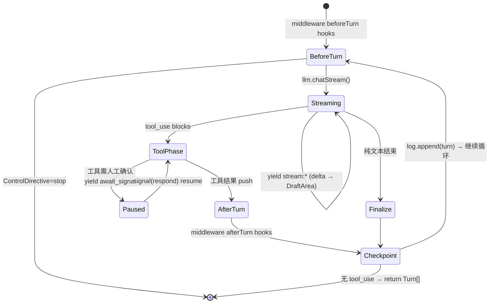

# Loop 原语详细设计 — 可暂停协程 + 中间件管线

> 上级设计: [llm-2.md](../llm-2.md) §2.2 / §4
> 定位: 主执行流程的唯一形态。HITL / 注入 / abort / 崩溃恢复统一为一套 pause/resume。

---

## 1. 协程协议

### 1.1 签名

```typescript
interface ILoop {
    readonly mode: string;
    run(ctx: LoopContext): AsyncGenerator<AgentEvent, Turn[], Signal | undefined>;
    resume(checkpoint: TurnId): AsyncGenerator<AgentEvent, Turn[], Signal | undefined>;
}

interface LoopContext {
    sessionId: string;
    ref: Ref;                        // fold source
    log: ILog;                       // checkpoint target
    llm: ILLMService;                // the ONE LLM call path
    tools: IToolService;
    middlewares: ILoopMiddleware[];  // assembled by executor preset
    signal: AbortSignal;             // hard-abort escape hatch
}
```

### 1.2 宿主驱动循环（Loop 宿主，位于内核）

```typescript
// Kernel-side driver — the ONLY place that touches the generator
async function drive(gen: LoopGenerator, session: SessionActor) {
    let input: Signal | undefined;
    while (true) {
        const { value: ev, done } = await gen.next(input);
        input = undefined;
        if (done) return ev;                          // Turn[]
        if (ev.type === 'await_signal') {
            await log.draft().checkpoint(ev.request); // persist pause point
            input = await session.waitSignal();       // suspend — hours/days OK
        } else {
            session.emit(ev);                         // → EventStream
        }
    }
}
```

**协议规则**：

| 规则 | 说明 |
|---|---|
| R1 | 协程只通过 `yield` 与外界通信，禁止直接访问 EventBus |
| R2 | `yield {type:'await_signal'}` 是唯一暂停方式；宿主负责持久化 + 挂起 |
| R3 | 轮次边界必须 `log.append`（检查点）后才能进入下一轮 |
| R4 | 收到的 Signal 在**下一个 yield 点**生效（abort 例外：AbortSignal 硬中断） |
| R5 | 协程 return `Turn[]`；异常向上抛，宿主转 `error` 事件 |

### 1.3 一轮（turn）的状态机



---

## 2. pause / resume — 六机制归一

| 现有机制 | 新形态 |
|---|---|
| `abort()` + AbortController | `signal(abort)` → 下一 yield 点退出（硬中断走 AbortSignal） |
| `inject()` 注入队列 | `signal(inject)` → 下一 yield 点作为 user 消息并入 |
| `HITLQueue` + `human_input` 工具 | hitl 中间件 → `yield await_signal` |
| `onIntercept` plan 确认 | 同上（PauseRequest.kind='plan_confirm'） |
| `request_input` 事件 | `await_signal` 事件本身 |
| `SessionRecovery` | `resume(lastCheckpoint)` — 与 HITL 恢复同一条代码路径 |

```typescript
interface PauseRequest {
    kind: 'human_input' | 'plan_confirm' | 'tool_approval';
    prompt: string;
    payload?: unknown;
    timeoutMs?: number;      // default 24h; timeout → Verdict failed
}
```

**resume 的实现**：`resume(turnId)` = `fold(ref)` 重建上下文 + 从 DraftArea 读取暂停点元数据 + 重新进入协程。因为轮次边界的状态全部在 Log 中，resume 不需要序列化协程栈——**这是"轮次边界是唯一合法暂停点"这条约束换来的红利**。

---

## 3. 中间件管线

### 3.1 契约

```typescript
interface ILoopMiddleware {
    readonly name: string;
    /** Runs before LLM call. May stop/inject/downgrade. */
    beforeTurn?(ctx: TurnContext): Promise<ControlDirective | void>;
    /** Runs after tools / before checkpoint. May inject correction. */
    afterTurn?(ctx: TurnContext, result: TurnResult): Promise<ControlDirective | void>;
    /** Error recovery chain — first middleware that returns an action wins. */
    onError?(ctx: TurnContext, error: Error): Promise<RecoveryAction | void>;
}

type ControlDirective =
    | { type: 'stop'; reason: string }
    | { type: 'inject'; messages: Message[] }        // e.g. back-pressure correction
    | { type: 'downgrade'; tier: ModelTier };        // budget 80%

type RecoveryAction =
    | { type: 'retry'; delayMs: number }             // 429
    | { type: 'compress-retry' }                     // 413
    | { type: 'fallback'; connectionId: string }     // 529
    | { type: 'continue-truncated' };                // finish_reason=length
```

执行顺序：`beforeTurn` 按注册序，`afterTurn` 逆序（洋葱模型）；`onError` 按注册序短路。

### 3.2 六个内置中间件规格（自 harness 迁移）

| 中间件 | hook | 行为（继承现有实现） |
|---|---|---|
| `budget` | beforeTurn | 6 维检查（turns/in/out tokens/cost/duration/toolCalls）；超限 `stop`；≥80% `downgrade` |
| `compression` | beforeTurn | 上下文使用率分层压缩：L1 70% snip → L2 80% prune → L3 85% LLM 摘要 → L4 95% 滑窗 |
| `error-recovery` | onError | 429 指数退避 / 413 compress-retry / 529 fallback / length continue-truncated |
| `hitl` | (工具拦截) | 需确认工具 → `yield await_signal(tool_approval)`；首轮 plan 确认 |
| `skills` | beforeTurn | 4 层路由（L1 静默/L2 索引/L3 动态挂载/L4 空间），P0–P4 system prompt 分段 |
| `back-pressure` | afterTurn | shell 校验（afterTool/beforeFinal）；失败 `inject` 修正消息继续循环 |

> `AutoContinueHandler` / `TruncationDetector` **不是中间件**——截断续写的"重试直到完整"是控制回路，归 [Goal 原语](./04-goal.md) 的 predicate；error-recovery 仅处理单轮内的 `continue-truncated`。

### 3.3 工具执行

沿用现有并行策略：`getMeta().sideEffect === 'none'` 的工具 `Promise.all` 并行，写工具按序串行；每个工具调用 yield `tool:queued/running/success/error` 事件。

---

## 4. 与现有实现的映射

| 现有 | 归宿 |
|---|---|
| harness `AgentLoopExecutor` | → 协程内核基座（功能最全，改造为 AsyncGenerator） |
| `UnifiedLoopStrategy` / `ClaudeCodeStrategy` | **删除** = 协程内核 + `[budget, error-recovery]` 预设 |
| harness `BudgetController` | → `budget` 中间件（逻辑不变，改接口） |
| harness `ContextManager` | → `compression` + `skills` 两个中间件拆分 |
| harness `ErrorRecoveryService` | → `error-recovery` 中间件 |
| harness `BackPressureValidator` | → `back-pressure` 中间件 |
| `HITLQueue` | → 宿主 `waitSignal` 队列（串行语义保留） |
| kernel `AgentExecutor` 流式 content-block 解析 | → 协程内 Streaming 阶段（7 层栈短路为 4 层） |
| `SessionRecovery` | → `resume()` 入口 |

---

## 5. 开放问题

| 问题 | 倾向 |
|---|---|
| 协程版本升级后旧 checkpoint 能否 resume | checkpoint 只含 (turnId, PauseRequest)，不含代码状态 → 天然向前兼容 |
| 中间件之间的依赖（compression 需要 llm） | TurnContext 注入 `llm`，中间件间禁止互相引用 |
| 多 loop 并发共享 session | 禁止：一个 ref 同时至多一个活跃协程（宿主排它），并行探索用多 ref |
