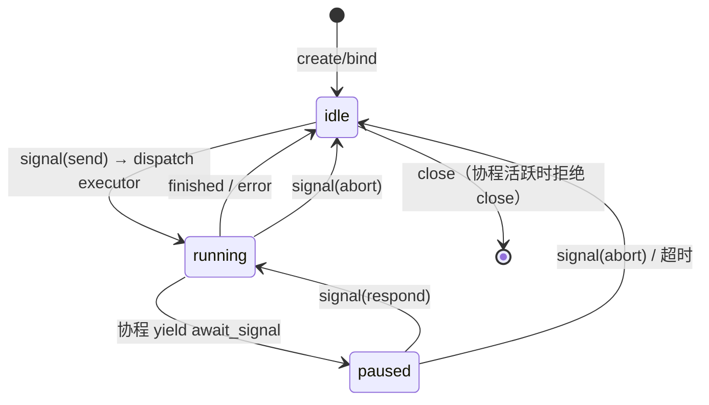

# Channel 原语详细设计 — 会话进程 + canonical 事件

> 上级设计: [llm-2.md](../llm-2.md) §2.3 / §4
> 定位: 用户交互的全部归约为"与进程的双向 IO"。消灭 5 套事件词汇 + 3 个翻译层。

---

## 1. Session 进程模型（Actor）

```typescript
interface ISession {
    readonly id: string;
    signal(s: Signal): void;                    // inbound mailbox
    events(): AsyncIterable<AgentEvent>;        // outbound stream
}
```

### 1.1 生命周期状态机



### 1.2 Signal 规格与各状态语义

```typescript
type Signal =
    | { type: 'send'; text: string; attachments?: Attachment[]; mode?: string }
    | { type: 'abort' }
    | { type: 'inject'; text: string }
    | { type: 'respond'; requestId: string; response: unknown }
    | { type: 'navigate'; ref: RefName };
```

| Signal | idle | running | paused |
|---|---|---|---|
| `send` | 启动 executor | **入队**为下一任务（不打断当前） | 入队 |
| `abort` | no-op | 下一 yield 点退出（AbortSignal 硬中断兜底） | 取消暂停请求 + 退出 |
| `inject` | 转为 send | 下一 yield 点并入 user 消息 | 并入后随 resume 生效 |
| `respond` | 丢弃 + warn | 丢弃 + warn（无未决请求） | resume 协程 |
| `navigate` | ref 切换 + `log:ref_moved` | **拒绝**（活跃协程持有 ref 排它） | 拒绝 |

Mailbox 规则：信号按到达序处理；`abort` 插队到队首。

---

## 2. Canonical AgentEvent — 唯一事件词汇

取代 KernelEventMap(15) + AgentEventType(25) + OrchestratorEvent(29+9) + EditorBusEvents(13) ≈ 91 个定义。

### 2.1 全集（~22 个）

| 事件 | 类别 | 权威性 | UI 反应 |
|---|---|---|---|
| `turn:start` / `turn:end` | lifecycle | 权威 | 轮次容器创建/封口 |
| `finished` (usage) | lifecycle | 权威 | 退出流式态 + token 统计 |
| `error` | lifecycle | 权威 | 错误卡片 |
| `stream:thinking` / `stream:content` (delta) | streaming | **瞬时** | 临时增量渲染 |
| `tool:queued` / `tool:input` / `tool:running` / `tool:success` / `tool:error` | tool | 权威 | 工具子节点状态 |
| `await_signal` (PauseRequest) | pause | 权威 | HITL/确认对话框 |
| `signal_resolved` | pause | 权威 | 对话框关闭 |
| `log:appended` (turnId) | log | 权威 | **重投影该轮次**（覆盖瞬时增量） |
| `log:ref_moved` / `log:ref_created` / `log:ref_deleted` | log | 权威 | 分支指示器 / 历史重投影 |
| `log:merged` (mergeTurnId) | log | 权威 | merge 节点渲染 |
| `budget:warning` / `budget:exhausted` | middleware | 权威 | 预算提示 |
| `context:compressed` (info) | middleware | 权威 | 压缩标记 |
| `goal:progress` (done/total) | goal | 权威 | Mission/任务面板 |

**权威 vs 瞬时**是 UI 投影的分界（见 [07-ui.md](./07-ui.md)）：瞬时事件只做临时渲染，轮次完成后被 `log:appended` 的权威数据覆盖——保证"全量渲染 = 增量渲染"同一投影函数。

### 2.2 投递机制

- **传输**：沿用 `@itookit/common` 的 `EventBus<M>`，`channel(sessionId)` O(1) 隔离
- **批处理**：瞬时事件 50ms coalesce（继承现有 EventBatchProcessor）；权威事件立即投递
- **Global 轨**：仅保留注册表级事件（~6 个：`session_registered/unregistered/status_changed/unread_updated/pool_status_changed/background_attention`），HITL/TTY 的全局提示由 `await_signal` + 后台 session 状态推导，不再单独定义

### 2.3 事件翻译层的删除

```
现状:  KernelEventMap ─UIEventAdapter→ OrchestratorEvent ─SessionEventHandler→ EditorBusEvents
       AgentEventType ─HarnessAdapter→        ↑
目标:  协程 yield AgentEvent ────channel(sessionId)────→ UI 投影
```

`UIEventAdapter` / `HarnessAdapter` / `SessionEventHandler` 的映射表全部删除；UI 内部 `EditorEventBus` 仅保留纯 UI 事件（焦点/布局），不再镜像引擎事件。

---

## 3. CommandBus — 高层操作的贡献点

```typescript
interface ICommandBus {
    register(name: string, handler: (args: any) => Promise<unknown>): Disposable;
    execute<T>(name: string, args?: unknown): Promise<T>;
    list(): CommandDescriptor[];      // for command palette
}
```

- **命名**：`<plugin>.<verb>`（`vcs.merge`, `tasks.create`, `session.regenerate`）
- **SessionManager 30+ API 的去向**：全部变为插件贡献的命令（映射见 llm-2.md §5 表）；`ISession` 仅剩 `signal()` + `events()`
- 命令是 UI（命令面板/快捷键/右键菜单）与插件功能的唯一耦合点

---

## 4. 与现有实现的映射

| 现有 | 归宿 |
|---|---|
| `SessionManager`（30+ 方法门面） | → `ISession`（2 方法）+ 插件命令 |
| `SessionEventBus`（双轨） | → EventStream（session 轨）+ 精简 Global 轨 |
| `TaskRunner` 队列 | → Session mailbox 的 send 入队 + 内核并发池（maxConcurrent 保留） |
| `UIEventAdapter` / `HarnessAdapter` / `SessionEventHandler` | **删除**（翻译层消失） |
| `EditorEventBus` 引擎事件镜像部分 | **删除**；纯 UI 事件保留 |
| `HITLQueue` 的 UI 侧 | → `await_signal` / `signal(respond)` 协议 |

---

## 5. 开放问题

| 问题 | 倾向 |
|---|---|
| 多窗口/多视图订阅同一 session | events() 多播（EventBus 天然支持）；投影各自独立 |
| 事件持久化（审计） | 权威事件已在 Log 中（turn/ref 即审计线索）；瞬时事件不持久（YAGNI） |
| 背压（LLM 产出快于 UI 消费） | 瞬时事件 coalesce 已覆盖；权威事件量级低无需处理 |
