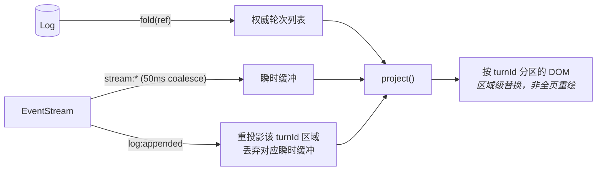

# UI 投影层详细设计 — view = f(fold(log), 瞬时事件)

> 上级设计: [llm-2.md](../llm-2.md) §2.3 / §6.3
> 定位: UI 不持有真相。全量渲染与增量渲染是**同一个投影函数**；消灭 `renderFull` vs `processEvent` 双路径。

---

## 1. 投影模型

```
ViewState = project(authoritative, transient)
    authoritative = fold(log, ref)          // 权威：轮次列表（含 merge/stale 元数据）
    transient     = 当前流式增量缓冲          // 瞬时：stream:* delta（未落盘部分）
```

### 1.1 渲染管线



**统一规则**：

| 场景 | 行为 |
|---|---|
| 首次加载 / 切换 ref | `project(fold(ref), ∅)` —— 即"全量渲染" |
| 流式中 | 瞬时缓冲更新 → 仅重投影当前 turn 区域 |
| `log:appended` | 该 turn 权威数据到位 → 重投影该区域，覆盖瞬时内容 |
| `log:ref_moved`（回退/切换） | 等价于切换 ref —— 与首次加载同一条路径 |

崩溃/刷新后 UI 状态必然正确——因为 UI 没有自己的状态可失一致。

### 1.2 DOM 策略

沿用项目约定（原生 DOM + 模板字符串 + BEM）。分区键 = `turnId`：`<div data-turn-id="01J...">`，重投影 = 该分区 `replaceChildren`。流式 delta 走现有 mdx 增量渲染器。

---

## 2. DAG 历史视图（vcs.graph）

新增能力：merge / 多分支的可视化（`git log --graph` 式泳道算法）。

```
泳道分配（自底向上扫描拓扑序）:
    线性节点   → 继承 parent 泳道
    分叉点     → 子节点各占新泳道
    merge 节点 → 占 mainline 泳道，副支泳道画汇入弧线
```

| 节点类型 | 渲染 |
|---|---|
| 普通 turn | 现有消息卡片 |
| merge turn | 汇合标记 + 策略徽章（concat/summarize/pick）+ 可折叠副支预览 |
| stale turn（rebase 未重生成） | 半透明 + "内容基于旧上下文" 角标 + 一键重生成 |
| tag | 书签图标（保存点） |

交互：节点右键 → 分叉/回退到此/打 tag/从此插入（rebase）；多选分支 tip → 合并（策略选择器）。

---

## 3. 输入区与命令面板

- **输入插件宿主**：现有机制原样保留（Mention / Slash / History / TokenMeter），Harness 插件改为 executor 预设选择器
- **Slash 命令**：`/mission <goal>`、`/branch <name>` 等直接映射 `commands.execute`——SlashCommandPlugin 的执行后端从硬编码改为 CommandBus 查询（自动获得全部插件命令 + 补全）
- **命令面板**：`commands.list()` 驱动，含快捷键绑定

---

## 4. 视图贡献点（views）

```typescript
type ViewProjection = {
    id: string;
    mount(container: HTMLElement, ctx: ViewContext): Disposable;
    // ViewContext: { events, commands, fold, sessionId }
};
```

| 视图 | 贡献者 | 数据源 |
|---|---|---|
| history（主视图） | 内核 UI（dogfood：同走 registerView） | fold + stream 事件 |
| vcs.graph | vcs 插件 | fold（全 refs）+ log:* 事件 |
| tasks 面板 | tasks 插件 | `goal:progress` 事件 + storage |
| cost 仪表板 | cost 插件 | device-llm 查询 |
| settings ×5 | agent-config 等插件 | 各自服务 |

---

## 5. 与现有实现的映射

| 现有（llm-ui） | 归宿 |
|---|---|
| `HistoryView.processEvent` / `renderFull` 双路径 | → 单一 `project()`（§1.1） |
| `SessionEventHandler`（事件→副作用映射表） | **删除** —— 投影规则取代映射表 |
| `EditorEventBus` 引擎事件镜像 | **删除**；纯 UI 事件（焦点/布局）保留 |
| `EventBatchProcessor` | → 瞬时事件 50ms coalesce（Channel 层承担，UI 不再自建） |
| `BranchIndicatorView` / `BranchStore` | → vcs.graph 视图 + refs 数据源 |
| `StateService`（UI 侧状态） | 大幅缩水：仅 UI 偏好（折叠态等），会话状态一律来自 fold |
| `ChatInputView` + 插件 | 保持；SlashCommand 后端接 CommandBus |
| `CommandRegistry`（UI 内部） | → 下沉为内核 CommandBus 的 UI 前端 |
| 5 种 Settings 编辑器 | 保持，改经 views 贡献点注册 |
| `LLMWorkspaceEditor` 组合根 | 保持组合根角色，初始化步骤简化（无 SessionEventHandler/StateService 装配） |

---

## 6. 开放问题

| 问题 | 倾向 |
|---|---|
| 超长会话 DOM 量 | turnId 分区天然支持虚拟滚动（视口外分区不挂载）；首版不做，留接口 |
| 瞬时/权威切换的视觉跳变 | mdx 渲染器对同内容幂等输出；跳变仅在压缩/修正时出现且应当可见 |
| 多视图并存（history + vcs.graph） | events 多播 + 各自独立投影，无共享可变状态 |
