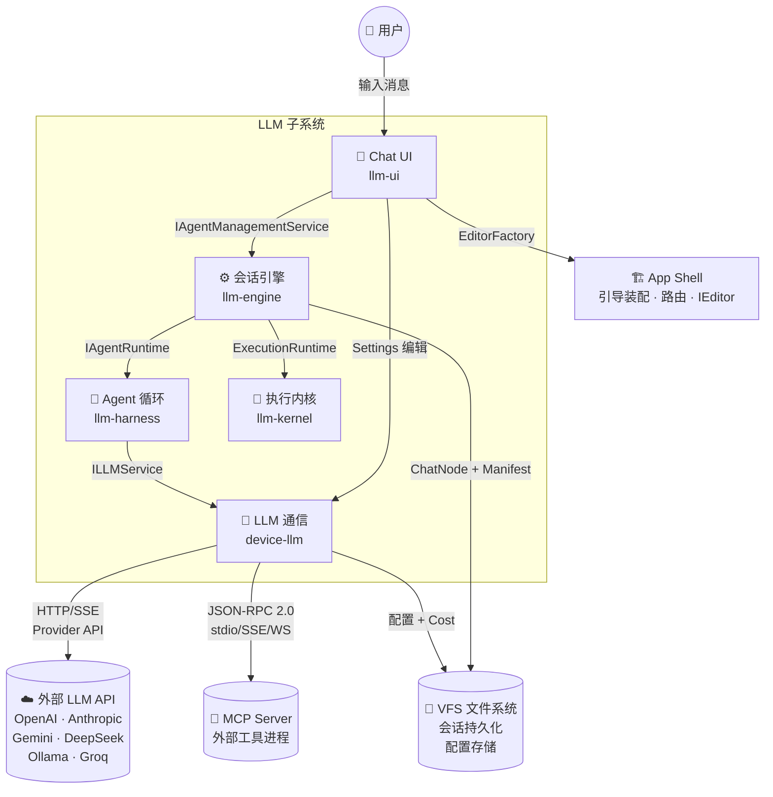
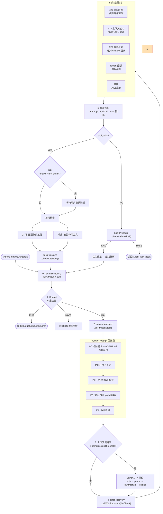
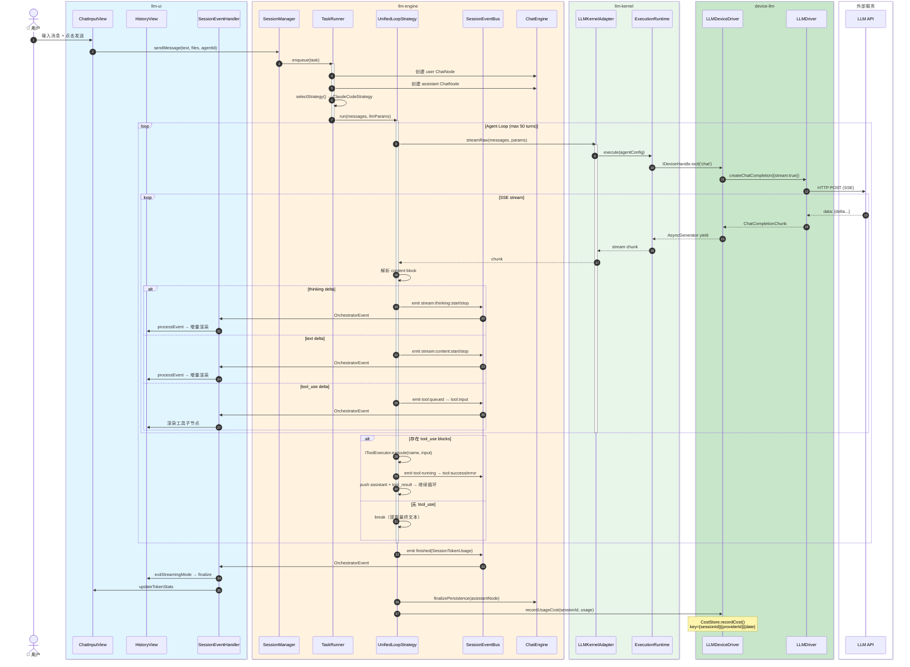

# LLM 子系统设计 — 五包架构、接口、事件流

> 分析范围: `packages/device-llm`, `packages/llm-kernel`, `packages/llm-harness`, `packages/llm-engine`, `packages/llm-ui`
> 审查日期: 2026-07-12 | 最后更新: 2026-07-13 (实施 P0/P1a/P1b/P2a/P2b/P3 改进) | 分支: v4.1

---

## 目录

- [1. 概览与职责边界](#1-概览与职责边界)
  - [C1 系统上下文图](#c1-系统上下文图)
- [2. 分层架构](#2-分层架构)
  - [C2 容器图](#c2-容器图)
- [3. 包级深度分析](#3-包级深度分析)
  - [C3-0 组件全景图](#c3-0-组件全景图)
  - [3.1 device-llm — LLM 通信层](#31-device-llm--llm-通信层)
  - [3.2 llm-kernel — 执行引擎核心层](#32-llm-kernel--执行引擎核心层)
  - [3.3 llm-harness — 多轮 Agent 循环执行器](#33-llm-harness--多轮-agent-循环执行器)
  - [3.4 llm-engine — 会话引擎](#34-llm-engine--会话引擎)
  - [3.5 llm-ui — Chat UI 层](#35-llm-ui--chat-ui-层)
- [4. 接口契约全景](#4-接口契约全景)
- [5. 事件流分析](#5-事件流分析)
  - [C4 代码级：Chat 请求序列图](#c4-代码级chat-请求序列图)
- [6. 关键数据流](#6-关键数据流)
- [7. 架构评估](#7-架构评估)

---

## 1. 概览与职责边界

```
┌──────────────────────────────────────────────────────────────┐
│  llm-ui            Chat UI — 输入/历史/设置/右键菜单           │
├──────────────────────────────────────────────────────────────┤
│  llm-engine        会话引擎 — 多会话/SessionGraph/Mission      │
│  llm-harness       Agent 循环 — 工具/Budget/HITL/Skill        │
├──────────────────────────────────────────────────────────────┤
│  llm-kernel        执行引擎 — Executor/Orchestrator/Runtime    │
│  device-llm        LLM 通信 — Provider/SSE/MCP/Cost/Skill      │
├──────────────────────────────────────────────────────────────┤
│  common            共享接口 + 类型 + EventBus + i18n           │
└──────────────────────────────────────────────────────────────┘
```

| 包 | 一句话职责 | 关键输出 | 无 UI 依赖 |
|---|---|---|---|
| **device-llm** | LLM API 通信 + VFS 设备驱动 | `LLMDriver`, `LLMDeviceDriver`, `CostStore`, `MCPClient` | ✓ |
| **llm-kernel** | 通用执行引擎运行时 | `ExecutionRuntime`, Executor/Orchestrator 注册表, `StateMachine`, `MemoryStore` | ✓ |
| **llm-harness** | 多轮 Agent 循环 + 工具编排 | `AgentLoopExecutor` (`IAgentRuntime`), HITL, Budget, Skill 路由 | ✓ |
| **llm-engine** | 会话管理 + 持久化 + Mission | `SessionManager`, `TaskRunner`, Agent Loop 策略, `SessionEventBus` | ✓ |
| **llm-ui** | Chat 交互界面 | `LLMWorkspaceEditor`, `ChatInputView`, `HistoryView`, 5 种 Settings 编辑器 | ✗ |

### 关系矩阵

```
llm-ui ──依赖──▶ llm-engine ──依赖──▶ llm-kernel
    │                 │
    │                 ▼
    │            llm-harness ──依赖──▶ device-llm
    │                                    │
    └────────────────────────────────────┘
                                         ▼
                                    common (EventBus + 接口)
```

### C1 系统上下文图



---

## 2. 分层架构

### 2.1 五层模型

```
┌─────────────────────────────────────────────────────────┐
│  UI 层 (llm-ui)                                         │
│  LLMWorkspaceEditor · ChatInput · HistoryView           │
│  Settings Editors ×5 · AIContextMenu · SlashCommand     │
├─────────────────────────────────────────────────────────┤
│  业务层                                                  │
│  ┌─────────────────┐  ┌──────────────────────────────┐  │
│  │ llm-engine       │  │ llm-harness                   │  │
│  │ SessionManager   │  │ AgentLoopExecutor             │  │
│  │ TaskRunner       │  │ BudgetController              │  │
│  │ ClaudeCodeStrat  │  │ ContextManager                │  │
│  │ SessionEventBus  │  │ ErrorRecovery · HITL          │  │
│  │ MissionService   │  │ Skill/Tool DeviceDrivers      │  │
│  │ SessionGraph     │  │ SubAgentRouter                │  │
│  └─────────────────┘  └──────────────────────────────┘  │
├─────────────────────────────────────────────────────────┤
│  引擎层                                                  │
│  ┌─────────────────┐  ┌──────────────────────────────┐  │
│  │ llm-kernel       │  │ device-llm                    │  │
│  │ ExecutionRuntime │  │ LLMDriver · LLMDeviceDriver   │  │
│  │ Agent/HTTP/Tool/  │  │ Provider ×3 · MCPClient       │  │
│  │   Script Executor │  │ CostStore · SkillRegistry     │  │
│  │ MemoryStore      │  │ SSE Stream · Attachment        │  │
│  │ StateMachine     │  │ .llm YAML 导入导出             │  │
│  │ PluginManager    │  │                                │  │
│  └─────────────────┘  └──────────────────────────────┘  │
├─────────────────────────────────────────────────────────┤
│  类型层 (common)                                        │
│  Message/Connection/Agent/Skill/Tool 接口 + EventBus    │
└─────────────────────────────────────────────────────────┘
```

### C2 容器图

```mermaid
graph LR
    subgraph UI_Layer["<b>UI 层</b>"]
        style UI_Layer fill:#e1f5fe,stroke:#0288d1
        llmui["<b>llm-ui</b><br/>LLMWorkspaceEditor<br/>ChatInputView<br/>HistoryView<br/>5× Settings Editors<br/>AIContextMenu"]
    end

    subgraph Business_Layer["<b>业务层</b>"]
        style Business_Layer fill:#fff3e0,stroke:#f57c00
        llmengine["<b>llm-engine</b><br/>SessionManager<br/>TaskRunner<br/>ClaudeCodeStrategy<br/>SessionEventBus<br/>MissionService<br/>ChatEngine"]
        llmharness["<b>llm-harness</b><br/>AgentLoopExecutor<br/>BudgetController<br/>ContextManager<br/>ErrorRecoveryService<br/>SubAgentRouter<br/>HITLQueue"]
    end

    subgraph Engine_Layer["<b>引擎层</b>"]
        style Engine_Layer fill:#e8f5e9,stroke:#388e3c
        llmkernel["<b>llm-kernel</b><br/>ExecutionRuntime<br/>Agent/HTTP/Tool/Script Executor<br/>StateMachine<br/>MemoryStore<br/>PluginManager"]

        devicellm["<b>device-llm</b><br/>LLMDriver<br/>LLMDeviceDriver<br/>OpenAI/Anthropic/Gemini Provider<br/>CostStore<br/>MCPClient"]
    end

    subgraph Foundation["<b>基础层</b>"]
        style Foundation fill:#f3e5f5,stroke:#7b1fa2
        common["<b>common</b><br/>LLM Interfaces<br/>EventBus&#60;M&#62;<br/>i18n · Utils"]
    end

    llmui -->|" IAgentManagementService<br/>ILLMManagementService"| llmengine
    llmui -->|" Settings 编辑"| devicellm
    llmengine -->|" ExecutionRuntime"| llmkernel
    llmengine -->|" IAgentRuntime"| llmharness
    llmengine -->|" ILLMManagementService"| devicellm
    llmharness -->|" ILLMService<br/>IDeviceDriver"| devicellm
    llmkernel -->|" IDeviceHandle"| devicellm

    devicellm -.-> common
    llmkernel -.-> common
    llmharness -.-> common
    llmengine -.-> common
    llmui -.-> common
```



### 2.2 执行路径（二态）

2026-07-13 重构后，`TaskRunner` 将原来三条路径统一为两条，`ClaudeCodeStrategy` 被 `UnifiedLoopStrategy` 取代：

| 路径 | 策略类 | 触发条件 | 能力 |
|---|---|---|---|
| **Unified** (默认) | `UnifiedLoopStrategy` | 无 HarnessAdapter 时（绝大多数场景） | 流式 content block 解析 + 可配置预算/错误恢复/权限控制 |
| **Harness** (可选) | `HarnessStrategy` | 注入了 HarnessAdapter 时 | 包装 `IAgentRuntime`，保留完整 harness 功能 |

```typescript
// 策略选择逻辑（task-runner.ts）
private selectStrategy(): IAgentLoopStrategy {
    if (this.harnessAdapter) return new HarnessStrategy(this.harnessAdapter);
    return new UnifiedLoopStrategy(
        this.kernelAdapter,
        this._toolExecutor,        // IToolExecutor（可由 setToolService() 注入）
        this.getUnifiedLoopConfig(), // 可选预算/错误恢复配置
    );
}
```

`UnifiedLoopStrategy` 与原 `ClaudeCodeStrategy` **行为完全一致**（默认配置），额外支持：
- `config.budget` — 6 维预算（turns / inputTokens / outputTokens / costUsd / durationMs，80% 预警）
- `config.errorRecovery` — 速率限制指数退避重试 + 截断自动续写
- 通过 `IToolExecutor.getMeta()` 自动并行执行只读工具、串行执行写工具

---

## 3. 包级深度分析

### C3-0 组件全景图

```mermaid
graph TB
    subgraph S_UI["<b>llm-ui</b> — Chat UI"]
        style S_UI fill:#e1f5fe,stroke:#0288d1
        Workspace["LLMWorkspaceEditor<br/><i>组合根 · IEditor</i>"]
        EditorBus["EditorEventBus<br/><i>13 UI 事件</i>"]
        SessHandler["SessionEventHandler<br/><i>Engine→UI 事件路由</i>"]
        ChatInput["ChatInputView<br/><i>Port: IChatInputPresenter</i>"]
        History["HistoryView<br/><i>Port: IHistoryPresenter</i>"]
        CmdRegistry["CommandRegistry<br/><i>Send · Branch · Node</i>"]
        Editors["Settings Editors<br/>Agent · Connection · Provider<br/>MCP · Skill · Cost"]
        Plugins["Input Plugins<br/>Slash · Mention · History · Harness"]
        ContextMenu["AIContextMenu"]
    end

    subgraph S_Engine["<b>llm-engine</b> — 会话引擎"]
        style S_Engine fill:#fff3e0,stroke:#f57c00
        SessMgr["SessionManager<br/><i>门面 · 30+ API</i>"]
        TaskRunner2["TaskRunner<br/><i>队列 · maxConcurrent=8</i>"]
        ClaudeStrat["ClaudeCodeStrategy<br/><i>内置 Agent Loop</i>"]
        HarnessStrat["HarnessStrategy<br/><i>包装 IAgentRuntime</i>"]
        SessionBus["SessionEventBus<br/><i>双轨: Session + Global</i>"]
        ChatEngine2["ChatEngine<br/><i>VFS .chat 持久化</i>"]
        Mission["MissionService<br/><i>规划 · 调度 · 验证</i>"]
        SessionGraph["GraphOrchestrator<br/><i>跨会话依赖拓扑</i>"]
        Adapters["Adapters<br/>LLMKernel · Harness · UIEvent"]
    end

    subgraph S_Harness["<b>llm-harness</b> — Agent 循环"]
        style S_Harness fill:#ffe0b2,stroke:#e65100
        AgentLoop["AgentLoopExecutor<br/><i>IAgentRuntime</i>"]
        Budget["BudgetController<br/><i>6 维 · 80% 降级</i>"]
        Context["ContextManager<br/><i>4 层压缩 · P0-P4 Prompt</i>"]
        ErrorRec["ErrorRecoveryService<br/><i>5 类错误恢复</i>"]
        BackPressure["BackPressureValidator<br/><i>Shell 验证</i>"]
        SubAgent["SubAgentRouter<br/><i>隔离委托</i>"]
        HITL["HITLQueue<br/><i>串行人工请求</i>"]
        SkillDriver["SkillDeviceDriver<br/><i>4 层路由 · 语义匹配</i>"]
        AgentDevice["AgentDeviceDriver<br/><i>装配器</i>"]
    end

    subgraph S_Kernel["<b>llm-kernel</b> — 执行引擎"]
        style S_Kernel fill:#e8f5e9,stroke:#388e3c
        Runtime["ExecutionRuntime<br/><i>单例 · channel 隔离</i>"]
        AgentExe["AgentExecutor<br/><i>LLM via IDeviceHandle</i>"]
        HttpExe["HttpExecutor"]
        ToolExe["ToolExecutor"]
        ScriptExe["ScriptExecutor"]
        StateMachineComp["StateMachine"]
        MemoryStoreComp["MemoryStore"]
        PluginMgr["PluginManager"]
    end

    subgraph S_Device["<b>device-llm</b> — LLM 通信"]
        style S_Device fill:#c8e6c9,stroke:#2e7d32
        Driver["LLMDriver<br/><i>统一 LLM 客户端</i>"]
        DeviceDriver["LLMDeviceDriver<br/><i>IDeviceDriver + ILLMMgmt</i>"]
        OpenAI["OpenAIProvider"]
        Anthropic["AnthropicProvider"]
        Gemini["GeminiProvider"]
        CostStoreComp["CostStore<br/><i>seqfile 累加</i>"]
        MCP["MCPClient<br/><i>3 Transport</i>"]
    end

    Workspace --> SessMgr
    Workspace --> Editors
    Workspace --> ChatInput
    Workspace --> History
    Workspace --> CmdRegistry
    Workspace --> Plugins

    SessMgr --> TaskRunner2
    TaskRunner2 --> ClaudeStrat
    TaskRunner2 --> HarnessStrat
    SessMgr --> SessionBus
    SessMgr --> ChatEngine2

    ClaudeStrat --> Runtime
    HarnessStrat --> AgentLoop

    AgentLoop --> Budget
    AgentLoop --> Context
    AgentLoop --> ErrorRec
    AgentLoop --> BackPressure
    AgentLoop --> HITL
    AgentDevice --> SkillDriver

    Runtime --> AgentExe

    AgentExe --> DeviceDriver
    DeviceDriver --> Driver
    Driver --> OpenAI
    Driver --> Anthropic
    Driver --> Gemini
    DeviceDriver --> CostStoreComp
    DeviceDriver --> MCP
```



### 3.1 device-llm — LLM 通信层

**文件结构：** 7 个目录，25 个源文件

```
src/
├── constants/     ← MODEL_PRICING, LLM_PROVIDERS, DEFAULT_CONNECTIONS, llm-loader
├── core/          ← LLMDriver, LLMChain, testLLMConnection
├── cost/          ← CostStore (cost.seq 累加计费)
├── device/        ← LLMDeviceDriver + 6 个 Manager
├── providers/     ← BaseProvider, OpenAI, Anthropic, Gemini + registry
├── skills/        ← MCPClient + 3 Transport
├── types/         ← LLMProviderConfig, LLMClientConfig, LLMHooks
└── utils/         ← SSE, Attachment, NoopLLMLogger
```

#### LLMDriver — 统一 LLM 客户端

核心类是 `LLMDriver`，封装了所有 LLM API 调用的生命周期：

```
LLMDriver(config: LLMClientConfig)
    ├─ createChatCompletion(params) → ChatCompletionResponse | AsyncGenerator<Chunk>
    │   ├─ 自动展开附件 (attachment → base64 multipart content)
    │   ├─ hooks.beforeRequest → fetch → hooks.afterResponse
    │   ├─ 非流式: 自动重试 (指数退避, max 3 次)
    │   └─ 流式: 滚动不活跃超时 + hooks.onStreamChunk
    └─ providerFormat → 推断 'openai'|'anthropic'|'gemini'
```

Provider 创建走 5 级分发（`registry.ts → createProvider`）：

```
config.protocol 显式字段
  → provider definition 的 implementation 字段
    → registry 按名查找
      → 兜底 OpenAIProvider
```

#### LLMDeviceDriver — VFS 设备插件

同时实现 `IDeviceDriver` + `ILLMManagementService`，是整个 LLM 子系统对外的唯一入口：

- **VFS 路径：** `/llm/.connections/`, `/llm/.providers/`, `/llm/.mcp/`, `/llm/.skills/`, `/llm/cost.seq`, `/llm/pricing.json`
- **会话体系：** `open/close/write/read/readStream/ioctl` 标准设备协议
- **6 个内部 Manager：** ProviderManager, ConnectionManager, MCPManager, SkillManager, CostManager, MigrationHelper
- **ioctl 命令：** 30+ 个命令覆盖连接/MCP/Skill/Provider/Cost/Chat/Session 全操作

#### MCP 客户端

三种 Transport 实现（stdio / SSE / WebSocket），均遵循 JSON-RPC 2.0：

```
MCPClient → MCPServerConnection → Transport
                                      ├── StdioTransport (child_process.spawn)
                                      ├── SSETransport (EventSource + fetch POST)
                                      └── WebSocketTransport (WebSocket)
```

#### Cost & Pricing

- `CostStore` 基于 VFS seqfile (`/llm/cost.seq`)，key = `{sessionId}|{providerId}|{date}`，同 key 自动累加
- `MODEL_PRICING` 编译期定价表（16 条），首次启动写入 `/llm/pricing.json`
- `lookupPricingEntry` 三级匹配：providers 精确 match modelId → names[] 通配符 → default fallback

#### `.llm` YAML 导入导出

`llm-loader.ts` 定义了完整的 `.llm` 文件格式，包含 `providers`, `connections`, `agents`, `skills`, `mcp`, `pricing` 六个可选段落，支持 `parseLLMConfig` / `serializeLLMConfig` 以及双向类型转换。

---

### 3.2 llm-kernel — 执行引擎核心层

**文件结构：** 8 个目录，32 个源文件（2026-07-13 新增 orchestrators 目录）

```
src/
├── core/          ← EventBus 类型目录, ExecutionContext, interfaces, orchestrator-interfaces
├── executors/     ← AgentExecutor, HttpExecutor, ToolExecutor, ScriptExecutor
├── orchestrators/ ← Serial, Parallel, Router, Loop, DAG + OrchestratorRegistry ✅ 新增
├── runtime/       ← ExecutionRuntime (+ executePlan()), MemoryStore, StateMachine
├── worker/        ← WorkerAdapter, WorkerClient
├── plugins/       ← IKernelPlugin, PluginManager
├── cli/           ← CLIRunner
└── utils/         ← ID 生成, 校验器
```

#### EventBus — 类型目录模式

kernel 不再自行实现事件总线，从 `@itookit/common` 导入统一的 `EventBus<M>`：

- 定义 `KernelEventMap`（15 种事件 → payload 映射）
- 导出模块级单例 `getEventBus(): EventBus<KernelEventMap>`
- 15 种事件：`execution:start/progress/complete/error/cancel`, `node:start/update/complete/error`, `stream:thinking/content/tool_call`, `interaction:request_input/confirm`, `state:changed`

#### ExecutionRuntime — 核心运行时

单例模式，管理所有执行的生命周期：

```
execute(config, input, options?)
  → channel(executionId)        // 创建隔离通道
  → ExecutionContext(events)     // 通道作用域的事件发射器
  → factory.create(config)       // 通过 ExecutorRegistry 创建执行器
  → executor.execute(input, ctx) // 执行
  → finally: closeChannel()      // 清理
```

#### Executor 注册表

| Executor | 基类 | 用途 |
|---|---|---|
| `AgentExecutor` | 直接实现 `IExecutor` | LLM 调用 (通过 IDeviceHandle ioctl) |
| `HttpExecutor` | 直接实现 `IExecutor` | HTTP 请求（URL 插值 + 重试） |
| `ToolExecutor` | `BaseExecutor` | 工具/函数执行（JSON Schema 校验） |
| `ScriptExecutor` | `BaseExecutor` | JS/表达式评估（沙箱 + 超时） |

**AgentExecutor 关键行为：**
- 通过 `IDeviceHandle`（VFS 设备协议）连接 LLM，无 API key 直接依赖
- 流式模式（默认）：`handle.ioctl('chat')` → AsyncGenerator，实时 emit `stream:thinking/content/tool_call`
- 非流式：`handle.ioctl('chat-sync')` → 单次 `ChatCompletionResponse`
- 支持 function/mcp/computer_20241022 工具调用

#### 其他核心组件

| 组件 | 用途 |
|---|---|
| `MemoryStore` | 带 TTL + 标签索引的 KV 存储 |
| `ScopedMemoryStore` | 父子层级继承的 MemoryStore |
| `StateMachine<T>` | 通用状态机（onEnter/onExit/guard/actions），channel 隔离 emit |
| `WorkerAdapter` | 将 ExecutionRuntime 暴露在 Web Worker 中 |
| `WorkerClient` | 主线程 ↔ Worker 通信 |
| `PluginManager` | 插件注册/初始化/销毁，PluginContext 桥接 EventBus + Registry |
| `CLIRunner` | CLI 入口，verbose/timestamp/outputFormat 选项 |

#### Orchestrator 编排器（2026-07-13 实现）

`OrchestratorRegistry` 管理 5 种编排器，`ExecutionRuntime.executePlan(plan)` 统一入口：

| 编排器 | 调度策略 | 关键行为 |
|---|---|---|
| `SerialOrchestrator` | 顺序 | 上一步输出→下步输入；失败即停止；`action=end` 提前退出 |
| `ParallelOrchestrator` | 并发 | `Promise.allSettled`；可选 `abortOnError` 中止其余 |
| `RouterOrchestrator` | 条件 | 第一个 `condition()=true` 的步骤执行；无条件步兜底 |
| `LoopOrchestrator` | 循环 | 单步重复直到 `breakCondition()=true` 或 `action=break` 或 `maxIterations` |
| `DagOrchestrator` | 拓扑 | Kahn 环检测（抛 `CycleError`）；同深度步并行；fan-in 等待所有依赖 |

```typescript
// 使用示例
const plan: OrchestrationPlan = {
    id: 'analyze-repo',
    type: 'serial',
    steps: [
        { id: 'search', executorConfig: { type: 'agent', ... } },
        { id: 'summarize', executorConfig: { type: 'agent', ... } },
    ],
};
const results = await getRuntime().executePlan(plan, { signal });
```

---

### 3.3 llm-harness — 多轮 Agent 循环执行器

**文件结构：** 9 个目录，26 个源文件

```
src/
├── factory.ts              ← createHarness() 一站式装配
├── executor/               ← AgentLoopExecutor + Budget + Context + ErrorRecovery + BackPressure + SubAgentRouter
├── drivers/                ← AgentDeviceDriver, SkillDeviceDriver
├── adapters/               ← LLMServiceAdapter (IDeviceDriver → ILLMService)
├── tools/                  ← 7 个 Harness 专属工具
├── services/               ← HITLQueue
├── shell/                  ← NodeShellRunner
└── skills/                 ← 文件系统 Skill 加载、语义匹配、SubAgent 桥接
```

#### createHarness() 装配流程

```
llmDriver (IDeviceDriver)
    → LLMServiceAdapter → ILLMService
    → SkillDeviceDriver → ISkillService (4 层路由 + 语义匹配 + Glob 挂载)
    → AgentDeviceDriver → IAgentRuntime (装配 AgentLoopExecutor)
        ← setServices({ llm, tool, skill, hitlQueue })
            → SubAgentRouter
            → 注册 7 个动态工具
    → ToolDeviceDriver (from @itookit/tools)
    → HITLQueue (可选)
    → TTY Driver (可选)
返回 HarnessInstance { runtime, config, toolService, skillService, llmService }
```

#### AgentLoopExecutor — 核心循环




#### 六维预算系统 (BudgetController)

| 维度 | 限制参数 | 80% 时行为 |
|---|---|---|
| 轮次 | `maxTurns` | 自动降级模型层级 |
| 输入 Token | `maxInputTokens` | 同上 |
| 输出 Token | `maxOutputTokens` | 同上 |
| 费用 | `maxCostUsd` | 同上 |
| 耗时 | `maxDurationMs` | 同上 |
| 工具调用 | `maxToolCalls` | 同上 |

#### 四层上下文压缩 (ContextManager)

| 层级 | 名称 | 阈值 | 策略 |
|---|---|---|---|
| L1 | `history_snip` | 70% | 截断长消息（保留 30 行头部 + 10 行尾部） |
| L2 | `cache_prune` | 80% | 移除空/琐碎助手消息 |
| L3 | `llm_summarize` | 85% | LLM 摘要最早 60% 消息 |
| L4 | `sliding_window` | 95% | 保留最近 6 条 |

#### 五类错误恢复 (ErrorRecoveryService)

| 错误 | 检测 | 恢复策略 |
|---|---|---|
| 速率限制 (429) | HTTP 状态码 | 指数退避重试 |
| 上下文过大 (413) | HTTP 状态码 | 强制压缩 → 重试 |
| 服务过载 (529) | HTTP 状态码 | 切换到 fallback 连接 |
| 输出截断 (finish_reason=length) | 响应元数据 | 静默重试 (maxTruncationRetries) |
| 未处理错误 | catch-all | 向上抛出 |

#### Skill 四层路由 (SkillDeviceDriver)

| 层级 | 条件 | LLM 可见性 |
|---|---|---|
| L1 静默 | `disableModelInvocation=true` | 不对 LLM 暴露 |
| L2 索引 | 启用 + 未加载 + 非 glob 挂载 | 在 prompt 中列出供选择 |
| L3 动态挂载 | 已加载 + 非 glob 挂载 | 注入指令到 context |
| L4 空间 | 已加载 + glob 挂载 | 全局激活 |

语义匹配三级联：正则触发 → 关键词重叠 (≥2 词) → glob 匹配

#### HITL (Human-in-the-Loop)

`HITLQueue` 是串行队列，确保一次只呈现一个 HITL 请求。`human_input` 工具通过 `await push(request)` 阻塞代理循环，直到 UI 调用 `resolve(requestId, response)`。

#### 7 个 Harness 专属工具

| 工具 | 触发条件 | 核心函数 |
|---|---|---|
| `load_skill` | 始终 | `skillService.loadSkill(id)` |
| `delegate_task` | 始终 | `SubAgentRouter.delegate()` |
| `delegate_agent` | agentLookup 被注入 | 查找 AgentDefinition 后委托 |
| `write_result` | resultPersistence 被注入 | 持久化完整内容 + 摘要 |
| `human_input` | hitlQueue 被注入 | HITLQueue.push() (24h 超时) |
| `shell_session` | TTY driver 被注入 | 创建持久交互式 shell |
| `tty_write` / `tty_close` | TTY driver 被注入 | 控制交互式 shell |

---

### 3.4 llm-engine — 会话引擎

**文件结构：** 11 个目录，39 个源文件

```
src/
├── session/        ← SessionManager, TaskRunner, Agent Loop 策略, SessionEventBus
├── persistence/    ← ChatEngine (VFS 持久化), ChatManifest, ChatNode
├── adapters/       ← HarnessAdapter, UIEventAdapter, LLMKernelAdapter
├── mission/        ← MissionService, MissionScheduler, TodoStateManager
├── session-graph/  ← DependencyGraph, GraphOrchestrator, CompletionAnalyzer
├── services/       ← VFSAgentService, PromptHistoryService
├── core/           ← types, errors, constants
└── utils/          ← Converters, chatFileParser, error-formatter, logger
```

#### SessionManager — 统一入口

对外暴露的唯一门面，管理所有会话生命周期：

```
SessionManager
├── 绑定管理: bindSession / unbindSession / updateBoundNodeId
├── 消息发送: sendMessage → TaskRunner.enqueue()
├── 流式控制: abort / regenerate / regenerateFromUser
├── 消息操作: deleteMessage / commitEdit / switchToSibling
├── 分支操作: createBranch / switchBranch / renameBranch / deleteBranch / getBranchTree
├── 状态查询: getSnapshot / getStatus / isGenerating / getPoolStatus
├── 事件订阅: onEvent (session-scoped) / onGlobalEvent (cross-session)
├── 设置管理: getSessionSettings / saveSessionSettings
├── 历史管理: searchHistory / getRecentPrompts / clearHistory
└── 导出: exportToMarkdown / debug
```

#### TaskRunner — 任务队列

并发任务队列（默认 maxConcurrent=8），三条执行路径，通过 `selectStrategy()` 分发：

```mermaid
flowchart TB
    subgraph Input["入队"]
        Send["SessionManager<br/>.sendMessage()"] --> Enqueue["TaskRunner<br/>.enqueue(task)"]
    end

    Enqueue --> Pool{"并发槽位<br/>可用?<br/><i>maxConcurrent=8</i>"}
    Pool -->|"等待"| Queue[("优先级队列<br/>pendingTasks")]
    Queue --> Pool

    Pool -->|"调度"| Setup["setupTaskExecution()<br/><i>共享前置处理</i>"]

    subgraph Shared["共享阶段"]
        Setup --> Attach["AttachmentProcessor<br/>解析文件附件"]
        Attach --> UserNode["创建 User ChatNode<br/>VFS 持久化"]
        UserNode --> Agent["AgentResolver<br/>resolve(agentId)"]
        Agent --> AssistNode["创建 Assistant ChatNode<br/>VFS 持久化"]
    end

    AssistNode --> Dispatch{"selectStrategy()"}

    subgraph Unified_Path["Unified 路径 (默认)"]
        direction TB
        C1["UnifiedLoopStrategy.run()"]
        C2["kernelAdapter.streamRaw()<br/><i>AsyncGenerator&#60;Chunk&#62;</i>"]
        C3["Content Block 解析<br/>thinking · text · tool_use"]
        C4["IToolExecutor.execute()<br/><i>+ Budget / ErrorRecovery</i>"]
        C5["循环 max 50 turns"]
        C1 --> C2 --> C3
        C3 -->|"tool_use"| C4 --> C5 --> C2
        C3 -->|"text"| C1
    end

    subgraph Harness_Path["Harness 路径 (可选)"]
        direction TB
        H1["HarnessStrategy.run()"]
        H2["IAgentRuntime.run()"]
        H3["AgentLoopExecutor<br/>Budget · Context · HITL"]
        H1 --> H2 --> H3
    end

    Dispatch -->|"默认"| Unified_Path
    Dispatch -->|"有 HarnessAdapter"| Harness_Path

    Unified_Path --> Finalize["finalizePersistence()"]
    Harness_Path --> Finalize

    Finalize --> Emit["emit finished<br/>+ SessionTokenUsage"]
    Emit --> Cost["agentResolver<br/>.recordUsageCost()"]
```



**UnifiedLoopStrategy**（默认主路径，2026-07-13 取代 ClaudeCodeStrategy）完整流程：

```
loop (max 50 turns):
    [可选] Budget 检查 — 6 维：turns/inputTokens/outputTokens/costUsd/durationMs
    kernelAdapter.streamRaw(messages, params, connectionId)
        → AsyncGenerator<ChatCompletionChunk>
        → content block 状态机解析：thinking / text / tool_use
        → emit stream:thinking:start/stop, stream:content:start/stop, tool:*
    if tool_use blocks:
        reads = tools where getMeta().sideEffect === 'none'  → Promise.all (并行)
        writes = other tools                                 → 顺序执行
        push assistant + user(tool_result) messages
        continue loop
    else:
        break with final text
    [可选] ErrorRecovery — 429 指数退避重试 / length 截断自动续写
```

**工具服务注入（新增）：**

```typescript
// 注入 IToolService — 自动桥接为 IToolExecutor
taskRunner.setToolService(toolService, cwd);
// 或直接注入 IToolExecutor（自定义实现）
taskRunner.setToolExecutor(myExecutor);
// 配置预算和错误恢复
taskRunner.setUnifiedLoopConfig({
    budget: { maxTurns: 30, maxCostUsd: 0.5 },
    errorRecovery: { maxRetries: 3, baseRetryDelayMs: 1000, maxTruncationRetries: 2 },
});
```

#### 事件体系

**SessionEventBus** 双轨设计：
- **Session 轨：** `channel(sessionId)` 隔离的 `OrchestratorEvent`（29 种事件）
- **Global 轨：** 广播 `RegistryEvent`（9 种事件）

```
OrchestratorEvent (Session 轨，29 种):
    session_start / session_cleared
    node_start / node_update / node_status
    request_input
    finished (含 SessionTokenUsage)
    error
    messages_deleted / message_edited
    regenerate_started / regenerate_completed
    sibling_switch
    branch_created / branch_renamed / branch_deleted / branch_switched
    stream:thinking:start / stream:thinking:stop
    stream:content:start / stream:content:stop
    tool:queued / tool:input / tool:running / tool:success / tool:error
    turn:start / turn:end

RegistryEvent (Global 轨，9 种):
    session_registered / session_unregistered
    session_status_changed / session_unread_updated
    pool_status_changed / background_task_completed
    session_tty_active / session_hitl_active / session_hitl_resolved
```

#### 持久化

**ChatEngine** 实现 `IChatEngine`，VFS 存储布局：

```
my-session.chat            ← ChatManifest JSON
_my-session.chat/          ← VFS assetdir
    000_00000_s.chat       ← system node
    000_00001_u.chat       ← user message
    000_00002_a.chat       ← assistant message
    settings.yaml          ← session settings
```

`ChatNode` ID 方案：S4 已从 `BBB_SSSSS_R` 位置编码迁移至 ULID（`makeNodeId` 改用 `ulid()`）。旧数据保持可读。

关键操作通过 ChatEngine 内联 `withLock()` Promise 链保护（替代已删除的 `LockManager` 类）。

#### Mission 编排

```
MissionService.createAndRun(goal, context)
    → Phase 1: 多角度并行规划 (plannerAgentIds)
    → Phase 2: 创建 MissionPlan → TodoStateManager 持久化
    → Phase 3: MissionScheduler.run() (后台 fire-and-forget)
        → 500ms 轮询计划
        → getReadyTodos() → 拆分 parallel/serial 组
        → ISubAgentRouter.delegate() 执行
        → LLM 验证 (done/retry/hitl)
        → retry 最多 maxRetries 次
        → 失败依赖传播 skipped 状态
```

**`ISubAgentRouter` 实现（2026-07-13 新增 LiteSubAgentRouter）：**

| 实现 | 包 | 依赖 | 使用场景 |
|---|---|---|---|
| `SubAgentRouter` | llm-harness | `ILLMService` + `IToolService` + harness | 完整 harness 环境 |
| `LiteSubAgentRouter` | llm-engine | `LLMKernelAdapter` + `IToolExecutor` (可选) | 无 harness 环境 / Mission 自动创建 |

`MissionServiceOptions.router` 现为可选字段——未提供时自动创建 `LiteSubAgentRouter`：

```typescript
new MissionService({
    vfs,
    agentLookup,
    // 不传 router → 自动创建 LiteSubAgentRouter
    kernelAdapter: getLLMKernelAdapter(),
});
```

#### 关键适配器

| 适配器 | 源 | 目标 | 核心方法 |
|---|---|---|---|
| `LLMKernelAdapter` | `ExecutionRuntime` | `OrchestratorEvent` | `executeQuery()` |
| `HarnessAdapter` | `IAgentRuntime` | `OrchestratorEvent` | `execute()` |
| `UIEventAdapter` | `KernelEventMap` | `OrchestratorEvent` | `bridge()` |

---

### 3.5 llm-ui — Chat UI 层

**文件结构：** 11 个目录，60+ 个源文件

```
src/
├── shell/         ← LLMWorkspaceEditor (组合根), EditorEventBus, SessionEventHandler
├── domain/        ← types, events, ports (IChatInputPresenter, IHistoryPresenter 等)
├── services/      ← SessionService, StateService, AssetService, BranchStore, OcrService
├── components/    ← HistoryView, ChatInputView, FloatingNavPanel, indicators, mdx, tty
├── editors/       ← Agent, Connection, Provider, MCP, Skill, Cost 编辑器
├── context-menu/  ← AIContextMenu (右键 AI 菜单)
├── commands/      ← Command 模式 (Send, Branch, Node, Batch, Workspace)
└── styles/        ← BEM CSS
```

#### 组合根模式 (LLMWorkspaceEditor)

`LLMWorkspaceEditor` 实现 `IEditor`，作为整个 Chat Workspace 的组合根。初始化分为 9 步：

```
init()
  → initLayout()         ← 模板 HTML
  → initInfrastructure() ← DOMCache, EditorEventBus, ErrorHandler
  → initServices()       ← SessionService, StateService, AssetService, BranchStore
  → ensureReady()        ← VFS 目录确保就绪
  → initComponents()     ← HistoryView, ChatInput, BranchIndicator, StatusIndicator, Navigation
  → initCommands()       ← CommandRegistry + 4 类命令
  → initEventHandler()   ← SessionEventHandler
  → bindEvents()         ← DOM 事件 + 快捷键
  → loadSession()        ← VFS → 渲染
```

所有内部依赖通过 **Port 接口** 通信，不依赖具体类：
- `IHistoryPresenter` ↔ `HistoryView`
- `IChatInputPresenter` ↔ `ChatInputView`
- `IBranchPresenter` ↔ `BranchIndicatorView`
- `IStatusPresenter` ↔ `StatusIndicatorView`

#### 事件批处理

`EventBatchProcessor<OrchestratorEvent>` 50ms 间隔批处理。结构性事件（session_start, node_start, finished, error, tool:*）立即处理；流式增量事件（content/thinking chunks）批量处理。

#### ChatInput 插件

| 插件 | 优先级 | 功能 |
|---|---|---|
| `MentionPlugin` | — | `@` 文件引用自动完成 |
| `SlashCommandPlugin` | — | `/` 命令自动完成 + 执行 |
| `HistoryPlugin` | — | 提示词历史搜索 |
| `HarnessPlugin` | — | Harness 模式设置（Skills, WorkingDir） |
| `TokenMeterPlugin` | — | Token 用量和费用显示 |

#### 5 种 Settings 编辑器

| 编辑器 | 基类 | 主要功能 |
|---|---|---|
| `AgentConfigEditor` | `IEditor` | Agent 属性编辑 + Prompt 预设管理 |
| `ConnectionSettingsEditor` | `BaseSettingsEditor` | 连接 CRUD + Tier 配置 + API 协议选择 |
| `ProviderSettingsEditor` | `BaseSettingsEditor` | Provider CRUD + 模型目录 + 级联删除 |
| `MCPSettingsEditor` | `BaseSettingsEditor` | MCP Server CRUD + 传输类型 + 工具列表 |
| `SkillSettingsEditor` | `BaseSettingsEditor` | Skill CRUD + 触发策略 + 类型配置 |
| `CostEditor` | `BaseSettingsEditor` | 仪表板（过滤/聚合）+ 定价配置 |

#### UI ↔ Engine 事件流

```
SessionManager
    ├─ onEvent(OrchestratorEvent) ──► SessionEventHandler.handleSessionEvent()
    │       ├── historyView.processEvent()    → 渲染增量
    │       ├── statusIndicator.update()      → 状态指示
    │       ├── chatInput.updateTokenStats()  → Token 统计
    │       └── 事件→副作用映射表              → renderFull/refreshNav/flash...
    │
    └─ onGlobalEvent(RegistryEvent) ──► SessionEventHandler.handleGlobalEvent()
            ├── pool_status_changed   → 后台状态更新
            ├── session_tty_active    → Toast "切换到视图"
            └── session_hitl_active   → Toast "切换到视图"
```

---

## 4. 接口契约全景

### 4.1 核心接口继承链

```
IConnectionReader          ← 连接只读
    ↑
IConnectionService        ← 连接 CRUD + Provider 查询
    ↑
ILLMManagementService     ← + MCP/Skill/Cost/Pricing 管理
    ↑                              ↑
IAgentConfigService       ← Agent 只读
    ↑
IAgentManagementService   ← Agent CRUD + 恢复/诊断
```

### 4.2 跨包接口实现关系

| 接口 | 定义于 | 实现于 | 消费于 |
|---|---|---|---|
| `IDeviceDriver` | common | `LLMDeviceDriver` (device-llm) | VFS |
| `IDeviceHandle` | common | `LLMDeviceDriver.open()` | kernel (AgentExecutor) |
| `ILLMManagementService` | common | `LLMDeviceDriver` | engine (VFSAgentService), UI (Settings) |
| `IAgentConfigService` | common | `VFSAgentService` (engine) | engine (AgentResolver) |
| `IAgentManagementService` | common | `VFSAgentService` | UI (Settings Editors) |
| `ILLMService` | common | `LLMServiceAdapter` (harness) | harness, engine |
| `IAgentRuntime` | common | `AgentLoopExecutor` (harness) | engine (HarnessAdapter) |
| `ISkillService` | common | `SkillDeviceDriver` (harness) | harness, UI |
| `IToolService` | common | `ToolDeviceDriver` (tools) | harness, engine (via ToolServiceToExecutorAdapter) |
| `IToolExecutor` | engine | `nullToolExecutor`, `ToolServiceToExecutorAdapter` | engine (UnifiedLoopStrategy, LiteSubAgentRouter) |
| `IOrchestrator` | kernel | `SerialOrchestrator` / `ParallelOrchestrator` / `RouterOrchestrator` / `LoopOrchestrator` / `DagOrchestrator` | engine (ExecutionRuntime.executePlan) |
| `ISubAgentRouter` | common | `SubAgentRouter` (harness), `LiteSubAgentRouter` (engine) | engine (MissionScheduler) |
| `IChatEngine` | engine | `ChatEngine` | SessionManager |
| `IExecutorFactory` | kernel | `ExecutorRegistry` | ExecutionRuntime |
| `IExecutionContext` | kernel | `ExecutionContext` | Executors |
| `IHistoryPresenter` | llm-ui | `HistoryView` | LLMWorkspaceEditor |
| `IChatInputPresenter` | llm-ui | `ChatInputView` | LLMWorkspaceEditor |

### 4.3 关键类型流转

```
AgentDefinition
    ├── config.connectionId → ConnectionMeta → LLMConnection (含 apiKey)
    ├── config.modelTier → LLMConnection.tiers[tier] → model ID
    └── config.systemPrompt → ChatMessage (role: 'system')

ChatMessage (device-llm → provider → API)
    └── attachments[] → attachmentToContentPart() → multipart content

ToolDefinition (harness tools → AgentLoopExecutor)
    └── 注册到 LLM API → tool_calls → executeTool() → tool result message

SkillDefinition (VFS → SkillDeviceDriver → AgentLoopExecutor)
    └── getRouteLayers() → system prompt 注入 / 索引
```

---

## 5. 事件流分析

### 5.1 事件总线层级

```mermaid
flowchart LR
    subgraph Common["common"]
        Core["<b>EventBus&#60;M&#62;</b><br/><i>泛型 · channel(key) · coalesce</i>"]
    end

    subgraph Kernel["llm-kernel"]
        KBus["EventBus&#60;KernelEventMap&#62;<br/><i>15 种事件<br/>channel(executionId)</i>"]
    end

    subgraph Engine["llm-engine"]
        SessionBus["<b>SessionEventBus</b>"]
        SBus["Session 轨<br/>EventBus&#60;OrchestratorEvent&#62;<br/><i>29 种事件 · channel(sessionId)</i>"]
        GBus["Global 轨<br/>EventBus&#60;RegistryEvent&#62;<br/><i>9 种事件 · 全局广播</i>"]
        SessionBus --> SBus
        SessionBus --> GBus
    end

    subgraph UI["llm-ui"]
        EBus["<b>EditorEventBus</b><br/>EditorBusEvents<br/><i>13 种事件 · 实例级</i>"]
    end

    subgraph Harness["llm-harness"]
        AgentBus["<b>IAgentRuntime</b><br/><i>on() + onIntercept()<br/>25 种 Agent 事件<br/>Observer 模式</i>"]
    end

    Core -.->|"extends"| KBus
    Core -.->|"extends"| SBus
    Core -.->|"extends"| GBus
    Core -.->|"extends"| EBus

    KBus -- "UIEventAdapter<br/>事件翻译" --> SBus
    AgentBus -- "HarnessAdapter<br/>事件翻译" --> SBus
    SBus -- "SessionEventHandler<br/>事件消费" --> EBus

    style Core fill:#f3e5f5,stroke:#7b1fa2
    style SessionBus fill:#fff3e0,stroke:#f57c00
    style AgentBus fill:#ffe0b2,stroke:#e65100
```



### 5.2 端到端事件流

```
用户发送消息
    │
    ▼
ChatInputView.onSend(text, files, agentId)
    │
    ▼
SessionManager.sendMessage(...)
    │
    ▼
TaskRunner.enqueue(task)
    │
    ▼
selectStrategy()
    ├── Unified 路径 (默认) ───────────────────────────────────────┐
    │   UnifiedLoopStrategy.run()                                  │
    │       → kernelAdapter.streamRaw(params, connectionId)        │
    │       → content block 解析 (thinking / text / tool_use)      │
    │       → [可选] Budget 检查 — turns/inputTokens/outputTokens/  │
    │         costUsd/durationMs                                   │
    │       → turn:start                                          │
    │       → stream:thinking:start/stop                          │
    │       → stream:content:start/stop                           │
    │       → tool:queued → tool:input → tool:running →           │
    │         tool:success/error                                    │
    │       → 并行执行只读工具 (sideEffect=none)                     │
    │       → 顺序执行写工具                                        │
    │       → [可选] ErrorRecovery — 429 重试 / length 续写        │
    │       → turn:end                                            │
    │       → finished (含 SessionTokenUsage)                     │
    │                                                             │
    └── Harness 路径 ─────────────────────────────────────────────┤
        HarnessStrategy.run()                                     │
            → IAgentRuntime.run()                                 │
            → HarnessAdapter.execute()                            │
                → agent:llm:start → node_start                    │
                → agent:stream:content/thinking → node_update     │
                → agent:tool:start/success/error → 工具事件        │
                → agent:context:compressed → node_update(压缩)     │
                → agent:budget:warning/exhausted → 预算事件        │
                → agent:skill:loaded → meta update                │
                → agent:plan:confirm → 事件拦截                    │
                → agent:human:input → RegistryEvent               │
                → agent:tty:open/data/close → TTY 事件            │
                → finished                                        │
    │
    ▼
SessionEventBus.emitSession(sessionId, event)
    │
    ▼
SessionEventHandler.handleSessionEvent(event)
    ├── historyView.processEvent()    → 增量渲染 + 批处理
    ├── statusIndicator.update()      → UI 状态
    ├── chatInput.updateTokenStats()  → Token 统计
    └── □→副作用映射                  → renderFull/refreshNav/flash/...

同时：
SessionEventBus.emitGlobal(event)
    │
    ▼
SessionEventHandler.handleGlobalEvent(event)
    ├── pool_status_changed    → 后台状态更新
    └── session_tty/hitl_*     → Toast 通知
```

### 5.3 事件类型统计

| 包 | 事件种类 | 事件总数 | 总线模式 |
|---|---|---|---|
| llm-kernel | `KernelEventMap` | 15 | channel(id) 隔离 |
| llm-harness | `AgentEventType` | 25 | `IAgentRuntime.on()` (观察者) + `onIntercept()` (可拦截) |
| llm-engine | `OrchestratorEvent` + `RegistryEvent` | 29 + 9 | 双轨 (session channel + global broadcast) |
| llm-ui | `EditorBusEvents` | 13 | 实例级 |

---

## 6. 关键数据流

### 6.1 完整 Chat 请求流

```
1. UI → SessionManager.sendMessage(text, files, agentId, overrides)
2. SessionManager → TaskRunner.enqueue(task)
3. TaskRunner.setupTaskExecution():
     a. AttachmentProcessor 解析文件 → VFS asset + MessageContent
     b. 创建 user ChatNode → VFS 持久化
     c. AgentResolver.resolve(agentId) → ExecutorConfig {
          connectionId, model, systemPrompt,
          temperature, maxHistoryLength, tools
        }
     d. 创建 assistant ChatNode → VFS 持久化
4. TaskRunner.selectStrategy() → IAgentLoopStrategy
5. History 构建: SessionState.getHistory() → ChatMessage[]
6. 策略执行:
     a. Kernel: LLMKernelAdapter.executeQuery(messages, config)
     b. ClaudeCode: streamRaw → 解析 → tool 执行 → 循环
     c. Harness: IAgentRuntime.run(task) → AgentLoopExecutor
7. 流式过程中:
     a. ThrottledWriter 写入 assistant ChatNode content
     b. SessionEventBus.emitSession() 推送事件到 UI
     c. SessionEventHandler.processEvent() → 增量渲染
8. 完成:
     a. 最终化 ChatNode content
     b. TaskRunner.finalizePersistence()
     c. agentResolver.recordUsageCost(connectionId, sessionId, usage)
     d. emit finished(含 SessionTokenUsage)
     e. UI: exitStreamingMode → finalized editors → forward tokenStats
```

#### C4 序列图：UnifiedLoopStrategy 路径（默认）



### 6.2 连接解析链路

```
AgentDefinition.config
    ├── connectionId → IConnectionReader.getConnection(id)
    │       → ConnectionMeta { providerId, tiers, model, metadata }
    │
    ├── modelTier → tiers[tier] || tiers['optimal'] || model
    │       → model ID (如 'claude-sonnet-4-6')
    │
    └── modelName (已弃用) → 直接指定 model ID

    → model ID → provider.models[] → LLMModel { contextLength, capabilities, thinkingMode, pricing }
    → providerId → IConnectionReader.getFullProvider(id)
            → LLMProvider { implementation, baseURL, apiKey, defaultPath, anthropicPath }
    → 构建 LLMDriver:
            new LLMDriver({ provider, apiKey, baseURL, model, protocol, ... })
```

### 6.3 Cost 计费链路

```
TaskRunner completion callback
    → SessionTokenUsage { promptTokens, completionTokens, cacheWriteTokens, cacheReadTokens, costUsd }
    → agentResolver.recordUsageCost(connectionId, sessionId, usage)
        → ILLMManagementService.recordCost({ sessionId, providerId, connectionId, modelId, usage })
            → CostStore.recordCost()
                → 查找/创建 key = {sessionId}|{providerId}|{date}
                → 累加 tokens + cost + requestCount
                → VFS seqfile write
    → UI (CostEditor dashboard):
        → ILLMManagementService.queryCosts({ dateFrom, dateTo, providerId })
            → CostStore.queryAll(filter)
                → aggregateCostRecords(records)
                → { totalCost, totalInputTokens, totalOutputTokens, totalRequests, records[] }
```

---

## 7. 架构评估

### 7.1 优点

| 方面 | 说明 |
|---|---|
| **接口隔离** | 所有跨包依赖通过 common 中定义的接口，实现类不在外部直接引用 |
| **统一 Agent Loop**  ✅ | `UnifiedLoopStrategy` 取代 `ClaudeCodeStrategy`，流式优先 + 可配置预算/错误恢复/权限控制 |
| **事件总线统一** | 6→1 EventBus 重构后，所有包共用 `common/EventBus<M>`，channel(key) O(1) 隔离 |
| **Provider 协议抽象** | 三级协议（OpenAI Chat / Anthropic Messages / Gemini Generate）共享 `BaseProvider`，新增 Provider 只需注册 |
| **三层 LLM 模型** | Provider → Connection (Tier) → Agent 清晰分离关注点（云厂商 / 连接配置 / 使用场景） |
| **VFS 设备协议** | llm-kernel 通过 `IDeviceHandle` 与 device-llm 解耦，不依赖任何具体实现 |
| **HITL 串行队列** | 一次只呈现一个 HITL 请求，防止 UI 洪泛 |
| **会话持久化** | ChatEngine 使用结构化 `.chat` 文件 + assetdir，支持分支/变体/设置 |
| **UI Port/Adapter** | llm-ui 内部全部通过 Port 接口通信，清晰的组合根模式 |
| **Orchestrator 编排** ✅ | 新增 5 种编排器（Serial/Parallel/Router/Loop/DAG），`ExecutionRuntime.executePlan()` 统一入口 |
| **工具服务桥接** ✅ | `ToolServiceToExecutorAdapter` 将 `IToolService` 适配为 `IToolExecutor`，ClaudeCode/Unified 路径可直接使用 tools 包 |
| **Mission 独立运行** ✅ | `LiteSubAgentRouter` 使 Mission 可在无 harness 环境下独立运行 |

### 7.2 当前问题（已解决/存续）

| 问题 | 详情 | 状态 |
|---|---|---|
| ~~llm-kernel orchestrators 缺失~~ | ~~文档列出 5 种编排器但源码中不存在~~ | ✅ 2026-07-13 实现 |
| ~~双 Agent Loop 冗余~~ | ~~ClaudeCodeStrategy 和 AgentLoopExecutor 功能重叠~~ | ✅ UnifiedLoopStrategy 统一替代 |
| ~~harness 工具 vs tools 包分裂~~ | ~~ClaudeCodeStrategy 无法使用 tools 包工具~~ | ✅ ToolServiceToExecutorAdapter 桥接 |
| ~~Mission 依赖 harness~~ | ~~MissionScheduler 依赖 ISubAgentRouter，唯一实现在 harness~~ | ✅ LiteSubAgentRouter 解耦 |
| ~~harness Session Persistence 残留~~ | ~~CLAUDE.md 提及不存在的 cleanupLegacyHarnessKeys~~ | ✅ 文档修正 |
| **AgentExecutor vs LLMDriver** | kernel 的 `AgentExecutor` 通过 IDeviceHandle ioctl 调用 LLM，engine 通过 kernelAdapter 调用 LLM，harness 通过 LLMServiceAdapter 调用 LLM — 三条路径仍不统一 | 存续 |
| **两个 Skill 系统** | `LLMSkill`（device-llm VFS 持久化）vs `SkillDefinition`（harness 运行时）— 类型别名已统一，迁移函数保留 | 存续 |
| **无异步事件投递** | EventBus 同步，长时间 handler 阻塞 emitter | 存续 |

### 7.3 后续建议

| 优先级 | 建议 | 说明 |
|---|---|---|
| **P1** | 统一 LLM 调用链路 | 合并 AgentExecutor/LLMKernelAdapter/LLMServiceAdapter 为单一 ILLMService，消除三路径 |
| **P2** | Skill 迁移收尾 | 移除 `migrateOldSkill()` / `toRuntimeSkill()` / `fromSkillDef()`，升级 `.llm` 格式直接使用 `SkillDefinition` |
| **P3** | 逐步下线 harness 路径 | UnifiedLoopStrategy 最终覆盖所有场景后可移除 harness Agent Loop 路径 |
