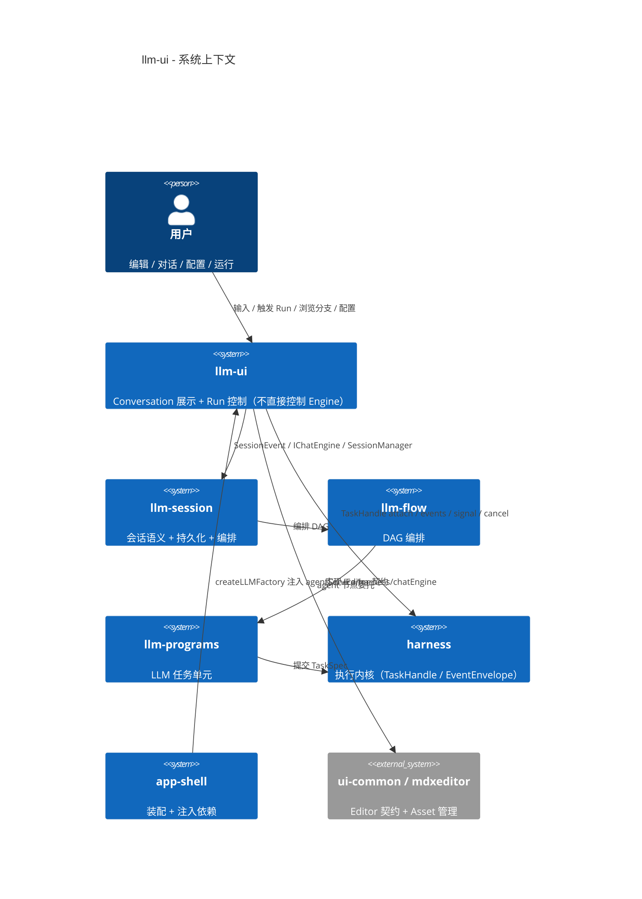
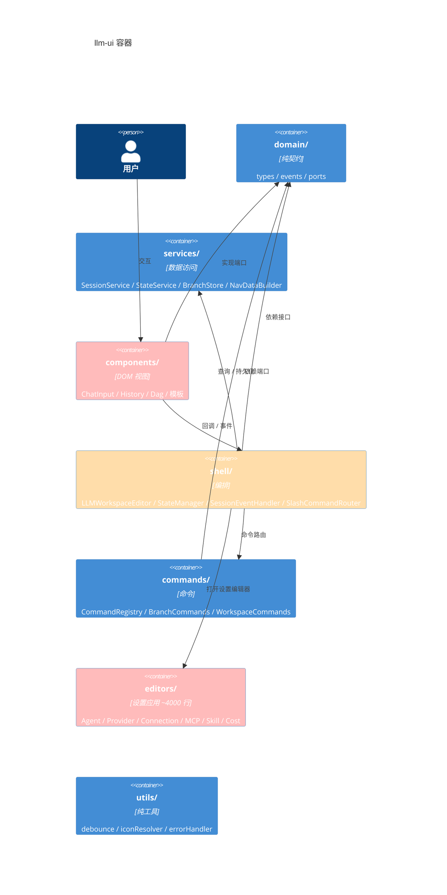
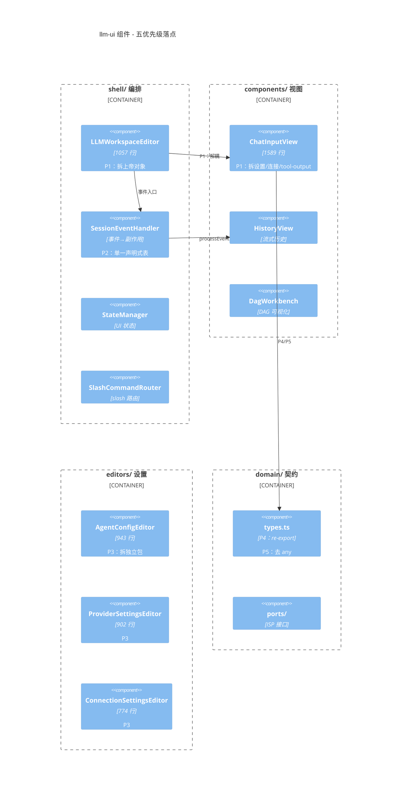
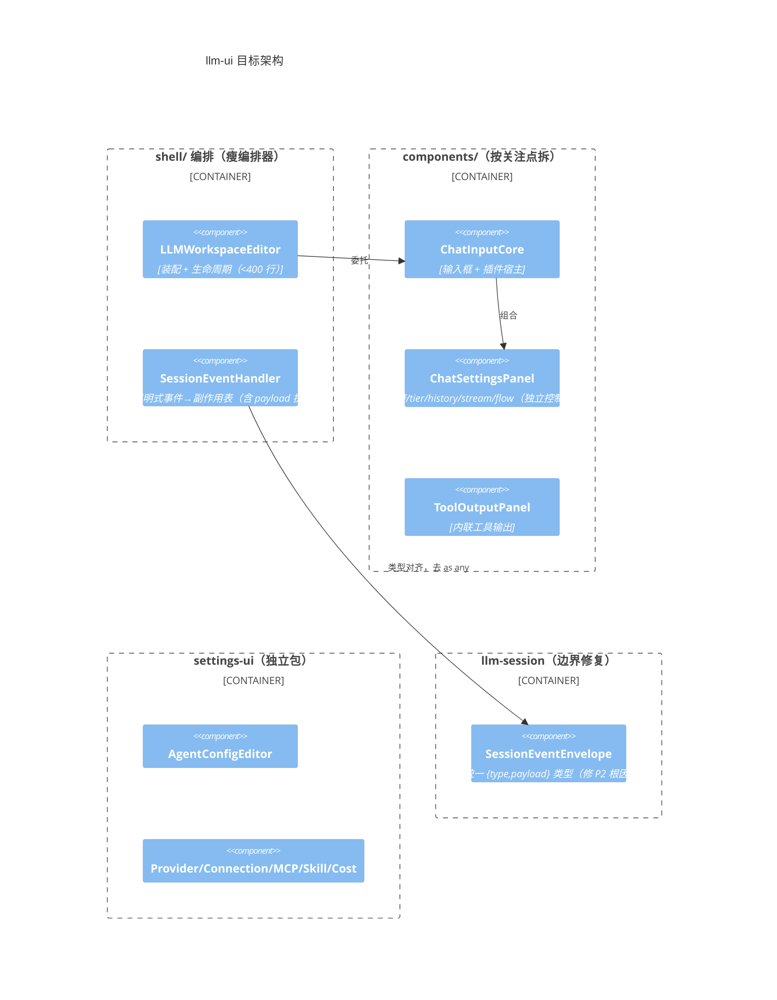

# llm-ui 架构 C4 分析 + 五优先级的提升路径

> 用 C4（Context/Container/Component）梳理 llm-ui 当前结构，标注 P1–P5 的落点，并给出目标架构与**全部未完成项**清单。

## 0. 未完成项总清单（诚实盘账）

| 范围 | 未完成 | 状态 |
|---|---|---|
| llm-ui P1 | 拆 `ChatInputView`(1589) + `LLMWorkspaceEditor`(1057) | 未做 |
| llm-ui P2 | `SessionEventHandler` 的 `as any` + 事件流三路收敛 | 空 executor 已删；边界类型未修 |
| llm-ui P3 | 拆 `editors/`(~4000 行) 为独立包 | 未做 |
| llm-ui P5 | 38 处 `any` + `✅` 历史注释 | console 已清零；any/注释未做 |
| harness | `harness.ts`(696) 未拆成 TaskScheduler/EffectDispatcher/ResourceManager 协调器 | 仅抽了 utils |
| harness | `store.ts`(936) 未按聚合根拆 TaskStore/EffectStore/ResourceStore | 仅抽了 store-helpers |
| doc | `doc/readme.md` 已删除（旧架构），文档入口见 `CLAUDE.md` 项目文档表 | 已完成 |

> 已完成（本会话）：llm-ui P4（TokenStats→SessionTokenUsage）、P5 console、P2 空 executor；以及此前 harness/upper-layers 的全部下沉项 + 预算扣减 + 包拆分重命名。

---

## 1. C1 系统上下文

**边界（正确）**：llm-ui 只依赖 `presenter` 接口 + `llm-session` 公开句柄 + `harness` 的 `TaskHandle`，不 import DAG Runtime 内部。

---

## 2. C2 容器（llm-ui 内部）

**问题标注**：`editors` 是「另一个应用」；`components.ChatInput` 和 `shell.LLMWorkspaceEditor` 是两个上帝对象。

---

## 3. C3 组件（P1–P5 落点）

---

## 4. 目标架构（提升后）

**目标要点**：
1. `LLMWorkspaceEditor` 从 1057 → 纯装配器；`ChatInputView` 从 1589 → 核心 + 设置面板 + 工具输出三块。
2. `SessionEventHandler` 用「事件→执行器函数」的单一映射（payload 直接作为执行器入参），消除三路处理 + `as any`。
3. `SessionEventBus` 引入 `SessionEventEnvelope` 类型，让边界类型一致。
4. `editors/` 独立为 `llm-settings-ui`。
5. 类型 re-export + 去 `any`。

---

## 5. 建议执行顺序（单一切口逐步验证）

1. **P2 根修**：llm-session 引入 `SessionEventEnvelope`，SessionEventHandler 去 `as any`（范围最小、修根因）。
2. **P1 第一刀**：ChatInputView 抽出 `ChatSettingsPanel`（`bindSettingsEvents` ~140 行 + 相关 DOM 字段）。
3. **P1 第二刀**：ChatInputView 抽出 `ToolOutputPanel`（`showToolOutput`/`clearToolOutput`）。
4. **P1 收尾**：LLMWorkspaceEditor 精简为纯装配。
5. **P3**：`editors/` → `llm-settings-ui` 包。
6. **P5 收尾**：`✅` 历史注释 + 剩余 `any`。
7. **harness 深拆**：harness.ts 协调器化、store.ts 聚合根化（另一条线，独立推进）。
