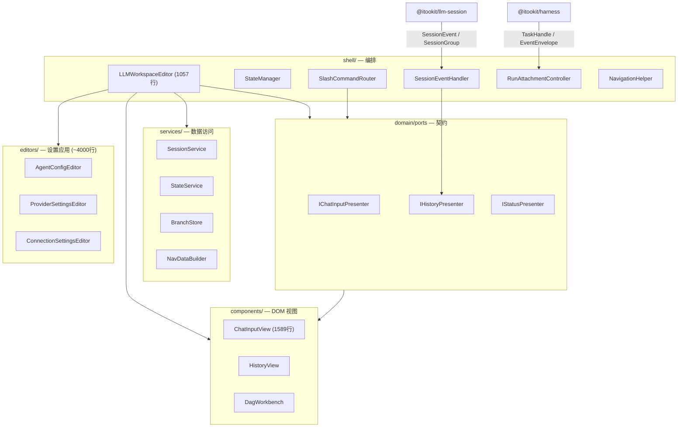

# llm-ui 审查分析

> 审查对象：`@itookit/llm-ui`（约 23k 行 / ~130 文件）。按「接口定义 / 事件流 / 内部流程 / 模块划分 / 代码质量」五维分析，并给出可落地重构优先级。

## 0. 定位与边界（本包 CLAUDE.md）

llm-ui 负责 **Conversation 展示 + Run 控制**，不直接控制 Engine：

- `RunAttachmentController` 通过 `TaskHandle` attach/消费事件/signal/cancel。
- `DagWorkbench` 从插件 Manifest/UI Contribution 构建，不 import DAG Runtime。
- Process 输出以文本节点安全写入（不拼接未转义 HTML）。
- `SessionState` 是 Round 的 UI 投影，不是运行事实源。

这个边界是对的：**UI 只依赖 presenter 接口 + harness/llm-session 的公开句柄，不碰 DAG Runtime 内部**。

## 1. 架构总览

## 2. 接口定义 — 合理性

### ✅ 做得好的

1. **ISP（接口隔离）到位**：`IHistoryPresenter extends ICollapseManager, IStreamingController`，消费者可按需依赖窄角色接口（注释明确要求「depend on the narrowest role」）。
2. **`IStreamableEditor`**（`appendDelta/flush/finalize/content/hasPending`）是干净的流式渲染契约——增量不触发全量重建、flush 返回高度差、编辑器不关心滚动容器（SRP）。
3. **`IEditorEventBus`** 是类型安全的 typed event bus（`on/emit/once/destroy` + 泛型 key），且实例级（`EditorEventBus` 封装 `@itookit/stdio` 的 EventBus）。
4. **Command 依赖接口不依赖 DOM**：`CommandContext` 持有 presenter 接口，`ChatInput` 实现可被替换。

### ⚠️ 问题

| 问题 | 位置 | 说明 |
|---|---|---|
| `any` 契约 | `IStatusPresenter.updateFromSnapshot(snapshot: any)` | 状态快照类型未定义，破坏类型安全 |
| `any` 回退 | `StateManager.restoreInputState(..., sessionSettings?: any)` | 会话设置类型应为 `ChatSessionSettings` |
| 类型重复 | `domain/types.ts` 的 `TokenStats`/`SkillInfo`/`ChatSessionSettings` | 与 llm-session/common 重复（注释自述「避免直接依赖 llm-runtime」，但实际可 re-export） |
| 事件名无命名空间收敛 | `EditorBusEvents` | `branch:*`/`nav:*`/`batch:*`/`content:*`/`state:*` 混合，且与 llm-session 的 `message:*`/`log:*` 风格不一 |
| 应用端口语义模糊 | `IPrivilegedCommandService` | 只 `plan/exec` 两个方法，却叫「privileged」，无权限语义 |

## 3. 事件流 — 是否合适

### ✅ 做得好的

- **双层事件**分离正确：`IEditorEventBus`（编辑器内部 UI 交互）+ `SessionEvent`/`RegistryEvent`（来自 llm-session 的业务/全局事件）。
- **`SessionEventHandler` 的声明式副作用表**（`EVENT_SIDE_EFFECTS`：事件 → `SideEffect[]`）——新增事件只需加一行，符合 OCP。

### ⚠️ 问题（核心痛点）

1. **三路处理并存，同一事件被多处处理**：`handleSessionEvent` 里依次走 ① `historyView.processEvent(event)`（DOM 级）② `handleBranchEvent(event)`（switch-case 特判）③ 副作用表。`branch:switched` 同时出现在副作用表（`refreshBranch/refreshNav/flashIndicator`）和 `handleBranchEvent` 特判（`renderFull + position`）里，逻辑割裂。

2. **声明式表里有空执行器**：`updateStatus: () => {}`——副作用表声明了 `updateStatus`，实际状态更新却在 `updateStatusFromEvent` 里单独处理。表与执行不一致。

3. **`handleGlobalEvent` 回到命令式 switch-case**（`session_status_changed`/`session_tty_active`/`session_hitl_active`/`execution_task_projected`），与 EVENT_SIDE_EFFECTS 声明式风格不统一。

4. **token usage 双形状兼容**：`updateStatusFromEvent` 用 `(event as any)` + 大量 `p?.tokenUsage ?? p?.usage ?? 0` 回退，同时兼容旧 `OrchestratorEvent` 和新 `AgentEventFinished`。说明事件形状未收敛，应清理旧形状。

5. **会话级事件与全局事件耦合在一个 handler**：`SessionEvent`（会话内）和 `RegistryEvent`（跨会话注册表）都在 `SessionEventHandler` 里处理，职责混了。

## 4. 内部流程 — 清晰度

### ✅ 做得好的

- 分层清晰：`shell → services → ports → components`。
- `LLMFactory` 用 `pendingCreations` 按 nodeId 去重，防止外部框架重复创建编辑器（好防御）。
- `StateManager` 用 debounce 保存 UI 状态。

### ⚠️ 问题

1. **`LLMWorkspaceEditor`（1057 行）是上帝对象**：同时实现 `IEditor`、持有全部 view/service 引用、注册命令、绑定事件、管 workspace panes、管 DAG、管 run attachment、管 TTY、管 OCR、管 skill。

2. **`ChatInputView`（1589 行）是更大的上帝组件**：输入框 + 插件系统 + 连接选择器 + tier 切换 + skill 面板 + 工具输出面板 + 附件 + OCR + token meter 全塞一个类。

3. **命令路由分散四处**：`CommandRegistry`（事件→命令）、`SlashCommandRouter.buildSlashCallbacks`（slash → 回调）、`WorkspaceCommands`、`NodeCommands`。命令注册和路由没有单一入口。

4. **隐式全局状态传递**：`StateManager.getAndClearCreateParams` 读 `sessionStorage['app_create_params']`（magic key），跨组件耦合，且 `restoreInputState` 有四级优先级（initialInputState → createParams → savedState → 兜底），逻辑冗长。

## 5. 模块划分 — 解耦/扩展

### ✅ 做得好的

- `domain/`（纯契约）→ `services/`（数据）→ `components/`（DOM）→ `shell/`（编排）→ `editors/`（设置）分层清晰。
- `components/templates/` 把模板字符串与组件类分离。
- `components/common/` 抽了通用 DOM 工具（ScrollController/DOMCache/EventBatchProcessor/TimerManager/EventCleanup）。

### ⚠️ 问题

| 问题 | 说明 |
|---|---|
| `editors/` 是「另一个应用」 | 5 个设置编辑器（Agent/Provider/Connection/MCP/Cost）合计 ~4000 行、各近千行，与 chat 编辑器关系松散，应拆成独立 `llm-settings-ui` 或子包 |
| `shell/` 粒度不一 | `LLMWorkspaceEditor` 是唯一编排器，其它（StateManager/SessionEventHandler/…）是它的依赖，但都平铺在 shell/ 下，没有「编排器 vs 子协调器」的层级 |
| `domain/` 不纯 | `types.ts` 混了运行时常量（`DEFAULT_SESSION_SETTINGS`）和 UI 专属类型 |
| `context-menu/AIContextMenu` | 独立扩展点，与 commands 系统并行，两套扩展机制 |

## 6. 代码质量 — 精简空间

| 度量 | 数值 |
|---|---|
| `any` / `as any` | **38 处**（SessionEventHandler 的 event payload、StateManager 的 sessionSettings、IStatusPresenter 的 snapshot） |
| `console.log/warn/error` | **44 处**（LLMFactory 尤其多，应统一走 ErrorHandler/logger） |
| TODO/FIXME | 4 处 |
| 千行文件 | ChatInputView 1589、LLMWorkspaceEditor 1057、SlashCommandPlugin 983、AgentConfigEditor 943、ProviderSettingsEditor 902、FloatingNavPanel 935 |

**技术债信号**：注释里大量 `✅ 改动：…` / `✅ 修复：…` 历史标记散落各处，说明经历过反复修补，是重构信号。

## 7. 结论与优先级

| 优先级 | 事项 | 收益 | 风险 | 状态 |
|---|---|---|---|---|
| **P1** | 拆 `ChatInputView`（1589）与 `LLMWorkspaceEditor`（1057）两个上帝对象 | 最大债，可测性/扩展性 | 中 | ✅ ChatInputView 三面板已拆（1589→1453）；LLMWorkspaceEditor 判定为 composition root，非上帝对象 |
| **P2** | 收敛事件流：三路处理 → 单一声明式副作用表；去掉空 executor；去掉 `as any` 双形状兼容 | 消除割裂 | 低 | ✅ 完成 |
| **P3** | 拆 `editors/` 设置应用（~4000 行）为独立包/子模块 | 减包体、隔离关注点 | 中 | ✅ 完成（→ `@itookit/llm-settings-ui`） |
| **P4** | 类型去重：`TokenStats`/`SkillInfo`/`ChatSessionSettings` 改为 re-export | 消除重复 | 低 | ✅ 完成 |
| **P5** | 清理 `any`、console.log、`✅` 历史注释 | 可读性 | 低 | ✅ 完成（console/注释清零；any 38→33，剩余为 DOM/回调合法转型） |

**已落地**：
- P4：`domain/types.ts` 的 `TokenStats` 改为 `export type TokenStats = SessionTokenUsage`（re-export，消除 UI 副本）。
- P2（根修）：llm-session 新增 `SessionEventEnvelope`（总线边界归一化类型），`SessionEventBus.onSession`/`SessionRegistry.onEvent`/`SessionManager.onEvent` 统一收/发该类型；llm-ui 的 `SessionEventHandler`/`IHistoryPresenter`/`HistoryView` 全部改用 envelope，去掉了 3 处 `as any`。
- P5：删除全部 8 处 `console.log`/`console.debug` 调试日志。

**P2 顺带修出的隐藏 bug**（原被 `as any` 遮蔽）：
1. **工具事件字段陈旧**：`tool:*` 事件 canonical 形状是 `{ call: { toolId, name, result/error/delta } }`，但 HistoryView 读的是旧的平铺 `toolId/nodeId/name`。已改为 `call.*`。
2. **`tool:queued` 节点创建失效**：原逻辑用不存在的 `nodeId` 作 parentId 创建工具节点（canonical 事件无 nodeId）；工具节点实由 execution tree（`message:appended`）创建，改为仅更新状态。
3. **错误码类型错**：`code` 是字符串，原按 `401`/`429`（数字）比较恒假；已改为 `'401'`/`'429'`。
4. **死事件 case**：`stream:thinking:start`/`stream:content:start`/`stream:thinking:stop` 非 canonical 事件名，已删除。
5. **token meter 字段错**：`finished` 的 `usage` 是 `TokenUsage`（prompt_tokens/completion_tokens），原读 `inputTokens/outputTokens` 恒为 0；已正确映射。

**P2 的 `as any` 根因（边界类型不匹配，需跨包修）**：
`SessionEventBus`（llm-session）在总线边界把所有事件归一化为 `{ type, payload }`——canonical `AgentEvent` 的平铺字段（`usage`/`ref`/`newName`）被折叠进 `payload`。但 `SessionEvent` 类型仍保留平铺字段变体，导致 llm-ui 的 `SessionEventHandler` 只能用 `as any` 读 `payload`。正确修法是在 llm-session 引入 `SessionEventEnvelope` 类型，让 `onSession` 回调类型与边界一致。

**P2 关联的功能缺口**：`finished` 事件携带的是原始 `TokenUsage`（`prompt_tokens`/`completion_tokens`），而 UI 期望 rich `SessionTokenUsage`（`inputTokens`/`outputTokens`/`costUsd`/`contextUsageRatio`）。rich 用量从未被计算，token meter 目前是「死代码」——这是功能缺口而非纯重构，需要单独补。

**一句话结论**：llm-ui 的**接口契约层（ports）和分层骨架是健康的**（ISP、声明式事件表、接口依赖）——真正的问题不在「怎么抽象」，而在「两个上帝对象 + 事件流三路处理 + 一个 4000 行的设置应用」这几个**既有的体积债**，属于「精简与拆解」而非「重新设计」。
