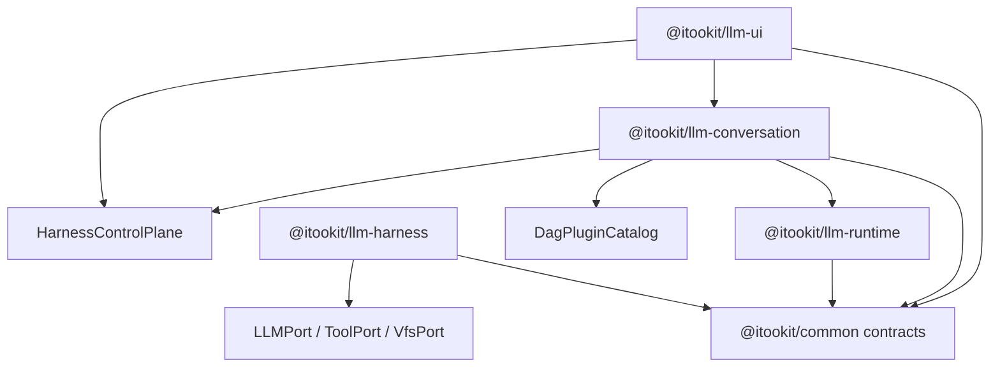

# LLM v3：Process Kernel 与 Conversation 架构

> 状态：已按本设计完成主路径切换。旧 TaskGraph、ILoop、重复执行器和旧会话存储不再保留，也不提供兼容入口。

## 1. 结论

LLM v3 采用四个边界明确的包：

| 包 | 唯一职责 |
| --- | --- |
| `@itookit/llm-runtime` | 定义“一项 LLM 工作如何向前运行” |
| `@itookit/llm-harness` | 管理 Process 生命周期、资源、调度和编排 |
| `@itookit/llm-conversation` | 管理 Session、Round、分支、上下文提交和 Flow |
| `@itookit/llm-ui` | 通过 Harness 控制面观察和控制 Run |

核心原则是：

> Engine 运行 Process，Harness 调度 Process，Conversation 提交 Round，DAG 插件定义节点，UI attach Run。

DAG 是 Harness 的一种可选编排方式，不是普通聊天的必经路径。

## 2. 依赖方向



约束：

- Engine 不依赖 Conversation、Harness、UI 或具体设备实现。
- Harness 不读取聊天历史，也不理解 Round 和 Session。
- Conversation 只通过 `ProcessHost` 提交执行，不触碰 Dispatcher 内部状态。
- UI 只持有 `RunHandle`，不直接调用 ProcessProgram。
- 公共包只提供跨包协议，不承载运行时装配。

## 3. 五个层级

| 概念 | 生命周期 | 含义 |
| --- | --- | --- |
| `Session` | 长期 | 对话、分支、设置和附件的持久化容器 |
| `Round` | 一次完整交互 | 用户可见、可分支、默认进入后续上下文的语义提交 |
| `ExecutionRun` | 一次执行编排 | 可嵌套的执行实例，可以是 Direct、DAG 或其他 Scheduler |
| `Process` | 一项可调度工作 | 可等待、让出、取消和 checkpoint 的运行实例 |
| `Exchange` | Process 内部 | 一次模型请求及其工具交互 |

三种图关系必须独立：

```text
ConversationRound.historyParentIds  // 对话历史与分支
ExecutionRun.parentRunId            // 执行包含关系
DagRun.edges                        // DAG 节点依赖
```

`Round` 不递归嵌套。一次 DAG 可以作为一个 Round 的主执行方式，但内部递归的是 Run 和 Process。

## 4. 用户路径

### 4.1 普通聊天

```text
sendMessage
→ create ConversationRound
→ Harness.submit(scheduler = "direct")
→ DirectScheduler
→ ChatProgram / AgentProgram
→ complete Round
```

普通聊天不创建单节点 Flow，也不经过 DAG Scheduler。

### 4.2 DAG Flow

```text
sendMessage(execution = flow)
→ load immutable FlowRevision
→ FlowRevision → DagRunSpec
→ Harness.submit(scheduler = "dag")
→ DagScheduler
→ DagPlugin Runtime
→ one Process per ready node
→ terminal artifacts → assistant output
→ complete Round
```

DagScheduler 只处理依赖、节点状态、并发提交、输出传播和图 Effect，不识别 `agent`、`route`、`human` 等业务类型。

### 4.3 后台执行

后台 Run 可以没有 `ownerRoundId`。因此 Run 不是 Round 的子类型，Round 与 Run 是 `0..N` 关系。

## 5. Engine：可恢复的 ProcessProgram

Engine 当前目录：

```text
packages/llm-runtime/src/
├── core/
│   ├── context-assembler.ts
│   └── provider-message-adapter.ts
└── process/
    ├── index.ts
    └── programs/
        ├── chat-program.ts
        ├── agent-program.ts
        ├── agent-exchange.ts
        ├── agent-tools.ts
        └── agent-types.ts
```

核心协议：

```typescript
interface ProcessProgram<State, Input, Output> {
  readonly kind: string;

  initialize(input: Input): Promise<State>;

  run(
    state: State,
    context: ProcessContext,
    signal?: ProcessSignal,
  ): AsyncGenerator<
    ProcessEvent,
    ProcessTransition<State, Output>
  >;
}
```

`run()` 必须返回显式 Transition：

```typescript
type ProcessTransition<State, Output> =
  | { type: 'waiting'; state: State; waitFor: WaitCondition }
  | {
      type: 'yielded';
      state: State;
      reason: 'quota' | 'fairness' | 'child-process';
    }
  | { type: 'completed'; output: Output }
  | { type: 'failed'; error: ProcessError };
```

Harness 只持久化返回的 State 和 WaitCondition，不持久化活的 `AsyncGenerator`。收到信号后，Dispatcher 使用 checkpoint state 再次调用 `run()`。

Engine 不负责：

- Session 和分支
- Flow 持久化
- Scheduler 和队列
- UI Projection
- 插件装配
- 具体 LLM、Tool、VFS 服务

## 6. Harness：机制、策略和编排

Harness 当前目录：

```text
packages/llm-harness/src/
├── kernel/
│   ├── harness-kernel.ts
│   ├── dispatcher.ts
│   ├── process-table.ts
│   └── program-registry.ts
├── scheduling/
│   ├── fifo-policy.ts
│   ├── direct/
│   └── dag/
├── plugins/
│   ├── dag-plugin-registry.ts
│   └── builtin/
└── persistence/
    └── memory-stores.ts
```

### 6.1 HarnessKernel

Kernel 是唯一控制面：

```typescript
interface HarnessControlPlane {
  submit(request: RunRequest): Promise<RunHandle>;
  attach(runId: RunId): Promise<RunHandle>;
}

interface RunHandle {
  readonly runId: RunId;
  events(fromSequence?: number): AsyncIterable<RunEventEnvelope>;
  signal(signal: ProcessSignal): Promise<void>;
  cancel(): Promise<void>;
  snapshot(): Promise<RunSnapshot>;
}
```

UI、CLI 和后台调用共享这套入口。

### 6.2 Dispatcher

Dispatcher 统一负责：

- ready queue
- 并发上限
- scheduling policy
- cooperative cancellation
- waiting / signal / resume
- checkpoint
- Process 状态迁移

Dispatcher 不理解 Chat、DAG、Mission 或 UI。

### 6.3 SchedulingPolicy

Policy 只选择 ready Process：

```typescript
interface SchedulingPolicy {
  select(
    ready: readonly ProcessRecord[],
    capacity: ResourceCapacity,
  ): readonly ProcessId[];
}
```

当前提供 FIFO。Priority、Fair Share、Interactive First 和 Resource Aware 可以作为独立策略增加，不需要修改 ProcessProgram。

### 6.4 SchedulerModule

Scheduler 决定何时产生 Process：

```typescript
interface SchedulerModule<Spec> {
  readonly kind: string;
  start(spec: Spec, context: SchedulerContext): Promise<SchedulerRun>;
  restore(
    snapshot: SchedulerSnapshot,
    context: SchedulerContext,
  ): Promise<SchedulerRun>;
}
```

当前只有：

- `DirectScheduler`：一个 Run 提交一个 Process。
- `DagScheduler`：根据图依赖提交多个 Process。

新增 Batch 或 Mission 时应增加 Scheduler，或先编译为 DAG；不能向 Dispatcher 添加业务分支。

## 7. 资源端口

Process 通过 `ProcessContext` 获取资源：

```typescript
interface ProcessContext {
  processId: ProcessId;
  runId: RunId;
  resources: {
    llm: LLMPort;
    tools: ToolPort;
    vfs: VfsPort;
  };
  capabilities: CapabilitySet;
  budget: BudgetView;
  abortSignal: AbortSignal;
}
```

这相当于受控资源句柄：

- `LLMPort` 隔离 Provider 和连接实现。
- `ToolPort` 隔离工具注册、授权和调用。
- `VfsPort` 隔离工作目录和持久化设备。
- `CapabilitySet` 与 `BudgetView` 描述本 Process 的权限和配额视图。

Engine 不允许 import 具体 Device、VFS Manager 或 UI。

## 8. DAG 插件

一个插件有三个独立贡献：

```text
DAG Plugin
├── Manifest  共享、可序列化
├── Runtime   后台执行入口
└── UI        浏览器展示入口
```

### 8.1 Manifest

Manifest 固定节点版本、Schema、端口和能力要求：

```typescript
interface DagPluginManifest<Config> {
  id: string;
  version: string;
  kind: string;
  title: string;
  category: string;
  configSchema: JsonValue;
  defaultConfig?: Partial<Config>;
  inputs: InputPortSpec[];
  outputs: OutputPortSpec[];
  requiredCapabilities?: string[];
}
```

Flow 节点只引用插件：

```typescript
interface FlowNodeDefinition {
  id: FlowNodeId;
  name: string;
  plugin: string;
  pluginVersion: string;
  config: JsonValue;
  inputs: Record<string, JsonValue>;
}
```

不存在内置 TaskKind 联合类型，也不存在 Scheduler 对具体节点类型的判断。

### 8.2 Runtime

```typescript
interface DagRuntimeContribution<Config> {
  validate?(config: Config): ValidationResult;
  createProcess(context: DagNodeContext<Config>): DirectRunSpec;
  mapOutput?(output: unknown): DagNodeOutcome;
}
```

Runtime 将一个节点解释为 Process 规范，并可将该 Process 的输出映射为统一节点结果：

```typescript
interface DagNodeOutcome {
  outputs: Record<string, ArtifactDraft>;
  effects?: GraphEffect[];
}
```

动态扩图使用带 `idempotencyKey` 的 `patch-graph` Effect，重复应用不会重复创建节点。

### 8.3 UI

UI 贡献只描述 Palette、节点摘要和 Inspector：

```typescript
interface DagUIContribution<Config> {
  palette: { label: string; group: string; icon?: string };
  node: { summarize(config: Config): string; renderer?: string };
  inspector: { layout?: FormLayout; customEditor?: string };
}
```

后台不加载 UI 入口，浏览器不加载 Runtime 的 Node.js 或 Shell 依赖。

## 9. Conversation：语义边界

Conversation 当前负责：

- Session 文件和设置
- Round 持久化与分支
- Context Profile
- 不可变 FlowRevision
- Run 到 Round/UI 的投影
- 命令插件

规范化 Round：

```typescript
interface ConversationRound {
  id: string;
  sessionId: SessionId;
  historyParentIds: string[];
  input: ChatMessage[];
  output: ChatMessage[];
  executions: ExecutionRef[];
  status:
    | 'pending'
    | 'running'
    | 'waiting'
    | 'completed'
    | 'failed'
    | 'cancelled';
  createdAt: number;
  completedAt?: number;
}
```

Session manifest 只接受 `schemaVersion: 3`。未知或旧格式直接报错，不自动迁移、不静默覆盖。

每个 Round 单独持久化，manifest 维护：

- `rootRoundId`
- `branches`
- `branchMeta`
- `currentBranch`
- `currentHead`
- `children`

Branch、merge、历史父子关系只属于 Conversation Store。

## 10. Context 提交边界

默认上下文只读取顶层 Round 的用户输入和最终助手输出：

```text
previous Round inputs/outputs
→ ContextAssembler
→ ContextSnapshot
→ Process input
```

DAG 内部 Agent、Tool、Route 的原始输出不会自动进入下一轮。需要复用时，必须显式导入 Artifact、Run Output、Summary 或选定节点结果。

这样可以避免：

- 内部执行细节泄漏
- 工具原始输出污染
- 多 Agent 内容重复
- Context 无界膨胀

## 11. HITL

HITL 是 Process waiting 状态，不是 DagScheduler 特殊节点分支：

```typescript
{
  type: 'waiting',
  state,
  waitFor: {
    type: 'human-signal',
    requestId,
    prompt,
    schema,
    conversational,
  },
}
```

边界规则：

- 授权、确认、结构化选择：发送 `ProcessSignal`，不新建 Round。
- 需要进入长期对话上下文的自然语言回答：新建 Round，或明确作为当前 Round 的补充输入持久化。

## 12. 事件分层

事件分为三层：

| 事件 | 所有者 | 用途 |
| --- | --- | --- |
| `ProcessEvent` | Engine/Process | 模型增量、usage、diagnostic |
| `RunEventEnvelope` | Harness | 生命周期、顺序、checkpoint、回放 |
| Session/UI Event | Conversation | 消息投影、导航、未读状态 |

UI 投影不是运行事实源。重新 attach 时以 Harness 的顺序事件流和 snapshot 为准。

## 13. 调度与恢复约束

JavaScript 无法安全抢占任意异步代码，因此调度是协作式的：

- `AbortSignal` 负责取消。
- `waiting` 负责外部输入。
- `yielded` 负责主动让出。
- `ProcessCheckpoint` 保存可序列化 State。
- `SchedulerSnapshot` 保存编排状态。

当前默认 Event Store 和 Checkpoint Store 是内存实现；Kernel 允许注入持久化 Store。跨进程重启恢复还需要持久化 Run/Scheduler Snapshot 并在启动时调用 Scheduler `restore()`，不能把内存实现描述为持久恢复。

## 14. 已删除的设计

以下概念不再是公开架构的一部分：

- `TaskRunner`
- `TaskGraphReconciler`
- `DependencyScheduler`
- `TaskExecutorRegistry`
- `ILoop`
- 多套 LoopExecutor
- 两套万能 Middleware
- 两套 Context Manager
- Agent 双重适配器
- Chat 单节点 Flow 编译
- Session 中的旧 ChatNode 树
- `RoundId` 充当 Process checkpoint
- UI 直接写 Process stdin

旧 import 路径和旧数据格式不提供别名、适配器或迁移器。

## 15. 扩展规则

新增能力时按下列判断：

| 需求 | 扩展点 |
| --- | --- |
| 新的 LLM 运行循环 | `ProcessProgram` |
| 新的就绪队列选择方式 | `SchedulingPolicy` |
| 新的编排方式 | `SchedulerModule` |
| 新的 DAG 节点 | `DagPlugin` |
| 新 Provider、Tool、VFS | Resource Port 实现或装饰器 |
| 新聊天命令或分支行为 | Conversation 服务/插件 |
| 新节点编辑器 | `DagUIContribution` |

不得通过万能 Middleware、核心 `switch(kind)` 或跨包反向依赖实现扩展。

## 16. 验收标准

- 普通 Chat 的运行路径中不存在 DAG 对象。
- DagScheduler 源码不引用具体节点 kind。
- Engine 没有 Session、Flow、UI、Device 依赖。
- Conversation 不读取 Dispatcher 内部状态。
- UI 只通过 `RunHandle` signal/cancel/attach。
- 所有等待状态都有 checkpoint 和明确 WaitCondition。
- FlowRevision 固定插件 ID 与版本。
- Session manifest 只接受规范 v3 格式。
- 旧 TaskGraph、ILoop 和 ChatNode 路径不可导入。

最终边界：

> Round 是语义提交边界，Run 是执行编排边界，Process 是可调度边界，DAG 是 Run 的一种实现。
