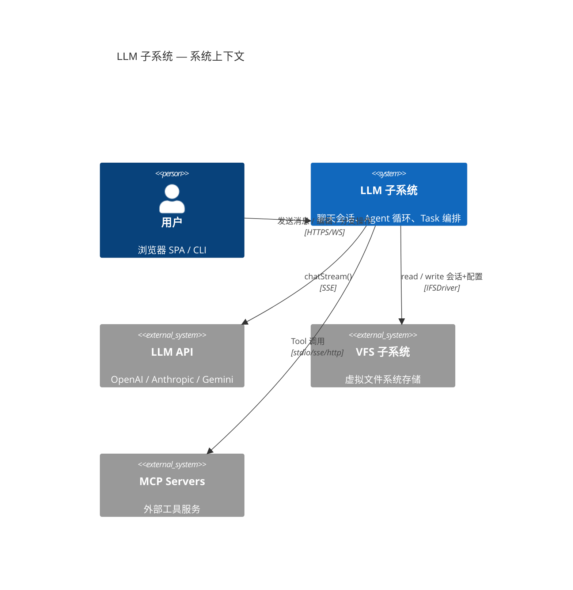
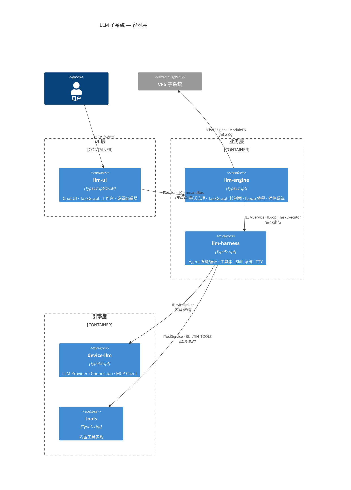
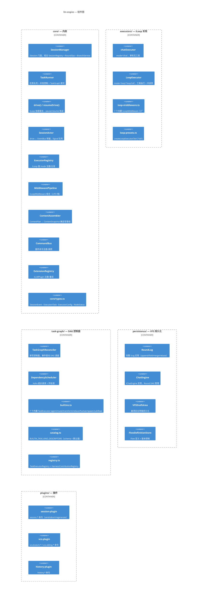
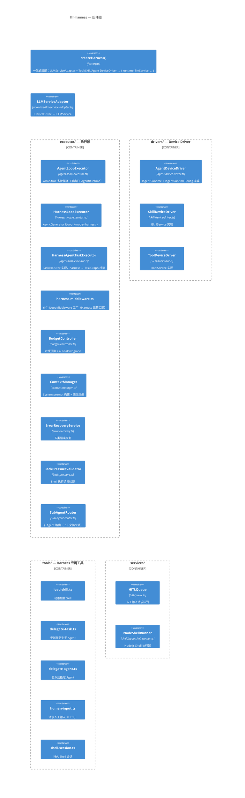
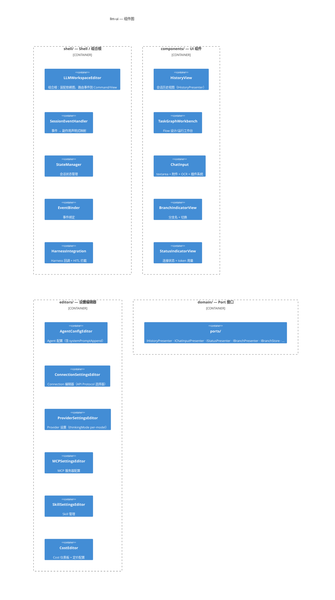
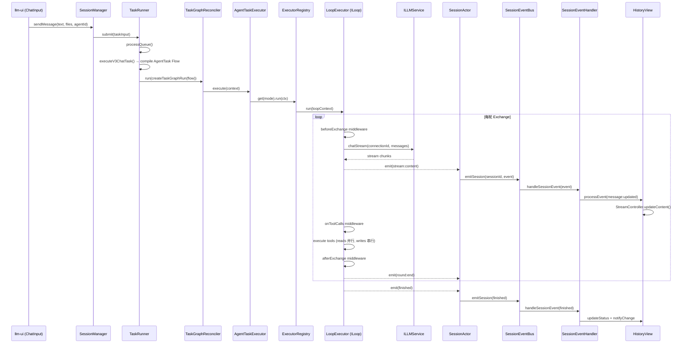
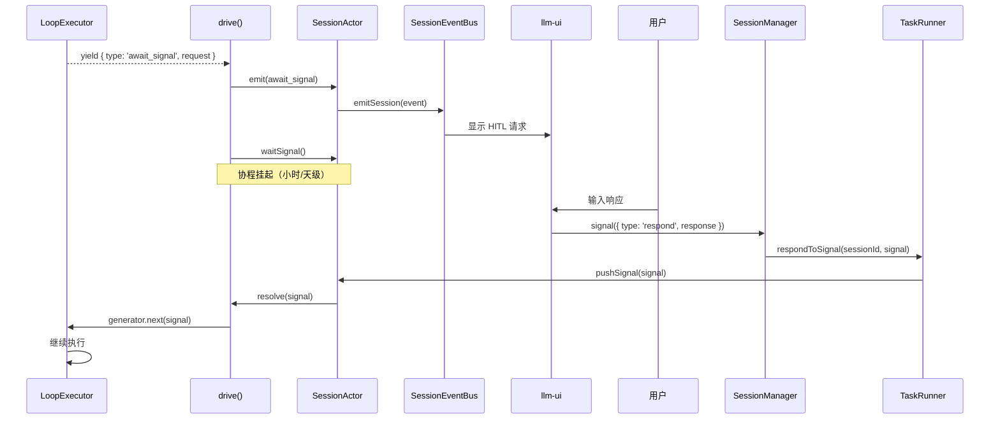
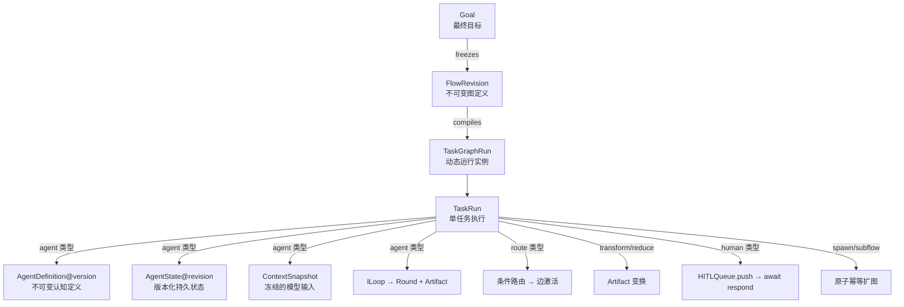

# LLM v3 设计文档

> 涵盖 `@itookit/llm-engine`、`@itookit/llm-harness`、`@itookit/llm-ui` 三个核心包的架构、模块、接口与事件流。
> 生成日期：2026-07-25

---

## 目录

- [1. 系统上下文 (C1)](#1-系统上下文-c1)
- [2. 容器层 (C2)](#2-容器层-c2)
- [3. llm-engine 组件层 (C3)](#3-llm-engine-组件层-c3)
- [4. llm-harness 组件层 (C3)](#4-llm-harness-组件层-c3)
- [5. llm-ui 组件层 (C3)](#5-llm-ui-组件层-c3)
- [6. 关键接口契约](#6-关键接口契约)
- [7. 事件流设计](#7-事件流设计)
- [8. 执行路径](#8-执行路径)
- [9. TaskGraph 控制面](#9-taskgraph-控制面)
- [10. 模块文件索引](#10-模块文件索引)

---

## 1. 系统上下文 (C1)



---

## 2. 容器层 (C2)



### 依赖关系

```
llm-ui ──→ llm-engine ──→ llm-harness ──→ device-llm
                    │              │
                    └──→ vfslib    └──→ tools
```

- 上层可依赖下层，下层不知上层
- 跨包契约定义在 `@itookit/common`
- 具体实现由 `app-shell/bootstrap.ts` 在启动时注入

---

## 3. llm-engine 组件层 (C3)

### 3.1 模块结构



### 3.2 核心类关系

| 类/函数 | 文件 | 职责 |
|---|---|---|
| `SessionManager` | `session/session-manager.ts` | 门面：实现 ISession，组合 Registry + RoundOps + BranchService |
| `TaskRunner` | `session/task-runner.ts` | 任务队列 + 并发控制；submit() → executeV3ChatTask() / executeFlowTask() |
| `SessionState` | `session/session-state.ts` | 内存投影缓存，ILog.fold() 的 UI 层投影 |
| `SessionEventBus` | `session/session-event-bus.ts` | SessionEvent 路由（bound / background 分流） |
| `SessionRegistry` | `session/session-registry.ts` | 会话注册、绑定、生命周期管理 |
| `SessionActor` | `core/session-actor.ts` | emit() → EventBus；waitSignal() + pushSignal() ← HITL |
| `drive()` | `core/loop-driver.ts` | 协程宿主：yield AgentEvent → emit / yield await_signal → checkpoint → waitSignal |
| `resumeDrive()` | `core/loop-driver.ts` | 从 checkpoint 恢复（调用 loop.resume(checkpoint) 重建协程） |
| `ExecutorRegistry` | `core/executor-registry.ts` | register(ILoop) / get(mode) / setDefaultMode |
| `composeMiddleware()` | `core/middleware-pipeline.ts` | beforeExchange 正序 / afterExchange 逆序 / onError 首胜 |
| `ContextAssembler` | `core/context-assembler.ts` | 收集 mainline → profile 过滤 → token budget 裁剪 → Provider 验证 |
| `CommandBus` | `core/command-bus.ts` | register(name, handler) → execute(name, args) |
| `ExtensionRegistry` | `core/extension-registry.ts` | register(plugin) → activate(ctx) |
| `RoundLog` | `persistence/round-log.ts` | ILog：append/fold/merge/rebase + FoldCache(60s TTL) |
| `ChatEngine` | `persistence/chat-engine.ts` | IChatEngine：文件 CRUD + Session 管理 |
| `RoundGraphService` | `persistence/round-graph-service.ts` | Round DAG：createRef/appendChild/moveRef/listRefs |
| `FlowDefinitionStore` | `persistence/flow-definition-store.ts` | Flow 版本化存储 |
| `TaskGraphReconciler` | `task-graph/reconciler.ts` | run() → DependencyScheduler → executeTask → sync + record |
| `DependencyScheduler` | `task-graph/dependency-scheduler.ts` | readyIds() / start() / finish() / cancel() / snapshot() |
| `DeterministicRouteExecutor` | `task-graph/builtins.ts` | Route 任务：条件表达式评估 + 边激活 |
| `TransformExecutor` | `task-graph/builtins.ts` | identity / pick 操作 |
| `AgentTaskExecutor` | `task-graph/agent.ts` | AgentTask 适配：定义解析 → executeAgent 回调 |
| `AgentResolver` | `session/agent-resolver.ts` | resolveForChat / resolveExact / reResolveModel |

### 3.3 7 个内置 ILoopMiddleware

| 中间件 | 工厂函数 | 钩子 | 说明 |
|---|---|---|---|
| Budget | `createBudgetMiddleware(limits, harnessImpl?)` | `beforeExchange` | maxRounds / maxTokens / maxCost |
| Error Recovery | `createErrorRecoveryMiddleware(config?, harnessImpl?)` | `onError` | retry / compress / fallback |
| Compression | `createCompressionMiddleware(harnessImpl?)` | `beforeExchange` | 上下文压缩委托 harness |
| HITL | `createHITLMiddleware(harnessImpl?)` | `onToolCalls` | plan confirm → pause → await_signal |
| Skills | `createSkillsMiddleware(harnessImpl?)` | `beforeExchange` | Skill 加载 + system prompt 注入 |
| Back Pressure | `createBackPressureMiddleware(harnessImpl?)` | `afterExchange` | Shell 执行结果验证 + 错误注入 |
| Truncation Detection | `createTruncationDetectionMiddleware()` | `afterExchange` | finish_reason='length' → auto-continue |

---

## 4. llm-harness 组件层 (C3)

### 4.1 模块结构



### 4.2 核心类关系

| 类/函数 | 文件 | 职责 |
|---|---|---|
| `createHarness()` | `factory.ts` | 装配入口：llmDriver → LLMServiceAdapter + 3 DeviceDriver → HarnessInstance |
| `AgentLoopExecutor` | `executor/agent-loop-executor.ts` | while-true 循环：budget → compress → LLM call → tool exec → back-pressure |
| `HarnessLoopExecutor` | `executor/harness-loop-executor.ts` | AsyncGenerator ILoop：yield AgentEvent + yield await_signal |
| `HarnessAgentTaskExecutor` | `executor/agent-task-executor.ts` | 实现 TaskExecutor<AgentTaskConfig>，harness → TaskGraph 桥接 |
| `BudgetController` | `executor/budget-controller.ts` | 六维预算：turns / inputTokens / outputTokens / cost / duration / toolCalls |
| `ContextManager` | `executor/context-manager.ts` | system prompt 构建 + 四层压缩（L1 history_snip → L4 sliding_window） |
| `ErrorRecoveryService` | `executor/error-recovery.ts` | 五类错误：rate-limit / context-too-large / overload / truncation / other |
| `BackPressureValidator` | `executor/back-pressure.ts` | Shell 命令执行后验证 |
| `SubAgentRouter` | `executor/sub-agent-router.ts` | 上下文防火墙：独立消息历史、过滤工具、自定义 maxTurns |
| `AgentDeviceDriver` | `drivers/agent-device-driver.ts` | setServices({ llm, tool, skill, hitl }) + init() |
| `SkillDeviceDriver` | `drivers/skill-device-driver.ts` | listSkills / loadSkill（幂等）、注册 http/shell 工具 |
| `LLMServiceAdapter` | `adapters/llm-service-adapter.ts` | IDeviceDriver → ILLMService（标准实现） |

### 4.3 6 个 Harness 中间件

| 中间件 | 工厂函数 | 钩子 |
|---|---|---|
| Harness Budget | `createHarnessBudgetMiddleware(state)` | `beforeExchange` |
| Harness Error Recovery | `createHarnessErrorRecoveryMiddleware(state)` | `onError` |
| Harness HITL | `createHarnessHITLMiddleware(state)` | `onToolCalls` |
| Harness Back Pressure | `createHarnessBackPressureMiddleware(state)` | `afterExchange` |
| Harness Compression | `createHarnessCompressionMiddleware(state)` | `beforeExchange` |
| Harness Skills | `createHarnessSkillsMiddleware(state)` | `beforeExchange` |

---

## 5. llm-ui 组件层 (C3)

### 5.1 模块结构



### 5.2 核心类关系

| 类 | 文件 | 职责 |
|---|---|---|
| `LLMWorkspaceEditor` | `shell/LLMWorkspaceEditor.ts` | IEditor 实现；组装 Presenter + Command + EventHandler |
| `SessionEventHandler` | `shell/SessionEventHandler.ts` | 声明式 EVENT_SIDE_EFFECTS 映射，事件 → 副作用 |
| `HistoryView` | `components/HistoryView.ts` | IHistoryPresenter；组合 5 个子控制器 |
| `SessionRenderer` | `components/history/SessionRenderer.ts` | DOM 创建/销毁 |
| `StreamController` | `components/history/StreamController.ts` | 流式增量更新，RAF 帧调度 |
| `CollapseController` | `components/history/CollapseController.ts` | 折叠状态管理 |
| `EventDispatcher` | `components/history/EventDispatcher.ts` | 点击委托 data-action → handler |
| `TaskGraphWorkbench` | `components/TaskGraphWorkbench.ts` | Flow 设计模式（DAG 画布 + SchemaForm）+ 运行模式 |
| `TaskGraphDraftController` | `components/task-graph/DraftController.ts` | Flow 草稿 CRUD |
| `TaskGraphCanvas` | `components/task-graph/TaskGraphCanvas.ts` | DAG 可视化画布 |
| `SchemaForm` | `components/task-graph/SchemaForm.ts` | JSON Schema 驱动表单 |
| `ChatInput` | `components/input/ChatInputView.ts` | IChatInputPresenter |

### 5.3 ChatInput 插件

| 插件 | 文件 | 功能 |
|---|---|---|
| `SlashCommandPlugin` | `plugins/SlashCommandPlugin.ts` | `/exec`, `/read`, `/grep` 等命令行 |
| `MentionPlugin` | `plugins/MentionPlugin.ts` | `@` 文件/目录引用 |
| `HarnessPlugin` | `plugins/HarnessPlugin.ts` | Agent 事件监听 + HITL 输入 |
| `HistoryPlugin` | `plugins/HistoryPlugin.ts` | `↑↓` 键 Prompt 历史 |
| `TokenMeterPlugin` | `plugins/TokenMeterPlugin.ts` | 实时 Token 用量 |

---

## 6. 关键接口契约

### 6.1 ILoop — 协程执行器

```typescript
// common/src/interfaces/agent/loop.ts
interface ILoop {
    readonly mode: string;
    run(ctx: LoopContext): AsyncGenerator<AgentEvent, Round[], Signal | undefined>;
    resume(checkpoint: RoundId): AsyncGenerator<AgentEvent, Round[], Signal | undefined>;
}

interface LoopContext {
    sessionId: string;
    ref: Ref;
    log: ILog;
    llm: ILLMService;
    tools: IToolService;
    middlewares: ILoopMiddleware[];
    signal: AbortSignal;
    // LLM 配置
    connectionId?: string;
    model?: string;
    systemPrompt?: string;
    temperature?: number;
    maxTokens?: number;
    thinking?: boolean;
    reasoningEffort?: 'low' | 'medium' | 'xhigh';
    historyLength?: number;
    startedAt?: number;
    // TaskGraph
    runId?: string;
    contextSnapshot?: ContextSnapshot;
    preallocatedRoundId?: RoundId;
}
```

### 6.2 ILoopMiddleware — 中间件

```typescript
interface ILoopMiddleware {
    name: string;
    beforeExchange?(ctx: ExchangeContext): Promise<ControlDirective | void>;
    onToolCalls?(ctx: ExchangeContext, tools: PlannedTool[]): Promise<ControlDirective | void>;
    afterExchange?(ctx: ExchangeContext, result: RoundResult): Promise<ControlDirective | void>;
    onError?(ctx: ExchangeContext, error: Error): Promise<RecoveryAction | void>;
}
```

### 6.3 ILog — 会话日志

```typescript
interface ILog {
    fold(ref: Ref, strategy?: AssemblyStrategy): Promise<ChatMessage[]>;
    append(round: Round): Promise<void>;
    merge(base: Ref, theirs: Ref, strategy: MergeStrategy): Promise<void>;
    rebase(ref: Ref, onto: Ref): Promise<void>;
    cloneRound(id: RoundId): Promise<Round>;
    refs(): RefStore;
    draft(): DraftArea;
}

interface Round {
    id: RoundId;
    parents: RoundId[];
    payload: ChatMessage[];
    meta: RoundMeta;
    result?: RoundResult;
}
```

### 6.4 ICommandBus — 命令总线

```typescript
interface ICommandBus {
    register(name: string, handler: (args?: unknown) => Promise<unknown>): Disposable;
    execute<T = unknown>(name: string, args?: unknown): Promise<T>;
    list(): CommandDescriptor[];
}
```

### 6.5 TaskExecutor — TaskGraph 任务

```typescript
interface TaskExecutor<C = unknown> {
    readonly handler: TaskHandlerRef;
    execute(context: TaskExecutionContext<C>): Promise<TaskResult>;
}

interface TaskExecutionContext<C> {
    taskRunId: TaskRunId;
    config: C;
    inputs: ResolvedInputPort[];
    services: ScopedTaskServices;
    signal: AbortSignal;
    contextSnapshot?: ContextSnapshot;
}
```

### 6.6 ISession — 会话门面

```typescript
interface ISession {
    readonly id: string;
    signal(s: Signal): void;
    events(): AsyncIterableIterator<AgentEvent>;
    bindSession(nodeId: string, sessionId: string): Promise<SessionSnapshot>;
    sendMessage(text: string, files: ChatAttachment[], agentId: string, ...): Promise<void>;
    abort(): void;
    regenerate(assistantId: string, options?: RegenerateOptions): Promise<RegenerateResult>;
    deleteMessage(messageId: string, options?: DeleteOptions): Promise<DeleteResult>;
    onEvent(handler: (event: SessionEvent) => void): () => void;
}
```

### 6.7 SessionEvent — 统一事件词汇

```typescript
type SessionEvent =
    | AgentEvent              // canonical，15 变体（stream:content / tool:queued / finished / …）
    | MessageProjectionEvent  // message:appended / message:updated / message:status
    | SessionStructuralEvent  // branch:switched / regenerate_started / sibling:switched / …
```

---

## 7. 事件流设计

### 7.1 核心事件流



### 7.2 HITL 暂停/恢复流



### 7.3 ILoop yield → UI 映射

| ILoop `yield` | `AgentEvent` | UI 效果 |
|---|---|---|
| `stream:content` | canonical forward | HistoryView.StreamController 追加文字 |
| `stream:thinking` | canonical forward | HistoryView 更新思考区 |
| `tool:queued` | canonical forward | 创建 tool 子节点 |
| `tool:running` | canonical forward | tool 子节点 → running |
| `tool:success` | canonical forward | tool 子节点 → success + result |
| `tool:error` | canonical forward | tool 子节点 → error + message |
| `round:start` | canonical forward | 轮次标记 |
| `round:end` | canonical forward | 轮次边界 |
| `finished` | canonical forward | token stats，停止 loading |
| `error` | canonical forward | 错误展示 |
| `await_signal` | drive() 内部处理 | HITL 暂停，等待 Signal |

---

## 8. 执行路径

### 8.1 Chat 完整路径

```
用户输入 (ChatInput)
  → SendMessageCommand.execute()
    → SessionManager.sendMessage()
      → RoundOperations.sendMessage()
        → TaskRunner.submit(taskInput)

TaskRunner.submit():
  1. freeze context（branchRef + branchHead + contextProfile + agentVersion）
  2. 加入优先级队列 → processQueue()

TaskRunner.processQueue():
  1. 解析 mode: overrides.mode ?? sendIntent.kind === 'flow' → 'graph' ?? defaultMode
  2. → executeV3ChatTask()（聊天）或 executeFlowTask()（Flow）

executeV3ChatTask():
  1. setupTaskExecution(): 解析附件 → 创建 user message → 创建 assistant node
  2. 编译单节点 AgentTask Flow（含 _sessionId / _nodeId / _branchRef）
  3. TaskRunner.runFlow(flow) → TaskGraphReconciler.run(createTaskGraphRun(flow))
     └─ AgentTaskExecutor → executeV3Agent()
          ├─ resolve agent + capabilities
          ├─ build LoopContext（connectionId / model / systemPrompt / tools / …）
          ├─ ExecutorRegistry.get(mode).run(ctx)
          ├─ drive(gen, actor, ctx)
          │    └─ 每轮 Exchange: LLM call → 中间件 → 工具执行 → yield event
          └─ 返回 TaskResult（artifacts + roundDraft）
  4. 持久化 Round → RoundLog.appendExpected()
  5. 发送 message:updated + message:status + finished 事件
```

### 8.2 Flow 执行路径

```
SessionManager.sendMessage({ sendIntent: { execution: { kind: 'flow', flowId, revision } } })
  → TaskRunner.submit() → executeFlowTask()
    1. 加载 FlowDefinitionStore → FlowRevision
    2. 注入 _sessionId / _nodeId / _branchRef 到每个 TaskNode
    3. TaskGraphReconciler.run(createTaskGraphRun(flow))
       ├─ DependencyScheduler: 拓扑排序 → readyIds()
       ├─ 并行调度: 并发执行 ready tasks
       ├─ Route: 条件表达式评估 → 边激活
       ├─ Agent: 调用 ILoop executor
       ├─ Human: HITLQueue.push → await reconciler.respond()
       └─ Spawn: 原子幂等扩图
    4. 收集 terminal artifact → 构建 Round → appendExpected()
```

### 8.3 Mission 执行路径

```
MissionService.createMission(goal)
  → 并行 LLM Planner → TodoItem[]
  → TodoStateManager.createMission() → plan.json

MissionTaskGraphRunner.run(missionId, signal)
  → compile MissionPlan → FlowRevision（per-todo → TaskNode）
  → TaskGraphReconciler.run(createTaskGraphRun(flow))
  → 更新 TodoStateManager 状态
```

### 8.4 Session Graph 执行路径

```
SessionTaskGraphRunner.executeWithReconcile(moduleName, sessionPath)
  → resolveDependencyTree(vfs) → topo-sorted [file1, file2, …]
  → createSessionFlow() → FlowRevision（per-file → TaskNode）
  → TaskGraphReconciler.run(createTaskGraphRun(flow))
```

---

## 9. TaskGraph 控制面

### 9.1 核心概念



### 9.2 7 个内置 TaskKind

| Kind | Handler | 功能 | 配置关键字段 |
|---|---|---|---|
| `agent` | `{ kind:'agent', provider:'builtin' }` | 运行 AgentTask（ILoop 协程） | agent, prompt, contextPolicy, statePolicy, loopMode |
| `route` | `{ kind:'route', provider:'builtin' }` | 条件路由（exclusive/multicast/fallback） | mode, rules[edgeId + condition + priority] |
| `transform` | `{ kind:'transform', provider:'builtin' }` | Artifact 变换（identity/pick） | operation, value, path, outputName, type |
| `reduce` | `{ kind:'reduce', provider:'builtin' }` | 多输入合并 | outputName, type, separator |
| `human` | `{ kind:'human', provider:'builtin' }` | 暂停等待人工输入 | requestId, prompt, schema |
| `subflow` | `{ kind:'subflow', provider:'builtin' }` | 递归子流程 | spawnKey, children[handler+config+inputs] |
| `spawn` | `{ kind:'spawn', provider:'builtin' }` | 动态扩图 | spawnKey, children, continuation |

### 9.3 Reconciler 核心算法

```
TaskGraphReconciler.run(graphRun):
  1. 持久化 graphRun + 创建事件（GraphRunCreated ×1 + TaskRunCreated ×N）
  2. 恢复检测（running 状态 → recoverTaskGraphRun）
  3. DependencyScheduler 初始化
  4. while (!scheduler.finished()):
       for each readyId:
         if capacity < maxConcurrent: break
         if concurrencyKey 冲突: skip
         scheduler.start(id) → execute(id) 异步
       await Promise.race(running tasks)
  5. 确定终态（succeeded/failed/cancelled）
  6. 持久化 + graphRun.completedAt

TaskGraphReconciler.executeTask(run, scheduler, task):
  1. 解析 executor（TaskExecutorRegistry.resolve(handler)）
  2. resolveInputs() → 收集上游 Artifact + 显式 Input
  3. prepareAgentContext() → ContextAssembler.assemble() → ContextSnapshot
  4. executor.execute(context) → TaskResult
     ├─ artifacts → commitArtifact() → artifactStore
     ├─ effects → route/spawn/human 处理
     └─ roundDraft → commitRound() → RoundLog
  5. scheduler.finish(id, 'succeeded')
```

---

## 10. 模块文件索引

### 10.1 llm-engine

| 场景 | 关键文件 |
|---|---|
| 初始化入口 | `src/index.ts` — `initializeLLMEngine()` |
| 会话管理 | `src/session/session-manager.ts` |
| 任务队列 | `src/session/task-runner.ts` |
| 协程宿主 | `src/core/loop-driver.ts` — `drive()` / `resumeDrive()` |
| 事件桥接 | `src/core/session-actor.ts` |
| Executor 注册 | `src/core/executor-registry.ts` |
| 中间件管线 | `src/core/middleware-pipeline.ts` |
| 上下文组装 | `src/core/context-assembler.ts` |
| 命令总线 | `src/core/command-bus.ts` |
| 插件注册 | `src/core/extension-registry.ts` |
| 类型定义 | `src/core/types.ts` |
| Chat Executor | `src/executors/chat-executor.ts` |
| Loop Executor | `src/executors/loop-executor.ts` |
| Loop 中间件 | `src/executors/loop-middleware.ts` |
| Loop 预设 | `src/executors/loop-presets.ts` |
| RoundLog | `src/persistence/round-log.ts` |
| ChatEngine | `src/persistence/chat-engine.ts` |
| Flow 持久化 | `src/persistence/flow-definition-store.ts` |
| Context Profile | `src/persistence/context-profile-store.ts` |
| Reconciler | `src/task-graph/reconciler.ts` |
| DependencyScheduler | `src/task-graph/dependency-scheduler.ts` |
| 内置 Executor | `src/task-graph/builtins.ts` |
| Task Catalog | `src/task-graph/catalog.ts` |
| Agent Executor | `src/task-graph/agent.ts` |
| VFS Stores | `src/task-graph/vfs-stores.ts` |
| Session Plugin | `src/plugins/session-plugin.ts` |
| VCS Plugin | `src/plugins/vcs-plugin.ts` |
| Mission | `src/mission/mission-service.ts` |
| Mission TaskGraph | `src/mission/mission-task-graph-runner.ts` |
| Session Graph | `src/session-graph/session-task-graph-runner.ts` |

### 10.2 llm-harness

| 场景 | 关键文件 |
|---|---|
| 装配工厂 | `src/factory.ts` — `createHarness()` |
| AgentLoopExecutor | `src/executor/agent-loop-executor.ts` |
| HarnessLoopExecutor | `src/executor/harness-loop-executor.ts` |
| HarnessAgentTaskExecutor | `src/executor/agent-task-executor.ts` |
| Harness 中间件 | `src/executor/harness-middleware.ts` |
| BudgetController | `src/executor/budget-controller.ts` |
| ContextManager | `src/executor/context-manager.ts` |
| ErrorRecoveryService | `src/executor/error-recovery.ts` |
| BackPressureValidator | `src/executor/back-pressure.ts` |
| SubAgentRouter | `src/executor/sub-agent-router.ts` |
| LLMServiceAdapter | `src/adapters/llm-service-adapter.ts` |
| AgentDeviceDriver | `src/drivers/agent-device-driver.ts` |
| SkillDeviceDriver | `src/drivers/skill-device-driver.ts` |
| HITLQueue | `src/services/hitl-queue.ts` |
| NodeShellRunner | `src/shell/node-shell-runner.ts` |
| 工具：load_skill | `src/tools/load-skill.ts` |
| 工具：delegate_task | `src/tools/delegate-task.ts` |
| 工具：delegate_agent | `src/tools/delegate-agent.ts` |
| 工具：human_input | `src/tools/human-input.ts` |

### 10.3 llm-ui

| 场景 | 关键文件 |
|---|---|
| 组合根 | `src/shell/LLMWorkspaceEditor.ts` |
| 事件处理 | `src/shell/SessionEventHandler.ts` |
| 工厂函数 | `src/index.ts` — `createLLMFactory()` |
| HistoryView | `src/components/HistoryView.ts` |
| StreamController | `src/components/history/StreamController.ts` |
| SessionRenderer | `src/components/history/SessionRenderer.ts` |
| EventDispatcher | `src/components/history/EventDispatcher.ts` |
| TaskGraphWorkbench | `src/components/TaskGraphWorkbench.ts` |
| DraftController | `src/components/task-graph/DraftController.ts` |
| TaskGraphCanvas | `src/components/task-graph/TaskGraphCanvas.ts` |
| SchemaForm | `src/components/task-graph/SchemaForm.ts` |
| ChatInput | `src/components/input/ChatInputView.ts` |
| SlashCommandPlugin | `src/components/input/plugins/SlashCommandPlugin.ts` |
| HarnessPlugin | `src/components/input/plugins/HarnessPlugin.ts` |
| AgentConfigEditor | `src/editors/AgentConfigEditor.ts` |
| ProviderSettingsEditor | `src/editors/ProviderSettingsEditor.ts` |
| ConnectionSettingsEditor | `src/editors/ConnectionSettingsEditor.ts` |
| CostEditor | `src/editors/CostEditor.ts` |
| Port 接口 | `src/domain/ports/` |

---

## 参考

- [架构设计](../architecture.md) — 系统全貌
- [事件流](../event-flows.md) — Agent / VFS / HITL / TTY 事件消费链
- [集成链](../integration-chains.md) — VFS / Chat / AppShell 端到端调用链
- [接口契约](../interface-contracts.md) — 跨包核心接口
- [文件索引](../file-index.md) — 场景 → 关键文件映射
- [DAG 设计](./dag.md) — Round DAG 数据模型
- [Harness v3](./harness-v3.md) — TaskGraph 架构决策与迁移
- [事件系统重构](./events.md) — 6→1 EventBus 统一设计
