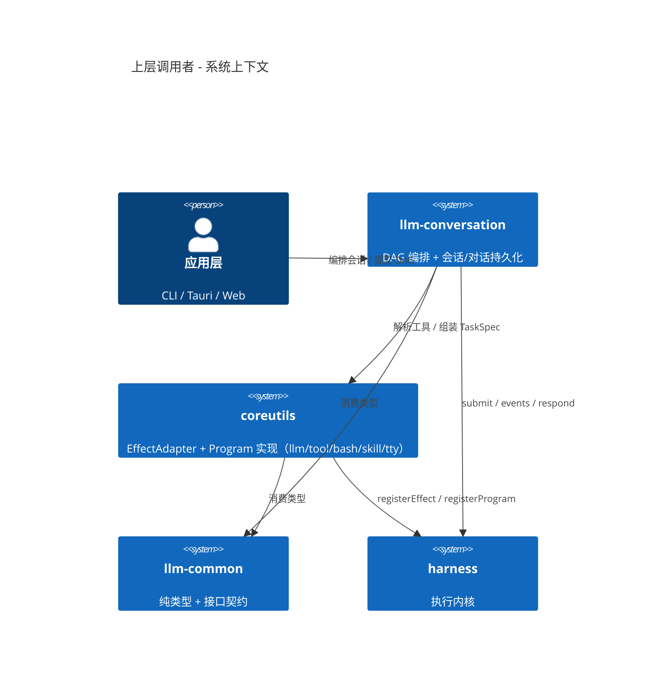
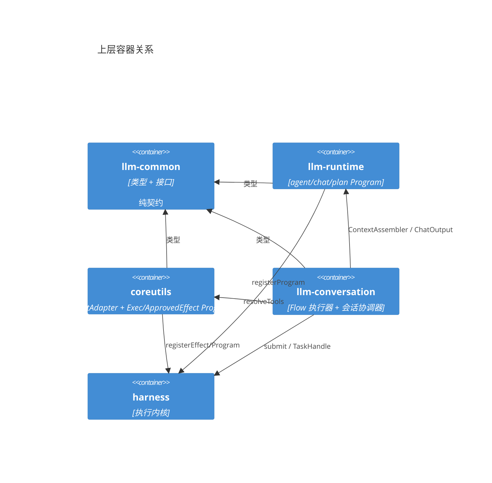
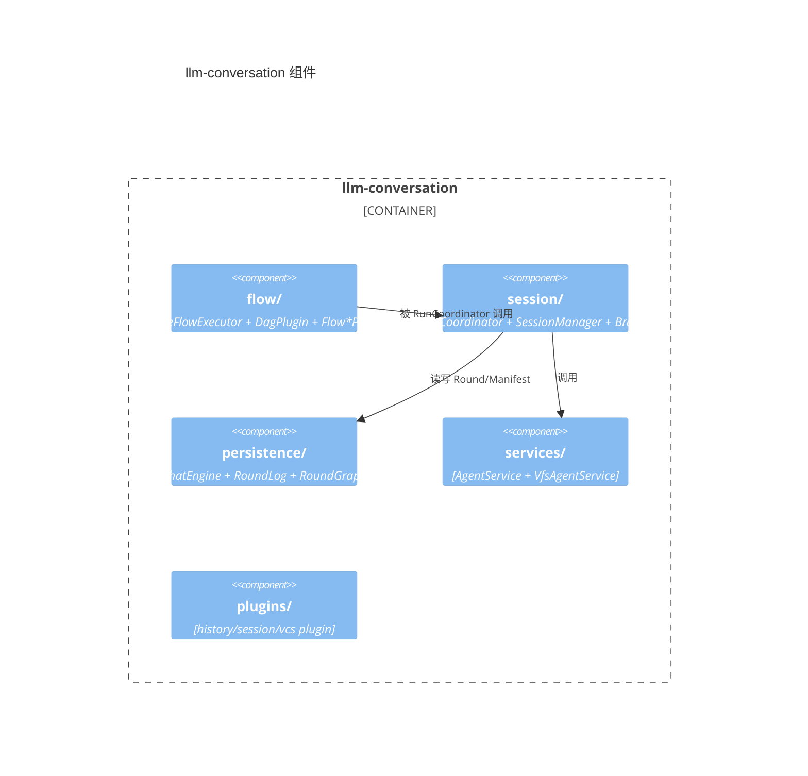
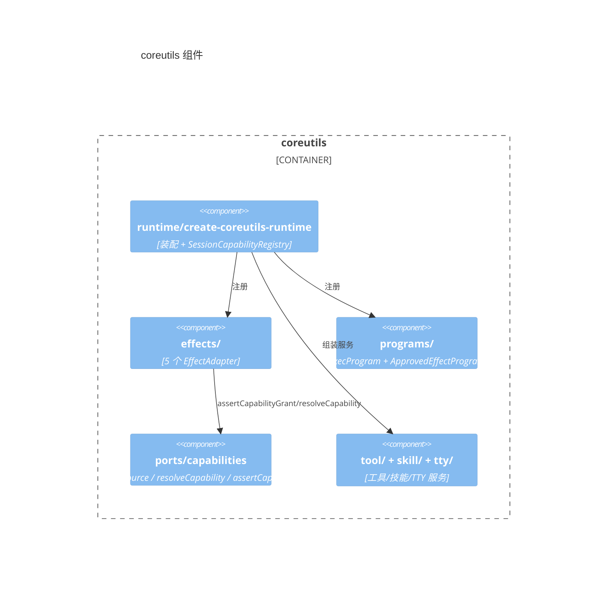
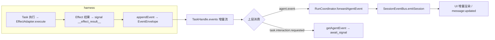
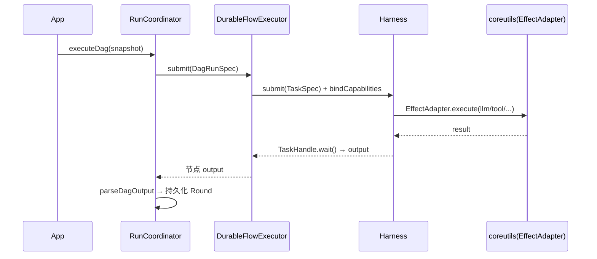

# 上层调用者审查报告（llm-common / llm-conversation / coreutils）

> 审查 harness 之上的三个调用者包：接口契约、事件流、内部流程、模块划分、代码质量，并重点回答「是否有可下沉到 harness 的重复底层元素」。

## 1. 定位与分层

三个包在整体架构中的位置（自底向上）：

```text
harness（执行内核）  ←── 被调用
  ↑
llm-common（纯类型+接口，3108 行 / 31 文件）
llm-runtime（Durable Program：agent/chat/plan，业务状态机）
coreutils（EffectAdapter + Program 实现，2244 行 / 23 文件）
llm-conversation（DAG 编排 + 会话持久化，9933 行 / 48 文件）
  ↑
apps/cli、apps/tauri-app、apps/web-app（装配与 UI）
```

| 包 | 定位 | 依赖 harness 的方式 |
|---|---|---|
| **llm-common** | 纯类型 + 接口（LLM/DAG/Tool/Skill/TTY 领域契约）| 不依赖 |
| **coreutils** | harness 的「能力实现」：`EffectAdapter`（llm/tool/bash/skill/tty）+ `DurableTaskProgram`（exec/approved-effect）| `registerEffect` / `registerProgram` |
| **llm-conversation** | DAG 编排（Flow → DAG → Task）+ 会话持久化（Round/Branch/Chat）| `submit` / `TaskHandle` / `eventStream` |

---

## 2. C4 架构图

### 2.1 Context 层



### 2.2 Container 层



### 2.3 Component 层（llm-conversation）



### 2.4 Component 层（coreutils）



---

## 3. 接口契约（关键接口）

| 接口 | 位置 | 评价 |
|---|---|---|
| `DagPlugin` / `DagPluginCatalog` | llm-common/agent/dag-plugin.ts | ✅ 插件化，运行时/UI 分离 |
| `DagRunSpec` / `DagNodeDefinition` / `GraphEffect` | 同上 | ✅ DAG 契约清晰 |
| `FlowRevision` / `SerializableExpression` | llm-common/agent/flow-definition.ts | ✅ 表达式求值（route 条件）|
| `ITTYDriver` / `ITTYSession` | llm-common/tty/tty-types.ts | ✅ 平台无关抽象 |
| `EffectAdapter<Req,Res>` | harness（被 coreutils 实现）| ✅ 三生命周期 |
| `CapabilitySource<T>` | coreutils/ports/capabilities.ts | ✅ 按 session 延迟解析 |
| `SessionCapabilityRegistry` | 同上 | ✅ session 隔离 |
| `DurableTaskProgram` | harness（被 coreutils/llm-runtime 实现）| ✅ 状态机 |

---

## 4. 事件流



**事件流评价**：harness 的 `EventEnvelope` 被上层二次转换为业务事件（`agent.event` → `message:updated` / `await_signal`）。分层清晰，但**事件转换逻辑分散**（`getAgentEvent`、`forwardAgentEvent` 在 conversation-run-coordinator.ts，`responseEvents` 在 llm-runtime）。

---

## 5. 内部流程（coreutils 装配 + llm-conversation 编排）



---

## 6. 审查结论

### 6.1 接口定义是否正确合理？

**合理。** `DagPlugin`（运行时/UI 分离）、`EffectAdapter`（三生命周期）、`CapabilitySource`（延迟解析）、`ITTYDriver`（平台抽象）都设计良好。`llm-common` 作为纯契约包，边界干净。

### 6.2 事件流是否合适？

**合适但有二次转换开销。** harness 的 `agent.event` 是通用载体，上层（`getAgentEvent`/`forwardAgentEvent`）转换为 `message:updated`/`await_signal`。转换逻辑分散，但方向正确（内核通用、上层业务化）。

### 6.3 内部流程是否清晰？

**清晰。** coreutils 装配（`create-coreutils-runtime` → registry → plugin）和 llm-conversation 编排（RunCoordinator → FlowExecutor → Harness）都是直线流程。

### 6.4 模块划分是否正确解耦、易扩展？

**解耦良好，但 llm-conversation 偏重。** `flow/`、`session/`、`persistence/`、`services/`、`plugins/` 分层清晰；但 `session/` 目录 10 个文件、`persistence/` 10 个文件，职责较多。`DurableFlowExecutor`（executor.ts）承载了过多动态图语义（route/loop/spawn/compensate/onFailure/priority/budget），是"DAG 运行时"而非单纯的编排器。

### 6.5 代码质量可否进一步精简？

**可以，重复度较高**（详见下一节）。

---

## 7. 「可下沉到 harness 的重复底层元素」（核心回答）

以下是我发现的、在三层之间重复实现的**底层执行机制**，按「是否应下沉」分级：

### 🔴 应下沉到 harness（harness 已有概念，上层重复实现）

| 重复元素 | 出现位置 | 说明 |
|---|---|---|
| **`bindCapabilities` 能力绑定** | `ConversationRunCoordinator.bindCapabilities`、`DurableFlowExecutor.bindCapabilities` | 两处**几乎逐行相同**：`createResource(llm) + createResource(tool) + signal(capabilities) + start()`。这是「LLM/tool 能力绑定」的通用模板，harness 应提供 `TaskHandle.bindCapabilities({llm, tool})` |
| **`assertCapabilityGrant` 授权断言** | coreutils/ports/capabilities.ts | 检查 `context.grants`（harness 的 `EffectExecutionContext` 概念），是 effect 执行的前置检查，应作为 `EffectExecutionContext.assertGrant(handleId, kind, right)` 下沉 |
| **`isApproved` 审批判定** | `ExecProgram`、`ApprovedEffectProgram`、`DurableAgentProgram`、`DurablePlanProgram` | **四处**判定逻辑**不一致**（`ApprovedEffectProgram` 额外支持 `yes/approved/allow` 字符串，其余三处不支持）。审批是 harness 的 interaction 语义，应提供统一 `interactionApproved(value)` |
| **`CAPABILITY_SIGNAL` 常量** | `DurableAgentProgram`、`ExecProgram` | `'capabilities'` 字面量在至少两处硬编码 |

### 🟠 应下沉到共享层（不是 harness，而是 llm-runtime / 通用工具层）

| 重复元素 | 出现位置 | 说明 |
|---|---|---|
| **节点输出提取**（`selectOutput` / `selectDependencyOutput` / `selectFinalResult` / `collectArtifactContents`）| `flow/programs.ts`、`llm-runtime/program-helpers.ts`、`run-store.ts`、`conversation-run-coordinator.ts`、`flow/executor.ts`、`commands.ts` | **六个文件**语义相同：`outputs[output].content → message.content → raw`。应统一为一个 `extractNodeOutput(value, outputName)` |
| **`directTaskSpec` / `agentTask` / CLI `compileTask`** | RunCoordinator、builtin-plugins、CLI | 三处构造 `llm.agent/llm.chat` 的 input（sessionId/roundId/messages/model/tools/externalToolIds...）。应统一为 `LLMTaskSpecBuilder`（llm-runtime 或 coreutils）|
| **环检测**（`validateAcyclic` / `validateDag` / `findCycles`）| llm-conversation/validation.ts（Kahn）、CLI config.ts（DFS）、executor.ts（DFS）| 三处重复。DAG 语义应在 llm-conversation 统一，而非散落 |
| **依赖收集状态机**（`collectDependency`/`dependenciesReady`/`dependencyWait`）| FlowValueProgram、FlowHumanProgram、FlowAggregateProgram、DurableAgentProgram | 「等待依赖 → 收集 task-exited → 判就绪」模板在多个 Program 重复，可抽象为通用 `DependencyCollector` |
| **小工具函数**（`unexpected`/`toJson`/`jsonValue`/`record`/`stringify`/`compact`）| 几乎每个 Program 文件 | 大量重复，应集中到共享 util |

### 🟢 合理分层（不应下沉）

- **环检测的「动态」语义**（route/loop/spawn/compensate）——这是 DAG 运行时语义，harness 只有 Task+dependsOn，不应承载。
- **`directTaskSpec` 的 LLM 领域字段**（temperature/thinking/reasoningEffort）——harness 不知道 LLM 领域。
- **会话/对话持久化**（Round/Branch/ChatEngine）——这是业务层。

---

## 8. 总体评价与建议

**三个包的分层是合理的**：llm-common 纯契约、coreutils 能力实现、llm-conversation 编排 + 持久化，职责边界清楚，通过 `EffectAdapter`/`DurableTaskProgram`/`DagPlugin` 三个接口与 harness 解耦。

**主要短板是「底层执行机制的重复」**：`bindCapabilities`、`assertCapabilityGrant`、`isApproved`、`selectOutput`、`directTaskSpec`、环检测、依赖收集模板——这些是「执行内核应有的通用能力」，却散落在三个包、多个文件，且部分实现**语义不一致**（如 `isApproved` 三处行为不同）。

**建议的抽象优先级**：

1. ✅ **下沉 `bindCapabilities` + `assertCapabilityGrant` + `isApproved` 到 harness**（已完成 → `bindCapabilities`/`assertEffectGrant`/`interactionApproved`）
2. ✅ **统一 `extractNodeOutput`**（已完成 → `@itookit/llm-programs`）
3. ✅ **统一 `LLMTaskSpecBuilder`**（已完成 → `buildLlmTaskInput`）
4. ✅ **统一环检测**（已完成 → `@itookit/llm-flow` 的 `findCycles`）
5. ✅ **抽 `DependencyCollector`**（已完成 → `@itookit/llm-programs` 的 `collectDependency`/`dependenciesReady`/`dependencyWait`）

> 后续落地：`llm-runtime` 已更名为 `llm-programs`；`llm-conversation` 已拆分为 `llm-session`（会话/持久化）+ `llm-flow`（DAG 编排），依赖方向 `llm-session → llm-flow → llm-programs → harness`。预算扣减（`chargeBudget`）也已补齐到 `LlmChatEffectAdapter`。

其中 1 是「下沉到 harness」的直接答案——这三项是 harness 已定义概念（resource/capability/interaction）的自然延伸，当前却由上层各自实现，正是你问的「可以进一步抽象到底层的元素」。
