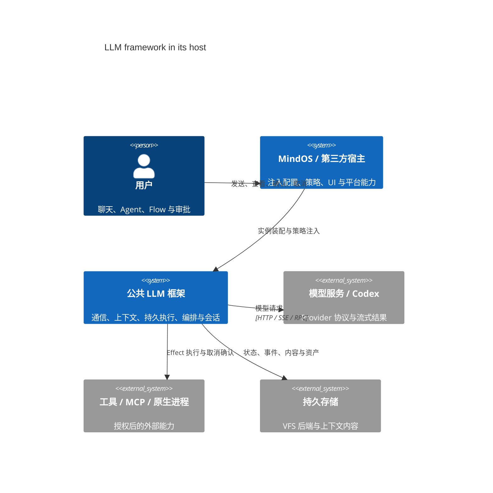
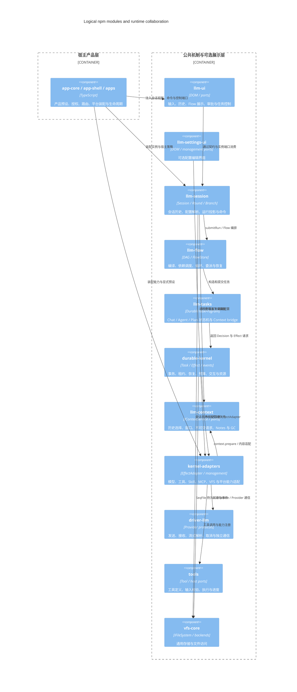
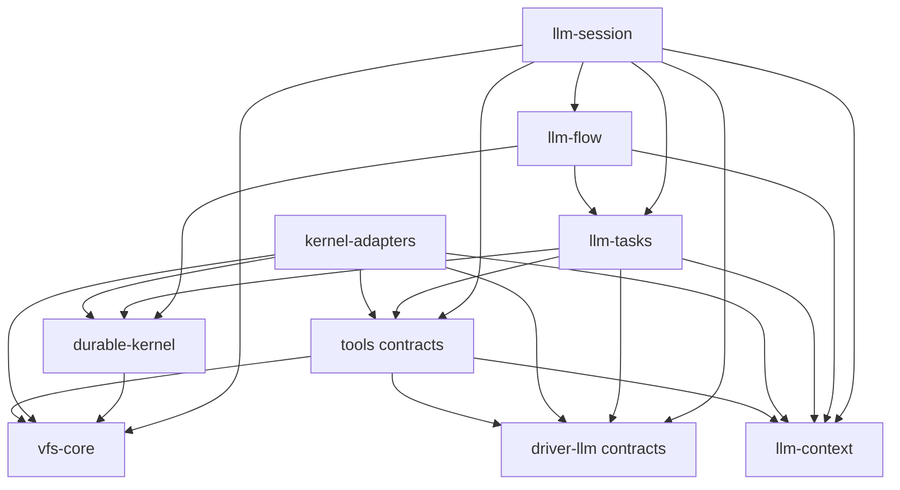
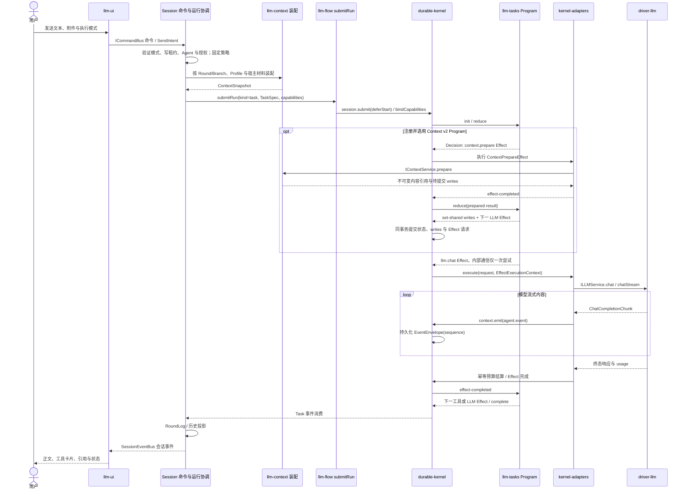
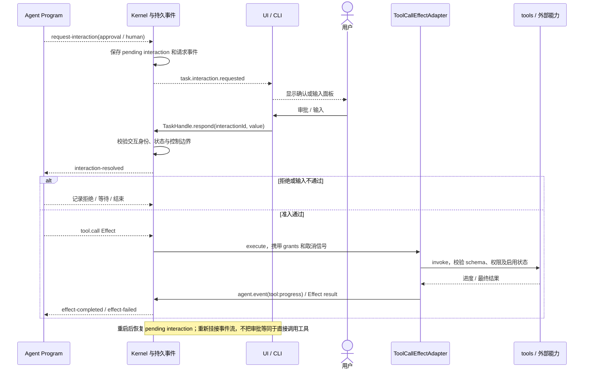
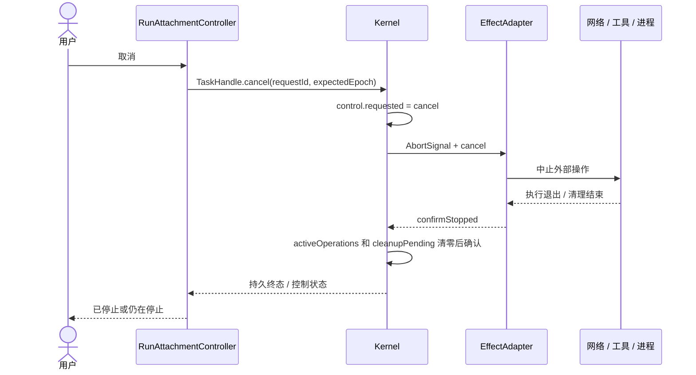

# MindOS Runtime 架构

## 单一 runtime 契约

应用级宿主（Web / Tauri / CLI `-d`）共用：

```ts
createApplicationRuntime(options): Promise<ApplicationRuntime>
```

别名：

```ts
createApplicationRuntime
```

`ApplicationRuntime` 包含：

- `vfs`
- `llmDriver`
- `agentService`
- `sessionRepository`
- `flowEngine`
- `sessionFiles`
- `directoryMounts`
- `kernel`
- `sessionManager`
- `commandBus`
- `runCatalog`
- `dispose()`

宿主不再各自装配这些服务。

## 宿主差异封装

宿主只提供差异项：

```ts
interface ApplicationRuntimeOptions {
  backend: IStorageBackend;
  additionalMounts?: Array<{ path: string; backend: IStorageBackend; options?: MountOptions }>;
  directorySourceProvider?: DirectorySourceProvider;
  configureSessionFiles?: (files) => void | Promise<void>;
  kernelPlatform?: ApplicationKernelPlatform;
  llmLogger?: ILLMLogger;
  codexTransport?: CodexAppServerTransport;
  ownerKind?: 'web' | 'tauri' | 'cli';
  onProgress?(message: string): void;
}
```

`backend` 是唯一的必填项；挂载项用内联结构（无独立 `Mount` 类型），`options` 为 vfs-core 的 `MountOptions`。

`ApplicationKernelPlatform.configure(kernel, services)` 在核心服务初始化及 Skill 同步后、Session 租约恢复扫描前调用并等待完成。第二参数 `ApplicationPlatformServices` 提供当前运行时的 `sessionFiles` 和 `directoryMounts`，供宿主绑定工作区文件/进程工厂；不能等 `createApplicationRuntime` 返回后再绑定，否则恢复中的 Effect 可能提前取用工厂。已有只接收 kernel 的回调保持兼容。

平台差异：

| 能力 | Web | Tauri | CLI |
|---|---|---|---|
| storage | IndexedDB | LocalFS + Tauri SQL | LocalFS + Node SQLite |
| process | 无 | Tauri IPC | Node/OCI |
| tty | 无 | Tauri | node-pty |
| directory source | browser | Tauri | Node |
| logger | browser | TauriLLMLogger | Node |

## headless Kernel 组合

`createKernelRuntime`（`packages/app-core/src/runtime/create-kernel-runtime.ts`）是平台无关的 Kernel 组合层，返回 `HeadlessKernelRuntime`：

```ts
interface HeadlessKernelRuntime extends KernelAdaptersRuntime {
  kernel: Kernel;
  dagPlugins: DagPluginRegistry;
}
```

它负责：

- 创建 `KernelAdaptersRuntime`（`kernel-adapters`，`runMode: 'kernel'`）；
- 装配 `Kernel`（catalog 根 `/var/lib/kernel`）并注册宿主的 `SessionStorageResolver`；
- 注册 Durable programs（`registerDurablePrograms`，默认开启）；
- 在 `beforeRecover` 钩子后执行 `kernel.recover()`（`recover: false` 可跳过）。

调用方：

| 调用方 | 文件 | 说明 |
|---|---|---|
| CLI headless | `apps/cli/src/runtime.ts` | `createCliRuntime` 先组装 VFS / TTY / 目录挂载 / 工具，再调用 `createKernelRuntime` |
| app-core 应用基础设施 | `packages/app-core/src/runtime/infrastructure.ts` | `createInfrastructure`：VFS（含 `/run` 挂载与固定用户布局预热）+ LLM kernel-adapters/llm 设备驱动注册/冻结；返回 `vfs`/`systemFS`/`llmDriver`/`logIO`/`closeCodexTransport`，宿主负责释放顺序（VFS 最后） |
| app-core 应用运行时 | `packages/app-core/src/runtime/create-application-runtime.ts` | `createApplicationRuntime` 先调用 `createInfrastructure`，再叠加会话、Flow、`RunCatalog` |

## app-shell 只负责 UI

Web/Tauri 的智能体、技能、流程、Provider/Connection 模型配置、MCP 和工具共用工具箱导航。文件视图与编辑器上下文适配由 app-shell 负责，原有存储与执行授权不变；见[工具箱导航](./design/toolbox-navigation.md)。

`app-shell` 支持注入 runtime：

```ts
await initApp({
  runtime,        // 已由宿主创建
  workspaces,
  ui,
});
```

如果 `runtime` 未提供，`app-shell` 才创建本地 runtime：

```ts
const runtime = options.runtime ?? await createApplicationRuntime({ ...options, backend: options.backend! });
```

`backend` 与 `runtime` 二者必居其一；两者都缺失时 `initApp` 直接抛错（`AppOptions.backend or AppOptions.runtime is required`）。

因此：

- Web / Tauri：宿主创建本地 runtime，再交给 app-shell 挂 UI；
- CLI `-d`：Node 创建 runtime，再通过 HTTP API 暴露；
- 浏览器 remote 模式：只挂 UI，不创建本地 runtime。

## CLI 模式

### cli-headless

```text
Node CLI
  → createCliRuntime()
  → createKernelRuntime()
  → run / prompt / rerun / resume / respond / cancel
```

`status`、`runs`、`logs`、`checkpoints`、`delete` 只读 RunStore，不装配 runtime。

### cli-web (`-d`)

```text
Node CLI
  → createApplicationRuntime()
  → HTTP API
  → 浏览器 remote UI
```

浏览器端注入：

```html
<script>window.__MINDOS_MODE__ = 'remote'; window.__MINDOS_API__ = '/api';</script>
```

注入点：`apps/cli/src/http-server.ts` 的 `REMOTE_FLAG`，由 `-d` 启动的 HTTP 服务在返回 `index.html` 时插入 `</head>` 之前。

读取点：`apps/tauri-app/src/main.ts` 的 `bootstrapRemote()` —— `__MINDOS_MODE__ === 'remote'` 时只读 `/status`、`/sessions`、`/runs` 并渲染，不调用 `createApplicationRuntime()`；`apps/web-app/src/main.ts` 没有 remote 分支，始终创建本地 runtime。

### 可选 Effect 独立作用域端口

`ApplicationKernelPlatform.scopeForEffect` 与 `fileContextForScope` 经 `createKernelRuntime` 透传给 kernel-adapters。前者以可信 `EffectExecutionContext` 为输入，由宿主查询 Task/Run 持久关系返回作用域 id；`undefined` 表示普通 Session。后者获取该 Session + scope 独立的 VFS/cwd/nativeShell/TTY 及释放函数。选择或获取失败直接拒绝，不回退默认目录。

同一 Effect 上下文的选择固定，能力按 Session + scope 缓存。`tool.call`、`process.exec`、Skill、TTY 的元数据查找和执行均使用所选作用域。`disposeScope(sessionId, scopeId)` 合并并发清理并保留关闭标记以拒绝迟到调用；Session/运行时关闭会释放所有子作用域。Skill 加载身份仍走原 Session 持久键，不新增身份存储协议。

提供 `fileContextForScope` 且未自定义 `scopeForEffect` 时，`createKernelRuntime` 默认调用 llm-flow 的 `resolveFlowTaskWorkspace`，按持久成员、重试记录、祖先链及冻结工作区租约返回 Run 根身份。Tauri 现由 TauriFlowWorkspaces 提供工作区工厂，在 configure 中绑定服务，按持久租约打开独立副本并配对文件与进程能力；真实桌面验收仍待完成。不能用 `TaskRecord.rootTaskId` 直接推断 Flow Run：Flow 节点目前通过 `session.submit` 独立创建，需核对持久成员关系及其后代；恢复与 finalization 也必须绑定同一工作区租约。

`acquireWorkspaceProcessContext(files, sessionId, source, factory, processMounts)` 将独立文件视图与原生进程挂载配对。`source` 的 `mountId` 指向现有可写授权，`fs` 和 `directory` 由宿主验证为同一隔离副本。函数核对文件与进程授权的挂载点、来源和写权限，将唯一匹配的进程挂载替换为副本，并在工厂返回后再验证授权 revision；竞态或初始化失败会清理已获取资源。释放仍先停进程再释放文件，来源文件系统由宿主拥有。该函数不能凭任意路径建立授权，生产宿主必须从已验证的 workspace lease 获取 source。

宿主注入会话的 `flowWorkspaceManager` 经 `withWorkspaceScopeCleanup` 包装：准备和恢复返回的 lease 都带 `releaseCapabilities(rootTaskId)`。屏障先以持久 Flow 成员及 Task 祖先关系等待后台成员和后代结束，再调用 `runtime.disposeScope(sessionId, rootTaskId)`，最后运行宿主原有屏障。执行器确认屏障成功后才调用 `finish`；失败时保留工作区，收尾状态报告失败。此装配不授予新的目录权限，也不代替宿主 manager 的 prepare/restore。

平台可注入 beforeSessionRecovery(sessionId)：成功取得 Session 写租约后、Kernel recoverSession 前等待它完成。Tauri 在此核对工作区创建意图；拒租会话不执行宿主核对。回调或恢复失败时停止心跳并释放已取得的租约，应用装配也关闭已创建的 Kernel，再走其余启动清理。

共享运行时记忆工具：createKernelRuntime 通过 createMemoryTools 注册 memory_list、memory_write、memory_remove。KernelAdaptersRuntimeOptions.effectTools 为需要可信 Effect 身份的宿主工具提供 metadata/definition/invoke 绑定；目录可被宿主过滤展示，普通 ToolService.invoke 的占位处理器拒绝直接调用，tool.call 在验证工具句柄后传入 Kernel context，并将调用纳入取消等待。任务记忆服务另校验持久 input 中冻结的 memoryPolicy 和 allowedToolIds；模型参数不选择 Session 或授权策略。

应用启动的 Session 恢复由 `packages/app-core/src/runtime/session-recovery.ts` 的 `recoverSessionsWithLeases` 承载：先获取可持有的 Session 租约并完成宿主核对，再调用 Kernel `recoverSessions` 一次性恢复该集合，避免逐个恢复时前一个 Session 已启动导致后一个 takeover 被拒。该批量恢复在后台执行、不阻塞宿主装配与首屏绘制；租约集合内的 Session 在恢复完成前由写入门拒写（`acquireLater` 等待并上报失败），结构写（`acquireMetadataLease`）同样等待其所属恢复，释放时先等在途恢复再释放租约。拒租项跳过并记录拥有者与到期时间；持有集合由心跳续租，恢复失败清理已取得租约，应用装配关闭 Kernel 并执行其余启动清理。服务支持恢复前回调，宿主工作区核对接线另行提供。

运行中注册或启动时拒租的 Session 经 `acquireLater` 获取租约后，先执行宿主核对，再以非 takeover 的 `recoverSession` 在线恢复，成功后才允许写入，无需重启。并发申请共享一次恢复；未过期的 Task/Effect 租约继续等待其原期限，不强制抢占其他 Session。心跳更新租约快照，续租拒绝/失败会清除本地可写标记；发送前重新验证租约，恢复失败释放新取得的租约。应用退出时停止 Kernel 后释放持有租约；此改动不替代完整在途 Effect 停写和跨主机 fencing 验收。

`SessionLeaseStore.init()` 在单个实例内共享初始化 Promise：并发调用不重复创建文件，成功后心跳复用初始化结果，失败后下次调用重试。创建路径采用 `SessionLeaseOptions.path` 的目录和文件名，默认路径保持 `/var/lib/kernel/session-leases.seq`。实例存活期间不主动检测已初始化文件被外部删除；存储根重建应重新创建 Store。

宿主通过 `createApplicationRuntime({ sessionOwnerToken })` 提供**按窗口稳定**的租约标识（桌面/Web 用 `windowSessionLeaseToken()` 存于 `sessionStorage`）：同一窗口重载后复用同一 owner，可立即接管自己上一页仍持有的租约；不同窗口/标签页各自独立，单写者语义不变。未提供时退回每次运行时随机 token。

租约接管的时钟偏差预算：`SessionLeaseOptions.skewMs` 与 `DurableFlowExecutorOptions.schedulerLeaseSkewMs` 默认 0，接受非负安全整数毫秒。不同拥有者必须等到持久到期时间加预算后才能接管；预算应覆盖部署中实际允许的时钟差，代码不自动同步时钟。显式释放的 Flow 租约立即允许接管，续租仍按原 TTL 处理。CLI 已通过 MINDOS_SESSION_LEASE_SKEW_MS / MINDOS_SCHEDULER_LEASE_SKEW_MS 转发这两项配置；其他宿主配置转发另行接线；共享存储原子性及真实多主机 fencing 仍需验收。

### 应用装配职责

`createApplicationRuntime` 通过 `runtime/infrastructure.ts` 初始化 VFS、设备和用户布局，通过 `runtime/session-recovery.ts` 批量恢复持有租约的 Session，通过 `runtime/conversation-system.ts` 装配会话上下文与工具过滤。基础设施初始化失败会释放已取得的 transport 和 VFS，并保留清理异常。app-core 抛出结构化挂载错误，由 app-shell 本地化；目录提示和启动进度使用 common 的中英文键。平台无关服务测试归属 app-core，app-shell 直接消费 app-core 公共入口。

### 隔离工作区宿主接线与清理

ApplicationKernelPlatform 的 configure(kernel, services) 在恢复前取得 sessionFiles/directoryMounts；beforeSessionRecovery 在取得 Session 租约后、恢复任务前核对宿主创建意图。flowWorkspaceManager 经会话层传入 Flow 执行器，Web 未提供此端口时拒绝非共享工作区。

createKernelRuntime 的 fileContextForScope 提供 Session + Run 能力；默认 scopeForEffect 用 resolveFlowTaskWorkspace 核对持久成员、后代与 workspace lease，失败不回退共享目录。withWorkspaceScopeCleanup 包装 prepare/restore，等待持久成员、重试及后代的 activeOperations 清零，再 disposeScope，最后调用宿主屏障；成功后才能清理工作区。CLI 的 Session 目录已指向副本，Run 能力复用其授权映射；Tauri 通过 acquireWorkspaceProcessContext 将原授权替换成同一副本的文件与进程视图。

释放失败保留失败步骤，并拒绝关闭中能力的重新获取；重试不重复成功的目录句柄释放。Session 进程停止失败时不得先释放文件视图。


## 2026-09-14：跨宿主批量路径类型检查

VFS 的路径前缀检查使用不读取 sidecar 元数据的 getNodeType/statType，嵌套视图也保持该路径；同批前缀通过 Node statMany 或 Tauri fs_stat_many 读取，保留逐路径权限检查。`noLinks` 把已经检查的目标类型返回给 `statType`，避免嵌套视图再次查询目标并按层数指数放大。宿主响应条数不匹配时拒绝所有等待者，单个链接不影响同批合法路径。

Node lstat 与 Rust symlink_metadata 保留符号链接/普通文件类型，Tauri 映射不丢字段，DirectoryDriver 不再把权限错误吞成空节点。真实文件系统回归复现了原先链接指向挂载根外文件并被读取的问题；修复后该视图读取被拒绝。此检查不构成抵御恶意并发替换路径的原子防护，也不替代原生进程沙箱。

读取与 rename journal 恢复仍处于同一事务；不使用实例内「日志曾经干净」作为跨进程跳过恢复的依据。真实两个进程覆盖读者先打开、写者在文件 rename 后 SIGKILL、原读者恢复目标记录的 root/module 两条路径。新增 sidecarStats 统计逻辑方法调用（含事务回调），不把该数字等同于真实 IPC 数。

可枚举读取通过 sidecar 原子批量接口减少事务内往返：完整目录列表每 64 项查询一次 `getMetaExtMany`，SeqFile 的精确字段集合查询一次 `getRecordFields`，跨文件的同类扫描（如列出全部 Task 记录）查询一次 `getRecordFieldsMany`，路径映射与 `FileSystemView` 都保留该能力；Task event 分页的索引和事件正文各批量读取一次。恢复探针仍在同一外层事务中执行，没有引入跨事务缓存。

本批完成批量类型检查、链接拒绝和跨进程恢复这条链；P0-02 的桌面 ≤2 秒 / ≤100 次 IPC 仍开放，需继续对正确实现减少宿主往返并重测。

隔离快照验证：VFS 175、LocalFS 69、Kernel 239、app-core 92、Tauri stat 映射 2、Rust 34 项通过，共 611 项；VFS/LocalFS/Tauri 类型检查、Tauri 前端构建与文档检查通过。未替代真实窗口及恶意路径替换竞态验收。


## 2026-09-14：跨宿主并发保存与编辑器失败重试

Node 使用 UUID + wx 独占创建临时文件，Rust 以 create_new 创建候选文件并跳过已占用名称；并发写入不共享临时文件，不覆盖其他写者的临时内容。写完后 rename 发布，失败清理本次临时文件，原目标保持。两端测试覆盖并发完整值与发布失败后的原内容/目录保留。

SaveManager 修复同步抛错后把已完成 Promise 留作正在保存、导致后续重试失效的问题；没有保存回调时最终保存直接返回并保留 dirty。真实 Node 文件写入接入 SaveManager 的回归覆盖：发布失败 → 原文件保留且 dirty → 编辑新内容 → 重试成功且 dirty 清除。

隔离快照：LocalFS 74、MDX 11、Rust 36 项测试通过，共 121 项；LocalFS/MDX/Tauri 类型检查、Tauri 前端构建与文档检查通过。P0-02 真实窗口保存失败/重试、其他平台行为与最终全仓验收仍开放；原子 rename 不代表断电 fsync 持久性。


## 2026-09-14：调度扫描复用与空闲读取边界

Kernel 在恢复 sweep 后复用一次任务扫描供任务遍历、Effect 候选与唤醒计算使用；sweep/lease/CAS 保持自身最新读取。读取前建立快照占位，通知、重排、停止使其失效，读取结束仅在占位仍有效时发布，下一次唤醒消费一次后清除；其他 Session 的通知不清除当前 Session 快照，dispose 清理所有快照。

两项受控交错回归复现读取期间/读取后通知造成旧空列表忽略新 timer，修复后通过。七项快照测试覆盖上述边界；DOM 工作台在 MemoryBackend 和真实 LocalFS/SQLite 上静置一秒，VFS 与 sidecar 逻辑调用增量均为零。工作台测试的 Kernel facade 是桩，不代表完整运行时或桌面 IPC。

隔离验证：Kernel 246、Flow 213、app-shell 184 项通过，共 643 项，另有 30 项既有跳过；Kernel/CLI/Web 类型检查与文档检查通过。P0-02 桌面发送 ≤2 秒 / ≤100 次 IPC、真实窗口与跨进程通知矩阵继续保持开放。


## 2026-09-14：桌面诊断计量与动作边界

trace 构建在官方 Tauri core invoke 的统一入口计数，覆盖直接导入、event 相对导入、Resource.close、权限查询/申请、插件监听注册/移除及注册失败后的兼容重试；每次提交计数一次，不改写被冻结的宿主对象。入口形状变化会明确阻止构建，避免悄悄漏计。诊断文件追加显式绕过计数。

仅 VITE_MINDOS_TRACE=1 时注册 window.__MINDOS_TRACE__。验收驱动在选定起点调用 begin('send-to-provider') 保存返回 id，在对应终点调用 end(id) 获取同步快照并追加日志。时间使用 performance.now；VFS/sidecar/IPC 分别记差值，不读取命令参数。开始前与结束后的操作不计入动作，重叠动作独立计算，计数重置则拒绝结果；运行时释放时清理活动动作和全局接口。

日志 kind='action' 是指定动作的区间，kind='interval' 是周期区间，二者重叠，禁止相加当作总量。调用方必须把边界接到实际发送与 Provider 接收点；接口本身不证明边界已经正确放置。经过官方 core 的提交数也不等于全部 WebView 内部传输或底层重试。

隔离 app-shell 188 项通过，另有 30 项既有跳过；真实 Vite 配置编译/执行官方模块的 trace 开关回归通过，覆盖失败 fallback 与诊断旁路；Tauri 类型检查、开关两种完整前端构建及文档检查通过。P0-02 的真实窗口动作计量、通道取数/传输覆盖和 ≤2 秒 / ≤100 次目标保持开放。


## 2026-09-14：数据库初始化失败与定向释放

Tauri sidecar 由宿主命令按页面 scope 租用 SQLite pool；初始化的 schema 读取、建表或版本检查失败统一释放本次租约，失败与清理错误同时发生时保留 AggregateError 及原始 cause。事务内句柄不能关闭数据库 pool。页面刷新撤销旧租约但保留健康 pool 供新页面复用，旧 scope 的迟到 close 不生效；正常关闭最后一个租约时才移除并关闭 pool。CLI HTTP 宿主实现同一命令与代次语义。

LocalFS 不再把探针不可用、未知/空结果、普通探针关闭错误当成损坏。只在明确完整性诊断或 SQLITE_CORRUPT/SQLITE_NOTADB 时沿用重建流程，否则保留数据库文件并抛出原初始化错误。三个误删窗口修复前均实际导致测试文件被删，修复后保留；另补空结果边界，既有真实损坏数据库重建回归仍通过。

隔离 LocalFS 78、app-shell 193 项测试通过，共 271 项，另有 30 项既有跳过；LocalFS/Tauri 类型检查、Tauri 前端构建与文档检查通过。P0-02 真实窗口 Session 关闭/删除与故障恢复、完整持久性验收仍开放。


## 2026-09-14：挂载权限与旧句柄撤销

Session 配置变更、禁用和服务释放会先同时关闭普通视图与工作区视图的入口，再等待已接受操作结束。此前顺序等待工作区读操作时，普通旧句柄仍能写入；IndexedDB/真实视图的受控在途读取回归已复现并验证修复。撤销失败会保留错误，不发布可用的新权限记录；这不是外部进程强制停止或跨主机 fencing 验收。

目录授权回归覆盖两 Session 同名挂载来源隔离、只读 write/append/create/rename/move/delete/metadata/tag/SeqFile setEntry 拒绝，以及源文件和记录不变。多挂载视图的 SeqFile transaction 返回 ECAPABILITY 且回调未执行，不能称为事务内 EROFS 检查。只读来源申请 rw 在配置阶段被拒绝且不留记录，改为 ro 可正常读取。

隔离 app-core 101、app-shell 193 项通过，共 294 项，另有 30 项既有跳过；app-core/Web/Tauri 类型检查与文档检查通过。P2-04 的真实窗口旧句柄路径、P0-02 设备不确认停止时的有界失败、跨进程/平台矩阵仍开放。

## Context 装配

`createKernelRuntime` 在 app-core 注入 Task 作用域 `ContextServiceResolver`，kernel-adapters 注册 `context.prepare@1`、`llm.chat@2`、`tool.call@2`，llm-tasks 注册 v2 Program bridge。存储适配器只用 Kernel 公共 Session/shared 与 VFS 端口；内核自身不引入 Context 依赖。新请求消费不可变快照，v1 程序继续可恢复。见 [Context API](context-api.md)。

默认 Context GC 由 [context-gc.ts](../packages/app-core/src/runtime/context-gc.ts) 装配：授权恢复/首次 Context 执行时登记 Session，延迟启动定时扫描，分页处理已静止的 Task。完整应用通过 Session 租约检查限制回收范围；覆写 `contextService` 或 `contextGc: false` 时不启动默认维护器。运行时和 Session 释放先停止维护入口并等待事务。标记和保留策略属于 Context，VFS SeqFile 事务属于适配器；详细边界见 [自动 GC](design/context-gc.md)。

### 会话工作目录默认值


## 系统沙箱接入边界

`@itookit/sanbox` 提供 Seatbelt / Bubblewrap 启动计划与 Node 探测。应在宿主的 `createSessionProcesses` / `fileContextForScope` 所创建的 `nativeShell`、`ttyDriver` 中应用，再由 kernel-adapters 按作用域供给 Effect；Kernel/Flow/UI 不持有系统沙箱实现。Tauri 的 `session_shell_exec` 已调用包内 `itookit-sanbox` Rust crate，Linux Bubblewrap / macOS Seatbelt 均默认禁网，沿用宿主输出与取消管理。CLI OCI/native 路径保持原配置；具体职责和路径映射限制见 [系统沙箱设计](design/system-sandbox.md)。

## 宿主启动诊断与桌面事务生命周期

Tauri 的文件系统打开、runtime 和 UI 初始化阶段写入持久 JSONL，失败展开 `AggregateError.errors` / `Error.cause` 并保留 source 名称与数据库路径。CLI 在入口安装进程诊断，记录命令/runtime/HTTP 失败和退出状态，日志不进入机器读取的 stdout。

Tauri 每个页面先调用 `sidecar_open_scope`，Rust 以 WebView label 维护页面代次，回滚上一代未完成事务后才允许租用数据库。事务索引锁只用于查找句柄，SQL await 只持有该事务自己的锁；事务执行和结束均校验窗口、代次、数据库，裸事务 ID 不能跨窗口使用。`sidecar_begin` 在等待 SQLite 写锁前后均校验代次与租约。关闭最后一份页面租约前先回滚其遗留事务，同库打开与关闭共用一把锁；被替换 pool 在锁外关闭且关闭等待有上限。完整且版本兼容的数据库只校验 schema 并设置连接 PRAGMA，跳过重复 DDL；缺少对象仍走初始化，版本不兼容仍明确拒绝。LocalFS 在 journal 初始化失败后关闭已打开 sidecar，保留原错误和关闭失败原因。

日志路径、排查流程与回归证据见 [启动故障与运行日志](design/startup-diagnostics.md)。

目录预热的 `ensureDirectoryPath` 使用后端 `statType`（缺失时回退完整 stat），逐路径前缀验证类型而不读取无关元数据。LLM 默认提示词在一次 SeqFile 事务中检查/补齐，已有用户值保持不变。暖启动 I/O 计数及 Linux 实际分段耗时见上述诊断文档。

### 项目与统一工作台

`ApplicationRuntime.projects` 提供 `ProjectService`：项目的稳定 ID、目录来源保存在 `SessionFolder.project`，导航路径用于组织项目与会话，项目重命名或分组移动不会移动实际文件。Web 首次启动创建“个人项目”，文件存放在 `/home/admin/projects/<projectId>`；Tauri 将解析后的 `homeDir` 注册为当前项目，并用同一目录创建新会话的 `/workspace`，来源遵循 `--home → mindos.json#homeDir → INIT_CWD → cwd`。

新建会话先根据目标分组查找项目，再配置项目目录挂载。`Read`、`Write`、`Edit`、`Glob`、`Grep` 在 Web 使用 VFS；没有原生进程能力时不启用 `Bash`。现有会话的授权不会被重开覆盖；拿到 Session 写租约后，可将目录已匹配的旧会话归入项目，保留原授权。

`ProjectService.personal()` 独立于当前项目解析个人项目，以 `/etc/personal-project.json` 保存稳定项目 ID。旧 profile 首次使用时仅接纳已知中英文默认名称的托管个人项目，否则新建；改名、分组移动和重启后仍按 ID 找回。标题栏 AI 引用产生新的会话输入草稿：项目文件归其项目，Session 文件沿用 Session 所属项目，其余归个人项目。草稿先写入 `uiState.branchDrafts.main.inputText`，再导航到聊天，不触发模型请求。

Web 与 Tauri 共用工作台导航、创建对话框和小屏幕列表／内容切换。项目可放入多级分组，各项目内有“会话”与“文件”；会话可继续用目录组织。旧 `projects` 路由指向工作台，桌面原有目录书签恢复到项目树。删除项目导航及会话不会递归删除其真实文件目录。

## 公共通信与宿主适配

`driver-llm` 发布产物不依赖内部包；消息声明从 llm-context 内联，通信类型和纯协议函数通过 `/contracts` 提供。`kernel-adapters/llm` 保留 LLMDeviceDriver、LLM_IOCTL、VFS 配置和 MCP/Skill 管理，宿主从 /llm/core 与 /llm/presets 显式接入，设置页使用 /llm/config。旧 device-llm 已拆分；执行、编排、会话契约已按能力归属整理。

Tool/TTY 执行契约归 tools/contracts，模型通信与流式事件归 driver-llm/contracts；Agent、连接管理、恢复和定价归 kernel-adapters/contracts，入口只包含契约与纯策略，不初始化适配器。适配层不依赖 Tasks、Flow 或 Session。Prompt 库 DTO 归 tools/contracts，任务配置保留类型转发。

执行事件与节点配置归 llm-tasks/contracts；Flow/DAG、委派、模板与 Hook 归 llm-flow/contracts；会话、命令/扩展归 llm-session/contracts。各消费者从所属能力模块导入。原 llm-common 与 common/llm-compat.ts 已删除，common 不再导出 LLM 类型或函数，也不依赖任何能力包。通用哈希工具在 common 独立实现，保持与 Context 的持久指纹兼容。

Session 实现不依赖 common。`ConversationSystemOptions.hostPorts` 注入实例级翻译、日志与启动追踪；工厂创建独立 SessionManager 和提示词历史，返回幂等异步 dispose。app-core 与 UI 传递返回的实例，关闭不修改其他运行时。独立调用默认英文提示、空日志与直接启动操作。通用 UI 使用 `EditorOptions<TSubmission>` 与 `SessionDraftControls<TSubmission>` 传递宿主提交数据，无 Flow 或 Session 依赖；LLM 编辑器适配层指定 SessionSubmission。

Session 的发布构建内联 kernel-adapters/contracts 的纯配置函数和类型声明；适配器包只作为开发依赖，不新增发布运行时依赖。


公共机制与产品策略：作文评审的提示词、评分阈值和默认流程位于 `packages/app-core/src/presets/essay-review.json`，播种位于 `packages/app-core/src/presets/default-flows.ts`。Session 不再持有或导出这些内容。`agentResolution.missingAgent` 可由宿主拒绝或提供回退；精确身份解析和授权约束保持严格。

Context 的 `ContextEngineOptions` 注入默认窗口、输入预算和完整请求计量；服务与宿主摘要请求共同使用该计量。默认采用 UTF-8 字节估算；`IContextEngine` 可替换窗口选择和预算计量。应用通过 `contextEngineOptions` 接入。

LLM UI 分为 `/chat` 与 `/settings` 子入口；设置包是可选 peer，聊天不加载设置实现。会话实例经 `SessionViewPort` 注入，模型配置经公共接口注入，默认工具展示由宿主列表驱动。当前仍消费 Session/Flow 契约及仓储；Kernel 仍以 VFS 存储为公共依赖，这些边界未宣称已消除。

本轮验证：全仓类型检查、库/Web 构建、Driver tarball 独立 ESM/CJS 消费及无依赖安装通过；app-core 231 项、CLI 185 项通过，Context/Session/UI 包回归通过。app-shell 全量中 471 项通过，4 项原生恢复用例在正常权限下重跑通过；其余 4 项失败在提交前基线 `70f9947c` 的独立源码快照复现（提示词复制清理、外部草稿刷新两项、已删除 saveCurrent 的旧用例），不将其记为通过。

模型管理由 app-core 显式组合 `kernel-adapters/llm/core` 与可选 `kernel-adapters/llm/presets`。机制默认空目录，Provider/连接/Agent/定价通过实例预设快照注入，自动连接由宿主策略决定。聊天 `/chat` 只消费 Session/Flow 契约与实例端口；缺少正式会话视图时拒绝创建，已删除 UI 单例回退和 /legacy 入口。

本轮边界补全验收：全仓 typecheck、架构守卫与 docs:check 通过；Kernel adapters 199、Session 208、LLM UI 64、app-core 231 项测试通过。Session/UI/Flow/Adapters 与 Web 构建通过，构建后的 `/llm/core` 导入图不含产品目录，`/chat` 导入图不含 Session 单例或设置实现。宿主定向回归 25 项中 23 项通过，2 项仍为此前确认的外部草稿刷新问题；这不代表完整 app-shell 矩阵通过。

业务 Flow 模板由 app-core 的 `createMindosFlowLibrary` 提供。llm-ui 的安装/恢复 API 必须接收显式模板数组，命令调用会复制输入以保护宿主目录；菜单仅在提供非空 `library` 时暴露恢复入口。Web/Tauri 在 UI 装配时注入 MindOS 目录，其他宿主可注入自己的 FlowDraft。原 UI 导出的 builtinFlowLibrary 已移除，迁移时需向 installFlowLibrary/restoreFlowLibrary 显式传目录。

MindOS 默认工具授权已从 kernel-adapters/contracts 与 llm-session/contracts 移到 app-core 宿主预设。AgentConfigEditor 和 createAgentEditorFactory 接收 defaultToolIds，实例保存独立副本。app-shell 使用同一宿主列表装配聊天与设置界面；Web/Tauri 透传该参数。通用设置 UI 默认目录为空，继承与显式空授权语义保持不同。

DirectAgentPolicy 从 ApplicationRuntimeOptions 经 ConversationSystemOptions、SessionManager、SessionRunCoordinator 传到 ConversationRunCoordinator，实例内冻结。显式 Agent 附加提示参与 Context 装配和预算计算，maxExchanges 固定到持久 Task；普通 Chat/Flow 不消费该提示。MindOS 默认指令留在 app-core JSON 预设，SessionViewPort 可暴露只读策略供 UI 显示实际上限。

设置 UI 的配置解析/导出已改为 kernel-adapters/llm/config，Tauri 桥通过 /llm/mcp-host 创建本地 transport 工厂，经 ApplicationRuntimeOptions.mcp 注入驱动；设置 UI 通过服务 supportsMCPStdio() 查询同一实例能力。机制核心不读取全局桥，旧 /llm 构造器仅取兼容注册快照。composeLlmPresets 纯合并模型目录并显式选择冲突策略，不写 VFS、不修改全局预设，驱动只消费注入的快照；旧全局 registerLLMConfig 仅作为兼容路径。

执行策略收尾：DirectAgentPolicy.llmRetry/toolTimeoutMs 冻结到显式 Agent Task；Flow 从节点或 Flow defaults 接入相同参数。Tasks 取消重试次数的固定 3 次上限，工具超时可覆盖且跨持久恢复保持一致。MCP 日志和客户端身份由实例选项注入，机制默认空日志及 mcp-client 身份，app-core 提供 MindOS 身份与日志。driver-llm 的连接测试要求调用方模型或注入目录；Codex 缺省不覆盖宿主模型。

宿主入口收尾：CLI 显式注入 MindOS 预设与自动连接策略；app-core 的模型导航从实例管理接口读取 Provider 默认值，app-shell 的模板仅加载可选预设。生产宿主禁止使用 /llm 兼容聚合。llm-ui 根入口现在等同 /chat，不加载设置或 Session 单例；已移除旧聚合 API，设置工厂在 /settings。

UI 发布收尾：driver-llm、tools、kernel-adapters、llm-tasks 改为开发契约依赖，JS 常量与声明内联，直接运行依赖从 12 个降到 8 个；Session/Flow 等传递依赖仍存在。Kernel 公开类保持外部类型身份。UI 默认根入口、/chat、/startup 不加载设置或 Session 单例；Session 单例 API 与 UI /legacy 入口已删除。ui-common 与 durable-kernel 的 publishConfig.exports 已补齐实际产物路径。

## LLM 模块 C4 与代码审查（2026-10-03）

本节以当前工作树为准。Session 单例及 UI `/legacy` 删除与首轮审查已提交为 `34afb19d`；下文同时记录审查后的实施结果。审查关注源代码依赖、实际装配、公开接口、事件流和清理候选；不把此前测试通过等同于所有架构目标均已完成。C4 Component 中的组件代表逻辑 npm 模块，不代表独立部署进程。

### C4 系统边界



### C4 模块与运行时协作



上图的 Kernel → Adapters 是运行时调用：Kernel 调用宿主注册的 EffectAdapter，并不 import kernel-adapters。静态依赖方向是 Adapters → Kernel。这是依赖倒置，不能把调用箭头误判为包循环。

### 模块职责和接口所有权

| 模块 | 功能与公开边界 | 应由宿主决定的策略 |
|---|---|---|
| driver-llm | LLMDriver、Provider、ChatCompletionParams/Response/Chunk、ILLMService；发布零运行依赖 | 网络、日志、连接和模型、重试决策 |
| llm-context | IContextService.prepare/request、IContextEngine、内容/记录/GC 端口；零运行依赖 | 预算、摘要、检索、计量及保留策略 |
| durable-kernel | DurableTaskProgram.init/reduce → Decision；EffectAdapter.execute/cancel/reconcile；SessionHandle/TaskHandle/EventEnvelope | 注册哪些 Program/Effect、并发、重试与资源配置 |
| llm-tasks | Chat/Agent/Plan Program、buildLlmTaskInput、执行事件契约、ContextTaskProgram | 已解析提示、工具授权、maxExchanges、llmRetry、toolTimeoutMs |
| llm-flow | submitRun、CompiledRunDefinition、RunExecution、DurableFlowExecutor、FlowStore、插件契约 | 图定义、节点配置、路由条件、预算、隔离工作区 |
| llm-session | initializeConversationSystem、SessionManager、SessionRepository、Round/Branch、ICommandBus | Agent 解析、默认授权、DirectAgentPolicy、写租约、宿主日志/翻译 |
| kernel-adapters | Effect 与平台适配；模型配置、MCP、Skill 和费用管理；显式 core/config/presets 入口 | 模型目录、自动连接、MCP 传输、外部能力、平台策略 |
| tools | Tool、ToolInvokeRequest、ToolInvokeResult、ToolVFSContext、INativeShell | 授权、工作目录、进程、外部服务与工具启用范围 |
| llm-ui | SessionViewPort、PromptHistoryPort、TaskControlPlane、ICommandBus、会话仓储端口 | 导航、默认工具、宿主创建协议、国际化及产品动作 |
| llm-settings-ui | 管理服务接口、配置编码及可选设置入口 | 实例能力与可编辑配置范围 |
| app-core/app-shell/apps | createApplicationRuntime/createKernelRuntime 与 UI 装配 | MindOS 预设、产品提示词、菜单、路由、环境与生命周期 |

Session、Flow 和 Tasks 分别拥有历史语义、图语义和单任务状态机，不能因为都处理 LLM 就合并。driver-llm 和 llm-context 可分别使用；Kernel 可以执行非 LLM Program。kernel-adapters 当前同时覆盖执行适配和模型管理，应先按子入口及内部组件治理，暂不增加新的 npm 包。

### 静态依赖与发布依赖



箭头表示源代码/包声明依赖，不等于全部都是 JavaScript 运行时导入。Session 对 kernel-adapters/contracts 的开发引用在发布时内联；UI 对 driver-llm、tools、kernel-adapters、llm-tasks 的开发契约引用也内联。UI 当前直接运行依赖为 common、ui-common、vfs-core、durable-kernel、llm-session、llm-flow、js-yaml、marked，共 8 个；这不代表传递依赖只有 8 个。

选定模块的源码 import/export 扫描未发现跨包循环。kernel-adapters 对自身公共子入口的引用不属于跨包循环；此扫描也不能证明所有文件级循环、动态加载或发布产物均不存在循环。

### 事件流：直接 Chat / Agent 与 Context v2



普通直接 Chat 使用 kind=task，不需要单节点 DAG。Flow 路径先编译图并调用 kind=graph，由 DurableFlowExecutor 管理多个任务和动态成员；任务状态机、Effect 和事件机制仍复用同一 Kernel。Context v2 的内容发布与 head 提交是不同阶段，不能由上下文服务提前修改共享 head。

### 事件流：工具审批与恢复



### 事件流：取消和确认停止



事件协议分三层：Kernel EventEnvelope 是持久事实；agent.event 是其中的业务 payload；SessionEventBus 是会话投影通知。UI 的 Session 历史与直接任务挂接分别消费不同视图，不能让两条链重复推进同一正文。轮询/订阅通知只是唤醒方式，正确性依赖持久记录和 sequence，而非通知恰好到达。

### 策略与机制审查

| 边界 | 当前判定 | 代码证据与后续动作 |
|---|---|---|
| 核心通信、Context、Kernel | 基本成立 | driver/context 无运行依赖；Kernel 不 import 产品层；I/O、Program 和 Effect 可替换 |
| 提示词、授权、超时、重试、目录 | 主执行链已分离 | DirectAgentPolicy、buildLlmTaskInput、显式 presets 与 MCP 选项注入，并持久化任务策略 |
| 重试所有权 | 正确，保持回归 | program-helpers 的 LLM 请求明确 `_maxAttempts: 1`，Effect 使用 retries+1；避免 Driver 与 Kernel 重试乘积 |
| Session 单例 | 已清理 | 当前工作树删除 Session/PromptHistory 单例与 UI legacy；调用者持有实例和 dispose |
| UI 宿主创建协议 | 已改为显式参数 | 导航、WorkspaceCreation、EditorOptions 传递 initialInputState；删除 app_create_params 读写及固定 isNewSession 分支 |
| Effect 日志与翻译 | 已改为实例注入 | KernelAdapterDiagnostics 提供日志和不可用提示；宿主注入翻译，适配器默认静默；kernel-adapters 不再依赖 common |
| Provider 扩展注册 | 已改为实例端口 | createProviderRegistry 创建独立注册表，snapshot 固定 Driver 的工厂；LLMProviderInstance 为结构接口，无需继承 BaseProvider |
| MCP 兼容宿主 | 已删除 | 删除 legacy-device-driver、全局注册及 /llm 聚合；使用 core/config/presets/contracts 与实例传输工厂 |
| 厂商默认行为 | 已显式化 | DeepSeek thinking 默认移至可选 MindOS presets；独立 Driver 通过 responses 选项配置；wire 日志使用实例 sink |
| UI 完全通用化 | 尚未完成 | 仍依赖通用包翻译/图标和具体仓储能力；作为框架 UI 合理，但不等于任意系统都能只传一个流使用 |

因此“主链解耦已完成”应限定为模块依赖方向、主要策略注入和本轮确认的共享状态已处理；UI 通用化、外部解码与复杂执行函数治理仍未全部完成。无需为可替换性无限增加接口或包；只抽取确实存在多宿主差异的端口。

### 代码质量：量化与结构风险

审查基线使用 TypeScript AST 扫描选定 10 个 LLM/执行/工具模块的 src，排除 `.test.ts`，函数长度包括注释、模板字符串和嵌套回调。实施前发现 367 个带函数体节点超过 30 行；这只是定位线索，不是圈复杂度或缺陷数。本轮没有测量圈复杂度，也没有用 LOC 推断性能问题。

| 热点 | 审查基线 → 实施后 | 结构与剩余工作 |
|---|---:|---|
| llm-flow/src/flow/executor.ts 的 execute | 约 770 → 376 行 | 已提取就绪判定、图修改、委派管理、节点输入准备和任务请求构造，显式持有单次运行状态与宿主绑定端口；本轮继续集中恢复集合、重试消费、工作区生命周期和根聚合；主调度与装配仍需治理 |
| llm-ui/src/components/input/plugins/SlashCommandPlugin.ts 的 buildDefaultCommands | 约 439 → 3 行 | 命令描述移至 slash-command-catalog，参数解析移至 slash-tool-args；弹窗仅消费描述目录 |
| llm-ui/src/shell/SlashCommandRouter.ts 的 buildSlashCallbacks | 约 366 → 12 行 | 按会话、模型、工具、导航领域组织处理器；创建状态通过宿主导航参数传递 |
| kernel-adapters/src/llm-management/device/llm-device-driver.ts 的 ioctl | 约 205 → 11 行 | 管理命令使用类型化分派表；MCP、Skill、Chat 单独处理；输入 payload 校验仍可加强 |
| llm-session/src/session/conversation-run-coordinator.ts | 文件约 818 行 | 准入、任务构造、Context 装配、历史投影与恢复分别测试 |
| llm-ui/src/shell/LLMWorkspaceEditor.ts | 文件约 1245 行 | 视图装配、会话绑定、任务挂接、保存生命周期；避免编辑器持有全部业务分支 |

Provider wire 层与管理适配层存在 any 和双重断言，但数量不能证明错误。优先在外部 JSON、VFS ioctl 和持久化解码边界使用 unknown + 校验；已经校验后的稳定内部类型再逐步收紧。不要只替换关键字或为了函数≤30行而拆成没有语义的跳转。

API 仍有改进空间：UI 工厂参数中的 sessionManager 与 resolveSessionView 均可省略，正式会话编辑器到运行时才报错；可用区分 Draft/Session 的依赖类型提前约束。UI 内部已有 TaskControlPlane，可以逐步用它替换暴露到 UI 工厂的具体 Kernel 类，但先确认所有消费所需方法；不应通过内联 Kernel 的私有字段类型破坏类身份。

### 冗余清理与实施结果

| 审查项 | 本轮结果 |
|---|---|
| Tasks 的 Context 薄转发与根导出 | 已删除；消费者直接引用 llm-context，装配和消息编码测试迁至权威模块 |
| legacy-device-driver、MCP 全局注册与 /llm 聚合 | 已删除；包括 MCP 工具内的聚合导入，宿主与测试改用明确子入口 |
| LLMFactoryOptions、固定 isNewSession、重复 runMode 联合 | 已清理；保留真正的新建会话流程 |
| 附件转换 | 删除无消费者的 prepareLlmChatEffectRequest；ServiceAdapter 原样转发，Driver 在通信入口按协议编码，保留 Codex 本地图片路径 |
| Context 旧装配与 v2 服务 | 保留；历史装配与持久请求仍有不同的实际消费者 |
| 文档索引与事件说明 | 已同步权威 Context 路径、实例 MCP 工厂及活动描述接线 |
| 架构回归守卫 | 增加 kernel-adapters 禁止依赖 common、UI 禁止 app_create_params、禁止恢复 /llm 聚合与 MCP 全局状态 |

公开 API 删除以仓库消费者迁移和外部产物验证为依据，不能推断外部 npm 用户均已迁移。后续发布须明确兼容变更：全局 Provider 注册改用实例 Registry/Factory，旧 /llm 聚合改用明确子入口，Tasks 的 Context 转发改为直接导入 llm-context。本轮未发布。

本轮完成兼容清理、实例策略/诊断注入、显式 UI 创建参数、命令目录和 ioctl 分派拆分，以及 Flow 就绪判定、动态图 patch 与图事件处理提取。Flow execute 仍约 376 行，Session 协调与编辑器生命周期仍有大函数；UI 工厂的具体 Kernel 类型和外部 JSON/ioctl 解码仍需进一步治理。不能把顶层函数缩短视为所有复杂度已消除。

### 验证证据

本轮 Context 31、Tasks 68、Flow 346、UI 67、Driver 63、Adapters 209、app-core 232 项测试通过；app-shell 的 SessionWorkbench/Tauri bootstrap 定向 28 项和宿主边界 11 项通过。相关包构建、Web 构建、全仓类型检查、架构守卫和文档检查通过。Driver 打包后在工作区外验证结构 ProviderFactory、ESM/CJS 与严格类型；UI 外部消费者验证 root/chat/settings、实例 Session API 与兼容入口删除。外部检查时也重建了设置模块产物，避免旧产物继续引用已删除的 MCP API。

Session 回归补迁了 pending-user 测试中遗漏的 ContextAssembler 导入，直接引用 llm-context；完整 Session 矩阵 215 项通过。完整 app-shell 矩阵仍有已知基线问题，以上定向通过不代表全仓测试矩阵通过。

主要源码入口：

- [宿主装配](../packages/app-core/src/runtime/create-application-runtime.ts)、[内核装配](../packages/app-core/src/runtime/create-kernel-runtime.ts)。
- [Session 实例装配](../packages/llm-session/src/index.ts)、[会话运行协调](../packages/llm-session/src/session/conversation-run-coordinator.ts)。
- [统一提交](../packages/llm-flow/src/run-submission.ts)、[Flow 执行器](../packages/llm-flow/src/flow/executor.ts)。
- [Program/Effect 契约](../packages/durable-kernel/src/domain/types.ts)、[Context v2 bridge](../packages/llm-tasks/src/durable/context-program.ts)、[LLM Effect 构造与重试](../packages/llm-tasks/src/durable/program-helpers.ts)。
- [Context 端口](../packages/llm-context/src/domain/durable.ts)、[通信驱动](../packages/driver-llm/src/core/driver.ts)、[Provider 注册表](../packages/driver-llm/src/providers/registry.ts)。
- [UI 实例端口](../packages/llm-ui/src/domain/ports/SessionViewPort.ts)、[任务挂接](../packages/llm-ui/src/shell/RunAttachmentController.ts)。

后续 GraphMutationRuntime 提取再次通过 Flow 346 项回归，覆盖整批身份绑定失败、patch 幂等冲突、容量限制、循环派发、join 与恢复路径。内部结构见 [Flow API](llm-flow-api.md#执行器内部责任边界)。

委派组等待、失败、超时、成员绑定继承与取消进一步提取到 DelegationController；它依赖显式单次运行状态和 spawned 回调，不取得租约、不提交 Task 或写 checkpoint。detached drain 与恢复仍归执行器，保留原有取消失败处理和等待语义。本次 Flow 346 项和 Session 215 项回归通过；构建、架构守卫与文档检查通过。

任务提交边界继续拆为 prepareNodeTask（轮次、依赖、模板、变量与连接）和 FlowTaskFactory（Kernel 请求与工具/Skill/Context 装配）。实际 submit、成员更新、能力绑定与 checkpoint 仍由 executor 协调；nested dispatch 复用固定 Program 版本及宿主端口。组件仅为包内实现，不增加 npm 模块数。本次 Flow 346 项与 Session 215 项回归、全仓类型检查、Flow 构建、架构守卫及文档检查通过。

### Flow 批量治理结果

本批提取 GraphRetryController、scheduler-state、FlowRunLifecycle 和 FlowRunAggregation，覆盖重试/下游失效/委派清理、checkpoint 恢复与序列化、工作区与 detached 生命周期、根任务及结果投影。公共 workspace 类型和 lease key 保持原入口，未新增 npm 包或根 API。执行器保留运行装配、租约切换和主调度，execute 约 376 行；函数长度下降不等同于消除全部圈复杂度。

同时修复同次重试消费发生 CAS 冲突后重复应用意图的问题：相同 requestId 的图修改执行一次，重读合并并发新增意图。新增回归覆盖并发追加、确认写入失败和图协调失败不确认；本修复不改变意图确认与 checkpoint 分开写入的既有协议，其跨崩溃事务窗口仍需单独设计。

剩余重点为 Session/UI 的准入、上下文与生命周期职责，外部 JSON/ioctl 的运行时解码，以及 Flow 主调度和重试持久协议的进一步治理。公共模块主要静态依赖方向与宿主策略注入已经成立，但不能将本次内部拆分宣称为全部质量目标完成。

本批最终验证：Flow 349 项、Session 215 项、app-core 232 项回归通过；全仓类型检查、Flow ESM/CJS/声明构建、架构入口守卫和文档检查通过。打包产物在工作区外验证原公共入口、workspace 类型兼容以及 UI ESM/CJS 与严格 NodeNext 类型消费。未运行全仓测试矩阵或发布。
