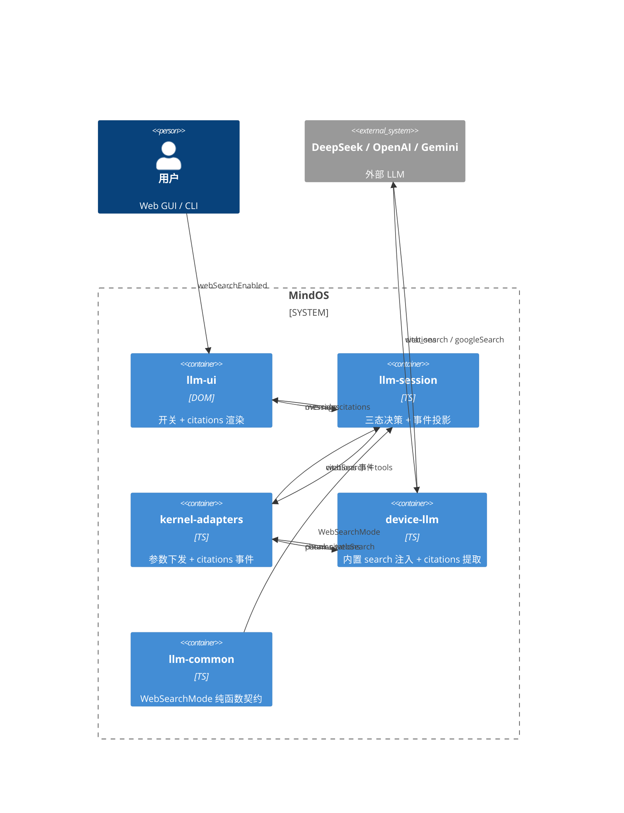
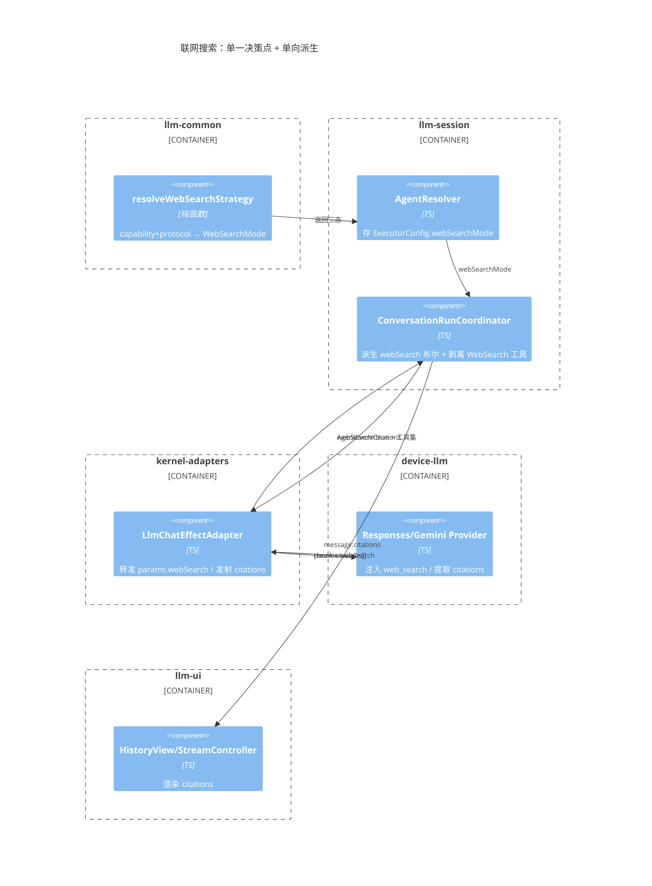

# 联网搜索（Server-side Web Search）

> 跨层特性：把「服务端内置联网搜索」（DeepSeek/OpenAI Responses 的 `web_search`、Gemini 的 `googleSearch` grounding）与「客户端统一 WebSearchTool」收敛为**单一三态决策 + 统一 `citations[]` 返回**。

## 1. 三态决策（WebSearchMode）

权威决策点只有一个：`resolveWebSearchStrategy`（`llm-common/src/llm/connection.ts`，纯函数、带单测）。下游只做**派生**，不再重推。

```ts
export type WebSearchMode = 'builtin' | 'client-tool' | 'disabled';

resolveWebSearchStrategy(capabilities?, enabled = true, protocol?): WebSearchMode
// enabled=false          → 'disabled'
// capabilities.serverSideWebSearch && protocol 支持内置 → 'builtin'
// 其余                    → 'client-tool'
```

三态语义：

| 态 | 内置 search | 客户端 WebSearchTool | 触发 |
|---|---|---|---|
| `builtin` | ✅ `webSearch=true` | ❌ 剥离 | provider 声明 `capabilities.serverSideWebSearch` 且协议为 `openai-responses` / `gemini-generate` |
| `client-tool` | ❌ | ✅ 注入 | 无内置能力，或协议不支持内置 |
| `disabled` | ❌ | ❌ 剥离 | 用户 toggle 关闭（`webSearchEnabled=false`） |

> 判别联合（而非两个布尔）天然排除「内置 + 客户端」重复检索的非法态。

## 2. C4 组件图

### 容器层（数据流方向）



### 组件层（决策单向派生）



## 3. 事件流

**下行（请求）**：`ExecutorConfig.webSearchMode` → `directTaskSpec` 派生 `webSearch` 布尔 + 剥离客户端工具 → `buildLlmTaskInput` → `DurableProgramInput.webSearch` → `LlmChatEffectAdapter` → `ChatCompletionParams.webSearch` → Provider 注入内置工具。

**上行（citations 返回）**：

```
Provider.collectCitations
  → ChatCompletionChunk.citations                (LLM 协议层)
  → LlmChatEffectAdapter emit('citations')       (Agent 事件层)
  → forwardAgentEvent 投影 'message:citations'   (会话投影层, 附加 messageId)
  → HistoryView → StreamController → NodeTemplates.renderCitations
```

> `citations` 原始 AgentEvent 投影后即返回，**不再重复发射**（无下游消费者，避免死事件）。`stream:content/thinking` 保留原始发射是因为它们作为 `immediateTypes` 触发 `EventBatchProcessor` 立即 flush。

## 4. 接口契约

| 类型 | 定义 | 说明 |
|---|---|---|
| `WebSearchMode` | `llm-common/llm/connection.ts` | 三态判别联合 `'builtin' \| 'client-tool' \| 'disabled'` |
| `resolveWebSearchStrategy` | `llm-common/llm/connection.ts` | 纯函数，`(capabilities?, enabled?, protocol?) → WebSearchMode` |
| `LLMProvider.capabilities.serverSideWebSearch` | `llm-common/llm/connection.ts` | 服务端内置联网搜索能力（唯一事实源） |
| `LLMProvider.responses.defaultThinkingEnabled` | `llm-common/llm/connection.ts` | Responses 推理行为（DeepSeek 默认开启思考） |
| `Citation` | `llm-common/llm/completion.ts` | `{ text, source?, title?, page?, url? }`，统一 web_search / grounding / MCP 来源 |
| `ExecutorConfig.webSearchMode` | `llm-session/core/types.ts` | 三态策略下发到 Direct Chat 编排层 |
| `ChatCompletionParams.webSearch` | `llm-common/llm/completion.ts` | 请求级布尔，仅 `builtin` 态为 true |

## 5. Provider 适配矩阵

| 厂商 | 协议 | 内置 search 机制 | citations 来源 |
|---|---|---|---|
| DeepSeek / OpenAI | `openai-responses` | 请求 tools 追加 `{type:'web_search'}` | `web_search_call` output item |
| Gemini | `gemini-generate` | 请求 tools 追加 `{googleSearch:{}}` | `candidates[].groundingMetadata` |
| Anthropic | `anthropic-messages` | 无内置参数，挂载 web_search MCP server | `tool_result` |

上层统一读 `response.citations[]`，不区分厂商实现。

## 6. 关键文件

| 场景 | 文件 |
|---|---|
| 三态策略纯函数 | `llm-common/src/llm/connection.ts` |
| 三态下发（ExecutorConfig） | `llm-session/src/core/types.ts` |
| 策略解析 | `llm-session/src/session/agent-resolver.ts` |
| 派生 + 剥离客户端工具 + 事件投影 | `llm-session/src/session/conversation-run-coordinator.ts` |
| override（toggle 关闭 → disabled） | `llm-session/src/session/session-run-coordinator.ts` |
| Responses API（web_search/reasoning/citations） | `device-llm/src/providers/responses.ts` |
| Gemini grounding citations | `device-llm/src/providers/gemini.ts` |
| citations 事件发射 + 流式聚合 | `kernel-adapters/src/effects/llm-chat-effect.ts` |
| citations 渲染 | `llm-ui/src/components/{HistoryView,history/StreamController,templates/NodeTemplates}.ts` |
| 联网搜索开关 | `llm-ui/src/components/input/ChatInputView.ts`、`templates/ChatInputTemplates.ts` |
| CLI -p prompt 命令 | `apps/cli/src/{cli,commands,schema,types}.ts` |
