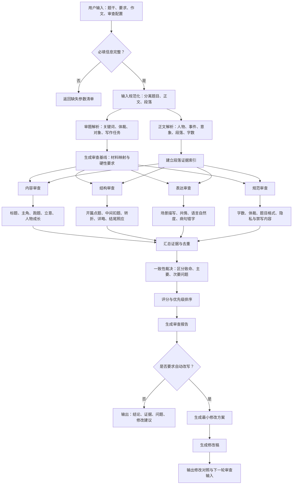

下面的 DAG 将当前会话中的审查方法固化为“先审题、再并行审查、最后统一裁决”的流程。内容、结构、表达、规范四个分支可以并行执行，提高速度，也避免某一项分析影响其他项判断。

## 一、作文自动审查 DAG



### 各并行审查节点的具体职责

| 节点    | 审查内容                                 |
| ----- | ------------------------------------ |
| 内容审查  | 题目是否合适、主角是否正确、是否跑题、材料是否完整落实、立意是否深刻   |
| 结构审查  | 开篇是否点题、中间是否多次扣题、转折是否合理、结尾是否回应开头并深化主旨 |
| 表达审查  | 描写是否具体、生动、能否引起共情，语言是否符合中学生口吻，有无人机感   |
| 规范审查  | 字数、段落、题目格式、错别字、病句、真实人名校名等硬性要求        |
| 一致性裁决 | 解决不同审查节点之间的矛盾，避免一处建议增加、另一处又要求删除      |
| 修改节点  | 按“先解决跑题，再调整结构，最后润色语言”的顺序修改           |

## 二、用户必须传入的参数

真正不可缺少的只有“作文要求”和“作文内容”。

| 参数                    | 是否必填 | 类型     | 说明                                                 |
| --------------------- | ---: | ------ | -------------------------------------------------- |
| `prompt.material`     |    是 | string | 作文材料或题干                                            |
| `prompt.requirements` |    是 | string | 字数、体裁、题目形式、禁写内容等                                   |
| `essay.title`         | 条件必填 | string | 自拟题、命题或半命题作文需要传入                                   |
| `essay.body`          |    是 | string | 作文正文                                               |
| `review.mode`         |    否 | enum   | `review`、`review_and_suggest`、`review_and_rewrite` |

如果用户没有单独填写字数、体裁等信息，系统可以先从 `prompt.requirements` 中自动提取。

## 三、建议传入的审查配置

| 参数                        | 示例                 | 作用             |
| ------------------------- | ------------------ | -------------- |
| `profile.grade_level`     | `初中/中考`            | 决定语言、思想深度和评分标准 |
| `profile.genre`           | `记叙文`              | 检查文章是否符合体裁     |
| `profile.target_chars`    | `650`              | 目标字数           |
| `profile.min_chars`       | `500`              | 最少字数           |
| `profile.max_chars`       | `700`              | 建议上限           |
| `profile.count_mode`      | `writing_grid`     | 明确标点是否计入字数     |
| `profile.strictness`      | `strict`           | 宽松、普通、严格       |
| `profile.score_total`     | `60`               | 满分值            |
| `profile.pass_score`      | `54`               | 自动改写停止分数       |
| `revision.preserve`       | `["水袖","站稳","越剧"]` | 修改时必须保留的素材或线索  |
| `revision.avoid`          | `["成人化表达","强行说理"]` | 修改时需要避免的问题     |
| `revision.scope`          | `minimal`          | 最小修改或整体重写      |
| `revision.max_rounds`     | `2`                | 最多自动修改轮次       |
| `output.include_evidence` | `true`             | 是否引用原文证据       |
| `output.include_diff`     | `true`             | 是否列出增加、修改、删除点  |
| `output.include_rewrite`  | `true`             | 是否输出完整修改稿      |

其中 `count_mode` 建议支持三种值：

* `writing_grid`：每个汉字和标点都占一格，适合考场作文；
* `han_only`：只统计汉字；
* `platform_counter`：按照文档编辑器的字符统计方式计算。

对于“650字左右”的中考作文，建议默认使用 `writing_grid`。

## 四、完整输入示例

```json
{
  "prompt": {
    "material": "水许愿成为一片雪花，从大海出发……大地看见水，水看见自己。",
    "requirements": "题目自拟，不少于500字，不得出现真实人名、校名和地名。"
  },
  "essay": {
    "title": "水袖起落间，我看见自己",
    "body": "幕布后，老师正要提醒我沉肩……"
  },
  "profile": {
    "grade_level": "初中/中考",
    "genre": "记叙文",
    "target_chars": 650,
    "min_chars": 500,
    "max_chars": 700,
    "count_mode": "writing_grid",
    "strictness": "strict",
    "score_total": 60,
    "pass_score": 54
  },
  "checks": {
    "title_fit": true,
    "protagonist_fit": true,
    "off_topic": true,
    "material_mapping": true,
    "theme_depth": true,
    "opening_topic": true,
    "middle_callbacks": true,
    "ending_response": true,
    "detail_balance": true,
    "description_empathy": true,
    "language_naturalness": true,
    "grammar_and_typos": true
  },
  "revision": {
    "mode": "review_and_rewrite",
    "scope": "minimal",
    "preserve": [
      "越剧",
      "水袖",
      "站稳",
      "男生传承传统艺术"
    ],
    "avoid": [
      "成人化表达",
      "空洞议论",
      "强行点题",
      "增加无关支线"
    ],
    "max_rounds": 2
  },
  "output": {
    "include_score": true,
    "include_paragraph_evidence": true,
    "include_priority_fixes": true,
    "include_line_edits": true,
    "include_rewrite": true,
    "include_diff": true
  }
}
```

## 五、建议的自动审查输出

每次执行后固定输出以下内容：

1. 审题结论：题目、主角、体裁、是否跑题；
2. 材料对应表：材料每层含义在文中的落点；
3. 结构审查：开头、中间、转折、结尾；
4. 详略与描写审查；
5. 语言、病句、错字检查；
6. 字数和段落统计；
7. 按严重程度排列的问题清单；
8. 逐句修改建议；
9. 可选的650字修改稿；
10. 原稿与修改稿的增加、删除、替换对照。

需要注意：严格意义上的 DAG 不能形成循环。因此“修改后再次审查”不应在图内画回边。可以让当前 DAG 输出 `next_run_input`，再由外层程序重新执行；或者根据 `max_rounds` 预先展开为“审查1→修改1→审查2→修改2”，这样仍然是无环结构。
