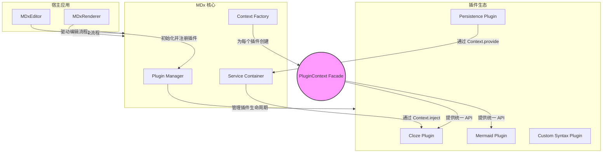

## MDx 插件化架构设计文档

**版本**: 1.0
**作者**: AI Architect
**日期**: 2023-10-27

### 1. 概述与愿景 (Overview & Vision)

#### 1.1. 背景
当前的 MDx 库是一个功能强大、高度集成的 Markdown 编辑与渲染解决方案。然而，其紧耦合的 monolithic（单体）架构限制了其可扩展性和可维护性，使得添加新功能或进行定制化开发变得困难且风险高。

#### 1.2. 愿景
本设计旨在将 MDx 从一个功能固定的库，**演进为一个以插件为中心、高度可扩展、面向未来的内容处理平台**。核心库将变得轻量、稳定，而丰富的功能（如 Cloze、Mermaid 图表、自定义语法等）将由独立的、可插拔的插件提供。这将为构建一个活跃的开发者社区和繁荣的插件生态奠定坚实的基础。

#### 1.3. 设计目标
*   **高度解耦 (Decoupling)**: 核心逻辑与功能插件严格分离。
*   **极致可扩展 (Extensibility)**: 允许开发者轻松扩展语法、UI、交互行为和数据处理流程。
*   **卓越的开发者体验 (Developer Experience)**: 提供清晰、简洁、强大的插件 API，降低插件开发门槛。
*   **灵活性 (Flexibility)**: 用户可以按需组合插件，构建满足特定需求的编辑器和渲染器。
*   **健壮性与稳定性 (Robustness & Stability)**: 核心库的变更频率降低，插件的迭代不会影响核心的稳定性。

### 2. 核心架构 (Core Architecture)

我们将采用一种结合了**依赖注入 (DI)**、**立面模式 (Facade)** 和**生命周期钩子 (Lifecycle Hooks)** 的现代化插件架构。

#### 2.1. 架构图



#### 2.2. 核心组件职责
*   **MDxCore (核心)**: 作为渲染器 (`MDxRenderer`) 和编辑器 (`MDxEditor`) 的底层引擎，负责协调所有核心组件。
*   **Plugin Manager (插件管理器)**: 负责插件的注册、加载和生命周期管理（安装 `install` 和销毁 `destroy`）。
*   **Service Container (服务容器)**: 实现了 `provide`/`inject` 机制，是插件间安全、解耦通信的关键。
*   **Context Factory (上下文工厂)**: 负责为每个插件在安装时创建一个专属的 `PluginContext` 对象。
*   **PluginContext (插件上下文/立面)**: 这是**插件与核心交互的唯一入口**。它将核心的复杂性（如钩子系统、服务容器、组件注册表）封装起来，为插件开发者提供一个稳定、简洁的 API 接口。

### 3. 关键接口设计 (Key Interface Design)

#### 3.1. `MDxPlugin` 接口
这是所有插件必须遵循的基本契约。

```typescript
// src/core/plugin.ts
interface MDxPlugin {
    /**
     * 插件的唯一名称，用于标识和依赖管理。
     * 建议采用 'namespace:plugin-name' 格式。
     */
    name: string;

    /**
     * [核心] 插件的安装入口函数。
     * 当插件被 use() 方法注册时，此函数将被调用一次。
     * @param context - 插件上下文对象，提供了与 MDx 核心交互的所有 API。
     */
    install(context: PluginContext): void;

    /**
     * [可选] 插件的销毁函数。
     * 当编辑器/渲染器实例被销毁时调用，用于清理定时器、事件监听等副作用。
     */
    destroy?(): void;
}
```

#### 3.2. `PluginContext` 接口
这是整个插件系统的灵魂，是插件开发者的“瑞士军刀”。

```typescript
// src/core/context.ts
interface PluginContext {
    // --- 渲染流程扩展 ---
    /**
     * 注册一个 Marked.js 语法扩展。
     * 这是添加自定义 Markdown 语法的标准方式。
     * @param extension - 符合 Marked.js 扩展规范的对象。
     */
    registerSyntaxExtension(extension: any): void;

    /**
     * 注册一个可替换的渲染组件。
     * 允许插件用自定义的渲染逻辑（例如 React/Vue/Svelte 组件）覆盖默认的 HTML 元素渲染。
     * @param componentName - 组件名称 (如 'cloze', 'task-list-item')。
     * @param factory - 一个工厂函数，接收 DOM 元素和数据，返回一个组件实例或控制器。
     */
    registerComponent(componentName: string, factory: (element: HTMLElement, options: any) => any): void;

    // --- 生命周期钩子 ---
    /**
     * 监听核心生命周期事件。
     * @param hook - 钩子名称。
     * @param callback - 当钩子被触发时执行的回调函数。
     */
    on(hook: 'beforeParse' | 'afterRender' | 'domUpdated', callback: Function): void;

    // --- 服务与依赖注入 ---
    /**
     * 向服务容器提供一个服务（一个对象、类实例或函数）。
     * 其他插件可以通过 inject() 方法来使用此服务。
     * @param key - 服务的唯一标识，强烈建议使用 Symbol 以避免命名冲突。
     * @param service - 要提供的服务实例。
     */
    provide<T>(key: symbol | string, service: T): void;

    /**
     * 从服务容器中注入一个由其他插件提供的服务。
     * @param key - 服务的唯一标识。
     * @returns 返回找到的服务实例，如果不存在则返回 undefined。
     */
    inject<T>(key: symbol | string): T | undefined;

    // --- 编辑器扩展 ---
    /**
     * 注册一个编辑器命令。
     * @param commandName - 命令的唯一名称。
     * @param commandFn - 命令的执行函数，接收 CodeMirror EditorView 实例。
     */
    registerCommand(commandName: string, commandFn: (view: any) => void): void;

    /**
     * 注册一个工具栏按钮。
     * @param buttonConfig - 按钮的配置对象 { id, title, icon, command }。
     */
    registerToolbarButton(buttonConfig: any): void;

    // --- 事件总线 ---
    /**
     * 触发一个全局事件，供其他插件监听。
     * @param eventName - 事件名称。
     * @param payload - 传递给监听器的数据。
     */
    emit(eventName: string, payload: any): void;
}
```

### 4. 数据与控制流 (Data & Control Flow)

#### 4.1. 渲染流程 (Render Flow)

当 `renderer.render(markdownText)` 被调用时：

1.  **初始化**: `MDxRenderer` 确保所有通过 `.use()` 注册的插件的 `install` 方法都已被调用。
2.  **`beforeParse` 钩子**: 核心触发 `beforeParse` 钩子。所有监听此钩子的插件按注册顺序执行，可以依次修改 `markdownText`。
3.  **语法解析**: 修改后的 `markdownText` 连同所有通过 `registerSyntaxExtension` 注册的扩展，被传递给 `marked.parse()`，生成初步的 HTML 字符串。
4.  **`afterRender` 钩子**: 核心触发 `afterRender` 钩子，插件可以对此时的 HTML 字符串进行操作（例如，使用正则替换）。
5.  **DOM 注入**: 最终的 HTML 字符串被注入到目标 DOM 元素中 (`element.innerHTML = ...`)。
6.  **`domUpdated` 钩子**: 这是**最重要**的交互钩子。核心在 DOM 更新后触发此钩子。
    *   插件在此阶段遍历 DOM，找到自己负责的元素（如 `.cloze`, `.mermaid`）。
    *   执行组件化 (`registerComponent`)、附加事件监听、初始化第三方库（如 Mermaid.js, MathJax）等操作。
    *   插件可以通过 `context.emit()` 触发事件，通知其他插件自己的工作已完成。

#### 4.2. 编辑器命令流 (Editor Command Flow)

1.  **插件安装**: `MDxEditor` 初始化时，`ClozePlugin` 等插件通过 `context.registerCommand` 和 `context.registerToolbarButton` 注册命令和按钮。
2.  **UI 渲染**: `MDxEditor` 读取所有注册的按钮配置，动态生成工具栏。
3.  **用户交互**: 用户点击“Cloze”按钮。
4.  **命令分发**: 按钮的 `onclick` 事件处理器被触发，它调用核心的命令执行器，并传入命令名称（例如 `'applyCloze'`）。
5.  **命令执行**: 核心命令执行器在其命令注册表中查找 `'applyCloze'`，并执行与之关联的函数（该函数由 `ClozePlugin` 在安装时提供），并将 `EditorView` 实例作为参数传入。

### 5. 核心实现要点 (Core Implementation)

#### 5.1. `MDxCore` (或 `MDxRenderer`/`MDxEditor`)

```typescript
// src/renderer.ts (简化版)
class MDxRenderer {
    private pluginManager: PluginManager;
    private serviceContainer: ServiceContainer;

    constructor(plugins: MDxPlugin[] = []) {
        this.serviceContainer = new ServiceContainer();
        this.pluginManager = new PluginManager(this, this.serviceContainer);

        plugins.forEach(plugin => this.use(plugin));
    }

    public use(plugin: MDxPlugin): this {
        this.pluginManager.register(plugin);
        return this;
    }

    public async render(element: HTMLElement, markdown: string) {
        // ... 实现 4.1 节描述的渲染流程 ...
        // 1. 触发 beforeParse
        const modifiedMarkdown = this.pluginManager.executeHook('beforeParse', markdown);
        // 2. 收集语法扩展并解析
        const extensions = this.pluginManager.getSyntaxExtensions();
        const html = marked.parse(modifiedMarkdown, { extensions });
        // 3. 触发 afterRender
        const finalHtml = this.pluginManager.executeHook('afterRender', html);
        // 4. 注入 DOM
        element.innerHTML = finalHtml;
        // 5. 触发 domUpdated (异步)
        await this.pluginManager.executeHookAsync('domUpdated', element);
    }
}
```

#### 5.2. `PluginManager`

```typescript
// src/core/plugin-manager.ts
class PluginManager {
    private plugins: Map<string, MDxPlugin> = new Map();
    // ... 其他注册表，如 hooks, commands, extensions ...

    constructor(private coreInstance: any, private services: ServiceContainer) {}

    public register(plugin: MDxPlugin) {
        if (this.plugins.has(plugin.name)) {
            console.warn(`Plugin "${plugin.name}" is already registered.`);
            return;
        }
        this.plugins.set(plugin.name, plugin);

        // 创建并传入 PluginContext
        const context = this.createContextFor(plugin);
        plugin.install(context);
    }
    
    private createContextFor(plugin: MDxPlugin): PluginContext {
        // 返回一个实现了 PluginContext 接口的对象
        // 这个对象的方法会调用 PluginManager 和 ServiceContainer 的内部方法
        return {
            registerSyntaxExtension: (ext) => this.extensions.push(ext),
            provide: (key, service) => this.services.provide(key, service),
            inject: (key) => this.services.inject(key),
            // ... etc.
        };
    }

    // ... executeHook, executeHookAsync 等方法的实现 ...
}
```

### 6. 插件开发实践 (Plugin Development in Practice)

#### 6.1. 示例 1: 简单的 Spoiler 语法插件

```typescript
// plugins/spoiler.plugin.ts
const spoilerExtension = {
    name: 'spoiler',
    level: 'inline',
    start: (src) => src.indexOf('||'),
    tokenizer: (src) => {
        const rule = /^\|\|(.*?)\|\|/;
        const match = rule.exec(src);
        if (match) return { type: 'spoiler', raw: match[0], text: match[1] };
    },
    renderer: (token) => `<span class="spoiler">${token.text}</span>`,
};

export const SpoilerPlugin = {
    name: 'core:spoiler',
    install(context) {
        context.registerSyntaxExtension(spoilerExtension);
    }
};
```
**使用**: `new MDxRenderer([SpoilerPlugin])`

#### 6.2. 示例 2: Cloze 插件 (展示服务和命令)

```typescript
// plugins/cloze/cloze.plugin.ts
import { ClozeAPI } from './cloze.api';
import { clozeExtension } from './cloze.syntax';
import { applyClozeCommand } from './cloze.command';

export const ClozeAPIKey = Symbol('ClozeAPI');

export class ClozePlugin implements MDxPlugin {
    name = 'feature:cloze';
    private api: ClozeAPI;

    install(context: PluginContext) {
        this.api = new ClozeAPI();

        // 1. 提供服务
        context.provide(ClozeAPIKey, this.api);

        // 2. 注册语法
        context.registerSyntaxExtension(clozeExtension);

        // 3. 注册命令和按钮
        context.registerCommand('applyCloze', applyClozeCommand);
        context.registerToolbarButton({ id: 'cloze', title: 'Cloze', command: 'applyCloze', icon: 'C' });

        // 4. 监听 DOM 更新以初始化交互
        context.on('domUpdated', (element: HTMLElement) => {
            this.api.initialize(element);
        });
    }

    destroy() {
        this.api.destroy(); // 清理事件监听器
    }
}
```

#### 6.3. 示例 3: 第三方分析插件 (使用服务和事件)

```typescript
// plugins/analytics.plugin.ts
import { ClozeAPIKey } from './cloze/cloze.plugin';

export const AnalyticsPlugin = {
    name: 'integration:analytics',
    install(context) {
        // 尝试注入 Cloze API
        const clozeApi = context.inject(ClozeAPIKey);

        // 如果 Cloze 插件存在，则监听其事件
        if (clozeApi) {
            // 注意: ClozeAPI 需要自己实现事件系统
            clozeApi.on('revealed', (detail) => {
                console.log('Sending analytics event: cloze_revealed', detail);
                // window.analytics.track('Cloze Revealed', { clozeId: detail.clozeId });
            });
        }
        
        // 监听核心事件
        context.on('domUpdated', () => {
             console.log('Content re-rendered.');
        });
    }
};
```

### 7. 高级主题与最佳实践

*   **插件依赖**: 初期，插件加载顺序即为依赖顺序。未来可引入显式的 `dependencies` 字段，由 `PluginManager` 进行拓扑排序或在插件缺失时发出警告。
*   **性能考量**: 核心库应监测并警告执行时间过长的钩子函数。插件开发者应避免在 `beforeParse` 等同步、高频钩子中执行重度操作。DOM 操作应尽可能集中在 `domUpdated` 钩子中。
*   **安全性**: 对于接受第三方插件的场景，应考虑对 `PluginContext` 的能力进行限制，或对插件的执行环境进行沙箱化处理，防止恶意插件访问全局对象或执行危险操作。
*   **版本管理**: 插件应声明其兼容的核心库版本范围，核心库在加载插件时进行校验。

---
这份设计文档为 MDx 库的插件化重构提供了全面的蓝图。它不仅定义了技术架构，更重要的是，它建立了一套能够激发社区创造力、保证长期健康发展的生态系统规则。